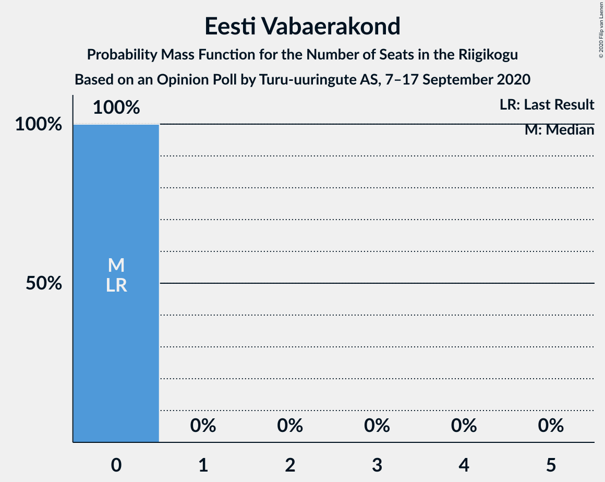

# Opinion Poll by Turu-uuringute AS, 7–17 September 2020

<a href="#voting-intentions">Voting Intentions</a> | <a href="#seats">Seats</a> | <a href="#coalitions">Coalitions</a> | <a href="#technical-information">Technical Information</a>

## Voting Intentions

### Confidence Intervals

| Party | Last Result | Poll Result | 80% Confidence Interval | 90% Confidence Interval | 95% Confidence Interval | 99% Confidence Interval |
|:-----:|:-----------:|:-----------:|:-----------------------:|:-----------------------:|:-----------------------:|:-----------------------:|
| Eesti Reformierakond | 28.9% | 27.0% | 25.3–28.9% |24.8–29.4% |24.4–29.9% |23.6–30.8% |
| Eesti Keskerakond | 23.1% | 24.0% | 22.3–25.7% |21.8–26.3% |21.4–26.7% |20.7–27.6% |
| Eesti Konservatiivne Rahvaerakond | 17.8% | 16.0% | 14.6–17.6% |14.2–18.0% |13.9–18.4% |13.3–19.2% |
| Sotsiaaldemokraatlik Erakond | 9.8% | 11.0% | 9.8–12.3% |9.5–12.7% |9.2–13.1% |8.7–13.7% |
| Eesti 200 | 4.4% | 9.0% | 7.9–10.3% |7.7–10.6% |7.4–10.9% |6.9–11.6% |
| Erakond Isamaa | 11.4% | 5.0% | 4.3–6.1% |4.0–6.3% |3.9–6.6% |3.5–7.1% |
| Eesti Vabaerakond | 1.2% | 3.0% | 2.4–3.8% |2.2–4.0% |2.1–4.2% |1.8–4.6% |
| Erakond Eestimaa Rohelised | 1.8% | 3.0% | 2.4–3.8% |2.2–4.0% |2.1–4.2% |1.8–4.6% |

*Note:* The poll result column reflects the actual value used in the calculations. Published results may vary slightly, and in addition be rounded to fewer digits.

## Seats

### Confidence Intervals

| Party | Last Result | Median | 80% Confidence Interval | 90% Confidence Interval | 95% Confidence Interval | 99% Confidence Interval |
|:-----:|:-----------:|:------:|:-----------------------:|:-----------------------:|:-----------------------:|:-----------------------:|
| <a href="#eesti-reformierakond">Eesti Reformierakond</a> | 34 | 32 | 30–35 |29–35 |28–36 |27–37 |
| <a href="#eesti-keskerakond">Eesti Keskerakond</a> | 26 | 28 | 25–30 |25–31 |24–32 |23–33 |
| <a href="#eesti-konservatiivne-rahvaerakond">Eesti Konservatiivne Rahvaerakond</a> | 19 | 18 | 16–20 |15–20 |15–21 |14–22 |
| <a href="#sotsiaaldemokraatlik-erakond">Sotsiaaldemokraatlik Erakond</a> | 10 | 11 | 10–13 |10–14 |9–14 |9–15 |
| <a href="#eesti-200">Eesti 200</a> | 0 | 9 | 8–11 |7–11 |7–11 |7–12 |
| <a href="#erakond-isamaa">Erakond Isamaa</a> | 12 | 5 | 0–6 |0–6 |0–6 |0–7 |
| <a href="#eesti-vabaerakond">Eesti Vabaerakond</a> | 0 | 0 | 0 |0 |0 |0 |
| <a href="#erakond-eestimaa-rohelised">Erakond Eestimaa Rohelised</a> | 0 | 0 | 0 |0 |0 |0 |

### Eesti Reformierakond

*For a full overview of the results for this party, see the [Eesti Reformierakond](party-eestireformierakond.html) page.*

| Number of Seats | Probability | Accumulated | Special Marks |
|:---------------:|:-----------:|:-----------:|:-------------:|
| 26 | 0.1% | 100% |  |
| 27 | 0.8% | 99.8% |  |
| 28 | 3% | 99.0% |  |
| 29 | 6% | 96% |  |
| 30 | 15% | 90% |  |
| 31 | 21% | 76% |  |
| 32 | 19% | 55% | Median |
| 33 | 13% | 35% |  |
| 34 | 13% | 23% | Last Result |
| 35 | 5% | 10% |  |
| 36 | 4% | 5% |  |
| 37 | 0.8% | 1.0% |  |
| 38 | 0.1% | 0.2% |  |
| 39 | 0% | 0.1% |  |
| 40 | 0% | 0% |  |

### Eesti Keskerakond

*For a full overview of the results for this party, see the [Eesti Keskerakond](party-eestikeskerakond.html) page.*

| Number of Seats | Probability | Accumulated | Special Marks |
|:---------------:|:-----------:|:-----------:|:-------------:|
| 22 | 0.1% | 100% |  |
| 23 | 0.6% | 99.9% |  |
| 24 | 3% | 99.3% |  |
| 25 | 6% | 96% |  |
| 26 | 12% | 90% | Last Result |
| 27 | 26% | 78% |  |
| 28 | 15% | 52% | Median |
| 29 | 16% | 38% |  |
| 30 | 12% | 21% |  |
| 31 | 6% | 9% |  |
| 32 | 2% | 3% |  |
| 33 | 0.7% | 0.9% |  |
| 34 | 0.2% | 0.2% |  |
| 35 | 0% | 0% |  |

### Eesti Konservatiivne Rahvaerakond

*For a full overview of the results for this party, see the [Eesti Konservatiivne Rahvaerakond](party-eestikonservatiivnerahvaerakond.html) page.*

| Number of Seats | Probability | Accumulated | Special Marks |
|:---------------:|:-----------:|:-----------:|:-------------:|
| 13 | 0.1% | 100% |  |
| 14 | 0.9% | 99.9% |  |
| 15 | 7% | 99.0% |  |
| 16 | 13% | 92% |  |
| 17 | 18% | 79% |  |
| 18 | 35% | 61% | Median |
| 19 | 15% | 27% | Last Result |
| 20 | 7% | 11% |  |
| 21 | 3% | 4% |  |
| 22 | 0.8% | 0.9% |  |
| 23 | 0.1% | 0.1% |  |
| 24 | 0% | 0% |  |

### Sotsiaaldemokraatlik Erakond

*For a full overview of the results for this party, see the [Sotsiaaldemokraatlik Erakond](party-sotsiaaldemokraatlikerakond.html) page.*

| Number of Seats | Probability | Accumulated | Special Marks |
|:---------------:|:-----------:|:-----------:|:-------------:|
| 8 | 0.4% | 100% |  |
| 9 | 4% | 99.6% |  |
| 10 | 18% | 96% | Last Result |
| 11 | 33% | 78% | Median |
| 12 | 24% | 44% |  |
| 13 | 14% | 21% |  |
| 14 | 5% | 7% |  |
| 15 | 1.0% | 1.1% |  |
| 16 | 0.1% | 0.1% |  |
| 17 | 0% | 0% |  |

### Eesti 200

*For a full overview of the results for this party, see the [Eesti 200](party-eesti200.html) page.*

| Number of Seats | Probability | Accumulated | Special Marks |
|:---------------:|:-----------:|:-----------:|:-------------:|
| 0 | 0% | 100% | Last Result |
| 1 | 0% | 100% |  |
| 2 | 0% | 100% |  |
| 3 | 0% | 100% |  |
| 4 | 0% | 100% |  |
| 5 | 0% | 100% |  |
| 6 | 0.5% | 100% |  |
| 7 | 5% | 99.5% |  |
| 8 | 24% | 95% |  |
| 9 | 37% | 71% | Median |
| 10 | 22% | 34% |  |
| 11 | 9% | 12% |  |
| 12 | 2% | 2% |  |
| 13 | 0.2% | 0.2% |  |
| 14 | 0% | 0% |  |

### Erakond Isamaa

*For a full overview of the results for this party, see the [Erakond Isamaa](party-erakondisamaa.html) page.*

| Number of Seats | Probability | Accumulated | Special Marks |
|:---------------:|:-----------:|:-----------:|:-------------:|
| 0 | 44% | 100% |  |
| 1 | 0% | 56% |  |
| 2 | 0% | 56% |  |
| 3 | 0% | 56% |  |
| 4 | 4% | 56% |  |
| 5 | 41% | 52% | Median |
| 6 | 10% | 11% |  |
| 7 | 0.9% | 0.9% |  |
| 8 | 0% | 0% |  |
| 9 | 0% | 0% |  |
| 10 | 0% | 0% |  |
| 11 | 0% | 0% |  |
| 12 | 0% | 0% | Last Result |

### Eesti Vabaerakond

*For a full overview of the results for this party, see the [Eesti Vabaerakond](party-eestivabaerakond.html) page.*

| Number of Seats | Probability | Accumulated | Special Marks |
|:---------------:|:-----------:|:-----------:|:-------------:|
| 0 | 100% | 100% | Last Result, Median |

### Erakond Eestimaa Rohelised

*For a full overview of the results for this party, see the [Erakond Eestimaa Rohelised](party-erakondeestimaarohelised.html) page.*

| Number of Seats | Probability | Accumulated | Special Marks |
|:---------------:|:-----------:|:-----------:|:-------------:|
| 0 | 99.9% | 100% | Last Result, Median |
| 1 | 0% | 0.1% |  |
| 2 | 0% | 0.1% |  |
| 3 | 0% | 0.1% |  |
| 4 | 0% | 0.1% |  |
| 5 | 0.1% | 0.1% |  |
| 6 | 0% | 0% |  |

## Coalitions

### Confidence Intervals

| Coalition | Last Result | Median | Majority? | 80% Confidence Interval | 90% Confidence Interval | 95% Confidence Interval | 99% Confidence Interval |
|:---------:|:-----------:|:------:|:---------:|:-----------------------:|:-----------------------:|:-----------------------:|:-----------------------:|
| Eesti Reformierakond – Eesti Keskerakond – Eesti Konservatiivne Rahvaerakond | 79 | 77 | 100% | 74–81 | 74–82 | 73–82 | 72–83 |
| Eesti Reformierakond – Eesti Keskerakond | 60 | 60 | 100% | 57–63 | 56–64 | 55–64 | 54–66 |
| Eesti Reformierakond – Eesti Konservatiivne Rahvaerakond – Erakond Isamaa | 65 | 53 | 79% | 49–55 | 49–56 | 48–57 | 47–58 |
| Eesti Reformierakond – Eesti Konservatiivne Rahvaerakond | 53 | 50 | 34% | 47–53 | 46–54 | 45–54 | 44–56 |
| Eesti Keskerakond – Eesti Konservatiivne Rahvaerakond – Erakond Isamaa | 57 | 49 | 18% | 45–51 | 44–52 | 43–53 | 43–54 |
| Eesti Reformierakond – Sotsiaaldemokraatlik Erakond – Erakond Isamaa – Eesti Vabaerakond | 56 | 46 | 3% | 43–49 | 42–50 | 42–51 | 40–52 |
| Eesti Reformierakond – Sotsiaaldemokraatlik Erakond – Erakond Isamaa | 56 | 46 | 3% | 43–49 | 42–50 | 42–51 | 40–52 |
| Eesti Keskerakond – Eesti Konservatiivne Rahvaerakond | 45 | 45 | 2% | 43–49 | 42–49 | 41–50 | 40–51 |
| Eesti Reformierakond – Sotsiaaldemokraatlik Erakond | 44 | 43 | 0% | 41–46 | 40–47 | 39–48 | 38–49 |
| Eesti Keskerakond – Sotsiaaldemokraatlik Erakond – Erakond Isamaa | 48 | 42 | 0% | 39–45 | 38–46 | 37–47 | 36–48 |
| Eesti Keskerakond – Sotsiaaldemokraatlik Erakond | 36 | 39 | 0% | 37–43 | 36–43 | 35–44 | 34–45 |
| Eesti Reformierakond – Erakond Isamaa | 46 | 35 | 0% | 31–38 | 31–39 | 30–39 | 29–41 |
| Eesti Konservatiivne Rahvaerakond – Sotsiaaldemokraatlik Erakond | 29 | 29 | 0% | 27–32 | 26–32 | 26–33 | 25–34 |

### Eesti Reformierakond – Eesti Keskerakond – Eesti Konservatiivne Rahvaerakond

| Number of Seats | Probability | Accumulated | Special Marks |
|:---------------:|:-----------:|:-----------:|:-------------:|
| 70 | 0.1% | 100% |  |
| 71 | 0.1% | 99.9% |  |
| 72 | 1.2% | 99.8% |  |
| 73 | 3% | 98.6% |  |
| 74 | 8% | 95% |  |
| 75 | 12% | 87% |  |
| 76 | 14% | 76% |  |
| 77 | 15% | 61% |  |
| 78 | 9% | 46% | Median |
| 79 | 9% | 37% | Last Result |
| 80 | 12% | 28% |  |
| 81 | 9% | 16% |  |
| 82 | 5% | 6% |  |
| 83 | 1.0% | 1.3% |  |
| 84 | 0.2% | 0.3% |  |
| 85 | 0% | 0% |  |

### Eesti Reformierakond – Eesti Keskerakond

| Number of Seats | Probability | Accumulated | Special Marks |
|:---------------:|:-----------:|:-----------:|:-------------:|
| 53 | 0.1% | 100% |  |
| 54 | 0.6% | 99.8% |  |
| 55 | 3% | 99.3% |  |
| 56 | 5% | 96% |  |
| 57 | 10% | 91% |  |
| 58 | 14% | 82% |  |
| 59 | 17% | 68% |  |
| 60 | 15% | 51% | Last Result, Median |
| 61 | 8% | 36% |  |
| 62 | 13% | 28% |  |
| 63 | 6% | 15% |  |
| 64 | 6% | 9% |  |
| 65 | 2% | 2% |  |
| 66 | 0.5% | 0.7% |  |
| 67 | 0.1% | 0.2% |  |
| 68 | 0% | 0% |  |

### Eesti Reformierakond – Eesti Konservatiivne Rahvaerakond – Erakond Isamaa

| Number of Seats | Probability | Accumulated | Special Marks |
|:---------------:|:-----------:|:-----------:|:-------------:|
| 45 | 0.1% | 100% |  |
| 46 | 0.3% | 99.9% |  |
| 47 | 1.2% | 99.6% |  |
| 48 | 3% | 98% |  |
| 49 | 6% | 95% |  |
| 50 | 9% | 89% |  |
| 51 | 13% | 79% | Majority |
| 52 | 14% | 66% |  |
| 53 | 17% | 52% |  |
| 54 | 12% | 34% |  |
| 55 | 12% | 22% | Median |
| 56 | 5% | 10% |  |
| 57 | 3% | 4% |  |
| 58 | 1.0% | 1.2% |  |
| 59 | 0.2% | 0.2% |  |
| 60 | 0% | 0% |  |
| 61 | 0% | 0% |  |
| 62 | 0% | 0% |  |
| 63 | 0% | 0% |  |
| 64 | 0% | 0% |  |
| 65 | 0% | 0% | Last Result |

### Eesti Reformierakond – Eesti Konservatiivne Rahvaerakond

| Number of Seats | Probability | Accumulated | Special Marks |
|:---------------:|:-----------:|:-----------:|:-------------:|
| 43 | 0.2% | 100% |  |
| 44 | 1.2% | 99.8% |  |
| 45 | 2% | 98.5% |  |
| 46 | 4% | 96% |  |
| 47 | 10% | 92% |  |
| 48 | 15% | 82% |  |
| 49 | 14% | 68% |  |
| 50 | 20% | 54% | Median |
| 51 | 12% | 34% | Majority |
| 52 | 11% | 22% |  |
| 53 | 5% | 10% | Last Result |
| 54 | 4% | 5% |  |
| 55 | 1.0% | 2% |  |
| 56 | 0.5% | 0.6% |  |
| 57 | 0.1% | 0.1% |  |
| 58 | 0% | 0% |  |

### Eesti Keskerakond – Eesti Konservatiivne Rahvaerakond – Erakond Isamaa

| Number of Seats | Probability | Accumulated | Special Marks |
|:---------------:|:-----------:|:-----------:|:-------------:|
| 41 | 0.1% | 100% |  |
| 42 | 0.4% | 99.9% |  |
| 43 | 2% | 99.5% |  |
| 44 | 3% | 97% |  |
| 45 | 5% | 94% |  |
| 46 | 8% | 89% |  |
| 47 | 13% | 81% |  |
| 48 | 17% | 69% |  |
| 49 | 14% | 52% |  |
| 50 | 20% | 38% |  |
| 51 | 10% | 18% | Median, Majority |
| 52 | 5% | 8% |  |
| 53 | 2% | 3% |  |
| 54 | 0.9% | 1.2% |  |
| 55 | 0.2% | 0.3% |  |
| 56 | 0% | 0% |  |
| 57 | 0% | 0% | Last Result |

### Eesti Reformierakond – Sotsiaaldemokraatlik Erakond – Erakond Isamaa – Eesti Vabaerakond

| Number of Seats | Probability | Accumulated | Special Marks |
|:---------------:|:-----------:|:-----------:|:-------------:|
| 39 | 0.1% | 100% |  |
| 40 | 0.5% | 99.9% |  |
| 41 | 2% | 99.4% |  |
| 42 | 4% | 98% |  |
| 43 | 10% | 94% |  |
| 44 | 7% | 84% |  |
| 45 | 15% | 78% |  |
| 46 | 14% | 63% |  |
| 47 | 19% | 49% |  |
| 48 | 13% | 30% | Median |
| 49 | 8% | 17% |  |
| 50 | 6% | 9% |  |
| 51 | 2% | 3% | Majority |
| 52 | 0.6% | 0.9% |  |
| 53 | 0.3% | 0.3% |  |
| 54 | 0% | 0% |  |
| 55 | 0% | 0% |  |
| 56 | 0% | 0% | Last Result |

### Eesti Reformierakond – Sotsiaaldemokraatlik Erakond – Erakond Isamaa

| Number of Seats | Probability | Accumulated | Special Marks |
|:---------------:|:-----------:|:-----------:|:-------------:|
| 39 | 0.1% | 100% |  |
| 40 | 0.5% | 99.9% |  |
| 41 | 2% | 99.4% |  |
| 42 | 4% | 98% |  |
| 43 | 10% | 94% |  |
| 44 | 7% | 84% |  |
| 45 | 15% | 78% |  |
| 46 | 14% | 63% |  |
| 47 | 19% | 49% |  |
| 48 | 13% | 30% | Median |
| 49 | 8% | 17% |  |
| 50 | 6% | 9% |  |
| 51 | 2% | 3% | Majority |
| 52 | 0.6% | 0.9% |  |
| 53 | 0.3% | 0.3% |  |
| 54 | 0% | 0% |  |
| 55 | 0% | 0% |  |
| 56 | 0% | 0% | Last Result |

### Eesti Keskerakond – Eesti Konservatiivne Rahvaerakond

| Number of Seats | Probability | Accumulated | Special Marks |
|:---------------:|:-----------:|:-----------:|:-------------:|
| 39 | 0.2% | 100% |  |
| 40 | 0.6% | 99.8% |  |
| 41 | 2% | 99.2% |  |
| 42 | 6% | 97% |  |
| 43 | 9% | 91% |  |
| 44 | 12% | 82% |  |
| 45 | 22% | 70% | Last Result |
| 46 | 14% | 48% | Median |
| 47 | 11% | 35% |  |
| 48 | 13% | 23% |  |
| 49 | 7% | 11% |  |
| 50 | 2% | 4% |  |
| 51 | 1.3% | 2% | Majority |
| 52 | 0.3% | 0.4% |  |
| 53 | 0.1% | 0.1% |  |
| 54 | 0% | 0% |  |

### Eesti Reformierakond – Sotsiaaldemokraatlik Erakond

| Number of Seats | Probability | Accumulated | Special Marks |
|:---------------:|:-----------:|:-----------:|:-------------:|
| 37 | 0.3% | 100% |  |
| 38 | 0.5% | 99.7% |  |
| 39 | 2% | 99.2% |  |
| 40 | 5% | 97% |  |
| 41 | 11% | 92% |  |
| 42 | 19% | 81% |  |
| 43 | 19% | 62% | Median |
| 44 | 12% | 43% | Last Result |
| 45 | 14% | 31% |  |
| 46 | 8% | 17% |  |
| 47 | 5% | 9% |  |
| 48 | 3% | 4% |  |
| 49 | 0.6% | 0.9% |  |
| 50 | 0.3% | 0.4% |  |
| 51 | 0% | 0% | Majority |

### Eesti Keskerakond – Sotsiaaldemokraatlik Erakond – Erakond Isamaa

| Number of Seats | Probability | Accumulated | Special Marks |
|:---------------:|:-----------:|:-----------:|:-------------:|
| 35 | 0.1% | 100% |  |
| 36 | 0.9% | 99.9% |  |
| 37 | 2% | 98.9% |  |
| 38 | 5% | 97% |  |
| 39 | 5% | 92% |  |
| 40 | 8% | 87% |  |
| 41 | 15% | 79% |  |
| 42 | 15% | 64% |  |
| 43 | 22% | 49% |  |
| 44 | 11% | 27% | Median |
| 45 | 7% | 16% |  |
| 46 | 5% | 9% |  |
| 47 | 2% | 3% |  |
| 48 | 1.2% | 1.5% | Last Result |
| 49 | 0.2% | 0.2% |  |
| 50 | 0% | 0% |  |

### Eesti Keskerakond – Sotsiaaldemokraatlik Erakond

| Number of Seats | Probability | Accumulated | Special Marks |
|:---------------:|:-----------:|:-----------:|:-------------:|
| 33 | 0.2% | 100% |  |
| 34 | 0.5% | 99.8% |  |
| 35 | 2% | 99.4% |  |
| 36 | 7% | 97% | Last Result |
| 37 | 11% | 90% |  |
| 38 | 21% | 79% |  |
| 39 | 13% | 58% | Median |
| 40 | 13% | 45% |  |
| 41 | 13% | 32% |  |
| 42 | 9% | 20% |  |
| 43 | 8% | 10% |  |
| 44 | 2% | 3% |  |
| 45 | 0.6% | 0.8% |  |
| 46 | 0.1% | 0.2% |  |
| 47 | 0% | 0.1% |  |
| 48 | 0% | 0% |  |

### Eesti Reformierakond – Erakond Isamaa

| Number of Seats | Probability | Accumulated | Special Marks |
|:---------------:|:-----------:|:-----------:|:-------------:|
| 27 | 0% | 100% |  |
| 28 | 0.2% | 99.9% |  |
| 29 | 1.4% | 99.7% |  |
| 30 | 3% | 98% |  |
| 31 | 6% | 95% |  |
| 32 | 10% | 89% |  |
| 33 | 11% | 79% |  |
| 34 | 12% | 69% |  |
| 35 | 14% | 56% |  |
| 36 | 19% | 43% |  |
| 37 | 10% | 24% | Median |
| 38 | 6% | 14% |  |
| 39 | 6% | 8% |  |
| 40 | 2% | 2% |  |
| 41 | 0.4% | 0.5% |  |
| 42 | 0.1% | 0.1% |  |
| 43 | 0% | 0% |  |
| 44 | 0% | 0% |  |
| 45 | 0% | 0% |  |
| 46 | 0% | 0% | Last Result |

### Eesti Konservatiivne Rahvaerakond – Sotsiaaldemokraatlik Erakond

| Number of Seats | Probability | Accumulated | Special Marks |
|:---------------:|:-----------:|:-----------:|:-------------:|
| 23 | 0% | 100% |  |
| 24 | 0.4% | 99.9% |  |
| 25 | 1.4% | 99.6% |  |
| 26 | 5% | 98% |  |
| 27 | 10% | 93% |  |
| 28 | 17% | 83% |  |
| 29 | 24% | 66% | Last Result, Median |
| 30 | 20% | 42% |  |
| 31 | 12% | 22% |  |
| 32 | 6% | 10% |  |
| 33 | 4% | 5% |  |
| 34 | 1.0% | 1.3% |  |
| 35 | 0.2% | 0.3% |  |
| 36 | 0.1% | 0.1% |  |
| 37 | 0% | 0% |  |

## Technical Information

### Opinion Poll

+ **Polling firm:** Turu-uuringute AS
+ **Commissioner(s):** —
+ **Fieldwork period:** 7–17 September 2020

### Calculations

+ **Sample size:** 1010
+ **Simulations done:** 1,048,576
+ **Error estimate:** 1.31%

