# Opinion Poll by Norstat for MTÜ Ühiskonnauuringute Instituut, 15–21 September 2020

<a href="#voting-intentions">Voting Intentions</a> | <a href="#seats">Seats</a> | <a href="#coalitions">Coalitions</a> | <a href="#technical-information">Technical Information</a>

## Voting Intentions

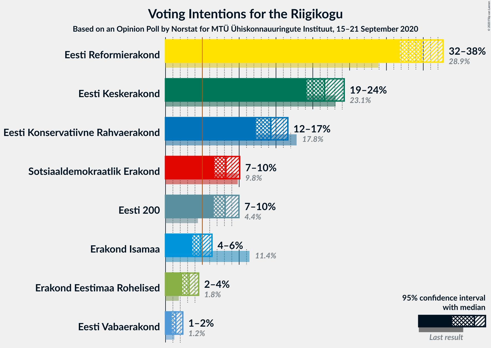

### Confidence Intervals

| Party | Last Result | Poll Result | 80% Confidence Interval | 90% Confidence Interval | 95% Confidence Interval | 99% Confidence Interval |
|:-----:|:-----------:|:-----------:|:-----------------------:|:-----------------------:|:-----------------------:|:-----------------------:|
| Eesti Reformierakond | 28.9% | 34.7% | 32.8–36.7% |32.3–37.2% |31.8–37.7% |30.9–38.7% |
| Eesti Keskerakond | 23.1% | 21.6% | 20.0–23.3% |19.5–23.8% |19.2–24.3% |18.4–25.1% |
| Eesti Konservatiivne Rahvaerakond | 17.8% | 14.3% | 13.0–15.8% |12.6–16.2% |12.3–16.6% |11.6–17.4% |
| Sotsiaaldemokraatlik Erakond | 9.8% | 8.2% | 7.2–9.4% |6.9–9.8% |6.6–10.1% |6.2–10.7% |
| Eesti 200 | 4.4% | 8.1% | 7.1–9.3% |6.8–9.7% |6.6–10.0% |6.1–10.6% |
| Erakond Isamaa | 11.4% | 4.8% | 4.0–5.8% |3.8–6.1% |3.6–6.3% |3.3–6.8% |
| Erakond Eestimaa Rohelised | 1.8% | 3.2% | 2.6–4.0% |2.4–4.3% |2.3–4.5% |2.0–4.9% |
| Eesti Vabaerakond | 1.2% | 1.4% | 1.0–2.0% |0.9–2.2% |0.8–2.3% |0.7–2.7% |

*Note:* The poll result column reflects the actual value used in the calculations. Published results may vary slightly, and in addition be rounded to fewer digits.

## Seats

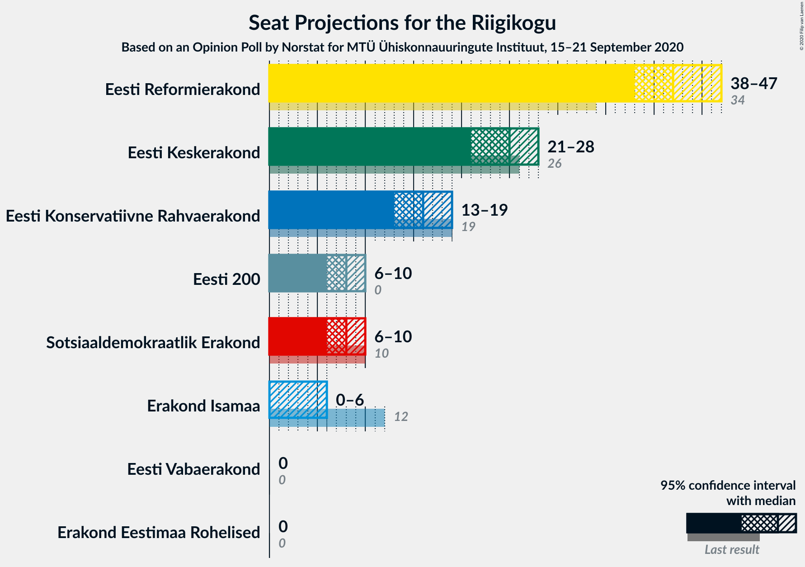

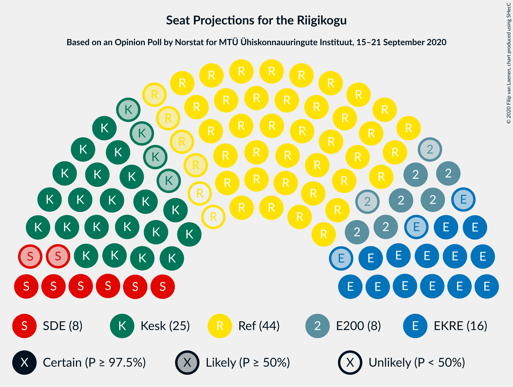

### Confidence Intervals

| Party | Last Result | Median | 80% Confidence Interval | 90% Confidence Interval | 95% Confidence Interval | 99% Confidence Interval |
|:-----:|:-----------:|:------:|:-----------------------:|:-----------------------:|:-----------------------:|:-----------------------:|
| <a href="#eesti-reformierakond">Eesti Reformierakond</a> | 34 | 42 | 39–45 |39–46 |38–47 |37–48 |
| <a href="#eesti-keskerakond">Eesti Keskerakond</a> | 26 | 25 | 22–27 |22–28 |21–28 |20–29 |
| <a href="#eesti-konservatiivne-rahvaerakond">Eesti Konservatiivne Rahvaerakond</a> | 19 | 16 | 14–17 |13–18 |13–19 |12–19 |
| <a href="#sotsiaaldemokraatlik-erakond">Sotsiaaldemokraatlik Erakond</a> | 10 | 8 | 7–10 |7–10 |6–10 |6–11 |
| <a href="#eesti-200">Eesti 200</a> | 0 | 8 | 7–9 |6–10 |6–10 |6–11 |
| <a href="#erakond-isamaa">Erakond Isamaa</a> | 12 | 0 | 0–5 |0–5 |0–6 |0–6 |
| <a href="#erakond-eestimaa-rohelised">Erakond Eestimaa Rohelised</a> | 0 | 0 | 0 |0 |0 |0 |
| <a href="#eesti-vabaerakond">Eesti Vabaerakond</a> | 0 | 0 | 0 |0 |0 |0 |

### Eesti Reformierakond

*For a full overview of the results for this party, see the [Eesti Reformierakond](party-eestireformierakond.html) page.*

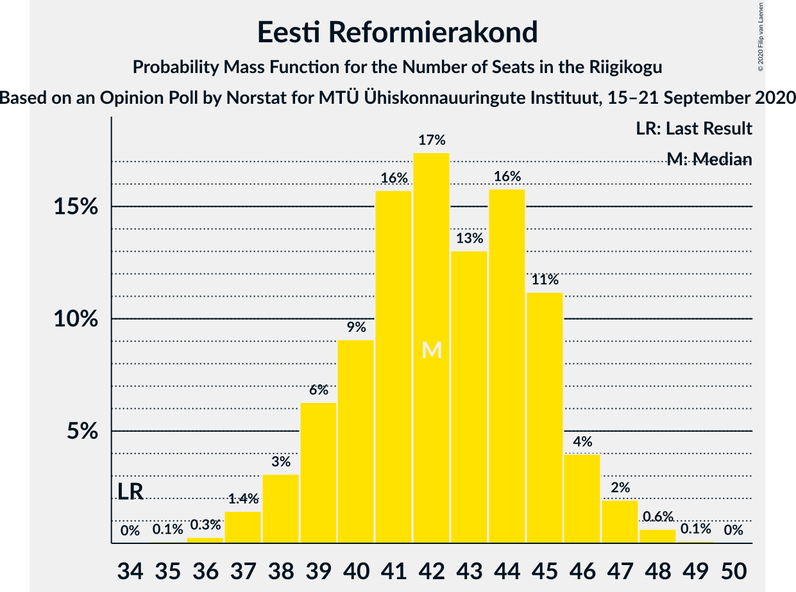

| Number of Seats | Probability | Accumulated | Special Marks |
|:---------------:|:-----------:|:-----------:|:-------------:|
| 34 | 0% | 100% | Last Result |
| 35 | 0.1% | 100% |  |
| 36 | 0.3% | 99.9% |  |
| 37 | 1.4% | 99.6% |  |
| 38 | 3% | 98% |  |
| 39 | 6% | 95% |  |
| 40 | 9% | 89% |  |
| 41 | 16% | 80% |  |
| 42 | 17% | 64% | Median |
| 43 | 13% | 47% |  |
| 44 | 16% | 34% |  |
| 45 | 11% | 18% |  |
| 46 | 4% | 7% |  |
| 47 | 2% | 3% |  |
| 48 | 0.6% | 0.8% |  |
| 49 | 0.1% | 0.1% |  |
| 50 | 0% | 0% |  |

### Eesti Keskerakond

*For a full overview of the results for this party, see the [Eesti Keskerakond](party-eestikeskerakond.html) page.*

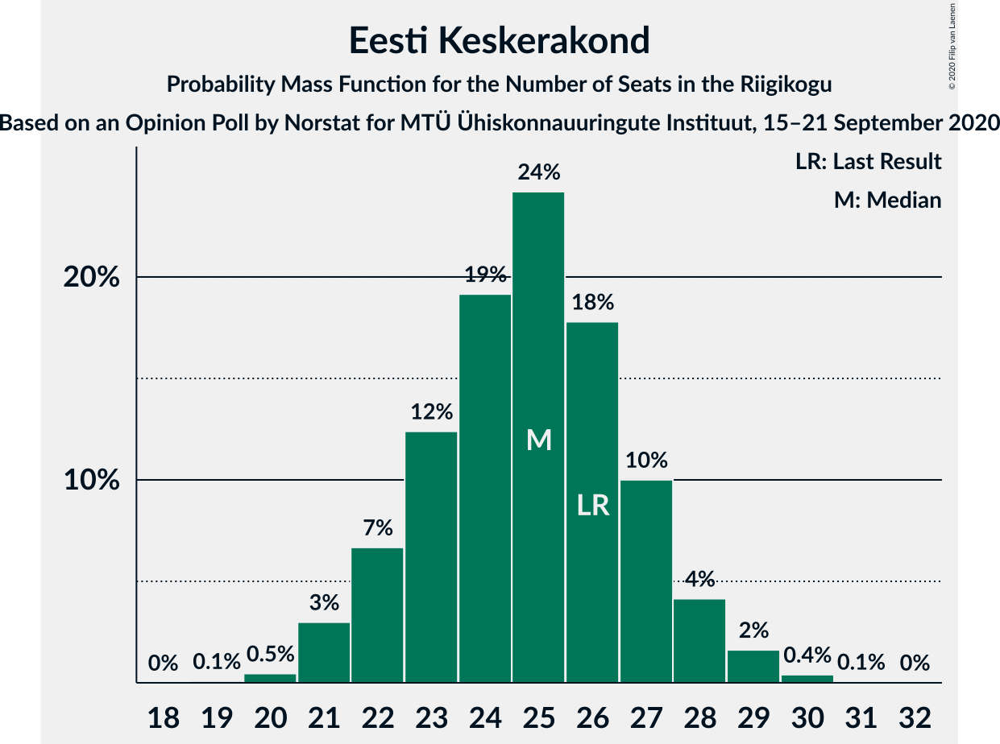

| Number of Seats | Probability | Accumulated | Special Marks |
|:---------------:|:-----------:|:-----------:|:-------------:|
| 19 | 0.1% | 100% |  |
| 20 | 0.5% | 99.9% |  |
| 21 | 3% | 99.5% |  |
| 22 | 7% | 96% |  |
| 23 | 12% | 90% |  |
| 24 | 19% | 77% |  |
| 25 | 24% | 58% | Median |
| 26 | 18% | 34% | Last Result |
| 27 | 10% | 16% |  |
| 28 | 4% | 6% |  |
| 29 | 2% | 2% |  |
| 30 | 0.4% | 0.5% |  |
| 31 | 0.1% | 0.1% |  |
| 32 | 0% | 0% |  |

### Eesti Konservatiivne Rahvaerakond

*For a full overview of the results for this party, see the [Eesti Konservatiivne Rahvaerakond](party-eestikonservatiivnerahvaerakond.html) page.*

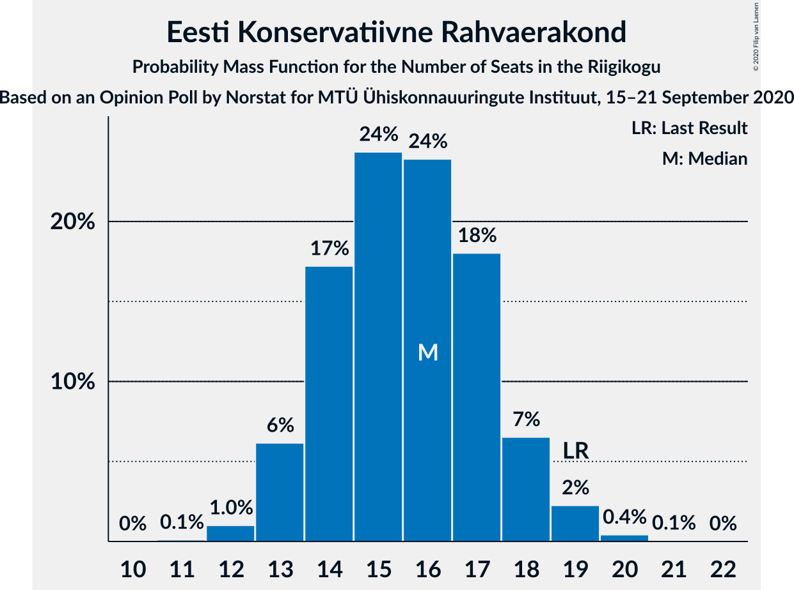

| Number of Seats | Probability | Accumulated | Special Marks |
|:---------------:|:-----------:|:-----------:|:-------------:|
| 11 | 0.1% | 100% |  |
| 12 | 1.0% | 99.9% |  |
| 13 | 6% | 98.9% |  |
| 14 | 17% | 93% |  |
| 15 | 24% | 76% |  |
| 16 | 24% | 51% | Median |
| 17 | 18% | 27% |  |
| 18 | 7% | 9% |  |
| 19 | 2% | 3% | Last Result |
| 20 | 0.4% | 0.5% |  |
| 21 | 0.1% | 0.1% |  |
| 22 | 0% | 0% |  |

### Sotsiaaldemokraatlik Erakond

*For a full overview of the results for this party, see the [Sotsiaaldemokraatlik Erakond](party-sotsiaaldemokraatlikerakond.html) page.*

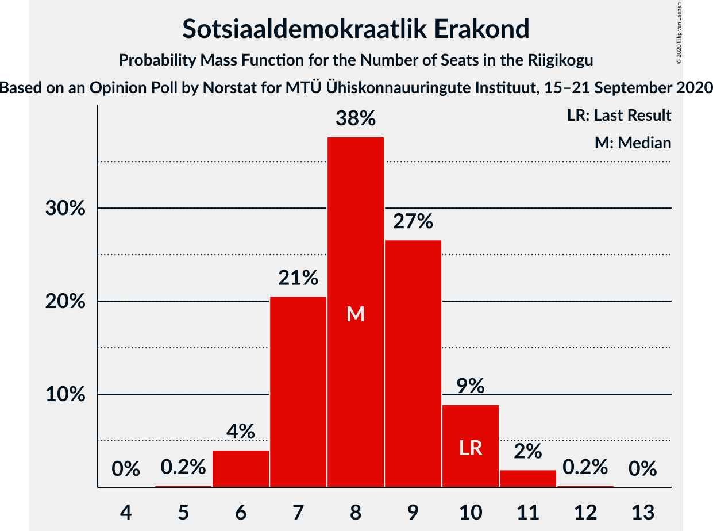

| Number of Seats | Probability | Accumulated | Special Marks |
|:---------------:|:-----------:|:-----------:|:-------------:|
| 5 | 0.2% | 100% |  |
| 6 | 4% | 99.8% |  |
| 7 | 21% | 96% |  |
| 8 | 38% | 75% | Median |
| 9 | 27% | 38% |  |
| 10 | 9% | 11% | Last Result |
| 11 | 2% | 2% |  |
| 12 | 0.2% | 0.2% |  |
| 13 | 0% | 0% |  |

### Eesti 200

*For a full overview of the results for this party, see the [Eesti 200](party-eesti200.html) page.*

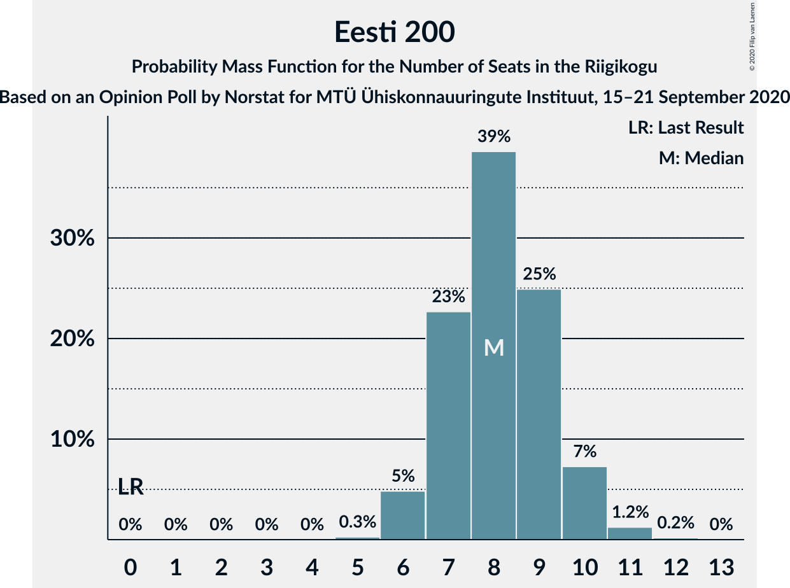

| Number of Seats | Probability | Accumulated | Special Marks |
|:---------------:|:-----------:|:-----------:|:-------------:|
| 0 | 0% | 100% | Last Result |
| 1 | 0% | 100% |  |
| 2 | 0% | 100% |  |
| 3 | 0% | 100% |  |
| 4 | 0% | 100% |  |
| 5 | 0.3% | 100% |  |
| 6 | 5% | 99.7% |  |
| 7 | 23% | 95% |  |
| 8 | 39% | 72% | Median |
| 9 | 25% | 34% |  |
| 10 | 7% | 9% |  |
| 11 | 1.2% | 1.4% |  |
| 12 | 0.2% | 0.2% |  |
| 13 | 0% | 0% |  |

### Erakond Isamaa

*For a full overview of the results for this party, see the [Erakond Isamaa](party-erakondisamaa.html) page.*

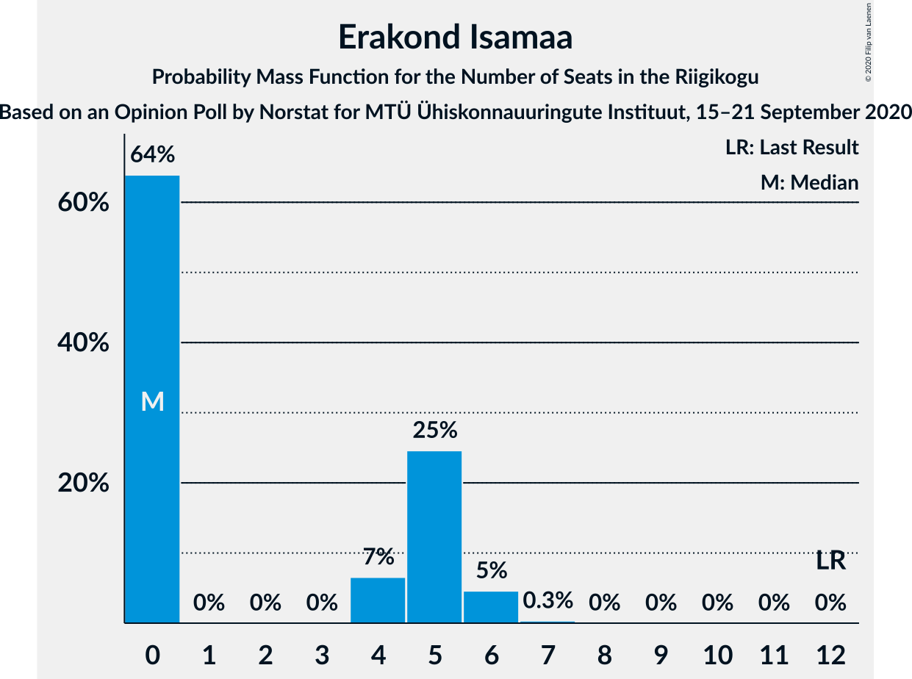

| Number of Seats | Probability | Accumulated | Special Marks |
|:---------------:|:-----------:|:-----------:|:-------------:|
| 0 | 64% | 100% | Median |
| 1 | 0% | 36% |  |
| 2 | 0% | 36% |  |
| 3 | 0% | 36% |  |
| 4 | 7% | 36% |  |
| 5 | 25% | 30% |  |
| 6 | 5% | 5% |  |
| 7 | 0.3% | 0.3% |  |
| 8 | 0% | 0% |  |
| 9 | 0% | 0% |  |
| 10 | 0% | 0% |  |
| 11 | 0% | 0% |  |
| 12 | 0% | 0% | Last Result |

### Erakond Eestimaa Rohelised

*For a full overview of the results for this party, see the [Erakond Eestimaa Rohelised](party-erakondeestimaarohelised.html) page.*

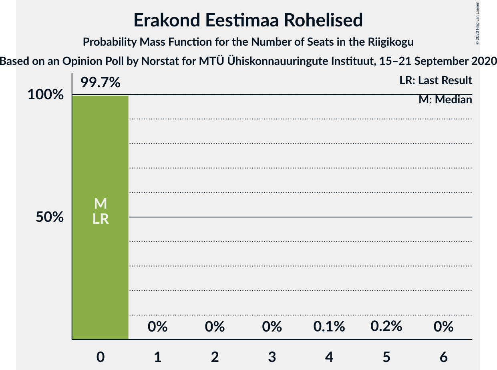

| Number of Seats | Probability | Accumulated | Special Marks |
|:---------------:|:-----------:|:-----------:|:-------------:|
| 0 | 99.7% | 100% | Last Result, Median |
| 1 | 0% | 0.3% |  |
| 2 | 0% | 0.3% |  |
| 3 | 0% | 0.3% |  |
| 4 | 0.1% | 0.3% |  |
| 5 | 0.2% | 0.2% |  |
| 6 | 0% | 0% |  |

### Eesti Vabaerakond

*For a full overview of the results for this party, see the [Eesti Vabaerakond](party-eestivabaerakond.html) page.*

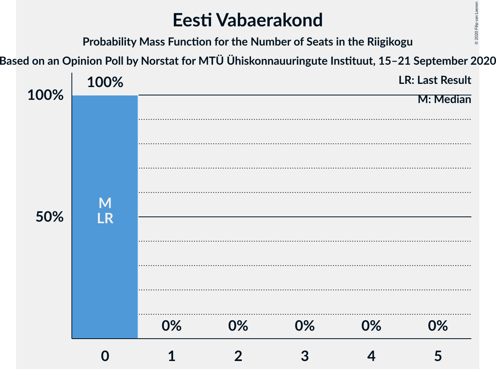

| Number of Seats | Probability | Accumulated | Special Marks |
|:---------------:|:-----------:|:-----------:|:-------------:|
| 0 | 100% | 100% | Last Result, Median |

## Coalitions

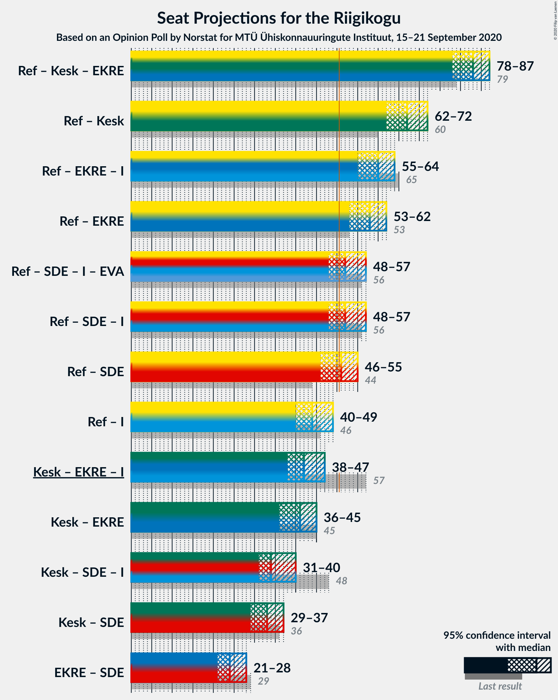

### Confidence Intervals

| Coalition | Last Result | Median | Majority? | 80% Confidence Interval | 90% Confidence Interval | 95% Confidence Interval | 99% Confidence Interval |
|:---------:|:-----------:|:------:|:---------:|:-----------------------:|:-----------------------:|:-----------------------:|:-----------------------:|
| Eesti Reformierakond – Eesti Keskerakond – Eesti Konservatiivne Rahvaerakond | 79 | 83 | 100% | 79–86 | 79–86 | 78–87 | 76–88 |
| Eesti Reformierakond – Eesti Keskerakond | 60 | 67 | 100% | 64–71 | 63–71 | 62–72 | 61–73 |
| Eesti Reformierakond – Eesti Konservatiivne Rahvaerakond – Erakond Isamaa | 65 | 60 | 100% | 57–63 | 56–63 | 55–64 | 54–65 |
| Eesti Reformierakond – Eesti Konservatiivne Rahvaerakond | 53 | 58 | 99.9% | 55–61 | 54–62 | 53–62 | 52–63 |
| Eesti Reformierakond – Sotsiaaldemokraatlik Erakond – Erakond Isamaa – Eesti Vabaerakond | 56 | 52 | 78% | 50–56 | 49–56 | 48–57 | 46–58 |
| Eesti Reformierakond – Sotsiaaldemokraatlik Erakond – Erakond Isamaa | 56 | 52 | 78% | 50–56 | 49–56 | 48–57 | 46–58 |
| Eesti Reformierakond – Sotsiaaldemokraatlik Erakond | 44 | 51 | 52% | 48–53 | 46–55 | 46–55 | 44–56 |
| Eesti Reformierakond – Erakond Isamaa | 46 | 44 | 0.4% | 41–47 | 41–48 | 40–49 | 38–50 |
| Eesti Keskerakond – Eesti Konservatiivne Rahvaerakond – Erakond Isamaa | 57 | 42 | 0% | 39–45 | 38–46 | 38–47 | 36–49 |
| Eesti Keskerakond – Eesti Konservatiivne Rahvaerakond | 45 | 41 | 0% | 38–43 | 37–44 | 36–45 | 35–46 |
| Eesti Keskerakond – Sotsiaaldemokraatlik Erakond – Erakond Isamaa | 48 | 34 | 0% | 32–38 | 31–39 | 31–40 | 29–41 |
| Eesti Keskerakond – Sotsiaaldemokraatlik Erakond | 36 | 33 | 0% | 30–36 | 29–36 | 29–37 | 28–38 |
| Eesti Konservatiivne Rahvaerakond – Sotsiaaldemokraatlik Erakond | 29 | 24 | 0% | 22–26 | 21–27 | 21–28 | 19–28 |

### Eesti Reformierakond – Eesti Keskerakond – Eesti Konservatiivne Rahvaerakond

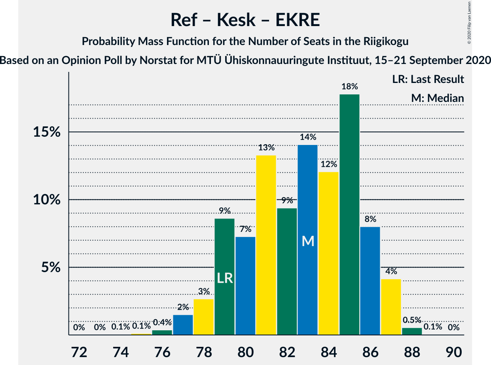

| Number of Seats | Probability | Accumulated | Special Marks |
|:---------------:|:-----------:|:-----------:|:-------------:|
| 74 | 0.1% | 100% |  |
| 75 | 0.1% | 99.9% |  |
| 76 | 0.4% | 99.8% |  |
| 77 | 2% | 99.4% |  |
| 78 | 3% | 98% |  |
| 79 | 9% | 95% | Last Result |
| 80 | 7% | 87% |  |
| 81 | 13% | 79% |  |
| 82 | 9% | 66% |  |
| 83 | 14% | 57% | Median |
| 84 | 12% | 43% |  |
| 85 | 18% | 31% |  |
| 86 | 8% | 13% |  |
| 87 | 4% | 5% |  |
| 88 | 0.5% | 0.6% |  |
| 89 | 0.1% | 0.1% |  |
| 90 | 0% | 0% |  |

### Eesti Reformierakond – Eesti Keskerakond

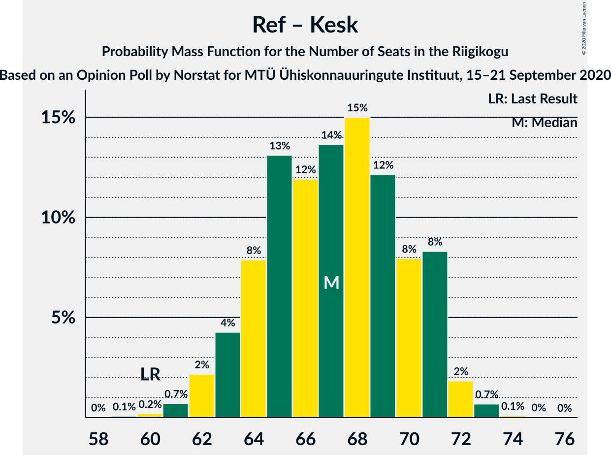

| Number of Seats | Probability | Accumulated | Special Marks |
|:---------------:|:-----------:|:-----------:|:-------------:|
| 59 | 0.1% | 100% |  |
| 60 | 0.2% | 99.9% | Last Result |
| 61 | 0.7% | 99.7% |  |
| 62 | 2% | 99.0% |  |
| 63 | 4% | 97% |  |
| 64 | 8% | 93% |  |
| 65 | 13% | 85% |  |
| 66 | 12% | 72% |  |
| 67 | 14% | 60% | Median |
| 68 | 15% | 46% |  |
| 69 | 12% | 31% |  |
| 70 | 8% | 19% |  |
| 71 | 8% | 11% |  |
| 72 | 2% | 3% |  |
| 73 | 0.7% | 0.8% |  |
| 74 | 0.1% | 0.1% |  |
| 75 | 0% | 0% |  |

### Eesti Reformierakond – Eesti Konservatiivne Rahvaerakond – Erakond Isamaa

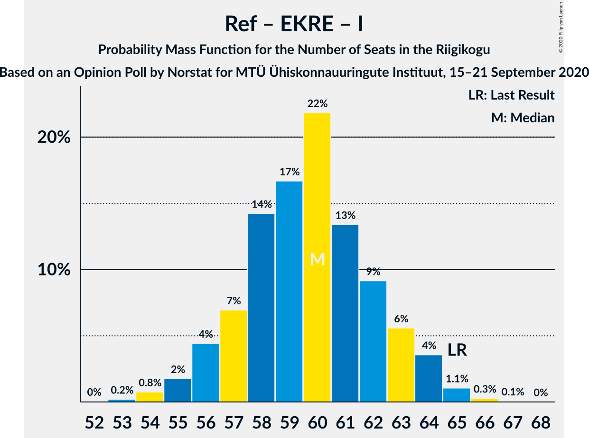

| Number of Seats | Probability | Accumulated | Special Marks |
|:---------------:|:-----------:|:-----------:|:-------------:|
| 52 | 0% | 100% |  |
| 53 | 0.2% | 99.9% |  |
| 54 | 0.8% | 99.7% |  |
| 55 | 2% | 99.0% |  |
| 56 | 4% | 97% |  |
| 57 | 7% | 93% |  |
| 58 | 14% | 86% | Median |
| 59 | 17% | 72% |  |
| 60 | 22% | 55% |  |
| 61 | 13% | 33% |  |
| 62 | 9% | 20% |  |
| 63 | 6% | 11% |  |
| 64 | 4% | 5% |  |
| 65 | 1.1% | 1.4% | Last Result |
| 66 | 0.3% | 0.3% |  |
| 67 | 0.1% | 0.1% |  |
| 68 | 0% | 0% |  |

### Eesti Reformierakond – Eesti Konservatiivne Rahvaerakond

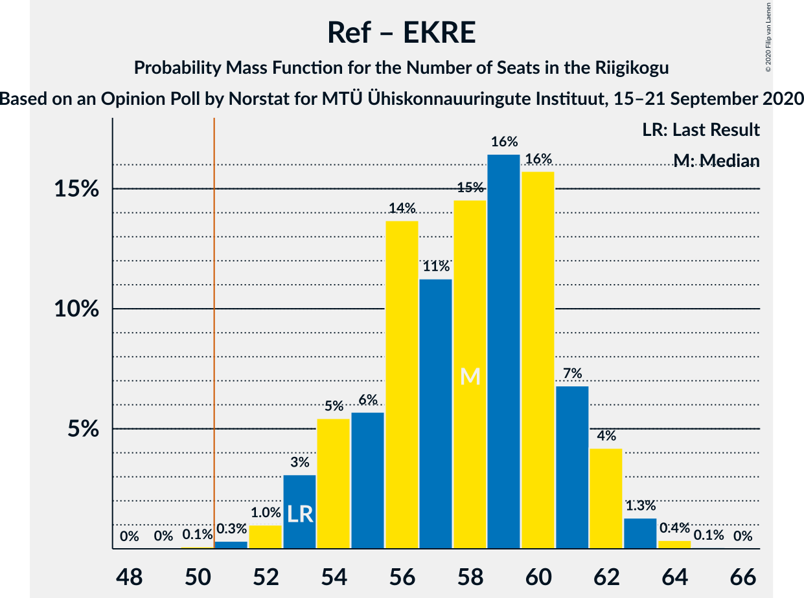

| Number of Seats | Probability | Accumulated | Special Marks |
|:---------------:|:-----------:|:-----------:|:-------------:|
| 50 | 0.1% | 100% |  |
| 51 | 0.3% | 99.9% | Majority |
| 52 | 1.0% | 99.6% |  |
| 53 | 3% | 98.6% | Last Result |
| 54 | 5% | 95% |  |
| 55 | 6% | 90% |  |
| 56 | 14% | 84% |  |
| 57 | 11% | 71% |  |
| 58 | 15% | 59% | Median |
| 59 | 16% | 45% |  |
| 60 | 16% | 28% |  |
| 61 | 7% | 13% |  |
| 62 | 4% | 6% |  |
| 63 | 1.3% | 2% |  |
| 64 | 0.4% | 0.4% |  |
| 65 | 0.1% | 0.1% |  |
| 66 | 0% | 0% |  |

### Eesti Reformierakond – Sotsiaaldemokraatlik Erakond – Erakond Isamaa – Eesti Vabaerakond

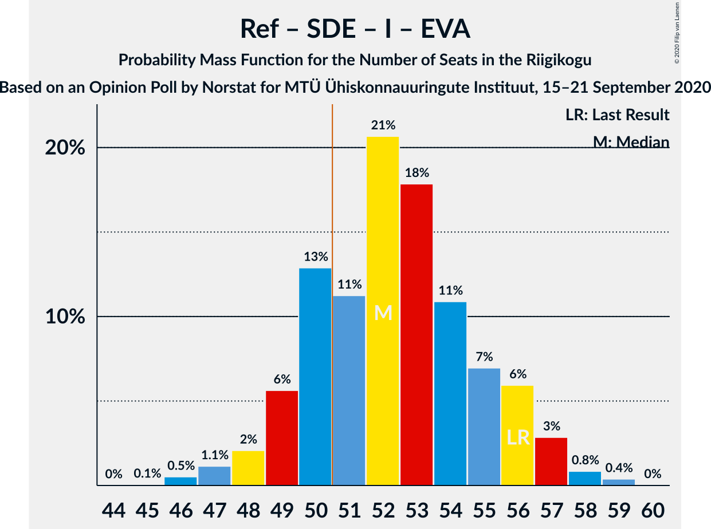

| Number of Seats | Probability | Accumulated | Special Marks |
|:---------------:|:-----------:|:-----------:|:-------------:|
| 45 | 0.1% | 100% |  |
| 46 | 0.5% | 99.9% |  |
| 47 | 1.1% | 99.4% |  |
| 48 | 2% | 98% |  |
| 49 | 6% | 96% |  |
| 50 | 13% | 91% | Median |
| 51 | 11% | 78% | Majority |
| 52 | 21% | 66% |  |
| 53 | 18% | 46% |  |
| 54 | 11% | 28% |  |
| 55 | 7% | 17% |  |
| 56 | 6% | 10% | Last Result |
| 57 | 3% | 4% |  |
| 58 | 0.8% | 1.3% |  |
| 59 | 0.4% | 0.4% |  |
| 60 | 0% | 0% |  |

### Eesti Reformierakond – Sotsiaaldemokraatlik Erakond – Erakond Isamaa

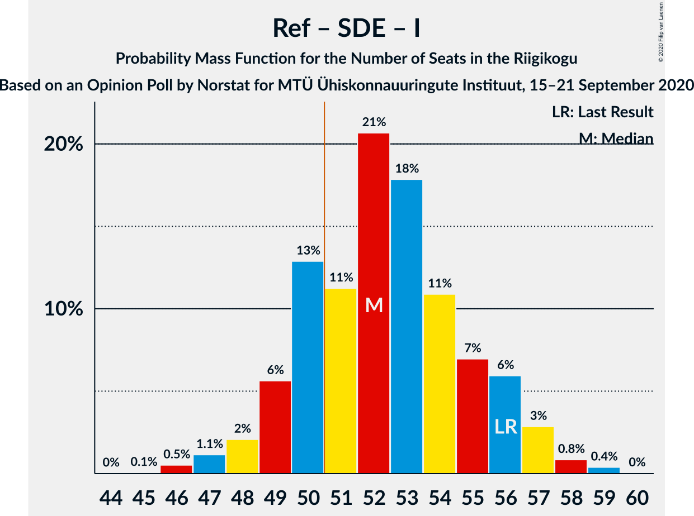

| Number of Seats | Probability | Accumulated | Special Marks |
|:---------------:|:-----------:|:-----------:|:-------------:|
| 45 | 0.1% | 100% |  |
| 46 | 0.5% | 99.9% |  |
| 47 | 1.1% | 99.4% |  |
| 48 | 2% | 98% |  |
| 49 | 6% | 96% |  |
| 50 | 13% | 91% | Median |
| 51 | 11% | 78% | Majority |
| 52 | 21% | 66% |  |
| 53 | 18% | 46% |  |
| 54 | 11% | 28% |  |
| 55 | 7% | 17% |  |
| 56 | 6% | 10% | Last Result |
| 57 | 3% | 4% |  |
| 58 | 0.8% | 1.3% |  |
| 59 | 0.4% | 0.4% |  |
| 60 | 0% | 0% |  |

### Eesti Reformierakond – Sotsiaaldemokraatlik Erakond

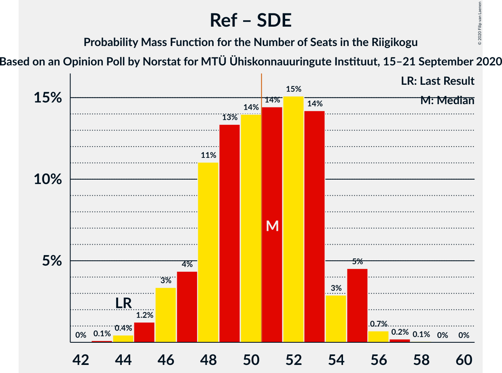

| Number of Seats | Probability | Accumulated | Special Marks |
|:---------------:|:-----------:|:-----------:|:-------------:|
| 43 | 0.1% | 100% |  |
| 44 | 0.4% | 99.9% | Last Result |
| 45 | 1.2% | 99.4% |  |
| 46 | 3% | 98% |  |
| 47 | 4% | 95% |  |
| 48 | 11% | 90% |  |
| 49 | 13% | 79% |  |
| 50 | 14% | 66% | Median |
| 51 | 14% | 52% | Majority |
| 52 | 15% | 38% |  |
| 53 | 14% | 23% |  |
| 54 | 3% | 8% |  |
| 55 | 5% | 5% |  |
| 56 | 0.7% | 1.0% |  |
| 57 | 0.2% | 0.3% |  |
| 58 | 0.1% | 0.1% |  |
| 59 | 0% | 0% |  |

### Eesti Reformierakond – Erakond Isamaa

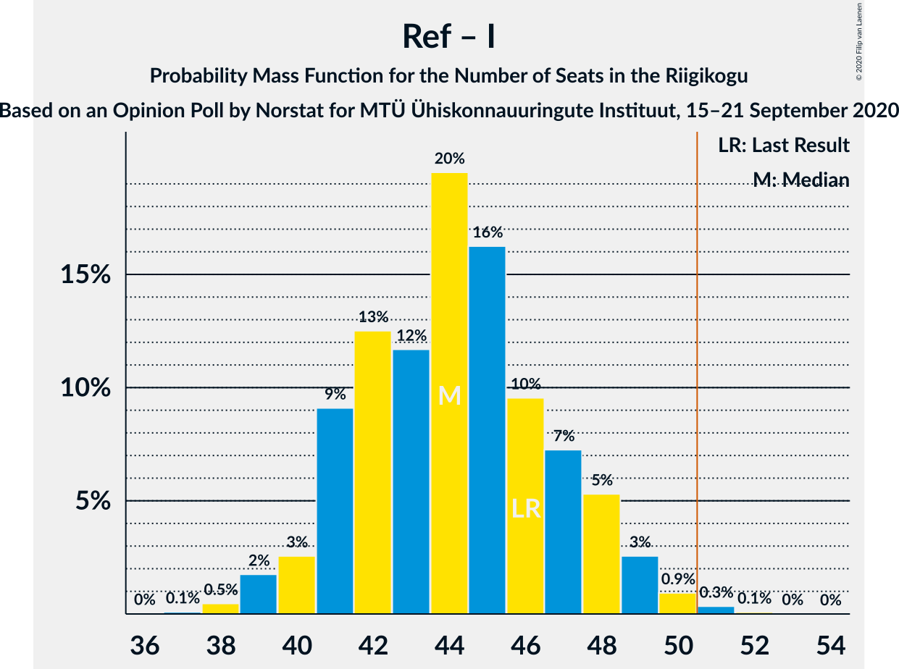

| Number of Seats | Probability | Accumulated | Special Marks |
|:---------------:|:-----------:|:-----------:|:-------------:|
| 37 | 0.1% | 100% |  |
| 38 | 0.5% | 99.9% |  |
| 39 | 2% | 99.4% |  |
| 40 | 3% | 98% |  |
| 41 | 9% | 95% |  |
| 42 | 13% | 86% | Median |
| 43 | 12% | 73% |  |
| 44 | 20% | 62% |  |
| 45 | 16% | 42% |  |
| 46 | 10% | 26% | Last Result |
| 47 | 7% | 16% |  |
| 48 | 5% | 9% |  |
| 49 | 3% | 4% |  |
| 50 | 0.9% | 1.4% |  |
| 51 | 0.3% | 0.4% | Majority |
| 52 | 0.1% | 0.1% |  |
| 53 | 0% | 0% |  |

### Eesti Keskerakond – Eesti Konservatiivne Rahvaerakond – Erakond Isamaa

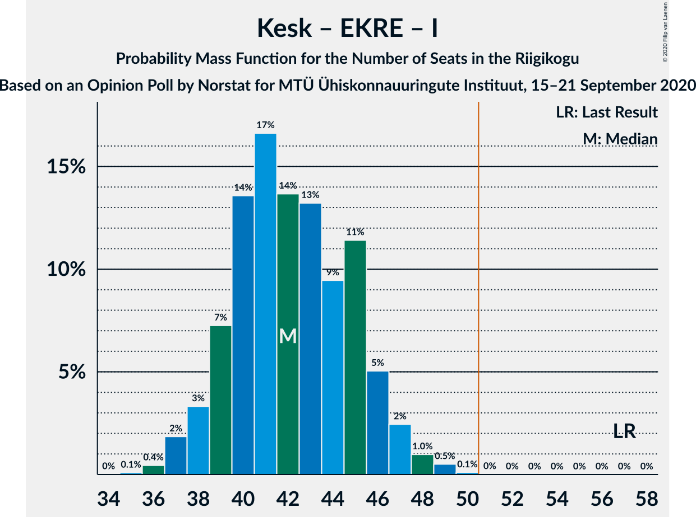

| Number of Seats | Probability | Accumulated | Special Marks |
|:---------------:|:-----------:|:-----------:|:-------------:|
| 35 | 0.1% | 100% |  |
| 36 | 0.4% | 99.9% |  |
| 37 | 2% | 99.5% |  |
| 38 | 3% | 98% |  |
| 39 | 7% | 94% |  |
| 40 | 14% | 87% |  |
| 41 | 17% | 73% | Median |
| 42 | 14% | 57% |  |
| 43 | 13% | 43% |  |
| 44 | 9% | 30% |  |
| 45 | 11% | 20% |  |
| 46 | 5% | 9% |  |
| 47 | 2% | 4% |  |
| 48 | 1.0% | 2% |  |
| 49 | 0.5% | 0.6% |  |
| 50 | 0.1% | 0.1% |  |
| 51 | 0% | 0% | Majority |
| 52 | 0% | 0% |  |
| 53 | 0% | 0% |  |
| 54 | 0% | 0% |  |
| 55 | 0% | 0% |  |
| 56 | 0% | 0% |  |
| 57 | 0% | 0% | Last Result |

### Eesti Keskerakond – Eesti Konservatiivne Rahvaerakond

| Number of Seats | Probability | Accumulated | Special Marks |
|:---------------:|:-----------:|:-----------:|:-------------:|
| 33 | 0% | 100% |  |
| 34 | 0.3% | 99.9% |  |
| 35 | 0.9% | 99.7% |  |
| 36 | 3% | 98.8% |  |
| 37 | 6% | 96% |  |
| 38 | 9% | 90% |  |
| 39 | 13% | 81% |  |
| 40 | 18% | 68% |  |
| 41 | 22% | 50% | Median |
| 42 | 12% | 28% |  |
| 43 | 9% | 16% |  |
| 44 | 4% | 7% |  |
| 45 | 2% | 3% | Last Result |
| 46 | 0.6% | 0.8% |  |
| 47 | 0.1% | 0.2% |  |
| 48 | 0% | 0% |  |

### Eesti Keskerakond – Sotsiaaldemokraatlik Erakond – Erakond Isamaa

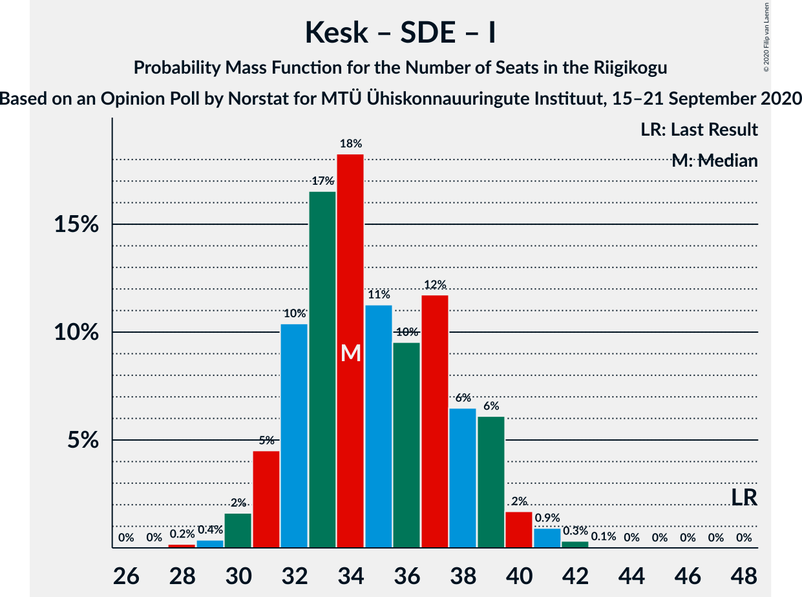

| Number of Seats | Probability | Accumulated | Special Marks |
|:---------------:|:-----------:|:-----------:|:-------------:|
| 28 | 0.2% | 100% |  |
| 29 | 0.4% | 99.8% |  |
| 30 | 2% | 99.4% |  |
| 31 | 5% | 98% |  |
| 32 | 10% | 93% |  |
| 33 | 17% | 83% | Median |
| 34 | 18% | 66% |  |
| 35 | 11% | 48% |  |
| 36 | 10% | 37% |  |
| 37 | 12% | 27% |  |
| 38 | 6% | 16% |  |
| 39 | 6% | 9% |  |
| 40 | 2% | 3% |  |
| 41 | 0.9% | 1.3% |  |
| 42 | 0.3% | 0.4% |  |
| 43 | 0.1% | 0.1% |  |
| 44 | 0% | 0% |  |
| 45 | 0% | 0% |  |
| 46 | 0% | 0% |  |
| 47 | 0% | 0% |  |
| 48 | 0% | 0% | Last Result |

### Eesti Keskerakond – Sotsiaaldemokraatlik Erakond

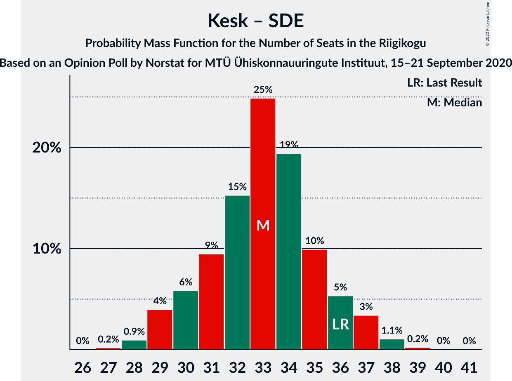

| Number of Seats | Probability | Accumulated | Special Marks |
|:---------------:|:-----------:|:-----------:|:-------------:|
| 27 | 0.2% | 100% |  |
| 28 | 0.9% | 99.8% |  |
| 29 | 4% | 98.8% |  |
| 30 | 6% | 95% |  |
| 31 | 9% | 89% |  |
| 32 | 15% | 80% |  |
| 33 | 25% | 64% | Median |
| 34 | 19% | 39% |  |
| 35 | 10% | 20% |  |
| 36 | 5% | 10% | Last Result |
| 37 | 3% | 5% |  |
| 38 | 1.1% | 1.3% |  |
| 39 | 0.2% | 0.3% |  |
| 40 | 0% | 0.1% |  |
| 41 | 0% | 0% |  |

### Eesti Konservatiivne Rahvaerakond – Sotsiaaldemokraatlik Erakond

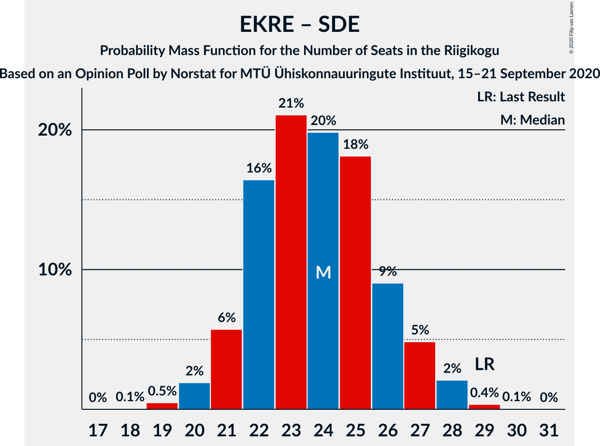

| Number of Seats | Probability | Accumulated | Special Marks |
|:---------------:|:-----------:|:-----------:|:-------------:|
| 18 | 0.1% | 100% |  |
| 19 | 0.5% | 99.9% |  |
| 20 | 2% | 99.5% |  |
| 21 | 6% | 98% |  |
| 22 | 16% | 92% |  |
| 23 | 21% | 75% |  |
| 24 | 20% | 54% | Median |
| 25 | 18% | 35% |  |
| 26 | 9% | 16% |  |
| 27 | 5% | 7% |  |
| 28 | 2% | 3% |  |
| 29 | 0.4% | 0.4% | Last Result |
| 30 | 0.1% | 0.1% |  |
| 31 | 0% | 0% |  |

## Technical Information

### Opinion Poll

+ **Polling firm:** Norstat
+ **Commissioner(s):** MTÜ Ühiskonnauuringute Instituut
+ **Fieldwork period:** 15–21 September 2020

### Calculations

+ **Sample size:** 1000
+ **Simulations done:** 1,048,576
+ **Error estimate:** 2.55%

