# Opinion Poll by Norstat for MTÜ Ühiskonnauuringute Instituut, 23–28 September 2020

<a href="#voting-intentions">Voting Intentions</a> | <a href="#seats">Seats</a> | <a href="#coalitions">Coalitions</a> | <a href="#technical-information">Technical Information</a>

## Voting Intentions

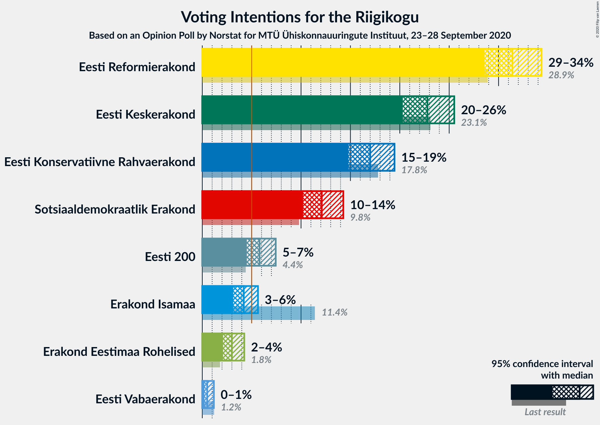

### Confidence Intervals

| Party | Last Result | Poll Result | 80% Confidence Interval | 90% Confidence Interval | 95% Confidence Interval | 99% Confidence Interval |
|:-----:|:-----------:|:-----------:|:-----------------------:|:-----------------------:|:-----------------------:|:-----------------------:|
| Eesti Reformierakond | 28.9% | 31.4% | 29.6–33.3% |29.0–33.9% |28.6–34.4% |27.7–35.3% |
| Eesti Keskerakond | 23.1% | 22.8% | 21.2–24.6% |20.7–25.1% |20.3–25.5% |19.5–26.4% |
| Eesti Konservatiivne Rahvaerakond | 17.8% | 17.0% | 15.5–18.6% |15.2–19.1% |14.8–19.5% |14.1–20.3% |
| Sotsiaaldemokraatlik Erakond | 9.8% | 12.1% | 10.9–13.5% |10.5–13.9% |10.2–14.3% |9.6–15.0% |
| Eesti 200 | 4.4% | 5.8% | 5.0–6.9% |4.7–7.2% |4.5–7.4% |4.1–8.0% |
| Erakond Isamaa | 11.4% | 4.2% | 3.5–5.1% |3.3–5.4% |3.1–5.6% |2.8–6.1% |
| Erakond Eestimaa Rohelised | 1.8% | 3.0% | 2.4–3.8% |2.2–4.1% |2.1–4.3% |1.9–4.7% |
| Eesti Vabaerakond | 1.2% | 0.5% | 0.3–0.9% |0.3–1.1% |0.2–1.2% |0.2–1.4% |

*Note:* The poll result column reflects the actual value used in the calculations. Published results may vary slightly, and in addition be rounded to fewer digits.

## Seats

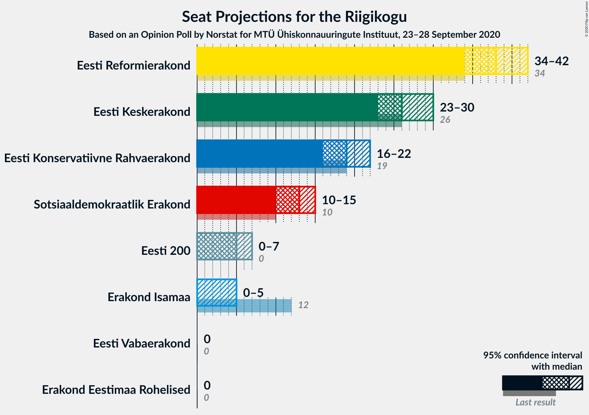

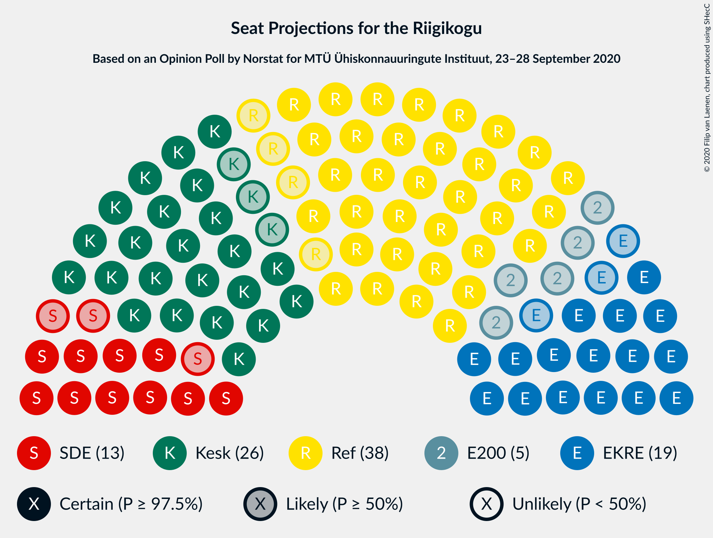

### Confidence Intervals

| Party | Last Result | Median | 80% Confidence Interval | 90% Confidence Interval | 95% Confidence Interval | 99% Confidence Interval |
|:-----:|:-----------:|:------:|:-----------------------:|:-----------------------:|:-----------------------:|:-----------------------:|
| <a href="#eesti-reformierakond">Eesti Reformierakond</a> | 34 | 38 | 35–40 |34–41 |34–42 |32–43 |
| <a href="#eesti-keskerakond">Eesti Keskerakond</a> | 26 | 26 | 24–29 |23–29 |23–30 |22–31 |
| <a href="#eesti-konservatiivne-rahvaerakond">Eesti Konservatiivne Rahvaerakond</a> | 19 | 19 | 17–21 |16–21 |16–22 |15–23 |
| <a href="#sotsiaaldemokraatlik-erakond">Sotsiaaldemokraatlik Erakond</a> | 10 | 13 | 11–14 |11–15 |10–15 |10–16 |
| <a href="#eesti-200">Eesti 200</a> | 0 | 5 | 0–6 |0–7 |0–7 |0–8 |
| <a href="#erakond-isamaa">Erakond Isamaa</a> | 12 | 0 | 0–4 |0–5 |0–5 |0–6 |
| <a href="#erakond-eestimaa-rohelised">Erakond Eestimaa Rohelised</a> | 0 | 0 | 0 |0 |0 |0 |
| <a href="#eesti-vabaerakond">Eesti Vabaerakond</a> | 0 | 0 | 0 |0 |0 |0 |

### Eesti Reformierakond

*For a full overview of the results for this party, see the [Eesti Reformierakond](party-eestireformierakond.html) page.*

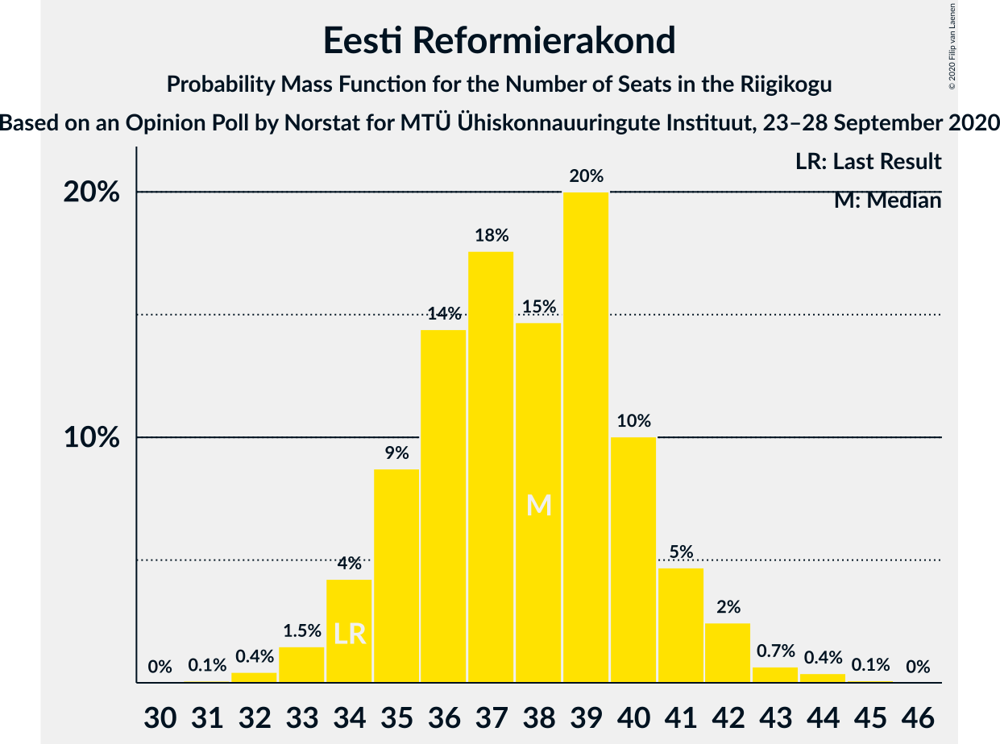

| Number of Seats | Probability | Accumulated | Special Marks |
|:---------------:|:-----------:|:-----------:|:-------------:|
| 31 | 0.1% | 100% |  |
| 32 | 0.4% | 99.9% |  |
| 33 | 1.5% | 99.5% |  |
| 34 | 4% | 98% | Last Result |
| 35 | 9% | 94% |  |
| 36 | 14% | 85% |  |
| 37 | 18% | 71% |  |
| 38 | 15% | 53% | Median |
| 39 | 20% | 38% |  |
| 40 | 10% | 18% |  |
| 41 | 5% | 8% |  |
| 42 | 2% | 4% |  |
| 43 | 0.7% | 1.2% |  |
| 44 | 0.4% | 0.5% |  |
| 45 | 0.1% | 0.1% |  |
| 46 | 0% | 0% |  |

### Eesti Keskerakond

*For a full overview of the results for this party, see the [Eesti Keskerakond](party-eestikeskerakond.html) page.*

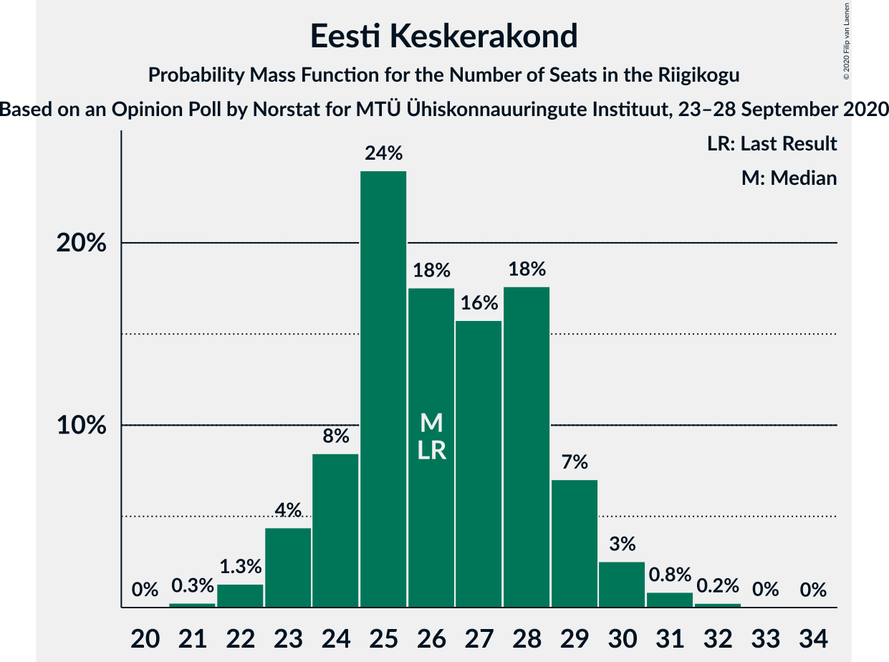

| Number of Seats | Probability | Accumulated | Special Marks |
|:---------------:|:-----------:|:-----------:|:-------------:|
| 21 | 0.3% | 100% |  |
| 22 | 1.3% | 99.7% |  |
| 23 | 4% | 98% |  |
| 24 | 8% | 94% |  |
| 25 | 24% | 86% |  |
| 26 | 18% | 62% | Last Result, Median |
| 27 | 16% | 44% |  |
| 28 | 18% | 28% |  |
| 29 | 7% | 11% |  |
| 30 | 3% | 4% |  |
| 31 | 0.8% | 1.2% |  |
| 32 | 0.2% | 0.3% |  |
| 33 | 0% | 0.1% |  |
| 34 | 0% | 0% |  |

### Eesti Konservatiivne Rahvaerakond

*For a full overview of the results for this party, see the [Eesti Konservatiivne Rahvaerakond](party-eestikonservatiivnerahvaerakond.html) page.*

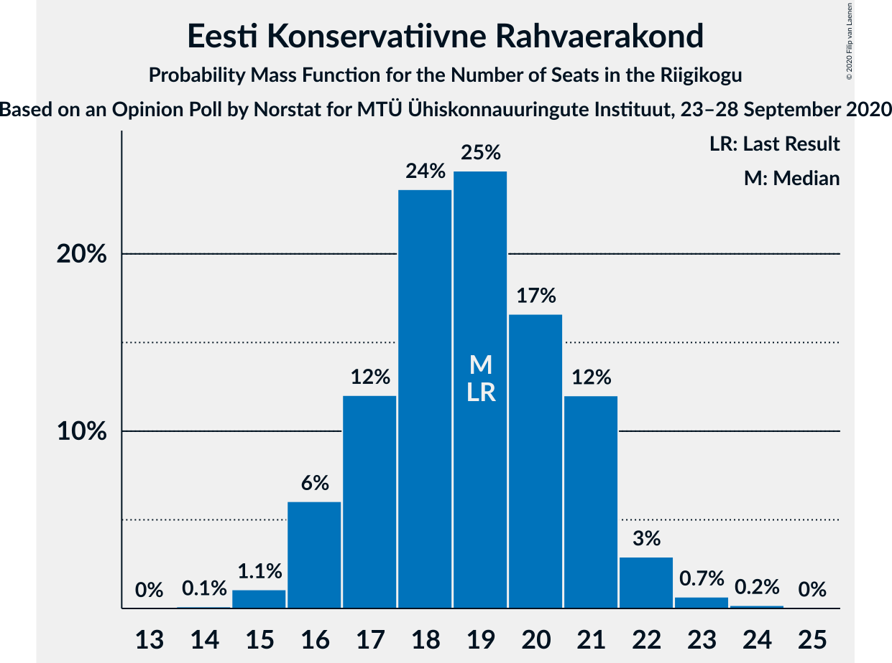

| Number of Seats | Probability | Accumulated | Special Marks |
|:---------------:|:-----------:|:-----------:|:-------------:|
| 14 | 0.1% | 100% |  |
| 15 | 1.1% | 99.9% |  |
| 16 | 6% | 98.8% |  |
| 17 | 12% | 93% |  |
| 18 | 24% | 81% |  |
| 19 | 25% | 57% | Last Result, Median |
| 20 | 17% | 32% |  |
| 21 | 12% | 16% |  |
| 22 | 3% | 4% |  |
| 23 | 0.7% | 0.9% |  |
| 24 | 0.2% | 0.2% |  |
| 25 | 0% | 0% |  |

### Sotsiaaldemokraatlik Erakond

*For a full overview of the results for this party, see the [Sotsiaaldemokraatlik Erakond](party-sotsiaaldemokraatlikerakond.html) page.*

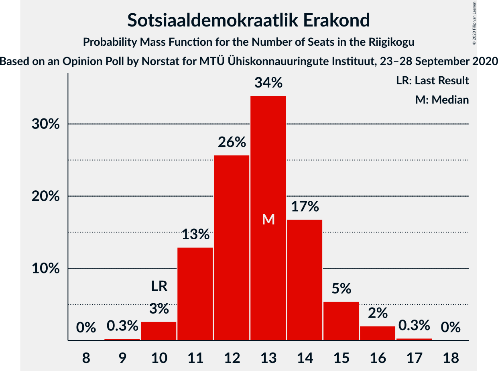

| Number of Seats | Probability | Accumulated | Special Marks |
|:---------------:|:-----------:|:-----------:|:-------------:|
| 9 | 0.3% | 100% |  |
| 10 | 3% | 99.7% | Last Result |
| 11 | 13% | 97% |  |
| 12 | 26% | 84% |  |
| 13 | 34% | 58% | Median |
| 14 | 17% | 25% |  |
| 15 | 5% | 8% |  |
| 16 | 2% | 2% |  |
| 17 | 0.3% | 0.4% |  |
| 18 | 0% | 0% |  |

### Eesti 200

*For a full overview of the results for this party, see the [Eesti 200](party-eesti200.html) page.*

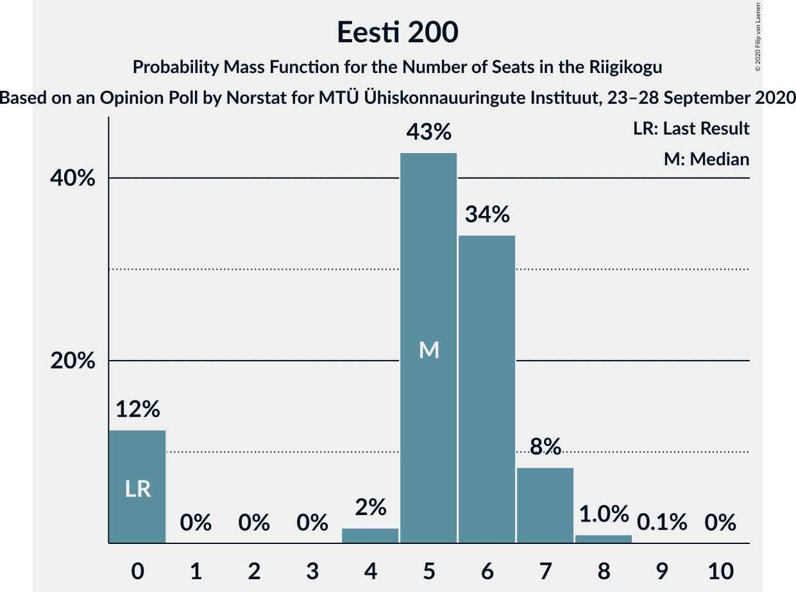

| Number of Seats | Probability | Accumulated | Special Marks |
|:---------------:|:-----------:|:-----------:|:-------------:|
| 0 | 12% | 100% | Last Result |
| 1 | 0% | 88% |  |
| 2 | 0% | 88% |  |
| 3 | 0% | 88% |  |
| 4 | 2% | 88% |  |
| 5 | 43% | 86% | Median |
| 6 | 34% | 43% |  |
| 7 | 8% | 9% |  |
| 8 | 1.0% | 1.0% |  |
| 9 | 0.1% | 0.1% |  |
| 10 | 0% | 0% |  |

### Erakond Isamaa

*For a full overview of the results for this party, see the [Erakond Isamaa](party-erakondisamaa.html) page.*

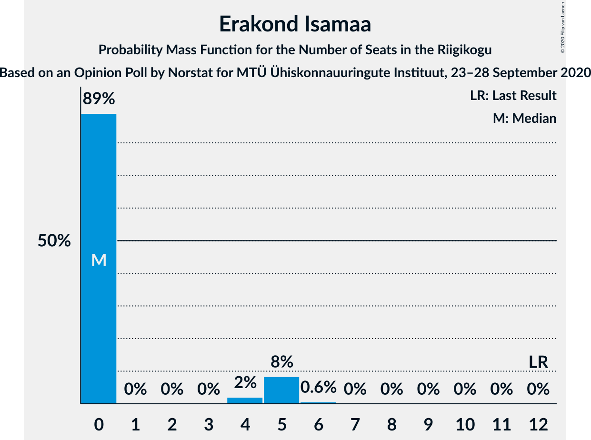

| Number of Seats | Probability | Accumulated | Special Marks |
|:---------------:|:-----------:|:-----------:|:-------------:|
| 0 | 89% | 100% | Median |
| 1 | 0% | 11% |  |
| 2 | 0% | 11% |  |
| 3 | 0% | 11% |  |
| 4 | 2% | 11% |  |
| 5 | 8% | 9% |  |
| 6 | 0.6% | 0.6% |  |
| 7 | 0% | 0% |  |
| 8 | 0% | 0% |  |
| 9 | 0% | 0% |  |
| 10 | 0% | 0% |  |
| 11 | 0% | 0% |  |
| 12 | 0% | 0% | Last Result |

### Erakond Eestimaa Rohelised

*For a full overview of the results for this party, see the [Erakond Eestimaa Rohelised](party-erakondeestimaarohelised.html) page.*

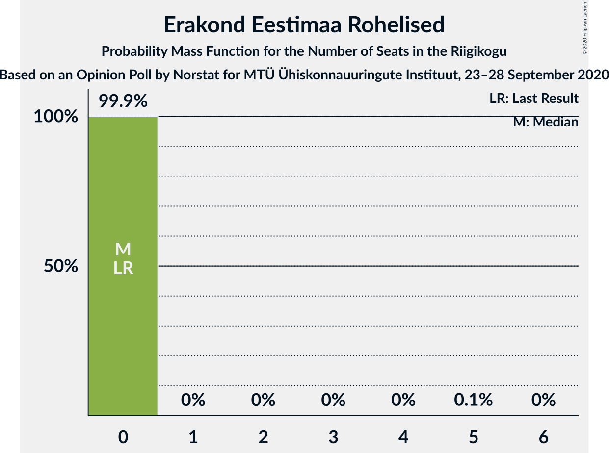

| Number of Seats | Probability | Accumulated | Special Marks |
|:---------------:|:-----------:|:-----------:|:-------------:|
| 0 | 99.9% | 100% | Last Result, Median |
| 1 | 0% | 0.1% |  |
| 2 | 0% | 0.1% |  |
| 3 | 0% | 0.1% |  |
| 4 | 0% | 0.1% |  |
| 5 | 0.1% | 0.1% |  |
| 6 | 0% | 0% |  |

### Eesti Vabaerakond

*For a full overview of the results for this party, see the [Eesti Vabaerakond](party-eestivabaerakond.html) page.*

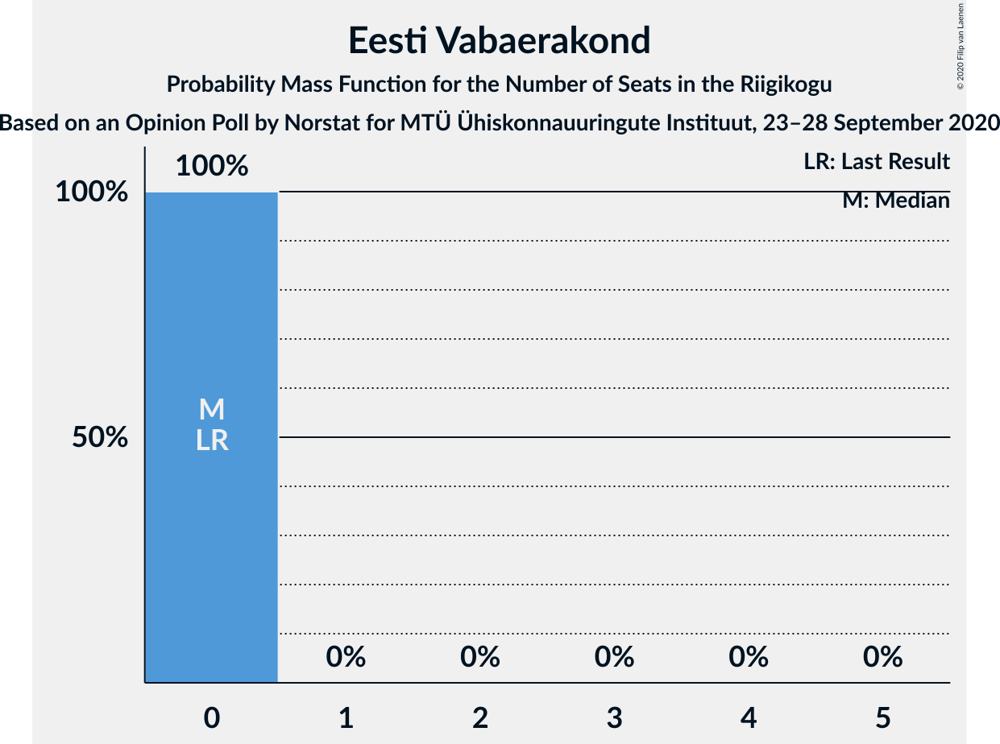

| Number of Seats | Probability | Accumulated | Special Marks |
|:---------------:|:-----------:|:-----------:|:-------------:|
| 0 | 100% | 100% | Last Result, Median |

## Coalitions

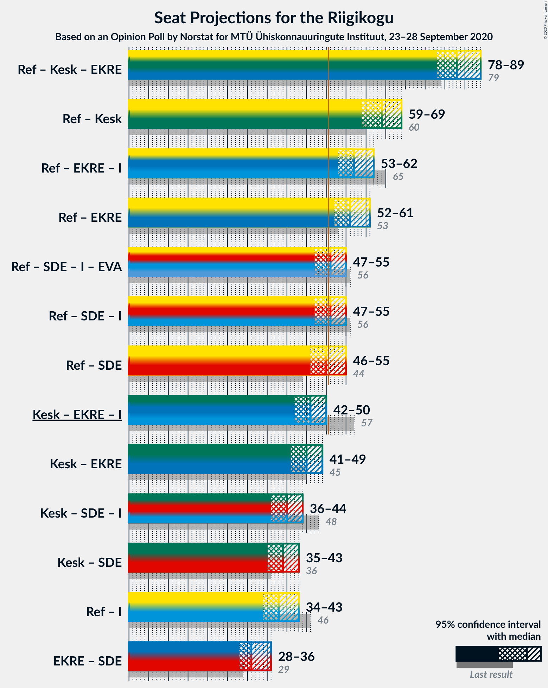

### Confidence Intervals

| Coalition | Last Result | Median | Majority? | 80% Confidence Interval | 90% Confidence Interval | 95% Confidence Interval | 99% Confidence Interval |
|:---------:|:-----------:|:------:|:---------:|:-----------------------:|:-----------------------:|:-----------------------:|:-----------------------:|
| Eesti Reformierakond – Eesti Keskerakond – Eesti Konservatiivne Rahvaerakond | 79 | 83 | 100% | 80–86 | 78–88 | 78–89 | 76–90 |
| Eesti Reformierakond – Eesti Keskerakond | 60 | 64 | 100% | 61–67 | 60–68 | 59–69 | 58–70 |
| Eesti Reformierakond – Eesti Konservatiivne Rahvaerakond – Erakond Isamaa | 65 | 57 | 99.9% | 54–60 | 53–61 | 53–62 | 52–64 |
| Eesti Reformierakond – Eesti Konservatiivne Rahvaerakond | 53 | 56 | 99.6% | 53–60 | 53–61 | 52–61 | 51–63 |
| Eesti Reformierakond – Sotsiaaldemokraatlik Erakond – Erakond Isamaa – Eesti Vabaerakond | 56 | 51 | 58% | 48–54 | 47–55 | 47–55 | 46–57 |
| Eesti Reformierakond – Sotsiaaldemokraatlik Erakond – Erakond Isamaa | 56 | 51 | 58% | 48–54 | 47–55 | 47–55 | 46–57 |
| Eesti Reformierakond – Sotsiaaldemokraatlik Erakond | 44 | 50 | 49% | 48–53 | 47–54 | 46–55 | 44–56 |
| Eesti Keskerakond – Eesti Konservatiivne Rahvaerakond – Erakond Isamaa | 57 | 46 | 2% | 43–49 | 42–49 | 42–50 | 40–52 |
| Eesti Keskerakond – Eesti Konservatiivne Rahvaerakond | 45 | 45 | 0.8% | 42–48 | 41–49 | 41–49 | 40–51 |
| Eesti Keskerakond – Sotsiaaldemokraatlik Erakond – Erakond Isamaa | 48 | 40 | 0% | 37–43 | 36–43 | 36–44 | 34–46 |
| Eesti Keskerakond – Sotsiaaldemokraatlik Erakond | 36 | 39 | 0% | 37–42 | 36–43 | 35–43 | 34–45 |
| Eesti Reformierakond – Erakond Isamaa | 46 | 38 | 0% | 35–41 | 35–42 | 34–43 | 33–44 |
| Eesti Konservatiivne Rahvaerakond – Sotsiaaldemokraatlik Erakond | 29 | 31 | 0% | 29–34 | 29–35 | 28–36 | 27–37 |

### Eesti Reformierakond – Eesti Keskerakond – Eesti Konservatiivne Rahvaerakond

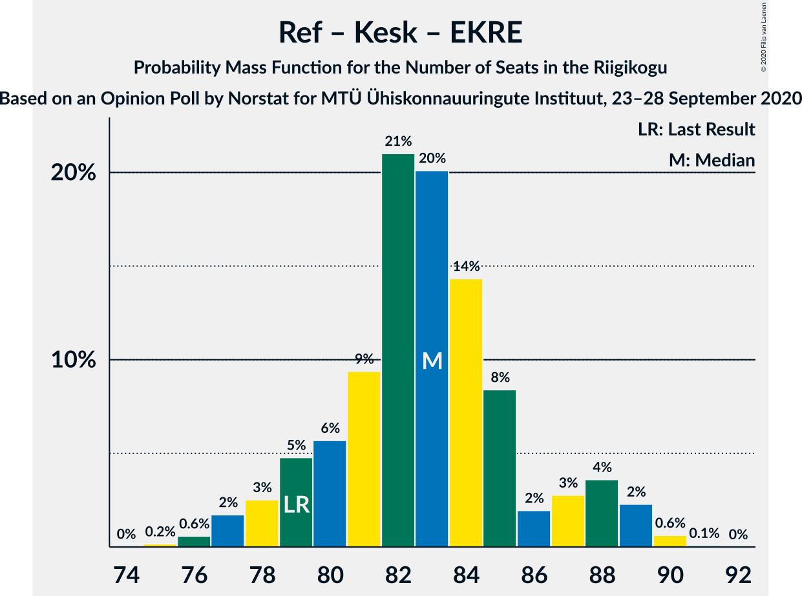

| Number of Seats | Probability | Accumulated | Special Marks |
|:---------------:|:-----------:|:-----------:|:-------------:|
| 75 | 0.2% | 100% |  |
| 76 | 0.6% | 99.8% |  |
| 77 | 2% | 99.2% |  |
| 78 | 3% | 98% |  |
| 79 | 5% | 95% | Last Result |
| 80 | 6% | 90% |  |
| 81 | 9% | 85% |  |
| 82 | 21% | 75% |  |
| 83 | 20% | 54% | Median |
| 84 | 14% | 34% |  |
| 85 | 8% | 20% |  |
| 86 | 2% | 11% |  |
| 87 | 3% | 9% |  |
| 88 | 4% | 7% |  |
| 89 | 2% | 3% |  |
| 90 | 0.6% | 0.7% |  |
| 91 | 0.1% | 0.1% |  |
| 92 | 0% | 0% |  |

### Eesti Reformierakond – Eesti Keskerakond

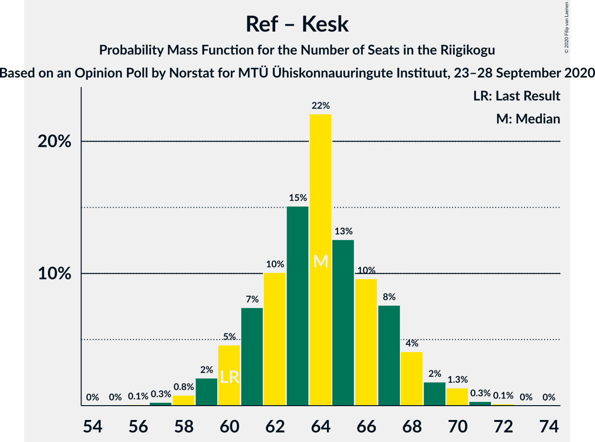

| Number of Seats | Probability | Accumulated | Special Marks |
|:---------------:|:-----------:|:-----------:|:-------------:|
| 56 | 0.1% | 100% |  |
| 57 | 0.3% | 99.9% |  |
| 58 | 0.8% | 99.6% |  |
| 59 | 2% | 98.8% |  |
| 60 | 5% | 97% | Last Result |
| 61 | 7% | 92% |  |
| 62 | 10% | 85% |  |
| 63 | 15% | 75% |  |
| 64 | 22% | 60% | Median |
| 65 | 13% | 37% |  |
| 66 | 10% | 25% |  |
| 67 | 8% | 15% |  |
| 68 | 4% | 8% |  |
| 69 | 2% | 4% |  |
| 70 | 1.3% | 2% |  |
| 71 | 0.3% | 0.5% |  |
| 72 | 0.1% | 0.2% |  |
| 73 | 0% | 0% |  |

### Eesti Reformierakond – Eesti Konservatiivne Rahvaerakond – Erakond Isamaa

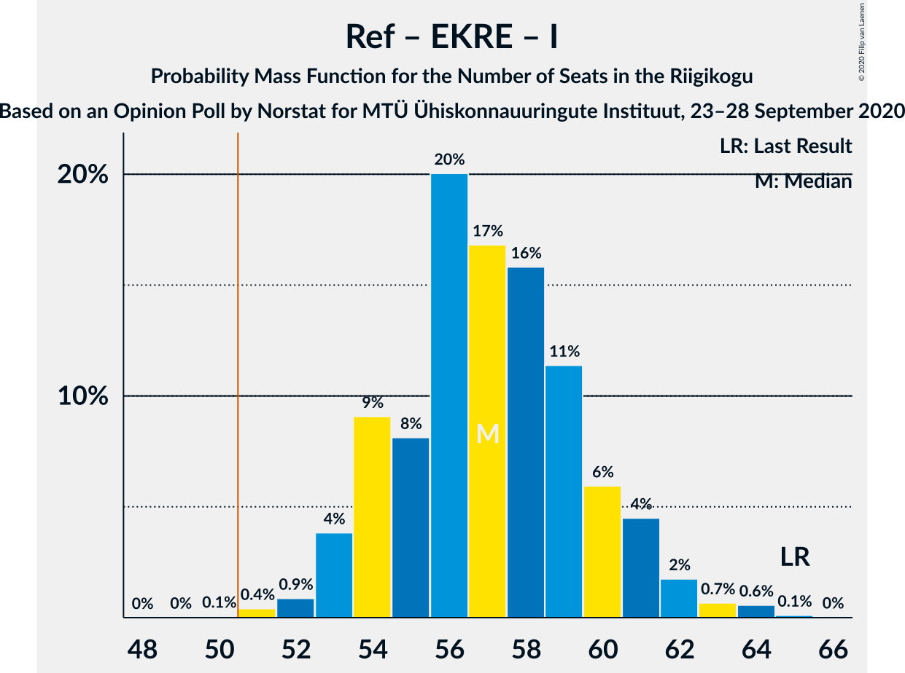

| Number of Seats | Probability | Accumulated | Special Marks |
|:---------------:|:-----------:|:-----------:|:-------------:|
| 50 | 0.1% | 100% |  |
| 51 | 0.4% | 99.9% | Majority |
| 52 | 0.9% | 99.5% |  |
| 53 | 4% | 98.6% |  |
| 54 | 9% | 95% |  |
| 55 | 8% | 86% |  |
| 56 | 20% | 78% |  |
| 57 | 17% | 58% | Median |
| 58 | 16% | 41% |  |
| 59 | 11% | 25% |  |
| 60 | 6% | 14% |  |
| 61 | 4% | 8% |  |
| 62 | 2% | 3% |  |
| 63 | 0.7% | 1.4% |  |
| 64 | 0.6% | 0.7% |  |
| 65 | 0.1% | 0.1% | Last Result |
| 66 | 0% | 0% |  |

### Eesti Reformierakond – Eesti Konservatiivne Rahvaerakond

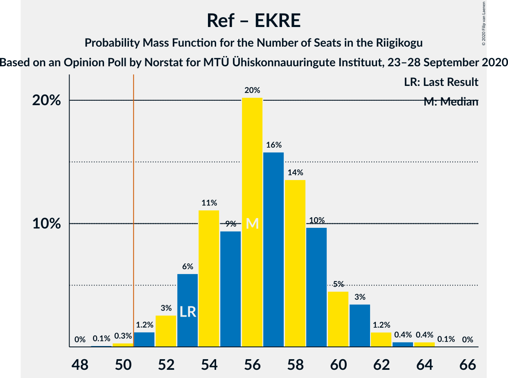

| Number of Seats | Probability | Accumulated | Special Marks |
|:---------------:|:-----------:|:-----------:|:-------------:|
| 49 | 0.1% | 100% |  |
| 50 | 0.3% | 99.9% |  |
| 51 | 1.2% | 99.6% | Majority |
| 52 | 3% | 98% |  |
| 53 | 6% | 96% | Last Result |
| 54 | 11% | 90% |  |
| 55 | 9% | 79% |  |
| 56 | 20% | 69% |  |
| 57 | 16% | 49% | Median |
| 58 | 14% | 33% |  |
| 59 | 10% | 20% |  |
| 60 | 5% | 10% |  |
| 61 | 3% | 6% |  |
| 62 | 1.2% | 2% |  |
| 63 | 0.4% | 0.9% |  |
| 64 | 0.4% | 0.5% |  |
| 65 | 0.1% | 0.1% |  |
| 66 | 0% | 0% |  |

### Eesti Reformierakond – Sotsiaaldemokraatlik Erakond – Erakond Isamaa – Eesti Vabaerakond

| Number of Seats | Probability | Accumulated | Special Marks |
|:---------------:|:-----------:|:-----------:|:-------------:|
| 44 | 0.1% | 100% |  |
| 45 | 0.3% | 99.9% |  |
| 46 | 2% | 99.6% |  |
| 47 | 4% | 98% |  |
| 48 | 6% | 94% |  |
| 49 | 17% | 88% |  |
| 50 | 13% | 71% |  |
| 51 | 14% | 58% | Median, Majority |
| 52 | 21% | 44% |  |
| 53 | 10% | 23% |  |
| 54 | 5% | 12% |  |
| 55 | 5% | 7% |  |
| 56 | 2% | 2% | Last Result |
| 57 | 0.5% | 1.0% |  |
| 58 | 0.3% | 0.5% |  |
| 59 | 0.1% | 0.2% |  |
| 60 | 0% | 0% |  |

### Eesti Reformierakond – Sotsiaaldemokraatlik Erakond – Erakond Isamaa

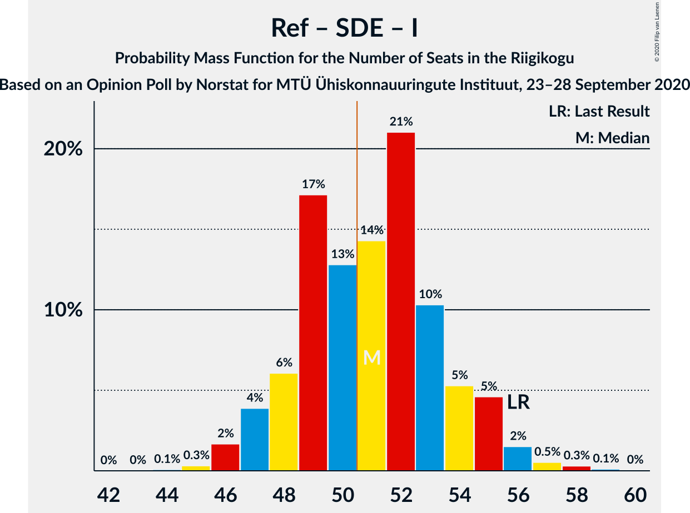

| Number of Seats | Probability | Accumulated | Special Marks |
|:---------------:|:-----------:|:-----------:|:-------------:|
| 44 | 0.1% | 100% |  |
| 45 | 0.3% | 99.9% |  |
| 46 | 2% | 99.6% |  |
| 47 | 4% | 98% |  |
| 48 | 6% | 94% |  |
| 49 | 17% | 88% |  |
| 50 | 13% | 71% |  |
| 51 | 14% | 58% | Median, Majority |
| 52 | 21% | 44% |  |
| 53 | 10% | 23% |  |
| 54 | 5% | 12% |  |
| 55 | 5% | 7% |  |
| 56 | 2% | 2% | Last Result |
| 57 | 0.5% | 1.0% |  |
| 58 | 0.3% | 0.5% |  |
| 59 | 0.1% | 0.2% |  |
| 60 | 0% | 0% |  |

### Eesti Reformierakond – Sotsiaaldemokraatlik Erakond

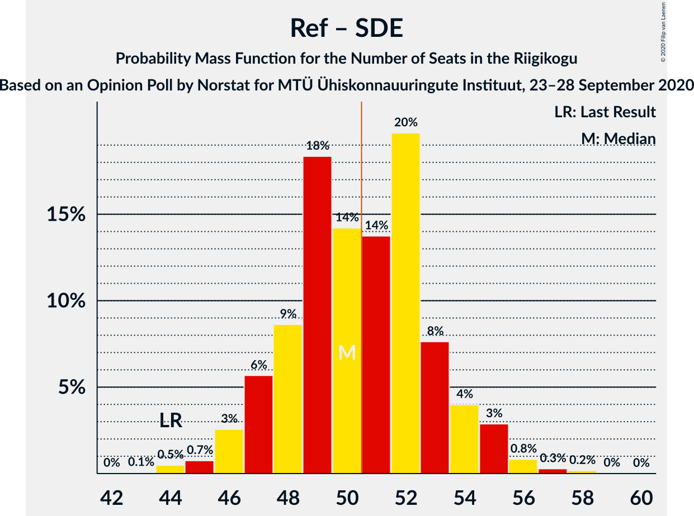

| Number of Seats | Probability | Accumulated | Special Marks |
|:---------------:|:-----------:|:-----------:|:-------------:|
| 43 | 0.1% | 100% |  |
| 44 | 0.5% | 99.9% | Last Result |
| 45 | 0.7% | 99.4% |  |
| 46 | 3% | 98.7% |  |
| 47 | 6% | 96% |  |
| 48 | 9% | 90% |  |
| 49 | 18% | 82% |  |
| 50 | 14% | 63% |  |
| 51 | 14% | 49% | Median, Majority |
| 52 | 20% | 36% |  |
| 53 | 8% | 16% |  |
| 54 | 4% | 8% |  |
| 55 | 3% | 4% |  |
| 56 | 0.8% | 1.3% |  |
| 57 | 0.3% | 0.5% |  |
| 58 | 0.2% | 0.2% |  |
| 59 | 0% | 0% |  |

### Eesti Keskerakond – Eesti Konservatiivne Rahvaerakond – Erakond Isamaa

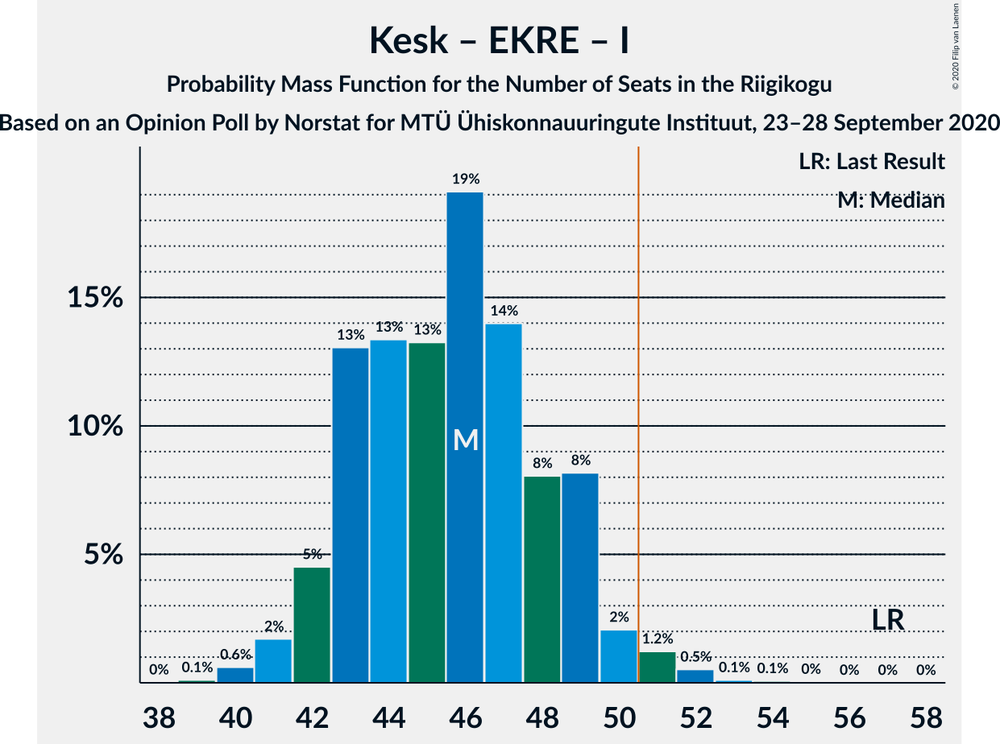

| Number of Seats | Probability | Accumulated | Special Marks |
|:---------------:|:-----------:|:-----------:|:-------------:|
| 39 | 0.1% | 100% |  |
| 40 | 0.6% | 99.9% |  |
| 41 | 2% | 99.3% |  |
| 42 | 5% | 98% |  |
| 43 | 13% | 93% |  |
| 44 | 13% | 80% |  |
| 45 | 13% | 67% | Median |
| 46 | 19% | 53% |  |
| 47 | 14% | 34% |  |
| 48 | 8% | 20% |  |
| 49 | 8% | 12% |  |
| 50 | 2% | 4% |  |
| 51 | 1.2% | 2% | Majority |
| 52 | 0.5% | 0.7% |  |
| 53 | 0.1% | 0.2% |  |
| 54 | 0.1% | 0.1% |  |
| 55 | 0% | 0% |  |
| 56 | 0% | 0% |  |
| 57 | 0% | 0% | Last Result |

### Eesti Keskerakond – Eesti Konservatiivne Rahvaerakond

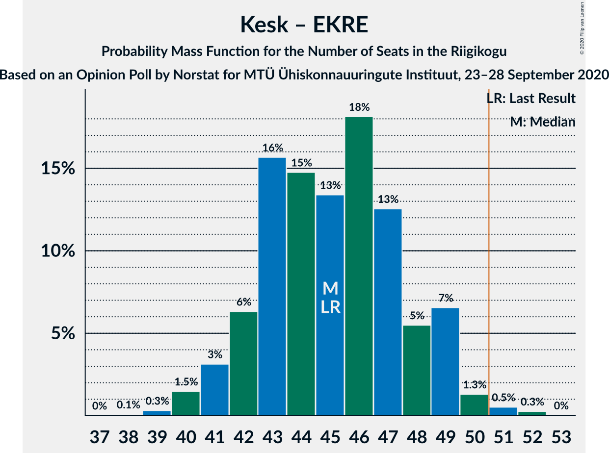

| Number of Seats | Probability | Accumulated | Special Marks |
|:---------------:|:-----------:|:-----------:|:-------------:|
| 38 | 0.1% | 100% |  |
| 39 | 0.3% | 99.9% |  |
| 40 | 1.5% | 99.6% |  |
| 41 | 3% | 98% |  |
| 42 | 6% | 95% |  |
| 43 | 16% | 89% |  |
| 44 | 15% | 73% |  |
| 45 | 13% | 58% | Last Result, Median |
| 46 | 18% | 45% |  |
| 47 | 13% | 27% |  |
| 48 | 5% | 14% |  |
| 49 | 7% | 9% |  |
| 50 | 1.3% | 2% |  |
| 51 | 0.5% | 0.8% | Majority |
| 52 | 0.3% | 0.3% |  |
| 53 | 0% | 0% |  |

### Eesti Keskerakond – Sotsiaaldemokraatlik Erakond – Erakond Isamaa

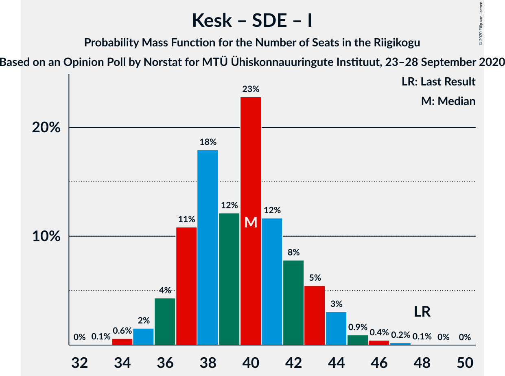

| Number of Seats | Probability | Accumulated | Special Marks |
|:---------------:|:-----------:|:-----------:|:-------------:|
| 33 | 0.1% | 100% |  |
| 34 | 0.6% | 99.9% |  |
| 35 | 2% | 99.3% |  |
| 36 | 4% | 98% |  |
| 37 | 11% | 93% |  |
| 38 | 18% | 83% |  |
| 39 | 12% | 65% | Median |
| 40 | 23% | 53% |  |
| 41 | 12% | 30% |  |
| 42 | 8% | 18% |  |
| 43 | 5% | 10% |  |
| 44 | 3% | 5% |  |
| 45 | 0.9% | 2% |  |
| 46 | 0.4% | 0.8% |  |
| 47 | 0.2% | 0.3% |  |
| 48 | 0.1% | 0.1% | Last Result |
| 49 | 0% | 0% |  |

### Eesti Keskerakond – Sotsiaaldemokraatlik Erakond

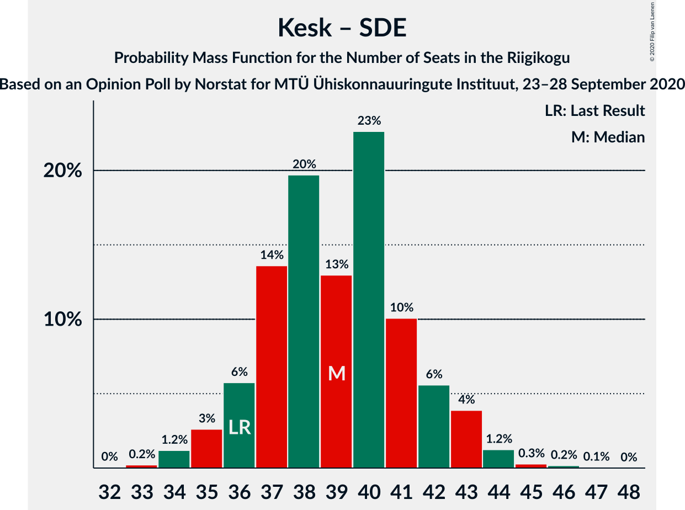

| Number of Seats | Probability | Accumulated | Special Marks |
|:---------------:|:-----------:|:-----------:|:-------------:|
| 32 | 0% | 100% |  |
| 33 | 0.2% | 99.9% |  |
| 34 | 1.2% | 99.7% |  |
| 35 | 3% | 98.5% |  |
| 36 | 6% | 96% | Last Result |
| 37 | 14% | 90% |  |
| 38 | 20% | 77% |  |
| 39 | 13% | 57% | Median |
| 40 | 23% | 44% |  |
| 41 | 10% | 21% |  |
| 42 | 6% | 11% |  |
| 43 | 4% | 6% |  |
| 44 | 1.2% | 2% |  |
| 45 | 0.3% | 0.5% |  |
| 46 | 0.2% | 0.2% |  |
| 47 | 0.1% | 0.1% |  |
| 48 | 0% | 0% |  |

### Eesti Reformierakond – Erakond Isamaa

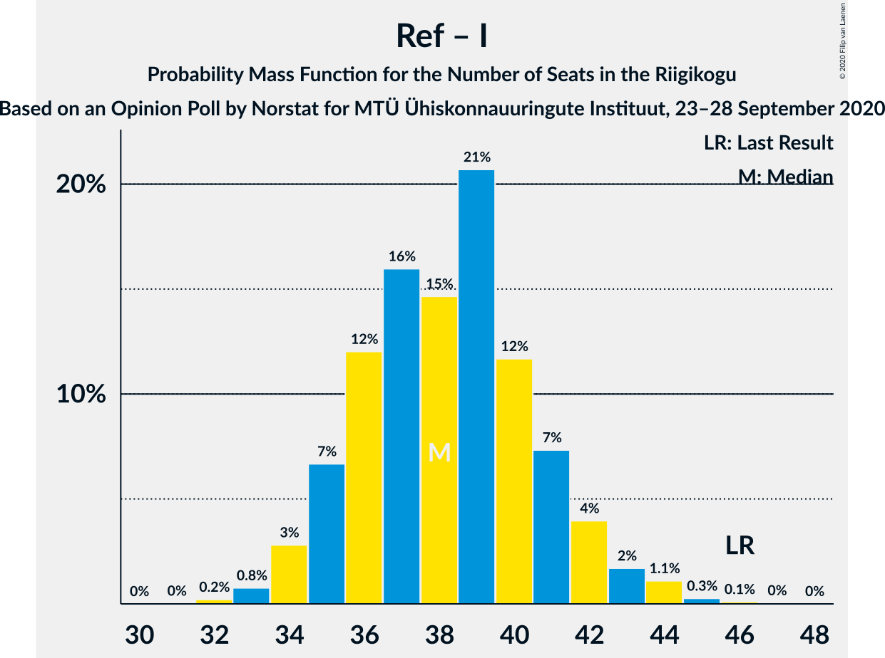

| Number of Seats | Probability | Accumulated | Special Marks |
|:---------------:|:-----------:|:-----------:|:-------------:|
| 32 | 0.2% | 100% |  |
| 33 | 0.8% | 99.8% |  |
| 34 | 3% | 99.0% |  |
| 35 | 7% | 96% |  |
| 36 | 12% | 90% |  |
| 37 | 16% | 77% |  |
| 38 | 15% | 62% | Median |
| 39 | 21% | 47% |  |
| 40 | 12% | 26% |  |
| 41 | 7% | 15% |  |
| 42 | 4% | 7% |  |
| 43 | 2% | 3% |  |
| 44 | 1.1% | 2% |  |
| 45 | 0.3% | 0.4% |  |
| 46 | 0.1% | 0.2% | Last Result |
| 47 | 0% | 0.1% |  |
| 48 | 0% | 0% |  |

### Eesti Konservatiivne Rahvaerakond – Sotsiaaldemokraatlik Erakond

| Number of Seats | Probability | Accumulated | Special Marks |
|:---------------:|:-----------:|:-----------:|:-------------:|
| 25 | 0% | 100% |  |
| 26 | 0.2% | 99.9% |  |
| 27 | 0.9% | 99.7% |  |
| 28 | 3% | 98.8% |  |
| 29 | 10% | 96% | Last Result |
| 30 | 13% | 86% |  |
| 31 | 24% | 73% |  |
| 32 | 21% | 50% | Median |
| 33 | 14% | 29% |  |
| 34 | 8% | 14% |  |
| 35 | 4% | 7% |  |
| 36 | 2% | 3% |  |
| 37 | 0.7% | 1.0% |  |
| 38 | 0.2% | 0.2% |  |
| 39 | 0% | 0% |  |

## Technical Information

### Opinion Poll

+ **Polling firm:** Norstat
+ **Commissioner(s):** MTÜ Ühiskonnauuringute Instituut
+ **Fieldwork period:** 23–28 September 2020

### Calculations

+ **Sample size:** 1000
+ **Simulations done:** 1,048,576
+ **Error estimate:** 0.75%

