# Opinion Poll by Kantar Emor for BNS and Postimees, 1–30 September 2020

<a href="#voting-intentions">Voting Intentions</a> | <a href="#seats">Seats</a> | <a href="#coalitions">Coalitions</a> | <a href="#technical-information">Technical Information</a>

## Voting Intentions

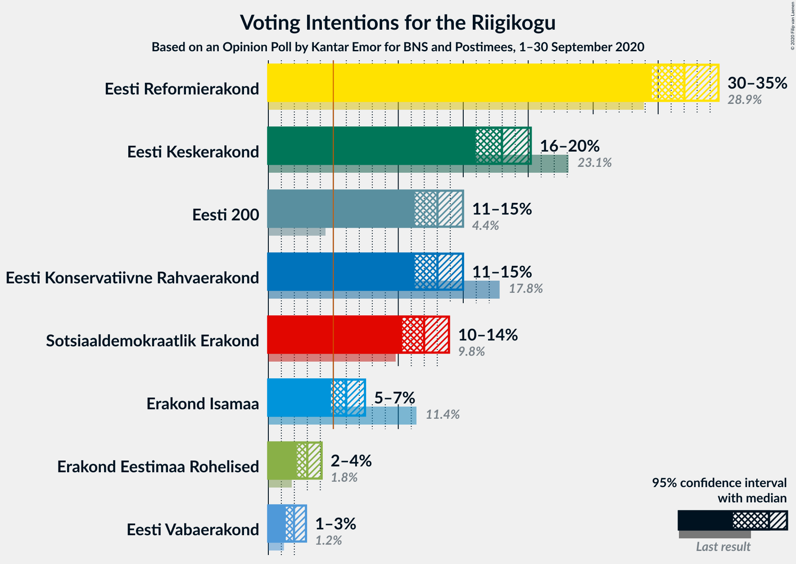

### Confidence Intervals

| Party | Last Result | Poll Result | 80% Confidence Interval | 90% Confidence Interval | 95% Confidence Interval | 99% Confidence Interval |
|:-----:|:-----------:|:-----------:|:-----------------------:|:-----------------------:|:-----------------------:|:-----------------------:|
| Eesti Reformierakond | 28.9% | 32.0% | 30.4–33.7% |29.9–34.2% |29.5–34.6% |28.7–35.5% |
| Eesti Keskerakond | 23.1% | 18.0% | 16.7–19.4% |16.3–19.8% |16.0–20.2% |15.3–20.9% |
| Eesti Konservatiivne Rahvaerakond | 17.8% | 13.0% | 11.9–14.3% |11.5–14.7% |11.3–15.0% |10.7–15.6% |
| Eesti 200 | 4.4% | 13.0% | 11.9–14.3% |11.5–14.7% |11.3–15.0% |10.7–15.6% |
| Sotsiaaldemokraatlik Erakond | 9.8% | 12.0% | 10.9–13.2% |10.6–13.6% |10.3–13.9% |9.8–14.5% |
| Erakond Isamaa | 11.4% | 6.0% | 5.2–6.9% |5.0–7.2% |4.8–7.4% |4.5–7.9% |
| Erakond Eestimaa Rohelised | 1.8% | 3.0% | 2.5–3.7% |2.3–3.9% |2.2–4.1% |2.0–4.5% |
| Eesti Vabaerakond | 1.2% | 2.0% | 1.6–2.6% |1.4–2.7% |1.3–2.9% |1.2–3.2% |

*Note:* The poll result column reflects the actual value used in the calculations. Published results may vary slightly, and in addition be rounded to fewer digits.

## Seats

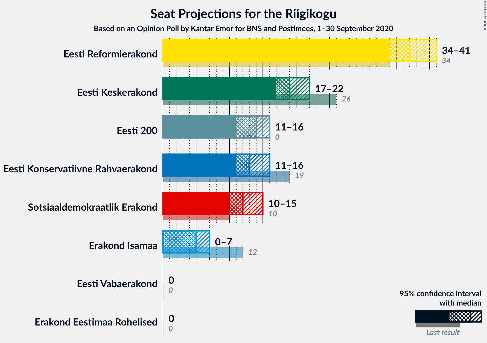

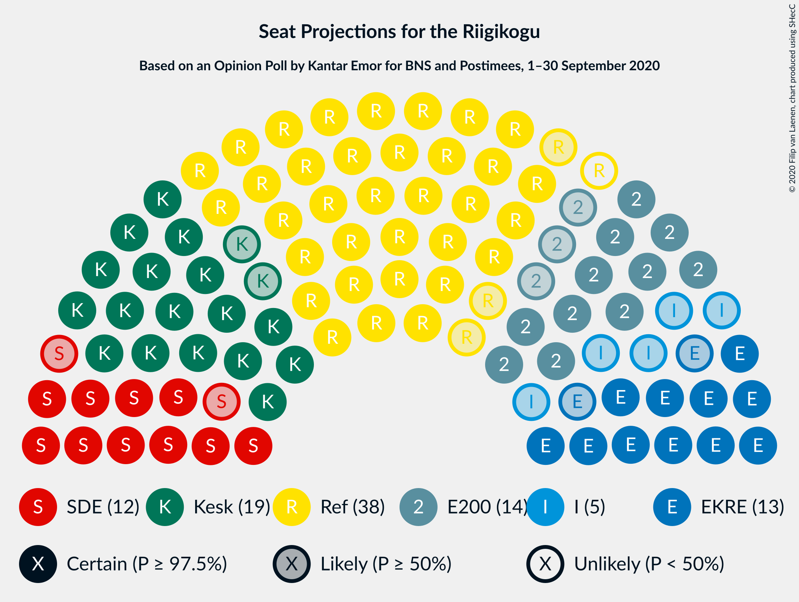

### Confidence Intervals

| Party | Last Result | Median | 80% Confidence Interval | 90% Confidence Interval | 95% Confidence Interval | 99% Confidence Interval |
|:-----:|:-----------:|:------:|:-----------------------:|:-----------------------:|:-----------------------:|:-----------------------:|
| <a href="#eesti-reformierakond">Eesti Reformierakond</a> | 34 | 37 | 35–39 |35–40 |34–41 |33–42 |
| <a href="#eesti-keskerakond">Eesti Keskerakond</a> | 26 | 19 | 18–21 |17–22 |17–22 |16–23 |
| <a href="#eesti-konservatiivne-rahvaerakond">Eesti Konservatiivne Rahvaerakond</a> | 19 | 13 | 12–15 |12–15 |11–16 |11–16 |
| <a href="#eesti-200">Eesti 200</a> | 0 | 14 | 12–15 |12–16 |11–16 |11–16 |
| <a href="#sotsiaaldemokraatlik-erakond">Sotsiaaldemokraatlik Erakond</a> | 10 | 12 | 11–14 |10–14 |10–15 |10–15 |
| <a href="#erakond-isamaa">Erakond Isamaa</a> | 12 | 5 | 5–6 |0–7 |0–7 |0–7 |
| <a href="#erakond-eestimaa-rohelised">Erakond Eestimaa Rohelised</a> | 0 | 0 | 0 |0 |0 |0 |
| <a href="#eesti-vabaerakond">Eesti Vabaerakond</a> | 0 | 0 | 0 |0 |0 |0 |

### Eesti Reformierakond

*For a full overview of the results for this party, see the [Eesti Reformierakond](party-eestireformierakond.html) page.*

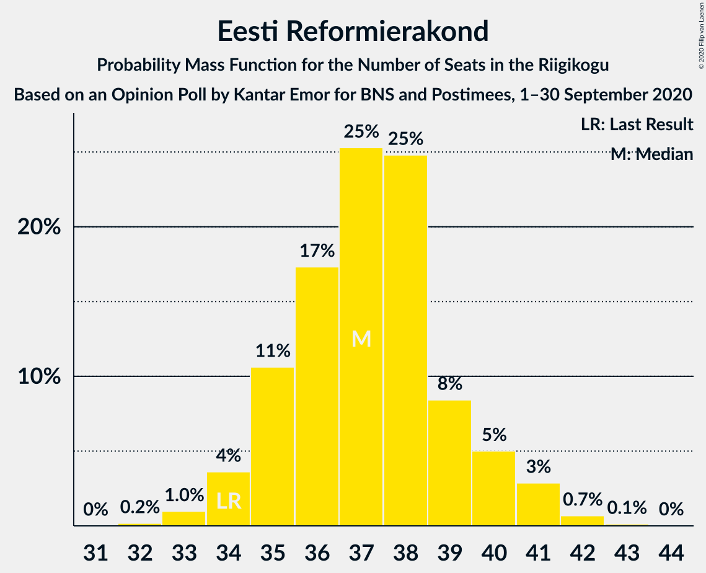

| Number of Seats | Probability | Accumulated | Special Marks |
|:---------------:|:-----------:|:-----------:|:-------------:|
| 32 | 0.2% | 100% |  |
| 33 | 1.0% | 99.8% |  |
| 34 | 4% | 98.8% | Last Result |
| 35 | 11% | 95% |  |
| 36 | 17% | 85% |  |
| 37 | 25% | 67% | Median |
| 38 | 25% | 42% |  |
| 39 | 8% | 17% |  |
| 40 | 5% | 9% |  |
| 41 | 3% | 4% |  |
| 42 | 0.7% | 0.9% |  |
| 43 | 0.1% | 0.2% |  |
| 44 | 0% | 0% |  |

### Eesti Keskerakond

*For a full overview of the results for this party, see the [Eesti Keskerakond](party-eestikeskerakond.html) page.*

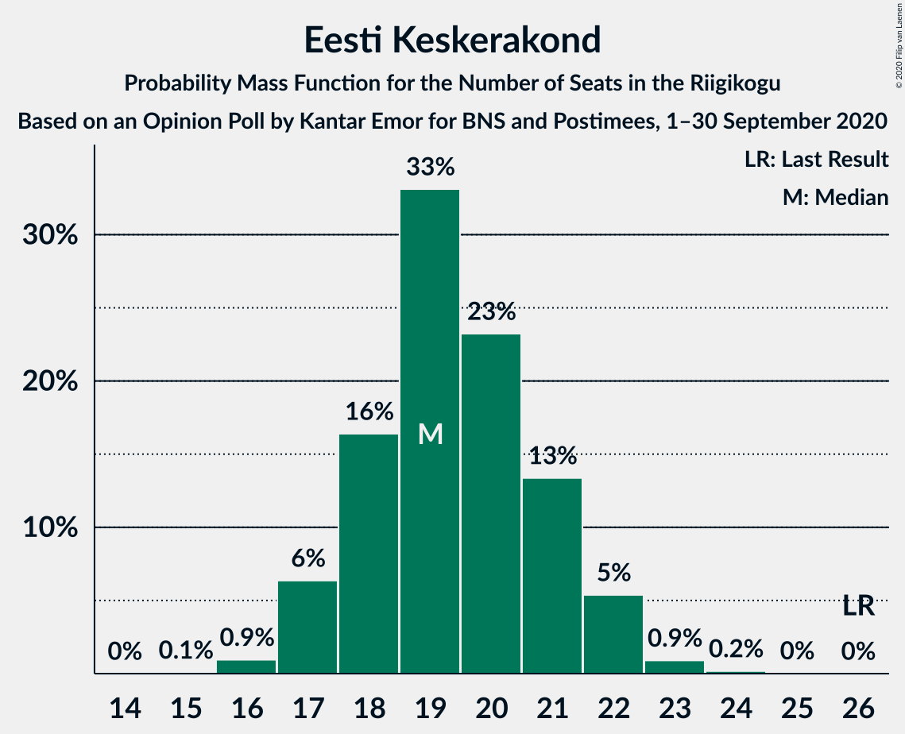

| Number of Seats | Probability | Accumulated | Special Marks |
|:---------------:|:-----------:|:-----------:|:-------------:|
| 15 | 0.1% | 100% |  |
| 16 | 0.9% | 99.9% |  |
| 17 | 6% | 99.0% |  |
| 18 | 16% | 93% |  |
| 19 | 33% | 76% | Median |
| 20 | 23% | 43% |  |
| 21 | 13% | 20% |  |
| 22 | 5% | 6% |  |
| 23 | 0.9% | 1.1% |  |
| 24 | 0.2% | 0.2% |  |
| 25 | 0% | 0% |  |
| 26 | 0% | 0% | Last Result |

### Eesti Konservatiivne Rahvaerakond

*For a full overview of the results for this party, see the [Eesti Konservatiivne Rahvaerakond](party-eestikonservatiivnerahvaerakond.html) page.*

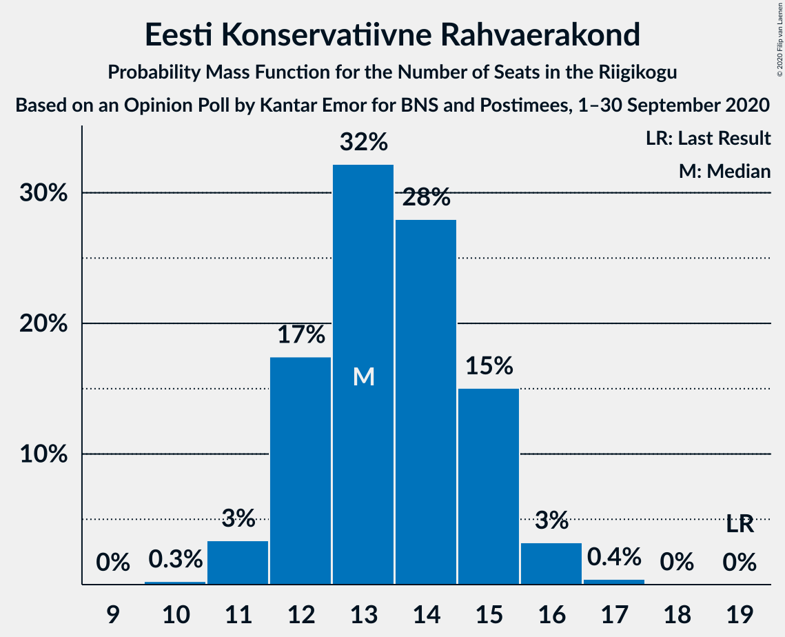

| Number of Seats | Probability | Accumulated | Special Marks |
|:---------------:|:-----------:|:-----------:|:-------------:|
| 10 | 0.3% | 100% |  |
| 11 | 3% | 99.7% |  |
| 12 | 17% | 96% |  |
| 13 | 32% | 79% | Median |
| 14 | 28% | 47% |  |
| 15 | 15% | 19% |  |
| 16 | 3% | 4% |  |
| 17 | 0.4% | 0.5% |  |
| 18 | 0% | 0% |  |
| 19 | 0% | 0% | Last Result |

### Eesti 200

*For a full overview of the results for this party, see the [Eesti 200](party-eesti200.html) page.*

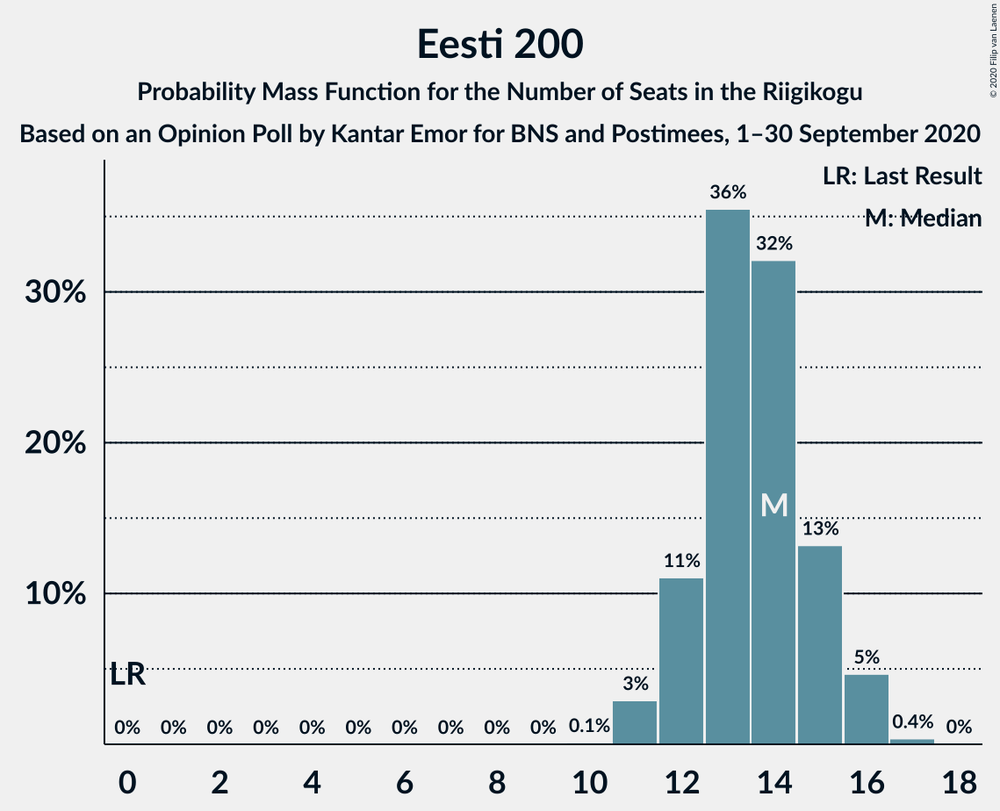

| Number of Seats | Probability | Accumulated | Special Marks |
|:---------------:|:-----------:|:-----------:|:-------------:|
| 0 | 0% | 100% | Last Result |
| 1 | 0% | 100% |  |
| 2 | 0% | 100% |  |
| 3 | 0% | 100% |  |
| 4 | 0% | 100% |  |
| 5 | 0% | 100% |  |
| 6 | 0% | 100% |  |
| 7 | 0% | 100% |  |
| 8 | 0% | 100% |  |
| 9 | 0% | 100% |  |
| 10 | 0.1% | 100% |  |
| 11 | 3% | 99.9% |  |
| 12 | 11% | 97% |  |
| 13 | 36% | 86% |  |
| 14 | 32% | 50% | Median |
| 15 | 13% | 18% |  |
| 16 | 5% | 5% |  |
| 17 | 0.4% | 0.4% |  |
| 18 | 0% | 0% |  |

### Sotsiaaldemokraatlik Erakond

*For a full overview of the results for this party, see the [Sotsiaaldemokraatlik Erakond](party-sotsiaaldemokraatlikerakond.html) page.*

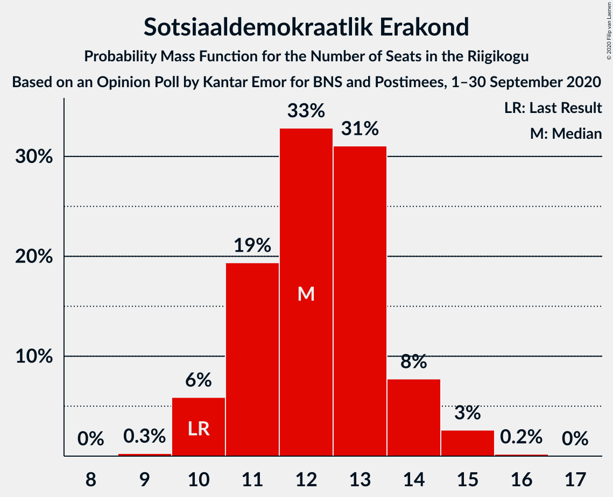

| Number of Seats | Probability | Accumulated | Special Marks |
|:---------------:|:-----------:|:-----------:|:-------------:|
| 9 | 0.3% | 100% |  |
| 10 | 6% | 99.7% | Last Result |
| 11 | 19% | 94% |  |
| 12 | 33% | 74% | Median |
| 13 | 31% | 42% |  |
| 14 | 8% | 11% |  |
| 15 | 3% | 3% |  |
| 16 | 0.2% | 0.2% |  |
| 17 | 0% | 0% |  |

### Erakond Isamaa

*For a full overview of the results for this party, see the [Erakond Isamaa](party-erakondisamaa.html) page.*

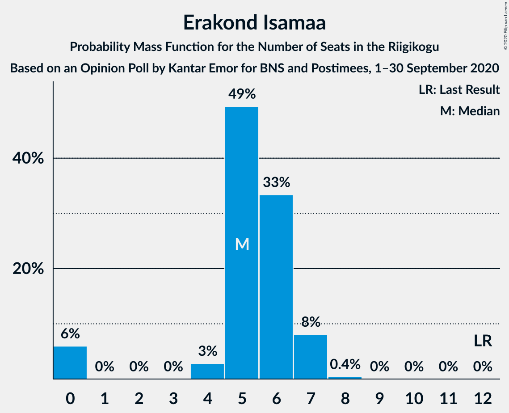

| Number of Seats | Probability | Accumulated | Special Marks |
|:---------------:|:-----------:|:-----------:|:-------------:|
| 0 | 6% | 100% |  |
| 1 | 0% | 94% |  |
| 2 | 0% | 94% |  |
| 3 | 0% | 94% |  |
| 4 | 3% | 94% |  |
| 5 | 49% | 91% | Median |
| 6 | 33% | 42% |  |
| 7 | 8% | 8% |  |
| 8 | 0.4% | 0.4% |  |
| 9 | 0% | 0% |  |
| 10 | 0% | 0% |  |
| 11 | 0% | 0% |  |
| 12 | 0% | 0% | Last Result |

### Erakond Eestimaa Rohelised

*For a full overview of the results for this party, see the [Erakond Eestimaa Rohelised](party-erakondeestimaarohelised.html) page.*

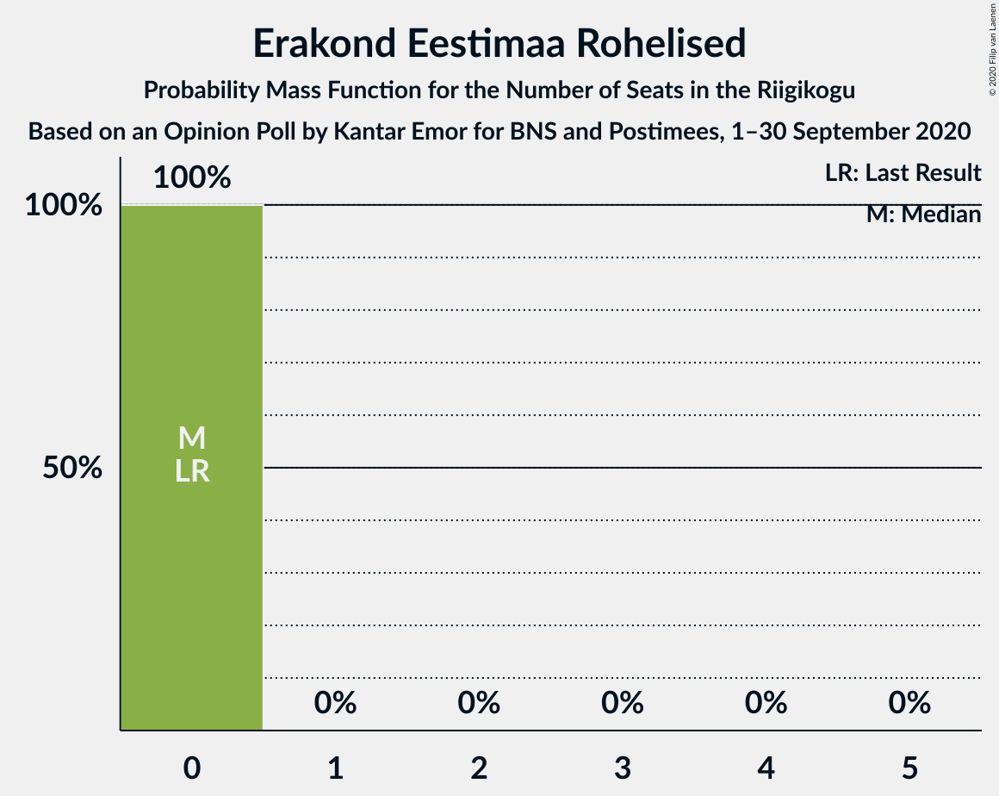

| Number of Seats | Probability | Accumulated | Special Marks |
|:---------------:|:-----------:|:-----------:|:-------------:|
| 0 | 100% | 100% | Last Result, Median |

### Eesti Vabaerakond

*For a full overview of the results for this party, see the [Eesti Vabaerakond](party-eestivabaerakond.html) page.*

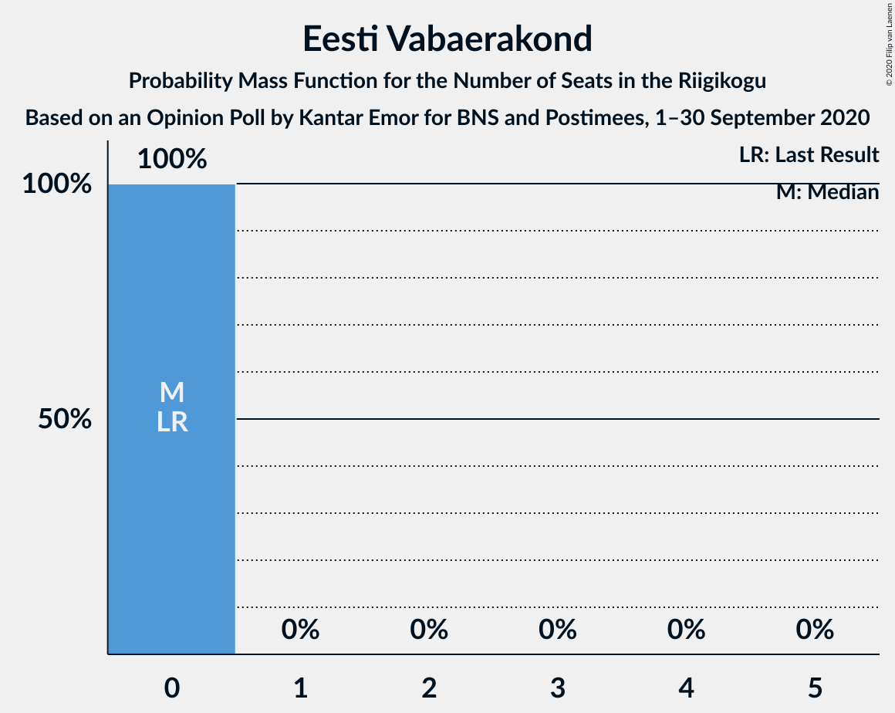

| Number of Seats | Probability | Accumulated | Special Marks |
|:---------------:|:-----------:|:-----------:|:-------------:|
| 0 | 100% | 100% | Last Result, Median |

## Coalitions

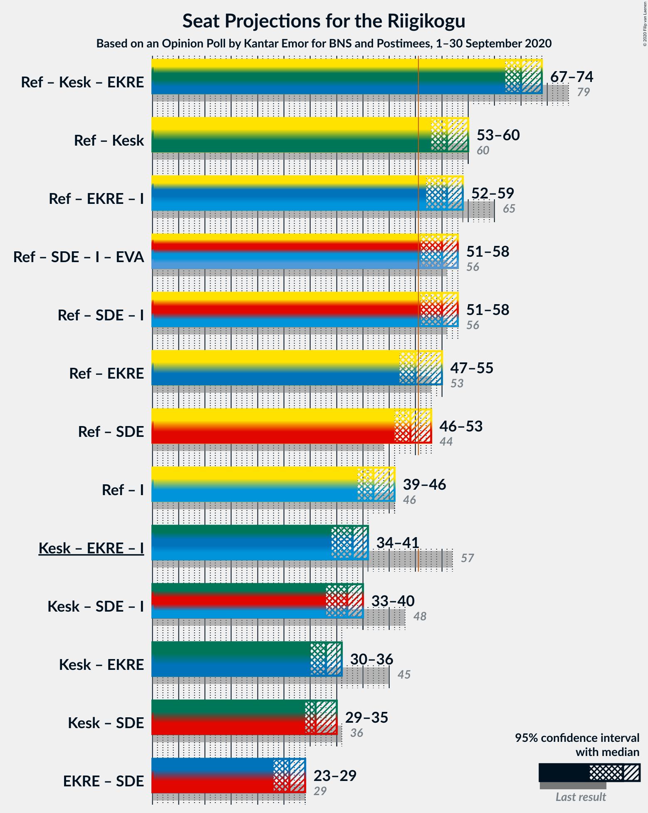

### Confidence Intervals

| Coalition | Last Result | Median | Majority? | 80% Confidence Interval | 90% Confidence Interval | 95% Confidence Interval | 99% Confidence Interval |
|:---------:|:-----------:|:------:|:---------:|:-----------------------:|:-----------------------:|:-----------------------:|:-----------------------:|
| Eesti Reformierakond – Eesti Keskerakond – Eesti Konservatiivne Rahvaerakond | 79 | 70 | 100% | 68–72 | 67–74 | 67–74 | 66–76 |
| Eesti Reformierakond – Eesti Keskerakond | 60 | 56 | 100% | 54–59 | 54–60 | 53–60 | 52–62 |
| Eesti Reformierakond – Eesti Konservatiivne Rahvaerakond – Erakond Isamaa | 65 | 56 | 99.7% | 54–58 | 53–59 | 52–59 | 51–60 |
| Eesti Reformierakond – Sotsiaaldemokraatlik Erakond – Erakond Isamaa – Eesti Vabaerakond | 56 | 55 | 98.6% | 52–57 | 52–57 | 51–58 | 49–59 |
| Eesti Reformierakond – Sotsiaaldemokraatlik Erakond – Erakond Isamaa | 56 | 55 | 98.6% | 52–57 | 52–57 | 51–58 | 49–59 |
| Eesti Reformierakond – Eesti Konservatiivne Rahvaerakond | 53 | 50 | 49% | 49–53 | 48–54 | 47–55 | 46–56 |
| Eesti Reformierakond – Sotsiaaldemokraatlik Erakond | 44 | 49 | 25% | 47–52 | 47–53 | 46–53 | 45–55 |
| Eesti Reformierakond – Erakond Isamaa | 46 | 42 | 0% | 40–44 | 39–45 | 39–46 | 37–47 |
| Eesti Keskerakond – Eesti Konservatiivne Rahvaerakond – Erakond Isamaa | 57 | 38 | 0% | 36–40 | 35–41 | 34–41 | 32–42 |
| Eesti Keskerakond – Sotsiaaldemokraatlik Erakond – Erakond Isamaa | 48 | 37 | 0% | 35–39 | 34–40 | 33–40 | 31–41 |
| Eesti Keskerakond – Eesti Konservatiivne Rahvaerakond | 45 | 33 | 0% | 31–35 | 30–36 | 30–36 | 29–37 |
| Eesti Keskerakond – Sotsiaaldemokraatlik Erakond | 36 | 31 | 0% | 30–34 | 29–34 | 29–35 | 28–36 |
| Eesti Konservatiivne Rahvaerakond – Sotsiaaldemokraatlik Erakond | 29 | 26 | 0% | 24–28 | 23–28 | 23–29 | 22–30 |

### Eesti Reformierakond – Eesti Keskerakond – Eesti Konservatiivne Rahvaerakond

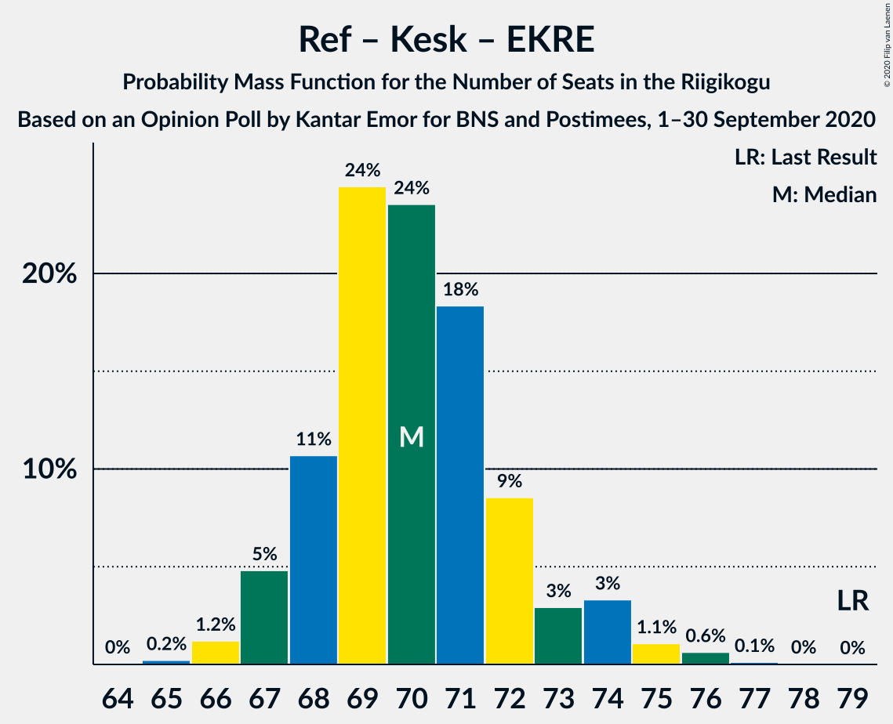

| Number of Seats | Probability | Accumulated | Special Marks |
|:---------------:|:-----------:|:-----------:|:-------------:|
| 65 | 0.2% | 100% |  |
| 66 | 1.2% | 99.7% |  |
| 67 | 5% | 98.5% |  |
| 68 | 11% | 94% |  |
| 69 | 24% | 83% | Median |
| 70 | 24% | 59% |  |
| 71 | 18% | 35% |  |
| 72 | 9% | 17% |  |
| 73 | 3% | 8% |  |
| 74 | 3% | 5% |  |
| 75 | 1.1% | 2% |  |
| 76 | 0.6% | 0.8% |  |
| 77 | 0.1% | 0.2% |  |
| 78 | 0% | 0.1% |  |
| 79 | 0% | 0% | Last Result |

### Eesti Reformierakond – Eesti Keskerakond

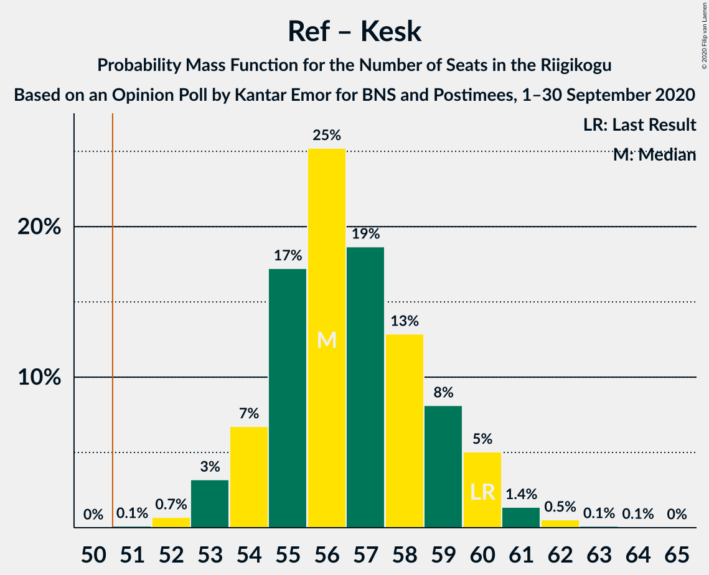

| Number of Seats | Probability | Accumulated | Special Marks |
|:---------------:|:-----------:|:-----------:|:-------------:|
| 51 | 0.1% | 100% | Majority |
| 52 | 0.7% | 99.9% |  |
| 53 | 3% | 99.2% |  |
| 54 | 7% | 96% |  |
| 55 | 17% | 89% |  |
| 56 | 25% | 72% | Median |
| 57 | 19% | 47% |  |
| 58 | 13% | 28% |  |
| 59 | 8% | 15% |  |
| 60 | 5% | 7% | Last Result |
| 61 | 1.4% | 2% |  |
| 62 | 0.5% | 0.7% |  |
| 63 | 0.1% | 0.2% |  |
| 64 | 0.1% | 0.1% |  |
| 65 | 0% | 0% |  |

### Eesti Reformierakond – Eesti Konservatiivne Rahvaerakond – Erakond Isamaa

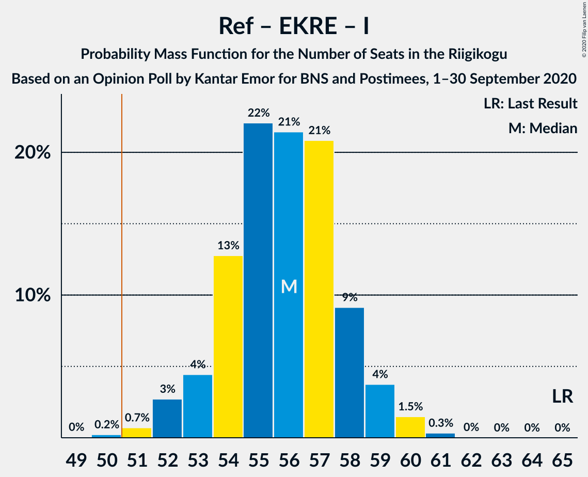

| Number of Seats | Probability | Accumulated | Special Marks |
|:---------------:|:-----------:|:-----------:|:-------------:|
| 49 | 0% | 100% |  |
| 50 | 0.2% | 99.9% |  |
| 51 | 0.7% | 99.7% | Majority |
| 52 | 3% | 99.0% |  |
| 53 | 4% | 96% |  |
| 54 | 13% | 92% |  |
| 55 | 22% | 79% | Median |
| 56 | 21% | 57% |  |
| 57 | 21% | 36% |  |
| 58 | 9% | 15% |  |
| 59 | 4% | 6% |  |
| 60 | 1.5% | 2% |  |
| 61 | 0.3% | 0.4% |  |
| 62 | 0% | 0% |  |
| 63 | 0% | 0% |  |
| 64 | 0% | 0% |  |
| 65 | 0% | 0% | Last Result |

### Eesti Reformierakond – Sotsiaaldemokraatlik Erakond – Erakond Isamaa – Eesti Vabaerakond

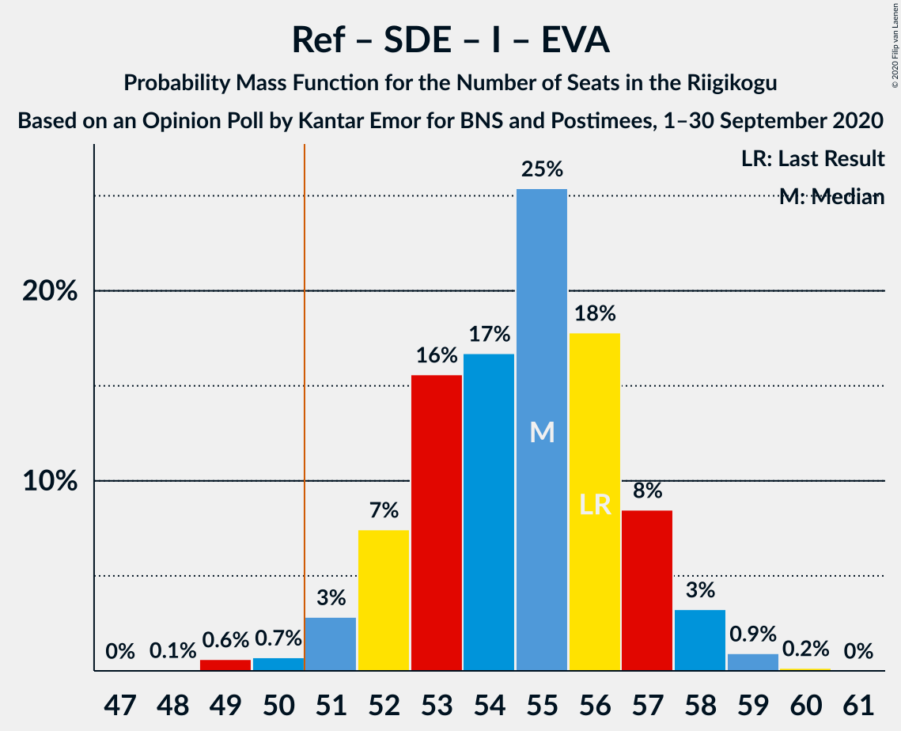

| Number of Seats | Probability | Accumulated | Special Marks |
|:---------------:|:-----------:|:-----------:|:-------------:|
| 48 | 0.1% | 100% |  |
| 49 | 0.6% | 99.9% |  |
| 50 | 0.7% | 99.3% |  |
| 51 | 3% | 98.6% | Majority |
| 52 | 7% | 96% |  |
| 53 | 16% | 88% |  |
| 54 | 17% | 73% | Median |
| 55 | 25% | 56% |  |
| 56 | 18% | 31% | Last Result |
| 57 | 8% | 13% |  |
| 58 | 3% | 4% |  |
| 59 | 0.9% | 1.1% |  |
| 60 | 0.2% | 0.2% |  |
| 61 | 0% | 0% |  |

### Eesti Reformierakond – Sotsiaaldemokraatlik Erakond – Erakond Isamaa

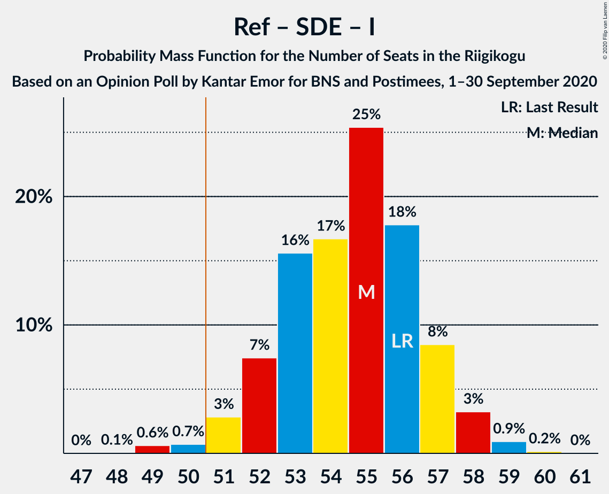

| Number of Seats | Probability | Accumulated | Special Marks |
|:---------------:|:-----------:|:-----------:|:-------------:|
| 48 | 0.1% | 100% |  |
| 49 | 0.6% | 99.9% |  |
| 50 | 0.7% | 99.3% |  |
| 51 | 3% | 98.6% | Majority |
| 52 | 7% | 96% |  |
| 53 | 16% | 88% |  |
| 54 | 17% | 73% | Median |
| 55 | 25% | 56% |  |
| 56 | 18% | 31% | Last Result |
| 57 | 8% | 13% |  |
| 58 | 3% | 4% |  |
| 59 | 0.9% | 1.1% |  |
| 60 | 0.2% | 0.2% |  |
| 61 | 0% | 0% |  |

### Eesti Reformierakond – Eesti Konservatiivne Rahvaerakond

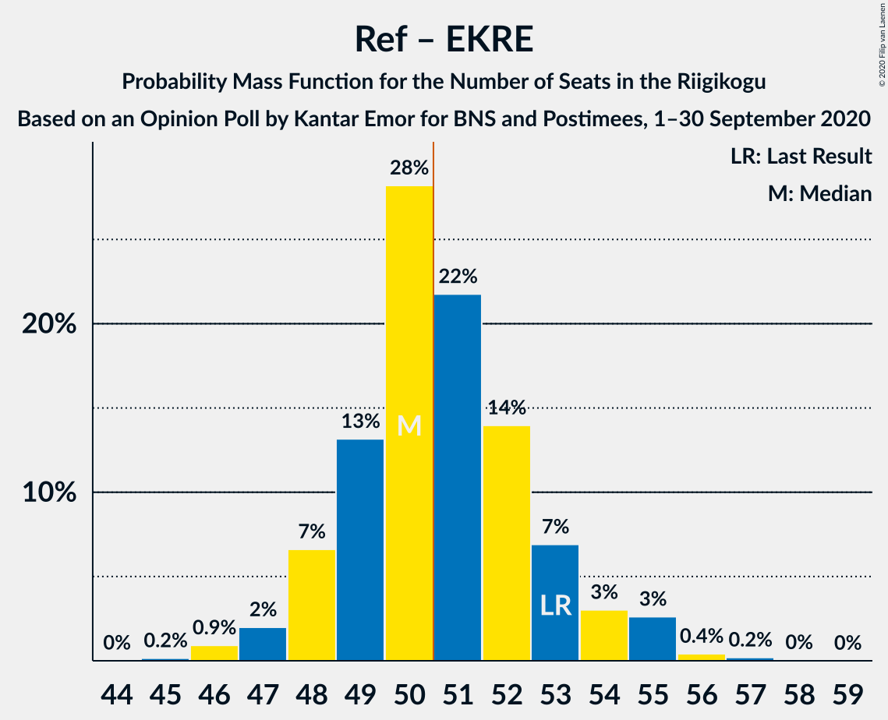

| Number of Seats | Probability | Accumulated | Special Marks |
|:---------------:|:-----------:|:-----------:|:-------------:|
| 45 | 0.2% | 100% |  |
| 46 | 0.9% | 99.8% |  |
| 47 | 2% | 98.9% |  |
| 48 | 7% | 97% |  |
| 49 | 13% | 90% |  |
| 50 | 28% | 77% | Median |
| 51 | 22% | 49% | Majority |
| 52 | 14% | 27% |  |
| 53 | 7% | 13% | Last Result |
| 54 | 3% | 6% |  |
| 55 | 3% | 3% |  |
| 56 | 0.4% | 0.7% |  |
| 57 | 0.2% | 0.2% |  |
| 58 | 0% | 0.1% |  |
| 59 | 0% | 0% |  |

### Eesti Reformierakond – Sotsiaaldemokraatlik Erakond

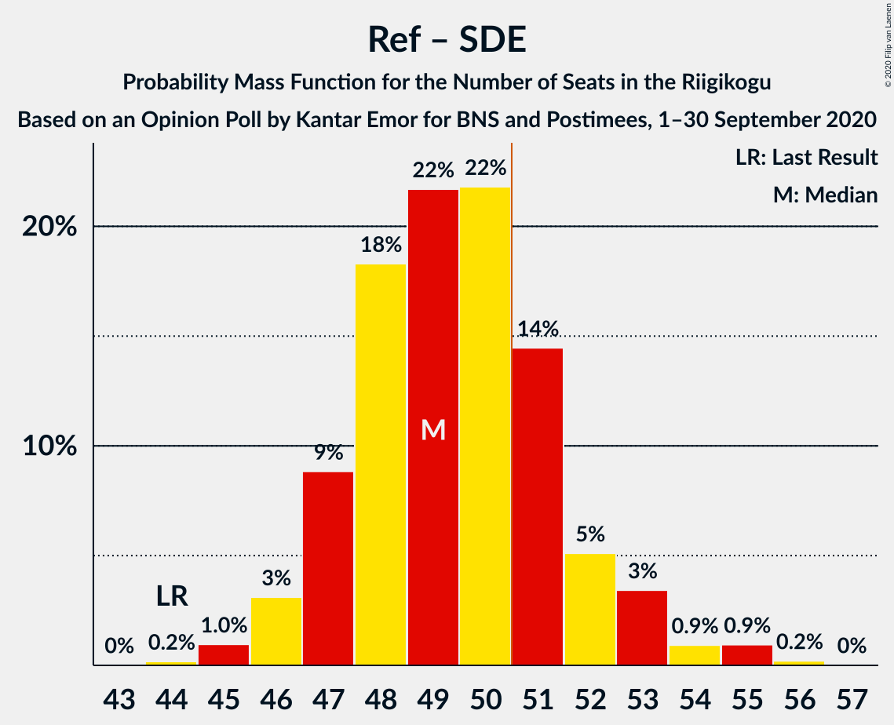

| Number of Seats | Probability | Accumulated | Special Marks |
|:---------------:|:-----------:|:-----------:|:-------------:|
| 44 | 0.2% | 100% | Last Result |
| 45 | 1.0% | 99.8% |  |
| 46 | 3% | 98.8% |  |
| 47 | 9% | 96% |  |
| 48 | 18% | 87% |  |
| 49 | 22% | 69% | Median |
| 50 | 22% | 47% |  |
| 51 | 14% | 25% | Majority |
| 52 | 5% | 11% |  |
| 53 | 3% | 6% |  |
| 54 | 0.9% | 2% |  |
| 55 | 0.9% | 1.2% |  |
| 56 | 0.2% | 0.2% |  |
| 57 | 0% | 0% |  |

### Eesti Reformierakond – Erakond Isamaa

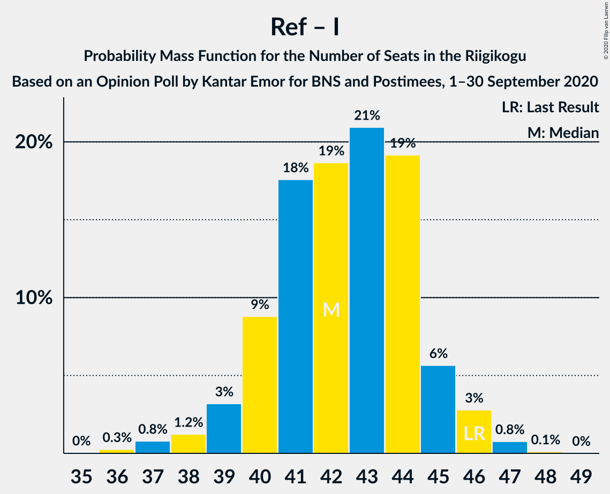

| Number of Seats | Probability | Accumulated | Special Marks |
|:---------------:|:-----------:|:-----------:|:-------------:|
| 36 | 0.3% | 100% |  |
| 37 | 0.8% | 99.7% |  |
| 38 | 1.2% | 98.9% |  |
| 39 | 3% | 98% |  |
| 40 | 9% | 94% |  |
| 41 | 18% | 86% |  |
| 42 | 19% | 68% | Median |
| 43 | 21% | 49% |  |
| 44 | 19% | 28% |  |
| 45 | 6% | 9% |  |
| 46 | 3% | 4% | Last Result |
| 47 | 0.8% | 0.9% |  |
| 48 | 0.1% | 0.1% |  |
| 49 | 0% | 0% |  |

### Eesti Keskerakond – Eesti Konservatiivne Rahvaerakond – Erakond Isamaa

| Number of Seats | Probability | Accumulated | Special Marks |
|:---------------:|:-----------:|:-----------:|:-------------:|
| 31 | 0.2% | 100% |  |
| 32 | 0.3% | 99.8% |  |
| 33 | 1.4% | 99.5% |  |
| 34 | 2% | 98% |  |
| 35 | 4% | 96% |  |
| 36 | 10% | 92% |  |
| 37 | 19% | 82% | Median |
| 38 | 21% | 63% |  |
| 39 | 23% | 42% |  |
| 40 | 13% | 19% |  |
| 41 | 4% | 6% |  |
| 42 | 2% | 2% |  |
| 43 | 0.3% | 0.4% |  |
| 44 | 0% | 0.1% |  |
| 45 | 0% | 0% |  |
| 46 | 0% | 0% |  |
| 47 | 0% | 0% |  |
| 48 | 0% | 0% |  |
| 49 | 0% | 0% |  |
| 50 | 0% | 0% |  |
| 51 | 0% | 0% | Majority |
| 52 | 0% | 0% |  |
| 53 | 0% | 0% |  |
| 54 | 0% | 0% |  |
| 55 | 0% | 0% |  |
| 56 | 0% | 0% |  |
| 57 | 0% | 0% | Last Result |

### Eesti Keskerakond – Sotsiaaldemokraatlik Erakond – Erakond Isamaa

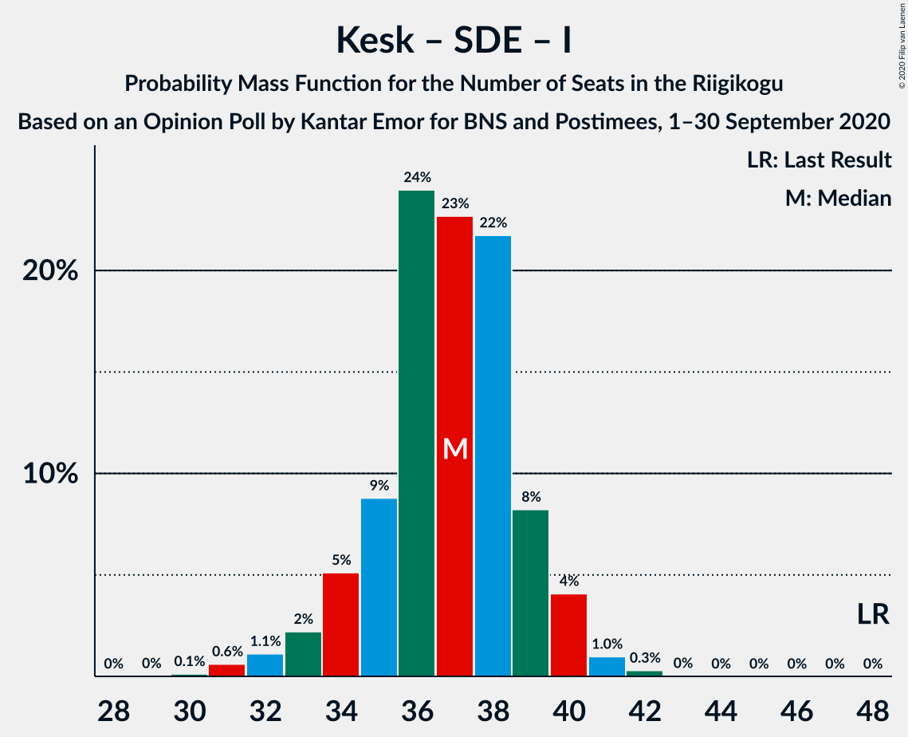

| Number of Seats | Probability | Accumulated | Special Marks |
|:---------------:|:-----------:|:-----------:|:-------------:|
| 30 | 0.1% | 100% |  |
| 31 | 0.6% | 99.8% |  |
| 32 | 1.1% | 99.2% |  |
| 33 | 2% | 98% |  |
| 34 | 5% | 96% |  |
| 35 | 9% | 91% |  |
| 36 | 24% | 82% | Median |
| 37 | 23% | 58% |  |
| 38 | 22% | 35% |  |
| 39 | 8% | 14% |  |
| 40 | 4% | 5% |  |
| 41 | 1.0% | 1.3% |  |
| 42 | 0.3% | 0.3% |  |
| 43 | 0% | 0% |  |
| 44 | 0% | 0% |  |
| 45 | 0% | 0% |  |
| 46 | 0% | 0% |  |
| 47 | 0% | 0% |  |
| 48 | 0% | 0% | Last Result |

### Eesti Keskerakond – Eesti Konservatiivne Rahvaerakond

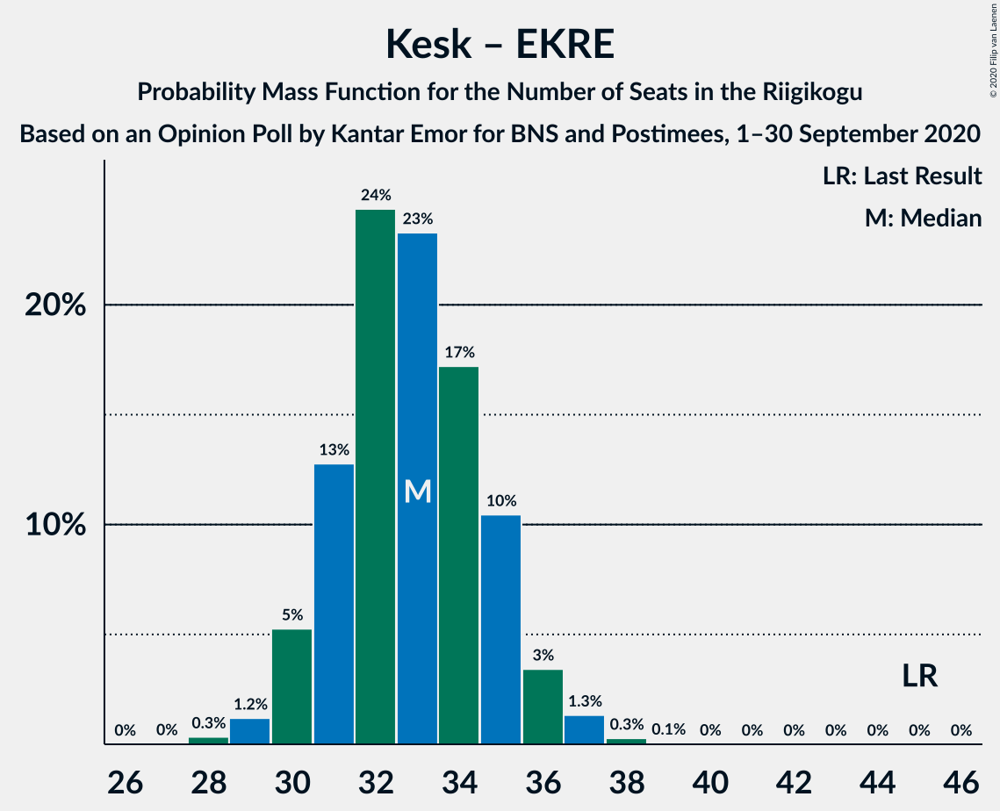

| Number of Seats | Probability | Accumulated | Special Marks |
|:---------------:|:-----------:|:-----------:|:-------------:|
| 28 | 0.3% | 100% |  |
| 29 | 1.2% | 99.6% |  |
| 30 | 5% | 98% |  |
| 31 | 13% | 93% |  |
| 32 | 24% | 80% | Median |
| 33 | 23% | 56% |  |
| 34 | 17% | 33% |  |
| 35 | 10% | 16% |  |
| 36 | 3% | 5% |  |
| 37 | 1.3% | 2% |  |
| 38 | 0.3% | 0.3% |  |
| 39 | 0.1% | 0.1% |  |
| 40 | 0% | 0% |  |
| 41 | 0% | 0% |  |
| 42 | 0% | 0% |  |
| 43 | 0% | 0% |  |
| 44 | 0% | 0% |  |
| 45 | 0% | 0% | Last Result |

### Eesti Keskerakond – Sotsiaaldemokraatlik Erakond

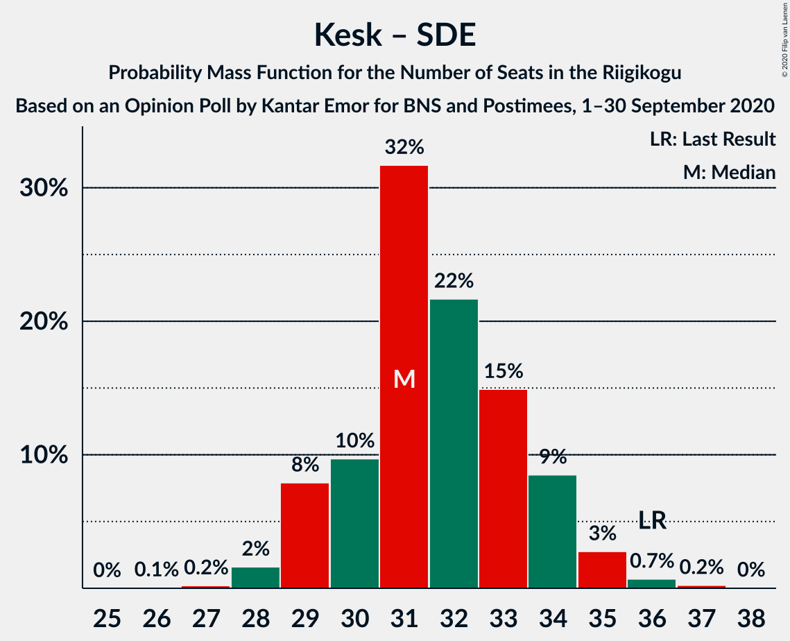

| Number of Seats | Probability | Accumulated | Special Marks |
|:---------------:|:-----------:|:-----------:|:-------------:|
| 26 | 0.1% | 100% |  |
| 27 | 0.2% | 99.9% |  |
| 28 | 2% | 99.7% |  |
| 29 | 8% | 98% |  |
| 30 | 10% | 90% |  |
| 31 | 32% | 81% | Median |
| 32 | 22% | 49% |  |
| 33 | 15% | 27% |  |
| 34 | 9% | 12% |  |
| 35 | 3% | 4% |  |
| 36 | 0.7% | 1.0% | Last Result |
| 37 | 0.2% | 0.3% |  |
| 38 | 0% | 0% |  |

### Eesti Konservatiivne Rahvaerakond – Sotsiaaldemokraatlik Erakond

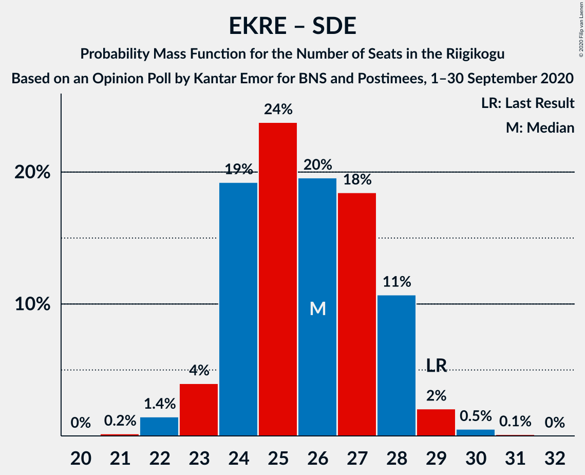

| Number of Seats | Probability | Accumulated | Special Marks |
|:---------------:|:-----------:|:-----------:|:-------------:|
| 21 | 0.2% | 100% |  |
| 22 | 1.4% | 99.8% |  |
| 23 | 4% | 98% |  |
| 24 | 19% | 94% |  |
| 25 | 24% | 75% | Median |
| 26 | 20% | 51% |  |
| 27 | 18% | 32% |  |
| 28 | 11% | 13% |  |
| 29 | 2% | 3% | Last Result |
| 30 | 0.5% | 0.7% |  |
| 31 | 0.1% | 0.1% |  |
| 32 | 0% | 0% |  |

## Technical Information

### Opinion Poll

+ **Polling firm:** Kantar Emor
+ **Commissioner(s):** BNS and Postimees
+ **Fieldwork period:** 1–30 September 2020

### Calculations

+ **Sample size:** 1268
+ **Simulations done:** 1,048,576
+ **Error estimate:** 1.54%

