# Opinion Poll by Norstat for MTÜ Ühiskonnauuringute Instituut, 28 September–5 October 2020

<a href="#voting-intentions">Voting Intentions</a> | <a href="#seats">Seats</a> | <a href="#coalitions">Coalitions</a> | <a href="#technical-information">Technical Information</a>

## Voting Intentions

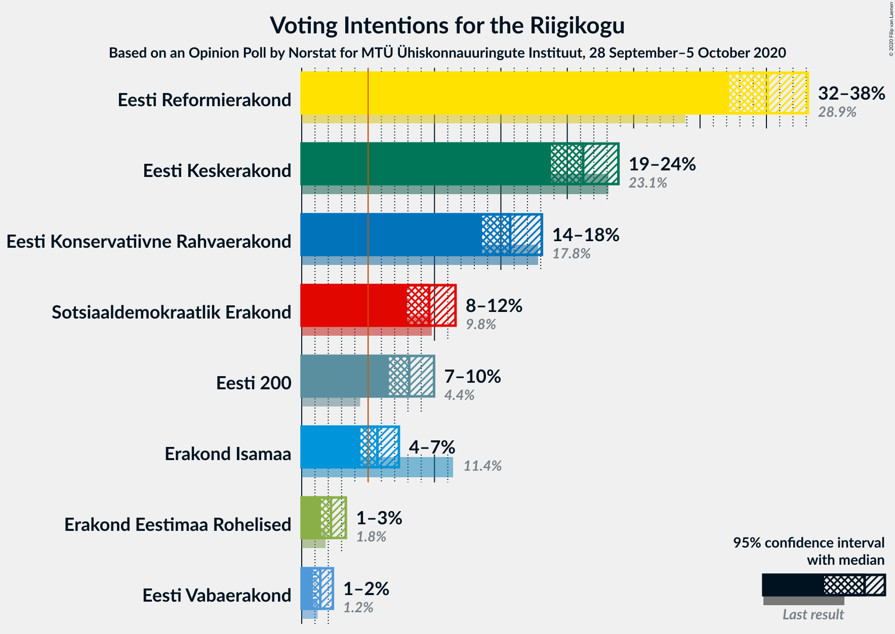

### Confidence Intervals

| Party | Last Result | Poll Result | 80% Confidence Interval | 90% Confidence Interval | 95% Confidence Interval | 99% Confidence Interval |
|:-----:|:-----------:|:-----------:|:-----------------------:|:-----------------------:|:-----------------------:|:-----------------------:|
| Eesti Reformierakond | 28.9% | 35.1% | 33.2–37.1% |32.7–37.6% |32.2–38.1% |31.3–39.1% |
| Eesti Keskerakond | 23.1% | 21.2% | 19.6–22.9% |19.2–23.4% |18.8–23.9% |18.0–24.7% |
| Eesti Konservatiivne Rahvaerakond | 17.8% | 15.7% | 14.3–17.3% |13.9–17.7% |13.6–18.1% |12.9–18.9% |
| Sotsiaaldemokraatlik Erakond | 9.8% | 9.6% | 8.5–10.9% |8.2–11.3% |7.9–11.6% |7.4–12.2% |
| Eesti 200 | 4.4% | 8.1% | 7.1–9.3% |6.8–9.7% |6.6–10.0% |6.1–10.6% |
| Erakond Isamaa | 11.4% | 5.7% | 4.9–6.8% |4.6–7.1% |4.4–7.3% |4.1–7.8% |
| Erakond Eestimaa Rohelised | 1.8% | 2.2% | 1.7–2.9% |1.6–3.1% |1.4–3.3% |1.2–3.7% |
| Eesti Vabaerakond | 1.2% | 1.4% | 1.0–2.0% |0.9–2.2% |0.8–2.3% |0.7–2.7% |

*Note:* The poll result column reflects the actual value used in the calculations. Published results may vary slightly, and in addition be rounded to fewer digits.

## Seats

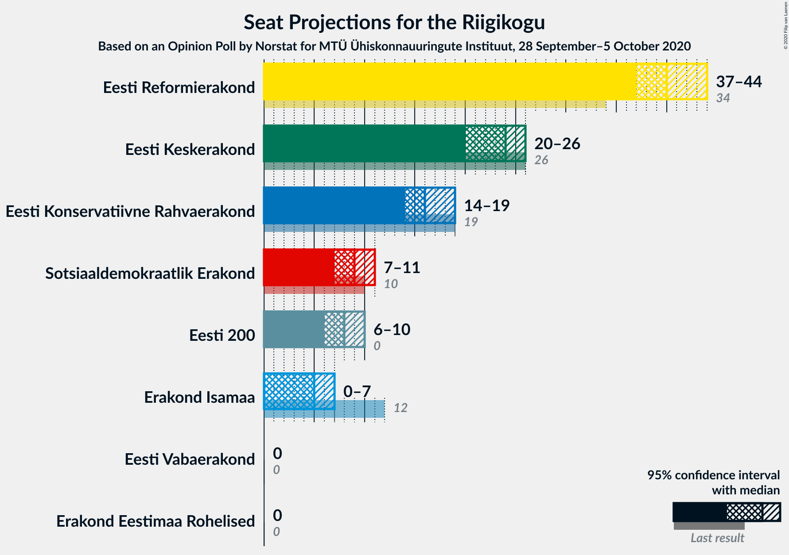

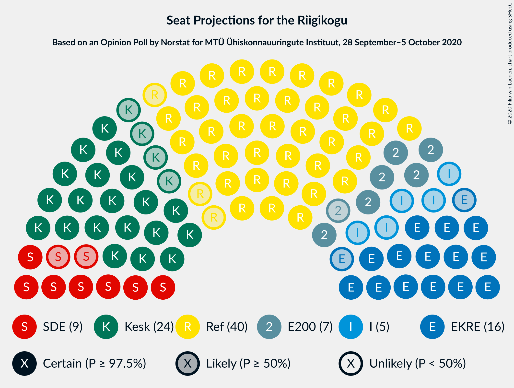

### Confidence Intervals

| Party | Last Result | Median | 80% Confidence Interval | 90% Confidence Interval | 95% Confidence Interval | 99% Confidence Interval |
|:-----:|:-----------:|:------:|:-----------------------:|:-----------------------:|:-----------------------:|:-----------------------:|
| <a href="#eesti-reformierakond">Eesti Reformierakond</a> | 34 | 40 | 38–43 |37–44 |37–44 |36–46 |
| <a href="#eesti-keskerakond">Eesti Keskerakond</a> | 26 | 24 | 21–25 |20–25 |20–26 |19–27 |
| <a href="#eesti-konservatiivne-rahvaerakond">Eesti Konservatiivne Rahvaerakond</a> | 19 | 16 | 15–18 |14–19 |14–19 |13–20 |
| <a href="#sotsiaaldemokraatlik-erakond">Sotsiaaldemokraatlik Erakond</a> | 10 | 9 | 8–11 |8–11 |7–11 |7–12 |
| <a href="#eesti-200">Eesti 200</a> | 0 | 8 | 6–9 |6–9 |6–10 |5–10 |
| <a href="#erakond-isamaa">Erakond Isamaa</a> | 12 | 5 | 0–6 |0–6 |0–7 |0–7 |
| <a href="#erakond-eestimaa-rohelised">Erakond Eestimaa Rohelised</a> | 0 | 0 | 0 |0 |0 |0 |
| <a href="#eesti-vabaerakond">Eesti Vabaerakond</a> | 0 | 0 | 0 |0 |0 |0 |

### Eesti Reformierakond

*For a full overview of the results for this party, see the [Eesti Reformierakond](party-eestireformierakond.html) page.*

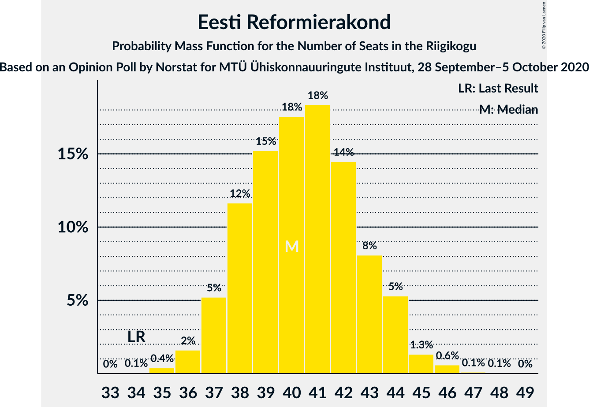

| Number of Seats | Probability | Accumulated | Special Marks |
|:---------------:|:-----------:|:-----------:|:-------------:|
| 34 | 0.1% | 100% | Last Result |
| 35 | 0.4% | 99.9% |  |
| 36 | 2% | 99.5% |  |
| 37 | 5% | 98% |  |
| 38 | 12% | 93% |  |
| 39 | 15% | 81% |  |
| 40 | 18% | 66% | Median |
| 41 | 18% | 48% |  |
| 42 | 14% | 30% |  |
| 43 | 8% | 15% |  |
| 44 | 5% | 7% |  |
| 45 | 1.3% | 2% |  |
| 46 | 0.6% | 0.8% |  |
| 47 | 0.1% | 0.2% |  |
| 48 | 0.1% | 0.1% |  |
| 49 | 0% | 0% |  |

### Eesti Keskerakond

*For a full overview of the results for this party, see the [Eesti Keskerakond](party-eestikeskerakond.html) page.*

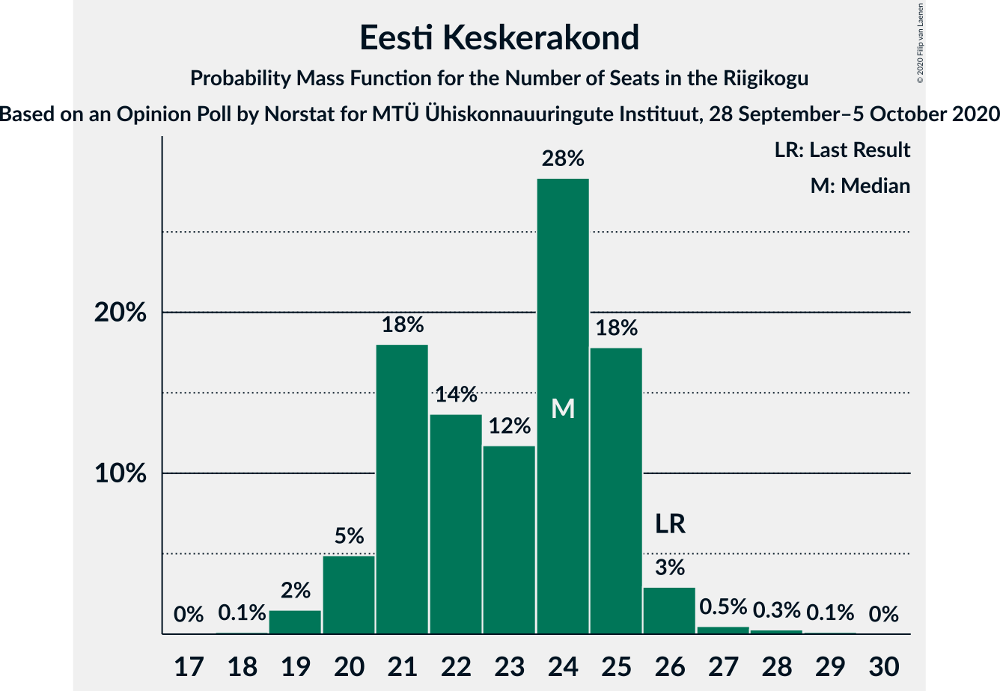

| Number of Seats | Probability | Accumulated | Special Marks |
|:---------------:|:-----------:|:-----------:|:-------------:|
| 18 | 0.1% | 100% |  |
| 19 | 2% | 99.9% |  |
| 20 | 5% | 98% |  |
| 21 | 18% | 93% |  |
| 22 | 14% | 75% |  |
| 23 | 12% | 62% |  |
| 24 | 28% | 50% | Median |
| 25 | 18% | 22% |  |
| 26 | 3% | 4% | Last Result |
| 27 | 0.5% | 0.9% |  |
| 28 | 0.3% | 0.4% |  |
| 29 | 0.1% | 0.1% |  |
| 30 | 0% | 0% |  |

### Eesti Konservatiivne Rahvaerakond

*For a full overview of the results for this party, see the [Eesti Konservatiivne Rahvaerakond](party-eestikonservatiivnerahvaerakond.html) page.*

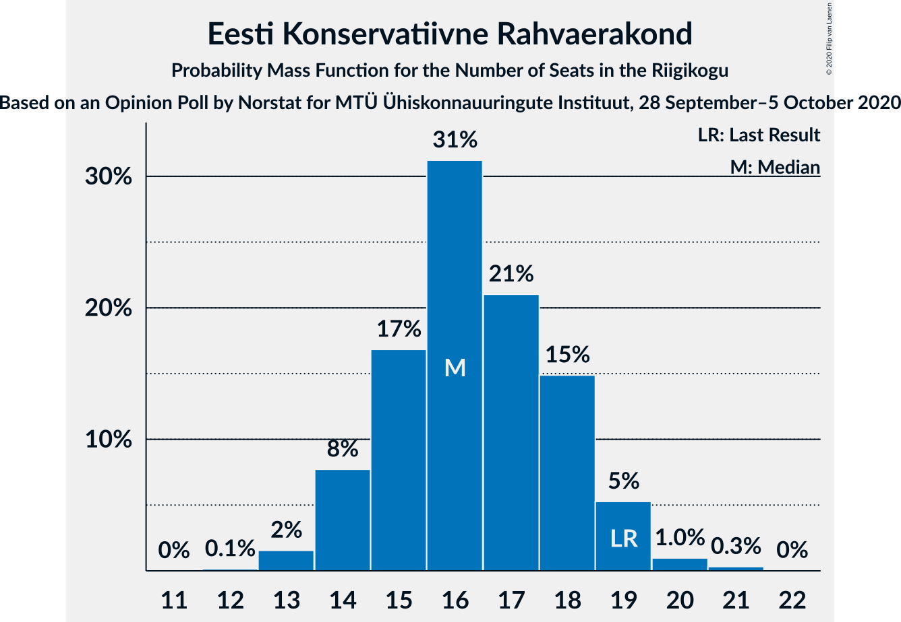

| Number of Seats | Probability | Accumulated | Special Marks |
|:---------------:|:-----------:|:-----------:|:-------------:|
| 12 | 0.1% | 100% |  |
| 13 | 2% | 99.8% |  |
| 14 | 8% | 98% |  |
| 15 | 17% | 91% |  |
| 16 | 31% | 74% | Median |
| 17 | 21% | 43% |  |
| 18 | 15% | 21% |  |
| 19 | 5% | 7% | Last Result |
| 20 | 1.0% | 1.3% |  |
| 21 | 0.3% | 0.4% |  |
| 22 | 0% | 0% |  |

### Sotsiaaldemokraatlik Erakond

*For a full overview of the results for this party, see the [Sotsiaaldemokraatlik Erakond](party-sotsiaaldemokraatlikerakond.html) page.*

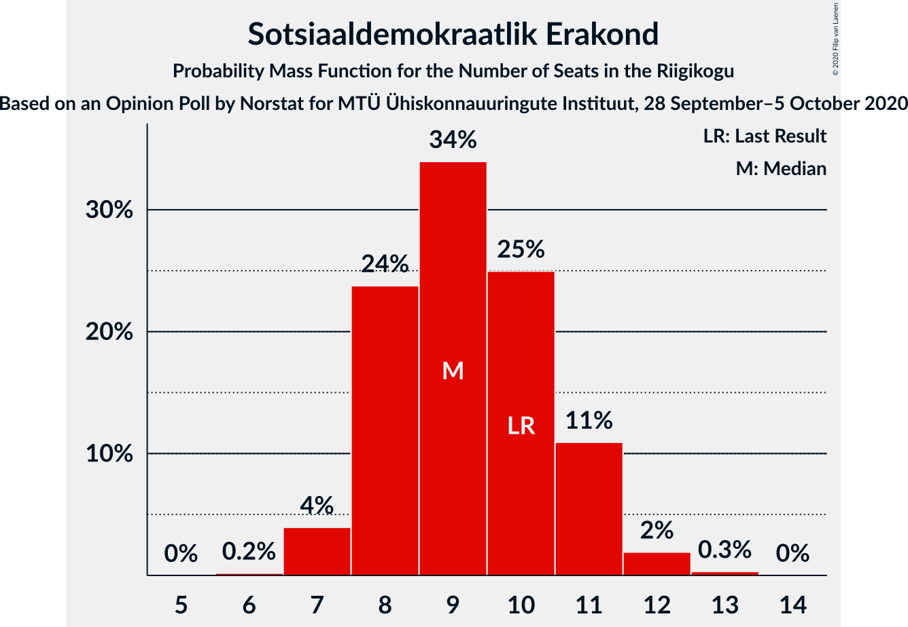

| Number of Seats | Probability | Accumulated | Special Marks |
|:---------------:|:-----------:|:-----------:|:-------------:|
| 6 | 0.2% | 100% |  |
| 7 | 4% | 99.8% |  |
| 8 | 24% | 96% |  |
| 9 | 34% | 72% | Median |
| 10 | 25% | 38% | Last Result |
| 11 | 11% | 13% |  |
| 12 | 2% | 2% |  |
| 13 | 0.3% | 0.3% |  |
| 14 | 0% | 0% |  |

### Eesti 200

*For a full overview of the results for this party, see the [Eesti 200](party-eesti200.html) page.*

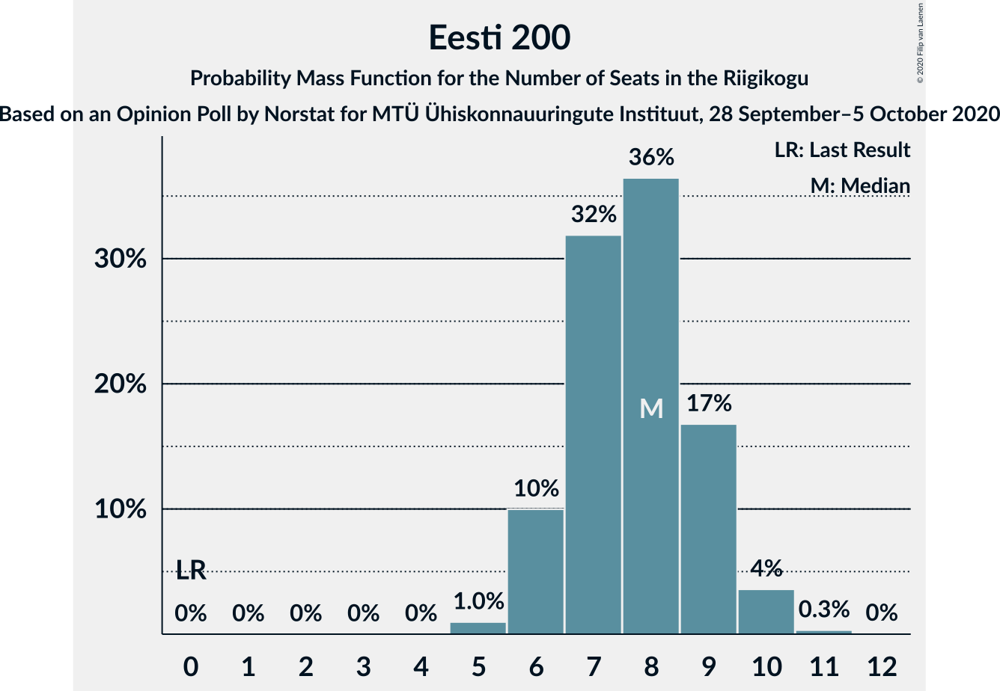

| Number of Seats | Probability | Accumulated | Special Marks |
|:---------------:|:-----------:|:-----------:|:-------------:|
| 0 | 0% | 100% | Last Result |
| 1 | 0% | 100% |  |
| 2 | 0% | 100% |  |
| 3 | 0% | 100% |  |
| 4 | 0% | 100% |  |
| 5 | 1.0% | 100% |  |
| 6 | 10% | 99.0% |  |
| 7 | 32% | 89% |  |
| 8 | 36% | 57% | Median |
| 9 | 17% | 21% |  |
| 10 | 4% | 4% |  |
| 11 | 0.3% | 0.4% |  |
| 12 | 0% | 0% |  |

### Erakond Isamaa

*For a full overview of the results for this party, see the [Erakond Isamaa](party-erakondisamaa.html) page.*

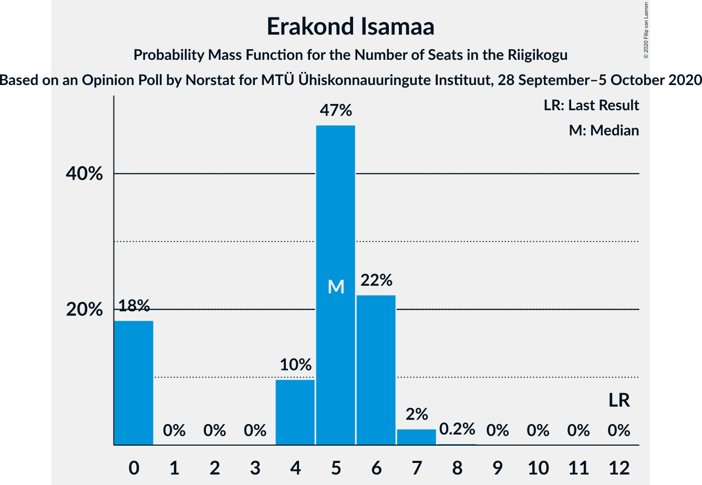

| Number of Seats | Probability | Accumulated | Special Marks |
|:---------------:|:-----------:|:-----------:|:-------------:|
| 0 | 18% | 100% |  |
| 1 | 0% | 82% |  |
| 2 | 0% | 82% |  |
| 3 | 0% | 82% |  |
| 4 | 10% | 82% |  |
| 5 | 47% | 72% | Median |
| 6 | 22% | 25% |  |
| 7 | 2% | 3% |  |
| 8 | 0.2% | 0.2% |  |
| 9 | 0% | 0% |  |
| 10 | 0% | 0% |  |
| 11 | 0% | 0% |  |
| 12 | 0% | 0% | Last Result |

### Erakond Eestimaa Rohelised

*For a full overview of the results for this party, see the [Erakond Eestimaa Rohelised](party-erakondeestimaarohelised.html) page.*

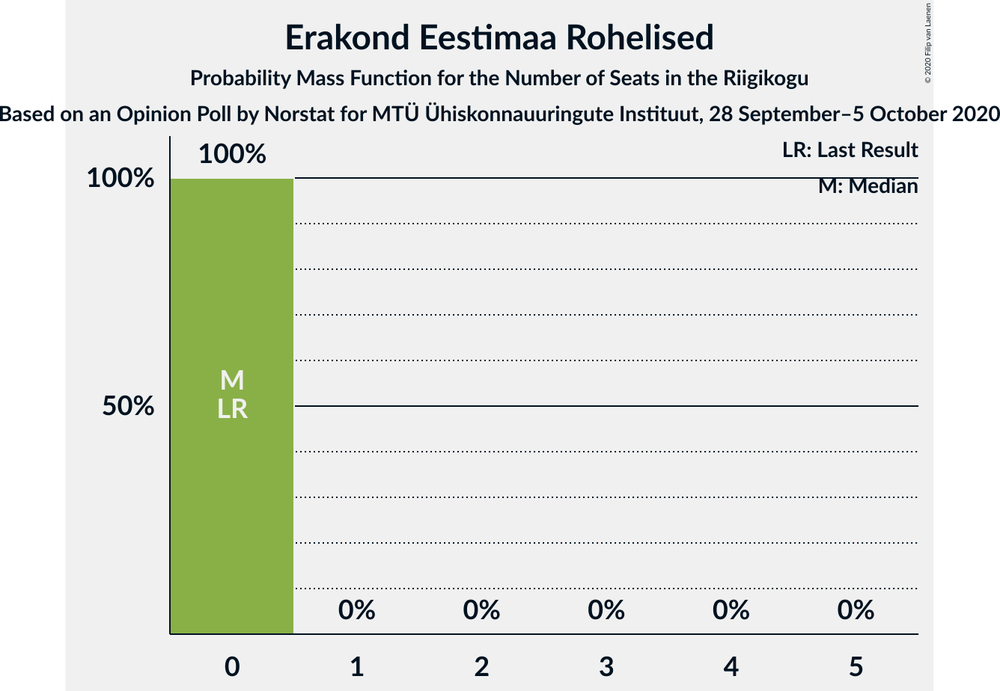

| Number of Seats | Probability | Accumulated | Special Marks |
|:---------------:|:-----------:|:-----------:|:-------------:|
| 0 | 100% | 100% | Last Result, Median |

### Eesti Vabaerakond

*For a full overview of the results for this party, see the [Eesti Vabaerakond](party-eestivabaerakond.html) page.*

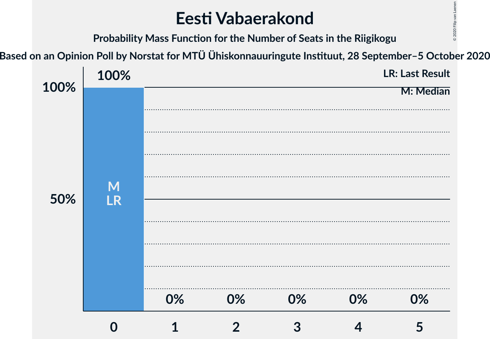

| Number of Seats | Probability | Accumulated | Special Marks |
|:---------------:|:-----------:|:-----------:|:-------------:|
| 0 | 100% | 100% | Last Result, Median |

## Coalitions

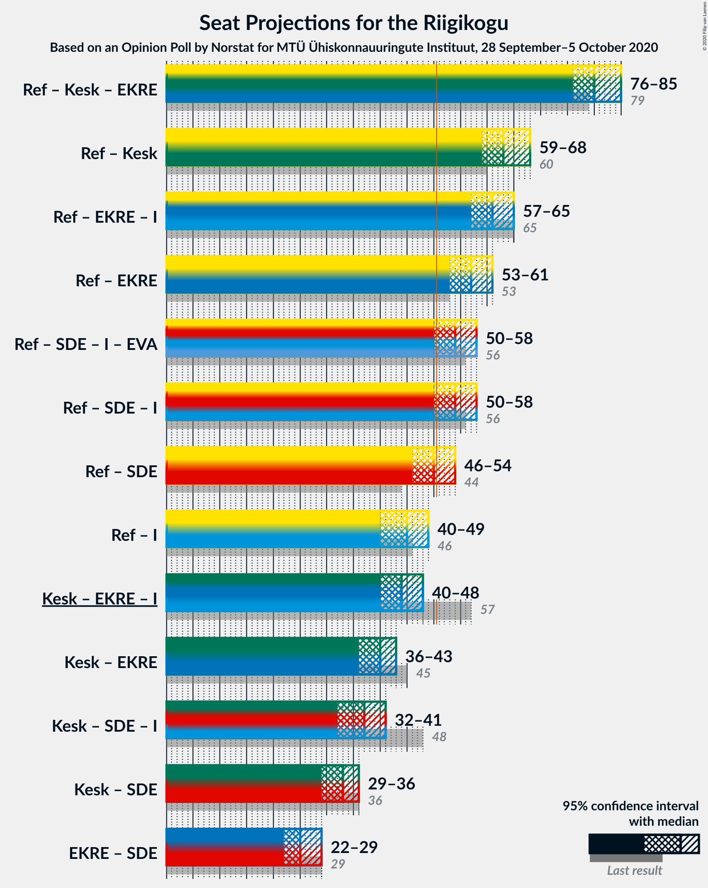

### Confidence Intervals

| Coalition | Last Result | Median | Majority? | 80% Confidence Interval | 90% Confidence Interval | 95% Confidence Interval | 99% Confidence Interval |
|:---------:|:-----------:|:------:|:---------:|:-----------------------:|:-----------------------:|:-----------------------:|:-----------------------:|
| Eesti Reformierakond – Eesti Keskerakond – Eesti Konservatiivne Rahvaerakond | 79 | 80 | 100% | 77–83 | 77–84 | 76–85 | 75–86 |
| Eesti Reformierakond – Eesti Keskerakond | 60 | 63 | 100% | 61–67 | 60–67 | 59–68 | 58–70 |
| Eesti Reformierakond – Eesti Konservatiivne Rahvaerakond – Erakond Isamaa | 65 | 61 | 100% | 58–64 | 58–64 | 57–65 | 56–66 |
| Eesti Reformierakond – Eesti Konservatiivne Rahvaerakond | 53 | 57 | 99.9% | 54–60 | 53–61 | 53–61 | 52–62 |
| Eesti Reformierakond – Sotsiaaldemokraatlik Erakond – Erakond Isamaa – Eesti Vabaerakond | 56 | 54 | 96% | 51–57 | 51–57 | 50–58 | 49–59 |
| Eesti Reformierakond – Sotsiaaldemokraatlik Erakond – Erakond Isamaa | 56 | 54 | 96% | 51–57 | 51–57 | 50–58 | 49–59 |
| Eesti Reformierakond – Sotsiaaldemokraatlik Erakond | 44 | 50 | 36% | 47–52 | 46–53 | 46–54 | 45–55 |
| Eesti Reformierakond – Erakond Isamaa | 46 | 45 | 0.2% | 42–47 | 41–48 | 40–49 | 39–50 |
| Eesti Keskerakond – Eesti Konservatiivne Rahvaerakond – Erakond Isamaa | 57 | 44 | 0% | 41–47 | 40–47 | 40–48 | 38–49 |
| Eesti Keskerakond – Eesti Konservatiivne Rahvaerakond | 45 | 40 | 0% | 37–42 | 36–43 | 36–43 | 34–44 |
| Eesti Keskerakond – Sotsiaaldemokraatlik Erakond – Erakond Isamaa | 48 | 37 | 0% | 33–39 | 33–40 | 32–41 | 31–42 |
| Eesti Keskerakond – Sotsiaaldemokraatlik Erakond | 36 | 33 | 0% | 30–35 | 29–35 | 29–36 | 28–37 |
| Eesti Konservatiivne Rahvaerakond – Sotsiaaldemokraatlik Erakond | 29 | 25 | 0% | 23–28 | 23–29 | 22–29 | 21–30 |

### Eesti Reformierakond – Eesti Keskerakond – Eesti Konservatiivne Rahvaerakond

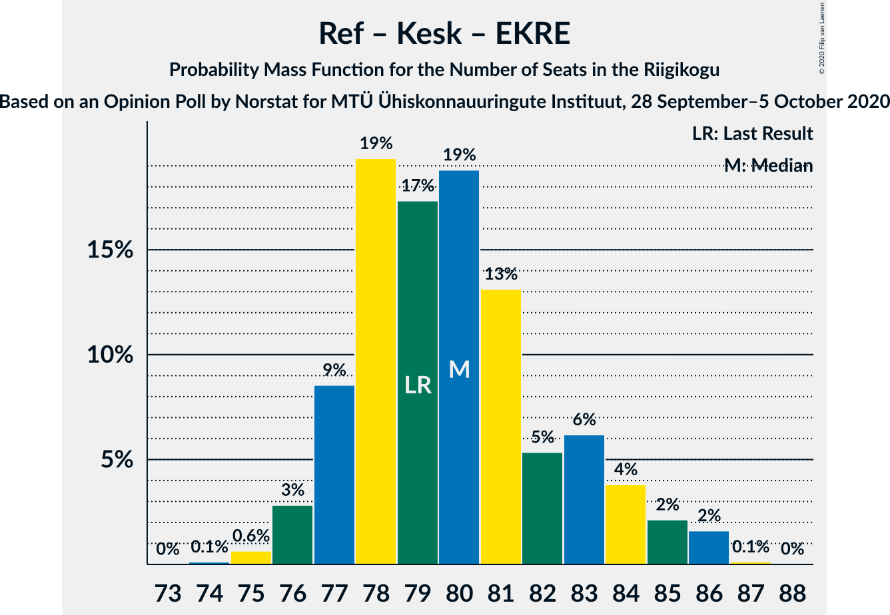

| Number of Seats | Probability | Accumulated | Special Marks |
|:---------------:|:-----------:|:-----------:|:-------------:|
| 74 | 0.1% | 100% |  |
| 75 | 0.6% | 99.9% |  |
| 76 | 3% | 99.2% |  |
| 77 | 9% | 96% |  |
| 78 | 19% | 88% |  |
| 79 | 17% | 68% | Last Result |
| 80 | 19% | 51% | Median |
| 81 | 13% | 32% |  |
| 82 | 5% | 19% |  |
| 83 | 6% | 14% |  |
| 84 | 4% | 8% |  |
| 85 | 2% | 4% |  |
| 86 | 2% | 2% |  |
| 87 | 0.1% | 0.1% |  |
| 88 | 0% | 0% |  |

### Eesti Reformierakond – Eesti Keskerakond

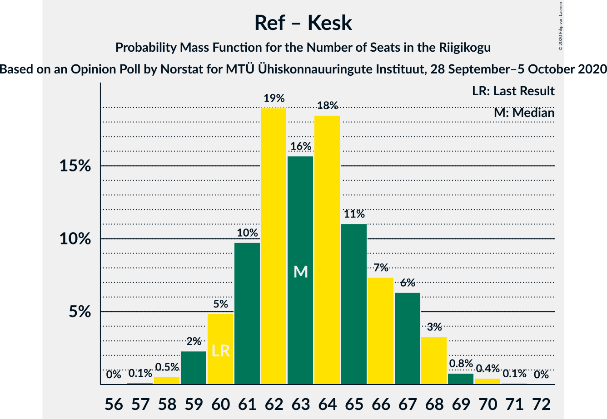

| Number of Seats | Probability | Accumulated | Special Marks |
|:---------------:|:-----------:|:-----------:|:-------------:|
| 57 | 0.1% | 100% |  |
| 58 | 0.5% | 99.9% |  |
| 59 | 2% | 99.3% |  |
| 60 | 5% | 97% | Last Result |
| 61 | 10% | 92% |  |
| 62 | 19% | 82% |  |
| 63 | 16% | 63% |  |
| 64 | 18% | 48% | Median |
| 65 | 11% | 29% |  |
| 66 | 7% | 18% |  |
| 67 | 6% | 11% |  |
| 68 | 3% | 5% |  |
| 69 | 0.8% | 1.3% |  |
| 70 | 0.4% | 0.5% |  |
| 71 | 0.1% | 0.1% |  |
| 72 | 0% | 0% |  |

### Eesti Reformierakond – Eesti Konservatiivne Rahvaerakond – Erakond Isamaa

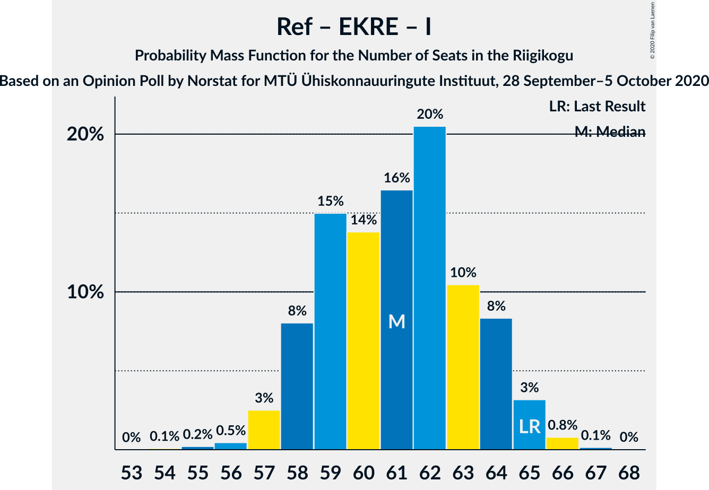

| Number of Seats | Probability | Accumulated | Special Marks |
|:---------------:|:-----------:|:-----------:|:-------------:|
| 54 | 0.1% | 100% |  |
| 55 | 0.2% | 99.9% |  |
| 56 | 0.5% | 99.7% |  |
| 57 | 3% | 99.2% |  |
| 58 | 8% | 97% |  |
| 59 | 15% | 89% |  |
| 60 | 14% | 74% |  |
| 61 | 16% | 60% | Median |
| 62 | 20% | 43% |  |
| 63 | 10% | 23% |  |
| 64 | 8% | 12% |  |
| 65 | 3% | 4% | Last Result |
| 66 | 0.8% | 1.0% |  |
| 67 | 0.1% | 0.2% |  |
| 68 | 0% | 0% |  |

### Eesti Reformierakond – Eesti Konservatiivne Rahvaerakond

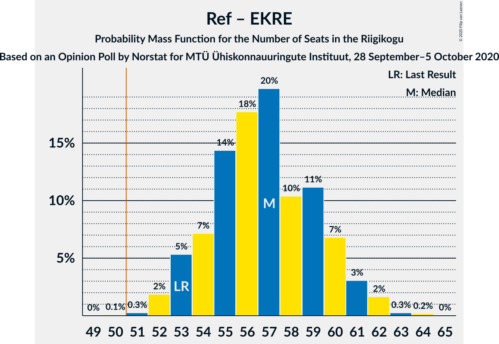

| Number of Seats | Probability | Accumulated | Special Marks |
|:---------------:|:-----------:|:-----------:|:-------------:|
| 50 | 0.1% | 100% |  |
| 51 | 0.3% | 99.9% | Majority |
| 52 | 2% | 99.7% |  |
| 53 | 5% | 98% | Last Result |
| 54 | 7% | 92% |  |
| 55 | 14% | 85% |  |
| 56 | 18% | 71% | Median |
| 57 | 20% | 53% |  |
| 58 | 10% | 34% |  |
| 59 | 11% | 23% |  |
| 60 | 7% | 12% |  |
| 61 | 3% | 5% |  |
| 62 | 2% | 2% |  |
| 63 | 0.3% | 0.5% |  |
| 64 | 0.2% | 0.2% |  |
| 65 | 0% | 0% |  |

### Eesti Reformierakond – Sotsiaaldemokraatlik Erakond – Erakond Isamaa – Eesti Vabaerakond

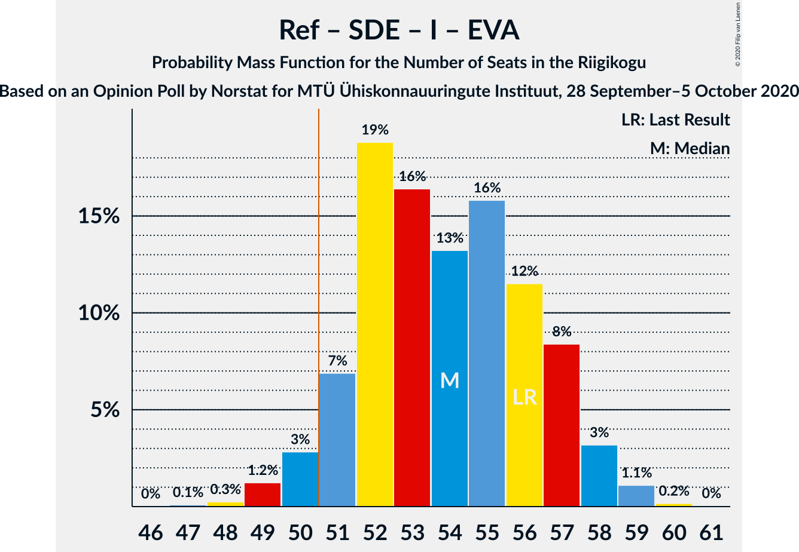

| Number of Seats | Probability | Accumulated | Special Marks |
|:---------------:|:-----------:|:-----------:|:-------------:|
| 47 | 0.1% | 100% |  |
| 48 | 0.3% | 99.9% |  |
| 49 | 1.2% | 99.6% |  |
| 50 | 3% | 98% |  |
| 51 | 7% | 96% | Majority |
| 52 | 19% | 89% |  |
| 53 | 16% | 70% |  |
| 54 | 13% | 53% | Median |
| 55 | 16% | 40% |  |
| 56 | 12% | 24% | Last Result |
| 57 | 8% | 13% |  |
| 58 | 3% | 5% |  |
| 59 | 1.1% | 1.3% |  |
| 60 | 0.2% | 0.2% |  |
| 61 | 0% | 0% |  |

### Eesti Reformierakond – Sotsiaaldemokraatlik Erakond – Erakond Isamaa

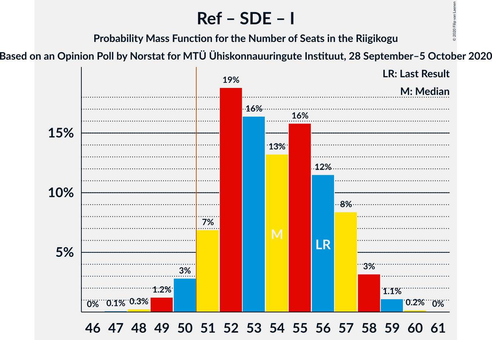

| Number of Seats | Probability | Accumulated | Special Marks |
|:---------------:|:-----------:|:-----------:|:-------------:|
| 47 | 0.1% | 100% |  |
| 48 | 0.3% | 99.9% |  |
| 49 | 1.2% | 99.6% |  |
| 50 | 3% | 98% |  |
| 51 | 7% | 96% | Majority |
| 52 | 19% | 89% |  |
| 53 | 16% | 70% |  |
| 54 | 13% | 53% | Median |
| 55 | 16% | 40% |  |
| 56 | 12% | 24% | Last Result |
| 57 | 8% | 13% |  |
| 58 | 3% | 5% |  |
| 59 | 1.1% | 1.3% |  |
| 60 | 0.2% | 0.2% |  |
| 61 | 0% | 0% |  |

### Eesti Reformierakond – Sotsiaaldemokraatlik Erakond

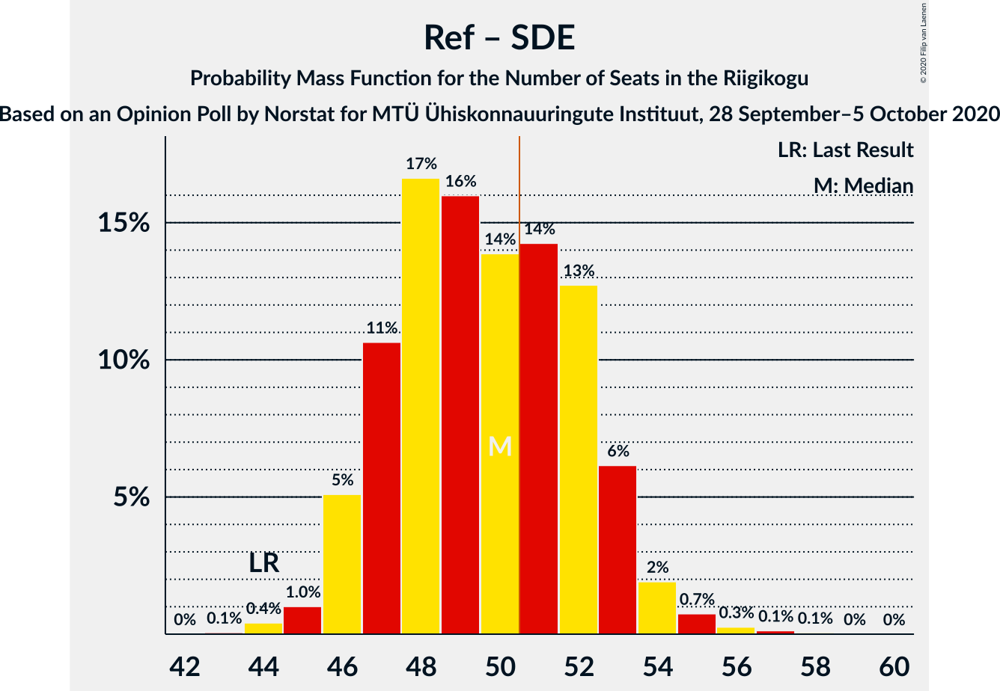

| Number of Seats | Probability | Accumulated | Special Marks |
|:---------------:|:-----------:|:-----------:|:-------------:|
| 43 | 0.1% | 100% |  |
| 44 | 0.4% | 99.9% | Last Result |
| 45 | 1.0% | 99.5% |  |
| 46 | 5% | 98.5% |  |
| 47 | 11% | 93% |  |
| 48 | 17% | 83% |  |
| 49 | 16% | 66% | Median |
| 50 | 14% | 50% |  |
| 51 | 14% | 36% | Majority |
| 52 | 13% | 22% |  |
| 53 | 6% | 9% |  |
| 54 | 2% | 3% |  |
| 55 | 0.7% | 1.2% |  |
| 56 | 0.3% | 0.5% |  |
| 57 | 0.1% | 0.2% |  |
| 58 | 0.1% | 0.1% |  |
| 59 | 0% | 0% |  |

### Eesti Reformierakond – Erakond Isamaa

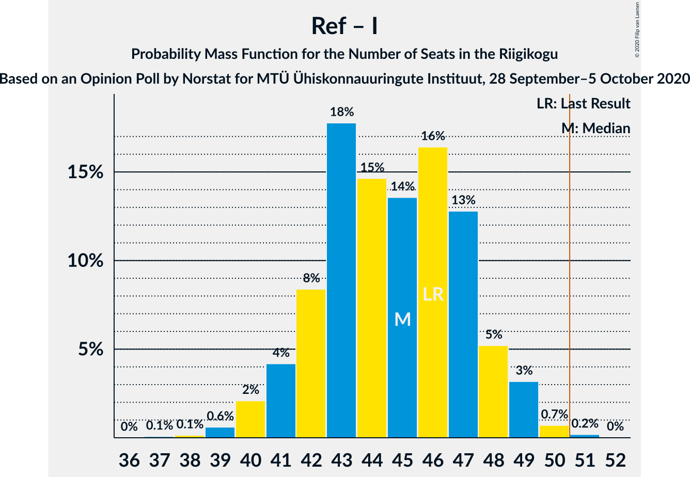

| Number of Seats | Probability | Accumulated | Special Marks |
|:---------------:|:-----------:|:-----------:|:-------------:|
| 37 | 0.1% | 100% |  |
| 38 | 0.1% | 99.9% |  |
| 39 | 0.6% | 99.8% |  |
| 40 | 2% | 99.2% |  |
| 41 | 4% | 97% |  |
| 42 | 8% | 93% |  |
| 43 | 18% | 84% |  |
| 44 | 15% | 67% |  |
| 45 | 14% | 52% | Median |
| 46 | 16% | 39% | Last Result |
| 47 | 13% | 22% |  |
| 48 | 5% | 9% |  |
| 49 | 3% | 4% |  |
| 50 | 0.7% | 0.9% |  |
| 51 | 0.2% | 0.2% | Majority |
| 52 | 0% | 0% |  |

### Eesti Keskerakond – Eesti Konservatiivne Rahvaerakond – Erakond Isamaa

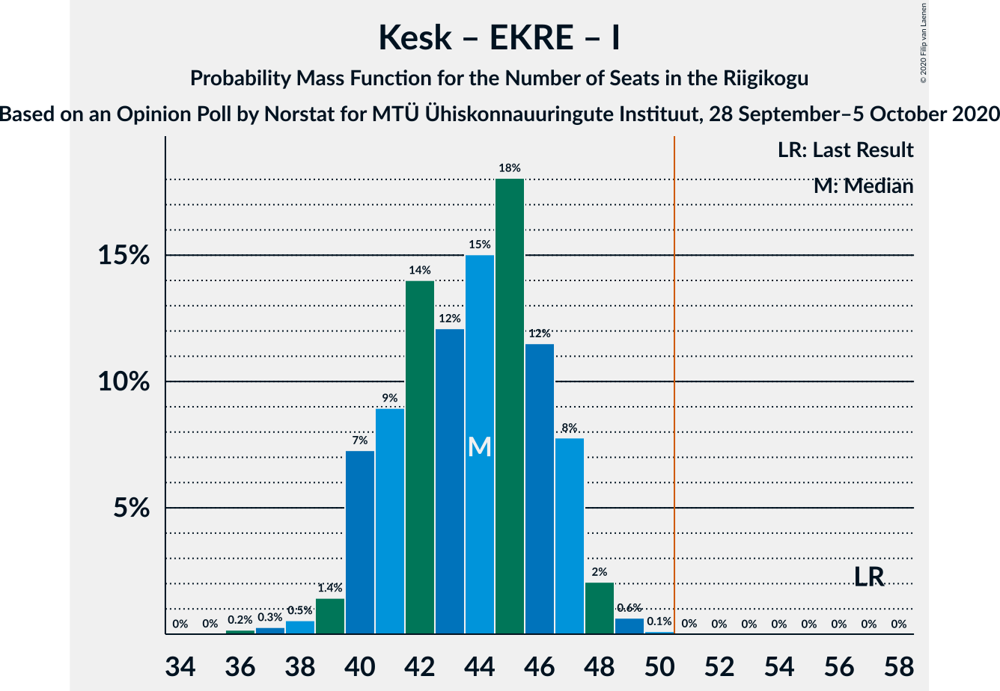

| Number of Seats | Probability | Accumulated | Special Marks |
|:---------------:|:-----------:|:-----------:|:-------------:|
| 36 | 0.2% | 100% |  |
| 37 | 0.3% | 99.8% |  |
| 38 | 0.5% | 99.5% |  |
| 39 | 1.4% | 99.0% |  |
| 40 | 7% | 98% |  |
| 41 | 9% | 90% |  |
| 42 | 14% | 81% |  |
| 43 | 12% | 67% |  |
| 44 | 15% | 55% |  |
| 45 | 18% | 40% | Median |
| 46 | 12% | 22% |  |
| 47 | 8% | 11% |  |
| 48 | 2% | 3% |  |
| 49 | 0.6% | 0.8% |  |
| 50 | 0.1% | 0.1% |  |
| 51 | 0% | 0% | Majority |
| 52 | 0% | 0% |  |
| 53 | 0% | 0% |  |
| 54 | 0% | 0% |  |
| 55 | 0% | 0% |  |
| 56 | 0% | 0% |  |
| 57 | 0% | 0% | Last Result |

### Eesti Keskerakond – Eesti Konservatiivne Rahvaerakond

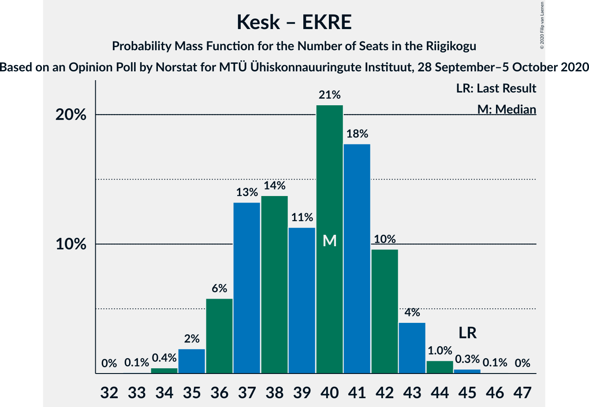

| Number of Seats | Probability | Accumulated | Special Marks |
|:---------------:|:-----------:|:-----------:|:-------------:|
| 33 | 0.1% | 100% |  |
| 34 | 0.4% | 99.9% |  |
| 35 | 2% | 99.5% |  |
| 36 | 6% | 98% |  |
| 37 | 13% | 92% |  |
| 38 | 14% | 79% |  |
| 39 | 11% | 65% |  |
| 40 | 21% | 53% | Median |
| 41 | 18% | 33% |  |
| 42 | 10% | 15% |  |
| 43 | 4% | 5% |  |
| 44 | 1.0% | 1.4% |  |
| 45 | 0.3% | 0.4% | Last Result |
| 46 | 0.1% | 0.1% |  |
| 47 | 0% | 0% |  |

### Eesti Keskerakond – Sotsiaaldemokraatlik Erakond – Erakond Isamaa

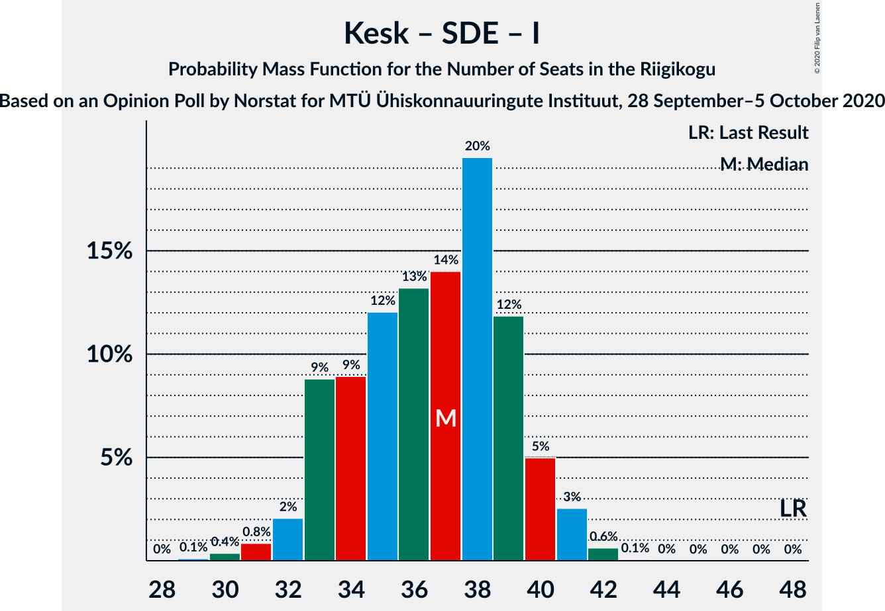

| Number of Seats | Probability | Accumulated | Special Marks |
|:---------------:|:-----------:|:-----------:|:-------------:|
| 29 | 0.1% | 100% |  |
| 30 | 0.4% | 99.9% |  |
| 31 | 0.8% | 99.5% |  |
| 32 | 2% | 98.7% |  |
| 33 | 9% | 97% |  |
| 34 | 9% | 88% |  |
| 35 | 12% | 79% |  |
| 36 | 13% | 67% |  |
| 37 | 14% | 54% |  |
| 38 | 20% | 40% | Median |
| 39 | 12% | 20% |  |
| 40 | 5% | 8% |  |
| 41 | 3% | 3% |  |
| 42 | 0.6% | 0.7% |  |
| 43 | 0.1% | 0.1% |  |
| 44 | 0% | 0% |  |
| 45 | 0% | 0% |  |
| 46 | 0% | 0% |  |
| 47 | 0% | 0% |  |
| 48 | 0% | 0% | Last Result |

### Eesti Keskerakond – Sotsiaaldemokraatlik Erakond

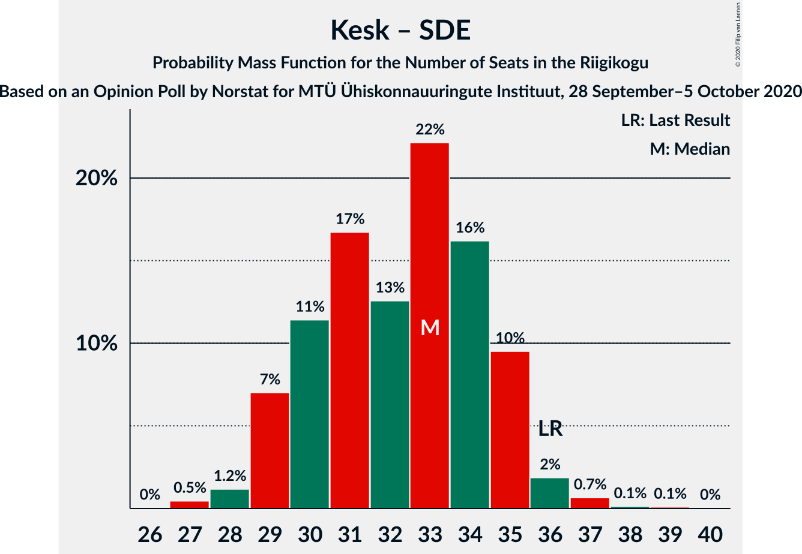

| Number of Seats | Probability | Accumulated | Special Marks |
|:---------------:|:-----------:|:-----------:|:-------------:|
| 27 | 0.5% | 100% |  |
| 28 | 1.2% | 99.5% |  |
| 29 | 7% | 98% |  |
| 30 | 11% | 91% |  |
| 31 | 17% | 80% |  |
| 32 | 13% | 63% |  |
| 33 | 22% | 51% | Median |
| 34 | 16% | 28% |  |
| 35 | 10% | 12% |  |
| 36 | 2% | 3% | Last Result |
| 37 | 0.7% | 0.9% |  |
| 38 | 0.1% | 0.2% |  |
| 39 | 0.1% | 0.1% |  |
| 40 | 0% | 0% |  |

### Eesti Konservatiivne Rahvaerakond – Sotsiaaldemokraatlik Erakond

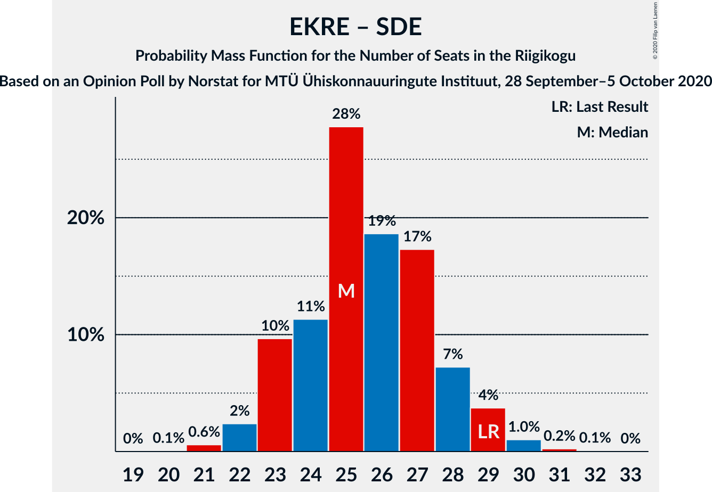

| Number of Seats | Probability | Accumulated | Special Marks |
|:---------------:|:-----------:|:-----------:|:-------------:|
| 20 | 0.1% | 100% |  |
| 21 | 0.6% | 99.9% |  |
| 22 | 2% | 99.4% |  |
| 23 | 10% | 97% |  |
| 24 | 11% | 87% |  |
| 25 | 28% | 76% | Median |
| 26 | 19% | 48% |  |
| 27 | 17% | 30% |  |
| 28 | 7% | 12% |  |
| 29 | 4% | 5% | Last Result |
| 30 | 1.0% | 1.3% |  |
| 31 | 0.2% | 0.3% |  |
| 32 | 0.1% | 0.1% |  |
| 33 | 0% | 0% |  |

## Technical Information

### Opinion Poll

+ **Polling firm:** Norstat
+ **Commissioner(s):** MTÜ Ühiskonnauuringute Instituut
+ **Fieldwork period:** 28 September–5 October 2020

### Calculations

+ **Sample size:** 1000
+ **Simulations done:** 1,048,576
+ **Error estimate:** 1.07%

