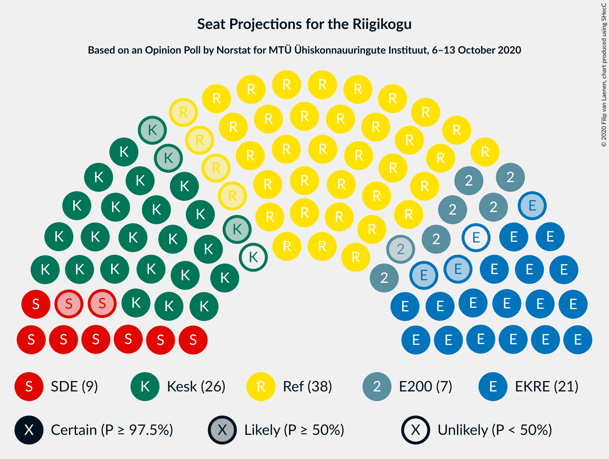
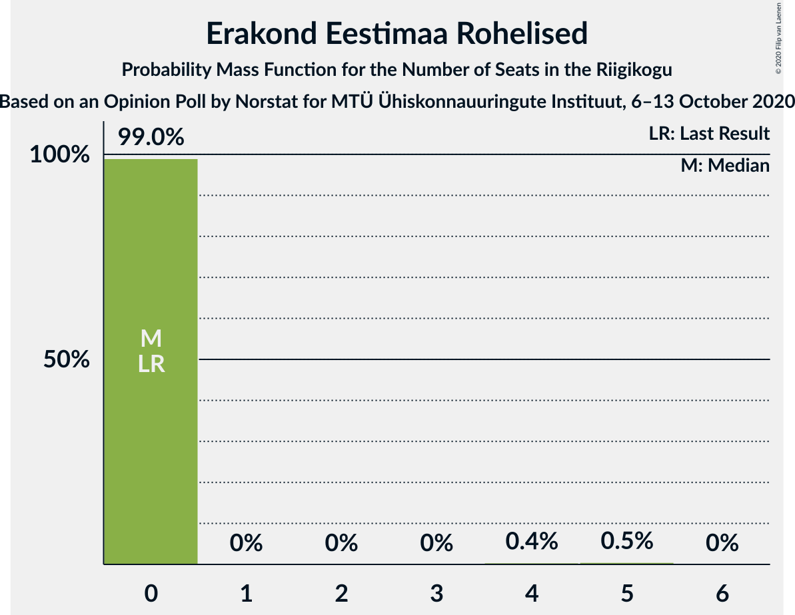
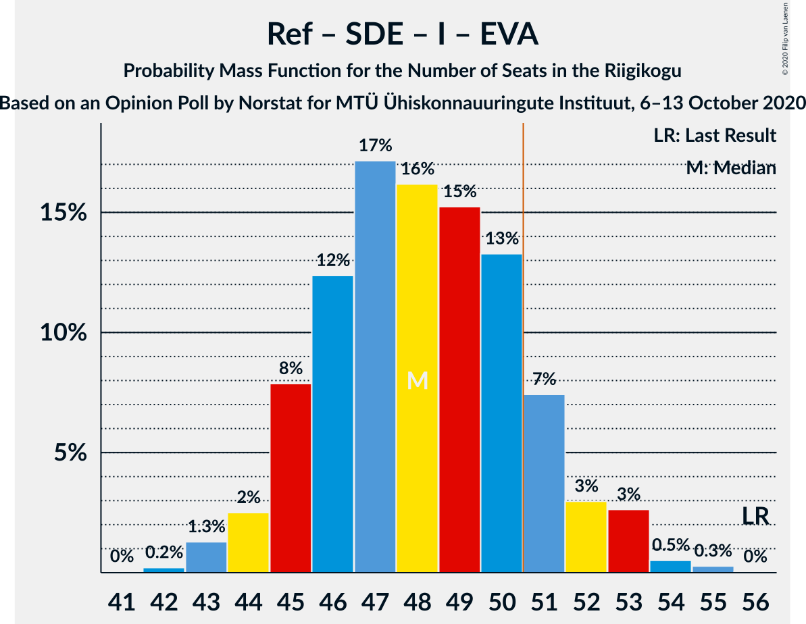
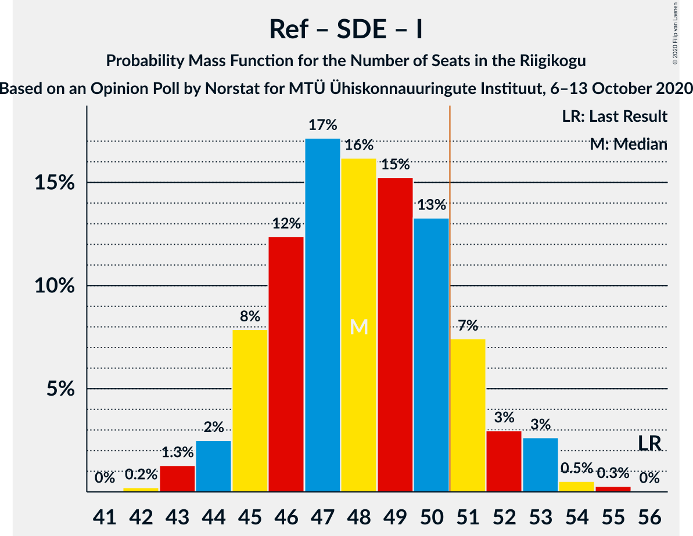
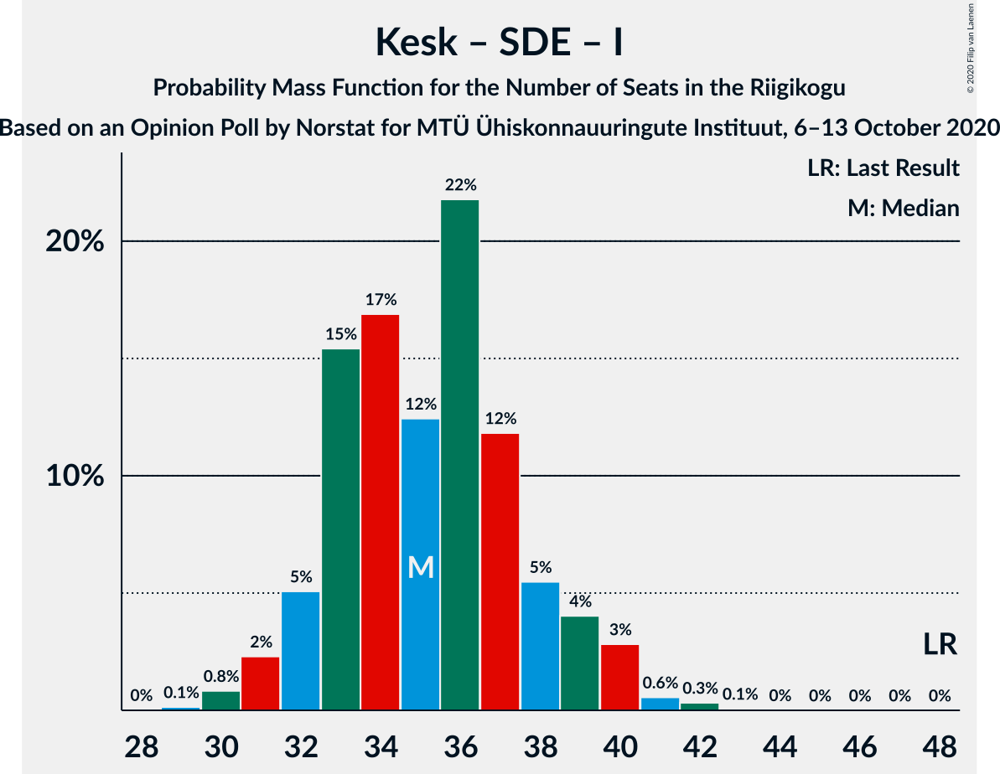

# Opinion Poll by Norstat for MTÜ Ühiskonnauuringute Instituut, 6–13 October 2020

<a href="#voting-intentions">Voting Intentions</a> | <a href="#seats">Seats</a> | <a href="#coalitions">Coalitions</a> | <a href="#technical-information">Technical Information</a>

## Voting Intentions

### Confidence Intervals

| Party | Last Result | Poll Result | 80% Confidence Interval | 90% Confidence Interval | 95% Confidence Interval | 99% Confidence Interval |
|:-----:|:-----------:|:-----------:|:-----------------------:|:-----------------------:|:-----------------------:|:-----------------------:|
| Eesti Reformierakond | 28.9% | 32.2% | 30.3–34.1% |29.8–34.7% |29.4–35.2% |28.5–36.1% |
| Eesti Keskerakond | 23.1% | 22.3% | 20.7–24.1% |20.2–24.6% |19.8–25.0% |19.1–25.8% |
| Eesti Konservatiivne Rahvaerakond | 17.8% | 18.1% | 16.6–19.7% |16.2–20.2% |15.8–20.6% |15.2–21.4% |
| Sotsiaaldemokraatlik Erakond | 9.8% | 9.0% | 7.9–10.3% |7.6–10.6% |7.4–10.9% |6.9–11.6% |
| Eesti 200 | 4.4% | 7.7% | 6.7–8.9% |6.4–9.2% |6.2–9.5% |5.8–10.1% |
| Erakond Isamaa | 11.4% | 4.4% | 3.7–5.3% |3.5–5.6% |3.3–5.9% |3.0–6.4% |
| Erakond Eestimaa Rohelised | 1.8% | 3.5% | 2.9–4.4% |2.7–4.6% |2.5–4.8% |2.2–5.3% |
| Eesti Vabaerakond | 1.2% | 0.6% | 0.4–1.1% |0.3–1.2% |0.3–1.3% |0.2–1.6% |

*Note:* The poll result column reflects the actual value used in the calculations. Published results may vary slightly, and in addition be rounded to fewer digits.

## Seats

### Confidence Intervals

| Party | Last Result | Median | 80% Confidence Interval | 90% Confidence Interval | 95% Confidence Interval | 99% Confidence Interval |
|:-----:|:-----------:|:------:|:-----------------------:|:-----------------------:|:-----------------------:|:-----------------------:|
| <a href="#eesti-reformierakond">Eesti Reformierakond</a> | 34 | 38 | 36–40 |36–41 |34–42 |33–43 |
| <a href="#eesti-keskerakond">Eesti Keskerakond</a> | 26 | 25 | 23–27 |23–28 |22–29 |21–29 |
| <a href="#eesti-konservatiivne-rahvaerakond">Eesti Konservatiivne Rahvaerakond</a> | 19 | 19 | 18–22 |18–22 |17–23 |16–24 |
| <a href="#sotsiaaldemokraatlik-erakond">Sotsiaaldemokraatlik Erakond</a> | 10 | 9 | 8–10 |7–11 |7–11 |7–12 |
| <a href="#eesti-200">Eesti 200</a> | 0 | 7 | 6–9 |6–9 |6–9 |5–10 |
| <a href="#erakond-isamaa">Erakond Isamaa</a> | 12 | 0 | 0–5 |0–5 |0–5 |0–6 |
| <a href="#erakond-eestimaa-rohelised">Erakond Eestimaa Rohelised</a> | 0 | 0 | 0 |0 |0 |0–5 |
| <a href="#eesti-vabaerakond">Eesti Vabaerakond</a> | 0 | 0 | 0 |0 |0 |0 |

### Eesti Reformierakond

*For a full overview of the results for this party, see the [Eesti Reformierakond](party-eestireformierakond.html) page.*

| Number of Seats | Probability | Accumulated | Special Marks |
|:---------------:|:-----------:|:-----------:|:-------------:|
| 32 | 0.4% | 100% |  |
| 33 | 0.2% | 99.6% |  |
| 34 | 2% | 99.4% | Last Result |
| 35 | 2% | 97% |  |
| 36 | 6% | 95% |  |
| 37 | 23% | 89% |  |
| 38 | 36% | 66% | Median |
| 39 | 3% | 30% |  |
| 40 | 19% | 26% |  |
| 41 | 4% | 7% |  |
| 42 | 2% | 3% |  |
| 43 | 0.4% | 0.9% |  |
| 44 | 0.4% | 0.5% |  |
| 45 | 0% | 0% |  |

### Eesti Keskerakond

*For a full overview of the results for this party, see the [Eesti Keskerakond](party-eestikeskerakond.html) page.*

| Number of Seats | Probability | Accumulated | Special Marks |
|:---------------:|:-----------:|:-----------:|:-------------:|
| 20 | 0.1% | 100% |  |
| 21 | 0.7% | 99.9% |  |
| 22 | 3% | 99.2% |  |
| 23 | 12% | 96% |  |
| 24 | 6% | 84% |  |
| 25 | 34% | 78% | Median |
| 26 | 13% | 44% | Last Result |
| 27 | 23% | 31% |  |
| 28 | 4% | 8% |  |
| 29 | 4% | 4% |  |
| 30 | 0.2% | 0.4% |  |
| 31 | 0.2% | 0.2% |  |
| 32 | 0% | 0% |  |

### Eesti Konservatiivne Rahvaerakond

*For a full overview of the results for this party, see the [Eesti Konservatiivne Rahvaerakond](party-eestikonservatiivnerahvaerakond.html) page.*

| Number of Seats | Probability | Accumulated | Special Marks |
|:---------------:|:-----------:|:-----------:|:-------------:|
| 15 | 0.1% | 100% |  |
| 16 | 0.9% | 99.9% |  |
| 17 | 4% | 99.1% |  |
| 18 | 10% | 95% |  |
| 19 | 38% | 85% | Last Result, Median |
| 20 | 11% | 48% |  |
| 21 | 26% | 36% |  |
| 22 | 6% | 10% |  |
| 23 | 3% | 4% |  |
| 24 | 1.0% | 1.2% |  |
| 25 | 0.2% | 0.2% |  |
| 26 | 0% | 0% |  |

### Sotsiaaldemokraatlik Erakond

*For a full overview of the results for this party, see the [Sotsiaaldemokraatlik Erakond](party-sotsiaaldemokraatlikerakond.html) page.*

| Number of Seats | Probability | Accumulated | Special Marks |
|:---------------:|:-----------:|:-----------:|:-------------:|
| 6 | 0.5% | 100% |  |
| 7 | 7% | 99.5% |  |
| 8 | 41% | 93% |  |
| 9 | 27% | 52% | Median |
| 10 | 17% | 25% | Last Result |
| 11 | 6% | 8% |  |
| 12 | 2% | 2% |  |
| 13 | 0.1% | 0.1% |  |
| 14 | 0% | 0% |  |

### Eesti 200

*For a full overview of the results for this party, see the [Eesti 200](party-eesti200.html) page.*

| Number of Seats | Probability | Accumulated | Special Marks |
|:---------------:|:-----------:|:-----------:|:-------------:|
| 0 | 0% | 100% | Last Result |
| 1 | 0% | 100% |  |
| 2 | 0% | 100% |  |
| 3 | 0% | 100% |  |
| 4 | 0% | 100% |  |
| 5 | 2% | 100% |  |
| 6 | 8% | 98% |  |
| 7 | 49% | 89% | Median |
| 8 | 17% | 40% |  |
| 9 | 21% | 23% |  |
| 10 | 2% | 2% |  |
| 11 | 0.4% | 0.4% |  |
| 12 | 0% | 0% |  |

### Erakond Isamaa

*For a full overview of the results for this party, see the [Erakond Isamaa](party-erakondisamaa.html) page.*

| Number of Seats | Probability | Accumulated | Special Marks |
|:---------------:|:-----------:|:-----------:|:-------------:|
| 0 | 72% | 100% | Median |
| 1 | 0% | 28% |  |
| 2 | 0% | 28% |  |
| 3 | 0% | 28% |  |
| 4 | 16% | 28% |  |
| 5 | 11% | 12% |  |
| 6 | 0.9% | 0.9% |  |
| 7 | 0% | 0% |  |
| 8 | 0% | 0% |  |
| 9 | 0% | 0% |  |
| 10 | 0% | 0% |  |
| 11 | 0% | 0% |  |
| 12 | 0% | 0% | Last Result |

### Erakond Eestimaa Rohelised

*For a full overview of the results for this party, see the [Erakond Eestimaa Rohelised](party-erakondeestimaarohelised.html) page.*

| Number of Seats | Probability | Accumulated | Special Marks |
|:---------------:|:-----------:|:-----------:|:-------------:|
| 0 | 98% | 100% | Last Result, Median |
| 1 | 0% | 2% |  |
| 2 | 0% | 2% |  |
| 3 | 0% | 2% |  |
| 4 | 0.3% | 2% |  |
| 5 | 1.4% | 1.4% |  |
| 6 | 0% | 0% |  |

### Eesti Vabaerakond

*For a full overview of the results for this party, see the [Eesti Vabaerakond](party-eestivabaerakond.html) page.*

| Number of Seats | Probability | Accumulated | Special Marks |
|:---------------:|:-----------:|:-----------:|:-------------:|
| 0 | 100% | 100% | Last Result, Median |

## Coalitions

### Confidence Intervals

| Coalition | Last Result | Median | Majority? | 80% Confidence Interval | 90% Confidence Interval | 95% Confidence Interval | 99% Confidence Interval |
|:---------:|:-----------:|:------:|:---------:|:-----------------------:|:-----------------------:|:-----------------------:|:-----------------------:|
| Eesti Reformierakond – Eesti Keskerakond – Eesti Konservatiivne Rahvaerakond | 79 | 84 | 100% | 80–86 | 79–87 | 79–87 | 77–88 |
| Eesti Reformierakond – Eesti Keskerakond | 60 | 63 | 100% | 61–67 | 60–67 | 59–68 | 58–69 |
| Eesti Reformierakond – Eesti Konservatiivne Rahvaerakond – Erakond Isamaa | 65 | 59 | 100% | 56–62 | 56–63 | 55–64 | 54–64 |
| Eesti Reformierakond – Eesti Konservatiivne Rahvaerakond | 53 | 58 | 100% | 56–61 | 55–61 | 54–62 | 52–64 |
| Eesti Reformierakond – Sotsiaaldemokraatlik Erakond – Erakond Isamaa – Eesti Vabaerakond | 56 | 48 | 16% | 45–51 | 45–52 | 44–53 | 43–54 |
| Eesti Reformierakond – Sotsiaaldemokraatlik Erakond – Erakond Isamaa | 56 | 48 | 16% | 45–51 | 45–52 | 44–53 | 43–54 |
| Eesti Reformierakond – Sotsiaaldemokraatlik Erakond | 44 | 47 | 5% | 45–49 | 44–50 | 43–51 | 42–53 |
| Eesti Keskerakond – Eesti Konservatiivne Rahvaerakond – Erakond Isamaa | 57 | 46 | 2% | 44–48 | 43–49 | 42–50 | 41–52 |
| Eesti Keskerakond – Eesti Konservatiivne Rahvaerakond | 45 | 46 | 0.3% | 42–47 | 42–48 | 41–49 | 40–50 |
| Eesti Reformierakond – Erakond Isamaa | 46 | 40 | 0% | 37–43 | 36–43 | 36–44 | 34–45 |
| Eesti Keskerakond – Sotsiaaldemokraatlik Erakond – Erakond Isamaa | 48 | 35 | 0% | 33–38 | 32–39 | 32–39 | 30–41 |
| Eesti Keskerakond – Sotsiaaldemokraatlik Erakond | 36 | 34 | 0% | 32–36 | 31–37 | 31–38 | 30–39 |
| Eesti Konservatiivne Rahvaerakond – Sotsiaaldemokraatlik Erakond | 29 | 28 | 0% | 27–31 | 26–32 | 26–32 | 25–33 |

### Eesti Reformierakond – Eesti Keskerakond – Eesti Konservatiivne Rahvaerakond

| Number of Seats | Probability | Accumulated | Special Marks |
|:---------------:|:-----------:|:-----------:|:-------------:|
| 76 | 0.1% | 100% |  |
| 77 | 0.4% | 99.8% |  |
| 78 | 1.4% | 99.4% |  |
| 79 | 5% | 98% | Last Result |
| 80 | 5% | 93% |  |
| 81 | 4% | 89% |  |
| 82 | 18% | 84% | Median |
| 83 | 14% | 67% |  |
| 84 | 23% | 53% |  |
| 85 | 10% | 29% |  |
| 86 | 13% | 19% |  |
| 87 | 5% | 5% |  |
| 88 | 0.6% | 0.6% |  |
| 89 | 0% | 0% |  |

### Eesti Reformierakond – Eesti Keskerakond

| Number of Seats | Probability | Accumulated | Special Marks |
|:---------------:|:-----------:|:-----------:|:-------------:|
| 56 | 0.1% | 100% |  |
| 57 | 0.2% | 99.9% |  |
| 58 | 1.2% | 99.7% |  |
| 59 | 1.2% | 98% |  |
| 60 | 2% | 97% | Last Result |
| 61 | 10% | 95% |  |
| 62 | 6% | 84% |  |
| 63 | 39% | 79% | Median |
| 64 | 14% | 40% |  |
| 65 | 7% | 26% |  |
| 66 | 5% | 20% |  |
| 67 | 11% | 14% |  |
| 68 | 2% | 3% |  |
| 69 | 0.4% | 0.6% |  |
| 70 | 0.2% | 0.2% |  |
| 71 | 0% | 0% |  |

### Eesti Reformierakond – Eesti Konservatiivne Rahvaerakond – Erakond Isamaa

| Number of Seats | Probability | Accumulated | Special Marks |
|:---------------:|:-----------:|:-----------:|:-------------:|
| 52 | 0% | 100% |  |
| 53 | 0.1% | 99.9% |  |
| 54 | 0.4% | 99.8% |  |
| 55 | 3% | 99.5% |  |
| 56 | 12% | 97% |  |
| 57 | 4% | 84% | Median |
| 58 | 17% | 80% |  |
| 59 | 24% | 64% |  |
| 60 | 7% | 40% |  |
| 61 | 21% | 33% |  |
| 62 | 6% | 11% |  |
| 63 | 2% | 5% |  |
| 64 | 2% | 3% |  |
| 65 | 0.3% | 0.4% | Last Result |
| 66 | 0.1% | 0.1% |  |
| 67 | 0% | 0% |  |

### Eesti Reformierakond – Eesti Konservatiivne Rahvaerakond

| Number of Seats | Probability | Accumulated | Special Marks |
|:---------------:|:-----------:|:-----------:|:-------------:|
| 51 | 0.2% | 100% | Majority |
| 52 | 0.5% | 99.8% |  |
| 53 | 0.8% | 99.4% | Last Result |
| 54 | 2% | 98.6% |  |
| 55 | 5% | 96% |  |
| 56 | 15% | 91% |  |
| 57 | 19% | 76% | Median |
| 58 | 17% | 57% |  |
| 59 | 23% | 40% |  |
| 60 | 6% | 17% |  |
| 61 | 7% | 11% |  |
| 62 | 3% | 4% |  |
| 63 | 0.8% | 2% |  |
| 64 | 0.8% | 0.8% |  |
| 65 | 0% | 0% |  |

### Eesti Reformierakond – Sotsiaaldemokraatlik Erakond – Erakond Isamaa – Eesti Vabaerakond

| Number of Seats | Probability | Accumulated | Special Marks |
|:---------------:|:-----------:|:-----------:|:-------------:|
| 41 | 0% | 100% |  |
| 42 | 0.1% | 99.9% |  |
| 43 | 0.5% | 99.8% |  |
| 44 | 2% | 99.3% |  |
| 45 | 11% | 97% |  |
| 46 | 14% | 86% |  |
| 47 | 9% | 72% | Median |
| 48 | 24% | 63% |  |
| 49 | 8% | 39% |  |
| 50 | 15% | 31% |  |
| 51 | 6% | 16% | Majority |
| 52 | 6% | 9% |  |
| 53 | 3% | 3% |  |
| 54 | 0.7% | 0.8% |  |
| 55 | 0.1% | 0.1% |  |
| 56 | 0% | 0% | Last Result |

### Eesti Reformierakond – Sotsiaaldemokraatlik Erakond – Erakond Isamaa

| Number of Seats | Probability | Accumulated | Special Marks |
|:---------------:|:-----------:|:-----------:|:-------------:|
| 41 | 0% | 100% |  |
| 42 | 0.1% | 99.9% |  |
| 43 | 0.5% | 99.8% |  |
| 44 | 2% | 99.3% |  |
| 45 | 11% | 97% |  |
| 46 | 14% | 86% |  |
| 47 | 9% | 72% | Median |
| 48 | 24% | 63% |  |
| 49 | 8% | 39% |  |
| 50 | 15% | 31% |  |
| 51 | 6% | 16% | Majority |
| 52 | 6% | 9% |  |
| 53 | 3% | 3% |  |
| 54 | 0.7% | 0.8% |  |
| 55 | 0.1% | 0.1% |  |
| 56 | 0% | 0% | Last Result |

### Eesti Reformierakond – Sotsiaaldemokraatlik Erakond

| Number of Seats | Probability | Accumulated | Special Marks |
|:---------------:|:-----------:|:-----------:|:-------------:|
| 40 | 0% | 100% |  |
| 41 | 0.3% | 99.9% |  |
| 42 | 0.8% | 99.7% |  |
| 43 | 2% | 98.8% |  |
| 44 | 3% | 97% | Last Result |
| 45 | 13% | 94% |  |
| 46 | 27% | 80% |  |
| 47 | 13% | 53% | Median |
| 48 | 24% | 40% |  |
| 49 | 9% | 15% |  |
| 50 | 2% | 7% |  |
| 51 | 3% | 5% | Majority |
| 52 | 1.0% | 2% |  |
| 53 | 0.5% | 0.6% |  |
| 54 | 0% | 0.1% |  |
| 55 | 0% | 0% |  |

### Eesti Keskerakond – Eesti Konservatiivne Rahvaerakond – Erakond Isamaa

| Number of Seats | Probability | Accumulated | Special Marks |
|:---------------:|:-----------:|:-----------:|:-------------:|
| 40 | 0.4% | 100% |  |
| 41 | 0.6% | 99.6% |  |
| 42 | 2% | 99.0% |  |
| 43 | 4% | 97% |  |
| 44 | 4% | 93% | Median |
| 45 | 9% | 89% |  |
| 46 | 33% | 81% |  |
| 47 | 20% | 48% |  |
| 48 | 19% | 27% |  |
| 49 | 4% | 8% |  |
| 50 | 1.4% | 3% |  |
| 51 | 1.1% | 2% | Majority |
| 52 | 0.7% | 0.9% |  |
| 53 | 0.2% | 0.2% |  |
| 54 | 0% | 0% |  |
| 55 | 0% | 0% |  |
| 56 | 0% | 0% |  |
| 57 | 0% | 0% | Last Result |

### Eesti Keskerakond – Eesti Konservatiivne Rahvaerakond

| Number of Seats | Probability | Accumulated | Special Marks |
|:---------------:|:-----------:|:-----------:|:-------------:|
| 39 | 0.2% | 100% |  |
| 40 | 1.4% | 99.7% |  |
| 41 | 3% | 98% |  |
| 42 | 7% | 95% |  |
| 43 | 6% | 88% |  |
| 44 | 17% | 82% | Median |
| 45 | 8% | 65% | Last Result |
| 46 | 30% | 56% |  |
| 47 | 18% | 26% |  |
| 48 | 4% | 8% |  |
| 49 | 3% | 4% |  |
| 50 | 1.0% | 1.3% |  |
| 51 | 0.2% | 0.3% | Majority |
| 52 | 0% | 0.1% |  |
| 53 | 0% | 0% |  |

### Eesti Reformierakond – Erakond Isamaa

| Number of Seats | Probability | Accumulated | Special Marks |
|:---------------:|:-----------:|:-----------:|:-------------:|
| 33 | 0.1% | 100% |  |
| 34 | 1.0% | 99.9% |  |
| 35 | 0.8% | 98.9% |  |
| 36 | 5% | 98% |  |
| 37 | 22% | 93% |  |
| 38 | 17% | 71% | Median |
| 39 | 4% | 55% |  |
| 40 | 19% | 50% |  |
| 41 | 6% | 31% |  |
| 42 | 15% | 26% |  |
| 43 | 8% | 10% |  |
| 44 | 1.4% | 3% |  |
| 45 | 1.2% | 1.5% |  |
| 46 | 0.2% | 0.3% | Last Result |
| 47 | 0% | 0% |  |

### Eesti Keskerakond – Sotsiaaldemokraatlik Erakond – Erakond Isamaa

| Number of Seats | Probability | Accumulated | Special Marks |
|:---------------:|:-----------:|:-----------:|:-------------:|
| 29 | 0.1% | 100% |  |
| 30 | 0.8% | 99.9% |  |
| 31 | 1.4% | 99.1% |  |
| 32 | 4% | 98% |  |
| 33 | 6% | 93% |  |
| 34 | 17% | 88% | Median |
| 35 | 23% | 70% |  |
| 36 | 16% | 48% |  |
| 37 | 20% | 31% |  |
| 38 | 4% | 11% |  |
| 39 | 5% | 6% |  |
| 40 | 0.7% | 2% |  |
| 41 | 0.5% | 0.9% |  |
| 42 | 0.3% | 0.4% |  |
| 43 | 0% | 0.1% |  |
| 44 | 0% | 0% |  |
| 45 | 0% | 0% |  |
| 46 | 0% | 0% |  |
| 47 | 0% | 0% |  |
| 48 | 0% | 0% | Last Result |

### Eesti Keskerakond – Sotsiaaldemokraatlik Erakond

| Number of Seats | Probability | Accumulated | Special Marks |
|:---------------:|:-----------:|:-----------:|:-------------:|
| 28 | 0.1% | 100% |  |
| 29 | 0.3% | 99.9% |  |
| 30 | 2% | 99.6% |  |
| 31 | 5% | 98% |  |
| 32 | 8% | 92% |  |
| 33 | 19% | 84% |  |
| 34 | 20% | 66% | Median |
| 35 | 23% | 46% |  |
| 36 | 13% | 23% | Last Result |
| 37 | 6% | 10% |  |
| 38 | 3% | 4% |  |
| 39 | 0.6% | 0.8% |  |
| 40 | 0.1% | 0.2% |  |
| 41 | 0.1% | 0.1% |  |
| 42 | 0% | 0% |  |

### Eesti Konservatiivne Rahvaerakond – Sotsiaaldemokraatlik Erakond

| Number of Seats | Probability | Accumulated | Special Marks |
|:---------------:|:-----------:|:-----------:|:-------------:|
| 24 | 0.3% | 100% |  |
| 25 | 1.3% | 99.7% |  |
| 26 | 6% | 98% |  |
| 27 | 32% | 93% |  |
| 28 | 15% | 61% | Median |
| 29 | 15% | 46% | Last Result |
| 30 | 9% | 30% |  |
| 31 | 14% | 21% |  |
| 32 | 5% | 7% |  |
| 33 | 2% | 2% |  |
| 34 | 0.3% | 0.4% |  |
| 35 | 0.1% | 0.1% |  |
| 36 | 0% | 0% |  |

## Technical Information

### Opinion Poll

+ **Polling firm:** Norstat
+ **Commissioner(s):** MTÜ Ühiskonnauuringute Instituut
+ **Fieldwork period:** 6–13 October 2020

### Calculations

+ **Sample size:** 1000
+ **Simulations done:** 131,072
+ **Error estimate:** 1.13%

