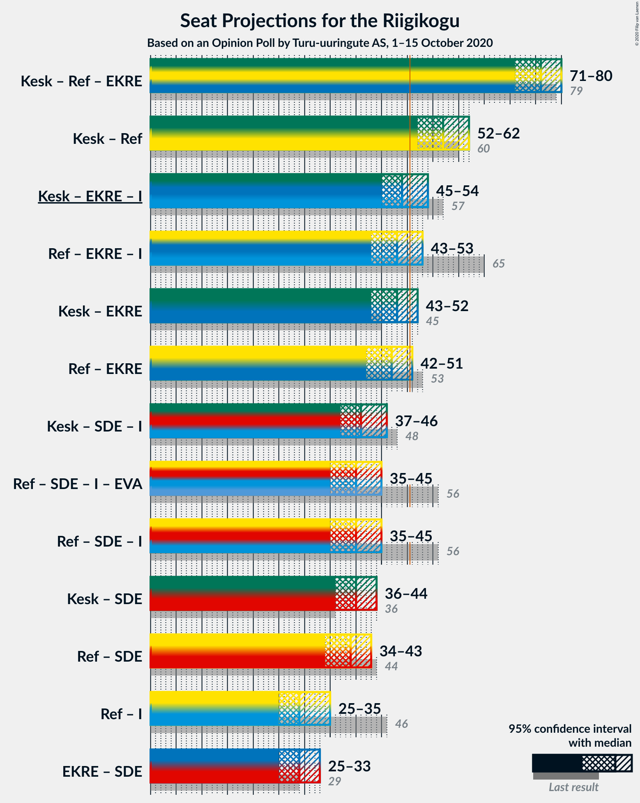

# Opinion Poll by Turu-uuringute AS, 1–15 October 2020

<a href="#voting-intentions">Voting Intentions</a> | <a href="#seats">Seats</a> | <a href="#coalitions">Coalitions</a> | <a href="#technical-information">Technical Information</a>

## Voting Intentions

### Confidence Intervals

| Party | Last Result | Poll Result | 80% Confidence Interval | 90% Confidence Interval | 95% Confidence Interval | 99% Confidence Interval |
|:-----:|:-----------:|:-----------:|:-----------------------:|:-----------------------:|:-----------------------:|:-----------------------:|
| Eesti Keskerakond | 23.1% | 25.0% | 23.2–26.9% |22.6–27.5% |22.2–28.0% |21.4–28.9% |
| Eesti Reformierakond | 28.9% | 24.1% | 22.3–26.0% |21.8–26.5% |21.3–27.0% |20.5–28.0% |
| Eesti Konservatiivne Rahvaerakond | 17.8% | 16.7% | 15.2–18.4% |14.8–18.9% |14.4–19.4% |13.7–20.2% |
| Eesti 200 | 4.4% | 12.0% | 10.7–13.5% |10.3–14.0% |10.0–14.4% |9.4–15.1% |
| Sotsiaaldemokraatlik Erakond | 9.8% | 10.2% | 9.0–11.6% |8.6–12.0% |8.4–12.4% |7.8–13.1% |
| Erakond Isamaa | 11.4% | 4.6% | 3.8–5.6% |3.6–5.9% |3.4–6.2% |3.0–6.7% |
| Erakond Eestimaa Rohelised | 1.8% | 2.7% | 2.1–3.6% |2.0–3.8% |1.9–4.1% |1.6–4.5% |
| Eesti Vabaerakond | 1.2% | 0.9% | 0.6–1.5% |0.5–1.6% |0.5–1.8% |0.4–2.1% |

*Note:* The poll result column reflects the actual value used in the calculations. Published results may vary slightly, and in addition be rounded to fewer digits.

## Seats

### Confidence Intervals

| Party | Last Result | Median | 80% Confidence Interval | 90% Confidence Interval | 95% Confidence Interval | 99% Confidence Interval |
|:-----:|:-----------:|:------:|:-----------------------:|:-----------------------:|:-----------------------:|:-----------------------:|
| <a href="#eesti-keskerakond">Eesti Keskerakond</a> | 26 | 29 | 27–32 |26–32 |25–33 |24–35 |
| <a href="#eesti-reformierakond">Eesti Reformierakond</a> | 34 | 28 | 25–31 |25–31 |24–32 |23–33 |
| <a href="#eesti-konservatiivne-rahvaerakond">Eesti Konservatiivne Rahvaerakond</a> | 19 | 19 | 16–21 |16–21 |15–22 |15–23 |
| <a href="#eesti-200">Eesti 200</a> | 0 | 13 | 11–14 |11–15 |10–16 |9–17 |
| <a href="#sotsiaaldemokraatlik-erakond">Sotsiaaldemokraatlik Erakond</a> | 10 | 11 | 9–12 |9–13 |8–13 |8–14 |
| <a href="#erakond-isamaa">Erakond Isamaa</a> | 12 | 0 | 0–5 |0–5 |0–6 |0–6 |
| <a href="#erakond-eestimaa-rohelised">Erakond Eestimaa Rohelised</a> | 0 | 0 | 0 |0 |0 |0 |
| <a href="#eesti-vabaerakond">Eesti Vabaerakond</a> | 0 | 0 | 0 |0 |0 |0 |

### Eesti Keskerakond

*For a full overview of the results for this party, see the [Eesti Keskerakond](party-eestikeskerakond.html) page.*

| Number of Seats | Probability | Accumulated | Special Marks |
|:---------------:|:-----------:|:-----------:|:-------------:|
| 23 | 0.1% | 100% |  |
| 24 | 0.7% | 99.9% |  |
| 25 | 2% | 99.2% |  |
| 26 | 7% | 97% | Last Result |
| 27 | 8% | 90% |  |
| 28 | 14% | 82% |  |
| 29 | 27% | 68% | Median |
| 30 | 16% | 42% |  |
| 31 | 14% | 26% |  |
| 32 | 7% | 12% |  |
| 33 | 2% | 4% |  |
| 34 | 1.4% | 2% |  |
| 35 | 0.5% | 0.6% |  |
| 36 | 0.1% | 0.1% |  |
| 37 | 0% | 0% |  |

### Eesti Reformierakond

*For a full overview of the results for this party, see the [Eesti Reformierakond](party-eestireformierakond.html) page.*

| Number of Seats | Probability | Accumulated | Special Marks |
|:---------------:|:-----------:|:-----------:|:-------------:|
| 22 | 0.1% | 100% |  |
| 23 | 0.6% | 99.8% |  |
| 24 | 3% | 99.2% |  |
| 25 | 7% | 97% |  |
| 26 | 10% | 90% |  |
| 27 | 19% | 80% |  |
| 28 | 21% | 60% | Median |
| 29 | 15% | 39% |  |
| 30 | 14% | 24% |  |
| 31 | 5% | 10% |  |
| 32 | 4% | 5% |  |
| 33 | 0.7% | 1.0% |  |
| 34 | 0.2% | 0.3% | Last Result |
| 35 | 0.1% | 0.1% |  |
| 36 | 0% | 0% |  |

### Eesti Konservatiivne Rahvaerakond

*For a full overview of the results for this party, see the [Eesti Konservatiivne Rahvaerakond](party-eestikonservatiivnerahvaerakond.html) page.*

| Number of Seats | Probability | Accumulated | Special Marks |
|:---------------:|:-----------:|:-----------:|:-------------:|
| 14 | 0.4% | 100% |  |
| 15 | 3% | 99.6% |  |
| 16 | 7% | 97% |  |
| 17 | 11% | 90% |  |
| 18 | 26% | 79% |  |
| 19 | 26% | 53% | Last Result, Median |
| 20 | 15% | 27% |  |
| 21 | 8% | 12% |  |
| 22 | 2% | 4% |  |
| 23 | 0.9% | 1.2% |  |
| 24 | 0.3% | 0.3% |  |
| 25 | 0% | 0% |  |

### Eesti 200

*For a full overview of the results for this party, see the [Eesti 200](party-eesti200.html) page.*

| Number of Seats | Probability | Accumulated | Special Marks |
|:---------------:|:-----------:|:-----------:|:-------------:|
| 0 | 0% | 100% | Last Result |
| 1 | 0% | 100% |  |
| 2 | 0% | 100% |  |
| 3 | 0% | 100% |  |
| 4 | 0% | 100% |  |
| 5 | 0% | 100% |  |
| 6 | 0% | 100% |  |
| 7 | 0% | 100% |  |
| 8 | 0% | 100% |  |
| 9 | 0.5% | 100% |  |
| 10 | 3% | 99.5% |  |
| 11 | 15% | 96% |  |
| 12 | 23% | 81% |  |
| 13 | 30% | 58% | Median |
| 14 | 19% | 28% |  |
| 15 | 7% | 9% |  |
| 16 | 2% | 3% |  |
| 17 | 0.6% | 0.7% |  |
| 18 | 0.1% | 0.1% |  |
| 19 | 0% | 0% |  |

### Sotsiaaldemokraatlik Erakond

*For a full overview of the results for this party, see the [Sotsiaaldemokraatlik Erakond](party-sotsiaaldemokraatlikerakond.html) page.*

| Number of Seats | Probability | Accumulated | Special Marks |
|:---------------:|:-----------:|:-----------:|:-------------:|
| 7 | 0.3% | 100% |  |
| 8 | 4% | 99.7% |  |
| 9 | 16% | 96% |  |
| 10 | 24% | 80% | Last Result |
| 11 | 31% | 56% | Median |
| 12 | 18% | 25% |  |
| 13 | 5% | 7% |  |
| 14 | 1.2% | 1.4% |  |
| 15 | 0.1% | 0.2% |  |
| 16 | 0% | 0% |  |

### Erakond Isamaa

*For a full overview of the results for this party, see the [Erakond Isamaa](party-erakondisamaa.html) page.*

| Number of Seats | Probability | Accumulated | Special Marks |
|:---------------:|:-----------:|:-----------:|:-------------:|
| 0 | 70% | 100% | Median |
| 1 | 0% | 30% |  |
| 2 | 0% | 30% |  |
| 3 | 0% | 30% |  |
| 4 | 3% | 30% |  |
| 5 | 23% | 27% |  |
| 6 | 3% | 3% |  |
| 7 | 0.2% | 0.2% |  |
| 8 | 0% | 0% |  |
| 9 | 0% | 0% |  |
| 10 | 0% | 0% |  |
| 11 | 0% | 0% |  |
| 12 | 0% | 0% | Last Result |

### Erakond Eestimaa Rohelised

*For a full overview of the results for this party, see the [Erakond Eestimaa Rohelised](party-erakondeestimaarohelised.html) page.*

| Number of Seats | Probability | Accumulated | Special Marks |
|:---------------:|:-----------:|:-----------:|:-------------:|
| 0 | 100% | 100% | Last Result, Median |

### Eesti Vabaerakond

*For a full overview of the results for this party, see the [Eesti Vabaerakond](party-eestivabaerakond.html) page.*

| Number of Seats | Probability | Accumulated | Special Marks |
|:---------------:|:-----------:|:-----------:|:-------------:|
| 0 | 100% | 100% | Last Result, Median |

## Coalitions

### Confidence Intervals

| Coalition | Last Result | Median | Majority? | 80% Confidence Interval | 90% Confidence Interval | 95% Confidence Interval | 99% Confidence Interval |
|:---------:|:-----------:|:------:|:---------:|:-----------------------:|:-----------------------:|:-----------------------:|:-----------------------:|
| Eesti Keskerakond – Eesti Reformierakond – Eesti Konservatiivne Rahvaerakond | 79 | 76 | 100% | 72–79 | 72–80 | 71–80 | 69–81 |
| Eesti Keskerakond – Eesti Reformierakond | 60 | 57 | 99.7% | 54–60 | 53–61 | 52–62 | 51–63 |
| Eesti Keskerakond – Eesti Konservatiivne Rahvaerakond – Erakond Isamaa | 57 | 49 | 30% | 46–53 | 45–54 | 45–54 | 43–56 |
| Eesti Reformierakond – Eesti Konservatiivne Rahvaerakond – Erakond Isamaa | 65 | 48 | 17% | 45–52 | 44–52 | 43–53 | 42–54 |
| Eesti Keskerakond – Eesti Konservatiivne Rahvaerakond | 45 | 48 | 11% | 45–51 | 44–52 | 43–52 | 42–54 |
| Eesti Reformierakond – Eesti Konservatiivne Rahvaerakond | 53 | 47 | 4% | 44–49 | 43–50 | 42–51 | 41–53 |
| Eesti Keskerakond – Sotsiaaldemokraatlik Erakond – Erakond Isamaa | 48 | 41 | 0% | 38–44 | 37–45 | 37–46 | 35–47 |
| Eesti Reformierakond – Sotsiaaldemokraatlik Erakond – Erakond Isamaa – Eesti Vabaerakond | 56 | 40 | 0% | 37–43 | 36–45 | 35–45 | 34–47 |
| Eesti Reformierakond – Sotsiaaldemokraatlik Erakond – Erakond Isamaa | 56 | 40 | 0% | 37–43 | 36–45 | 35–45 | 34–47 |
| Eesti Keskerakond – Sotsiaaldemokraatlik Erakond | 36 | 40 | 0% | 37–43 | 36–43 | 36–44 | 34–46 |
| Eesti Reformierakond – Sotsiaaldemokraatlik Erakond | 44 | 39 | 0% | 36–41 | 35–42 | 34–43 | 33–44 |
| Eesti Reformierakond – Erakond Isamaa | 46 | 29 | 0% | 27–33 | 26–34 | 25–35 | 24–36 |
| Eesti Konservatiivne Rahvaerakond – Sotsiaaldemokraatlik Erakond | 29 | 29 | 0% | 27–32 | 26–33 | 25–33 | 24–34 |

### Eesti Keskerakond – Eesti Reformierakond – Eesti Konservatiivne Rahvaerakond

| Number of Seats | Probability | Accumulated | Special Marks |
|:---------------:|:-----------:|:-----------:|:-------------:|
| 67 | 0.1% | 100% |  |
| 68 | 0.2% | 99.9% |  |
| 69 | 0.7% | 99.7% |  |
| 70 | 1.0% | 99.1% |  |
| 71 | 3% | 98% |  |
| 72 | 6% | 95% |  |
| 73 | 7% | 89% |  |
| 74 | 12% | 82% |  |
| 75 | 11% | 71% |  |
| 76 | 15% | 60% | Median |
| 77 | 20% | 46% |  |
| 78 | 10% | 26% |  |
| 79 | 10% | 15% | Last Result |
| 80 | 3% | 5% |  |
| 81 | 2% | 2% |  |
| 82 | 0.3% | 0.3% |  |
| 83 | 0% | 0.1% |  |
| 84 | 0% | 0% |  |

### Eesti Keskerakond – Eesti Reformierakond

| Number of Seats | Probability | Accumulated | Special Marks |
|:---------------:|:-----------:|:-----------:|:-------------:|
| 49 | 0.1% | 100% |  |
| 50 | 0.2% | 99.9% |  |
| 51 | 0.8% | 99.7% | Majority |
| 52 | 2% | 98.9% |  |
| 53 | 4% | 97% |  |
| 54 | 6% | 93% |  |
| 55 | 9% | 87% |  |
| 56 | 15% | 78% |  |
| 57 | 14% | 62% | Median |
| 58 | 16% | 48% |  |
| 59 | 15% | 32% |  |
| 60 | 8% | 17% | Last Result |
| 61 | 5% | 9% |  |
| 62 | 2% | 4% |  |
| 63 | 1.3% | 2% |  |
| 64 | 0.3% | 0.4% |  |
| 65 | 0% | 0.1% |  |
| 66 | 0% | 0% |  |

### Eesti Keskerakond – Eesti Konservatiivne Rahvaerakond – Erakond Isamaa

| Number of Seats | Probability | Accumulated | Special Marks |
|:---------------:|:-----------:|:-----------:|:-------------:|
| 42 | 0.1% | 100% |  |
| 43 | 0.5% | 99.8% |  |
| 44 | 2% | 99.4% |  |
| 45 | 3% | 98% |  |
| 46 | 6% | 95% |  |
| 47 | 12% | 89% |  |
| 48 | 12% | 76% | Median |
| 49 | 18% | 65% |  |
| 50 | 17% | 47% |  |
| 51 | 10% | 30% | Majority |
| 52 | 9% | 20% |  |
| 53 | 5% | 11% |  |
| 54 | 4% | 5% |  |
| 55 | 0.8% | 1.4% |  |
| 56 | 0.5% | 0.6% |  |
| 57 | 0.1% | 0.1% | Last Result |
| 58 | 0% | 0% |  |

### Eesti Reformierakond – Eesti Konservatiivne Rahvaerakond – Erakond Isamaa

| Number of Seats | Probability | Accumulated | Special Marks |
|:---------------:|:-----------:|:-----------:|:-------------:|
| 41 | 0.3% | 100% |  |
| 42 | 0.6% | 99.6% |  |
| 43 | 2% | 99.0% |  |
| 44 | 3% | 97% |  |
| 45 | 6% | 94% |  |
| 46 | 12% | 88% |  |
| 47 | 16% | 77% | Median |
| 48 | 22% | 61% |  |
| 49 | 9% | 38% |  |
| 50 | 13% | 29% |  |
| 51 | 7% | 17% | Majority |
| 52 | 6% | 10% |  |
| 53 | 3% | 4% |  |
| 54 | 0.7% | 1.0% |  |
| 55 | 0.2% | 0.3% |  |
| 56 | 0.1% | 0.1% |  |
| 57 | 0% | 0% |  |
| 58 | 0% | 0% |  |
| 59 | 0% | 0% |  |
| 60 | 0% | 0% |  |
| 61 | 0% | 0% |  |
| 62 | 0% | 0% |  |
| 63 | 0% | 0% |  |
| 64 | 0% | 0% |  |
| 65 | 0% | 0% | Last Result |

### Eesti Keskerakond – Eesti Konservatiivne Rahvaerakond

| Number of Seats | Probability | Accumulated | Special Marks |
|:---------------:|:-----------:|:-----------:|:-------------:|
| 40 | 0.1% | 100% |  |
| 41 | 0.3% | 99.9% |  |
| 42 | 0.7% | 99.6% |  |
| 43 | 3% | 98.9% |  |
| 44 | 5% | 96% |  |
| 45 | 8% | 91% | Last Result |
| 46 | 12% | 83% |  |
| 47 | 16% | 72% |  |
| 48 | 14% | 56% | Median |
| 49 | 18% | 42% |  |
| 50 | 13% | 24% |  |
| 51 | 5% | 11% | Majority |
| 52 | 4% | 6% |  |
| 53 | 2% | 2% |  |
| 54 | 0.5% | 0.6% |  |
| 55 | 0.1% | 0.2% |  |
| 56 | 0% | 0% |  |

### Eesti Reformierakond – Eesti Konservatiivne Rahvaerakond

| Number of Seats | Probability | Accumulated | Special Marks |
|:---------------:|:-----------:|:-----------:|:-------------:|
| 39 | 0.1% | 100% |  |
| 40 | 0.3% | 99.9% |  |
| 41 | 1.0% | 99.6% |  |
| 42 | 3% | 98.5% |  |
| 43 | 4% | 96% |  |
| 44 | 8% | 92% |  |
| 45 | 13% | 84% |  |
| 46 | 14% | 71% |  |
| 47 | 20% | 57% | Median |
| 48 | 22% | 37% |  |
| 49 | 6% | 16% |  |
| 50 | 5% | 10% |  |
| 51 | 3% | 4% | Majority |
| 52 | 1.0% | 2% |  |
| 53 | 0.4% | 0.6% | Last Result |
| 54 | 0.1% | 0.2% |  |
| 55 | 0% | 0% |  |

### Eesti Keskerakond – Sotsiaaldemokraatlik Erakond – Erakond Isamaa

| Number of Seats | Probability | Accumulated | Special Marks |
|:---------------:|:-----------:|:-----------:|:-------------:|
| 34 | 0.1% | 100% |  |
| 35 | 0.5% | 99.9% |  |
| 36 | 2% | 99.4% |  |
| 37 | 3% | 98% |  |
| 38 | 5% | 95% |  |
| 39 | 9% | 90% |  |
| 40 | 15% | 81% | Median |
| 41 | 18% | 65% |  |
| 42 | 18% | 48% |  |
| 43 | 13% | 30% |  |
| 44 | 7% | 16% |  |
| 45 | 5% | 9% |  |
| 46 | 3% | 5% |  |
| 47 | 2% | 2% |  |
| 48 | 0.3% | 0.5% | Last Result |
| 49 | 0.1% | 0.2% |  |
| 50 | 0% | 0% |  |

### Eesti Reformierakond – Sotsiaaldemokraatlik Erakond – Erakond Isamaa – Eesti Vabaerakond

| Number of Seats | Probability | Accumulated | Special Marks |
|:---------------:|:-----------:|:-----------:|:-------------:|
| 33 | 0.2% | 100% |  |
| 34 | 0.5% | 99.8% |  |
| 35 | 2% | 99.3% |  |
| 36 | 3% | 97% |  |
| 37 | 8% | 94% |  |
| 38 | 12% | 87% |  |
| 39 | 17% | 75% | Median |
| 40 | 13% | 58% |  |
| 41 | 17% | 45% |  |
| 42 | 11% | 28% |  |
| 43 | 8% | 17% |  |
| 44 | 4% | 9% |  |
| 45 | 3% | 5% |  |
| 46 | 1.4% | 2% |  |
| 47 | 0.4% | 0.6% |  |
| 48 | 0.1% | 0.2% |  |
| 49 | 0% | 0% |  |
| 50 | 0% | 0% |  |
| 51 | 0% | 0% | Majority |
| 52 | 0% | 0% |  |
| 53 | 0% | 0% |  |
| 54 | 0% | 0% |  |
| 55 | 0% | 0% |  |
| 56 | 0% | 0% | Last Result |

### Eesti Reformierakond – Sotsiaaldemokraatlik Erakond – Erakond Isamaa

| Number of Seats | Probability | Accumulated | Special Marks |
|:---------------:|:-----------:|:-----------:|:-------------:|
| 33 | 0.2% | 100% |  |
| 34 | 0.5% | 99.8% |  |
| 35 | 2% | 99.3% |  |
| 36 | 3% | 97% |  |
| 37 | 8% | 94% |  |
| 38 | 12% | 87% |  |
| 39 | 17% | 75% | Median |
| 40 | 13% | 58% |  |
| 41 | 17% | 45% |  |
| 42 | 11% | 28% |  |
| 43 | 8% | 17% |  |
| 44 | 4% | 9% |  |
| 45 | 3% | 5% |  |
| 46 | 1.4% | 2% |  |
| 47 | 0.4% | 0.6% |  |
| 48 | 0.1% | 0.2% |  |
| 49 | 0% | 0% |  |
| 50 | 0% | 0% |  |
| 51 | 0% | 0% | Majority |
| 52 | 0% | 0% |  |
| 53 | 0% | 0% |  |
| 54 | 0% | 0% |  |
| 55 | 0% | 0% |  |
| 56 | 0% | 0% | Last Result |

### Eesti Keskerakond – Sotsiaaldemokraatlik Erakond

| Number of Seats | Probability | Accumulated | Special Marks |
|:---------------:|:-----------:|:-----------:|:-------------:|
| 33 | 0.2% | 100% |  |
| 34 | 0.7% | 99.8% |  |
| 35 | 1.4% | 99.0% |  |
| 36 | 4% | 98% | Last Result |
| 37 | 8% | 93% |  |
| 38 | 13% | 85% |  |
| 39 | 13% | 72% |  |
| 40 | 18% | 59% | Median |
| 41 | 17% | 41% |  |
| 42 | 13% | 24% |  |
| 43 | 6% | 10% |  |
| 44 | 3% | 4% |  |
| 45 | 1.1% | 2% |  |
| 46 | 0.4% | 0.6% |  |
| 47 | 0.1% | 0.1% |  |
| 48 | 0% | 0% |  |

### Eesti Reformierakond – Sotsiaaldemokraatlik Erakond

| Number of Seats | Probability | Accumulated | Special Marks |
|:---------------:|:-----------:|:-----------:|:-------------:|
| 32 | 0.3% | 100% |  |
| 33 | 0.5% | 99.7% |  |
| 34 | 3% | 99.2% |  |
| 35 | 5% | 97% |  |
| 36 | 8% | 92% |  |
| 37 | 14% | 84% |  |
| 38 | 18% | 70% |  |
| 39 | 17% | 53% | Median |
| 40 | 13% | 36% |  |
| 41 | 13% | 23% |  |
| 42 | 6% | 10% |  |
| 43 | 3% | 4% |  |
| 44 | 1.0% | 1.3% | Last Result |
| 45 | 0.3% | 0.3% |  |
| 46 | 0.1% | 0.1% |  |
| 47 | 0% | 0% |  |

### Eesti Reformierakond – Erakond Isamaa

| Number of Seats | Probability | Accumulated | Special Marks |
|:---------------:|:-----------:|:-----------:|:-------------:|
| 23 | 0.2% | 100% |  |
| 24 | 0.9% | 99.8% |  |
| 25 | 3% | 98.9% |  |
| 26 | 6% | 96% |  |
| 27 | 13% | 90% |  |
| 28 | 16% | 77% | Median |
| 29 | 13% | 62% |  |
| 30 | 16% | 48% |  |
| 31 | 8% | 33% |  |
| 32 | 10% | 24% |  |
| 33 | 7% | 14% |  |
| 34 | 3% | 7% |  |
| 35 | 2% | 3% |  |
| 36 | 0.6% | 0.9% |  |
| 37 | 0.3% | 0.3% |  |
| 38 | 0% | 0.1% |  |
| 39 | 0% | 0% |  |
| 40 | 0% | 0% |  |
| 41 | 0% | 0% |  |
| 42 | 0% | 0% |  |
| 43 | 0% | 0% |  |
| 44 | 0% | 0% |  |
| 45 | 0% | 0% |  |
| 46 | 0% | 0% | Last Result |

### Eesti Konservatiivne Rahvaerakond – Sotsiaaldemokraatlik Erakond

| Number of Seats | Probability | Accumulated | Special Marks |
|:---------------:|:-----------:|:-----------:|:-------------:|
| 23 | 0.1% | 100% |  |
| 24 | 0.8% | 99.9% |  |
| 25 | 2% | 99.1% |  |
| 26 | 5% | 97% |  |
| 27 | 11% | 92% |  |
| 28 | 15% | 81% |  |
| 29 | 20% | 66% | Last Result |
| 30 | 19% | 46% | Median |
| 31 | 14% | 27% |  |
| 32 | 8% | 13% |  |
| 33 | 3% | 5% |  |
| 34 | 1.4% | 2% |  |
| 35 | 0.3% | 0.4% |  |
| 36 | 0.1% | 0.1% |  |
| 37 | 0% | 0% |  |

## Technical Information

### Opinion Poll

+ **Polling firm:** Turu-uuringute AS
+ **Commissioner(s):** —
+ **Fieldwork period:** 1–15 October 2020

### Calculations

+ **Sample size:** 873
+ **Simulations done:** 1,048,576
+ **Error estimate:** 2.58%

