# Opinion Poll by Norstat for MTÜ Ühiskonnauuringute Instituut, 14–20 October 2020

<a href="#voting-intentions">Voting Intentions</a> | <a href="#seats">Seats</a> | <a href="#coalitions">Coalitions</a> | <a href="#technical-information">Technical Information</a>

## Voting Intentions

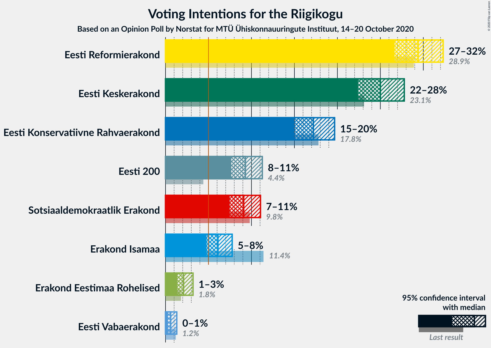

### Confidence Intervals

| Party | Last Result | Poll Result | 80% Confidence Interval | 90% Confidence Interval | 95% Confidence Interval | 99% Confidence Interval |
|:-----:|:-----------:|:-----------:|:-----------------------:|:-----------------------:|:-----------------------:|:-----------------------:|
| Eesti Reformierakond | 28.9% | 29.4% | 27.6–31.3% |27.1–31.8% |26.7–32.3% |25.8–33.2% |
| Eesti Keskerakond | 23.1% | 25.0% | 23.3–26.8% |22.8–27.3% |22.4–27.8% |21.6–28.7% |
| Eesti Konservatiivne Rahvaerakond | 17.8% | 17.2% | 15.7–18.8% |15.3–19.3% |15.0–19.7% |14.3–20.5% |
| Eesti 200 | 4.4% | 9.3% | 8.2–10.6% |7.9–10.9% |7.7–11.3% |7.2–11.9% |
| Sotsiaaldemokraatlik Erakond | 9.8% | 9.1% | 8.0–10.4% |7.7–10.7% |7.5–11.1% |7.0–11.7% |
| Erakond Isamaa | 11.4% | 6.1% | 5.2–7.2% |5.0–7.5% |4.8–7.8% |4.4–8.3% |
| Erakond Eestimaa Rohelised | 1.8% | 2.1% | 1.6–2.8% |1.5–3.0% |1.4–3.2% |1.2–3.6% |
| Eesti Vabaerakond | 1.2% | 0.6% | 0.4–1.1% |0.3–1.2% |0.3–1.3% |0.2–1.6% |

*Note:* The poll result column reflects the actual value used in the calculations. Published results may vary slightly, and in addition be rounded to fewer digits.

## Seats

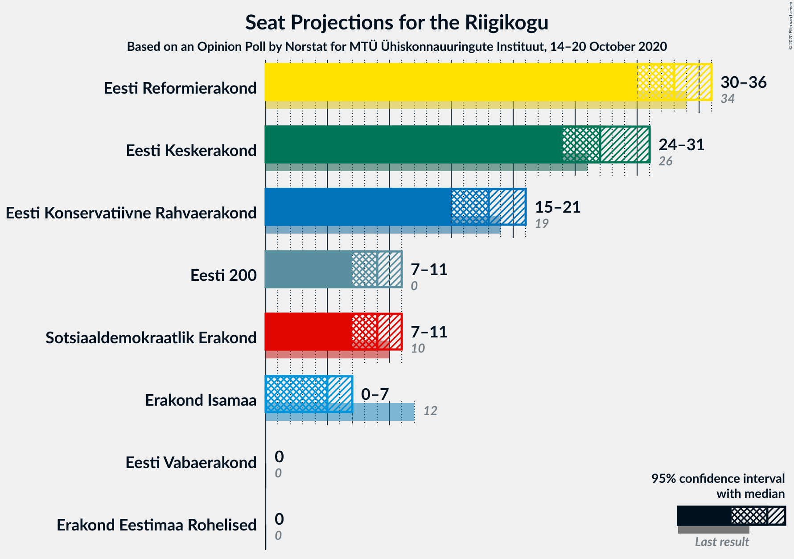

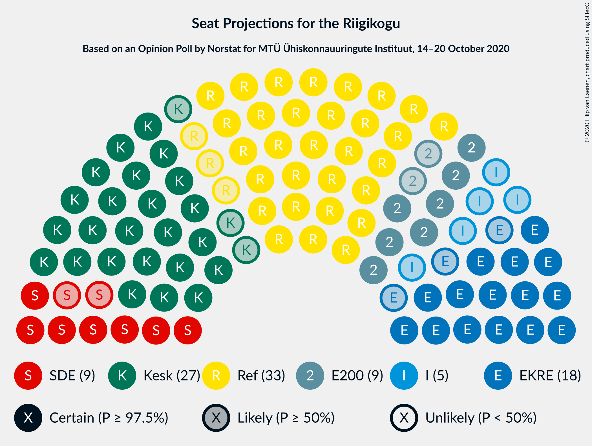

### Confidence Intervals

| Party | Last Result | Median | 80% Confidence Interval | 90% Confidence Interval | 95% Confidence Interval | 99% Confidence Interval |
|:-----:|:-----------:|:------:|:-----------------------:|:-----------------------:|:-----------------------:|:-----------------------:|
| <a href="#eesti-reformierakond">Eesti Reformierakond</a> | 34 | 33 | 31–35 |30–36 |30–36 |28–38 |
| <a href="#eesti-keskerakond">Eesti Keskerakond</a> | 26 | 27 | 25–30 |25–30 |24–31 |23–32 |
| <a href="#eesti-konservatiivne-rahvaerakond">Eesti Konservatiivne Rahvaerakond</a> | 19 | 18 | 16–20 |16–20 |15–21 |15–22 |
| <a href="#eesti-200">Eesti 200</a> | 0 | 9 | 8–10 |7–11 |7–11 |6–12 |
| <a href="#sotsiaaldemokraatlik-erakond">Sotsiaaldemokraatlik Erakond</a> | 10 | 9 | 7–10 |7–10 |7–11 |6–11 |
| <a href="#erakond-isamaa">Erakond Isamaa</a> | 12 | 5 | 4–6 |0–7 |0–7 |0–8 |
| <a href="#erakond-eestimaa-rohelised">Erakond Eestimaa Rohelised</a> | 0 | 0 | 0 |0 |0 |0 |
| <a href="#eesti-vabaerakond">Eesti Vabaerakond</a> | 0 | 0 | 0 |0 |0 |0 |

### Eesti Reformierakond

*For a full overview of the results for this party, see the [Eesti Reformierakond](party-eestireformierakond.html) page.*

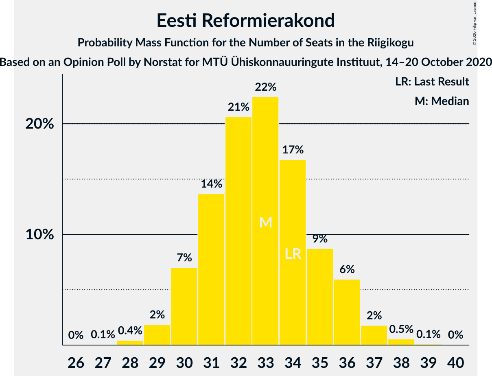

| Number of Seats | Probability | Accumulated | Special Marks |
|:---------------:|:-----------:|:-----------:|:-------------:|
| 27 | 0.1% | 100% |  |
| 28 | 0.4% | 99.9% |  |
| 29 | 2% | 99.5% |  |
| 30 | 7% | 98% |  |
| 31 | 14% | 91% |  |
| 32 | 21% | 77% |  |
| 33 | 22% | 56% | Median |
| 34 | 17% | 34% | Last Result |
| 35 | 9% | 17% |  |
| 36 | 6% | 8% |  |
| 37 | 2% | 2% |  |
| 38 | 0.5% | 0.7% |  |
| 39 | 0.1% | 0.1% |  |
| 40 | 0% | 0% |  |

### Eesti Keskerakond

*For a full overview of the results for this party, see the [Eesti Keskerakond](party-eestikeskerakond.html) page.*

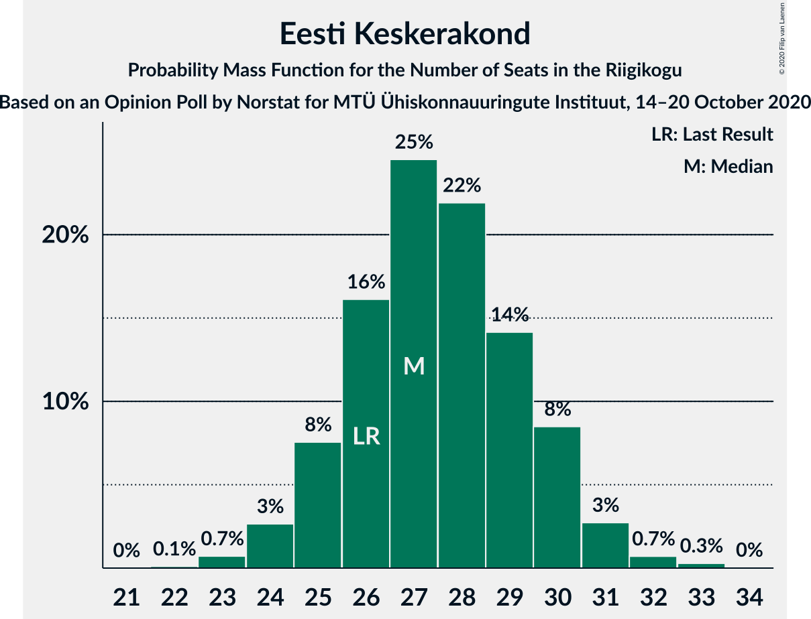

| Number of Seats | Probability | Accumulated | Special Marks |
|:---------------:|:-----------:|:-----------:|:-------------:|
| 22 | 0.1% | 100% |  |
| 23 | 0.7% | 99.9% |  |
| 24 | 3% | 99.2% |  |
| 25 | 8% | 97% |  |
| 26 | 16% | 89% | Last Result |
| 27 | 25% | 73% | Median |
| 28 | 22% | 48% |  |
| 29 | 14% | 26% |  |
| 30 | 8% | 12% |  |
| 31 | 3% | 4% |  |
| 32 | 0.7% | 1.0% |  |
| 33 | 0.3% | 0.3% |  |
| 34 | 0% | 0% |  |

### Eesti Konservatiivne Rahvaerakond

*For a full overview of the results for this party, see the [Eesti Konservatiivne Rahvaerakond](party-eestikonservatiivnerahvaerakond.html) page.*

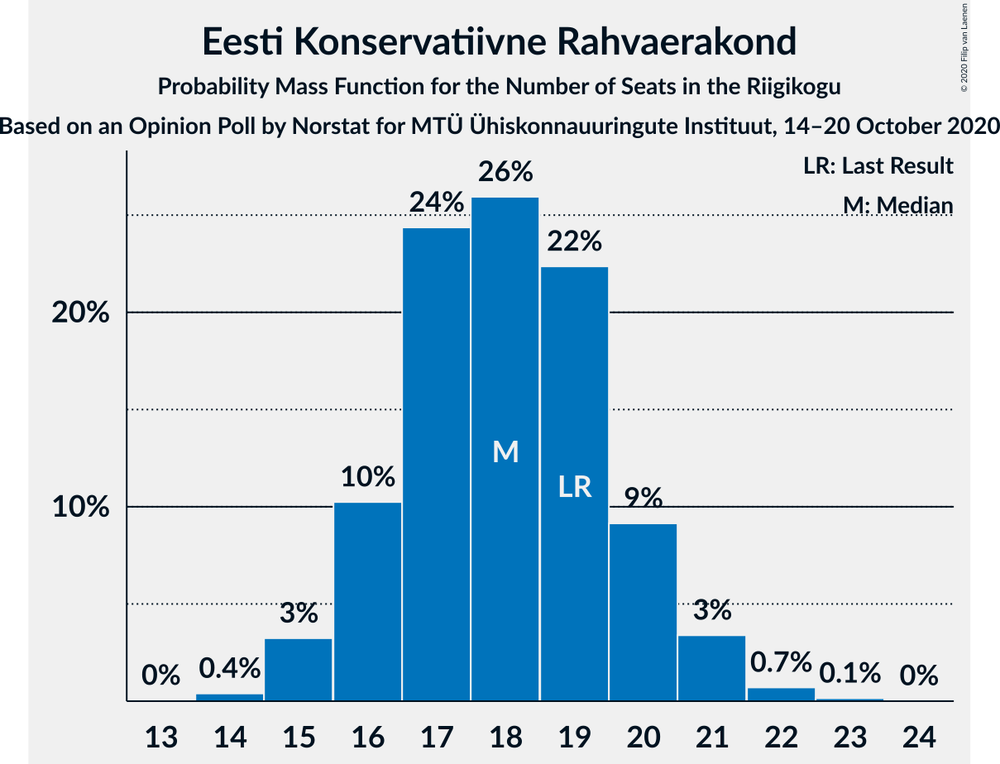

| Number of Seats | Probability | Accumulated | Special Marks |
|:---------------:|:-----------:|:-----------:|:-------------:|
| 14 | 0.4% | 100% |  |
| 15 | 3% | 99.6% |  |
| 16 | 10% | 96% |  |
| 17 | 24% | 86% |  |
| 18 | 26% | 62% | Median |
| 19 | 22% | 36% | Last Result |
| 20 | 9% | 13% |  |
| 21 | 3% | 4% |  |
| 22 | 0.7% | 0.9% |  |
| 23 | 0.1% | 0.2% |  |
| 24 | 0% | 0% |  |

### Eesti 200

*For a full overview of the results for this party, see the [Eesti 200](party-eesti200.html) page.*

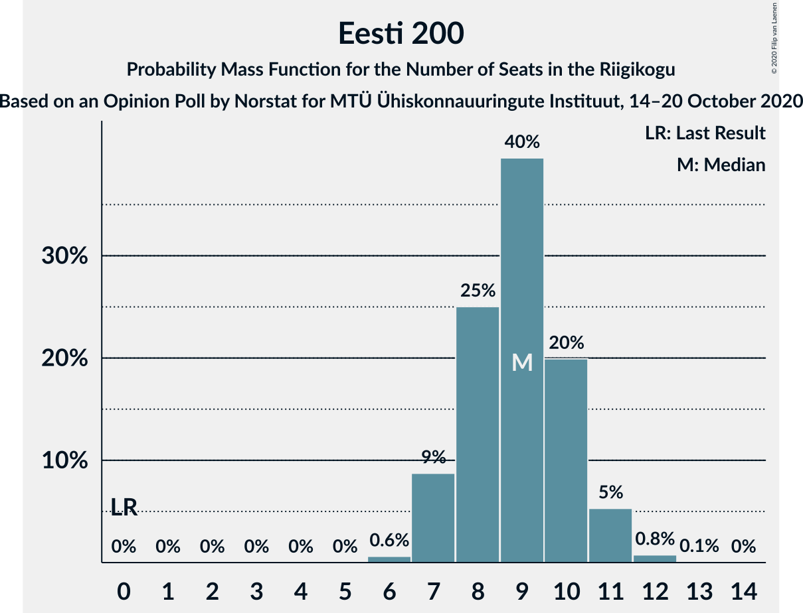

| Number of Seats | Probability | Accumulated | Special Marks |
|:---------------:|:-----------:|:-----------:|:-------------:|
| 0 | 0% | 100% | Last Result |
| 1 | 0% | 100% |  |
| 2 | 0% | 100% |  |
| 3 | 0% | 100% |  |
| 4 | 0% | 100% |  |
| 5 | 0% | 100% |  |
| 6 | 0.6% | 100% |  |
| 7 | 9% | 99.4% |  |
| 8 | 25% | 91% |  |
| 9 | 40% | 66% | Median |
| 10 | 20% | 26% |  |
| 11 | 5% | 6% |  |
| 12 | 0.8% | 0.8% |  |
| 13 | 0.1% | 0.1% |  |
| 14 | 0% | 0% |  |

### Sotsiaaldemokraatlik Erakond

*For a full overview of the results for this party, see the [Sotsiaaldemokraatlik Erakond](party-sotsiaaldemokraatlikerakond.html) page.*

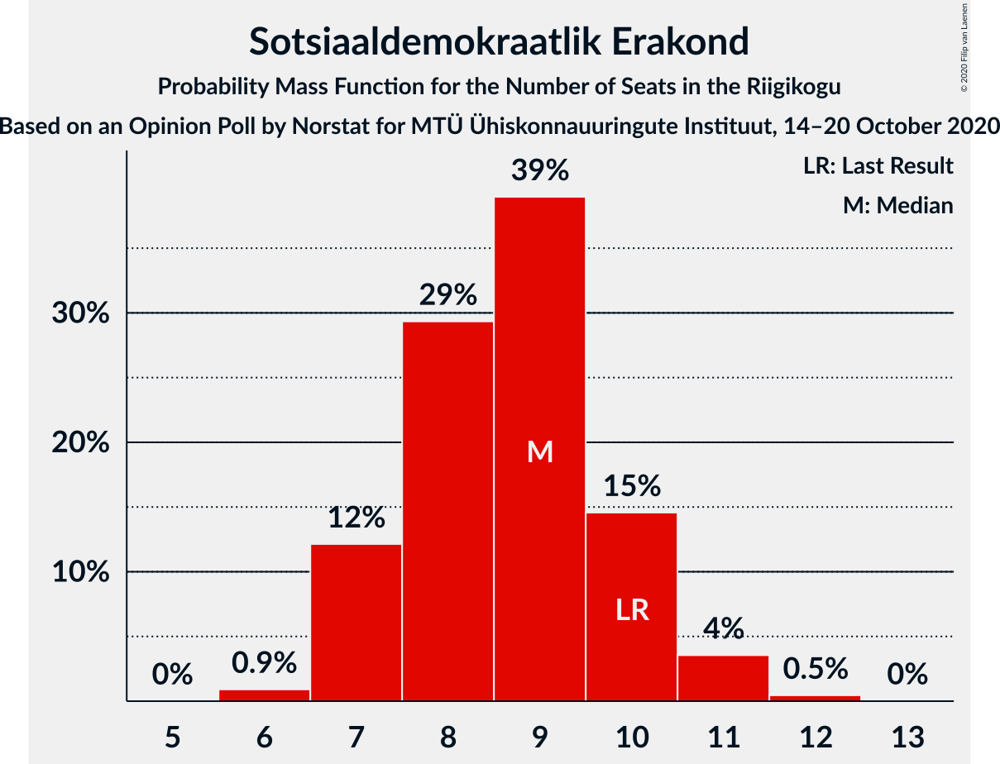

| Number of Seats | Probability | Accumulated | Special Marks |
|:---------------:|:-----------:|:-----------:|:-------------:|
| 6 | 0.9% | 100% |  |
| 7 | 12% | 99.1% |  |
| 8 | 29% | 87% |  |
| 9 | 39% | 58% | Median |
| 10 | 15% | 19% | Last Result |
| 11 | 4% | 4% |  |
| 12 | 0.5% | 0.5% |  |
| 13 | 0% | 0% |  |

### Erakond Isamaa

*For a full overview of the results for this party, see the [Erakond Isamaa](party-erakondisamaa.html) page.*

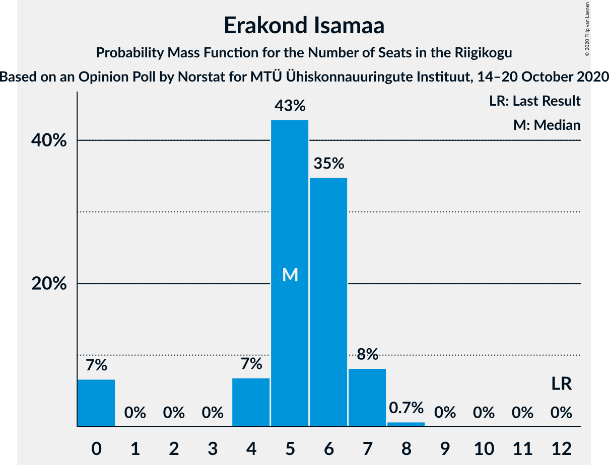

| Number of Seats | Probability | Accumulated | Special Marks |
|:---------------:|:-----------:|:-----------:|:-------------:|
| 0 | 7% | 100% |  |
| 1 | 0% | 93% |  |
| 2 | 0% | 93% |  |
| 3 | 0% | 93% |  |
| 4 | 7% | 93% |  |
| 5 | 43% | 87% | Median |
| 6 | 35% | 44% |  |
| 7 | 8% | 9% |  |
| 8 | 0.7% | 0.7% |  |
| 9 | 0% | 0% |  |
| 10 | 0% | 0% |  |
| 11 | 0% | 0% |  |
| 12 | 0% | 0% | Last Result |

### Erakond Eestimaa Rohelised

*For a full overview of the results for this party, see the [Erakond Eestimaa Rohelised](party-erakondeestimaarohelised.html) page.*

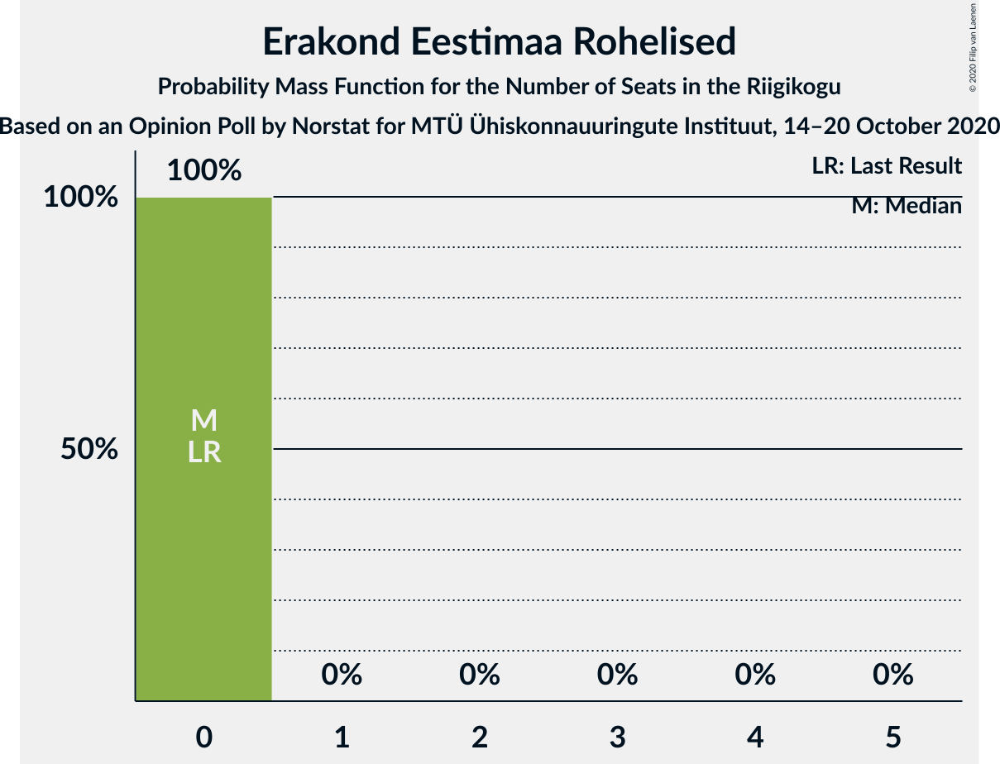

| Number of Seats | Probability | Accumulated | Special Marks |
|:---------------:|:-----------:|:-----------:|:-------------:|
| 0 | 100% | 100% | Last Result, Median |

### Eesti Vabaerakond

*For a full overview of the results for this party, see the [Eesti Vabaerakond](party-eestivabaerakond.html) page.*

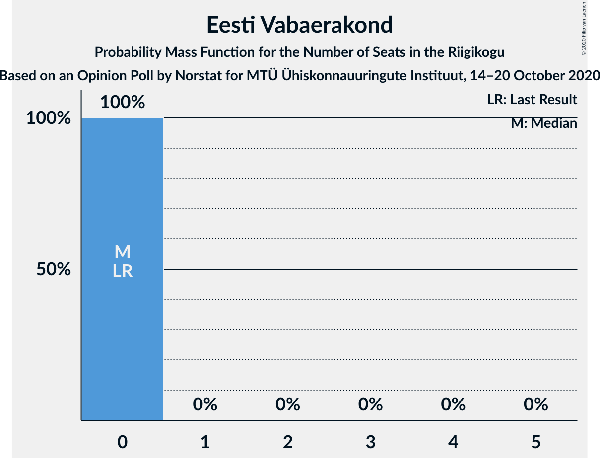

| Number of Seats | Probability | Accumulated | Special Marks |
|:---------------:|:-----------:|:-----------:|:-------------:|
| 0 | 100% | 100% | Last Result, Median |

## Coalitions

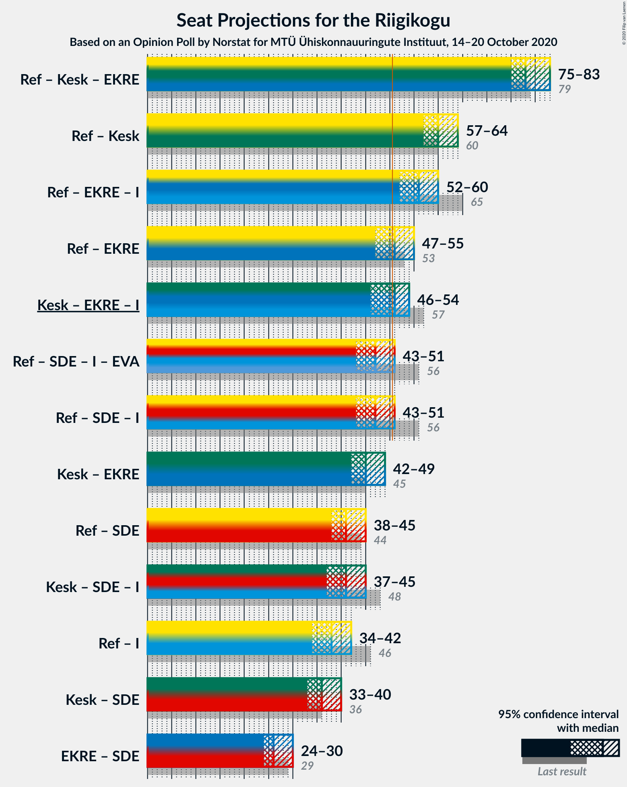

### Confidence Intervals

| Coalition | Last Result | Median | Majority? | 80% Confidence Interval | 90% Confidence Interval | 95% Confidence Interval | 99% Confidence Interval |
|:---------:|:-----------:|:------:|:---------:|:-----------------------:|:-----------------------:|:-----------------------:|:-----------------------:|
| Eesti Reformierakond – Eesti Keskerakond – Eesti Konservatiivne Rahvaerakond | 79 | 78 | 100% | 76–81 | 76–82 | 75–83 | 74–84 |
| Eesti Reformierakond – Eesti Keskerakond | 60 | 60 | 100% | 58–63 | 57–64 | 57–64 | 56–66 |
| Eesti Reformierakond – Eesti Konservatiivne Rahvaerakond – Erakond Isamaa | 65 | 56 | 99.5% | 54–58 | 53–59 | 52–60 | 50–61 |
| Eesti Reformierakond – Eesti Konservatiivne Rahvaerakond | 53 | 51 | 55% | 48–54 | 48–55 | 47–55 | 46–56 |
| Eesti Keskerakond – Eesti Konservatiivne Rahvaerakond – Erakond Isamaa | 57 | 51 | 51% | 48–53 | 47–54 | 46–54 | 45–55 |
| Eesti Reformierakond – Sotsiaaldemokraatlik Erakond – Erakond Isamaa – Eesti Vabaerakond | 56 | 47 | 3% | 44–49 | 43–50 | 43–51 | 41–52 |
| Eesti Reformierakond – Sotsiaaldemokraatlik Erakond – Erakond Isamaa | 56 | 47 | 3% | 44–49 | 43–50 | 43–51 | 41–52 |
| Eesti Keskerakond – Eesti Konservatiivne Rahvaerakond | 45 | 45 | 0.7% | 43–48 | 42–48 | 42–49 | 40–51 |
| Eesti Reformierakond – Sotsiaaldemokraatlik Erakond | 44 | 41 | 0% | 39–44 | 38–45 | 38–45 | 37–47 |
| Eesti Keskerakond – Sotsiaaldemokraatlik Erakond – Erakond Isamaa | 48 | 41 | 0% | 38–44 | 37–44 | 37–45 | 36–46 |
| Eesti Reformierakond – Erakond Isamaa | 46 | 38 | 0% | 36–40 | 35–41 | 34–42 | 32–43 |
| Eesti Keskerakond – Sotsiaaldemokraatlik Erakond | 36 | 36 | 0% | 34–38 | 33–39 | 33–40 | 32–41 |
| Eesti Konservatiivne Rahvaerakond – Sotsiaaldemokraatlik Erakond | 29 | 26 | 0% | 25–29 | 24–29 | 24–30 | 23–31 |

### Eesti Reformierakond – Eesti Keskerakond – Eesti Konservatiivne Rahvaerakond

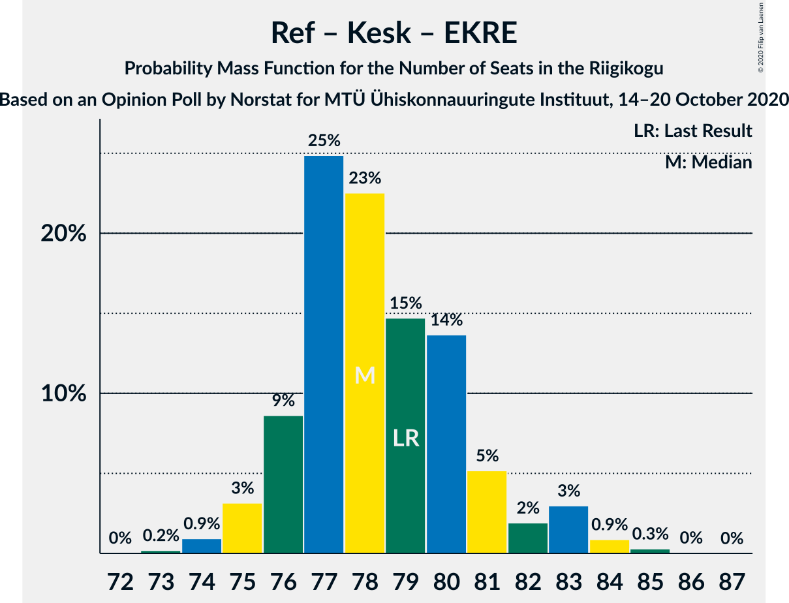

| Number of Seats | Probability | Accumulated | Special Marks |
|:---------------:|:-----------:|:-----------:|:-------------:|
| 73 | 0.2% | 100% |  |
| 74 | 0.9% | 99.8% |  |
| 75 | 3% | 98.8% |  |
| 76 | 9% | 96% |  |
| 77 | 25% | 87% |  |
| 78 | 23% | 62% | Median |
| 79 | 15% | 40% | Last Result |
| 80 | 14% | 25% |  |
| 81 | 5% | 11% |  |
| 82 | 2% | 6% |  |
| 83 | 3% | 4% |  |
| 84 | 0.9% | 1.2% |  |
| 85 | 0.3% | 0.3% |  |
| 86 | 0% | 0.1% |  |
| 87 | 0% | 0% |  |

### Eesti Reformierakond – Eesti Keskerakond

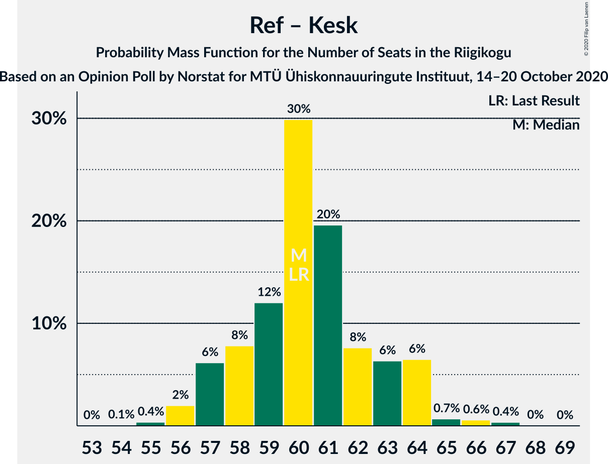

| Number of Seats | Probability | Accumulated | Special Marks |
|:---------------:|:-----------:|:-----------:|:-------------:|
| 54 | 0.1% | 100% |  |
| 55 | 0.4% | 99.9% |  |
| 56 | 2% | 99.5% |  |
| 57 | 6% | 98% |  |
| 58 | 8% | 91% |  |
| 59 | 12% | 84% |  |
| 60 | 30% | 72% | Last Result, Median |
| 61 | 20% | 42% |  |
| 62 | 8% | 22% |  |
| 63 | 6% | 14% |  |
| 64 | 6% | 8% |  |
| 65 | 0.7% | 2% |  |
| 66 | 0.6% | 1.0% |  |
| 67 | 0.4% | 0.4% |  |
| 68 | 0% | 0.1% |  |
| 69 | 0% | 0% |  |

### Eesti Reformierakond – Eesti Konservatiivne Rahvaerakond – Erakond Isamaa

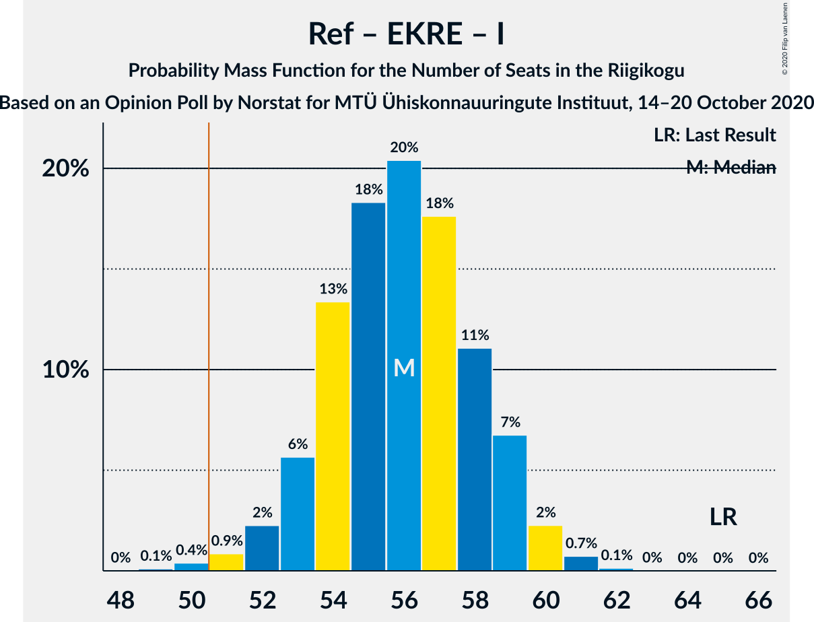

| Number of Seats | Probability | Accumulated | Special Marks |
|:---------------:|:-----------:|:-----------:|:-------------:|
| 49 | 0.1% | 100% |  |
| 50 | 0.4% | 99.9% |  |
| 51 | 0.9% | 99.5% | Majority |
| 52 | 2% | 98.6% |  |
| 53 | 6% | 96% |  |
| 54 | 13% | 91% |  |
| 55 | 18% | 77% |  |
| 56 | 20% | 59% | Median |
| 57 | 18% | 39% |  |
| 58 | 11% | 21% |  |
| 59 | 7% | 10% |  |
| 60 | 2% | 3% |  |
| 61 | 0.7% | 0.9% |  |
| 62 | 0.1% | 0.2% |  |
| 63 | 0% | 0% |  |
| 64 | 0% | 0% |  |
| 65 | 0% | 0% | Last Result |

### Eesti Reformierakond – Eesti Konservatiivne Rahvaerakond

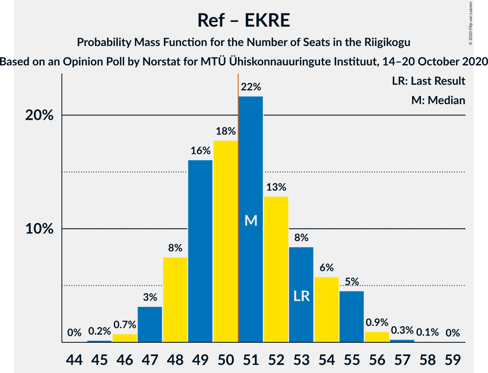

| Number of Seats | Probability | Accumulated | Special Marks |
|:---------------:|:-----------:|:-----------:|:-------------:|
| 45 | 0.2% | 100% |  |
| 46 | 0.7% | 99.8% |  |
| 47 | 3% | 99.0% |  |
| 48 | 8% | 96% |  |
| 49 | 16% | 88% |  |
| 50 | 18% | 72% |  |
| 51 | 22% | 55% | Median, Majority |
| 52 | 13% | 33% |  |
| 53 | 8% | 20% | Last Result |
| 54 | 6% | 12% |  |
| 55 | 5% | 6% |  |
| 56 | 0.9% | 1.3% |  |
| 57 | 0.3% | 0.4% |  |
| 58 | 0.1% | 0.1% |  |
| 59 | 0% | 0% |  |

### Eesti Keskerakond – Eesti Konservatiivne Rahvaerakond – Erakond Isamaa

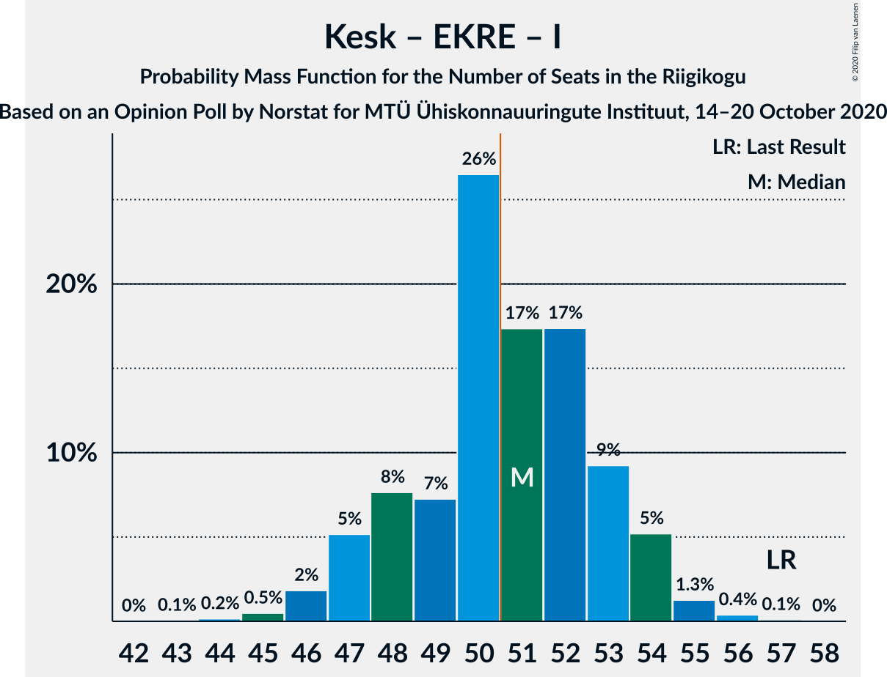

| Number of Seats | Probability | Accumulated | Special Marks |
|:---------------:|:-----------:|:-----------:|:-------------:|
| 43 | 0.1% | 100% |  |
| 44 | 0.2% | 99.9% |  |
| 45 | 0.5% | 99.8% |  |
| 46 | 2% | 99.3% |  |
| 47 | 5% | 97% |  |
| 48 | 8% | 92% |  |
| 49 | 7% | 85% |  |
| 50 | 26% | 77% | Median |
| 51 | 17% | 51% | Majority |
| 52 | 17% | 34% |  |
| 53 | 9% | 16% |  |
| 54 | 5% | 7% |  |
| 55 | 1.3% | 2% |  |
| 56 | 0.4% | 0.5% |  |
| 57 | 0.1% | 0.1% | Last Result |
| 58 | 0% | 0% |  |

### Eesti Reformierakond – Sotsiaaldemokraatlik Erakond – Erakond Isamaa – Eesti Vabaerakond

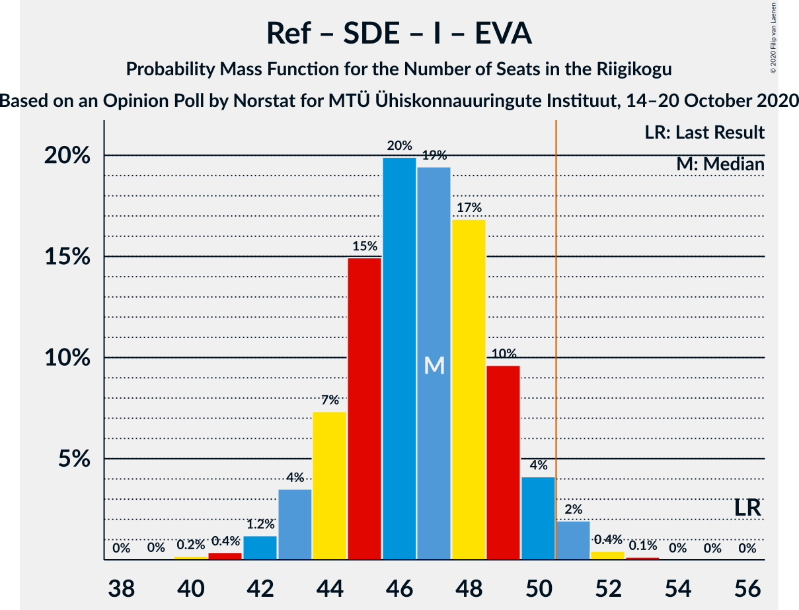

| Number of Seats | Probability | Accumulated | Special Marks |
|:---------------:|:-----------:|:-----------:|:-------------:|
| 39 | 0% | 100% |  |
| 40 | 0.2% | 99.9% |  |
| 41 | 0.4% | 99.8% |  |
| 42 | 1.2% | 99.4% |  |
| 43 | 4% | 98% |  |
| 44 | 7% | 95% |  |
| 45 | 15% | 87% |  |
| 46 | 20% | 72% |  |
| 47 | 19% | 53% | Median |
| 48 | 17% | 33% |  |
| 49 | 10% | 16% |  |
| 50 | 4% | 7% |  |
| 51 | 2% | 3% | Majority |
| 52 | 0.4% | 0.6% |  |
| 53 | 0.1% | 0.2% |  |
| 54 | 0% | 0% |  |
| 55 | 0% | 0% |  |
| 56 | 0% | 0% | Last Result |

### Eesti Reformierakond – Sotsiaaldemokraatlik Erakond – Erakond Isamaa

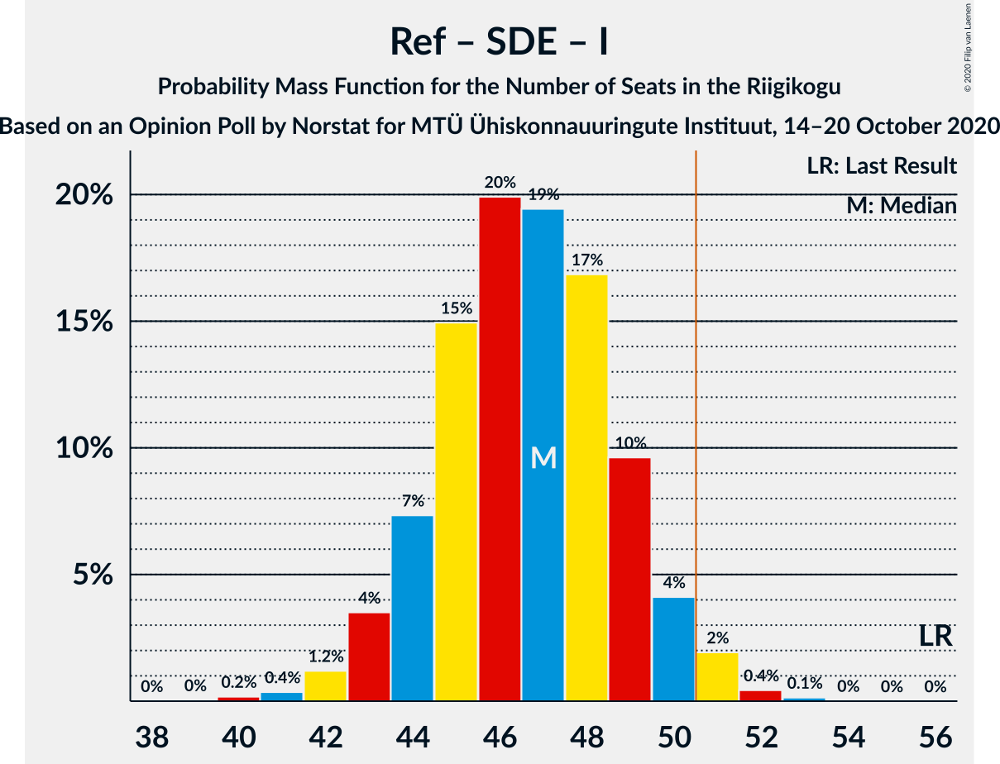

| Number of Seats | Probability | Accumulated | Special Marks |
|:---------------:|:-----------:|:-----------:|:-------------:|
| 39 | 0% | 100% |  |
| 40 | 0.2% | 99.9% |  |
| 41 | 0.4% | 99.8% |  |
| 42 | 1.2% | 99.4% |  |
| 43 | 4% | 98% |  |
| 44 | 7% | 95% |  |
| 45 | 15% | 87% |  |
| 46 | 20% | 72% |  |
| 47 | 19% | 53% | Median |
| 48 | 17% | 33% |  |
| 49 | 10% | 16% |  |
| 50 | 4% | 7% |  |
| 51 | 2% | 3% | Majority |
| 52 | 0.4% | 0.6% |  |
| 53 | 0.1% | 0.2% |  |
| 54 | 0% | 0% |  |
| 55 | 0% | 0% |  |
| 56 | 0% | 0% | Last Result |

### Eesti Keskerakond – Eesti Konservatiivne Rahvaerakond

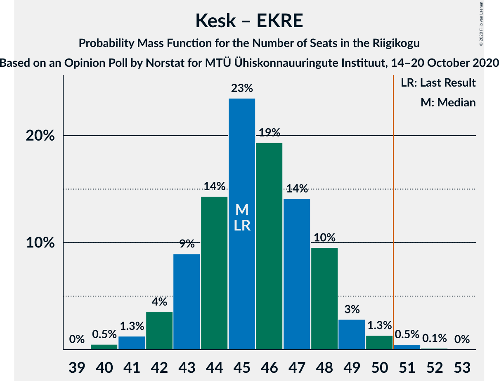

| Number of Seats | Probability | Accumulated | Special Marks |
|:---------------:|:-----------:|:-----------:|:-------------:|
| 39 | 0% | 100% |  |
| 40 | 0.5% | 99.9% |  |
| 41 | 1.3% | 99.4% |  |
| 42 | 4% | 98% |  |
| 43 | 9% | 95% |  |
| 44 | 14% | 86% |  |
| 45 | 23% | 71% | Last Result, Median |
| 46 | 19% | 48% |  |
| 47 | 14% | 28% |  |
| 48 | 10% | 14% |  |
| 49 | 3% | 5% |  |
| 50 | 1.3% | 2% |  |
| 51 | 0.5% | 0.7% | Majority |
| 52 | 0.1% | 0.2% |  |
| 53 | 0% | 0% |  |

### Eesti Reformierakond – Sotsiaaldemokraatlik Erakond

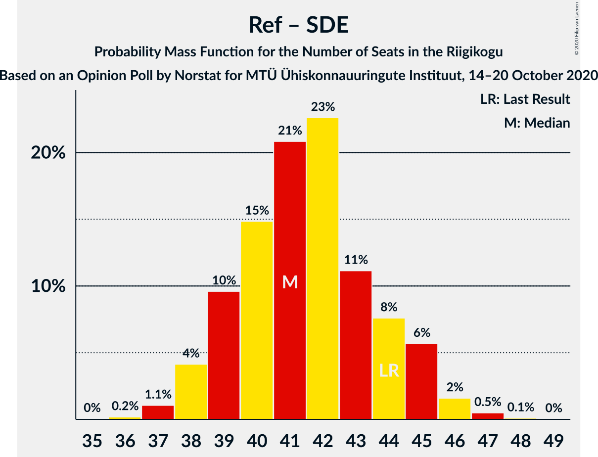

| Number of Seats | Probability | Accumulated | Special Marks |
|:---------------:|:-----------:|:-----------:|:-------------:|
| 35 | 0% | 100% |  |
| 36 | 0.2% | 99.9% |  |
| 37 | 1.1% | 99.8% |  |
| 38 | 4% | 98.7% |  |
| 39 | 10% | 95% |  |
| 40 | 15% | 85% |  |
| 41 | 21% | 70% |  |
| 42 | 23% | 49% | Median |
| 43 | 11% | 27% |  |
| 44 | 8% | 16% | Last Result |
| 45 | 6% | 8% |  |
| 46 | 2% | 2% |  |
| 47 | 0.5% | 0.6% |  |
| 48 | 0.1% | 0.1% |  |
| 49 | 0% | 0% |  |

### Eesti Keskerakond – Sotsiaaldemokraatlik Erakond – Erakond Isamaa

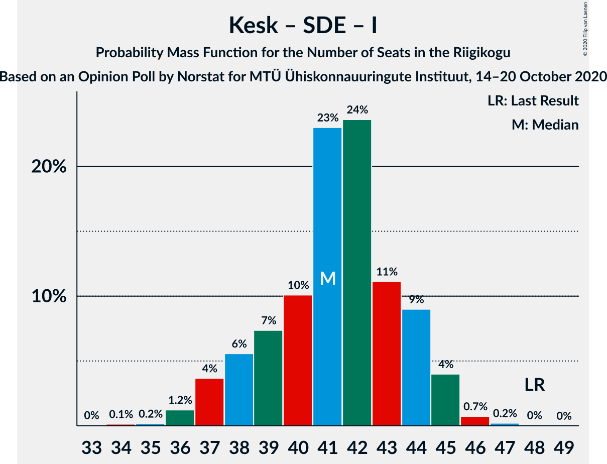

| Number of Seats | Probability | Accumulated | Special Marks |
|:---------------:|:-----------:|:-----------:|:-------------:|
| 33 | 0% | 100% |  |
| 34 | 0.1% | 99.9% |  |
| 35 | 0.2% | 99.8% |  |
| 36 | 1.2% | 99.6% |  |
| 37 | 4% | 98% |  |
| 38 | 6% | 95% |  |
| 39 | 7% | 89% |  |
| 40 | 10% | 82% |  |
| 41 | 23% | 72% | Median |
| 42 | 24% | 49% |  |
| 43 | 11% | 25% |  |
| 44 | 9% | 14% |  |
| 45 | 4% | 5% |  |
| 46 | 0.7% | 1.0% |  |
| 47 | 0.2% | 0.3% |  |
| 48 | 0% | 0.1% | Last Result |
| 49 | 0% | 0% |  |

### Eesti Reformierakond – Erakond Isamaa

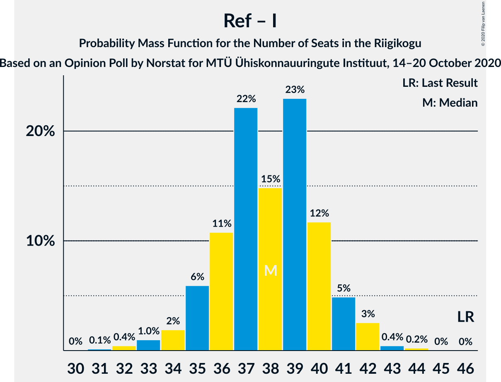

| Number of Seats | Probability | Accumulated | Special Marks |
|:---------------:|:-----------:|:-----------:|:-------------:|
| 30 | 0% | 100% |  |
| 31 | 0.1% | 99.9% |  |
| 32 | 0.4% | 99.8% |  |
| 33 | 1.0% | 99.4% |  |
| 34 | 2% | 98% |  |
| 35 | 6% | 96% |  |
| 36 | 11% | 91% |  |
| 37 | 22% | 80% |  |
| 38 | 15% | 58% | Median |
| 39 | 23% | 43% |  |
| 40 | 12% | 20% |  |
| 41 | 5% | 8% |  |
| 42 | 3% | 3% |  |
| 43 | 0.4% | 0.7% |  |
| 44 | 0.2% | 0.3% |  |
| 45 | 0% | 0% |  |
| 46 | 0% | 0% | Last Result |

### Eesti Keskerakond – Sotsiaaldemokraatlik Erakond

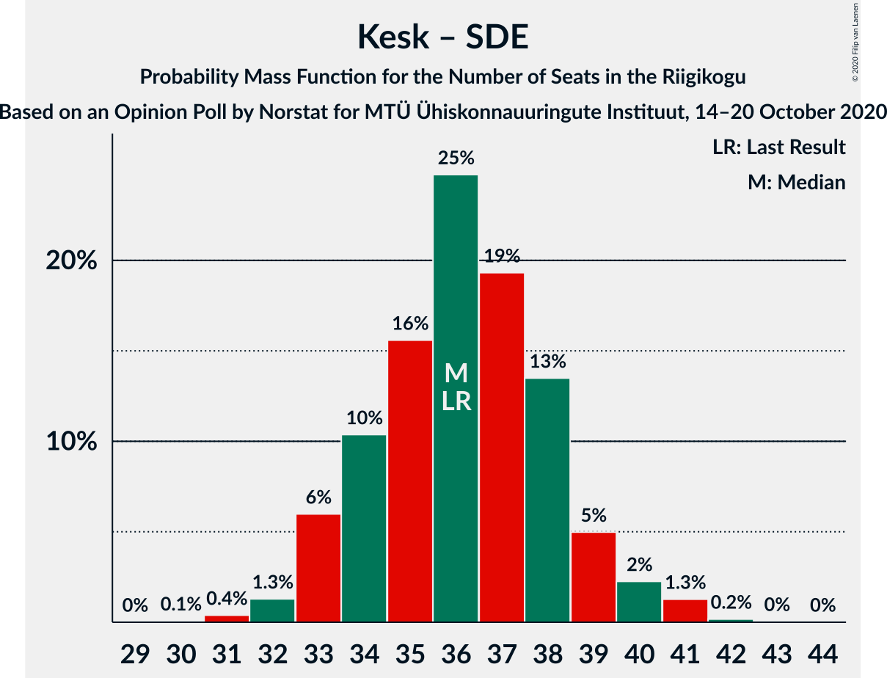

| Number of Seats | Probability | Accumulated | Special Marks |
|:---------------:|:-----------:|:-----------:|:-------------:|
| 30 | 0.1% | 100% |  |
| 31 | 0.4% | 99.9% |  |
| 32 | 1.3% | 99.5% |  |
| 33 | 6% | 98% |  |
| 34 | 10% | 92% |  |
| 35 | 16% | 82% |  |
| 36 | 25% | 66% | Last Result, Median |
| 37 | 19% | 42% |  |
| 38 | 13% | 22% |  |
| 39 | 5% | 9% |  |
| 40 | 2% | 4% |  |
| 41 | 1.3% | 2% |  |
| 42 | 0.2% | 0.2% |  |
| 43 | 0% | 0.1% |  |
| 44 | 0% | 0% |  |

### Eesti Konservatiivne Rahvaerakond – Sotsiaaldemokraatlik Erakond

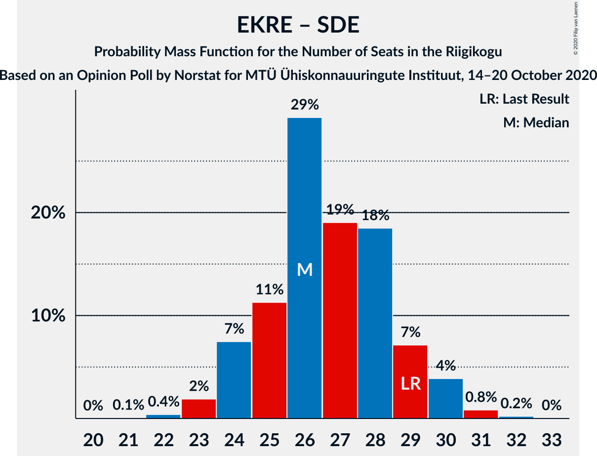

| Number of Seats | Probability | Accumulated | Special Marks |
|:---------------:|:-----------:|:-----------:|:-------------:|
| 21 | 0.1% | 100% |  |
| 22 | 0.4% | 99.9% |  |
| 23 | 2% | 99.5% |  |
| 24 | 7% | 98% |  |
| 25 | 11% | 90% |  |
| 26 | 29% | 79% |  |
| 27 | 19% | 50% | Median |
| 28 | 18% | 31% |  |
| 29 | 7% | 12% | Last Result |
| 30 | 4% | 5% |  |
| 31 | 0.8% | 1.1% |  |
| 32 | 0.2% | 0.3% |  |
| 33 | 0% | 0% |  |

## Technical Information

### Opinion Poll

+ **Polling firm:** Norstat
+ **Commissioner(s):** MTÜ Ühiskonnauuringute Instituut
+ **Fieldwork period:** 14–20 October 2020

### Calculations

+ **Sample size:** 1000
+ **Simulations done:** 1,048,576
+ **Error estimate:** 1.13%

