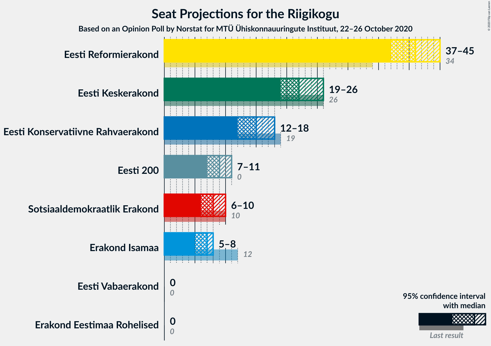
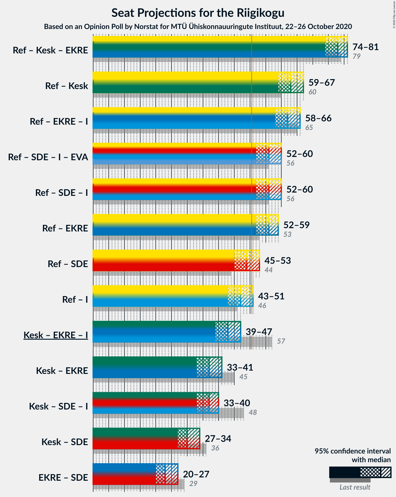
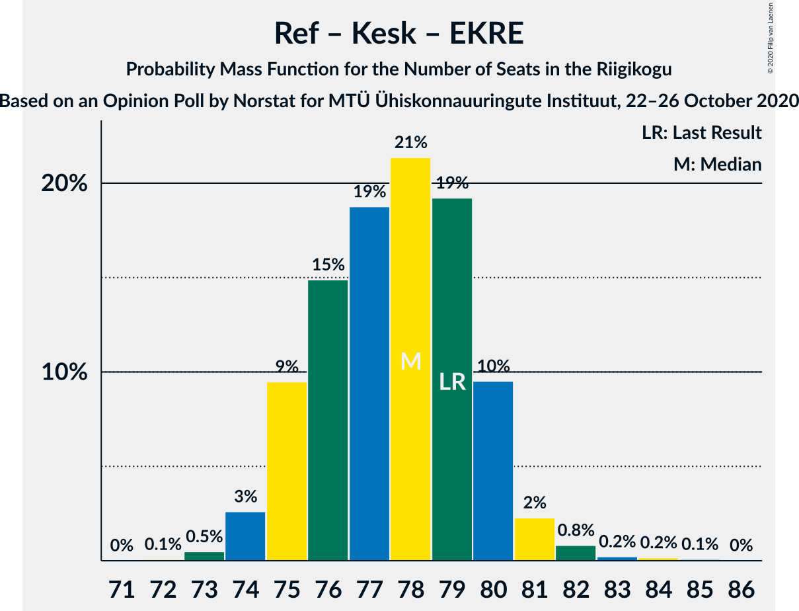
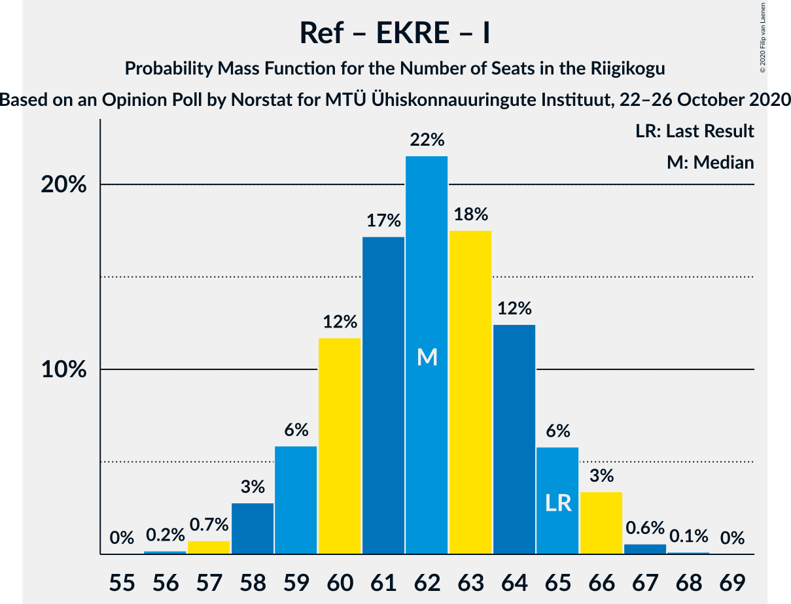
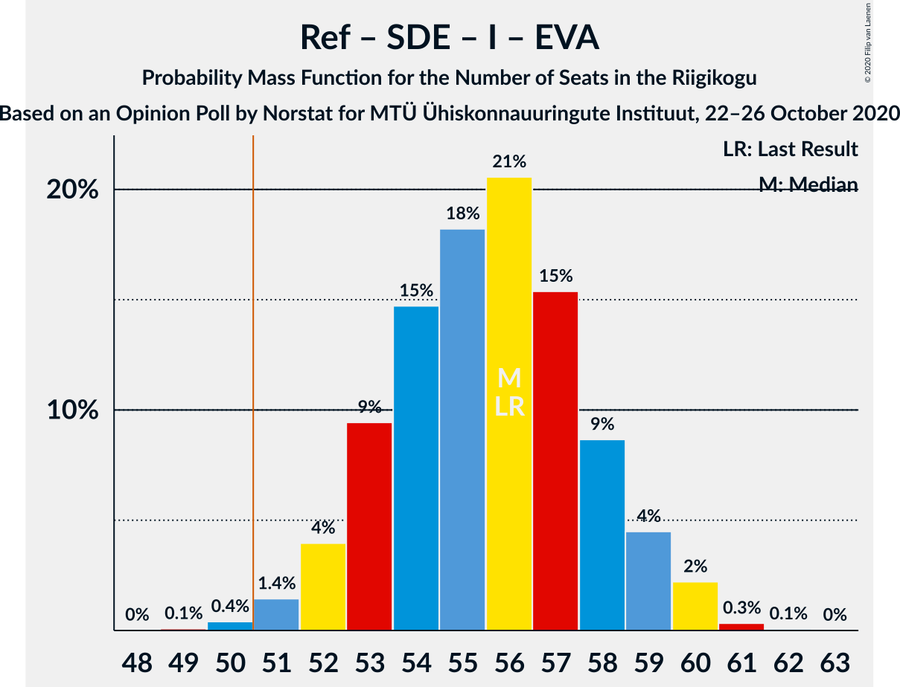

# Opinion Poll by Norstat for MTÜ Ühiskonnauuringute Instituut, 22–26 October 2020

<a href="#voting-intentions">Voting Intentions</a> | <a href="#seats">Seats</a> | <a href="#coalitions">Coalitions</a> | <a href="#technical-information">Technical Information</a>

## Voting Intentions

### Confidence Intervals

| Party | Last Result | Poll Result | 80% Confidence Interval | 90% Confidence Interval | 95% Confidence Interval | 99% Confidence Interval |
|:-----:|:-----------:|:-----------:|:-----------------------:|:-----------------------:|:-----------------------:|:-----------------------:|
| Eesti Reformierakond | 28.9% | 35.1% | 33.2–37.1% |32.7–37.6% |32.2–38.1% |31.3–39.1% |
| Eesti Keskerakond | 23.1% | 20.3% | 18.7–22.0% |18.3–22.5% |17.9–22.9% |17.2–23.7% |
| Eesti Konservatiivne Rahvaerakond | 17.8% | 14.2% | 12.9–15.7% |12.5–16.1% |12.2–16.5% |11.6–17.3% |
| Eesti 200 | 4.4% | 8.9% | 7.8–10.2% |7.5–10.5% |7.3–10.8% |6.8–11.5% |
| Sotsiaaldemokraatlik Erakond | 9.8% | 8.6% | 7.6–9.8% |7.3–10.2% |7.0–10.5% |6.5–11.1% |
| Erakond Isamaa | 11.4% | 6.9% | 6.0–8.0% |5.7–8.4% |5.5–8.6% |5.1–9.2% |
| Erakond Eestimaa Rohelised | 1.8% | 3.1% | 2.5–3.9% |2.3–4.2% |2.2–4.4% |1.9–4.8% |
| Eesti Vabaerakond | 1.2% | 0.6% | 0.4–1.1% |0.3–1.2% |0.3–1.3% |0.2–1.6% |

*Note:* The poll result column reflects the actual value used in the calculations. Published results may vary slightly, and in addition be rounded to fewer digits.

## Seats

### Confidence Intervals

| Party | Last Result | Median | 80% Confidence Interval | 90% Confidence Interval | 95% Confidence Interval | 99% Confidence Interval |
|:-----:|:-----------:|:------:|:-----------------------:|:-----------------------:|:-----------------------:|:-----------------------:|
| <a href="#eesti-reformierakond">Eesti Reformierakond</a> | 34 | 41 | 38–43 |38–44 |37–44 |36–46 |
| <a href="#eesti-keskerakond">Eesti Keskerakond</a> | 26 | 22 | 20–24 |19–25 |19–25 |18–26 |
| <a href="#eesti-konservatiivne-rahvaerakond">Eesti Konservatiivne Rahvaerakond</a> | 19 | 15 | 13–17 |13–17 |12–18 |12–19 |
| <a href="#eesti-200">Eesti 200</a> | 0 | 9 | 7–10 |7–10 |7–11 |6–11 |
| <a href="#sotsiaaldemokraatlik-erakond">Sotsiaaldemokraatlik Erakond</a> | 10 | 8 | 7–9 |7–10 |6–10 |6–11 |
| <a href="#erakond-isamaa">Erakond Isamaa</a> | 12 | 6 | 5–8 |5–8 |5–8 |5–9 |
| <a href="#erakond-eestimaa-rohelised">Erakond Eestimaa Rohelised</a> | 0 | 0 | 0 |0 |0 |0 |
| <a href="#eesti-vabaerakond">Eesti Vabaerakond</a> | 0 | 0 | 0 |0 |0 |0 |

### Eesti Reformierakond

*For a full overview of the results for this party, see the [Eesti Reformierakond](party-eestireformierakond.html) page.*

| Number of Seats | Probability | Accumulated | Special Marks |
|:---------------:|:-----------:|:-----------:|:-------------:|
| 34 | 0% | 100% | Last Result |
| 35 | 0.1% | 100% |  |
| 36 | 1.0% | 99.9% |  |
| 37 | 2% | 98.9% |  |
| 38 | 11% | 97% |  |
| 39 | 8% | 86% |  |
| 40 | 14% | 79% |  |
| 41 | 29% | 65% | Median |
| 42 | 19% | 36% |  |
| 43 | 12% | 17% |  |
| 44 | 4% | 6% |  |
| 45 | 1.5% | 2% |  |
| 46 | 0.3% | 0.6% |  |
| 47 | 0.2% | 0.3% |  |
| 48 | 0% | 0% |  |

### Eesti Keskerakond

*For a full overview of the results for this party, see the [Eesti Keskerakond](party-eestikeskerakond.html) page.*

| Number of Seats | Probability | Accumulated | Special Marks |
|:---------------:|:-----------:|:-----------:|:-------------:|
| 17 | 0.1% | 100% |  |
| 18 | 2% | 99.9% |  |
| 19 | 5% | 98% |  |
| 20 | 8% | 93% |  |
| 21 | 18% | 85% |  |
| 22 | 31% | 67% | Median |
| 23 | 10% | 37% |  |
| 24 | 19% | 27% |  |
| 25 | 6% | 9% |  |
| 26 | 2% | 2% | Last Result |
| 27 | 0.3% | 0.3% |  |
| 28 | 0.1% | 0.1% |  |
| 29 | 0% | 0% |  |

### Eesti Konservatiivne Rahvaerakond

*For a full overview of the results for this party, see the [Eesti Konservatiivne Rahvaerakond](party-eestikonservatiivnerahvaerakond.html) page.*

| Number of Seats | Probability | Accumulated | Special Marks |
|:---------------:|:-----------:|:-----------:|:-------------:|
| 11 | 0.3% | 100% |  |
| 12 | 4% | 99.7% |  |
| 13 | 10% | 95% |  |
| 14 | 34% | 85% |  |
| 15 | 22% | 51% | Median |
| 16 | 18% | 29% |  |
| 17 | 7% | 10% |  |
| 18 | 3% | 3% |  |
| 19 | 0.5% | 0.6% | Last Result |
| 20 | 0.1% | 0.1% |  |
| 21 | 0% | 0% |  |

### Eesti 200

*For a full overview of the results for this party, see the [Eesti 200](party-eesti200.html) page.*

| Number of Seats | Probability | Accumulated | Special Marks |
|:---------------:|:-----------:|:-----------:|:-------------:|
| 0 | 0% | 100% | Last Result |
| 1 | 0% | 100% |  |
| 2 | 0% | 100% |  |
| 3 | 0% | 100% |  |
| 4 | 0% | 100% |  |
| 5 | 0% | 100% |  |
| 6 | 1.4% | 100% |  |
| 7 | 14% | 98.6% |  |
| 8 | 26% | 85% |  |
| 9 | 42% | 59% | Median |
| 10 | 12% | 17% |  |
| 11 | 4% | 5% |  |
| 12 | 0.2% | 0.3% |  |
| 13 | 0.1% | 0.1% |  |
| 14 | 0% | 0% |  |

### Sotsiaaldemokraatlik Erakond

*For a full overview of the results for this party, see the [Sotsiaaldemokraatlik Erakond](party-sotsiaaldemokraatlikerakond.html) page.*

| Number of Seats | Probability | Accumulated | Special Marks |
|:---------------:|:-----------:|:-----------:|:-------------:|
| 5 | 0.1% | 100% |  |
| 6 | 3% | 99.9% |  |
| 7 | 17% | 97% |  |
| 8 | 40% | 80% | Median |
| 9 | 30% | 40% |  |
| 10 | 8% | 10% | Last Result |
| 11 | 2% | 2% |  |
| 12 | 0.2% | 0.2% |  |
| 13 | 0% | 0% |  |

### Erakond Isamaa

*For a full overview of the results for this party, see the [Erakond Isamaa](party-erakondisamaa.html) page.*

| Number of Seats | Probability | Accumulated | Special Marks |
|:---------------:|:-----------:|:-----------:|:-------------:|
| 0 | 0.2% | 100% |  |
| 1 | 0% | 99.8% |  |
| 2 | 0% | 99.8% |  |
| 3 | 0% | 99.8% |  |
| 4 | 0.1% | 99.8% |  |
| 5 | 32% | 99.7% |  |
| 6 | 30% | 68% | Median |
| 7 | 20% | 38% |  |
| 8 | 17% | 18% |  |
| 9 | 0.9% | 1.0% |  |
| 10 | 0.1% | 0.1% |  |
| 11 | 0% | 0% |  |
| 12 | 0% | 0% | Last Result |

### Erakond Eestimaa Rohelised

*For a full overview of the results for this party, see the [Erakond Eestimaa Rohelised](party-erakondeestimaarohelised.html) page.*

| Number of Seats | Probability | Accumulated | Special Marks |
|:---------------:|:-----------:|:-----------:|:-------------:|
| 0 | 99.6% | 100% | Last Result, Median |
| 1 | 0% | 0.4% |  |
| 2 | 0% | 0.4% |  |
| 3 | 0% | 0.4% |  |
| 4 | 0.4% | 0.4% |  |
| 5 | 0% | 0% |  |

### Eesti Vabaerakond

*For a full overview of the results for this party, see the [Eesti Vabaerakond](party-eestivabaerakond.html) page.*

| Number of Seats | Probability | Accumulated | Special Marks |
|:---------------:|:-----------:|:-----------:|:-------------:|
| 0 | 100% | 100% | Last Result, Median |

## Coalitions

### Confidence Intervals

| Coalition | Last Result | Median | Majority? | 80% Confidence Interval | 90% Confidence Interval | 95% Confidence Interval | 99% Confidence Interval |
|:---------:|:-----------:|:------:|:---------:|:-----------------------:|:-----------------------:|:-----------------------:|:-----------------------:|
| Eesti Reformierakond – Eesti Keskerakond – Eesti Konservatiivne Rahvaerakond | 79 | 78 | 100% | 75–80 | 75–80 | 75–81 | 73–82 |
| Eesti Reformierakond – Eesti Keskerakond | 60 | 63 | 100% | 60–66 | 59–66 | 59–67 | 58–67 |
| Eesti Reformierakond – Eesti Konservatiivne Rahvaerakond – Erakond Isamaa | 65 | 62 | 100% | 59–64 | 59–66 | 58–66 | 57–66 |
| Eesti Reformierakond – Eesti Konservatiivne Rahvaerakond | 53 | 56 | 99.5% | 53–58 | 53–59 | 52–60 | 51–60 |
| Eesti Reformierakond – Sotsiaaldemokraatlik Erakond – Erakond Isamaa – Eesti Vabaerakond | 56 | 56 | 99.6% | 53–58 | 52–59 | 52–59 | 51–60 |
| Eesti Reformierakond – Sotsiaaldemokraatlik Erakond – Erakond Isamaa | 56 | 56 | 99.6% | 53–58 | 52–59 | 52–59 | 51–60 |
| Eesti Reformierakond – Sotsiaaldemokraatlik Erakond | 44 | 49 | 22% | 47–51 | 46–52 | 45–53 | 44–54 |
| Eesti Reformierakond – Erakond Isamaa | 46 | 47 | 3% | 45–49 | 44–50 | 43–51 | 43–52 |
| Eesti Keskerakond – Eesti Konservatiivne Rahvaerakond – Erakond Isamaa | 57 | 43 | 0% | 41–45 | 40–46 | 40–47 | 38–48 |
| Eesti Keskerakond – Sotsiaaldemokraatlik Erakond – Erakond Isamaa | 48 | 36 | 0% | 35–39 | 34–40 | 33–41 | 32–42 |
| Eesti Keskerakond – Eesti Konservatiivne Rahvaerakond | 45 | 37 | 0% | 35–39 | 34–40 | 33–40 | 32–41 |
| Eesti Keskerakond – Sotsiaaldemokraatlik Erakond | 36 | 30 | 0% | 28–33 | 27–33 | 27–34 | 25–35 |
| Eesti Konservatiivne Rahvaerakond – Sotsiaaldemokraatlik Erakond | 29 | 23 | 0% | 21–25 | 20–26 | 20–26 | 19–27 |

### Eesti Reformierakond – Eesti Keskerakond – Eesti Konservatiivne Rahvaerakond

| Number of Seats | Probability | Accumulated | Special Marks |
|:---------------:|:-----------:|:-----------:|:-------------:|
| 72 | 0.1% | 100% |  |
| 73 | 0.4% | 99.8% |  |
| 74 | 2% | 99.5% |  |
| 75 | 14% | 98% |  |
| 76 | 9% | 84% |  |
| 77 | 10% | 75% |  |
| 78 | 27% | 65% | Median |
| 79 | 21% | 38% | Last Result |
| 80 | 13% | 17% |  |
| 81 | 2% | 3% |  |
| 82 | 1.3% | 2% |  |
| 83 | 0.1% | 0.2% |  |
| 84 | 0% | 0.1% |  |
| 85 | 0% | 0.1% |  |
| 86 | 0% | 0% |  |

### Eesti Reformierakond – Eesti Keskerakond

| Number of Seats | Probability | Accumulated | Special Marks |
|:---------------:|:-----------:|:-----------:|:-------------:|
| 57 | 0.1% | 100% |  |
| 58 | 0.5% | 99.9% |  |
| 59 | 6% | 99.4% |  |
| 60 | 11% | 94% | Last Result |
| 61 | 8% | 83% |  |
| 62 | 15% | 75% |  |
| 63 | 12% | 60% | Median |
| 64 | 16% | 48% |  |
| 65 | 21% | 33% |  |
| 66 | 9% | 12% |  |
| 67 | 3% | 3% |  |
| 68 | 0.3% | 0.4% |  |
| 69 | 0.1% | 0.2% |  |
| 70 | 0% | 0% |  |

### Eesti Reformierakond – Eesti Konservatiivne Rahvaerakond – Erakond Isamaa

| Number of Seats | Probability | Accumulated | Special Marks |
|:---------------:|:-----------:|:-----------:|:-------------:|
| 56 | 0.1% | 100% |  |
| 57 | 0.7% | 99.9% |  |
| 58 | 3% | 99.2% |  |
| 59 | 7% | 96% |  |
| 60 | 9% | 89% |  |
| 61 | 18% | 81% |  |
| 62 | 33% | 62% | Median |
| 63 | 15% | 30% |  |
| 64 | 7% | 15% |  |
| 65 | 3% | 8% | Last Result |
| 66 | 5% | 5% |  |
| 67 | 0.3% | 0.4% |  |
| 68 | 0% | 0.1% |  |
| 69 | 0% | 0% |  |

### Eesti Reformierakond – Eesti Konservatiivne Rahvaerakond

| Number of Seats | Probability | Accumulated | Special Marks |
|:---------------:|:-----------:|:-----------:|:-------------:|
| 49 | 0.1% | 100% |  |
| 50 | 0.4% | 99.9% |  |
| 51 | 1.0% | 99.5% | Majority |
| 52 | 3% | 98.5% |  |
| 53 | 10% | 96% | Last Result |
| 54 | 14% | 86% |  |
| 55 | 19% | 72% |  |
| 56 | 19% | 53% | Median |
| 57 | 21% | 34% |  |
| 58 | 6% | 13% |  |
| 59 | 3% | 6% |  |
| 60 | 3% | 3% |  |
| 61 | 0.1% | 0.3% |  |
| 62 | 0.1% | 0.2% |  |
| 63 | 0% | 0% |  |

### Eesti Reformierakond – Sotsiaaldemokraatlik Erakond – Erakond Isamaa – Eesti Vabaerakond

| Number of Seats | Probability | Accumulated | Special Marks |
|:---------------:|:-----------:|:-----------:|:-------------:|
| 49 | 0% | 100% |  |
| 50 | 0.3% | 99.9% |  |
| 51 | 2% | 99.6% | Majority |
| 52 | 4% | 98% |  |
| 53 | 7% | 94% |  |
| 54 | 17% | 87% |  |
| 55 | 17% | 70% | Median |
| 56 | 34% | 53% | Last Result |
| 57 | 5% | 19% |  |
| 58 | 9% | 14% |  |
| 59 | 4% | 5% |  |
| 60 | 0.7% | 1.1% |  |
| 61 | 0.2% | 0.3% |  |
| 62 | 0.1% | 0.1% |  |
| 63 | 0% | 0% |  |

### Eesti Reformierakond – Sotsiaaldemokraatlik Erakond – Erakond Isamaa

| Number of Seats | Probability | Accumulated | Special Marks |
|:---------------:|:-----------:|:-----------:|:-------------:|
| 49 | 0% | 100% |  |
| 50 | 0.3% | 99.9% |  |
| 51 | 2% | 99.6% | Majority |
| 52 | 4% | 98% |  |
| 53 | 7% | 94% |  |
| 54 | 17% | 87% |  |
| 55 | 17% | 70% | Median |
| 56 | 34% | 53% | Last Result |
| 57 | 5% | 19% |  |
| 58 | 9% | 14% |  |
| 59 | 4% | 5% |  |
| 60 | 0.7% | 1.1% |  |
| 61 | 0.2% | 0.3% |  |
| 62 | 0.1% | 0.1% |  |
| 63 | 0% | 0% |  |

### Eesti Reformierakond – Sotsiaaldemokraatlik Erakond

| Number of Seats | Probability | Accumulated | Special Marks |
|:---------------:|:-----------:|:-----------:|:-------------:|
| 43 | 0.3% | 100% |  |
| 44 | 0.3% | 99.7% | Last Result |
| 45 | 2% | 99.4% |  |
| 46 | 3% | 97% |  |
| 47 | 12% | 94% |  |
| 48 | 19% | 82% |  |
| 49 | 18% | 63% | Median |
| 50 | 23% | 45% |  |
| 51 | 13% | 22% | Majority |
| 52 | 5% | 9% |  |
| 53 | 3% | 4% |  |
| 54 | 0.3% | 0.8% |  |
| 55 | 0.4% | 0.4% |  |
| 56 | 0.1% | 0.1% |  |
| 57 | 0% | 0% |  |

### Eesti Reformierakond – Erakond Isamaa

| Number of Seats | Probability | Accumulated | Special Marks |
|:---------------:|:-----------:|:-----------:|:-------------:|
| 41 | 0% | 100% |  |
| 42 | 0.3% | 99.9% |  |
| 43 | 2% | 99.6% |  |
| 44 | 4% | 97% |  |
| 45 | 13% | 93% |  |
| 46 | 14% | 80% | Last Result |
| 47 | 17% | 66% | Median |
| 48 | 32% | 48% |  |
| 49 | 10% | 17% |  |
| 50 | 3% | 6% |  |
| 51 | 2% | 3% | Majority |
| 52 | 0.9% | 1.3% |  |
| 53 | 0.3% | 0.4% |  |
| 54 | 0.1% | 0.1% |  |
| 55 | 0% | 0% |  |

### Eesti Keskerakond – Eesti Konservatiivne Rahvaerakond – Erakond Isamaa

| Number of Seats | Probability | Accumulated | Special Marks |
|:---------------:|:-----------:|:-----------:|:-------------:|
| 37 | 0.1% | 100% |  |
| 38 | 0.4% | 99.8% |  |
| 39 | 1.3% | 99.5% |  |
| 40 | 3% | 98% |  |
| 41 | 16% | 95% |  |
| 42 | 17% | 79% |  |
| 43 | 19% | 62% | Median |
| 44 | 14% | 42% |  |
| 45 | 19% | 29% |  |
| 46 | 6% | 10% |  |
| 47 | 2% | 3% |  |
| 48 | 0.6% | 1.0% |  |
| 49 | 0.4% | 0.4% |  |
| 50 | 0% | 0% |  |
| 51 | 0% | 0% | Majority |
| 52 | 0% | 0% |  |
| 53 | 0% | 0% |  |
| 54 | 0% | 0% |  |
| 55 | 0% | 0% |  |
| 56 | 0% | 0% |  |
| 57 | 0% | 0% | Last Result |

### Eesti Keskerakond – Sotsiaaldemokraatlik Erakond – Erakond Isamaa

| Number of Seats | Probability | Accumulated | Special Marks |
|:---------------:|:-----------:|:-----------:|:-------------:|
| 30 | 0% | 100% |  |
| 31 | 0.1% | 99.9% |  |
| 32 | 0.9% | 99.8% |  |
| 33 | 3% | 99.0% |  |
| 34 | 5% | 96% |  |
| 35 | 18% | 91% |  |
| 36 | 25% | 73% | Median |
| 37 | 11% | 48% |  |
| 38 | 16% | 36% |  |
| 39 | 13% | 20% |  |
| 40 | 4% | 7% |  |
| 41 | 2% | 3% |  |
| 42 | 0.8% | 1.0% |  |
| 43 | 0.1% | 0.2% |  |
| 44 | 0% | 0% |  |
| 45 | 0% | 0% |  |
| 46 | 0% | 0% |  |
| 47 | 0% | 0% |  |
| 48 | 0% | 0% | Last Result |

### Eesti Keskerakond – Eesti Konservatiivne Rahvaerakond

| Number of Seats | Probability | Accumulated | Special Marks |
|:---------------:|:-----------:|:-----------:|:-------------:|
| 31 | 0.2% | 100% |  |
| 32 | 0.4% | 99.7% |  |
| 33 | 2% | 99.3% |  |
| 34 | 7% | 97% |  |
| 35 | 7% | 90% |  |
| 36 | 25% | 83% |  |
| 37 | 18% | 58% | Median |
| 38 | 24% | 40% |  |
| 39 | 10% | 16% |  |
| 40 | 5% | 6% |  |
| 41 | 2% | 2% |  |
| 42 | 0.3% | 0.4% |  |
| 43 | 0.1% | 0.1% |  |
| 44 | 0% | 0% |  |
| 45 | 0% | 0% | Last Result |

### Eesti Keskerakond – Sotsiaaldemokraatlik Erakond

| Number of Seats | Probability | Accumulated | Special Marks |
|:---------------:|:-----------:|:-----------:|:-------------:|
| 25 | 0.7% | 100% |  |
| 26 | 0.5% | 99.3% |  |
| 27 | 5% | 98.8% |  |
| 28 | 5% | 93% |  |
| 29 | 10% | 89% |  |
| 30 | 33% | 78% | Median |
| 31 | 19% | 45% |  |
| 32 | 12% | 26% |  |
| 33 | 11% | 14% |  |
| 34 | 1.5% | 3% |  |
| 35 | 1.2% | 1.4% |  |
| 36 | 0.2% | 0.3% | Last Result |
| 37 | 0% | 0% |  |

### Eesti Konservatiivne Rahvaerakond – Sotsiaaldemokraatlik Erakond

| Number of Seats | Probability | Accumulated | Special Marks |
|:---------------:|:-----------:|:-----------:|:-------------:|
| 18 | 0.1% | 100% |  |
| 19 | 0.9% | 99.9% |  |
| 20 | 4% | 99.0% |  |
| 21 | 8% | 95% |  |
| 22 | 33% | 86% |  |
| 23 | 16% | 53% | Median |
| 24 | 16% | 38% |  |
| 25 | 16% | 22% |  |
| 26 | 5% | 7% |  |
| 27 | 2% | 2% |  |
| 28 | 0.4% | 0.4% |  |
| 29 | 0% | 0% | Last Result |

## Technical Information

### Opinion Poll

+ **Polling firm:** Norstat
+ **Commissioner(s):** MTÜ Ühiskonnauuringute Instituut
+ **Fieldwork period:** 22–26 October 2020

### Calculations

+ **Sample size:** 1000
+ **Simulations done:** 131,072
+ **Error estimate:** 0.88%

