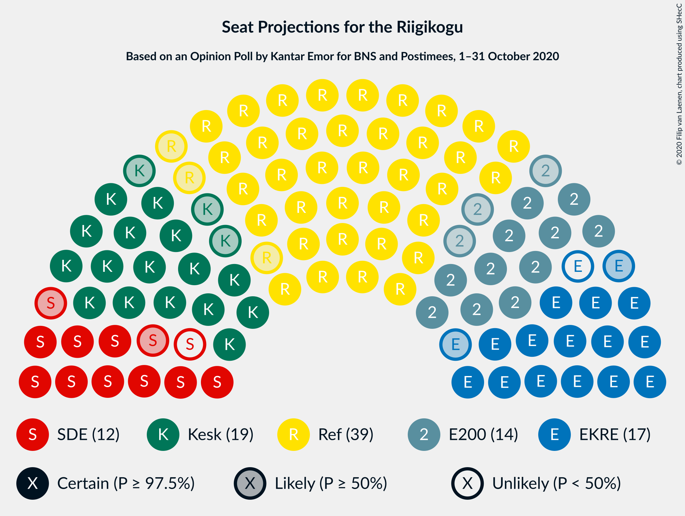
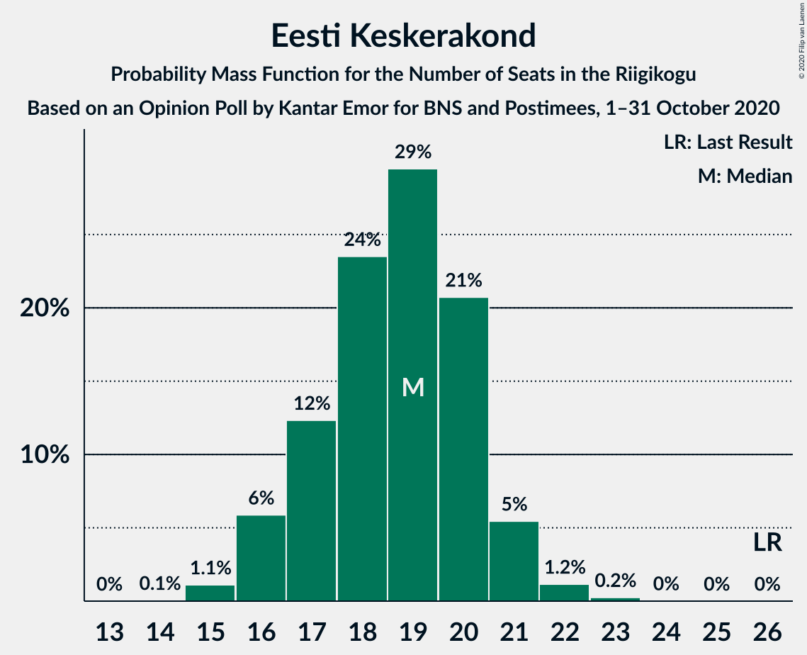
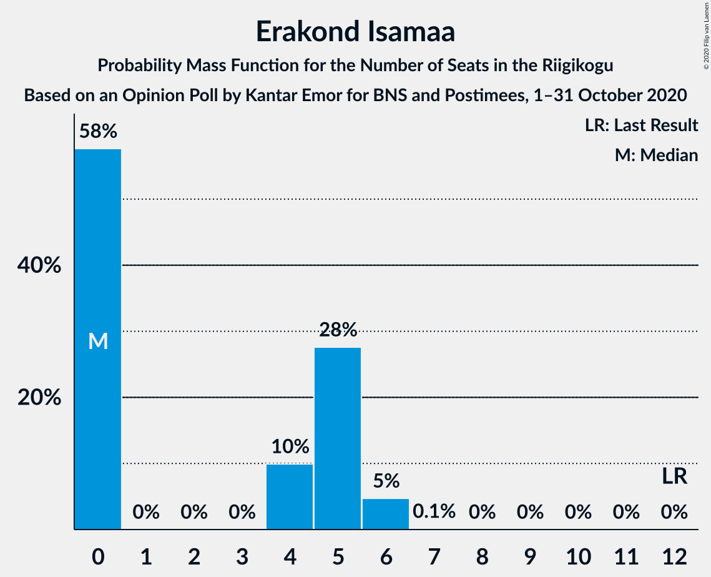
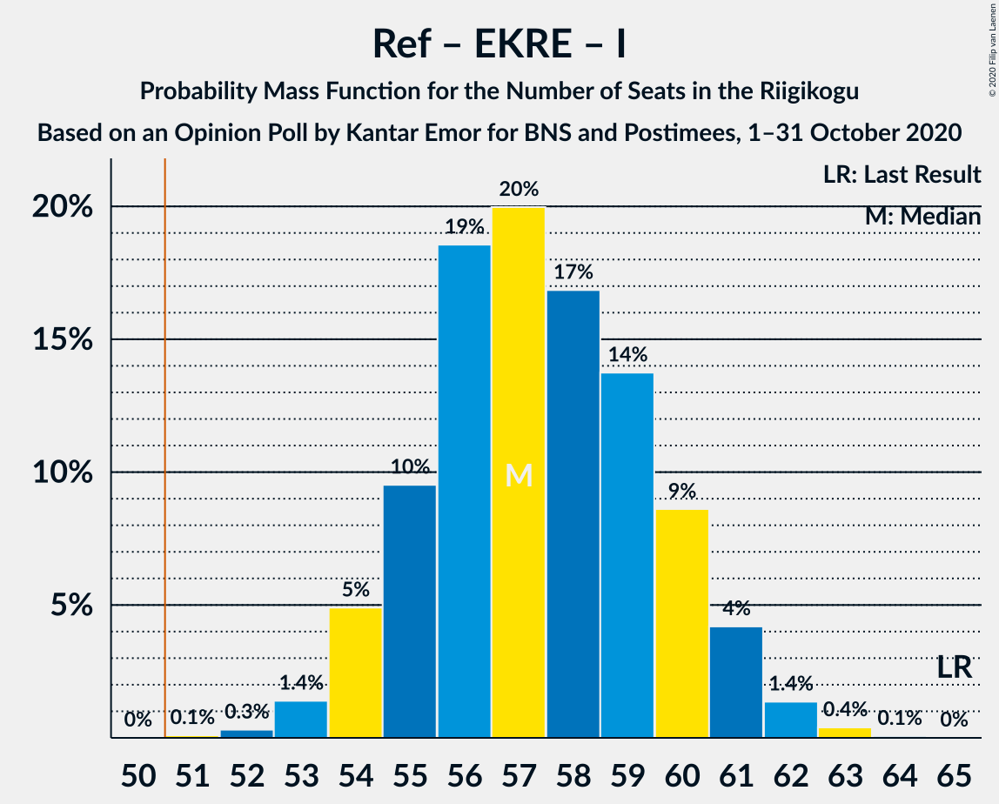
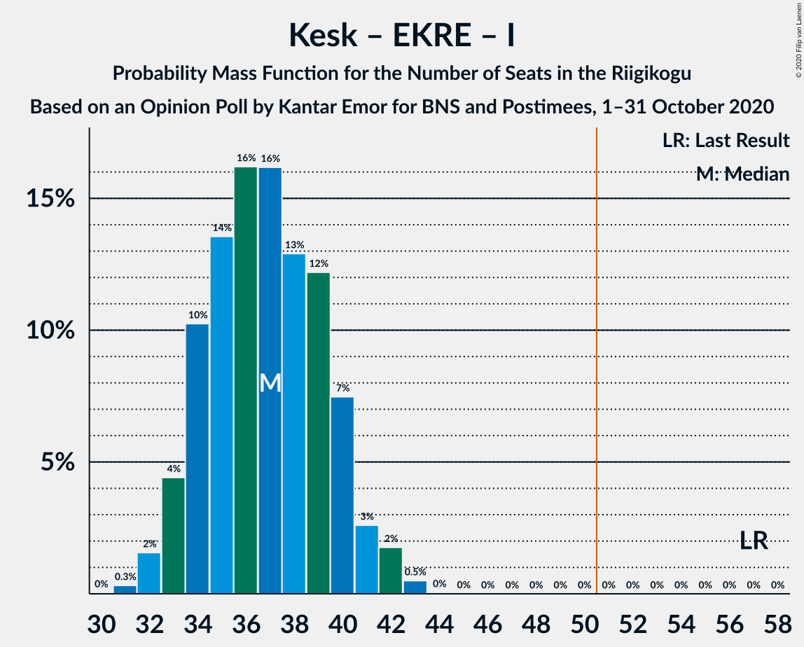
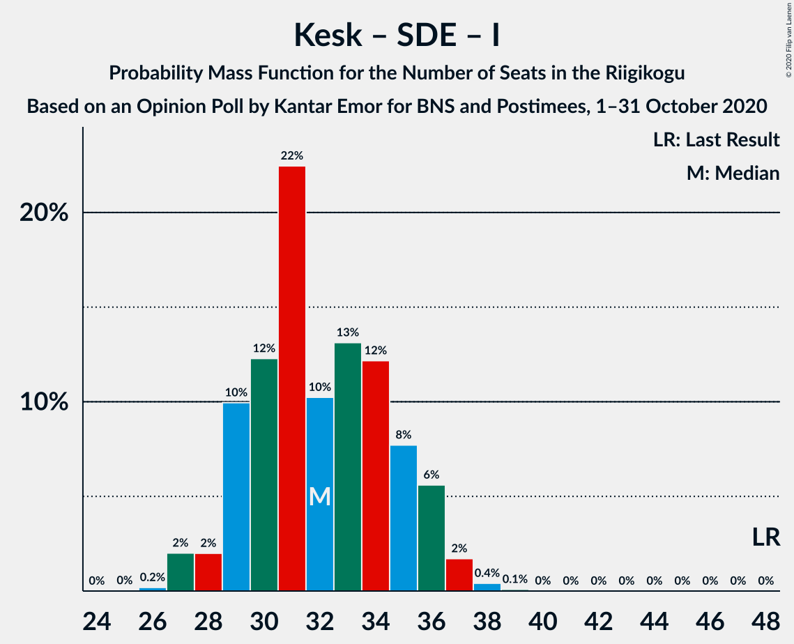

# Opinion Poll by Kantar Emor for BNS and Postimees, 1–31 October 2020

<a href="#voting-intentions">Voting Intentions</a> | <a href="#seats">Seats</a> | <a href="#coalitions">Coalitions</a> | <a href="#technical-information">Technical Information</a>

## Voting Intentions

### Confidence Intervals

| Party | Last Result | Poll Result | 80% Confidence Interval | 90% Confidence Interval | 95% Confidence Interval | 99% Confidence Interval |
|:-----:|:-----------:|:-----------:|:-----------------------:|:-----------------------:|:-----------------------:|:-----------------------:|
| Eesti Reformierakond | 28.9% | 33.0% | 31.3–34.7% |30.8–35.2% |30.4–35.6% |29.6–36.4% |
| Eesti Keskerakond | 23.1% | 17.0% | 15.7–18.5% |15.4–18.9% |15.1–19.2% |14.5–19.9% |
| Eesti Konservatiivne Rahvaerakond | 17.8% | 15.0% | 13.8–16.3% |13.4–16.7% |13.1–17.1% |12.6–17.7% |
| Eesti 200 | 4.4% | 13.0% | 11.9–14.3% |11.5–14.7% |11.3–15.0% |10.7–15.6% |
| Sotsiaaldemokraatlik Erakond | 9.8% | 11.0% | 9.9–12.2% |9.6–12.5% |9.4–12.8% |8.9–13.4% |
| Erakond Isamaa | 11.4% | 5.0% | 4.3–5.9% |4.1–6.1% |3.9–6.3% |3.6–6.8% |
| Erakond Eestimaa Rohelised | 1.8% | 3.0% | 2.5–3.7% |2.3–3.9% |2.2–4.1% |2.0–4.5% |
| Eesti Vabaerakond | 1.2% | 2.0% | 1.6–2.6% |1.4–2.7% |1.3–2.9% |1.2–3.2% |

*Note:* The poll result column reflects the actual value used in the calculations. Published results may vary slightly, and in addition be rounded to fewer digits.

## Seats

### Confidence Intervals

| Party | Last Result | Median | 80% Confidence Interval | 90% Confidence Interval | 95% Confidence Interval | 99% Confidence Interval |
|:-----:|:-----------:|:------:|:-----------------------:|:-----------------------:|:-----------------------:|:-----------------------:|
| <a href="#eesti-reformierakond">Eesti Reformierakond</a> | 34 | 39 | 37–42 |36–43 |36–43 |34–44 |
| <a href="#eesti-keskerakond">Eesti Keskerakond</a> | 26 | 19 | 17–20 |16–21 |16–21 |15–22 |
| <a href="#eesti-konservatiivne-rahvaerakond">Eesti Konservatiivne Rahvaerakond</a> | 19 | 16 | 14–17 |14–18 |14–19 |13–19 |
| <a href="#eesti-200">Eesti 200</a> | 0 | 14 | 12–15 |12–16 |11–16 |11–17 |
| <a href="#sotsiaaldemokraatlik-erakond">Sotsiaaldemokraatlik Erakond</a> | 10 | 11 | 10–13 |10–13 |9–13 |9–14 |
| <a href="#erakond-isamaa">Erakond Isamaa</a> | 12 | 0 | 0–5 |0–5 |0–6 |0–6 |
| <a href="#erakond-eestimaa-rohelised">Erakond Eestimaa Rohelised</a> | 0 | 0 | 0 |0 |0 |0 |
| <a href="#eesti-vabaerakond">Eesti Vabaerakond</a> | 0 | 0 | 0 |0 |0 |0 |

### Eesti Reformierakond

*For a full overview of the results for this party, see the [Eesti Reformierakond](party-eestireformierakond.html) page.*

| Number of Seats | Probability | Accumulated | Special Marks |
|:---------------:|:-----------:|:-----------:|:-------------:|
| 33 | 0.1% | 100% |  |
| 34 | 0.5% | 99.9% | Last Result |
| 35 | 2% | 99.4% |  |
| 36 | 4% | 98% |  |
| 37 | 11% | 93% |  |
| 38 | 19% | 83% |  |
| 39 | 22% | 64% | Median |
| 40 | 17% | 42% |  |
| 41 | 13% | 25% |  |
| 42 | 6% | 11% |  |
| 43 | 4% | 5% |  |
| 44 | 1.0% | 1.2% |  |
| 45 | 0.2% | 0.3% |  |
| 46 | 0% | 0% |  |

### Eesti Keskerakond

*For a full overview of the results for this party, see the [Eesti Keskerakond](party-eestikeskerakond.html) page.*

| Number of Seats | Probability | Accumulated | Special Marks |
|:---------------:|:-----------:|:-----------:|:-------------:|
| 14 | 0.1% | 100% |  |
| 15 | 1.1% | 99.9% |  |
| 16 | 6% | 98.8% |  |
| 17 | 12% | 93% |  |
| 18 | 24% | 81% |  |
| 19 | 29% | 57% | Median |
| 20 | 21% | 28% |  |
| 21 | 5% | 7% |  |
| 22 | 1.2% | 1.4% |  |
| 23 | 0.2% | 0.3% |  |
| 24 | 0% | 0% |  |
| 25 | 0% | 0% |  |
| 26 | 0% | 0% | Last Result |

### Eesti Konservatiivne Rahvaerakond

*For a full overview of the results for this party, see the [Eesti Konservatiivne Rahvaerakond](party-eestikonservatiivnerahvaerakond.html) page.*

| Number of Seats | Probability | Accumulated | Special Marks |
|:---------------:|:-----------:|:-----------:|:-------------:|
| 12 | 0.1% | 100% |  |
| 13 | 2% | 99.9% |  |
| 14 | 8% | 98% |  |
| 15 | 24% | 90% |  |
| 16 | 24% | 66% | Median |
| 17 | 33% | 42% |  |
| 18 | 5% | 9% |  |
| 19 | 4% | 4% | Last Result |
| 20 | 0.3% | 0.3% |  |
| 21 | 0.1% | 0.1% |  |
| 22 | 0% | 0% |  |

### Eesti 200

*For a full overview of the results for this party, see the [Eesti 200](party-eesti200.html) page.*

| Number of Seats | Probability | Accumulated | Special Marks |
|:---------------:|:-----------:|:-----------:|:-------------:|
| 0 | 0% | 100% | Last Result |
| 1 | 0% | 100% |  |
| 2 | 0% | 100% |  |
| 3 | 0% | 100% |  |
| 4 | 0% | 100% |  |
| 5 | 0% | 100% |  |
| 6 | 0% | 100% |  |
| 7 | 0% | 100% |  |
| 8 | 0% | 100% |  |
| 9 | 0% | 100% |  |
| 10 | 0.2% | 100% |  |
| 11 | 3% | 99.8% |  |
| 12 | 14% | 97% |  |
| 13 | 28% | 84% |  |
| 14 | 29% | 56% | Median |
| 15 | 20% | 27% |  |
| 16 | 6% | 7% |  |
| 17 | 0.7% | 0.9% |  |
| 18 | 0.2% | 0.2% |  |
| 19 | 0% | 0% |  |

### Sotsiaaldemokraatlik Erakond

*For a full overview of the results for this party, see the [Sotsiaaldemokraatlik Erakond](party-sotsiaaldemokraatlikerakond.html) page.*

| Number of Seats | Probability | Accumulated | Special Marks |
|:---------------:|:-----------:|:-----------:|:-------------:|
| 8 | 0.3% | 100% |  |
| 9 | 4% | 99.7% |  |
| 10 | 18% | 95% | Last Result |
| 11 | 36% | 77% | Median |
| 12 | 29% | 40% |  |
| 13 | 9% | 11% |  |
| 14 | 2% | 2% |  |
| 15 | 0.2% | 0.2% |  |
| 16 | 0% | 0% |  |

### Erakond Isamaa

*For a full overview of the results for this party, see the [Erakond Isamaa](party-erakondisamaa.html) page.*

| Number of Seats | Probability | Accumulated | Special Marks |
|:---------------:|:-----------:|:-----------:|:-------------:|
| 0 | 58% | 100% | Median |
| 1 | 0% | 42% |  |
| 2 | 0% | 42% |  |
| 3 | 0% | 42% |  |
| 4 | 10% | 42% |  |
| 5 | 28% | 32% |  |
| 6 | 5% | 5% |  |
| 7 | 0.1% | 0.1% |  |
| 8 | 0% | 0% |  |
| 9 | 0% | 0% |  |
| 10 | 0% | 0% |  |
| 11 | 0% | 0% |  |
| 12 | 0% | 0% | Last Result |

### Erakond Eestimaa Rohelised

*For a full overview of the results for this party, see the [Erakond Eestimaa Rohelised](party-erakondeestimaarohelised.html) page.*

| Number of Seats | Probability | Accumulated | Special Marks |
|:---------------:|:-----------:|:-----------:|:-------------:|
| 0 | 100% | 100% | Last Result, Median |

### Eesti Vabaerakond

*For a full overview of the results for this party, see the [Eesti Vabaerakond](party-eestivabaerakond.html) page.*

| Number of Seats | Probability | Accumulated | Special Marks |
|:---------------:|:-----------:|:-----------:|:-------------:|
| 0 | 100% | 100% | Last Result, Median |

## Coalitions

### Confidence Intervals

| Coalition | Last Result | Median | Majority? | 80% Confidence Interval | 90% Confidence Interval | 95% Confidence Interval | 99% Confidence Interval |
|:---------:|:-----------:|:------:|:---------:|:-----------------------:|:-----------------------:|:-----------------------:|:-----------------------:|
| Eesti Reformierakond – Eesti Keskerakond – Eesti Konservatiivne Rahvaerakond | 79 | 74 | 100% | 71–77 | 70–77 | 70–78 | 68–79 |
| Eesti Reformierakond – Eesti Keskerakond | 60 | 58 | 100% | 55–60 | 54–62 | 54–62 | 52–63 |
| Eesti Reformierakond – Eesti Konservatiivne Rahvaerakond – Erakond Isamaa | 65 | 57 | 100% | 55–60 | 54–61 | 54–61 | 53–62 |
| Eesti Reformierakond – Eesti Konservatiivne Rahvaerakond | 53 | 55 | 99.0% | 52–58 | 52–59 | 51–59 | 50–61 |
| Eesti Reformierakond – Sotsiaaldemokraatlik Erakond – Erakond Isamaa – Eesti Vabaerakond | 56 | 52 | 83% | 50–55 | 49–56 | 49–57 | 47–58 |
| Eesti Reformierakond – Sotsiaaldemokraatlik Erakond – Erakond Isamaa | 56 | 52 | 83% | 50–55 | 49–56 | 49–57 | 47–58 |
| Eesti Reformierakond – Sotsiaaldemokraatlik Erakond | 44 | 50 | 49% | 48–53 | 47–54 | 47–54 | 45–56 |
| Eesti Reformierakond – Erakond Isamaa | 46 | 41 | 0% | 38–44 | 38–45 | 37–46 | 36–47 |
| Eesti Keskerakond – Eesti Konservatiivne Rahvaerakond – Erakond Isamaa | 57 | 37 | 0% | 34–40 | 33–40 | 33–41 | 32–43 |
| Eesti Keskerakond – Eesti Konservatiivne Rahvaerakond | 45 | 35 | 0% | 32–37 | 32–37 | 31–38 | 30–39 |
| Eesti Keskerakond – Sotsiaaldemokraatlik Erakond – Erakond Isamaa | 48 | 32 | 0% | 29–35 | 29–36 | 28–36 | 27–38 |
| Eesti Keskerakond – Sotsiaaldemokraatlik Erakond | 36 | 30 | 0% | 28–32 | 27–33 | 26–33 | 26–34 |
| Eesti Konservatiivne Rahvaerakond – Sotsiaaldemokraatlik Erakond | 29 | 27 | 0% | 25–29 | 25–30 | 24–31 | 23–31 |

### Eesti Reformierakond – Eesti Keskerakond – Eesti Konservatiivne Rahvaerakond

| Number of Seats | Probability | Accumulated | Special Marks |
|:---------------:|:-----------:|:-----------:|:-------------:|
| 67 | 0.1% | 100% |  |
| 68 | 0.5% | 99.9% |  |
| 69 | 2% | 99.4% |  |
| 70 | 6% | 98% |  |
| 71 | 10% | 92% |  |
| 72 | 11% | 82% |  |
| 73 | 10% | 71% |  |
| 74 | 11% | 61% | Median |
| 75 | 23% | 50% |  |
| 76 | 15% | 27% |  |
| 77 | 7% | 11% |  |
| 78 | 3% | 4% |  |
| 79 | 1.0% | 1.1% | Last Result |
| 80 | 0.1% | 0.1% |  |
| 81 | 0% | 0% |  |

### Eesti Reformierakond – Eesti Keskerakond

| Number of Seats | Probability | Accumulated | Special Marks |
|:---------------:|:-----------:|:-----------:|:-------------:|
| 51 | 0.2% | 100% | Majority |
| 52 | 0.4% | 99.8% |  |
| 53 | 2% | 99.5% |  |
| 54 | 5% | 98% |  |
| 55 | 7% | 93% |  |
| 56 | 11% | 86% |  |
| 57 | 14% | 74% |  |
| 58 | 18% | 60% | Median |
| 59 | 21% | 42% |  |
| 60 | 12% | 21% | Last Result |
| 61 | 3% | 9% |  |
| 62 | 4% | 5% |  |
| 63 | 0.5% | 0.7% |  |
| 64 | 0.2% | 0.2% |  |
| 65 | 0% | 0% |  |

### Eesti Reformierakond – Eesti Konservatiivne Rahvaerakond – Erakond Isamaa

| Number of Seats | Probability | Accumulated | Special Marks |
|:---------------:|:-----------:|:-----------:|:-------------:|
| 51 | 0.1% | 100% | Majority |
| 52 | 0.3% | 99.9% |  |
| 53 | 1.4% | 99.6% |  |
| 54 | 5% | 98% |  |
| 55 | 10% | 93% | Median |
| 56 | 19% | 84% |  |
| 57 | 20% | 65% |  |
| 58 | 17% | 45% |  |
| 59 | 14% | 28% |  |
| 60 | 9% | 15% |  |
| 61 | 4% | 6% |  |
| 62 | 1.4% | 2% |  |
| 63 | 0.4% | 0.5% |  |
| 64 | 0.1% | 0.1% |  |
| 65 | 0% | 0% | Last Result |

### Eesti Reformierakond – Eesti Konservatiivne Rahvaerakond

| Number of Seats | Probability | Accumulated | Special Marks |
|:---------------:|:-----------:|:-----------:|:-------------:|
| 49 | 0.2% | 100% |  |
| 50 | 0.8% | 99.8% |  |
| 51 | 3% | 99.0% | Majority |
| 52 | 7% | 96% |  |
| 53 | 10% | 89% | Last Result |
| 54 | 14% | 79% |  |
| 55 | 16% | 65% | Median |
| 56 | 19% | 49% |  |
| 57 | 16% | 30% |  |
| 58 | 8% | 14% |  |
| 59 | 4% | 6% |  |
| 60 | 1.4% | 2% |  |
| 61 | 0.5% | 0.5% |  |
| 62 | 0.1% | 0.1% |  |
| 63 | 0% | 0% |  |

### Eesti Reformierakond – Sotsiaaldemokraatlik Erakond – Erakond Isamaa – Eesti Vabaerakond

| Number of Seats | Probability | Accumulated | Special Marks |
|:---------------:|:-----------:|:-----------:|:-------------:|
| 46 | 0.1% | 100% |  |
| 47 | 0.6% | 99.9% |  |
| 48 | 1.2% | 99.3% |  |
| 49 | 6% | 98% |  |
| 50 | 10% | 92% | Median |
| 51 | 13% | 83% | Majority |
| 52 | 20% | 70% |  |
| 53 | 14% | 49% |  |
| 54 | 19% | 35% |  |
| 55 | 9% | 16% |  |
| 56 | 5% | 8% | Last Result |
| 57 | 2% | 3% |  |
| 58 | 0.7% | 0.8% |  |
| 59 | 0.1% | 0.1% |  |
| 60 | 0% | 0% |  |

### Eesti Reformierakond – Sotsiaaldemokraatlik Erakond – Erakond Isamaa

| Number of Seats | Probability | Accumulated | Special Marks |
|:---------------:|:-----------:|:-----------:|:-------------:|
| 46 | 0.1% | 100% |  |
| 47 | 0.6% | 99.9% |  |
| 48 | 1.2% | 99.3% |  |
| 49 | 6% | 98% |  |
| 50 | 10% | 92% | Median |
| 51 | 13% | 83% | Majority |
| 52 | 20% | 70% |  |
| 53 | 14% | 49% |  |
| 54 | 19% | 35% |  |
| 55 | 9% | 16% |  |
| 56 | 5% | 8% | Last Result |
| 57 | 2% | 3% |  |
| 58 | 0.7% | 0.8% |  |
| 59 | 0.1% | 0.1% |  |
| 60 | 0% | 0% |  |

### Eesti Reformierakond – Sotsiaaldemokraatlik Erakond

| Number of Seats | Probability | Accumulated | Special Marks |
|:---------------:|:-----------:|:-----------:|:-------------:|
| 44 | 0.2% | 100% | Last Result |
| 45 | 0.6% | 99.8% |  |
| 46 | 2% | 99.2% |  |
| 47 | 6% | 98% |  |
| 48 | 8% | 92% |  |
| 49 | 18% | 83% |  |
| 50 | 16% | 65% | Median |
| 51 | 16% | 49% | Majority |
| 52 | 18% | 34% |  |
| 53 | 7% | 16% |  |
| 54 | 7% | 9% |  |
| 55 | 1.4% | 2% |  |
| 56 | 0.6% | 0.7% |  |
| 57 | 0.1% | 0.1% |  |
| 58 | 0% | 0% |  |

### Eesti Reformierakond – Erakond Isamaa

| Number of Seats | Probability | Accumulated | Special Marks |
|:---------------:|:-----------:|:-----------:|:-------------:|
| 35 | 0.1% | 100% |  |
| 36 | 0.8% | 99.9% |  |
| 37 | 2% | 99.1% |  |
| 38 | 8% | 97% |  |
| 39 | 13% | 89% | Median |
| 40 | 14% | 76% |  |
| 41 | 14% | 61% |  |
| 42 | 14% | 47% |  |
| 43 | 16% | 32% |  |
| 44 | 9% | 17% |  |
| 45 | 5% | 7% |  |
| 46 | 2% | 3% | Last Result |
| 47 | 0.6% | 0.8% |  |
| 48 | 0.1% | 0.2% |  |
| 49 | 0% | 0% |  |

### Eesti Keskerakond – Eesti Konservatiivne Rahvaerakond – Erakond Isamaa

| Number of Seats | Probability | Accumulated | Special Marks |
|:---------------:|:-----------:|:-----------:|:-------------:|
| 31 | 0.3% | 100% |  |
| 32 | 2% | 99.6% |  |
| 33 | 4% | 98% |  |
| 34 | 10% | 94% |  |
| 35 | 14% | 83% | Median |
| 36 | 16% | 70% |  |
| 37 | 16% | 54% |  |
| 38 | 13% | 37% |  |
| 39 | 12% | 25% |  |
| 40 | 7% | 12% |  |
| 41 | 3% | 5% |  |
| 42 | 2% | 2% |  |
| 43 | 0.5% | 0.6% |  |
| 44 | 0% | 0.1% |  |
| 45 | 0% | 0% |  |
| 46 | 0% | 0% |  |
| 47 | 0% | 0% |  |
| 48 | 0% | 0% |  |
| 49 | 0% | 0% |  |
| 50 | 0% | 0% |  |
| 51 | 0% | 0% | Majority |
| 52 | 0% | 0% |  |
| 53 | 0% | 0% |  |
| 54 | 0% | 0% |  |
| 55 | 0% | 0% |  |
| 56 | 0% | 0% |  |
| 57 | 0% | 0% | Last Result |

### Eesti Keskerakond – Eesti Konservatiivne Rahvaerakond

| Number of Seats | Probability | Accumulated | Special Marks |
|:---------------:|:-----------:|:-----------:|:-------------:|
| 29 | 0.1% | 100% |  |
| 30 | 0.6% | 99.9% |  |
| 31 | 3% | 99.2% |  |
| 32 | 6% | 96% |  |
| 33 | 15% | 90% |  |
| 34 | 21% | 75% |  |
| 35 | 19% | 54% | Median |
| 36 | 18% | 35% |  |
| 37 | 13% | 18% |  |
| 38 | 3% | 5% |  |
| 39 | 1.5% | 2% |  |
| 40 | 0.4% | 0.4% |  |
| 41 | 0.1% | 0.1% |  |
| 42 | 0% | 0% |  |
| 43 | 0% | 0% |  |
| 44 | 0% | 0% |  |
| 45 | 0% | 0% | Last Result |

### Eesti Keskerakond – Sotsiaaldemokraatlik Erakond – Erakond Isamaa

| Number of Seats | Probability | Accumulated | Special Marks |
|:---------------:|:-----------:|:-----------:|:-------------:|
| 26 | 0.2% | 100% |  |
| 27 | 2% | 99.8% |  |
| 28 | 2% | 98% |  |
| 29 | 10% | 96% |  |
| 30 | 12% | 86% | Median |
| 31 | 22% | 74% |  |
| 32 | 10% | 51% |  |
| 33 | 13% | 41% |  |
| 34 | 12% | 28% |  |
| 35 | 8% | 16% |  |
| 36 | 6% | 8% |  |
| 37 | 2% | 2% |  |
| 38 | 0.4% | 0.5% |  |
| 39 | 0.1% | 0.1% |  |
| 40 | 0% | 0% |  |
| 41 | 0% | 0% |  |
| 42 | 0% | 0% |  |
| 43 | 0% | 0% |  |
| 44 | 0% | 0% |  |
| 45 | 0% | 0% |  |
| 46 | 0% | 0% |  |
| 47 | 0% | 0% |  |
| 48 | 0% | 0% | Last Result |

### Eesti Keskerakond – Sotsiaaldemokraatlik Erakond

| Number of Seats | Probability | Accumulated | Special Marks |
|:---------------:|:-----------:|:-----------:|:-------------:|
| 25 | 0.4% | 100% |  |
| 26 | 2% | 99.6% |  |
| 27 | 6% | 97% |  |
| 28 | 12% | 91% |  |
| 29 | 18% | 80% |  |
| 30 | 21% | 62% | Median |
| 31 | 27% | 40% |  |
| 32 | 7% | 14% |  |
| 33 | 5% | 7% |  |
| 34 | 1.0% | 1.3% |  |
| 35 | 0.3% | 0.3% |  |
| 36 | 0% | 0% | Last Result |

### Eesti Konservatiivne Rahvaerakond – Sotsiaaldemokraatlik Erakond

| Number of Seats | Probability | Accumulated | Special Marks |
|:---------------:|:-----------:|:-----------:|:-------------:|
| 22 | 0.1% | 100% |  |
| 23 | 0.5% | 99.9% |  |
| 24 | 4% | 99.3% |  |
| 25 | 9% | 96% |  |
| 26 | 18% | 87% |  |
| 27 | 21% | 69% | Median |
| 28 | 23% | 48% |  |
| 29 | 16% | 25% | Last Result |
| 30 | 6% | 8% |  |
| 31 | 2% | 3% |  |
| 32 | 0.4% | 0.4% |  |
| 33 | 0% | 0.1% |  |
| 34 | 0% | 0% |  |

## Technical Information

### Opinion Poll

+ **Polling firm:** Kantar Emor
+ **Commissioner(s):** BNS and Postimees
+ **Fieldwork period:** 1–31 October 2020

### Calculations

+ **Sample size:** 1268
+ **Simulations done:** 1,048,576
+ **Error estimate:** 0.72%

