# Opinion Poll by Norstat for MTÜ Ühiskonnauuringute Instituut, 27 October–2 November 2020

<a href="#voting-intentions">Voting Intentions</a> | <a href="#seats">Seats</a> | <a href="#coalitions">Coalitions</a> | <a href="#technical-information">Technical Information</a>

## Voting Intentions

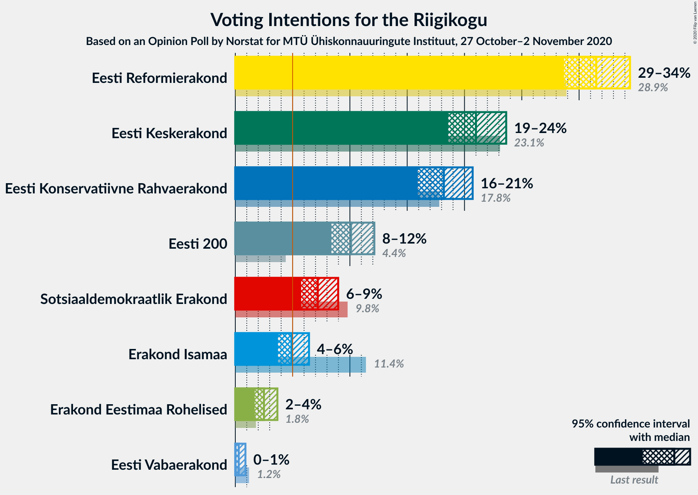

### Confidence Intervals

| Party | Last Result | Poll Result | 80% Confidence Interval | 90% Confidence Interval | 95% Confidence Interval | 99% Confidence Interval |
|:-----:|:-----------:|:-----------:|:-----------------------:|:-----------------------:|:-----------------------:|:-----------------------:|
| Eesti Reformierakond | 28.9% | 31.5% | 29.7–33.4% |29.1–34.0% |28.7–34.4% |27.8–35.4% |
| Eesti Keskerakond | 23.1% | 21.0% | 19.4–22.7% |19.0–23.2% |18.6–23.6% |17.8–24.5% |
| Eesti Konservatiivne Rahvaerakond | 17.8% | 18.2% | 16.7–19.8% |16.3–20.3% |15.9–20.7% |15.2–21.5% |
| Eesti 200 | 4.4% | 10.1% | 9.0–11.4% |8.6–11.8% |8.4–12.1% |7.9–12.8% |
| Sotsiaaldemokraatlik Erakond | 9.8% | 7.2% | 6.2–8.4% |6.0–8.7% |5.7–9.0% |5.3–9.6% |
| Erakond Isamaa | 11.4% | 4.9% | 4.1–5.9% |3.9–6.2% |3.7–6.4% |3.4–6.9% |
| Erakond Eestimaa Rohelised | 1.8% | 2.5% | 2.0–3.3% |1.8–3.5% |1.7–3.7% |1.5–4.1% |
| Eesti Vabaerakond | 1.2% | 0.3% | 0.2–0.7% |0.1–0.8% |0.1–0.9% |0.1–1.1% |

*Note:* The poll result column reflects the actual value used in the calculations. Published results may vary slightly, and in addition be rounded to fewer digits.

## Seats

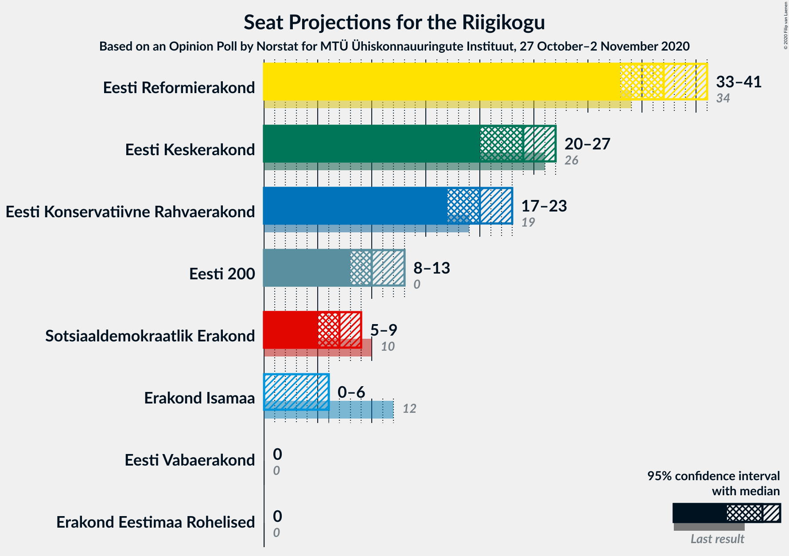

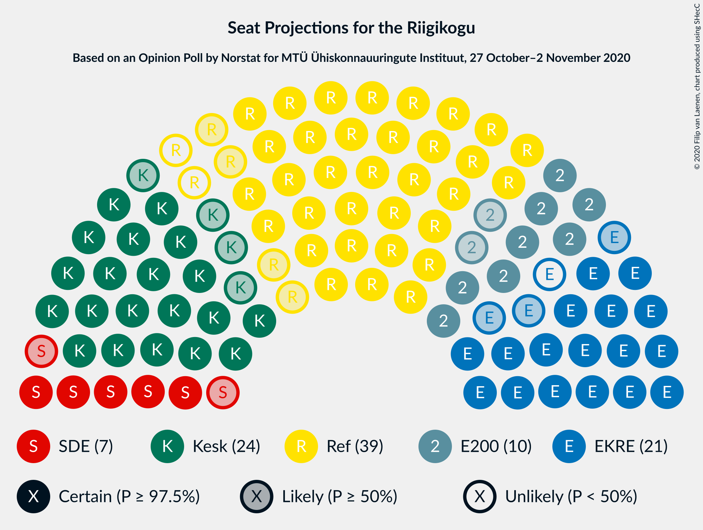

### Confidence Intervals

| Party | Last Result | Median | 80% Confidence Interval | 90% Confidence Interval | 95% Confidence Interval | 99% Confidence Interval |
|:-----:|:-----------:|:------:|:-----------------------:|:-----------------------:|:-----------------------:|:-----------------------:|
| <a href="#eesti-reformierakond">Eesti Reformierakond</a> | 34 | 37 | 35–40 |33–41 |33–41 |32–43 |
| <a href="#eesti-keskerakond">Eesti Keskerakond</a> | 26 | 24 | 21–26 |21–26 |20–27 |19–28 |
| <a href="#eesti-konservatiivne-rahvaerakond">Eesti Konservatiivne Rahvaerakond</a> | 19 | 20 | 18–22 |17–23 |17–23 |16–25 |
| <a href="#eesti-200">Eesti 200</a> | 0 | 10 | 9–12 |8–12 |8–13 |7–13 |
| <a href="#sotsiaaldemokraatlik-erakond">Sotsiaaldemokraatlik Erakond</a> | 10 | 7 | 6–8 |5–8 |5–9 |5–10 |
| <a href="#erakond-isamaa">Erakond Isamaa</a> | 12 | 0 | 0–5 |0–5 |0–6 |0–6 |
| <a href="#erakond-eestimaa-rohelised">Erakond Eestimaa Rohelised</a> | 0 | 0 | 0 |0 |0 |0 |
| <a href="#eesti-vabaerakond">Eesti Vabaerakond</a> | 0 | 0 | 0 |0 |0 |0 |

### Eesti Reformierakond

*For a full overview of the results for this party, see the [Eesti Reformierakond](party-eestireformierakond.html) page.*

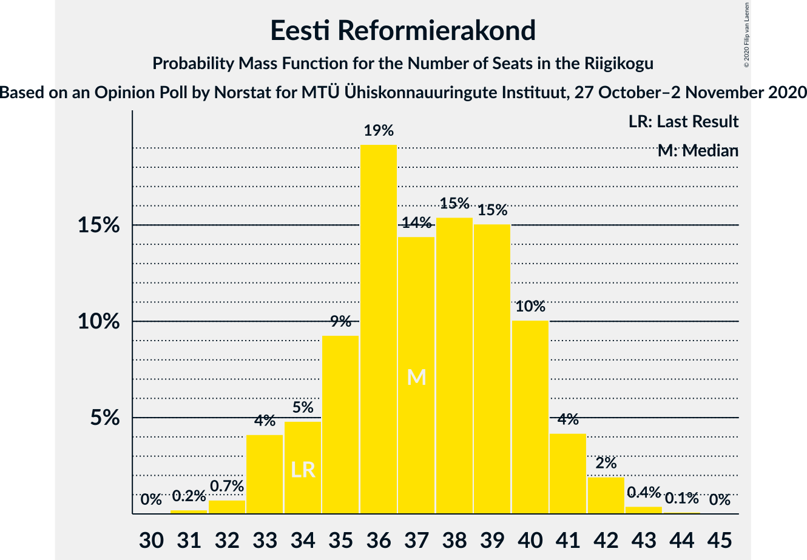

| Number of Seats | Probability | Accumulated | Special Marks |
|:---------------:|:-----------:|:-----------:|:-------------:|
| 31 | 0.2% | 100% |  |
| 32 | 0.7% | 99.7% |  |
| 33 | 4% | 99.0% |  |
| 34 | 5% | 95% | Last Result |
| 35 | 9% | 90% |  |
| 36 | 19% | 81% |  |
| 37 | 14% | 62% | Median |
| 38 | 15% | 47% |  |
| 39 | 15% | 32% |  |
| 40 | 10% | 17% |  |
| 41 | 4% | 7% |  |
| 42 | 2% | 2% |  |
| 43 | 0.4% | 0.5% |  |
| 44 | 0.1% | 0.1% |  |
| 45 | 0% | 0% |  |

### Eesti Keskerakond

*For a full overview of the results for this party, see the [Eesti Keskerakond](party-eestikeskerakond.html) page.*

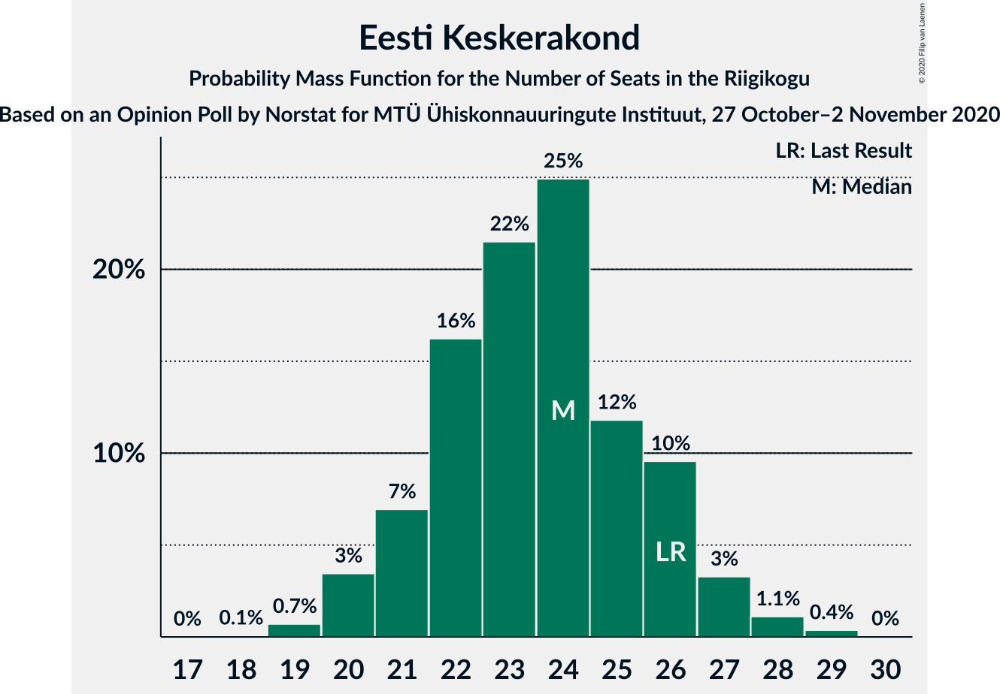

| Number of Seats | Probability | Accumulated | Special Marks |
|:---------------:|:-----------:|:-----------:|:-------------:|
| 18 | 0.1% | 100% |  |
| 19 | 0.7% | 99.9% |  |
| 20 | 3% | 99.2% |  |
| 21 | 7% | 96% |  |
| 22 | 16% | 89% |  |
| 23 | 22% | 73% |  |
| 24 | 25% | 51% | Median |
| 25 | 12% | 26% |  |
| 26 | 10% | 14% | Last Result |
| 27 | 3% | 5% |  |
| 28 | 1.1% | 2% |  |
| 29 | 0.4% | 0.4% |  |
| 30 | 0% | 0% |  |

### Eesti Konservatiivne Rahvaerakond

*For a full overview of the results for this party, see the [Eesti Konservatiivne Rahvaerakond](party-eestikonservatiivnerahvaerakond.html) page.*

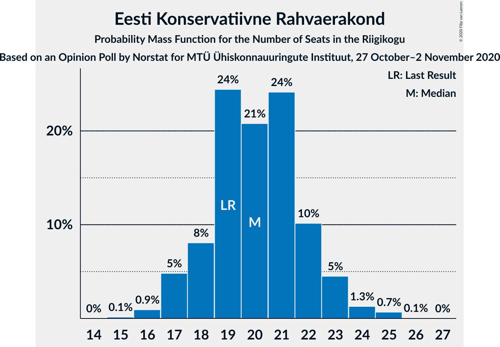

| Number of Seats | Probability | Accumulated | Special Marks |
|:---------------:|:-----------:|:-----------:|:-------------:|
| 15 | 0.1% | 100% |  |
| 16 | 0.9% | 99.8% |  |
| 17 | 5% | 98.9% |  |
| 18 | 8% | 94% |  |
| 19 | 24% | 86% | Last Result |
| 20 | 21% | 62% | Median |
| 21 | 24% | 41% |  |
| 22 | 10% | 17% |  |
| 23 | 5% | 7% |  |
| 24 | 1.3% | 2% |  |
| 25 | 0.7% | 0.7% |  |
| 26 | 0.1% | 0.1% |  |
| 27 | 0% | 0% |  |

### Eesti 200

*For a full overview of the results for this party, see the [Eesti 200](party-eesti200.html) page.*

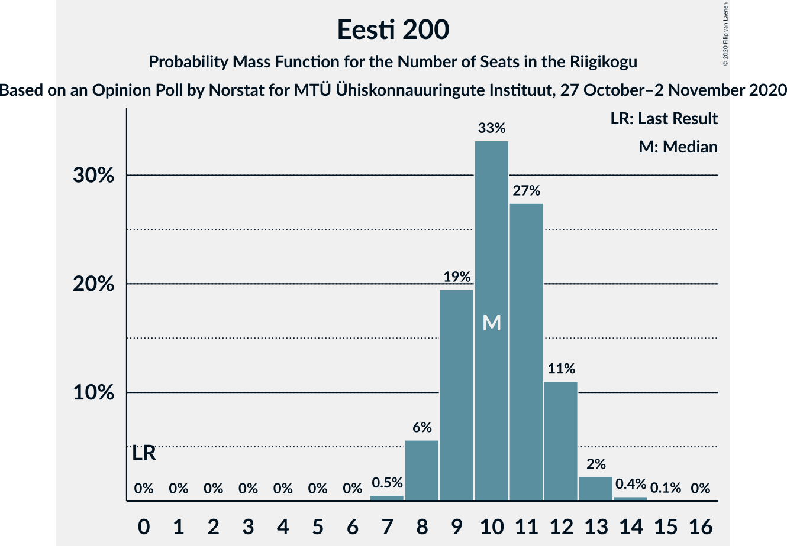

| Number of Seats | Probability | Accumulated | Special Marks |
|:---------------:|:-----------:|:-----------:|:-------------:|
| 0 | 0% | 100% | Last Result |
| 1 | 0% | 100% |  |
| 2 | 0% | 100% |  |
| 3 | 0% | 100% |  |
| 4 | 0% | 100% |  |
| 5 | 0% | 100% |  |
| 6 | 0% | 100% |  |
| 7 | 0.5% | 100% |  |
| 8 | 6% | 99.5% |  |
| 9 | 19% | 94% |  |
| 10 | 33% | 74% | Median |
| 11 | 27% | 41% |  |
| 12 | 11% | 14% |  |
| 13 | 2% | 3% |  |
| 14 | 0.4% | 0.5% |  |
| 15 | 0.1% | 0.1% |  |
| 16 | 0% | 0% |  |

### Sotsiaaldemokraatlik Erakond

*For a full overview of the results for this party, see the [Sotsiaaldemokraatlik Erakond](party-sotsiaaldemokraatlikerakond.html) page.*

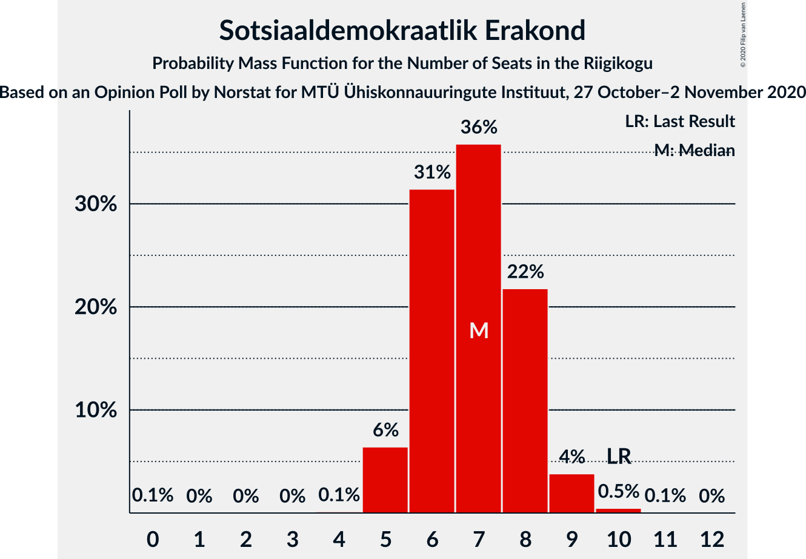

| Number of Seats | Probability | Accumulated | Special Marks |
|:---------------:|:-----------:|:-----------:|:-------------:|
| 0 | 0.1% | 100% |  |
| 1 | 0% | 99.9% |  |
| 2 | 0% | 99.9% |  |
| 3 | 0% | 99.9% |  |
| 4 | 0.1% | 99.9% |  |
| 5 | 6% | 99.8% |  |
| 6 | 31% | 93% |  |
| 7 | 36% | 62% | Median |
| 8 | 22% | 26% |  |
| 9 | 4% | 4% |  |
| 10 | 0.5% | 0.5% | Last Result |
| 11 | 0.1% | 0.1% |  |
| 12 | 0% | 0% |  |

### Erakond Isamaa

*For a full overview of the results for this party, see the [Erakond Isamaa](party-erakondisamaa.html) page.*

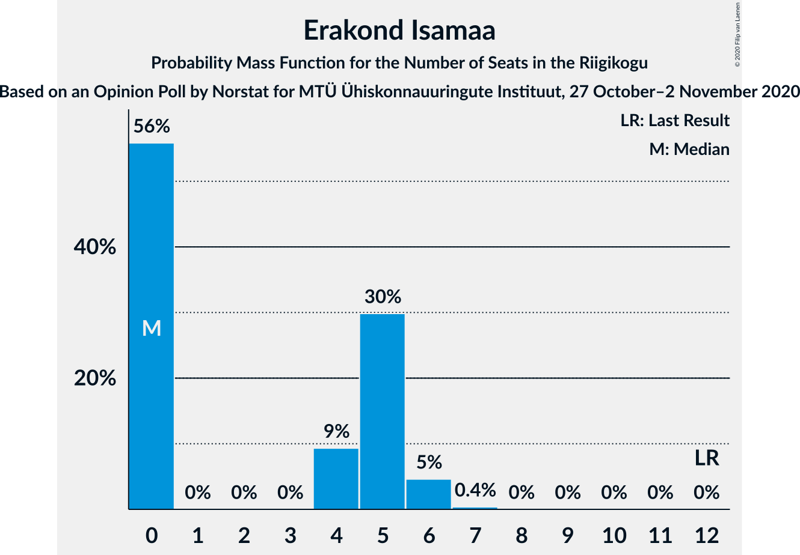

| Number of Seats | Probability | Accumulated | Special Marks |
|:---------------:|:-----------:|:-----------:|:-------------:|
| 0 | 56% | 100% | Median |
| 1 | 0% | 44% |  |
| 2 | 0% | 44% |  |
| 3 | 0% | 44% |  |
| 4 | 9% | 44% |  |
| 5 | 30% | 35% |  |
| 6 | 5% | 5% |  |
| 7 | 0.4% | 0.4% |  |
| 8 | 0% | 0% |  |
| 9 | 0% | 0% |  |
| 10 | 0% | 0% |  |
| 11 | 0% | 0% |  |
| 12 | 0% | 0% | Last Result |

### Erakond Eestimaa Rohelised

*For a full overview of the results for this party, see the [Erakond Eestimaa Rohelised](party-erakondeestimaarohelised.html) page.*

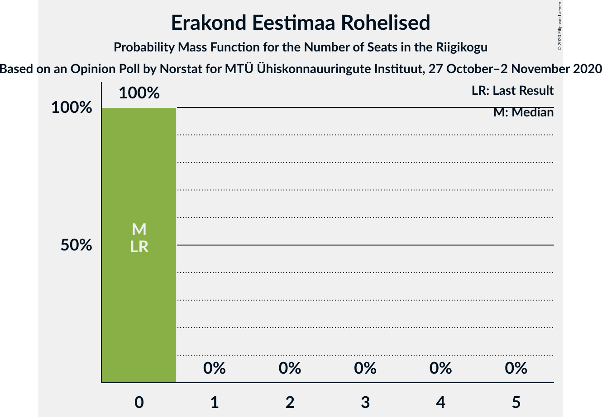

| Number of Seats | Probability | Accumulated | Special Marks |
|:---------------:|:-----------:|:-----------:|:-------------:|
| 0 | 100% | 100% | Last Result, Median |

### Eesti Vabaerakond

*For a full overview of the results for this party, see the [Eesti Vabaerakond](party-eestivabaerakond.html) page.*

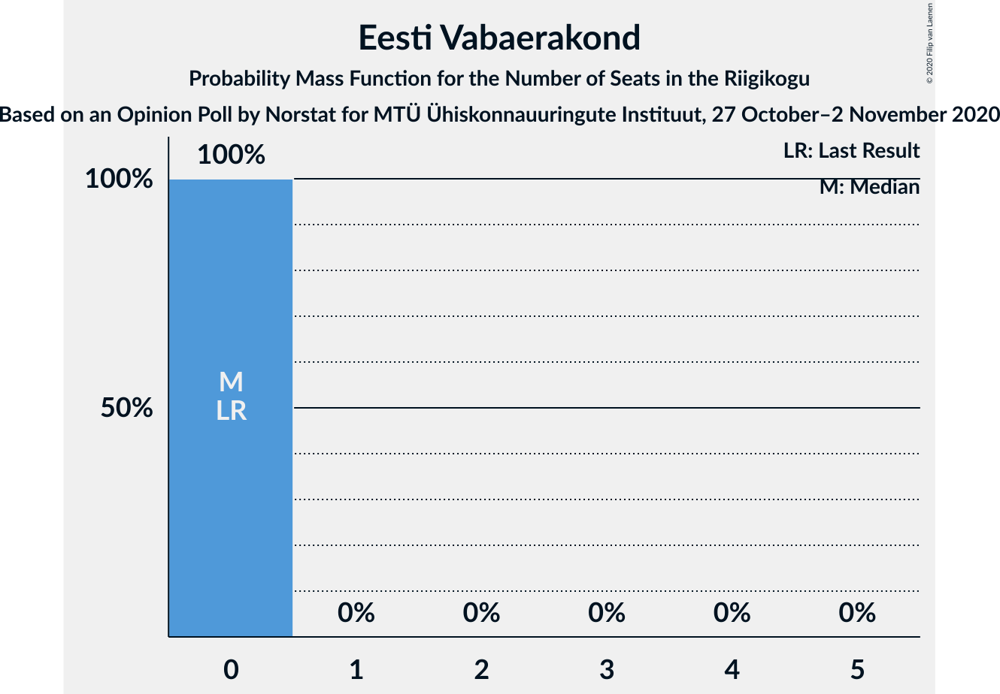

| Number of Seats | Probability | Accumulated | Special Marks |
|:---------------:|:-----------:|:-----------:|:-------------:|
| 0 | 100% | 100% | Last Result, Median |

## Coalitions

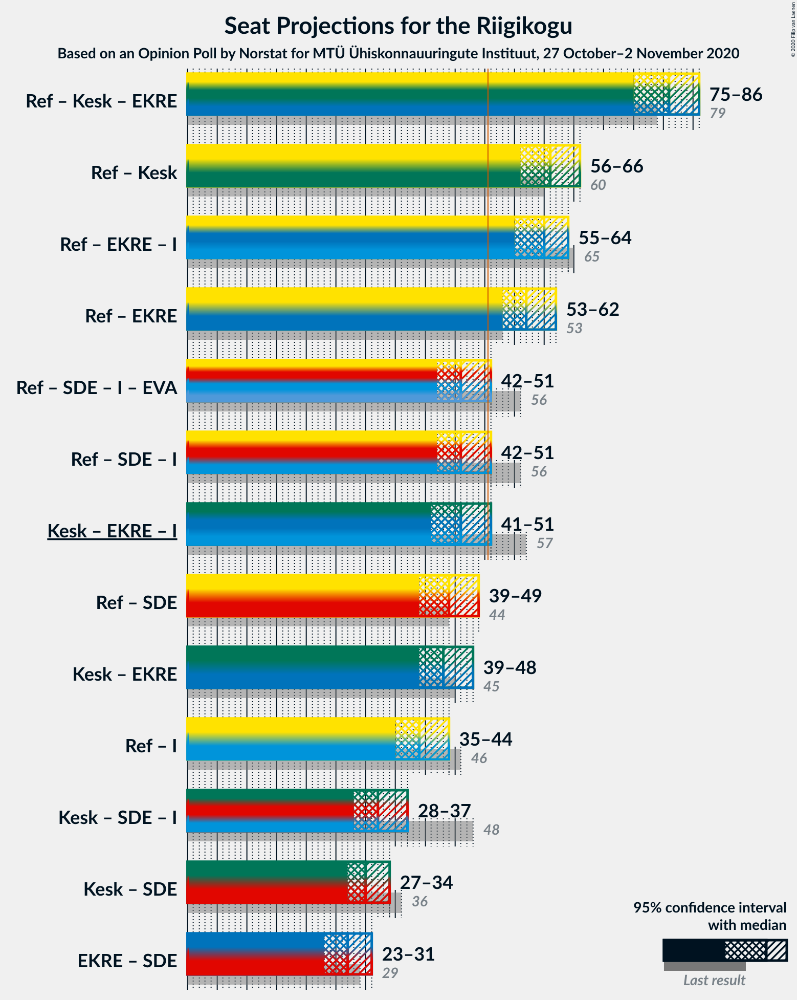

### Confidence Intervals

| Coalition | Last Result | Median | Majority? | 80% Confidence Interval | 90% Confidence Interval | 95% Confidence Interval | 99% Confidence Interval |
|:---------:|:-----------:|:------:|:---------:|:-----------------------:|:-----------------------:|:-----------------------:|:-----------------------:|
| Eesti Reformierakond – Eesti Keskerakond – Eesti Konservatiivne Rahvaerakond | 79 | 81 | 100% | 77–84 | 76–85 | 75–86 | 74–86 |
| Eesti Reformierakond – Eesti Keskerakond | 60 | 61 | 100% | 58–64 | 56–65 | 56–66 | 55–67 |
| Eesti Reformierakond – Eesti Konservatiivne Rahvaerakond – Erakond Isamaa | 65 | 60 | 100% | 56–62 | 55–63 | 55–64 | 53–65 |
| Eesti Reformierakond – Eesti Konservatiivne Rahvaerakond | 53 | 57 | 99.7% | 54–61 | 53–61 | 53–62 | 51–63 |
| Eesti Reformierakond – Sotsiaaldemokraatlik Erakond – Erakond Isamaa – Eesti Vabaerakond | 56 | 46 | 5% | 43–50 | 42–50 | 42–51 | 40–53 |
| Eesti Reformierakond – Sotsiaaldemokraatlik Erakond – Erakond Isamaa | 56 | 46 | 5% | 43–50 | 42–50 | 42–51 | 40–53 |
| Eesti Keskerakond – Eesti Konservatiivne Rahvaerakond – Erakond Isamaa | 57 | 46 | 3% | 43–49 | 42–50 | 41–51 | 39–52 |
| Eesti Reformierakond – Sotsiaaldemokraatlik Erakond | 44 | 44 | 0.3% | 41–47 | 40–48 | 39–49 | 38–50 |
| Eesti Keskerakond – Eesti Konservatiivne Rahvaerakond | 45 | 43 | 0.1% | 41–47 | 40–48 | 39–48 | 38–49 |
| Eesti Reformierakond – Erakond Isamaa | 46 | 39 | 0% | 36–43 | 36–44 | 35–44 | 33–46 |
| Eesti Keskerakond – Sotsiaaldemokraatlik Erakond – Erakond Isamaa | 48 | 32 | 0% | 29–36 | 29–36 | 28–37 | 27–39 |
| Eesti Keskerakond – Sotsiaaldemokraatlik Erakond | 36 | 30 | 0% | 28–33 | 27–34 | 27–34 | 26–36 |
| Eesti Konservatiivne Rahvaerakond – Sotsiaaldemokraatlik Erakond | 29 | 27 | 0% | 25–29 | 24–30 | 23–31 | 22–32 |

### Eesti Reformierakond – Eesti Keskerakond – Eesti Konservatiivne Rahvaerakond

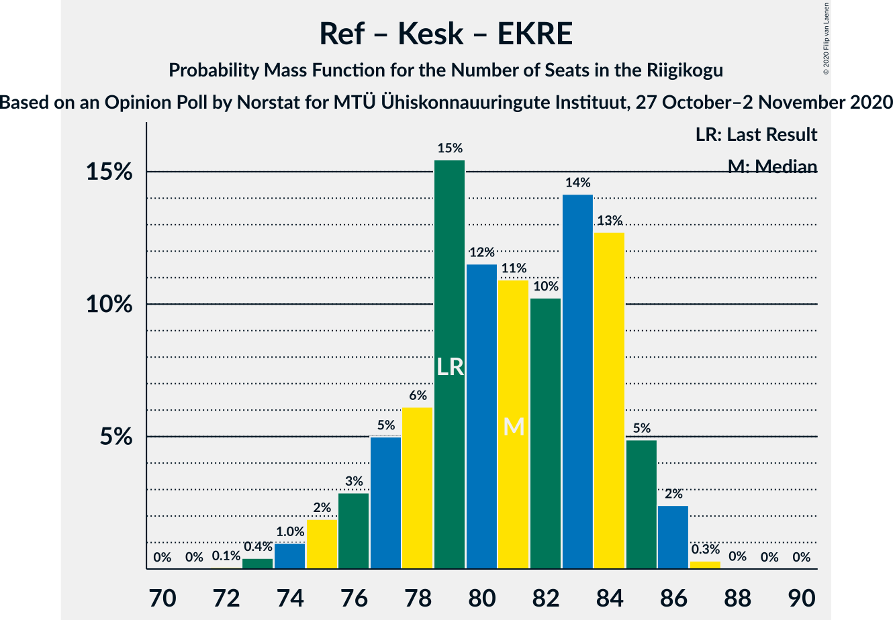

| Number of Seats | Probability | Accumulated | Special Marks |
|:---------------:|:-----------:|:-----------:|:-------------:|
| 72 | 0.1% | 100% |  |
| 73 | 0.4% | 99.9% |  |
| 74 | 1.0% | 99.5% |  |
| 75 | 2% | 98.5% |  |
| 76 | 3% | 97% |  |
| 77 | 5% | 94% |  |
| 78 | 6% | 89% |  |
| 79 | 15% | 83% | Last Result |
| 80 | 12% | 67% |  |
| 81 | 11% | 56% | Median |
| 82 | 10% | 45% |  |
| 83 | 14% | 35% |  |
| 84 | 13% | 20% |  |
| 85 | 5% | 8% |  |
| 86 | 2% | 3% |  |
| 87 | 0.3% | 0.4% |  |
| 88 | 0% | 0.1% |  |
| 89 | 0% | 0% |  |

### Eesti Reformierakond – Eesti Keskerakond

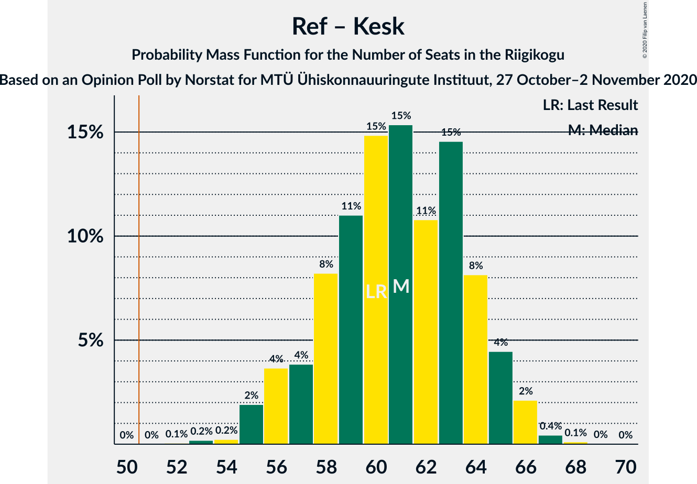

| Number of Seats | Probability | Accumulated | Special Marks |
|:---------------:|:-----------:|:-----------:|:-------------:|
| 52 | 0.1% | 100% |  |
| 53 | 0.2% | 99.9% |  |
| 54 | 0.2% | 99.7% |  |
| 55 | 2% | 99.5% |  |
| 56 | 4% | 98% |  |
| 57 | 4% | 94% |  |
| 58 | 8% | 90% |  |
| 59 | 11% | 82% |  |
| 60 | 15% | 71% | Last Result |
| 61 | 15% | 56% | Median |
| 62 | 11% | 41% |  |
| 63 | 15% | 30% |  |
| 64 | 8% | 15% |  |
| 65 | 4% | 7% |  |
| 66 | 2% | 3% |  |
| 67 | 0.4% | 0.6% |  |
| 68 | 0.1% | 0.2% |  |
| 69 | 0% | 0% |  |

### Eesti Reformierakond – Eesti Konservatiivne Rahvaerakond – Erakond Isamaa

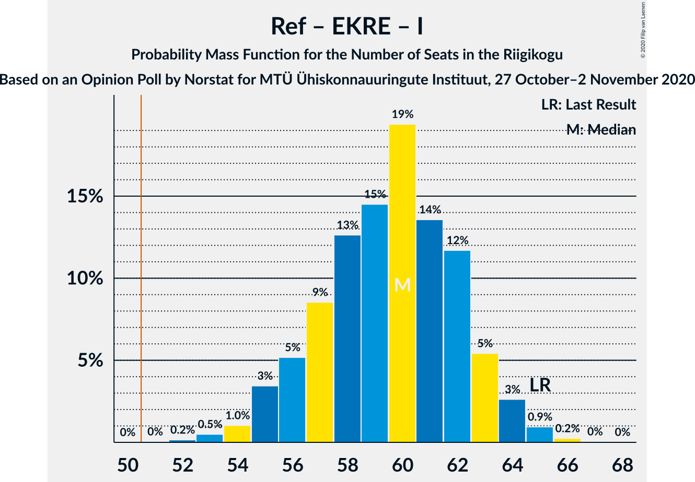

| Number of Seats | Probability | Accumulated | Special Marks |
|:---------------:|:-----------:|:-----------:|:-------------:|
| 51 | 0% | 100% | Majority |
| 52 | 0.2% | 99.9% |  |
| 53 | 0.5% | 99.8% |  |
| 54 | 1.0% | 99.3% |  |
| 55 | 3% | 98% |  |
| 56 | 5% | 95% |  |
| 57 | 9% | 90% | Median |
| 58 | 13% | 81% |  |
| 59 | 15% | 68% |  |
| 60 | 19% | 54% |  |
| 61 | 14% | 35% |  |
| 62 | 12% | 21% |  |
| 63 | 5% | 9% |  |
| 64 | 3% | 4% |  |
| 65 | 0.9% | 1.3% | Last Result |
| 66 | 0.2% | 0.3% |  |
| 67 | 0% | 0.1% |  |
| 68 | 0% | 0% |  |

### Eesti Reformierakond – Eesti Konservatiivne Rahvaerakond

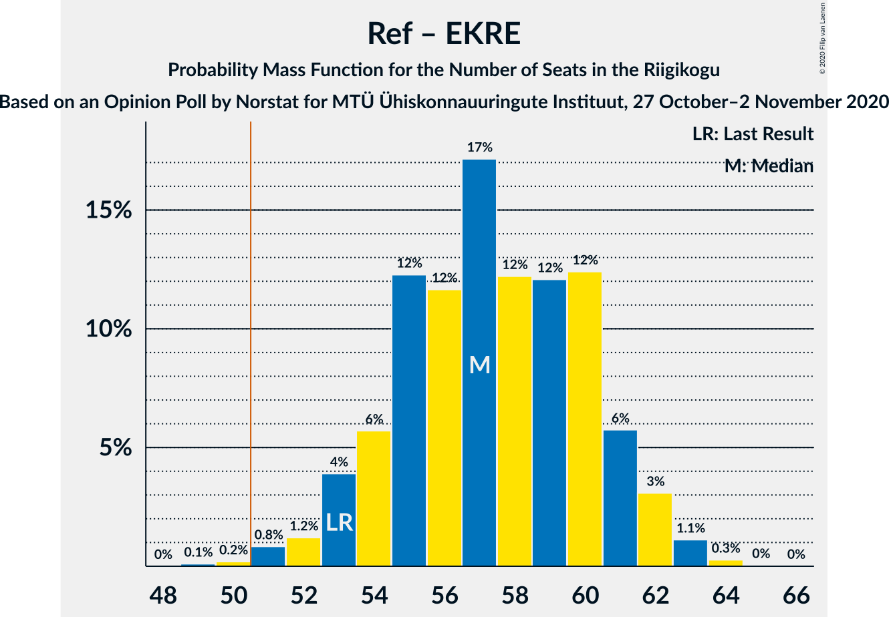

| Number of Seats | Probability | Accumulated | Special Marks |
|:---------------:|:-----------:|:-----------:|:-------------:|
| 49 | 0.1% | 100% |  |
| 50 | 0.2% | 99.9% |  |
| 51 | 0.8% | 99.7% | Majority |
| 52 | 1.2% | 98.9% |  |
| 53 | 4% | 98% | Last Result |
| 54 | 6% | 94% |  |
| 55 | 12% | 88% |  |
| 56 | 12% | 76% |  |
| 57 | 17% | 64% | Median |
| 58 | 12% | 47% |  |
| 59 | 12% | 35% |  |
| 60 | 12% | 23% |  |
| 61 | 6% | 10% |  |
| 62 | 3% | 5% |  |
| 63 | 1.1% | 1.4% |  |
| 64 | 0.3% | 0.3% |  |
| 65 | 0% | 0.1% |  |
| 66 | 0% | 0% |  |

### Eesti Reformierakond – Sotsiaaldemokraatlik Erakond – Erakond Isamaa – Eesti Vabaerakond

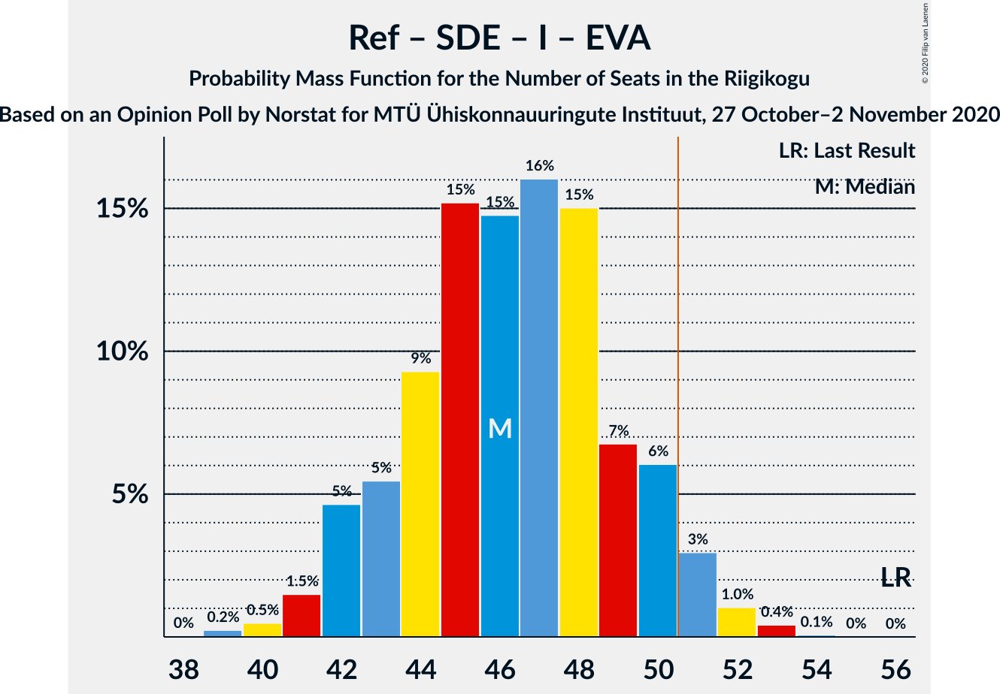

| Number of Seats | Probability | Accumulated | Special Marks |
|:---------------:|:-----------:|:-----------:|:-------------:|
| 39 | 0.2% | 100% |  |
| 40 | 0.5% | 99.7% |  |
| 41 | 1.5% | 99.2% |  |
| 42 | 5% | 98% |  |
| 43 | 5% | 93% |  |
| 44 | 9% | 88% | Median |
| 45 | 15% | 78% |  |
| 46 | 15% | 63% |  |
| 47 | 16% | 48% |  |
| 48 | 15% | 32% |  |
| 49 | 7% | 17% |  |
| 50 | 6% | 11% |  |
| 51 | 3% | 5% | Majority |
| 52 | 1.0% | 2% |  |
| 53 | 0.4% | 0.5% |  |
| 54 | 0.1% | 0.1% |  |
| 55 | 0% | 0% |  |
| 56 | 0% | 0% | Last Result |

### Eesti Reformierakond – Sotsiaaldemokraatlik Erakond – Erakond Isamaa

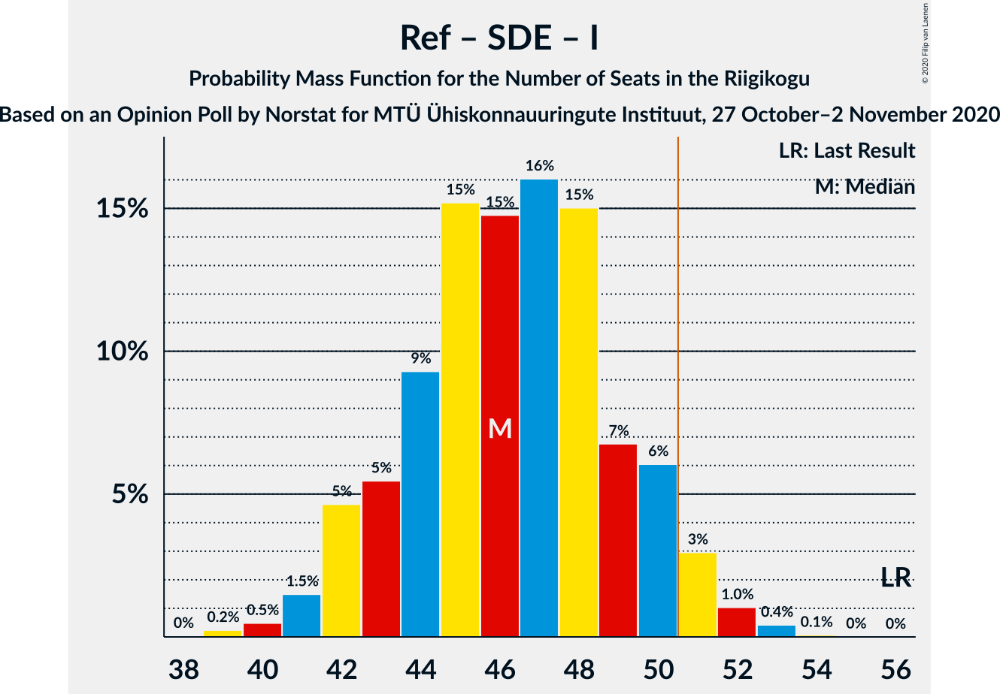

| Number of Seats | Probability | Accumulated | Special Marks |
|:---------------:|:-----------:|:-----------:|:-------------:|
| 39 | 0.2% | 100% |  |
| 40 | 0.5% | 99.7% |  |
| 41 | 1.5% | 99.2% |  |
| 42 | 5% | 98% |  |
| 43 | 5% | 93% |  |
| 44 | 9% | 88% | Median |
| 45 | 15% | 78% |  |
| 46 | 15% | 63% |  |
| 47 | 16% | 48% |  |
| 48 | 15% | 32% |  |
| 49 | 7% | 17% |  |
| 50 | 6% | 11% |  |
| 51 | 3% | 5% | Majority |
| 52 | 1.0% | 2% |  |
| 53 | 0.4% | 0.5% |  |
| 54 | 0.1% | 0.1% |  |
| 55 | 0% | 0% |  |
| 56 | 0% | 0% | Last Result |

### Eesti Keskerakond – Eesti Konservatiivne Rahvaerakond – Erakond Isamaa

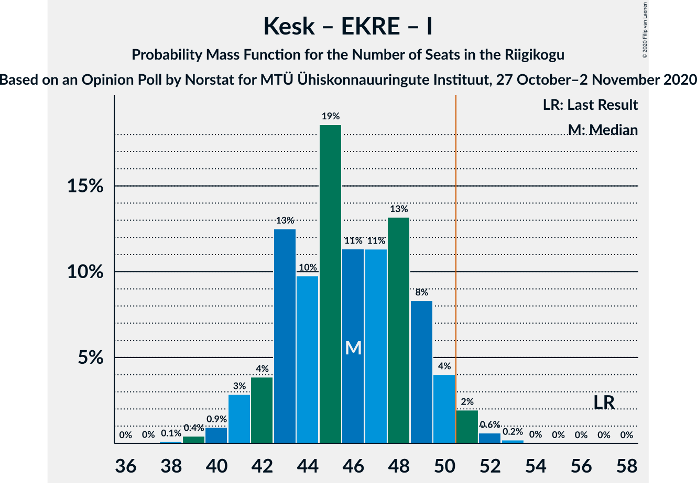

| Number of Seats | Probability | Accumulated | Special Marks |
|:---------------:|:-----------:|:-----------:|:-------------:|
| 38 | 0.1% | 100% |  |
| 39 | 0.4% | 99.9% |  |
| 40 | 0.9% | 99.5% |  |
| 41 | 3% | 98.5% |  |
| 42 | 4% | 96% |  |
| 43 | 13% | 92% |  |
| 44 | 10% | 79% | Median |
| 45 | 19% | 70% |  |
| 46 | 11% | 51% |  |
| 47 | 11% | 40% |  |
| 48 | 13% | 28% |  |
| 49 | 8% | 15% |  |
| 50 | 4% | 7% |  |
| 51 | 2% | 3% | Majority |
| 52 | 0.6% | 0.8% |  |
| 53 | 0.2% | 0.2% |  |
| 54 | 0% | 0% |  |
| 55 | 0% | 0% |  |
| 56 | 0% | 0% |  |
| 57 | 0% | 0% | Last Result |

### Eesti Reformierakond – Sotsiaaldemokraatlik Erakond

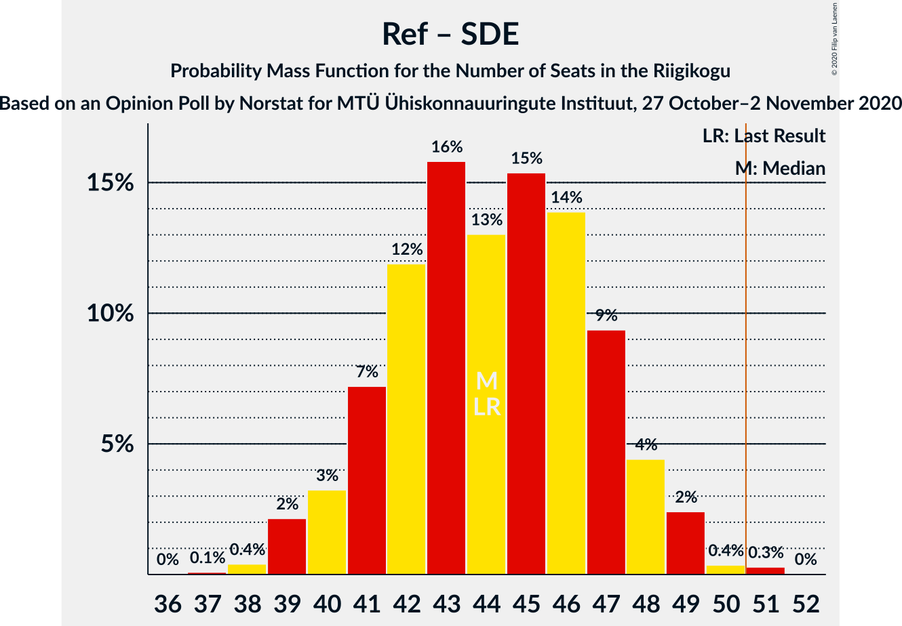

| Number of Seats | Probability | Accumulated | Special Marks |
|:---------------:|:-----------:|:-----------:|:-------------:|
| 37 | 0.1% | 100% |  |
| 38 | 0.4% | 99.9% |  |
| 39 | 2% | 99.5% |  |
| 40 | 3% | 97% |  |
| 41 | 7% | 94% |  |
| 42 | 12% | 87% |  |
| 43 | 16% | 75% |  |
| 44 | 13% | 59% | Last Result, Median |
| 45 | 15% | 46% |  |
| 46 | 14% | 31% |  |
| 47 | 9% | 17% |  |
| 48 | 4% | 8% |  |
| 49 | 2% | 3% |  |
| 50 | 0.4% | 0.7% |  |
| 51 | 0.3% | 0.3% | Majority |
| 52 | 0% | 0% |  |

### Eesti Keskerakond – Eesti Konservatiivne Rahvaerakond

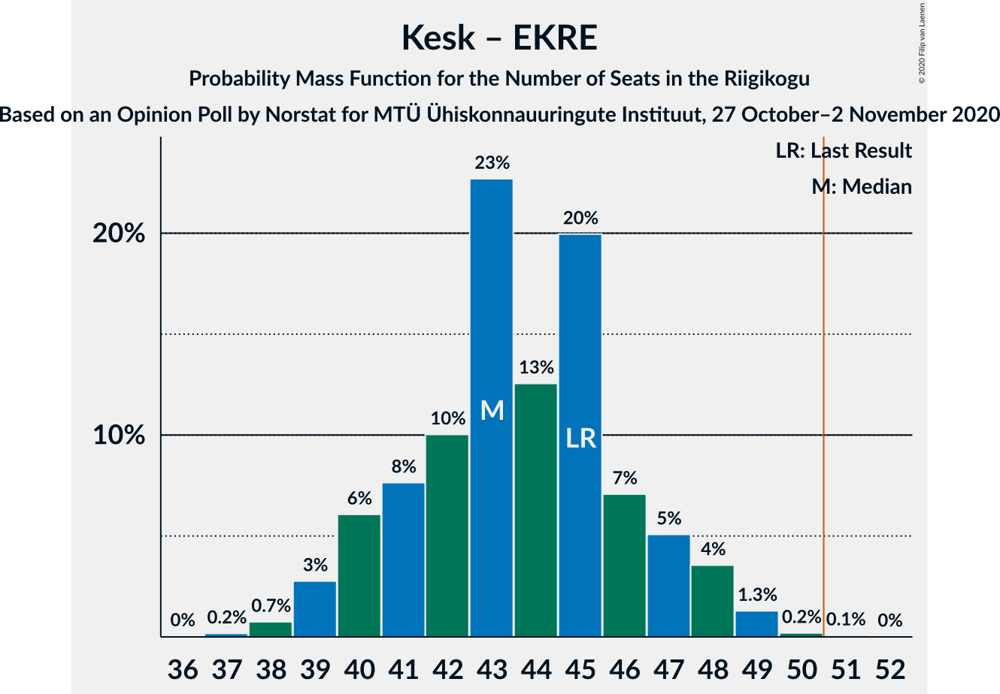

| Number of Seats | Probability | Accumulated | Special Marks |
|:---------------:|:-----------:|:-----------:|:-------------:|
| 36 | 0% | 100% |  |
| 37 | 0.2% | 99.9% |  |
| 38 | 0.7% | 99.8% |  |
| 39 | 3% | 99.0% |  |
| 40 | 6% | 96% |  |
| 41 | 8% | 90% |  |
| 42 | 10% | 83% |  |
| 43 | 23% | 73% |  |
| 44 | 13% | 50% | Median |
| 45 | 20% | 37% | Last Result |
| 46 | 7% | 17% |  |
| 47 | 5% | 10% |  |
| 48 | 4% | 5% |  |
| 49 | 1.3% | 2% |  |
| 50 | 0.2% | 0.3% |  |
| 51 | 0.1% | 0.1% | Majority |
| 52 | 0% | 0% |  |

### Eesti Reformierakond – Erakond Isamaa

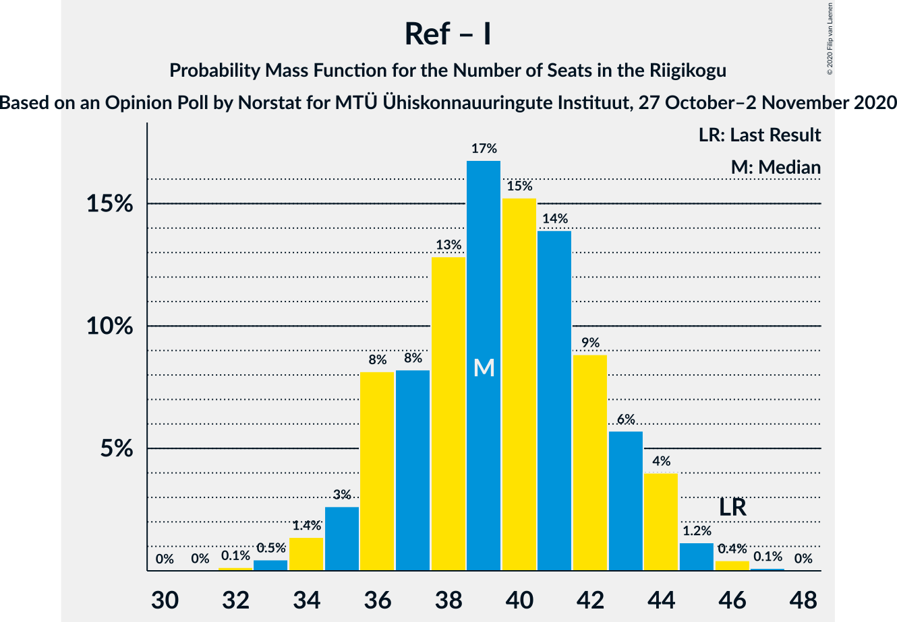

| Number of Seats | Probability | Accumulated | Special Marks |
|:---------------:|:-----------:|:-----------:|:-------------:|
| 32 | 0.1% | 100% |  |
| 33 | 0.5% | 99.8% |  |
| 34 | 1.4% | 99.4% |  |
| 35 | 3% | 98% |  |
| 36 | 8% | 95% |  |
| 37 | 8% | 87% | Median |
| 38 | 13% | 79% |  |
| 39 | 17% | 66% |  |
| 40 | 15% | 49% |  |
| 41 | 14% | 34% |  |
| 42 | 9% | 20% |  |
| 43 | 6% | 11% |  |
| 44 | 4% | 6% |  |
| 45 | 1.2% | 2% |  |
| 46 | 0.4% | 0.6% | Last Result |
| 47 | 0.1% | 0.1% |  |
| 48 | 0% | 0% |  |

### Eesti Keskerakond – Sotsiaaldemokraatlik Erakond – Erakond Isamaa

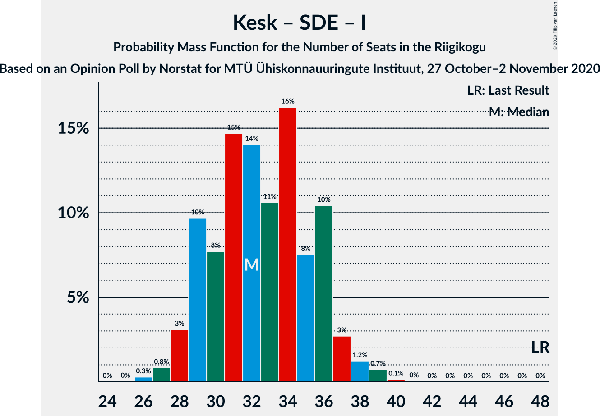

| Number of Seats | Probability | Accumulated | Special Marks |
|:---------------:|:-----------:|:-----------:|:-------------:|
| 26 | 0.3% | 100% |  |
| 27 | 0.8% | 99.7% |  |
| 28 | 3% | 98.9% |  |
| 29 | 10% | 96% |  |
| 30 | 8% | 86% |  |
| 31 | 15% | 78% | Median |
| 32 | 14% | 64% |  |
| 33 | 11% | 50% |  |
| 34 | 16% | 39% |  |
| 35 | 8% | 23% |  |
| 36 | 10% | 15% |  |
| 37 | 3% | 5% |  |
| 38 | 1.2% | 2% |  |
| 39 | 0.7% | 0.9% |  |
| 40 | 0.1% | 0.2% |  |
| 41 | 0% | 0% |  |
| 42 | 0% | 0% |  |
| 43 | 0% | 0% |  |
| 44 | 0% | 0% |  |
| 45 | 0% | 0% |  |
| 46 | 0% | 0% |  |
| 47 | 0% | 0% |  |
| 48 | 0% | 0% | Last Result |

### Eesti Keskerakond – Sotsiaaldemokraatlik Erakond

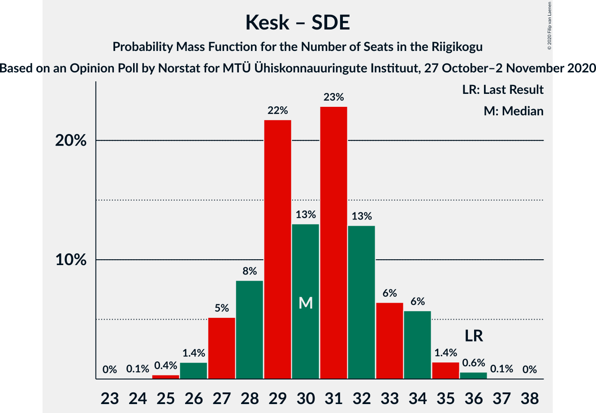

| Number of Seats | Probability | Accumulated | Special Marks |
|:---------------:|:-----------:|:-----------:|:-------------:|
| 24 | 0.1% | 100% |  |
| 25 | 0.4% | 99.9% |  |
| 26 | 1.4% | 99.5% |  |
| 27 | 5% | 98% |  |
| 28 | 8% | 93% |  |
| 29 | 22% | 85% |  |
| 30 | 13% | 63% |  |
| 31 | 23% | 50% | Median |
| 32 | 13% | 27% |  |
| 33 | 6% | 14% |  |
| 34 | 6% | 8% |  |
| 35 | 1.4% | 2% |  |
| 36 | 0.6% | 0.7% | Last Result |
| 37 | 0.1% | 0.1% |  |
| 38 | 0% | 0% |  |

### Eesti Konservatiivne Rahvaerakond – Sotsiaaldemokraatlik Erakond

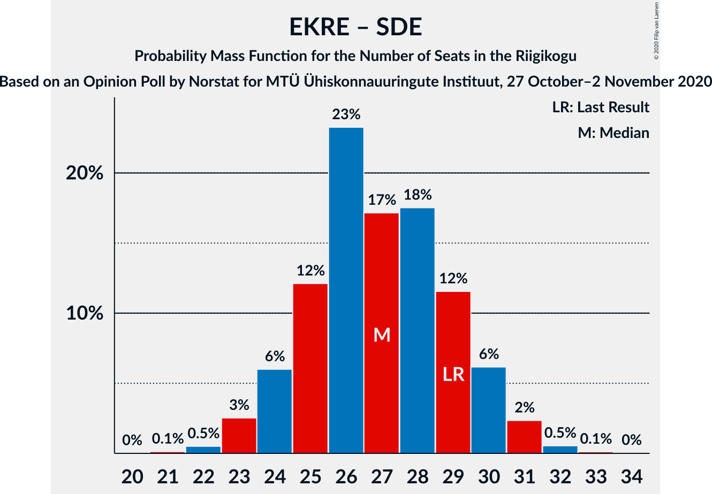

| Number of Seats | Probability | Accumulated | Special Marks |
|:---------------:|:-----------:|:-----------:|:-------------:|
| 21 | 0.1% | 100% |  |
| 22 | 0.5% | 99.8% |  |
| 23 | 3% | 99.3% |  |
| 24 | 6% | 97% |  |
| 25 | 12% | 91% |  |
| 26 | 23% | 79% |  |
| 27 | 17% | 55% | Median |
| 28 | 18% | 38% |  |
| 29 | 12% | 21% | Last Result |
| 30 | 6% | 9% |  |
| 31 | 2% | 3% |  |
| 32 | 0.5% | 0.7% |  |
| 33 | 0.1% | 0.2% |  |
| 34 | 0% | 0% |  |

## Technical Information

### Opinion Poll

+ **Polling firm:** Norstat
+ **Commissioner(s):** MTÜ Ühiskonnauuringute Instituut
+ **Fieldwork period:** 27 October–2 November 2020

### Calculations

+ **Sample size:** 1000
+ **Simulations done:** 1,048,576
+ **Error estimate:** 1.71%

