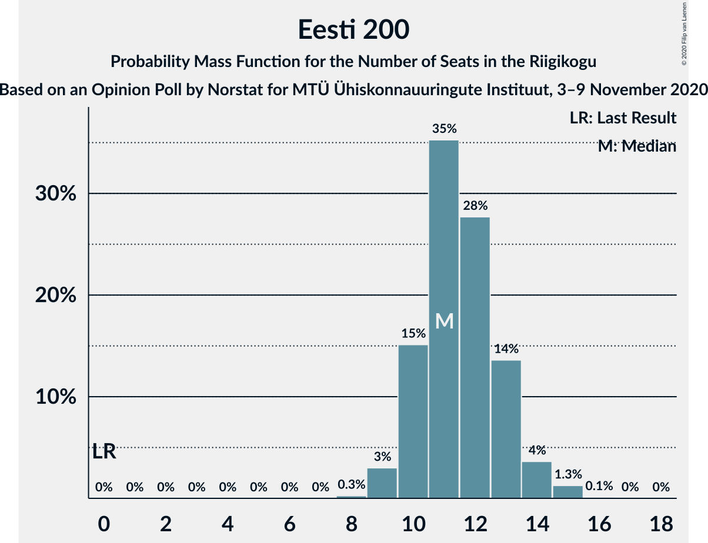
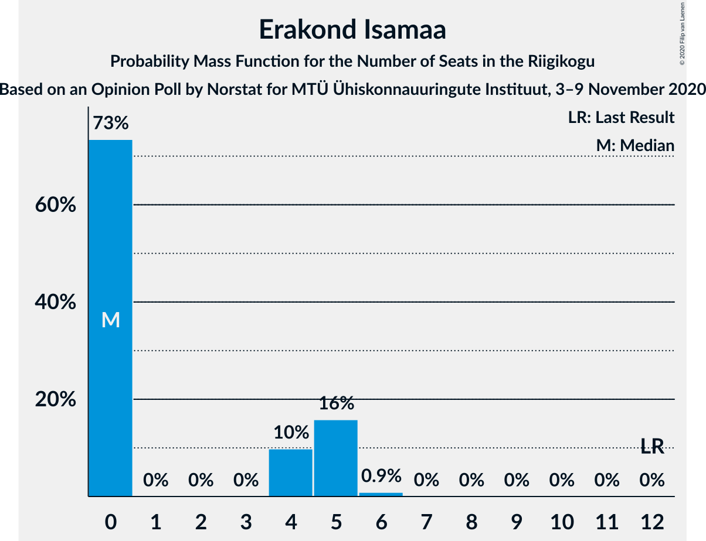
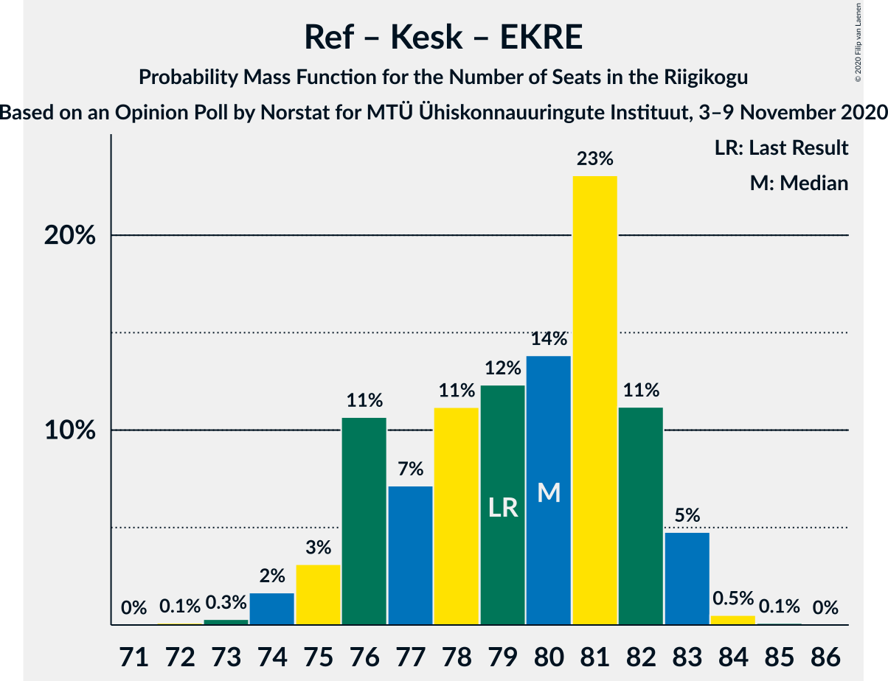
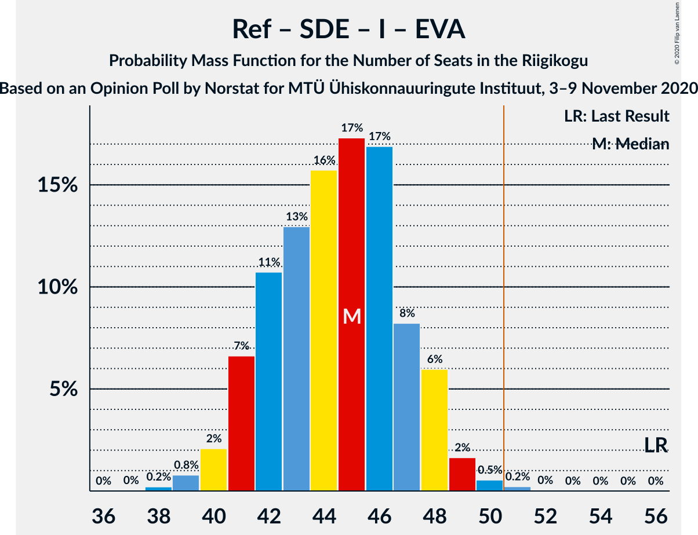
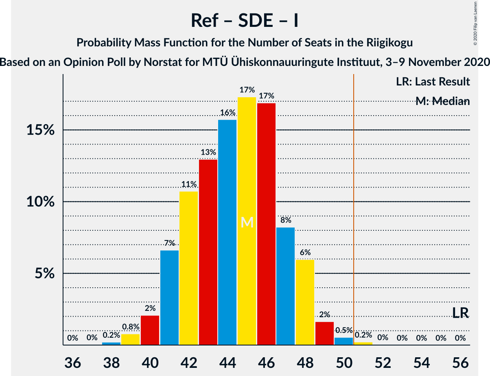
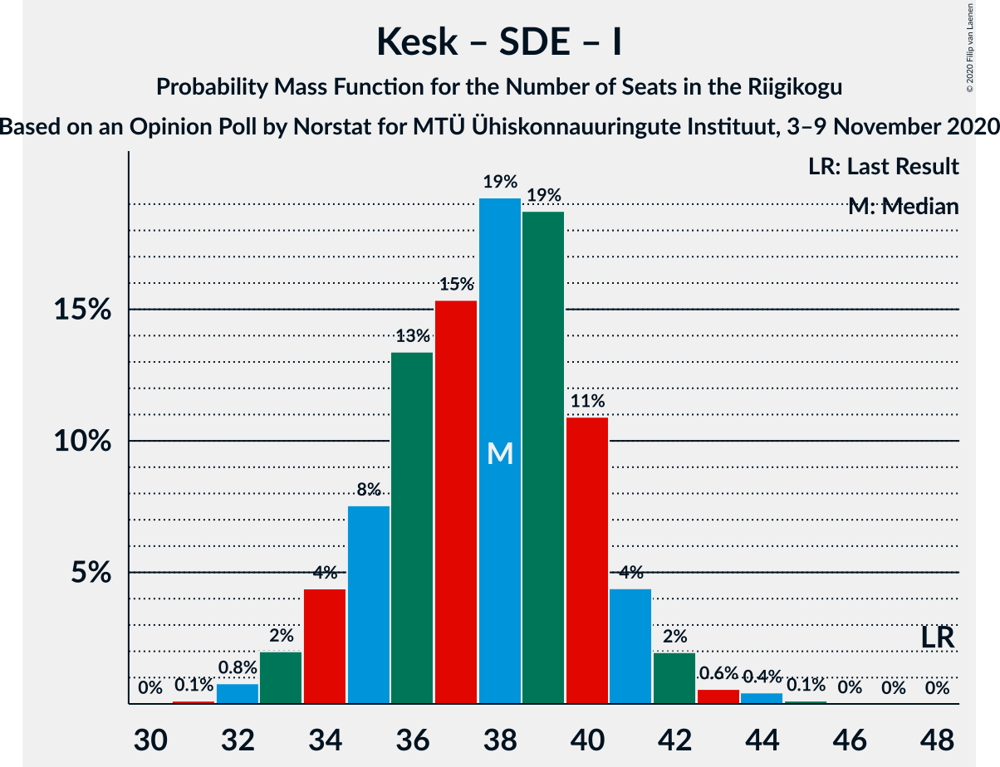

# Opinion Poll by Norstat for MTÜ Ühiskonnauuringute Instituut, 3–9 November 2020

<a href="#voting-intentions">Voting Intentions</a> | <a href="#seats">Seats</a> | <a href="#coalitions">Coalitions</a> | <a href="#technical-information">Technical Information</a>

## Voting Intentions

### Confidence Intervals

| Party | Last Result | Poll Result | 80% Confidence Interval | 90% Confidence Interval | 95% Confidence Interval | 99% Confidence Interval |
|:-----:|:-----------:|:-----------:|:-----------------------:|:-----------------------:|:-----------------------:|:-----------------------:|
| Eesti Reformierakond | 28.9% | 29.7% | 27.9–31.6% |27.4–32.1% |26.9–32.6% |26.1–33.5% |
| Eesti Keskerakond | 23.1% | 24.5% | 22.8–26.3% |22.3–26.8% |21.9–27.3% |21.1–28.2% |
| Eesti Konservatiivne Rahvaerakond | 17.8% | 16.5% | 15.1–18.1% |14.7–18.5% |14.3–18.9% |13.7–19.7% |
| Eesti 200 | 4.4% | 11.4% | 10.2–12.8% |9.9–13.2% |9.6–13.5% |9.0–14.2% |
| Sotsiaaldemokraatlik Erakond | 9.8% | 9.1% | 8.0–10.4% |7.7–10.7% |7.5–11.1% |7.0–11.7% |
| Erakond Isamaa | 11.4% | 4.5% | 3.8–5.5% |3.6–5.7% |3.4–6.0% |3.0–6.5% |
| Erakond Eestimaa Rohelised | 1.8% | 2.9% | 2.3–3.7% |2.2–3.9% |2.0–4.1% |1.8–4.6% |
| Eesti Vabaerakond | 1.2% | 0.4% | 0.2–0.8% |0.2–0.9% |0.2–1.0% |0.1–1.3% |

*Note:* The poll result column reflects the actual value used in the calculations. Published results may vary slightly, and in addition be rounded to fewer digits.

## Seats

### Confidence Intervals

| Party | Last Result | Median | 80% Confidence Interval | 90% Confidence Interval | 95% Confidence Interval | 99% Confidence Interval |
|:-----:|:-----------:|:------:|:-----------------------:|:-----------------------:|:-----------------------:|:-----------------------:|
| <a href="#eesti-reformierakond">Eesti Reformierakond</a> | 34 | 34 | 32–37 |31–38 |30–39 |29–40 |
| <a href="#eesti-keskerakond">Eesti Keskerakond</a> | 26 | 27 | 25–30 |25–31 |24–31 |23–33 |
| <a href="#eesti-konservatiivne-rahvaerakond">Eesti Konservatiivne Rahvaerakond</a> | 19 | 18 | 16–20 |15–21 |14–21 |14–22 |
| <a href="#eesti-200">Eesti 200</a> | 0 | 12 | 10–13 |10–14 |9–15 |9–15 |
| <a href="#sotsiaaldemokraatlik-erakond">Sotsiaaldemokraatlik Erakond</a> | 10 | 9 | 7–10 |7–11 |7–12 |7–12 |
| <a href="#erakond-isamaa">Erakond Isamaa</a> | 12 | 0 | 0–4 |0–5 |0–5 |0–6 |
| <a href="#erakond-eestimaa-rohelised">Erakond Eestimaa Rohelised</a> | 0 | 0 | 0 |0 |0 |0 |
| <a href="#eesti-vabaerakond">Eesti Vabaerakond</a> | 0 | 0 | 0 |0 |0 |0 |

### Eesti Reformierakond

*For a full overview of the results for this party, see the [Eesti Reformierakond](party-eestireformierakond.html) page.*

| Number of Seats | Probability | Accumulated | Special Marks |
|:---------------:|:-----------:|:-----------:|:-------------:|
| 28 | 0.1% | 100% |  |
| 29 | 0.7% | 99.9% |  |
| 30 | 4% | 99.3% |  |
| 31 | 4% | 95% |  |
| 32 | 12% | 92% |  |
| 33 | 16% | 79% |  |
| 34 | 29% | 63% | Last Result, Median |
| 35 | 6% | 34% |  |
| 36 | 14% | 28% |  |
| 37 | 5% | 15% |  |
| 38 | 5% | 9% |  |
| 39 | 4% | 4% |  |
| 40 | 0.7% | 0.8% |  |
| 41 | 0% | 0% |  |

### Eesti Keskerakond

*For a full overview of the results for this party, see the [Eesti Keskerakond](party-eestikeskerakond.html) page.*

| Number of Seats | Probability | Accumulated | Special Marks |
|:---------------:|:-----------:|:-----------:|:-------------:|
| 22 | 0.2% | 100% |  |
| 23 | 1.2% | 99.8% |  |
| 24 | 2% | 98.6% |  |
| 25 | 15% | 97% |  |
| 26 | 22% | 81% | Last Result |
| 27 | 26% | 60% | Median |
| 28 | 11% | 33% |  |
| 29 | 11% | 22% |  |
| 30 | 6% | 11% |  |
| 31 | 4% | 5% |  |
| 32 | 0.6% | 1.4% |  |
| 33 | 0.7% | 0.8% |  |
| 34 | 0.1% | 0.1% |  |
| 35 | 0% | 0% |  |

### Eesti Konservatiivne Rahvaerakond

*For a full overview of the results for this party, see the [Eesti Konservatiivne Rahvaerakond](party-eestikonservatiivnerahvaerakond.html) page.*

| Number of Seats | Probability | Accumulated | Special Marks |
|:---------------:|:-----------:|:-----------:|:-------------:|
| 13 | 0.1% | 100% |  |
| 14 | 3% | 99.9% |  |
| 15 | 5% | 97% |  |
| 16 | 11% | 92% |  |
| 17 | 21% | 82% |  |
| 18 | 15% | 61% | Median |
| 19 | 21% | 46% | Last Result |
| 20 | 19% | 26% |  |
| 21 | 6% | 7% |  |
| 22 | 0.5% | 0.5% |  |
| 23 | 0% | 0% |  |

### Eesti 200

*For a full overview of the results for this party, see the [Eesti 200](party-eesti200.html) page.*

| Number of Seats | Probability | Accumulated | Special Marks |
|:---------------:|:-----------:|:-----------:|:-------------:|
| 0 | 0% | 100% | Last Result |
| 1 | 0% | 100% |  |
| 2 | 0% | 100% |  |
| 3 | 0% | 100% |  |
| 4 | 0% | 100% |  |
| 5 | 0% | 100% |  |
| 6 | 0% | 100% |  |
| 7 | 0% | 100% |  |
| 8 | 0.4% | 100% |  |
| 9 | 4% | 99.6% |  |
| 10 | 6% | 96% |  |
| 11 | 26% | 90% |  |
| 12 | 39% | 64% | Median |
| 13 | 19% | 25% |  |
| 14 | 3% | 6% |  |
| 15 | 3% | 3% |  |
| 16 | 0.2% | 0.2% |  |
| 17 | 0% | 0% |  |

### Sotsiaaldemokraatlik Erakond

*For a full overview of the results for this party, see the [Sotsiaaldemokraatlik Erakond](party-sotsiaaldemokraatlikerakond.html) page.*

| Number of Seats | Probability | Accumulated | Special Marks |
|:---------------:|:-----------:|:-----------:|:-------------:|
| 6 | 0.4% | 100% |  |
| 7 | 10% | 99.5% |  |
| 8 | 37% | 90% |  |
| 9 | 27% | 53% | Median |
| 10 | 18% | 26% | Last Result |
| 11 | 4% | 7% |  |
| 12 | 3% | 3% |  |
| 13 | 0.2% | 0.2% |  |
| 14 | 0% | 0% |  |

### Erakond Isamaa

*For a full overview of the results for this party, see the [Erakond Isamaa](party-erakondisamaa.html) page.*

| Number of Seats | Probability | Accumulated | Special Marks |
|:---------------:|:-----------:|:-----------:|:-------------:|
| 0 | 78% | 100% | Median |
| 1 | 0% | 22% |  |
| 2 | 0% | 22% |  |
| 3 | 0% | 22% |  |
| 4 | 12% | 22% |  |
| 5 | 9% | 10% |  |
| 6 | 0.7% | 0.7% |  |
| 7 | 0% | 0% |  |
| 8 | 0% | 0% |  |
| 9 | 0% | 0% |  |
| 10 | 0% | 0% |  |
| 11 | 0% | 0% |  |
| 12 | 0% | 0% | Last Result |

### Erakond Eestimaa Rohelised

*For a full overview of the results for this party, see the [Erakond Eestimaa Rohelised](party-erakondeestimaarohelised.html) page.*

| Number of Seats | Probability | Accumulated | Special Marks |
|:---------------:|:-----------:|:-----------:|:-------------:|
| 0 | 100% | 100% | Last Result, Median |

### Eesti Vabaerakond

*For a full overview of the results for this party, see the [Eesti Vabaerakond](party-eestivabaerakond.html) page.*

| Number of Seats | Probability | Accumulated | Special Marks |
|:---------------:|:-----------:|:-----------:|:-------------:|
| 0 | 100% | 100% | Last Result, Median |

## Coalitions

### Confidence Intervals

| Coalition | Last Result | Median | Majority? | 80% Confidence Interval | 90% Confidence Interval | 95% Confidence Interval | 99% Confidence Interval |
|:---------:|:-----------:|:------:|:---------:|:-----------------------:|:-----------------------:|:-----------------------:|:-----------------------:|
| Eesti Reformierakond – Eesti Keskerakond – Eesti Konservatiivne Rahvaerakond | 79 | 79 | 100% | 76–82 | 75–83 | 75–83 | 73–84 |
| Eesti Reformierakond – Eesti Keskerakond | 60 | 61 | 100% | 58–65 | 58–66 | 57–66 | 56–67 |
| Eesti Reformierakond – Eesti Konservatiivne Rahvaerakond – Erakond Isamaa | 65 | 53 | 92% | 51–55 | 50–56 | 49–57 | 47–58 |
| Eesti Reformierakond – Eesti Konservatiivne Rahvaerakond | 53 | 53 | 78% | 49–55 | 48–55 | 48–56 | 46–57 |
| Eesti Keskerakond – Eesti Konservatiivne Rahvaerakond – Erakond Isamaa | 57 | 46 | 5% | 43–49 | 41–50 | 41–52 | 40–53 |
| Eesti Keskerakond – Eesti Konservatiivne Rahvaerakond | 45 | 46 | 2% | 41–47 | 41–49 | 40–50 | 39–51 |
| Eesti Reformierakond – Sotsiaaldemokraatlik Erakond – Erakond Isamaa – Eesti Vabaerakond | 56 | 44 | 0.2% | 42–48 | 41–49 | 40–49 | 39–50 |
| Eesti Reformierakond – Sotsiaaldemokraatlik Erakond – Erakond Isamaa | 56 | 44 | 0.2% | 42–48 | 41–49 | 40–49 | 39–50 |
| Eesti Reformierakond – Sotsiaaldemokraatlik Erakond | 44 | 42 | 0% | 41–46 | 40–48 | 38–49 | 37–49 |
| Eesti Keskerakond – Sotsiaaldemokraatlik Erakond – Erakond Isamaa | 48 | 36 | 0% | 34–40 | 34–41 | 33–42 | 32–43 |
| Eesti Reformierakond – Erakond Isamaa | 46 | 34 | 0% | 33–39 | 32–40 | 32–41 | 30–42 |
| Eesti Keskerakond – Sotsiaaldemokraatlik Erakond | 36 | 36 | 0% | 34–39 | 33–40 | 32–40 | 31–42 |
| Eesti Konservatiivne Rahvaerakond – Sotsiaaldemokraatlik Erakond | 29 | 27 | 0% | 24–29 | 24–29 | 23–30 | 22–31 |

### Eesti Reformierakond – Eesti Keskerakond – Eesti Konservatiivne Rahvaerakond

| Number of Seats | Probability | Accumulated | Special Marks |
|:---------------:|:-----------:|:-----------:|:-------------:|
| 72 | 0.2% | 100% |  |
| 73 | 0.8% | 99.8% |  |
| 74 | 0.7% | 99.0% |  |
| 75 | 7% | 98% |  |
| 76 | 6% | 91% |  |
| 77 | 6% | 85% |  |
| 78 | 9% | 79% |  |
| 79 | 20% | 70% | Last Result, Median |
| 80 | 8% | 50% |  |
| 81 | 23% | 42% |  |
| 82 | 12% | 19% |  |
| 83 | 6% | 7% |  |
| 84 | 0.8% | 0.9% |  |
| 85 | 0.1% | 0.1% |  |
| 86 | 0% | 0% |  |

### Eesti Reformierakond – Eesti Keskerakond

| Number of Seats | Probability | Accumulated | Special Marks |
|:---------------:|:-----------:|:-----------:|:-------------:|
| 54 | 0% | 100% |  |
| 55 | 0.2% | 99.9% |  |
| 56 | 0.9% | 99.8% |  |
| 57 | 2% | 98.8% |  |
| 58 | 10% | 96% |  |
| 59 | 9% | 87% |  |
| 60 | 21% | 78% | Last Result |
| 61 | 21% | 57% | Median |
| 62 | 6% | 36% |  |
| 63 | 4% | 30% |  |
| 64 | 12% | 26% |  |
| 65 | 8% | 14% |  |
| 66 | 5% | 6% |  |
| 67 | 0.5% | 0.7% |  |
| 68 | 0.2% | 0.2% |  |
| 69 | 0% | 0% |  |

### Eesti Reformierakond – Eesti Konservatiivne Rahvaerakond – Erakond Isamaa

| Number of Seats | Probability | Accumulated | Special Marks |
|:---------------:|:-----------:|:-----------:|:-------------:|
| 46 | 0.1% | 100% |  |
| 47 | 0.4% | 99.9% |  |
| 48 | 0.9% | 99.5% |  |
| 49 | 3% | 98.5% |  |
| 50 | 4% | 96% |  |
| 51 | 6% | 92% | Majority |
| 52 | 16% | 86% | Median |
| 53 | 21% | 71% |  |
| 54 | 27% | 50% |  |
| 55 | 14% | 22% |  |
| 56 | 5% | 9% |  |
| 57 | 3% | 4% |  |
| 58 | 0.5% | 0.8% |  |
| 59 | 0.2% | 0.3% |  |
| 60 | 0% | 0.1% |  |
| 61 | 0% | 0% |  |
| 62 | 0% | 0% |  |
| 63 | 0% | 0% |  |
| 64 | 0% | 0% |  |
| 65 | 0% | 0% | Last Result |

### Eesti Reformierakond – Eesti Konservatiivne Rahvaerakond

| Number of Seats | Probability | Accumulated | Special Marks |
|:---------------:|:-----------:|:-----------:|:-------------:|
| 45 | 0.1% | 100% |  |
| 46 | 0.8% | 99.9% |  |
| 47 | 1.2% | 99.1% |  |
| 48 | 4% | 98% |  |
| 49 | 9% | 94% |  |
| 50 | 7% | 85% |  |
| 51 | 8% | 78% | Majority |
| 52 | 16% | 69% | Median |
| 53 | 16% | 53% | Last Result |
| 54 | 23% | 37% |  |
| 55 | 11% | 14% |  |
| 56 | 2% | 3% |  |
| 57 | 1.3% | 1.5% |  |
| 58 | 0.2% | 0.2% |  |
| 59 | 0% | 0% |  |

### Eesti Keskerakond – Eesti Konservatiivne Rahvaerakond – Erakond Isamaa

| Number of Seats | Probability | Accumulated | Special Marks |
|:---------------:|:-----------:|:-----------:|:-------------:|
| 40 | 2% | 100% |  |
| 41 | 4% | 98% |  |
| 42 | 2% | 94% |  |
| 43 | 4% | 92% |  |
| 44 | 4% | 89% |  |
| 45 | 16% | 85% | Median |
| 46 | 25% | 69% |  |
| 47 | 26% | 44% |  |
| 48 | 5% | 18% |  |
| 49 | 5% | 13% |  |
| 50 | 3% | 8% |  |
| 51 | 2% | 5% | Majority |
| 52 | 2% | 3% |  |
| 53 | 0.6% | 0.9% |  |
| 54 | 0.3% | 0.3% |  |
| 55 | 0% | 0% |  |
| 56 | 0% | 0% |  |
| 57 | 0% | 0% | Last Result |

### Eesti Keskerakond – Eesti Konservatiivne Rahvaerakond

| Number of Seats | Probability | Accumulated | Special Marks |
|:---------------:|:-----------:|:-----------:|:-------------:|
| 39 | 2% | 100% |  |
| 40 | 2% | 98% |  |
| 41 | 6% | 95% |  |
| 42 | 2% | 89% |  |
| 43 | 9% | 87% |  |
| 44 | 7% | 78% |  |
| 45 | 16% | 71% | Last Result, Median |
| 46 | 25% | 55% |  |
| 47 | 21% | 30% |  |
| 48 | 4% | 9% |  |
| 49 | 2% | 5% |  |
| 50 | 1.2% | 3% |  |
| 51 | 2% | 2% | Majority |
| 52 | 0% | 0% |  |

### Eesti Reformierakond – Sotsiaaldemokraatlik Erakond – Erakond Isamaa – Eesti Vabaerakond

| Number of Seats | Probability | Accumulated | Special Marks |
|:---------------:|:-----------:|:-----------:|:-------------:|
| 38 | 0.1% | 100% |  |
| 39 | 0.5% | 99.9% |  |
| 40 | 3% | 99.4% |  |
| 41 | 7% | 97% |  |
| 42 | 30% | 90% |  |
| 43 | 7% | 60% | Median |
| 44 | 20% | 53% |  |
| 45 | 6% | 33% |  |
| 46 | 12% | 27% |  |
| 47 | 3% | 15% |  |
| 48 | 5% | 12% |  |
| 49 | 5% | 7% |  |
| 50 | 2% | 2% |  |
| 51 | 0.2% | 0.2% | Majority |
| 52 | 0% | 0% |  |
| 53 | 0% | 0% |  |
| 54 | 0% | 0% |  |
| 55 | 0% | 0% |  |
| 56 | 0% | 0% | Last Result |

### Eesti Reformierakond – Sotsiaaldemokraatlik Erakond – Erakond Isamaa

| Number of Seats | Probability | Accumulated | Special Marks |
|:---------------:|:-----------:|:-----------:|:-------------:|
| 38 | 0.1% | 100% |  |
| 39 | 0.5% | 99.9% |  |
| 40 | 3% | 99.4% |  |
| 41 | 7% | 97% |  |
| 42 | 30% | 90% |  |
| 43 | 7% | 60% | Median |
| 44 | 20% | 53% |  |
| 45 | 6% | 33% |  |
| 46 | 12% | 27% |  |
| 47 | 3% | 15% |  |
| 48 | 5% | 12% |  |
| 49 | 5% | 7% |  |
| 50 | 2% | 2% |  |
| 51 | 0.2% | 0.2% | Majority |
| 52 | 0% | 0% |  |
| 53 | 0% | 0% |  |
| 54 | 0% | 0% |  |
| 55 | 0% | 0% |  |
| 56 | 0% | 0% | Last Result |

### Eesti Reformierakond – Sotsiaaldemokraatlik Erakond

| Number of Seats | Probability | Accumulated | Special Marks |
|:---------------:|:-----------:|:-----------:|:-------------:|
| 36 | 0.1% | 100% |  |
| 37 | 0.7% | 99.9% |  |
| 38 | 2% | 99.2% |  |
| 39 | 1.3% | 97% |  |
| 40 | 5% | 96% |  |
| 41 | 9% | 91% |  |
| 42 | 34% | 82% |  |
| 43 | 9% | 48% | Median |
| 44 | 20% | 39% | Last Result |
| 45 | 8% | 19% |  |
| 46 | 4% | 12% |  |
| 47 | 1.2% | 7% |  |
| 48 | 3% | 6% |  |
| 49 | 2% | 3% |  |
| 50 | 0.5% | 0.5% |  |
| 51 | 0% | 0% | Majority |

### Eesti Keskerakond – Sotsiaaldemokraatlik Erakond – Erakond Isamaa

| Number of Seats | Probability | Accumulated | Special Marks |
|:---------------:|:-----------:|:-----------:|:-------------:|
| 31 | 0.2% | 100% |  |
| 32 | 0.7% | 99.8% |  |
| 33 | 2% | 99.0% |  |
| 34 | 12% | 97% |  |
| 35 | 20% | 86% |  |
| 36 | 22% | 66% | Median |
| 37 | 11% | 44% |  |
| 38 | 7% | 33% |  |
| 39 | 7% | 26% |  |
| 40 | 10% | 19% |  |
| 41 | 3% | 8% |  |
| 42 | 4% | 5% |  |
| 43 | 1.0% | 1.3% |  |
| 44 | 0.2% | 0.3% |  |
| 45 | 0.1% | 0.1% |  |
| 46 | 0.1% | 0.1% |  |
| 47 | 0% | 0% |  |
| 48 | 0% | 0% | Last Result |

### Eesti Reformierakond – Erakond Isamaa

| Number of Seats | Probability | Accumulated | Special Marks |
|:---------------:|:-----------:|:-----------:|:-------------:|
| 29 | 0.1% | 100% |  |
| 30 | 0.7% | 99.9% |  |
| 31 | 1.3% | 99.1% |  |
| 32 | 6% | 98% |  |
| 33 | 14% | 92% |  |
| 34 | 30% | 77% | Median |
| 35 | 7% | 47% |  |
| 36 | 16% | 41% |  |
| 37 | 7% | 25% |  |
| 38 | 5% | 17% |  |
| 39 | 6% | 12% |  |
| 40 | 3% | 6% |  |
| 41 | 2% | 3% |  |
| 42 | 0.6% | 0.6% |  |
| 43 | 0% | 0% |  |
| 44 | 0% | 0% |  |
| 45 | 0% | 0% |  |
| 46 | 0% | 0% | Last Result |

### Eesti Keskerakond – Sotsiaaldemokraatlik Erakond

| Number of Seats | Probability | Accumulated | Special Marks |
|:---------------:|:-----------:|:-----------:|:-------------:|
| 30 | 0% | 100% |  |
| 31 | 0.5% | 99.9% |  |
| 32 | 2% | 99.4% |  |
| 33 | 4% | 97% |  |
| 34 | 15% | 94% |  |
| 35 | 23% | 79% |  |
| 36 | 27% | 55% | Last Result, Median |
| 37 | 12% | 28% |  |
| 38 | 6% | 16% |  |
| 39 | 5% | 10% |  |
| 40 | 3% | 5% |  |
| 41 | 2% | 2% |  |
| 42 | 0.5% | 0.6% |  |
| 43 | 0.1% | 0.1% |  |
| 44 | 0% | 0% |  |

### Eesti Konservatiivne Rahvaerakond – Sotsiaaldemokraatlik Erakond

| Number of Seats | Probability | Accumulated | Special Marks |
|:---------------:|:-----------:|:-----------:|:-------------:|
| 21 | 0.2% | 100% |  |
| 22 | 0.8% | 99.8% |  |
| 23 | 3% | 99.0% |  |
| 24 | 8% | 96% |  |
| 25 | 14% | 88% |  |
| 26 | 14% | 73% |  |
| 27 | 11% | 59% | Median |
| 28 | 29% | 49% |  |
| 29 | 15% | 20% | Last Result |
| 30 | 3% | 5% |  |
| 31 | 2% | 2% |  |
| 32 | 0.1% | 0.1% |  |
| 33 | 0.1% | 0.1% |  |
| 34 | 0% | 0% |  |

## Technical Information

### Opinion Poll

+ **Polling firm:** Norstat
+ **Commissioner(s):** MTÜ Ühiskonnauuringute Instituut
+ **Fieldwork period:** 3–9 November 2020

### Calculations

+ **Sample size:** 1000
+ **Simulations done:** 131,072
+ **Error estimate:** 1.16%

