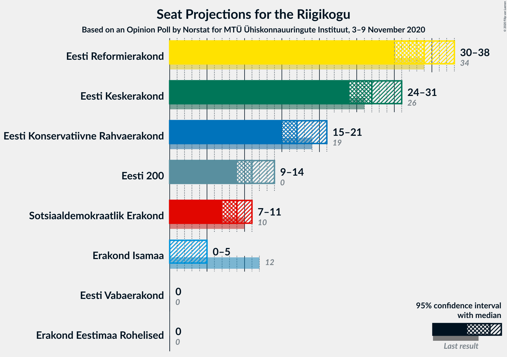
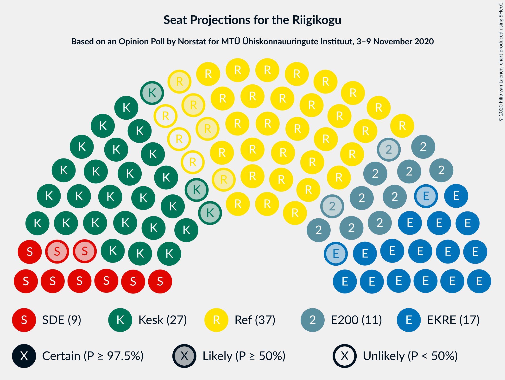
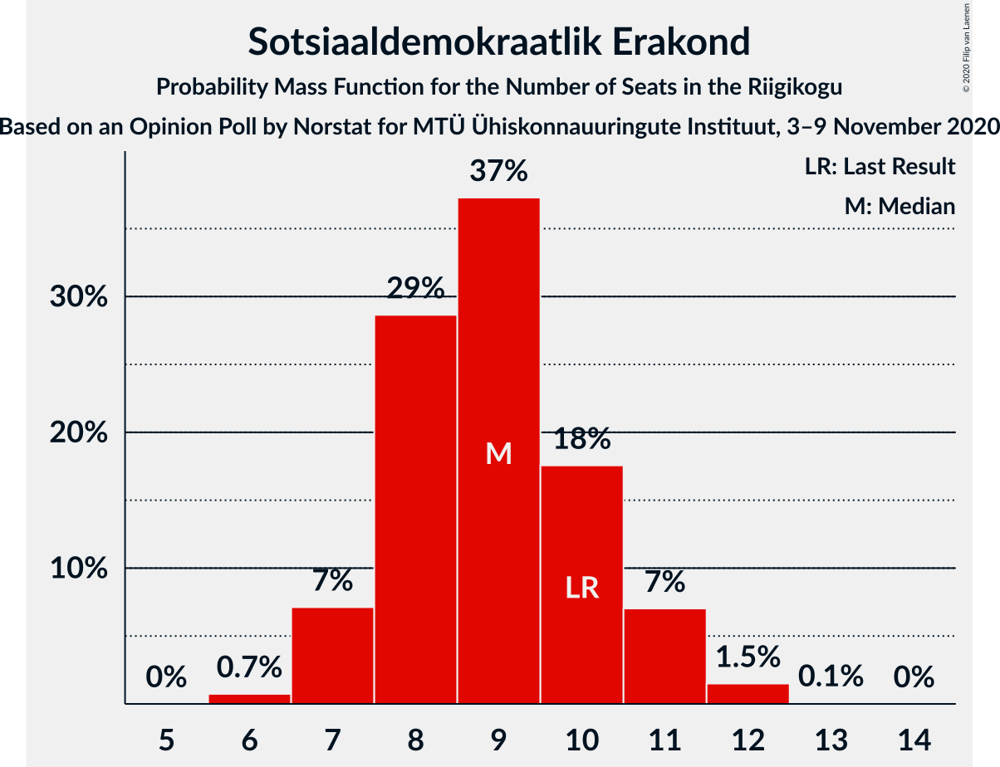
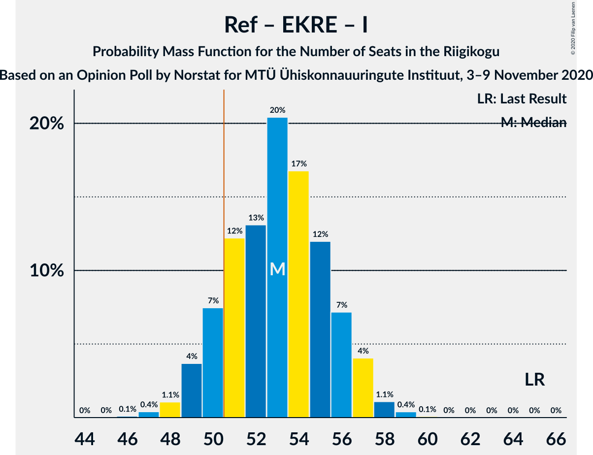
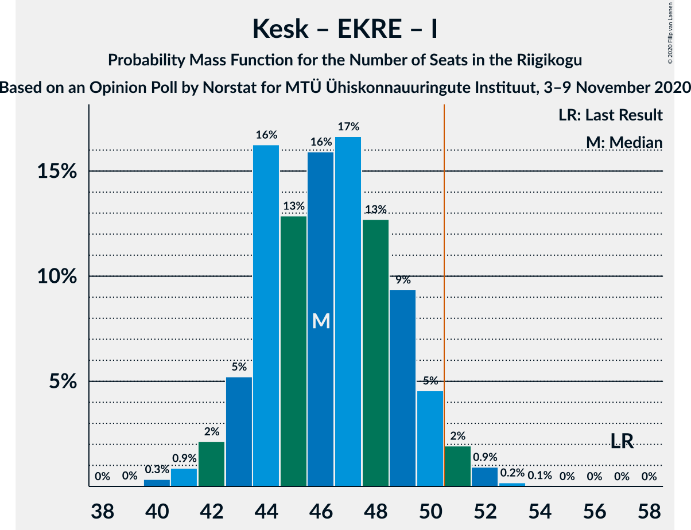

# Opinion Poll by Norstat for MTÜ Ühiskonnauuringute Instituut, 3–9 November 2020

<a href="#voting-intentions">Voting Intentions</a> | <a href="#seats">Seats</a> | <a href="#coalitions">Coalitions</a> | <a href="#technical-information">Technical Information</a>

## Voting Intentions

### Confidence Intervals

| Party | Last Result | Poll Result | 80% Confidence Interval | 90% Confidence Interval | 95% Confidence Interval | 99% Confidence Interval |
|:-----:|:-----------:|:-----------:|:-----------------------:|:-----------------------:|:-----------------------:|:-----------------------:|
| Eesti Reformierakond | 28.9% | 29.7% | 27.9–31.6% |27.4–32.1% |26.9–32.6% |26.1–33.5% |
| Eesti Keskerakond | 23.1% | 24.5% | 22.8–26.3% |22.3–26.8% |21.9–27.3% |21.1–28.2% |
| Eesti Konservatiivne Rahvaerakond | 17.8% | 16.5% | 15.1–18.1% |14.7–18.5% |14.3–18.9% |13.7–19.7% |
| Eesti 200 | 4.4% | 11.4% | 10.2–12.8% |9.9–13.2% |9.6–13.5% |9.0–14.2% |
| Sotsiaaldemokraatlik Erakond | 9.8% | 9.1% | 8.0–10.4% |7.7–10.7% |7.5–11.1% |7.0–11.7% |
| Erakond Isamaa | 11.4% | 4.5% | 3.8–5.5% |3.6–5.7% |3.4–6.0% |3.0–6.5% |
| Erakond Eestimaa Rohelised | 1.8% | 2.9% | 2.3–3.7% |2.2–3.9% |2.0–4.1% |1.8–4.6% |
| Eesti Vabaerakond | 1.2% | 0.4% | 0.2–0.8% |0.2–0.9% |0.2–1.0% |0.1–1.3% |

*Note:* The poll result column reflects the actual value used in the calculations. Published results may vary slightly, and in addition be rounded to fewer digits.

## Seats

### Confidence Intervals

| Party | Last Result | Median | 80% Confidence Interval | 90% Confidence Interval | 95% Confidence Interval | 99% Confidence Interval |
|:-----:|:-----------:|:------:|:-----------------------:|:-----------------------:|:-----------------------:|:-----------------------:|
| <a href="#eesti-reformierakond">Eesti Reformierakond</a> | 34 | 34 | 32–37 |31–37 |30–38 |29–39 |
| <a href="#eesti-keskerakond">Eesti Keskerakond</a> | 26 | 27 | 25–30 |25–31 |24–31 |23–32 |
| <a href="#eesti-konservatiivne-rahvaerakond">Eesti Konservatiivne Rahvaerakond</a> | 19 | 17 | 16–19 |15–20 |15–21 |14–22 |
| <a href="#eesti-200">Eesti 200</a> | 0 | 11 | 10–13 |10–14 |9–14 |9–15 |
| <a href="#sotsiaaldemokraatlik-erakond">Sotsiaaldemokraatlik Erakond</a> | 10 | 9 | 8–10 |7–11 |7–11 |6–12 |
| <a href="#erakond-isamaa">Erakond Isamaa</a> | 12 | 0 | 0–5 |0–5 |0–5 |0–6 |
| <a href="#erakond-eestimaa-rohelised">Erakond Eestimaa Rohelised</a> | 0 | 0 | 0 |0 |0 |0 |
| <a href="#eesti-vabaerakond">Eesti Vabaerakond</a> | 0 | 0 | 0 |0 |0 |0 |

### Eesti Reformierakond

*For a full overview of the results for this party, see the [Eesti Reformierakond](party-eestireformierakond.html) page.*

| Number of Seats | Probability | Accumulated | Special Marks |
|:---------------:|:-----------:|:-----------:|:-------------:|
| 28 | 0.1% | 100% |  |
| 29 | 0.6% | 99.9% |  |
| 30 | 2% | 99.3% |  |
| 31 | 5% | 97% |  |
| 32 | 11% | 93% |  |
| 33 | 17% | 82% |  |
| 34 | 20% | 65% | Last Result, Median |
| 35 | 18% | 45% |  |
| 36 | 12% | 27% |  |
| 37 | 11% | 15% |  |
| 38 | 3% | 4% |  |
| 39 | 1.1% | 1.5% |  |
| 40 | 0.3% | 0.3% |  |
| 41 | 0% | 0.1% |  |
| 42 | 0% | 0% |  |

### Eesti Keskerakond

*For a full overview of the results for this party, see the [Eesti Keskerakond](party-eestikeskerakond.html) page.*

| Number of Seats | Probability | Accumulated | Special Marks |
|:---------------:|:-----------:|:-----------:|:-------------:|
| 22 | 0.1% | 100% |  |
| 23 | 0.8% | 99.9% |  |
| 24 | 3% | 99.1% |  |
| 25 | 9% | 96% |  |
| 26 | 15% | 87% | Last Result |
| 27 | 25% | 72% | Median |
| 28 | 17% | 47% |  |
| 29 | 15% | 31% |  |
| 30 | 10% | 16% |  |
| 31 | 4% | 6% |  |
| 32 | 1.2% | 2% |  |
| 33 | 0.3% | 0.4% |  |
| 34 | 0% | 0.1% |  |
| 35 | 0% | 0% |  |

### Eesti Konservatiivne Rahvaerakond

*For a full overview of the results for this party, see the [Eesti Konservatiivne Rahvaerakond](party-eestikonservatiivnerahvaerakond.html) page.*

| Number of Seats | Probability | Accumulated | Special Marks |
|:---------------:|:-----------:|:-----------:|:-------------:|
| 13 | 0.1% | 100% |  |
| 14 | 1.2% | 99.9% |  |
| 15 | 6% | 98.7% |  |
| 16 | 15% | 93% |  |
| 17 | 32% | 78% | Median |
| 18 | 24% | 46% |  |
| 19 | 12% | 22% | Last Result |
| 20 | 7% | 10% |  |
| 21 | 2% | 3% |  |
| 22 | 0.5% | 0.6% |  |
| 23 | 0.1% | 0.1% |  |
| 24 | 0% | 0% |  |

### Eesti 200

*For a full overview of the results for this party, see the [Eesti 200](party-eesti200.html) page.*

| Number of Seats | Probability | Accumulated | Special Marks |
|:---------------:|:-----------:|:-----------:|:-------------:|
| 0 | 0% | 100% | Last Result |
| 1 | 0% | 100% |  |
| 2 | 0% | 100% |  |
| 3 | 0% | 100% |  |
| 4 | 0% | 100% |  |
| 5 | 0% | 100% |  |
| 6 | 0% | 100% |  |
| 7 | 0% | 100% |  |
| 8 | 0.3% | 100% |  |
| 9 | 3% | 99.7% |  |
| 10 | 15% | 97% |  |
| 11 | 35% | 82% | Median |
| 12 | 28% | 46% |  |
| 13 | 14% | 19% |  |
| 14 | 4% | 5% |  |
| 15 | 1.3% | 1.4% |  |
| 16 | 0.1% | 0.1% |  |
| 17 | 0% | 0% |  |

### Sotsiaaldemokraatlik Erakond

*For a full overview of the results for this party, see the [Sotsiaaldemokraatlik Erakond](party-sotsiaaldemokraatlikerakond.html) page.*

| Number of Seats | Probability | Accumulated | Special Marks |
|:---------------:|:-----------:|:-----------:|:-------------:|
| 6 | 0.7% | 100% |  |
| 7 | 7% | 99.2% |  |
| 8 | 29% | 92% |  |
| 9 | 37% | 63% | Median |
| 10 | 18% | 26% | Last Result |
| 11 | 7% | 9% |  |
| 12 | 1.5% | 2% |  |
| 13 | 0.1% | 0.1% |  |
| 14 | 0% | 0% |  |

### Erakond Isamaa

*For a full overview of the results for this party, see the [Erakond Isamaa](party-erakondisamaa.html) page.*

| Number of Seats | Probability | Accumulated | Special Marks |
|:---------------:|:-----------:|:-----------:|:-------------:|
| 0 | 73% | 100% | Median |
| 1 | 0% | 27% |  |
| 2 | 0% | 27% |  |
| 3 | 0% | 27% |  |
| 4 | 10% | 27% |  |
| 5 | 16% | 17% |  |
| 6 | 0.9% | 0.9% |  |
| 7 | 0% | 0% |  |
| 8 | 0% | 0% |  |
| 9 | 0% | 0% |  |
| 10 | 0% | 0% |  |
| 11 | 0% | 0% |  |
| 12 | 0% | 0% | Last Result |

### Erakond Eestimaa Rohelised

*For a full overview of the results for this party, see the [Erakond Eestimaa Rohelised](party-erakondeestimaarohelised.html) page.*

| Number of Seats | Probability | Accumulated | Special Marks |
|:---------------:|:-----------:|:-----------:|:-------------:|
| 0 | 99.9% | 100% | Last Result, Median |
| 1 | 0% | 0.1% |  |
| 2 | 0% | 0.1% |  |
| 3 | 0% | 0.1% |  |
| 4 | 0% | 0.1% |  |
| 5 | 0% | 0% |  |

### Eesti Vabaerakond

*For a full overview of the results for this party, see the [Eesti Vabaerakond](party-eestivabaerakond.html) page.*

| Number of Seats | Probability | Accumulated | Special Marks |
|:---------------:|:-----------:|:-----------:|:-------------:|
| 0 | 100% | 100% | Last Result, Median |

## Coalitions

### Confidence Intervals

| Coalition | Last Result | Median | Majority? | 80% Confidence Interval | 90% Confidence Interval | 95% Confidence Interval | 99% Confidence Interval |
|:---------:|:-----------:|:------:|:---------:|:-----------------------:|:-----------------------:|:-----------------------:|:-----------------------:|
| Eesti Reformierakond – Eesti Keskerakond – Eesti Konservatiivne Rahvaerakond | 79 | 80 | 100% | 76–82 | 75–83 | 75–83 | 74–84 |
| Eesti Reformierakond – Eesti Keskerakond | 60 | 62 | 100% | 59–65 | 58–65 | 57–66 | 56–67 |
| Eesti Reformierakond – Eesti Konservatiivne Rahvaerakond – Erakond Isamaa | 65 | 53 | 87% | 50–56 | 49–57 | 49–57 | 47–58 |
| Eesti Reformierakond – Eesti Konservatiivne Rahvaerakond | 53 | 52 | 71% | 49–54 | 49–55 | 48–56 | 46–57 |
| Eesti Keskerakond – Eesti Konservatiivne Rahvaerakond – Erakond Isamaa | 57 | 46 | 3% | 44–49 | 43–50 | 42–51 | 41–52 |
| Eesti Keskerakond – Eesti Konservatiivne Rahvaerakond | 45 | 45 | 0.5% | 42–48 | 42–49 | 41–49 | 39–50 |
| Eesti Reformierakond – Sotsiaaldemokraatlik Erakond – Erakond Isamaa – Eesti Vabaerakond | 56 | 45 | 0.3% | 42–47 | 41–48 | 40–48 | 39–50 |
| Eesti Reformierakond – Sotsiaaldemokraatlik Erakond – Erakond Isamaa | 56 | 45 | 0.3% | 42–47 | 41–48 | 40–48 | 39–50 |
| Eesti Reformierakond – Sotsiaaldemokraatlik Erakond | 44 | 43 | 0% | 41–46 | 40–47 | 39–47 | 38–49 |
| Eesti Keskerakond – Sotsiaaldemokraatlik Erakond – Erakond Isamaa | 48 | 38 | 0% | 35–40 | 34–41 | 33–42 | 32–44 |
| Eesti Keskerakond – Sotsiaaldemokraatlik Erakond | 36 | 36 | 0% | 34–39 | 33–40 | 33–40 | 32–41 |
| Eesti Reformierakond – Erakond Isamaa | 46 | 35 | 0% | 33–39 | 32–39 | 31–40 | 30–41 |
| Eesti Konservatiivne Rahvaerakond – Sotsiaaldemokraatlik Erakond | 29 | 26 | 0% | 24–29 | 24–29 | 23–30 | 22–31 |

### Eesti Reformierakond – Eesti Keskerakond – Eesti Konservatiivne Rahvaerakond

| Number of Seats | Probability | Accumulated | Special Marks |
|:---------------:|:-----------:|:-----------:|:-------------:|
| 72 | 0.1% | 100% |  |
| 73 | 0.3% | 99.9% |  |
| 74 | 2% | 99.6% |  |
| 75 | 3% | 98% |  |
| 76 | 11% | 95% |  |
| 77 | 7% | 84% |  |
| 78 | 11% | 77% | Median |
| 79 | 12% | 66% | Last Result |
| 80 | 14% | 53% |  |
| 81 | 23% | 40% |  |
| 82 | 11% | 17% |  |
| 83 | 5% | 5% |  |
| 84 | 0.5% | 0.6% |  |
| 85 | 0.1% | 0.1% |  |
| 86 | 0% | 0% |  |

### Eesti Reformierakond – Eesti Keskerakond

| Number of Seats | Probability | Accumulated | Special Marks |
|:---------------:|:-----------:|:-----------:|:-------------:|
| 55 | 0.2% | 100% |  |
| 56 | 0.6% | 99.8% |  |
| 57 | 2% | 99.2% |  |
| 58 | 6% | 97% |  |
| 59 | 12% | 91% |  |
| 60 | 10% | 79% | Last Result |
| 61 | 12% | 70% | Median |
| 62 | 14% | 58% |  |
| 63 | 15% | 44% |  |
| 64 | 16% | 29% |  |
| 65 | 9% | 13% |  |
| 66 | 3% | 4% |  |
| 67 | 0.8% | 0.9% |  |
| 68 | 0.1% | 0.1% |  |
| 69 | 0% | 0% |  |

### Eesti Reformierakond – Eesti Konservatiivne Rahvaerakond – Erakond Isamaa

| Number of Seats | Probability | Accumulated | Special Marks |
|:---------------:|:-----------:|:-----------:|:-------------:|
| 46 | 0.1% | 100% |  |
| 47 | 0.4% | 99.9% |  |
| 48 | 1.1% | 99.5% |  |
| 49 | 4% | 98% |  |
| 50 | 7% | 95% |  |
| 51 | 12% | 87% | Median, Majority |
| 52 | 13% | 75% |  |
| 53 | 20% | 62% |  |
| 54 | 17% | 42% |  |
| 55 | 12% | 25% |  |
| 56 | 7% | 13% |  |
| 57 | 4% | 6% |  |
| 58 | 1.1% | 2% |  |
| 59 | 0.4% | 0.5% |  |
| 60 | 0.1% | 0.1% |  |
| 61 | 0% | 0% |  |
| 62 | 0% | 0% |  |
| 63 | 0% | 0% |  |
| 64 | 0% | 0% |  |
| 65 | 0% | 0% | Last Result |

### Eesti Reformierakond – Eesti Konservatiivne Rahvaerakond

| Number of Seats | Probability | Accumulated | Special Marks |
|:---------------:|:-----------:|:-----------:|:-------------:|
| 45 | 0.1% | 100% |  |
| 46 | 0.7% | 99.9% |  |
| 47 | 1.5% | 99.2% |  |
| 48 | 3% | 98% |  |
| 49 | 10% | 95% |  |
| 50 | 15% | 86% |  |
| 51 | 15% | 71% | Median, Majority |
| 52 | 16% | 56% |  |
| 53 | 17% | 40% | Last Result |
| 54 | 14% | 23% |  |
| 55 | 5% | 8% |  |
| 56 | 2% | 3% |  |
| 57 | 0.8% | 1.1% |  |
| 58 | 0.2% | 0.3% |  |
| 59 | 0% | 0% |  |

### Eesti Keskerakond – Eesti Konservatiivne Rahvaerakond – Erakond Isamaa

| Number of Seats | Probability | Accumulated | Special Marks |
|:---------------:|:-----------:|:-----------:|:-------------:|
| 40 | 0.3% | 100% |  |
| 41 | 0.9% | 99.6% |  |
| 42 | 2% | 98.8% |  |
| 43 | 5% | 97% |  |
| 44 | 16% | 91% | Median |
| 45 | 13% | 75% |  |
| 46 | 16% | 62% |  |
| 47 | 17% | 46% |  |
| 48 | 13% | 30% |  |
| 49 | 9% | 17% |  |
| 50 | 5% | 8% |  |
| 51 | 2% | 3% | Majority |
| 52 | 0.9% | 1.2% |  |
| 53 | 0.2% | 0.2% |  |
| 54 | 0.1% | 0.1% |  |
| 55 | 0% | 0% |  |
| 56 | 0% | 0% |  |
| 57 | 0% | 0% | Last Result |

### Eesti Keskerakond – Eesti Konservatiivne Rahvaerakond

| Number of Seats | Probability | Accumulated | Special Marks |
|:---------------:|:-----------:|:-----------:|:-------------:|
| 38 | 0% | 100% |  |
| 39 | 0.5% | 99.9% |  |
| 40 | 1.0% | 99.5% |  |
| 41 | 2% | 98.5% |  |
| 42 | 9% | 96% |  |
| 43 | 10% | 88% |  |
| 44 | 21% | 78% | Median |
| 45 | 17% | 57% | Last Result |
| 46 | 15% | 41% |  |
| 47 | 12% | 25% |  |
| 48 | 7% | 13% |  |
| 49 | 5% | 6% |  |
| 50 | 0.8% | 1.3% |  |
| 51 | 0.4% | 0.5% | Majority |
| 52 | 0.1% | 0.1% |  |
| 53 | 0% | 0% |  |

### Eesti Reformierakond – Sotsiaaldemokraatlik Erakond – Erakond Isamaa – Eesti Vabaerakond

| Number of Seats | Probability | Accumulated | Special Marks |
|:---------------:|:-----------:|:-----------:|:-------------:|
| 38 | 0.2% | 100% |  |
| 39 | 0.8% | 99.7% |  |
| 40 | 2% | 99.0% |  |
| 41 | 7% | 97% |  |
| 42 | 11% | 90% |  |
| 43 | 13% | 80% | Median |
| 44 | 16% | 67% |  |
| 45 | 17% | 51% |  |
| 46 | 17% | 34% |  |
| 47 | 8% | 17% |  |
| 48 | 6% | 8% |  |
| 49 | 2% | 2% |  |
| 50 | 0.5% | 0.8% |  |
| 51 | 0.2% | 0.3% | Majority |
| 52 | 0% | 0% |  |
| 53 | 0% | 0% |  |
| 54 | 0% | 0% |  |
| 55 | 0% | 0% |  |
| 56 | 0% | 0% | Last Result |

### Eesti Reformierakond – Sotsiaaldemokraatlik Erakond – Erakond Isamaa

| Number of Seats | Probability | Accumulated | Special Marks |
|:---------------:|:-----------:|:-----------:|:-------------:|
| 38 | 0.2% | 100% |  |
| 39 | 0.8% | 99.7% |  |
| 40 | 2% | 99.0% |  |
| 41 | 7% | 97% |  |
| 42 | 11% | 90% |  |
| 43 | 13% | 80% | Median |
| 44 | 16% | 67% |  |
| 45 | 17% | 51% |  |
| 46 | 17% | 34% |  |
| 47 | 8% | 17% |  |
| 48 | 6% | 8% |  |
| 49 | 2% | 2% |  |
| 50 | 0.5% | 0.8% |  |
| 51 | 0.2% | 0.3% | Majority |
| 52 | 0% | 0% |  |
| 53 | 0% | 0% |  |
| 54 | 0% | 0% |  |
| 55 | 0% | 0% |  |
| 56 | 0% | 0% | Last Result |

### Eesti Reformierakond – Sotsiaaldemokraatlik Erakond

| Number of Seats | Probability | Accumulated | Special Marks |
|:---------------:|:-----------:|:-----------:|:-------------:|
| 37 | 0.3% | 100% |  |
| 38 | 1.2% | 99.7% |  |
| 39 | 3% | 98.5% |  |
| 40 | 6% | 96% |  |
| 41 | 12% | 90% |  |
| 42 | 17% | 78% |  |
| 43 | 16% | 61% | Median |
| 44 | 16% | 45% | Last Result |
| 45 | 13% | 29% |  |
| 46 | 11% | 16% |  |
| 47 | 3% | 5% |  |
| 48 | 1.3% | 2% |  |
| 49 | 0.4% | 0.5% |  |
| 50 | 0.1% | 0.1% |  |
| 51 | 0% | 0% | Majority |

### Eesti Keskerakond – Sotsiaaldemokraatlik Erakond – Erakond Isamaa

| Number of Seats | Probability | Accumulated | Special Marks |
|:---------------:|:-----------:|:-----------:|:-------------:|
| 31 | 0.1% | 100% |  |
| 32 | 0.8% | 99.9% |  |
| 33 | 2% | 99.1% |  |
| 34 | 4% | 97% |  |
| 35 | 8% | 93% |  |
| 36 | 13% | 85% | Median |
| 37 | 15% | 72% |  |
| 38 | 19% | 56% |  |
| 39 | 19% | 37% |  |
| 40 | 11% | 18% |  |
| 41 | 4% | 8% |  |
| 42 | 2% | 3% |  |
| 43 | 0.6% | 1.2% |  |
| 44 | 0.4% | 0.6% |  |
| 45 | 0.1% | 0.2% |  |
| 46 | 0% | 0% |  |
| 47 | 0% | 0% |  |
| 48 | 0% | 0% | Last Result |

### Eesti Keskerakond – Sotsiaaldemokraatlik Erakond

| Number of Seats | Probability | Accumulated | Special Marks |
|:---------------:|:-----------:|:-----------:|:-------------:|
| 30 | 0.1% | 100% |  |
| 31 | 0.3% | 99.9% |  |
| 32 | 2% | 99.6% |  |
| 33 | 4% | 98% |  |
| 34 | 12% | 93% |  |
| 35 | 14% | 82% |  |
| 36 | 18% | 67% | Last Result, Median |
| 37 | 16% | 49% |  |
| 38 | 18% | 33% |  |
| 39 | 9% | 15% |  |
| 40 | 4% | 6% |  |
| 41 | 2% | 2% |  |
| 42 | 0.3% | 0.3% |  |
| 43 | 0.1% | 0.1% |  |
| 44 | 0% | 0% |  |

### Eesti Reformierakond – Erakond Isamaa

| Number of Seats | Probability | Accumulated | Special Marks |
|:---------------:|:-----------:|:-----------:|:-------------:|
| 29 | 0.1% | 100% |  |
| 30 | 0.6% | 99.9% |  |
| 31 | 2% | 99.2% |  |
| 32 | 5% | 97% |  |
| 33 | 10% | 92% |  |
| 34 | 15% | 82% | Median |
| 35 | 17% | 66% |  |
| 36 | 16% | 50% |  |
| 37 | 15% | 34% |  |
| 38 | 8% | 18% |  |
| 39 | 7% | 10% |  |
| 40 | 2% | 4% |  |
| 41 | 0.7% | 1.1% |  |
| 42 | 0.3% | 0.4% |  |
| 43 | 0.1% | 0.1% |  |
| 44 | 0% | 0% |  |
| 45 | 0% | 0% |  |
| 46 | 0% | 0% | Last Result |

### Eesti Konservatiivne Rahvaerakond – Sotsiaaldemokraatlik Erakond

| Number of Seats | Probability | Accumulated | Special Marks |
|:---------------:|:-----------:|:-----------:|:-------------:|
| 21 | 0.1% | 100% |  |
| 22 | 0.7% | 99.9% |  |
| 23 | 3% | 99.2% |  |
| 24 | 9% | 96% |  |
| 25 | 15% | 86% |  |
| 26 | 26% | 72% | Median |
| 27 | 19% | 45% |  |
| 28 | 15% | 26% |  |
| 29 | 7% | 11% | Last Result |
| 30 | 3% | 4% |  |
| 31 | 0.8% | 1.0% |  |
| 32 | 0.2% | 0.3% |  |
| 33 | 0% | 0.1% |  |
| 34 | 0% | 0% |  |

## Technical Information

### Opinion Poll

+ **Polling firm:** Norstat
+ **Commissioner(s):** MTÜ Ühiskonnauuringute Instituut
+ **Fieldwork period:** 3–9 November 2020

### Calculations

+ **Sample size:** 1000
+ **Simulations done:** 1,048,576
+ **Error estimate:** 2.10%

