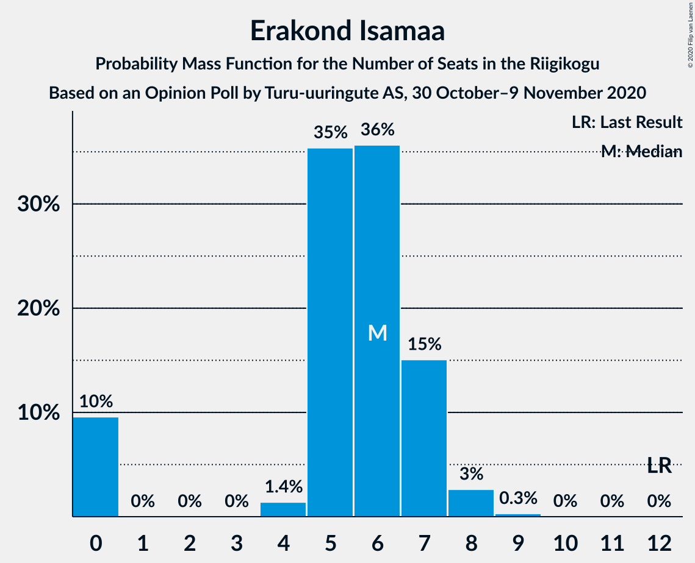
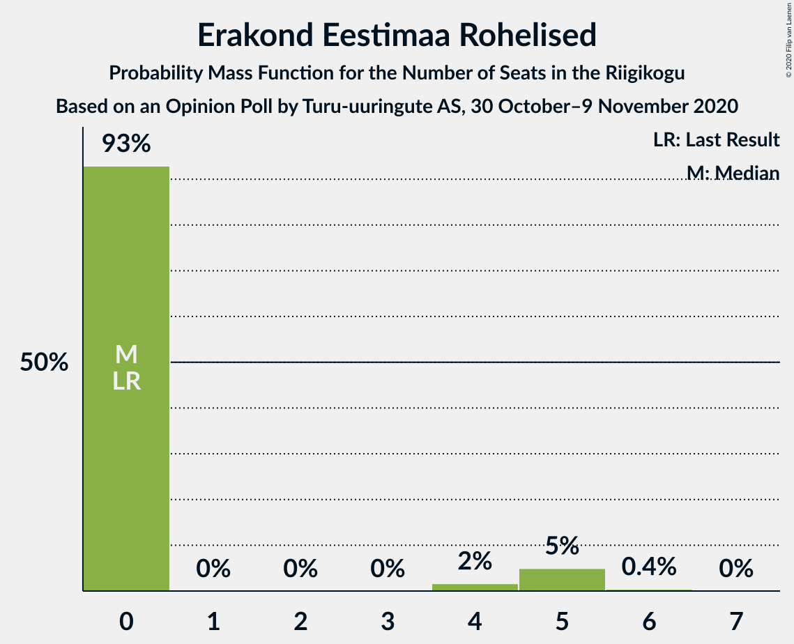

# Opinion Poll by Turu-uuringute AS, 30 October–9 November 2020

<a href="#voting-intentions">Voting Intentions</a> | <a href="#seats">Seats</a> | <a href="#coalitions">Coalitions</a> | <a href="#technical-information">Technical Information</a>

## Voting Intentions

### Confidence Intervals

| Party | Last Result | Poll Result | 80% Confidence Interval | 90% Confidence Interval | 95% Confidence Interval | 99% Confidence Interval |
|:-----:|:-----------:|:-----------:|:-----------------------:|:-----------------------:|:-----------------------:|:-----------------------:|
| Eesti Keskerakond | 23.1% | 24.0% | 22.2–26.0% |21.7–26.5% |21.3–27.0% |20.4–27.9% |
| Eesti Reformierakond | 28.9% | 23.0% | 21.2–24.9% |20.7–25.4% |20.3–25.9% |19.4–26.8% |
| Eesti Konservatiivne Rahvaerakond | 17.8% | 15.0% | 13.5–16.7% |13.1–17.1% |12.7–17.5% |12.1–18.4% |
| Eesti 200 | 4.4% | 13.0% | 11.6–14.6% |11.2–15.0% |10.9–15.4% |10.3–16.2% |
| Sotsiaaldemokraatlik Erakond | 9.8% | 10.0% | 8.7–11.4% |8.4–11.8% |8.1–12.1% |7.6–12.9% |
| Erakond Isamaa | 11.4% | 6.0% | 5.0–7.1% |4.8–7.5% |4.6–7.8% |4.2–8.4% |
| Erakond Eestimaa Rohelised | 1.8% | 4.0% | 3.2–5.0% |3.0–5.3% |2.9–5.5% |2.5–6.0% |
| Eesti Vabaerakond | 1.2% | 1.1% | 0.7–1.7% |0.6–1.8% |0.5–2.0% |0.4–2.3% |

*Note:* The poll result column reflects the actual value used in the calculations. Published results may vary slightly, and in addition be rounded to fewer digits.

## Seats

### Confidence Intervals

| Party | Last Result | Median | 80% Confidence Interval | 90% Confidence Interval | 95% Confidence Interval | 99% Confidence Interval |
|:-----:|:-----------:|:------:|:-----------------------:|:-----------------------:|:-----------------------:|:-----------------------:|
| <a href="#eesti-keskerakond">Eesti Keskerakond</a> | 26 | 28 | 25–30 |25–31 |24–32 |23–33 |
| <a href="#eesti-reformierakond">Eesti Reformierakond</a> | 34 | 26 | 24–29 |23–30 |23–30 |22–32 |
| <a href="#eesti-konservatiivne-rahvaerakond">Eesti Konservatiivne Rahvaerakond</a> | 19 | 16 | 14–19 |14–19 |14–20 |13–21 |
| <a href="#eesti-200">Eesti 200</a> | 0 | 14 | 12–16 |12–16 |11–17 |10–18 |
| <a href="#sotsiaaldemokraatlik-erakond">Sotsiaaldemokraatlik Erakond</a> | 10 | 10 | 9–12 |8–12 |8–13 |7–14 |
| <a href="#erakond-isamaa">Erakond Isamaa</a> | 12 | 6 | 4–7 |0–7 |0–8 |0–8 |
| <a href="#erakond-eestimaa-rohelised">Erakond Eestimaa Rohelised</a> | 0 | 0 | 0 |0–5 |0–5 |0–5 |
| <a href="#eesti-vabaerakond">Eesti Vabaerakond</a> | 0 | 0 | 0 |0 |0 |0 |

### Eesti Keskerakond

*For a full overview of the results for this party, see the [Eesti Keskerakond](party-eestikeskerakond.html) page.*

| Number of Seats | Probability | Accumulated | Special Marks |
|:---------------:|:-----------:|:-----------:|:-------------:|
| 22 | 0.2% | 100% |  |
| 23 | 1.3% | 99.8% |  |
| 24 | 3% | 98% |  |
| 25 | 8% | 96% |  |
| 26 | 14% | 87% | Last Result |
| 27 | 15% | 73% |  |
| 28 | 20% | 58% | Median |
| 29 | 16% | 38% |  |
| 30 | 12% | 22% |  |
| 31 | 7% | 10% |  |
| 32 | 2% | 3% |  |
| 33 | 1.0% | 1.3% |  |
| 34 | 0.3% | 0.3% |  |
| 35 | 0.1% | 0.1% |  |
| 36 | 0% | 0% |  |

### Eesti Reformierakond

*For a full overview of the results for this party, see the [Eesti Reformierakond](party-eestireformierakond.html) page.*

| Number of Seats | Probability | Accumulated | Special Marks |
|:---------------:|:-----------:|:-----------:|:-------------:|
| 20 | 0.1% | 100% |  |
| 21 | 0.3% | 99.9% |  |
| 22 | 1.5% | 99.6% |  |
| 23 | 4% | 98% |  |
| 24 | 12% | 94% |  |
| 25 | 15% | 81% |  |
| 26 | 18% | 66% | Median |
| 27 | 19% | 48% |  |
| 28 | 15% | 29% |  |
| 29 | 7% | 14% |  |
| 30 | 5% | 7% |  |
| 31 | 1.4% | 2% |  |
| 32 | 0.4% | 0.7% |  |
| 33 | 0.2% | 0.2% |  |
| 34 | 0% | 0% | Last Result |

### Eesti Konservatiivne Rahvaerakond

*For a full overview of the results for this party, see the [Eesti Konservatiivne Rahvaerakond](party-eestikonservatiivnerahvaerakond.html) page.*

| Number of Seats | Probability | Accumulated | Special Marks |
|:---------------:|:-----------:|:-----------:|:-------------:|
| 12 | 0.3% | 100% |  |
| 13 | 2% | 99.6% |  |
| 14 | 9% | 98% |  |
| 15 | 23% | 89% |  |
| 16 | 25% | 66% | Median |
| 17 | 19% | 41% |  |
| 18 | 11% | 21% |  |
| 19 | 7% | 10% | Last Result |
| 20 | 2% | 3% |  |
| 21 | 0.5% | 0.6% |  |
| 22 | 0.1% | 0.1% |  |
| 23 | 0% | 0% |  |

### Eesti 200

*For a full overview of the results for this party, see the [Eesti 200](party-eesti200.html) page.*

| Number of Seats | Probability | Accumulated | Special Marks |
|:---------------:|:-----------:|:-----------:|:-------------:|
| 0 | 0% | 100% | Last Result |
| 1 | 0% | 100% |  |
| 2 | 0% | 100% |  |
| 3 | 0% | 100% |  |
| 4 | 0% | 100% |  |
| 5 | 0% | 100% |  |
| 6 | 0% | 100% |  |
| 7 | 0% | 100% |  |
| 8 | 0% | 100% |  |
| 9 | 0% | 100% |  |
| 10 | 0.6% | 100% |  |
| 11 | 4% | 99.4% |  |
| 12 | 12% | 95% |  |
| 13 | 24% | 83% |  |
| 14 | 24% | 59% | Median |
| 15 | 20% | 36% |  |
| 16 | 12% | 16% |  |
| 17 | 3% | 4% |  |
| 18 | 1.0% | 1.2% |  |
| 19 | 0.1% | 0.2% |  |
| 20 | 0% | 0% |  |

### Sotsiaaldemokraatlik Erakond

*For a full overview of the results for this party, see the [Sotsiaaldemokraatlik Erakond](party-sotsiaaldemokraatlikerakond.html) page.*

| Number of Seats | Probability | Accumulated | Special Marks |
|:---------------:|:-----------:|:-----------:|:-------------:|
| 7 | 0.8% | 100% |  |
| 8 | 6% | 99.1% |  |
| 9 | 24% | 93% |  |
| 10 | 28% | 69% | Last Result, Median |
| 11 | 25% | 41% |  |
| 12 | 11% | 16% |  |
| 13 | 4% | 5% |  |
| 14 | 0.7% | 0.8% |  |
| 15 | 0.1% | 0.1% |  |
| 16 | 0% | 0% |  |

### Erakond Isamaa

*For a full overview of the results for this party, see the [Erakond Isamaa](party-erakondisamaa.html) page.*

| Number of Seats | Probability | Accumulated | Special Marks |
|:---------------:|:-----------:|:-----------:|:-------------:|
| 0 | 10% | 100% |  |
| 1 | 0% | 90% |  |
| 2 | 0% | 90% |  |
| 3 | 0% | 90% |  |
| 4 | 1.4% | 90% |  |
| 5 | 35% | 89% |  |
| 6 | 36% | 54% | Median |
| 7 | 15% | 18% |  |
| 8 | 3% | 3% |  |
| 9 | 0.3% | 0.3% |  |
| 10 | 0% | 0% |  |
| 11 | 0% | 0% |  |
| 12 | 0% | 0% | Last Result |

### Erakond Eestimaa Rohelised

*For a full overview of the results for this party, see the [Erakond Eestimaa Rohelised](party-erakondeestimaarohelised.html) page.*

| Number of Seats | Probability | Accumulated | Special Marks |
|:---------------:|:-----------:|:-----------:|:-------------:|
| 0 | 93% | 100% | Last Result, Median |
| 1 | 0% | 7% |  |
| 2 | 0% | 7% |  |
| 3 | 0% | 7% |  |
| 4 | 2% | 7% |  |
| 5 | 5% | 5% |  |
| 6 | 0.4% | 0.5% |  |
| 7 | 0% | 0% |  |

### Eesti Vabaerakond

*For a full overview of the results for this party, see the [Eesti Vabaerakond](party-eestivabaerakond.html) page.*

| Number of Seats | Probability | Accumulated | Special Marks |
|:---------------:|:-----------:|:-----------:|:-------------:|
| 0 | 100% | 100% | Last Result, Median |

## Coalitions

### Confidence Intervals

| Coalition | Last Result | Median | Majority? | 80% Confidence Interval | 90% Confidence Interval | 95% Confidence Interval | 99% Confidence Interval |
|:---------:|:-----------:|:------:|:---------:|:-----------------------:|:-----------------------:|:-----------------------:|:-----------------------:|
| Eesti Keskerakond – Eesti Reformierakond – Eesti Konservatiivne Rahvaerakond | 79 | 70 | 100% | 67–74 | 66–75 | 65–76 | 63–79 |
| Eesti Keskerakond – Eesti Reformierakond | 60 | 54 | 94% | 51–58 | 50–58 | 49–60 | 48–61 |
| Eesti Keskerakond – Eesti Konservatiivne Rahvaerakond – Erakond Isamaa | 57 | 50 | 33% | 46–52 | 45–53 | 44–54 | 42–55 |
| Eesti Reformierakond – Eesti Konservatiivne Rahvaerakond – Erakond Isamaa | 65 | 48 | 18% | 45–52 | 44–52 | 43–53 | 41–54 |
| Eesti Keskerakond – Eesti Konservatiivne Rahvaerakond | 45 | 44 | 0.6% | 41–47 | 40–48 | 40–49 | 38–51 |
| Eesti Keskerakond – Sotsiaaldemokraatlik Erakond – Erakond Isamaa | 48 | 43 | 0.1% | 40–47 | 39–47 | 38–48 | 36–49 |
| Eesti Reformierakond – Eesti Konservatiivne Rahvaerakond | 53 | 42 | 0.1% | 40–46 | 39–47 | 38–47 | 37–49 |
| Eesti Reformierakond – Sotsiaaldemokraatlik Erakond – Erakond Isamaa – Eesti Vabaerakond | 56 | 42 | 0% | 39–45 | 38–46 | 37–46 | 35–48 |
| Eesti Reformierakond – Sotsiaaldemokraatlik Erakond – Erakond Isamaa | 56 | 42 | 0% | 39–45 | 38–46 | 37–46 | 35–48 |
| Eesti Keskerakond – Sotsiaaldemokraatlik Erakond | 36 | 38 | 0% | 35–41 | 34–42 | 34–43 | 32–44 |
| Eesti Reformierakond – Sotsiaaldemokraatlik Erakond | 44 | 36 | 0% | 34–39 | 33–40 | 32–41 | 31–43 |
| Eesti Reformierakond – Erakond Isamaa | 46 | 32 | 0% | 29–35 | 28–35 | 27–36 | 25–37 |
| Eesti Konservatiivne Rahvaerakond – Sotsiaaldemokraatlik Erakond | 29 | 26 | 0% | 24–29 | 23–30 | 23–30 | 22–32 |

### Eesti Keskerakond – Eesti Reformierakond – Eesti Konservatiivne Rahvaerakond

| Number of Seats | Probability | Accumulated | Special Marks |
|:---------------:|:-----------:|:-----------:|:-------------:|
| 62 | 0.1% | 100% |  |
| 63 | 0.5% | 99.9% |  |
| 64 | 0.8% | 99.4% |  |
| 65 | 1.3% | 98.6% |  |
| 66 | 3% | 97% |  |
| 67 | 6% | 94% |  |
| 68 | 11% | 88% |  |
| 69 | 10% | 77% |  |
| 70 | 18% | 67% | Median |
| 71 | 16% | 49% |  |
| 72 | 10% | 34% |  |
| 73 | 11% | 23% |  |
| 74 | 5% | 12% |  |
| 75 | 4% | 8% |  |
| 76 | 1.1% | 3% |  |
| 77 | 2% | 2% |  |
| 78 | 0.3% | 0.8% |  |
| 79 | 0.5% | 0.5% | Last Result |
| 80 | 0% | 0% |  |

### Eesti Keskerakond – Eesti Reformierakond

| Number of Seats | Probability | Accumulated | Special Marks |
|:---------------:|:-----------:|:-----------:|:-------------:|
| 46 | 0.1% | 100% |  |
| 47 | 0.3% | 99.9% |  |
| 48 | 0.9% | 99.7% |  |
| 49 | 2% | 98.8% |  |
| 50 | 3% | 97% |  |
| 51 | 8% | 94% | Majority |
| 52 | 11% | 86% |  |
| 53 | 13% | 75% |  |
| 54 | 18% | 62% | Median |
| 55 | 13% | 44% |  |
| 56 | 12% | 31% |  |
| 57 | 6% | 19% |  |
| 58 | 7% | 12% |  |
| 59 | 2% | 5% |  |
| 60 | 1.5% | 3% | Last Result |
| 61 | 0.7% | 1.1% |  |
| 62 | 0.2% | 0.4% |  |
| 63 | 0.2% | 0.2% |  |
| 64 | 0% | 0% |  |

### Eesti Keskerakond – Eesti Konservatiivne Rahvaerakond – Erakond Isamaa

| Number of Seats | Probability | Accumulated | Special Marks |
|:---------------:|:-----------:|:-----------:|:-------------:|
| 40 | 0% | 100% |  |
| 41 | 0.2% | 99.9% |  |
| 42 | 0.3% | 99.8% |  |
| 43 | 0.6% | 99.5% |  |
| 44 | 2% | 98.8% |  |
| 45 | 4% | 97% |  |
| 46 | 5% | 93% |  |
| 47 | 11% | 88% |  |
| 48 | 12% | 78% |  |
| 49 | 13% | 66% |  |
| 50 | 19% | 52% | Median |
| 51 | 13% | 33% | Majority |
| 52 | 10% | 20% |  |
| 53 | 6% | 10% |  |
| 54 | 2% | 4% |  |
| 55 | 1.0% | 1.4% |  |
| 56 | 0.3% | 0.4% |  |
| 57 | 0.1% | 0.1% | Last Result |
| 58 | 0% | 0% |  |

### Eesti Reformierakond – Eesti Konservatiivne Rahvaerakond – Erakond Isamaa

| Number of Seats | Probability | Accumulated | Special Marks |
|:---------------:|:-----------:|:-----------:|:-------------:|
| 39 | 0.1% | 100% |  |
| 40 | 0.1% | 99.9% |  |
| 41 | 0.4% | 99.7% |  |
| 42 | 0.9% | 99.3% |  |
| 43 | 2% | 98% |  |
| 44 | 4% | 97% |  |
| 45 | 8% | 93% |  |
| 46 | 10% | 84% |  |
| 47 | 17% | 74% |  |
| 48 | 23% | 58% | Median |
| 49 | 9% | 35% |  |
| 50 | 7% | 25% |  |
| 51 | 8% | 18% | Majority |
| 52 | 7% | 10% |  |
| 53 | 2% | 3% |  |
| 54 | 0.4% | 0.5% |  |
| 55 | 0.1% | 0.1% |  |
| 56 | 0% | 0.1% |  |
| 57 | 0% | 0% |  |
| 58 | 0% | 0% |  |
| 59 | 0% | 0% |  |
| 60 | 0% | 0% |  |
| 61 | 0% | 0% |  |
| 62 | 0% | 0% |  |
| 63 | 0% | 0% |  |
| 64 | 0% | 0% |  |
| 65 | 0% | 0% | Last Result |

### Eesti Keskerakond – Eesti Konservatiivne Rahvaerakond

| Number of Seats | Probability | Accumulated | Special Marks |
|:---------------:|:-----------:|:-----------:|:-------------:|
| 37 | 0.1% | 100% |  |
| 38 | 0.5% | 99.8% |  |
| 39 | 1.3% | 99.3% |  |
| 40 | 5% | 98% |  |
| 41 | 7% | 93% |  |
| 42 | 10% | 86% |  |
| 43 | 13% | 76% |  |
| 44 | 20% | 63% | Median |
| 45 | 12% | 42% | Last Result |
| 46 | 14% | 30% |  |
| 47 | 8% | 16% |  |
| 48 | 4% | 7% |  |
| 49 | 2% | 3% |  |
| 50 | 0.5% | 1.2% |  |
| 51 | 0.4% | 0.6% | Majority |
| 52 | 0.1% | 0.2% |  |
| 53 | 0% | 0% |  |

### Eesti Keskerakond – Sotsiaaldemokraatlik Erakond – Erakond Isamaa

| Number of Seats | Probability | Accumulated | Special Marks |
|:---------------:|:-----------:|:-----------:|:-------------:|
| 34 | 0.1% | 100% |  |
| 35 | 0.2% | 99.9% |  |
| 36 | 0.4% | 99.8% |  |
| 37 | 0.9% | 99.4% |  |
| 38 | 2% | 98% |  |
| 39 | 3% | 97% |  |
| 40 | 6% | 93% |  |
| 41 | 10% | 88% |  |
| 42 | 13% | 78% |  |
| 43 | 17% | 65% |  |
| 44 | 16% | 49% | Median |
| 45 | 13% | 33% |  |
| 46 | 9% | 20% |  |
| 47 | 8% | 11% |  |
| 48 | 3% | 4% | Last Result |
| 49 | 0.7% | 1.0% |  |
| 50 | 0.2% | 0.2% |  |
| 51 | 0% | 0.1% | Majority |
| 52 | 0% | 0% |  |

### Eesti Reformierakond – Eesti Konservatiivne Rahvaerakond

| Number of Seats | Probability | Accumulated | Special Marks |
|:---------------:|:-----------:|:-----------:|:-------------:|
| 35 | 0.1% | 100% |  |
| 36 | 0.2% | 99.9% |  |
| 37 | 0.6% | 99.7% |  |
| 38 | 2% | 99.1% |  |
| 39 | 5% | 97% |  |
| 40 | 10% | 92% |  |
| 41 | 13% | 82% |  |
| 42 | 19% | 69% | Median |
| 43 | 16% | 49% |  |
| 44 | 10% | 34% |  |
| 45 | 10% | 23% |  |
| 46 | 8% | 14% |  |
| 47 | 4% | 6% |  |
| 48 | 0.9% | 2% |  |
| 49 | 0.6% | 1.0% |  |
| 50 | 0.3% | 0.4% |  |
| 51 | 0.1% | 0.1% | Majority |
| 52 | 0% | 0% |  |
| 53 | 0% | 0% | Last Result |

### Eesti Reformierakond – Sotsiaaldemokraatlik Erakond – Erakond Isamaa – Eesti Vabaerakond

| Number of Seats | Probability | Accumulated | Special Marks |
|:---------------:|:-----------:|:-----------:|:-------------:|
| 33 | 0.1% | 100% |  |
| 34 | 0.3% | 99.9% |  |
| 35 | 0.5% | 99.6% |  |
| 36 | 1.0% | 99.1% |  |
| 37 | 2% | 98% |  |
| 38 | 4% | 96% |  |
| 39 | 9% | 92% |  |
| 40 | 11% | 83% |  |
| 41 | 13% | 72% |  |
| 42 | 19% | 59% | Median |
| 43 | 15% | 40% |  |
| 44 | 11% | 25% |  |
| 45 | 8% | 15% |  |
| 46 | 4% | 6% |  |
| 47 | 2% | 2% |  |
| 48 | 0.5% | 0.7% |  |
| 49 | 0.1% | 0.2% |  |
| 50 | 0% | 0% |  |
| 51 | 0% | 0% | Majority |
| 52 | 0% | 0% |  |
| 53 | 0% | 0% |  |
| 54 | 0% | 0% |  |
| 55 | 0% | 0% |  |
| 56 | 0% | 0% | Last Result |

### Eesti Reformierakond – Sotsiaaldemokraatlik Erakond – Erakond Isamaa

| Number of Seats | Probability | Accumulated | Special Marks |
|:---------------:|:-----------:|:-----------:|:-------------:|
| 33 | 0.1% | 100% |  |
| 34 | 0.3% | 99.9% |  |
| 35 | 0.5% | 99.6% |  |
| 36 | 1.0% | 99.1% |  |
| 37 | 2% | 98% |  |
| 38 | 4% | 96% |  |
| 39 | 9% | 92% |  |
| 40 | 11% | 83% |  |
| 41 | 13% | 72% |  |
| 42 | 19% | 59% | Median |
| 43 | 15% | 40% |  |
| 44 | 11% | 25% |  |
| 45 | 8% | 15% |  |
| 46 | 4% | 6% |  |
| 47 | 2% | 2% |  |
| 48 | 0.5% | 0.7% |  |
| 49 | 0.1% | 0.2% |  |
| 50 | 0% | 0% |  |
| 51 | 0% | 0% | Majority |
| 52 | 0% | 0% |  |
| 53 | 0% | 0% |  |
| 54 | 0% | 0% |  |
| 55 | 0% | 0% |  |
| 56 | 0% | 0% | Last Result |

### Eesti Keskerakond – Sotsiaaldemokraatlik Erakond

| Number of Seats | Probability | Accumulated | Special Marks |
|:---------------:|:-----------:|:-----------:|:-------------:|
| 31 | 0.1% | 100% |  |
| 32 | 0.4% | 99.8% |  |
| 33 | 2% | 99.4% |  |
| 34 | 3% | 98% |  |
| 35 | 10% | 95% |  |
| 36 | 8% | 85% | Last Result |
| 37 | 18% | 76% |  |
| 38 | 16% | 59% | Median |
| 39 | 13% | 42% |  |
| 40 | 14% | 29% |  |
| 41 | 8% | 16% |  |
| 42 | 4% | 7% |  |
| 43 | 2% | 3% |  |
| 44 | 0.8% | 1.1% |  |
| 45 | 0.2% | 0.3% |  |
| 46 | 0.1% | 0.1% |  |
| 47 | 0% | 0% |  |

### Eesti Reformierakond – Sotsiaaldemokraatlik Erakond

| Number of Seats | Probability | Accumulated | Special Marks |
|:---------------:|:-----------:|:-----------:|:-------------:|
| 30 | 0.2% | 100% |  |
| 31 | 0.5% | 99.8% |  |
| 32 | 2% | 99.3% |  |
| 33 | 5% | 97% |  |
| 34 | 10% | 92% |  |
| 35 | 16% | 82% |  |
| 36 | 16% | 66% | Median |
| 37 | 13% | 50% |  |
| 38 | 15% | 37% |  |
| 39 | 12% | 22% |  |
| 40 | 5% | 10% |  |
| 41 | 2% | 5% |  |
| 42 | 2% | 2% |  |
| 43 | 0.3% | 0.5% |  |
| 44 | 0.2% | 0.3% | Last Result |
| 45 | 0% | 0% |  |

### Eesti Reformierakond – Erakond Isamaa

| Number of Seats | Probability | Accumulated | Special Marks |
|:---------------:|:-----------:|:-----------:|:-------------:|
| 23 | 0.1% | 100% |  |
| 24 | 0.4% | 99.9% |  |
| 25 | 0.6% | 99.5% |  |
| 26 | 1.1% | 98.9% |  |
| 27 | 2% | 98% |  |
| 28 | 5% | 96% |  |
| 29 | 8% | 90% |  |
| 30 | 10% | 82% |  |
| 31 | 17% | 72% |  |
| 32 | 17% | 55% | Median |
| 33 | 18% | 38% |  |
| 34 | 8% | 19% |  |
| 35 | 7% | 11% |  |
| 36 | 3% | 5% |  |
| 37 | 0.7% | 1.1% |  |
| 38 | 0.4% | 0.4% |  |
| 39 | 0% | 0.1% |  |
| 40 | 0% | 0% |  |
| 41 | 0% | 0% |  |
| 42 | 0% | 0% |  |
| 43 | 0% | 0% |  |
| 44 | 0% | 0% |  |
| 45 | 0% | 0% |  |
| 46 | 0% | 0% | Last Result |

### Eesti Konservatiivne Rahvaerakond – Sotsiaaldemokraatlik Erakond

| Number of Seats | Probability | Accumulated | Special Marks |
|:---------------:|:-----------:|:-----------:|:-------------:|
| 21 | 0.3% | 100% |  |
| 22 | 1.0% | 99.7% |  |
| 23 | 4% | 98.7% |  |
| 24 | 8% | 94% |  |
| 25 | 19% | 87% |  |
| 26 | 19% | 67% | Median |
| 27 | 19% | 49% |  |
| 28 | 14% | 30% |  |
| 29 | 9% | 16% | Last Result |
| 30 | 5% | 7% |  |
| 31 | 1.4% | 2% |  |
| 32 | 0.6% | 0.8% |  |
| 33 | 0.2% | 0.2% |  |
| 34 | 0% | 0% |  |

## Technical Information

### Opinion Poll

+ **Polling firm:** Turu-uuringute AS
+ **Commissioner(s):** —
+ **Fieldwork period:** 30 October–9 November 2020

### Calculations

+ **Sample size:** 854
+ **Simulations done:** 1,048,576
+ **Error estimate:** 2.29%

