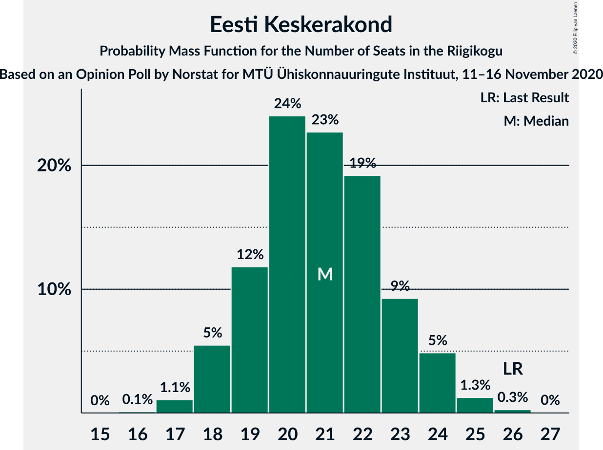
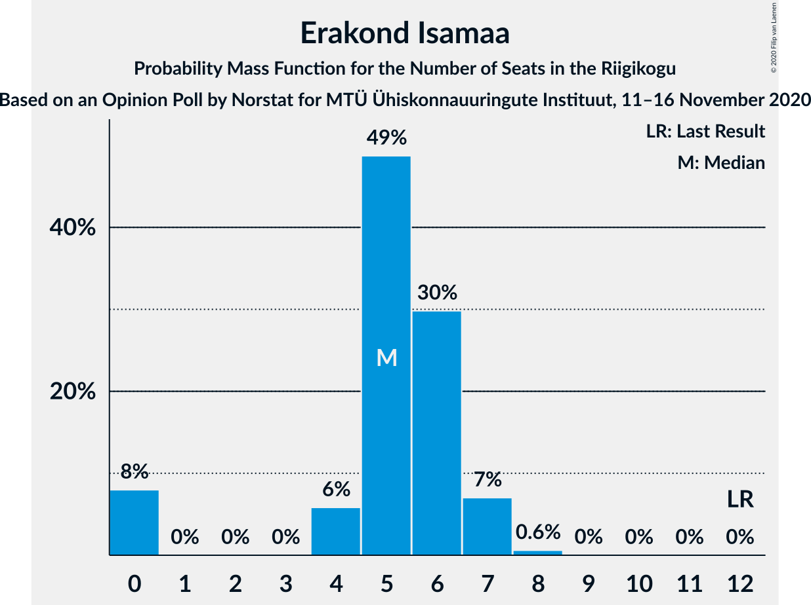

# Opinion Poll by Norstat for MTÜ Ühiskonnauuringute Instituut, 11–16 November 2020

<a href="#voting-intentions">Voting Intentions</a> | <a href="#seats">Seats</a> | <a href="#coalitions">Coalitions</a> | <a href="#technical-information">Technical Information</a>

## Voting Intentions

### Confidence Intervals

| Party | Last Result | Poll Result | 80% Confidence Interval | 90% Confidence Interval | 95% Confidence Interval | 99% Confidence Interval |
|:-----:|:-----------:|:-----------:|:-----------------------:|:-----------------------:|:-----------------------:|:-----------------------:|
| Eesti Reformierakond | 28.9% | 33.7% | 31.8–35.7% |31.3–36.2% |30.8–36.7% |29.9–37.6% |
| Eesti Keskerakond | 23.1% | 19.6% | 18.1–21.3% |17.6–21.8% |17.3–22.2% |16.5–23.0% |
| Eesti Konservatiivne Rahvaerakond | 17.8% | 14.6% | 13.2–16.1% |12.9–16.6% |12.5–16.9% |11.9–17.7% |
| Eesti 200 | 4.4% | 13.4% | 12.1–14.9% |11.7–15.3% |11.4–15.7% |10.8–16.4% |
| Sotsiaaldemokraatlik Erakond | 9.8% | 8.3% | 7.3–9.5% |7.0–9.9% |6.7–10.2% |6.3–10.8% |
| Erakond Isamaa | 11.4% | 6.0% | 5.1–7.1% |4.9–7.4% |4.7–7.7% |4.3–8.2% |
| Erakond Eestimaa Rohelised | 1.8% | 2.3% | 1.8–3.0% |1.6–3.2% |1.5–3.4% |1.3–3.8% |
| Eesti Vabaerakond | 1.2% | 0.6% | 0.4–1.1% |0.3–1.2% |0.3–1.3% |0.2–1.6% |

*Note:* The poll result column reflects the actual value used in the calculations. Published results may vary slightly, and in addition be rounded to fewer digits.

## Seats

### Confidence Intervals

| Party | Last Result | Median | 80% Confidence Interval | 90% Confidence Interval | 95% Confidence Interval | 99% Confidence Interval |
|:-----:|:-----------:|:------:|:-----------------------:|:-----------------------:|:-----------------------:|:-----------------------:|
| <a href="#eesti-reformierakond">Eesti Reformierakond</a> | 34 | 38 | 36–41 |35–41 |34–42 |34–43 |
| <a href="#eesti-keskerakond">Eesti Keskerakond</a> | 26 | 22 | 19–23 |18–24 |18–24 |17–25 |
| <a href="#eesti-konservatiivne-rahvaerakond">Eesti Konservatiivne Rahvaerakond</a> | 19 | 15 | 13–17 |13–18 |12–18 |12–19 |
| <a href="#eesti-200">Eesti 200</a> | 0 | 14 | 12–15 |11–16 |11–16 |10–17 |
| <a href="#sotsiaaldemokraatlik-erakond">Sotsiaaldemokraatlik Erakond</a> | 10 | 8 | 7–9 |6–10 |6–10 |6–11 |
| <a href="#erakond-isamaa">Erakond Isamaa</a> | 12 | 5 | 4–6 |0–7 |0–7 |0–8 |
| <a href="#erakond-eestimaa-rohelised">Erakond Eestimaa Rohelised</a> | 0 | 0 | 0 |0 |0 |0 |
| <a href="#eesti-vabaerakond">Eesti Vabaerakond</a> | 0 | 0 | 0 |0 |0 |0 |

### Eesti Reformierakond

*For a full overview of the results for this party, see the [Eesti Reformierakond](party-eestireformierakond.html) page.*

| Number of Seats | Probability | Accumulated | Special Marks |
|:---------------:|:-----------:|:-----------:|:-------------:|
| 32 | 0.1% | 100% |  |
| 33 | 0.2% | 99.9% |  |
| 34 | 3% | 99.7% | Last Result |
| 35 | 6% | 97% |  |
| 36 | 8% | 91% |  |
| 37 | 14% | 83% |  |
| 38 | 28% | 69% | Median |
| 39 | 15% | 41% |  |
| 40 | 13% | 26% |  |
| 41 | 9% | 13% |  |
| 42 | 3% | 4% |  |
| 43 | 0.8% | 1.3% |  |
| 44 | 0.2% | 0.5% |  |
| 45 | 0.1% | 0.2% |  |
| 46 | 0.1% | 0.1% |  |
| 47 | 0% | 0% |  |

### Eesti Keskerakond

*For a full overview of the results for this party, see the [Eesti Keskerakond](party-eestikeskerakond.html) page.*

| Number of Seats | Probability | Accumulated | Special Marks |
|:---------------:|:-----------:|:-----------:|:-------------:|
| 16 | 0.1% | 100% |  |
| 17 | 2% | 99.8% |  |
| 18 | 4% | 98% |  |
| 19 | 9% | 93% |  |
| 20 | 10% | 84% |  |
| 21 | 11% | 73% |  |
| 22 | 38% | 62% | Median |
| 23 | 15% | 24% |  |
| 24 | 7% | 9% |  |
| 25 | 1.3% | 1.4% |  |
| 26 | 0.1% | 0.2% | Last Result |
| 27 | 0% | 0% |  |

### Eesti Konservatiivne Rahvaerakond

*For a full overview of the results for this party, see the [Eesti Konservatiivne Rahvaerakond](party-eestikonservatiivnerahvaerakond.html) page.*

| Number of Seats | Probability | Accumulated | Special Marks |
|:---------------:|:-----------:|:-----------:|:-------------:|
| 11 | 0.2% | 100% |  |
| 12 | 3% | 99.8% |  |
| 13 | 12% | 97% |  |
| 14 | 27% | 85% |  |
| 15 | 29% | 57% | Median |
| 16 | 14% | 29% |  |
| 17 | 7% | 15% |  |
| 18 | 7% | 8% |  |
| 19 | 0.9% | 1.4% | Last Result |
| 20 | 0.5% | 0.5% |  |
| 21 | 0% | 0% |  |

### Eesti 200

*For a full overview of the results for this party, see the [Eesti 200](party-eesti200.html) page.*

| Number of Seats | Probability | Accumulated | Special Marks |
|:---------------:|:-----------:|:-----------:|:-------------:|
| 0 | 0% | 100% | Last Result |
| 1 | 0% | 100% |  |
| 2 | 0% | 100% |  |
| 3 | 0% | 100% |  |
| 4 | 0% | 100% |  |
| 5 | 0% | 100% |  |
| 6 | 0% | 100% |  |
| 7 | 0% | 100% |  |
| 8 | 0% | 100% |  |
| 9 | 0% | 100% |  |
| 10 | 0.6% | 100% |  |
| 11 | 9% | 99.3% |  |
| 12 | 14% | 90% |  |
| 13 | 23% | 76% |  |
| 14 | 32% | 53% | Median |
| 15 | 15% | 21% |  |
| 16 | 5% | 6% |  |
| 17 | 1.0% | 1.2% |  |
| 18 | 0.2% | 0.2% |  |
| 19 | 0% | 0% |  |

### Sotsiaaldemokraatlik Erakond

*For a full overview of the results for this party, see the [Sotsiaaldemokraatlik Erakond](party-sotsiaaldemokraatlikerakond.html) page.*

| Number of Seats | Probability | Accumulated | Special Marks |
|:---------------:|:-----------:|:-----------:|:-------------:|
| 5 | 0.2% | 100% |  |
| 6 | 9% | 99.8% |  |
| 7 | 36% | 91% |  |
| 8 | 31% | 55% | Median |
| 9 | 17% | 24% |  |
| 10 | 6% | 7% | Last Result |
| 11 | 1.3% | 1.3% |  |
| 12 | 0% | 0% |  |

### Erakond Isamaa

*For a full overview of the results for this party, see the [Erakond Isamaa](party-erakondisamaa.html) page.*

| Number of Seats | Probability | Accumulated | Special Marks |
|:---------------:|:-----------:|:-----------:|:-------------:|
| 0 | 8% | 100% |  |
| 1 | 0% | 92% |  |
| 2 | 0% | 92% |  |
| 3 | 0% | 92% |  |
| 4 | 8% | 92% |  |
| 5 | 35% | 85% | Median |
| 6 | 43% | 50% |  |
| 7 | 6% | 7% |  |
| 8 | 0.7% | 0.7% |  |
| 9 | 0% | 0% |  |
| 10 | 0% | 0% |  |
| 11 | 0% | 0% |  |
| 12 | 0% | 0% | Last Result |

### Erakond Eestimaa Rohelised

*For a full overview of the results for this party, see the [Erakond Eestimaa Rohelised](party-erakondeestimaarohelised.html) page.*

| Number of Seats | Probability | Accumulated | Special Marks |
|:---------------:|:-----------:|:-----------:|:-------------:|
| 0 | 100% | 100% | Last Result, Median |

### Eesti Vabaerakond

*For a full overview of the results for this party, see the [Eesti Vabaerakond](party-eestivabaerakond.html) page.*

| Number of Seats | Probability | Accumulated | Special Marks |
|:---------------:|:-----------:|:-----------:|:-------------:|
| 0 | 100% | 100% | Last Result, Median |

## Coalitions

### Confidence Intervals

| Coalition | Last Result | Median | Majority? | 80% Confidence Interval | 90% Confidence Interval | 95% Confidence Interval | 99% Confidence Interval |
|:---------:|:-----------:|:------:|:---------:|:-----------------------:|:-----------------------:|:-----------------------:|:-----------------------:|
| Eesti Reformierakond – Eesti Keskerakond – Eesti Konservatiivne Rahvaerakond | 79 | 75 | 100% | 72–77 | 72–79 | 71–79 | 70–80 |
| Eesti Reformierakond – Eesti Keskerakond | 60 | 60 | 100% | 57–62 | 56–63 | 55–64 | 54–65 |
| Eesti Reformierakond – Eesti Konservatiivne Rahvaerakond – Erakond Isamaa | 65 | 58 | 100% | 56–61 | 55–62 | 54–62 | 53–64 |
| Eesti Reformierakond – Eesti Konservatiivne Rahvaerakond | 53 | 53 | 92% | 51–56 | 50–57 | 49–57 | 49–59 |
| Eesti Reformierakond – Sotsiaaldemokraatlik Erakond – Erakond Isamaa – Eesti Vabaerakond | 56 | 51 | 61% | 48–54 | 48–55 | 47–55 | 45–57 |
| Eesti Reformierakond – Sotsiaaldemokraatlik Erakond – Erakond Isamaa | 56 | 51 | 61% | 48–54 | 48–55 | 47–55 | 45–57 |
| Eesti Reformierakond – Sotsiaaldemokraatlik Erakond | 44 | 46 | 3% | 43–49 | 43–50 | 42–51 | 41–51 |
| Eesti Reformierakond – Erakond Isamaa | 46 | 43 | 0% | 40–46 | 40–47 | 39–47 | 37–48 |
| Eesti Keskerakond – Eesti Konservatiivne Rahvaerakond – Erakond Isamaa | 57 | 42 | 0% | 38–44 | 38–44 | 37–45 | 35–46 |
| Eesti Keskerakond – Eesti Konservatiivne Rahvaerakond | 45 | 36 | 0% | 33–39 | 33–40 | 32–40 | 32–42 |
| Eesti Keskerakond – Sotsiaaldemokraatlik Erakond – Erakond Isamaa | 48 | 35 | 0% | 31–37 | 30–37 | 30–38 | 28–39 |
| Eesti Keskerakond – Sotsiaaldemokraatlik Erakond | 36 | 29 | 0% | 27–31 | 26–32 | 25–33 | 24–34 |
| Eesti Konservatiivne Rahvaerakond – Sotsiaaldemokraatlik Erakond | 29 | 22 | 0% | 21–25 | 20–26 | 19–26 | 19–27 |

### Eesti Reformierakond – Eesti Keskerakond – Eesti Konservatiivne Rahvaerakond

| Number of Seats | Probability | Accumulated | Special Marks |
|:---------------:|:-----------:|:-----------:|:-------------:|
| 69 | 0.2% | 100% |  |
| 70 | 0.7% | 99.7% |  |
| 71 | 4% | 99.0% |  |
| 72 | 6% | 95% |  |
| 73 | 25% | 90% |  |
| 74 | 14% | 65% |  |
| 75 | 22% | 51% | Median |
| 76 | 11% | 29% |  |
| 77 | 9% | 18% |  |
| 78 | 4% | 10% |  |
| 79 | 3% | 5% | Last Result |
| 80 | 1.4% | 2% |  |
| 81 | 0.2% | 0.4% |  |
| 82 | 0.1% | 0.2% |  |
| 83 | 0% | 0% |  |

### Eesti Reformierakond – Eesti Keskerakond

| Number of Seats | Probability | Accumulated | Special Marks |
|:---------------:|:-----------:|:-----------:|:-------------:|
| 53 | 0.3% | 100% |  |
| 54 | 0.4% | 99.7% |  |
| 55 | 3% | 99.3% |  |
| 56 | 2% | 96% |  |
| 57 | 8% | 94% |  |
| 58 | 16% | 86% |  |
| 59 | 15% | 70% |  |
| 60 | 24% | 56% | Last Result, Median |
| 61 | 9% | 32% |  |
| 62 | 15% | 23% |  |
| 63 | 3% | 8% |  |
| 64 | 3% | 5% |  |
| 65 | 1.3% | 2% |  |
| 66 | 0.2% | 0.4% |  |
| 67 | 0.1% | 0.2% |  |
| 68 | 0.1% | 0.1% |  |
| 69 | 0% | 0% |  |

### Eesti Reformierakond – Eesti Konservatiivne Rahvaerakond – Erakond Isamaa

| Number of Seats | Probability | Accumulated | Special Marks |
|:---------------:|:-----------:|:-----------:|:-------------:|
| 52 | 0.3% | 100% |  |
| 53 | 1.2% | 99.6% |  |
| 54 | 2% | 98% |  |
| 55 | 4% | 97% |  |
| 56 | 9% | 93% |  |
| 57 | 18% | 83% |  |
| 58 | 24% | 65% | Median |
| 59 | 15% | 41% |  |
| 60 | 11% | 26% |  |
| 61 | 8% | 16% |  |
| 62 | 5% | 7% |  |
| 63 | 1.4% | 2% |  |
| 64 | 0.3% | 0.6% |  |
| 65 | 0.3% | 0.3% | Last Result |
| 66 | 0% | 0% |  |

### Eesti Reformierakond – Eesti Konservatiivne Rahvaerakond

| Number of Seats | Probability | Accumulated | Special Marks |
|:---------------:|:-----------:|:-----------:|:-------------:|
| 47 | 0.1% | 100% |  |
| 48 | 0.3% | 99.9% |  |
| 49 | 3% | 99.6% |  |
| 50 | 4% | 97% |  |
| 51 | 18% | 92% | Majority |
| 52 | 10% | 74% |  |
| 53 | 26% | 64% | Last Result, Median |
| 54 | 10% | 38% |  |
| 55 | 13% | 28% |  |
| 56 | 10% | 16% |  |
| 57 | 4% | 6% |  |
| 58 | 1.4% | 2% |  |
| 59 | 0.7% | 1.0% |  |
| 60 | 0.1% | 0.3% |  |
| 61 | 0.1% | 0.2% |  |
| 62 | 0.1% | 0.1% |  |
| 63 | 0% | 0% |  |

### Eesti Reformierakond – Sotsiaaldemokraatlik Erakond – Erakond Isamaa – Eesti Vabaerakond

| Number of Seats | Probability | Accumulated | Special Marks |
|:---------------:|:-----------:|:-----------:|:-------------:|
| 44 | 0% | 100% |  |
| 45 | 0.5% | 99.9% |  |
| 46 | 1.1% | 99.4% |  |
| 47 | 2% | 98% |  |
| 48 | 7% | 97% |  |
| 49 | 15% | 89% |  |
| 50 | 12% | 74% |  |
| 51 | 19% | 61% | Median, Majority |
| 52 | 11% | 42% |  |
| 53 | 17% | 31% |  |
| 54 | 8% | 14% |  |
| 55 | 4% | 6% |  |
| 56 | 1.0% | 2% | Last Result |
| 57 | 1.0% | 1.1% |  |
| 58 | 0% | 0.1% |  |
| 59 | 0% | 0% |  |

### Eesti Reformierakond – Sotsiaaldemokraatlik Erakond – Erakond Isamaa

| Number of Seats | Probability | Accumulated | Special Marks |
|:---------------:|:-----------:|:-----------:|:-------------:|
| 44 | 0% | 100% |  |
| 45 | 0.5% | 99.9% |  |
| 46 | 1.1% | 99.4% |  |
| 47 | 2% | 98% |  |
| 48 | 7% | 97% |  |
| 49 | 15% | 89% |  |
| 50 | 12% | 74% |  |
| 51 | 19% | 61% | Median, Majority |
| 52 | 11% | 42% |  |
| 53 | 17% | 31% |  |
| 54 | 8% | 14% |  |
| 55 | 4% | 6% |  |
| 56 | 1.0% | 2% | Last Result |
| 57 | 1.0% | 1.1% |  |
| 58 | 0% | 0.1% |  |
| 59 | 0% | 0% |  |

### Eesti Reformierakond – Sotsiaaldemokraatlik Erakond

| Number of Seats | Probability | Accumulated | Special Marks |
|:---------------:|:-----------:|:-----------:|:-------------:|
| 40 | 0.1% | 100% |  |
| 41 | 0.6% | 99.9% |  |
| 42 | 3% | 99.2% |  |
| 43 | 8% | 96% |  |
| 44 | 8% | 88% | Last Result |
| 45 | 27% | 80% |  |
| 46 | 9% | 54% | Median |
| 47 | 20% | 44% |  |
| 48 | 12% | 24% |  |
| 49 | 6% | 12% |  |
| 50 | 3% | 5% |  |
| 51 | 2% | 3% | Majority |
| 52 | 0.3% | 0.5% |  |
| 53 | 0.2% | 0.2% |  |
| 54 | 0% | 0% |  |

### Eesti Reformierakond – Erakond Isamaa

| Number of Seats | Probability | Accumulated | Special Marks |
|:---------------:|:-----------:|:-----------:|:-------------:|
| 36 | 0.4% | 100% |  |
| 37 | 0.5% | 99.6% |  |
| 38 | 0.8% | 99.1% |  |
| 39 | 1.2% | 98% |  |
| 40 | 8% | 97% |  |
| 41 | 6% | 90% |  |
| 42 | 12% | 83% |  |
| 43 | 24% | 71% | Median |
| 44 | 21% | 47% |  |
| 45 | 7% | 26% |  |
| 46 | 13% | 19% | Last Result |
| 47 | 5% | 6% |  |
| 48 | 0.7% | 1.1% |  |
| 49 | 0.3% | 0.4% |  |
| 50 | 0.1% | 0.1% |  |
| 51 | 0% | 0% | Majority |

### Eesti Keskerakond – Eesti Konservatiivne Rahvaerakond – Erakond Isamaa

| Number of Seats | Probability | Accumulated | Special Marks |
|:---------------:|:-----------:|:-----------:|:-------------:|
| 33 | 0.1% | 100% |  |
| 34 | 0.1% | 99.9% |  |
| 35 | 0.4% | 99.8% |  |
| 36 | 0.9% | 99.3% |  |
| 37 | 3% | 98% |  |
| 38 | 6% | 95% |  |
| 39 | 9% | 90% |  |
| 40 | 10% | 80% |  |
| 41 | 11% | 71% |  |
| 42 | 28% | 60% | Median |
| 43 | 17% | 32% |  |
| 44 | 10% | 14% |  |
| 45 | 2% | 4% |  |
| 46 | 2% | 2% |  |
| 47 | 0.3% | 0.3% |  |
| 48 | 0.1% | 0.1% |  |
| 49 | 0% | 0% |  |
| 50 | 0% | 0% |  |
| 51 | 0% | 0% | Majority |
| 52 | 0% | 0% |  |
| 53 | 0% | 0% |  |
| 54 | 0% | 0% |  |
| 55 | 0% | 0% |  |
| 56 | 0% | 0% |  |
| 57 | 0% | 0% | Last Result |

### Eesti Keskerakond – Eesti Konservatiivne Rahvaerakond

| Number of Seats | Probability | Accumulated | Special Marks |
|:---------------:|:-----------:|:-----------:|:-------------:|
| 30 | 0.1% | 100% |  |
| 31 | 0.2% | 99.9% |  |
| 32 | 3% | 99.7% |  |
| 33 | 7% | 97% |  |
| 34 | 7% | 90% |  |
| 35 | 11% | 83% |  |
| 36 | 23% | 72% |  |
| 37 | 25% | 49% | Median |
| 38 | 11% | 24% |  |
| 39 | 7% | 14% |  |
| 40 | 5% | 7% |  |
| 41 | 0.8% | 1.5% |  |
| 42 | 0.6% | 0.7% |  |
| 43 | 0.1% | 0.1% |  |
| 44 | 0% | 0% |  |
| 45 | 0% | 0% | Last Result |

### Eesti Keskerakond – Sotsiaaldemokraatlik Erakond – Erakond Isamaa

| Number of Seats | Probability | Accumulated | Special Marks |
|:---------------:|:-----------:|:-----------:|:-------------:|
| 26 | 0.1% | 100% |  |
| 27 | 0.3% | 99.8% |  |
| 28 | 0.8% | 99.5% |  |
| 29 | 0.8% | 98.8% |  |
| 30 | 4% | 98% |  |
| 31 | 6% | 94% |  |
| 32 | 7% | 88% |  |
| 33 | 11% | 81% |  |
| 34 | 18% | 70% |  |
| 35 | 20% | 52% | Median |
| 36 | 18% | 32% |  |
| 37 | 10% | 14% |  |
| 38 | 3% | 4% |  |
| 39 | 0.6% | 0.9% |  |
| 40 | 0.2% | 0.2% |  |
| 41 | 0% | 0% |  |
| 42 | 0% | 0% |  |
| 43 | 0% | 0% |  |
| 44 | 0% | 0% |  |
| 45 | 0% | 0% |  |
| 46 | 0% | 0% |  |
| 47 | 0% | 0% |  |
| 48 | 0% | 0% | Last Result |

### Eesti Keskerakond – Sotsiaaldemokraatlik Erakond

| Number of Seats | Probability | Accumulated | Special Marks |
|:---------------:|:-----------:|:-----------:|:-------------:|
| 23 | 0.2% | 100% |  |
| 24 | 0.9% | 99.8% |  |
| 25 | 2% | 98.9% |  |
| 26 | 6% | 97% |  |
| 27 | 6% | 91% |  |
| 28 | 15% | 85% |  |
| 29 | 26% | 69% |  |
| 30 | 14% | 44% | Median |
| 31 | 24% | 29% |  |
| 32 | 2% | 6% |  |
| 33 | 2% | 3% |  |
| 34 | 1.4% | 1.4% |  |
| 35 | 0.1% | 0.1% |  |
| 36 | 0% | 0% | Last Result |

### Eesti Konservatiivne Rahvaerakond – Sotsiaaldemokraatlik Erakond

| Number of Seats | Probability | Accumulated | Special Marks |
|:---------------:|:-----------:|:-----------:|:-------------:|
| 18 | 0.4% | 100% |  |
| 19 | 2% | 99.5% |  |
| 20 | 4% | 97% |  |
| 21 | 12% | 93% |  |
| 22 | 33% | 81% |  |
| 23 | 21% | 47% | Median |
| 24 | 9% | 26% |  |
| 25 | 10% | 17% |  |
| 26 | 6% | 7% |  |
| 27 | 1.1% | 1.5% |  |
| 28 | 0.1% | 0.4% |  |
| 29 | 0.2% | 0.2% | Last Result |
| 30 | 0% | 0% |  |

## Technical Information

### Opinion Poll

+ **Polling firm:** Norstat
+ **Commissioner(s):** MTÜ Ühiskonnauuringute Instituut
+ **Fieldwork period:** 11–16 November 2020

### Calculations

+ **Sample size:** 1000
+ **Simulations done:** 131,072
+ **Error estimate:** 0.90%

