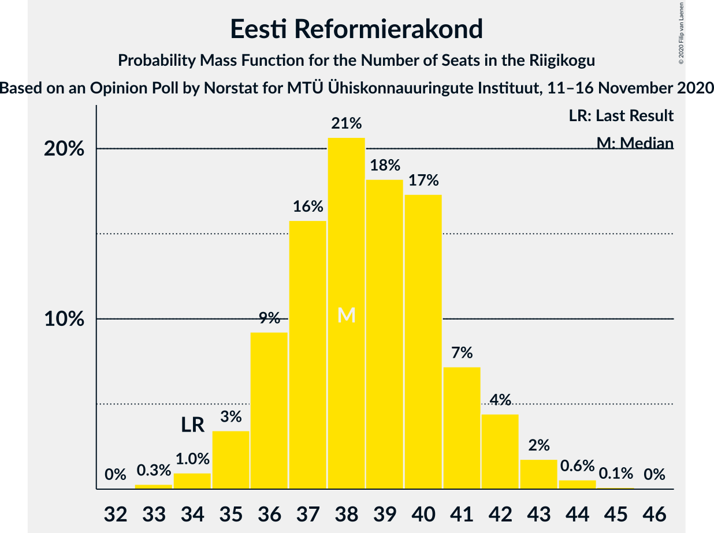
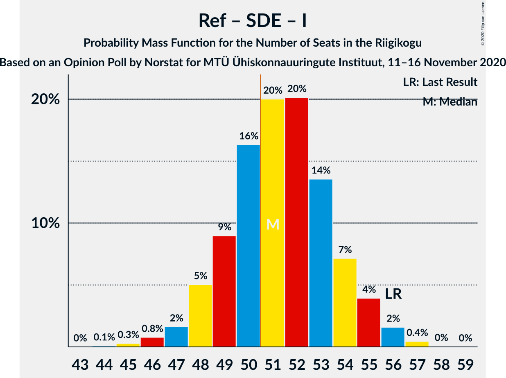

# Opinion Poll by Norstat for MTÜ Ühiskonnauuringute Instituut, 11–16 November 2020

<a href="#voting-intentions">Voting Intentions</a> | <a href="#seats">Seats</a> | <a href="#coalitions">Coalitions</a> | <a href="#technical-information">Technical Information</a>

## Voting Intentions

### Confidence Intervals

| Party | Last Result | Poll Result | 80% Confidence Interval | 90% Confidence Interval | 95% Confidence Interval | 99% Confidence Interval |
|:-----:|:-----------:|:-----------:|:-----------------------:|:-----------------------:|:-----------------------:|:-----------------------:|
| Eesti Reformierakond | 28.9% | 33.7% | 31.8–35.7% |31.3–36.2% |30.8–36.7% |29.9–37.6% |
| Eesti Keskerakond | 23.1% | 19.6% | 18.1–21.3% |17.6–21.8% |17.3–22.2% |16.5–23.0% |
| Eesti Konservatiivne Rahvaerakond | 17.8% | 14.6% | 13.2–16.1% |12.9–16.6% |12.5–16.9% |11.9–17.7% |
| Eesti 200 | 4.4% | 13.4% | 12.1–14.9% |11.7–15.3% |11.4–15.7% |10.8–16.4% |
| Sotsiaaldemokraatlik Erakond | 9.8% | 8.3% | 7.3–9.5% |7.0–9.9% |6.7–10.2% |6.3–10.8% |
| Erakond Isamaa | 11.4% | 6.0% | 5.1–7.1% |4.9–7.4% |4.7–7.7% |4.3–8.2% |
| Erakond Eestimaa Rohelised | 1.8% | 2.3% | 1.8–3.0% |1.6–3.2% |1.5–3.4% |1.3–3.8% |
| Eesti Vabaerakond | 1.2% | 0.6% | 0.4–1.1% |0.3–1.2% |0.3–1.3% |0.2–1.6% |

*Note:* The poll result column reflects the actual value used in the calculations. Published results may vary slightly, and in addition be rounded to fewer digits.

## Seats

### Confidence Intervals

| Party | Last Result | Median | 80% Confidence Interval | 90% Confidence Interval | 95% Confidence Interval | 99% Confidence Interval |
|:-----:|:-----------:|:------:|:-----------------------:|:-----------------------:|:-----------------------:|:-----------------------:|
| <a href="#eesti-reformierakond">Eesti Reformierakond</a> | 34 | 38 | 36–41 |36–42 |35–42 |34–44 |
| <a href="#eesti-keskerakond">Eesti Keskerakond</a> | 26 | 21 | 19–23 |18–24 |18–24 |17–25 |
| <a href="#eesti-konservatiivne-rahvaerakond">Eesti Konservatiivne Rahvaerakond</a> | 19 | 15 | 13–17 |13–17 |12–18 |12–19 |
| <a href="#eesti-200">Eesti 200</a> | 0 | 14 | 12–15 |12–16 |11–16 |11–17 |
| <a href="#sotsiaaldemokraatlik-erakond">Sotsiaaldemokraatlik Erakond</a> | 10 | 8 | 7–9 |6–9 |6–10 |6–11 |
| <a href="#erakond-isamaa">Erakond Isamaa</a> | 12 | 5 | 4–6 |0–7 |0–7 |0–8 |
| <a href="#erakond-eestimaa-rohelised">Erakond Eestimaa Rohelised</a> | 0 | 0 | 0 |0 |0 |0 |
| <a href="#eesti-vabaerakond">Eesti Vabaerakond</a> | 0 | 0 | 0 |0 |0 |0 |

### Eesti Reformierakond

*For a full overview of the results for this party, see the [Eesti Reformierakond](party-eestireformierakond.html) page.*

| Number of Seats | Probability | Accumulated | Special Marks |
|:---------------:|:-----------:|:-----------:|:-------------:|
| 33 | 0.3% | 100% |  |
| 34 | 1.0% | 99.7% | Last Result |
| 35 | 3% | 98.7% |  |
| 36 | 9% | 95% |  |
| 37 | 16% | 86% |  |
| 38 | 21% | 70% | Median |
| 39 | 18% | 50% |  |
| 40 | 17% | 31% |  |
| 41 | 7% | 14% |  |
| 42 | 4% | 7% |  |
| 43 | 2% | 2% |  |
| 44 | 0.6% | 0.7% |  |
| 45 | 0.1% | 0.2% |  |
| 46 | 0% | 0% |  |

### Eesti Keskerakond

*For a full overview of the results for this party, see the [Eesti Keskerakond](party-eestikeskerakond.html) page.*

| Number of Seats | Probability | Accumulated | Special Marks |
|:---------------:|:-----------:|:-----------:|:-------------:|
| 16 | 0.1% | 100% |  |
| 17 | 1.1% | 99.9% |  |
| 18 | 5% | 98.8% |  |
| 19 | 12% | 93% |  |
| 20 | 24% | 82% |  |
| 21 | 23% | 58% | Median |
| 22 | 19% | 35% |  |
| 23 | 9% | 16% |  |
| 24 | 5% | 6% |  |
| 25 | 1.3% | 2% |  |
| 26 | 0.3% | 0.3% | Last Result |
| 27 | 0% | 0% |  |

### Eesti Konservatiivne Rahvaerakond

*For a full overview of the results for this party, see the [Eesti Konservatiivne Rahvaerakond](party-eestikonservatiivnerahvaerakond.html) page.*

| Number of Seats | Probability | Accumulated | Special Marks |
|:---------------:|:-----------:|:-----------:|:-------------:|
| 11 | 0.3% | 100% |  |
| 12 | 3% | 99.7% |  |
| 13 | 10% | 97% |  |
| 14 | 19% | 87% |  |
| 15 | 26% | 68% | Median |
| 16 | 27% | 42% |  |
| 17 | 10% | 14% |  |
| 18 | 4% | 4% |  |
| 19 | 0.5% | 0.6% | Last Result |
| 20 | 0.1% | 0.1% |  |
| 21 | 0% | 0% |  |

### Eesti 200

*For a full overview of the results for this party, see the [Eesti 200](party-eesti200.html) page.*

| Number of Seats | Probability | Accumulated | Special Marks |
|:---------------:|:-----------:|:-----------:|:-------------:|
| 0 | 0% | 100% | Last Result |
| 1 | 0% | 100% |  |
| 2 | 0% | 100% |  |
| 3 | 0% | 100% |  |
| 4 | 0% | 100% |  |
| 5 | 0% | 100% |  |
| 6 | 0% | 100% |  |
| 7 | 0% | 100% |  |
| 8 | 0% | 100% |  |
| 9 | 0% | 100% |  |
| 10 | 0.4% | 100% |  |
| 11 | 4% | 99.5% |  |
| 12 | 13% | 95% |  |
| 13 | 28% | 82% |  |
| 14 | 29% | 54% | Median |
| 15 | 19% | 25% |  |
| 16 | 5% | 7% |  |
| 17 | 1.1% | 1.3% |  |
| 18 | 0.2% | 0.3% |  |
| 19 | 0% | 0% |  |

### Sotsiaaldemokraatlik Erakond

*For a full overview of the results for this party, see the [Sotsiaaldemokraatlik Erakond](party-sotsiaaldemokraatlikerakond.html) page.*

| Number of Seats | Probability | Accumulated | Special Marks |
|:---------------:|:-----------:|:-----------:|:-------------:|
| 5 | 0.5% | 100% |  |
| 6 | 8% | 99.5% |  |
| 7 | 31% | 92% |  |
| 8 | 40% | 61% | Median |
| 9 | 16% | 21% |  |
| 10 | 4% | 5% | Last Result |
| 11 | 0.6% | 0.6% |  |
| 12 | 0% | 0% |  |

### Erakond Isamaa

*For a full overview of the results for this party, see the [Erakond Isamaa](party-erakondisamaa.html) page.*

| Number of Seats | Probability | Accumulated | Special Marks |
|:---------------:|:-----------:|:-----------:|:-------------:|
| 0 | 8% | 100% |  |
| 1 | 0% | 92% |  |
| 2 | 0% | 92% |  |
| 3 | 0% | 92% |  |
| 4 | 6% | 92% |  |
| 5 | 49% | 86% | Median |
| 6 | 30% | 37% |  |
| 7 | 7% | 8% |  |
| 8 | 0.6% | 0.6% |  |
| 9 | 0% | 0% |  |
| 10 | 0% | 0% |  |
| 11 | 0% | 0% |  |
| 12 | 0% | 0% | Last Result |

### Erakond Eestimaa Rohelised

*For a full overview of the results for this party, see the [Erakond Eestimaa Rohelised](party-erakondeestimaarohelised.html) page.*

| Number of Seats | Probability | Accumulated | Special Marks |
|:---------------:|:-----------:|:-----------:|:-------------:|
| 0 | 100% | 100% | Last Result, Median |

### Eesti Vabaerakond

*For a full overview of the results for this party, see the [Eesti Vabaerakond](party-eestivabaerakond.html) page.*

| Number of Seats | Probability | Accumulated | Special Marks |
|:---------------:|:-----------:|:-----------:|:-------------:|
| 0 | 100% | 100% | Last Result, Median |

## Coalitions

### Confidence Intervals

| Coalition | Last Result | Median | Majority? | 80% Confidence Interval | 90% Confidence Interval | 95% Confidence Interval | 99% Confidence Interval |
|:---------:|:-----------:|:------:|:---------:|:-----------------------:|:-----------------------:|:-----------------------:|:-----------------------:|
| Eesti Reformierakond – Eesti Keskerakond – Eesti Konservatiivne Rahvaerakond | 79 | 74 | 100% | 72–77 | 72–78 | 71–79 | 70–81 |
| Eesti Reformierakond – Eesti Keskerakond | 60 | 59 | 100% | 57–62 | 56–63 | 56–64 | 54–66 |
| Eesti Reformierakond – Eesti Konservatiivne Rahvaerakond – Erakond Isamaa | 65 | 59 | 100% | 56–61 | 55–62 | 55–62 | 53–64 |
| Eesti Reformierakond – Eesti Konservatiivne Rahvaerakond | 53 | 54 | 95% | 51–56 | 50–57 | 50–58 | 49–59 |
| Eesti Reformierakond – Sotsiaaldemokraatlik Erakond – Erakond Isamaa – Eesti Vabaerakond | 56 | 51 | 67% | 49–54 | 48–55 | 47–55 | 46–57 |
| Eesti Reformierakond – Sotsiaaldemokraatlik Erakond – Erakond Isamaa | 56 | 51 | 67% | 49–54 | 48–55 | 47–55 | 46–57 |
| Eesti Reformierakond – Sotsiaaldemokraatlik Erakond | 44 | 46 | 3% | 44–49 | 43–50 | 43–51 | 41–52 |
| Eesti Reformierakond – Erakond Isamaa | 46 | 44 | 0% | 41–46 | 40–47 | 39–48 | 38–49 |
| Eesti Keskerakond – Eesti Konservatiivne Rahvaerakond – Erakond Isamaa | 57 | 41 | 0% | 38–44 | 37–44 | 37–45 | 35–46 |
| Eesti Keskerakond – Eesti Konservatiivne Rahvaerakond | 45 | 36 | 0% | 33–39 | 33–39 | 32–40 | 31–41 |
| Eesti Keskerakond – Sotsiaaldemokraatlik Erakond – Erakond Isamaa | 48 | 34 | 0% | 31–36 | 30–37 | 29–38 | 28–39 |
| Eesti Keskerakond – Sotsiaaldemokraatlik Erakond | 36 | 28 | 0% | 26–31 | 26–32 | 25–32 | 24–34 |
| Eesti Konservatiivne Rahvaerakond – Sotsiaaldemokraatlik Erakond | 29 | 23 | 0% | 21–25 | 20–26 | 20–26 | 19–27 |

### Eesti Reformierakond – Eesti Keskerakond – Eesti Konservatiivne Rahvaerakond

| Number of Seats | Probability | Accumulated | Special Marks |
|:---------------:|:-----------:|:-----------:|:-------------:|
| 69 | 0.2% | 100% |  |
| 70 | 0.8% | 99.8% |  |
| 71 | 4% | 99.0% |  |
| 72 | 7% | 95% |  |
| 73 | 18% | 88% |  |
| 74 | 21% | 70% | Median |
| 75 | 20% | 49% |  |
| 76 | 15% | 29% |  |
| 77 | 6% | 14% |  |
| 78 | 4% | 8% |  |
| 79 | 2% | 4% | Last Result |
| 80 | 0.6% | 2% |  |
| 81 | 0.6% | 1.0% |  |
| 82 | 0.3% | 0.4% |  |
| 83 | 0% | 0% |  |

### Eesti Reformierakond – Eesti Keskerakond

| Number of Seats | Probability | Accumulated | Special Marks |
|:---------------:|:-----------:|:-----------:|:-------------:|
| 53 | 0.1% | 100% |  |
| 54 | 0.4% | 99.9% |  |
| 55 | 1.4% | 99.5% |  |
| 56 | 6% | 98% |  |
| 57 | 10% | 93% |  |
| 58 | 16% | 82% |  |
| 59 | 17% | 66% | Median |
| 60 | 19% | 49% | Last Result |
| 61 | 13% | 29% |  |
| 62 | 9% | 16% |  |
| 63 | 3% | 7% |  |
| 64 | 2% | 4% |  |
| 65 | 0.7% | 2% |  |
| 66 | 0.8% | 0.9% |  |
| 67 | 0.1% | 0.1% |  |
| 68 | 0% | 0% |  |

### Eesti Reformierakond – Eesti Konservatiivne Rahvaerakond – Erakond Isamaa

| Number of Seats | Probability | Accumulated | Special Marks |
|:---------------:|:-----------:|:-----------:|:-------------:|
| 51 | 0% | 100% | Majority |
| 52 | 0.2% | 99.9% |  |
| 53 | 0.5% | 99.8% |  |
| 54 | 1.2% | 99.3% |  |
| 55 | 4% | 98% |  |
| 56 | 7% | 94% |  |
| 57 | 16% | 87% |  |
| 58 | 14% | 70% | Median |
| 59 | 20% | 56% |  |
| 60 | 19% | 37% |  |
| 61 | 10% | 17% |  |
| 62 | 5% | 7% |  |
| 63 | 1.5% | 2% |  |
| 64 | 0.5% | 0.6% |  |
| 65 | 0.1% | 0.1% | Last Result |
| 66 | 0% | 0% |  |

### Eesti Reformierakond – Eesti Konservatiivne Rahvaerakond

| Number of Seats | Probability | Accumulated | Special Marks |
|:---------------:|:-----------:|:-----------:|:-------------:|
| 47 | 0.1% | 100% |  |
| 48 | 0.3% | 99.9% |  |
| 49 | 1.2% | 99.5% |  |
| 50 | 4% | 98% |  |
| 51 | 10% | 95% | Majority |
| 52 | 14% | 85% |  |
| 53 | 16% | 70% | Last Result, Median |
| 54 | 19% | 54% |  |
| 55 | 15% | 35% |  |
| 56 | 12% | 19% |  |
| 57 | 5% | 8% |  |
| 58 | 2% | 3% |  |
| 59 | 0.7% | 1.2% |  |
| 60 | 0.2% | 0.5% |  |
| 61 | 0.2% | 0.2% |  |
| 62 | 0% | 0% |  |

### Eesti Reformierakond – Sotsiaaldemokraatlik Erakond – Erakond Isamaa – Eesti Vabaerakond

| Number of Seats | Probability | Accumulated | Special Marks |
|:---------------:|:-----------:|:-----------:|:-------------:|
| 44 | 0.1% | 100% |  |
| 45 | 0.3% | 99.9% |  |
| 46 | 0.8% | 99.6% |  |
| 47 | 2% | 98.8% |  |
| 48 | 5% | 97% |  |
| 49 | 9% | 92% |  |
| 50 | 16% | 83% |  |
| 51 | 20% | 67% | Median, Majority |
| 52 | 20% | 47% |  |
| 53 | 14% | 27% |  |
| 54 | 7% | 13% |  |
| 55 | 4% | 6% |  |
| 56 | 2% | 2% | Last Result |
| 57 | 0.4% | 0.5% |  |
| 58 | 0% | 0.1% |  |
| 59 | 0% | 0% |  |

### Eesti Reformierakond – Sotsiaaldemokraatlik Erakond – Erakond Isamaa

| Number of Seats | Probability | Accumulated | Special Marks |
|:---------------:|:-----------:|:-----------:|:-------------:|
| 44 | 0.1% | 100% |  |
| 45 | 0.3% | 99.9% |  |
| 46 | 0.8% | 99.6% |  |
| 47 | 2% | 98.8% |  |
| 48 | 5% | 97% |  |
| 49 | 9% | 92% |  |
| 50 | 16% | 83% |  |
| 51 | 20% | 67% | Median, Majority |
| 52 | 20% | 47% |  |
| 53 | 14% | 27% |  |
| 54 | 7% | 13% |  |
| 55 | 4% | 6% |  |
| 56 | 2% | 2% | Last Result |
| 57 | 0.4% | 0.5% |  |
| 58 | 0% | 0.1% |  |
| 59 | 0% | 0% |  |

### Eesti Reformierakond – Sotsiaaldemokraatlik Erakond

| Number of Seats | Probability | Accumulated | Special Marks |
|:---------------:|:-----------:|:-----------:|:-------------:|
| 40 | 0.1% | 100% |  |
| 41 | 0.5% | 99.9% |  |
| 42 | 2% | 99.4% |  |
| 43 | 4% | 98% |  |
| 44 | 11% | 94% | Last Result |
| 45 | 17% | 83% |  |
| 46 | 21% | 65% | Median |
| 47 | 19% | 45% |  |
| 48 | 13% | 26% |  |
| 49 | 7% | 13% |  |
| 50 | 4% | 7% |  |
| 51 | 2% | 3% | Majority |
| 52 | 0.4% | 0.6% |  |
| 53 | 0.2% | 0.3% |  |
| 54 | 0.1% | 0.1% |  |
| 55 | 0% | 0% |  |

### Eesti Reformierakond – Erakond Isamaa

| Number of Seats | Probability | Accumulated | Special Marks |
|:---------------:|:-----------:|:-----------:|:-------------:|
| 36 | 0.1% | 100% |  |
| 37 | 0.2% | 99.9% |  |
| 38 | 0.9% | 99.6% |  |
| 39 | 1.4% | 98.7% |  |
| 40 | 5% | 97% |  |
| 41 | 6% | 93% |  |
| 42 | 16% | 86% |  |
| 43 | 17% | 70% | Median |
| 44 | 22% | 53% |  |
| 45 | 16% | 32% |  |
| 46 | 10% | 16% | Last Result |
| 47 | 4% | 6% |  |
| 48 | 2% | 3% |  |
| 49 | 0.5% | 0.6% |  |
| 50 | 0.1% | 0.1% |  |
| 51 | 0% | 0% | Majority |

### Eesti Keskerakond – Eesti Konservatiivne Rahvaerakond – Erakond Isamaa

| Number of Seats | Probability | Accumulated | Special Marks |
|:---------------:|:-----------:|:-----------:|:-------------:|
| 33 | 0.1% | 100% |  |
| 34 | 0.1% | 99.9% |  |
| 35 | 0.6% | 99.8% |  |
| 36 | 1.1% | 99.2% |  |
| 37 | 4% | 98% |  |
| 38 | 6% | 94% |  |
| 39 | 8% | 88% |  |
| 40 | 11% | 80% |  |
| 41 | 32% | 69% | Median |
| 42 | 14% | 37% |  |
| 43 | 12% | 23% |  |
| 44 | 7% | 11% |  |
| 45 | 3% | 4% |  |
| 46 | 0.9% | 1.0% |  |
| 47 | 0.1% | 0.2% |  |
| 48 | 0% | 0% |  |
| 49 | 0% | 0% |  |
| 50 | 0% | 0% |  |
| 51 | 0% | 0% | Majority |
| 52 | 0% | 0% |  |
| 53 | 0% | 0% |  |
| 54 | 0% | 0% |  |
| 55 | 0% | 0% |  |
| 56 | 0% | 0% |  |
| 57 | 0% | 0% | Last Result |

### Eesti Keskerakond – Eesti Konservatiivne Rahvaerakond

| Number of Seats | Probability | Accumulated | Special Marks |
|:---------------:|:-----------:|:-----------:|:-------------:|
| 30 | 0.1% | 100% |  |
| 31 | 0.4% | 99.9% |  |
| 32 | 3% | 99.5% |  |
| 33 | 7% | 96% |  |
| 34 | 7% | 90% |  |
| 35 | 15% | 83% |  |
| 36 | 35% | 68% | Median |
| 37 | 13% | 32% |  |
| 38 | 9% | 20% |  |
| 39 | 7% | 10% |  |
| 40 | 3% | 3% |  |
| 41 | 0.5% | 0.8% |  |
| 42 | 0.2% | 0.3% |  |
| 43 | 0.1% | 0.1% |  |
| 44 | 0% | 0% |  |
| 45 | 0% | 0% | Last Result |

### Eesti Keskerakond – Sotsiaaldemokraatlik Erakond – Erakond Isamaa

| Number of Seats | Probability | Accumulated | Special Marks |
|:---------------:|:-----------:|:-----------:|:-------------:|
| 26 | 0.1% | 100% |  |
| 27 | 0.2% | 99.9% |  |
| 28 | 0.8% | 99.7% |  |
| 29 | 1.4% | 98.8% |  |
| 30 | 5% | 97% |  |
| 31 | 6% | 93% |  |
| 32 | 12% | 87% |  |
| 33 | 25% | 75% |  |
| 34 | 17% | 51% | Median |
| 35 | 15% | 34% |  |
| 36 | 10% | 19% |  |
| 37 | 6% | 9% |  |
| 38 | 2% | 3% |  |
| 39 | 0.7% | 0.8% |  |
| 40 | 0.1% | 0.1% |  |
| 41 | 0% | 0% |  |
| 42 | 0% | 0% |  |
| 43 | 0% | 0% |  |
| 44 | 0% | 0% |  |
| 45 | 0% | 0% |  |
| 46 | 0% | 0% |  |
| 47 | 0% | 0% |  |
| 48 | 0% | 0% | Last Result |

### Eesti Keskerakond – Sotsiaaldemokraatlik Erakond

| Number of Seats | Probability | Accumulated | Special Marks |
|:---------------:|:-----------:|:-----------:|:-------------:|
| 23 | 0.1% | 100% |  |
| 24 | 0.5% | 99.9% |  |
| 25 | 2% | 99.4% |  |
| 26 | 7% | 97% |  |
| 27 | 14% | 90% |  |
| 28 | 27% | 76% |  |
| 29 | 18% | 49% | Median |
| 30 | 14% | 31% |  |
| 31 | 10% | 17% |  |
| 32 | 4% | 7% |  |
| 33 | 2% | 2% |  |
| 34 | 0.5% | 0.6% |  |
| 35 | 0.1% | 0.1% |  |
| 36 | 0% | 0% | Last Result |

### Eesti Konservatiivne Rahvaerakond – Sotsiaaldemokraatlik Erakond

| Number of Seats | Probability | Accumulated | Special Marks |
|:---------------:|:-----------:|:-----------:|:-------------:|
| 18 | 0.2% | 100% |  |
| 19 | 2% | 99.8% |  |
| 20 | 5% | 98% |  |
| 21 | 13% | 94% |  |
| 22 | 21% | 81% |  |
| 23 | 22% | 59% | Median |
| 24 | 22% | 37% |  |
| 25 | 10% | 15% |  |
| 26 | 4% | 5% |  |
| 27 | 1.2% | 1.5% |  |
| 28 | 0.2% | 0.3% |  |
| 29 | 0.1% | 0.1% | Last Result |
| 30 | 0% | 0% |  |

## Technical Information

### Opinion Poll

+ **Polling firm:** Norstat
+ **Commissioner(s):** MTÜ Ühiskonnauuringute Instituut
+ **Fieldwork period:** 11–16 November 2020

### Calculations

+ **Sample size:** 1000
+ **Simulations done:** 1,048,576
+ **Error estimate:** 1.46%

