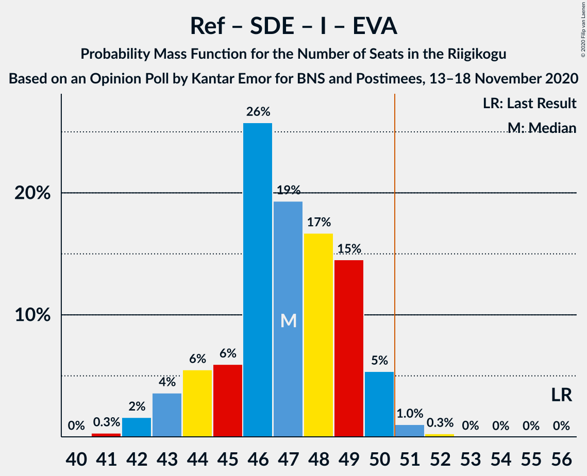

# Opinion Poll by Kantar Emor for BNS and Postimees, 13–18 November 2020

<a href="#voting-intentions">Voting Intentions</a> | <a href="#seats">Seats</a> | <a href="#coalitions">Coalitions</a> | <a href="#technical-information">Technical Information</a>

## Voting Intentions

### Confidence Intervals

| Party | Last Result | Poll Result | 80% Confidence Interval | 90% Confidence Interval | 95% Confidence Interval | 99% Confidence Interval |
|:-----:|:-----------:|:-----------:|:-----------------------:|:-----------------------:|:-----------------------:|:-----------------------:|
| Eesti Reformierakond | 28.9% | 28.0% | 26.4–29.7% |26.0–30.1% |25.6–30.5% |24.9–31.3% |
| Eesti 200 | 4.4% | 18.0% | 16.7–19.5% |16.3–19.9% |16.0–20.2% |15.4–20.9% |
| Eesti Keskerakond | 23.1% | 17.0% | 15.7–18.4% |15.3–18.8% |15.0–19.2% |14.4–19.9% |
| Eesti Konservatiivne Rahvaerakond | 17.8% | 16.0% | 14.7–17.4% |14.4–17.8% |14.1–18.1% |13.5–18.8% |
| Sotsiaaldemokraatlik Erakond | 9.8% | 10.0% | 9.0–11.1% |8.7–11.5% |8.5–11.8% |8.0–12.3% |
| Erakond Isamaa | 11.4% | 6.0% | 5.2–7.0% |5.0–7.2% |4.8–7.5% |4.5–7.9% |
| Erakond Eestimaa Rohelised | 1.8% | 3.0% | 2.4–3.7% |2.3–3.9% |2.2–4.1% |1.9–4.4% |
| Eesti Vabaerakond | 1.2% | 2.0% | 1.6–2.6% |1.5–2.8% |1.4–3.0% |1.2–3.3% |

*Note:* The poll result column reflects the actual value used in the calculations. Published results may vary slightly, and in addition be rounded to fewer digits.

## Seats

### Confidence Intervals

| Party | Last Result | Median | 80% Confidence Interval | 90% Confidence Interval | 95% Confidence Interval | 99% Confidence Interval |
|:-----:|:-----------:|:------:|:-----------------------:|:-----------------------:|:-----------------------:|:-----------------------:|
| <a href="#eesti-reformierakond">Eesti Reformierakond</a> | 34 | 32 | 30–34 |29–35 |29–35 |28–36 |
| <a href="#eesti-200">Eesti 200</a> | 0 | 19 | 18–21 |17–21 |16–22 |16–23 |
| <a href="#eesti-keskerakond">Eesti Keskerakond</a> | 26 | 18 | 16–20 |16–20 |16–21 |15–21 |
| <a href="#eesti-konservatiivne-rahvaerakond">Eesti Konservatiivne Rahvaerakond</a> | 19 | 17 | 15–18 |14–19 |14–20 |14–20 |
| <a href="#sotsiaaldemokraatlik-erakond">Sotsiaaldemokraatlik Erakond</a> | 10 | 10 | 9–11 |8–11 |8–12 |7–12 |
| <a href="#erakond-isamaa">Erakond Isamaa</a> | 12 | 6 | 5–6 |0–7 |0–7 |0–8 |
| <a href="#erakond-eestimaa-rohelised">Erakond Eestimaa Rohelised</a> | 0 | 0 | 0 |0 |0 |0 |
| <a href="#eesti-vabaerakond">Eesti Vabaerakond</a> | 0 | 0 | 0 |0 |0 |0 |

### Eesti Reformierakond

*For a full overview of the results for this party, see the [Eesti Reformierakond](party-eestireformierakond.html) page.*

| Number of Seats | Probability | Accumulated | Special Marks |
|:---------------:|:-----------:|:-----------:|:-------------:|
| 26 | 0.1% | 100% |  |
| 27 | 0.1% | 99.9% |  |
| 28 | 2% | 99.8% |  |
| 29 | 7% | 98% |  |
| 30 | 17% | 91% |  |
| 31 | 17% | 75% |  |
| 32 | 26% | 57% | Median |
| 33 | 12% | 31% |  |
| 34 | 11% | 19% | Last Result |
| 35 | 7% | 8% |  |
| 36 | 1.1% | 2% |  |
| 37 | 0.4% | 0.5% |  |
| 38 | 0% | 0% |  |

### Eesti 200

*For a full overview of the results for this party, see the [Eesti 200](party-eesti200.html) page.*

| Number of Seats | Probability | Accumulated | Special Marks |
|:---------------:|:-----------:|:-----------:|:-------------:|
| 0 | 0% | 100% | Last Result |
| 1 | 0% | 100% |  |
| 2 | 0% | 100% |  |
| 3 | 0% | 100% |  |
| 4 | 0% | 100% |  |
| 5 | 0% | 100% |  |
| 6 | 0% | 100% |  |
| 7 | 0% | 100% |  |
| 8 | 0% | 100% |  |
| 9 | 0% | 100% |  |
| 10 | 0% | 100% |  |
| 11 | 0% | 100% |  |
| 12 | 0% | 100% |  |
| 13 | 0% | 100% |  |
| 14 | 0% | 100% |  |
| 15 | 0.1% | 100% |  |
| 16 | 4% | 99.9% |  |
| 17 | 5% | 96% |  |
| 18 | 24% | 91% |  |
| 19 | 26% | 68% | Median |
| 20 | 25% | 42% |  |
| 21 | 13% | 17% |  |
| 22 | 3% | 4% |  |
| 23 | 1.0% | 1.1% |  |
| 24 | 0.1% | 0.1% |  |
| 25 | 0% | 0% |  |

### Eesti Keskerakond

*For a full overview of the results for this party, see the [Eesti Keskerakond](party-eestikeskerakond.html) page.*

| Number of Seats | Probability | Accumulated | Special Marks |
|:---------------:|:-----------:|:-----------:|:-------------:|
| 14 | 0.1% | 100% |  |
| 15 | 2% | 99.8% |  |
| 16 | 10% | 98% |  |
| 17 | 17% | 88% |  |
| 18 | 24% | 71% | Median |
| 19 | 34% | 47% |  |
| 20 | 10% | 13% |  |
| 21 | 3% | 4% |  |
| 22 | 0.4% | 0.5% |  |
| 23 | 0.1% | 0.1% |  |
| 24 | 0% | 0% |  |
| 25 | 0% | 0% |  |
| 26 | 0% | 0% | Last Result |

### Eesti Konservatiivne Rahvaerakond

*For a full overview of the results for this party, see the [Eesti Konservatiivne Rahvaerakond](party-eestikonservatiivnerahvaerakond.html) page.*

| Number of Seats | Probability | Accumulated | Special Marks |
|:---------------:|:-----------:|:-----------:|:-------------:|
| 13 | 0.3% | 100% |  |
| 14 | 5% | 99.7% |  |
| 15 | 12% | 94% |  |
| 16 | 28% | 82% |  |
| 17 | 25% | 54% | Median |
| 18 | 21% | 30% |  |
| 19 | 5% | 8% | Last Result |
| 20 | 3% | 3% |  |
| 21 | 0.2% | 0.2% |  |
| 22 | 0% | 0% |  |

### Sotsiaaldemokraatlik Erakond

*For a full overview of the results for this party, see the [Sotsiaaldemokraatlik Erakond](party-sotsiaaldemokraatlikerakond.html) page.*

| Number of Seats | Probability | Accumulated | Special Marks |
|:---------------:|:-----------:|:-----------:|:-------------:|
| 7 | 0.9% | 100% |  |
| 8 | 8% | 99.1% |  |
| 9 | 32% | 91% |  |
| 10 | 32% | 59% | Last Result, Median |
| 11 | 24% | 27% |  |
| 12 | 3% | 3% |  |
| 13 | 0.3% | 0.4% |  |
| 14 | 0% | 0% |  |

### Erakond Isamaa

*For a full overview of the results for this party, see the [Erakond Isamaa](party-erakondisamaa.html) page.*

| Number of Seats | Probability | Accumulated | Special Marks |
|:---------------:|:-----------:|:-----------:|:-------------:|
| 0 | 5% | 100% |  |
| 1 | 0% | 95% |  |
| 2 | 0% | 95% |  |
| 3 | 0% | 95% |  |
| 4 | 3% | 95% |  |
| 5 | 41% | 91% |  |
| 6 | 44% | 51% | Median |
| 7 | 6% | 7% |  |
| 8 | 0.5% | 0.5% |  |
| 9 | 0% | 0% |  |
| 10 | 0% | 0% |  |
| 11 | 0% | 0% |  |
| 12 | 0% | 0% | Last Result |

### Erakond Eestimaa Rohelised

*For a full overview of the results for this party, see the [Erakond Eestimaa Rohelised](party-erakondeestimaarohelised.html) page.*

| Number of Seats | Probability | Accumulated | Special Marks |
|:---------------:|:-----------:|:-----------:|:-------------:|
| 0 | 100% | 100% | Last Result, Median |

### Eesti Vabaerakond

*For a full overview of the results for this party, see the [Eesti Vabaerakond](party-eestivabaerakond.html) page.*

| Number of Seats | Probability | Accumulated | Special Marks |
|:---------------:|:-----------:|:-----------:|:-------------:|
| 0 | 100% | 100% | Last Result, Median |

## Coalitions

### Confidence Intervals

| Coalition | Last Result | Median | Majority? | 80% Confidence Interval | 90% Confidence Interval | 95% Confidence Interval | 99% Confidence Interval |
|:---------:|:-----------:|:------:|:---------:|:-----------------------:|:-----------------------:|:-----------------------:|:-----------------------:|
| Eesti Reformierakond – Eesti Keskerakond – Eesti Konservatiivne Rahvaerakond | 79 | 67 | 100% | 65–69 | 64–70 | 63–71 | 63–72 |
| Eesti Reformierakond – Eesti Konservatiivne Rahvaerakond – Erakond Isamaa | 65 | 54 | 97% | 51–56 | 51–57 | 50–57 | 49–58 |
| Eesti Reformierakond – Eesti Keskerakond | 60 | 50 | 38% | 48–53 | 47–53 | 46–54 | 45–55 |
| Eesti Reformierakond – Eesti Konservatiivne Rahvaerakond | 53 | 48 | 19% | 46–51 | 45–52 | 45–52 | 44–54 |
| Eesti Reformierakond – Sotsiaaldemokraatlik Erakond – Erakond Isamaa – Eesti Vabaerakond | 56 | 47 | 1.3% | 44–49 | 43–50 | 43–50 | 42–51 |
| Eesti Reformierakond – Sotsiaaldemokraatlik Erakond – Erakond Isamaa | 56 | 47 | 1.3% | 44–49 | 43–50 | 43–50 | 42–51 |
| Eesti Reformierakond – Sotsiaaldemokraatlik Erakond | 44 | 41 | 0% | 39–44 | 39–44 | 38–45 | 37–46 |
| Eesti Keskerakond – Eesti Konservatiivne Rahvaerakond – Erakond Isamaa | 57 | 40 | 0% | 38–43 | 37–43 | 37–44 | 35–45 |
| Eesti Reformierakond – Erakond Isamaa | 46 | 37 | 0% | 34–40 | 34–40 | 33–40 | 32–41 |
| Eesti Keskerakond – Eesti Konservatiivne Rahvaerakond | 45 | 35 | 0% | 33–37 | 32–38 | 32–38 | 31–39 |
| Eesti Keskerakond – Sotsiaaldemokraatlik Erakond – Erakond Isamaa | 48 | 34 | 0% | 31–35 | 30–36 | 29–37 | 27–37 |
| Eesti Keskerakond – Sotsiaaldemokraatlik Erakond | 36 | 28 | 0% | 26–30 | 25–30 | 25–31 | 24–32 |
| Eesti Konservatiivne Rahvaerakond – Sotsiaaldemokraatlik Erakond | 29 | 27 | 0% | 24–28 | 24–29 | 24–30 | 23–32 |

### Eesti Reformierakond – Eesti Keskerakond – Eesti Konservatiivne Rahvaerakond

| Number of Seats | Probability | Accumulated | Special Marks |
|:---------------:|:-----------:|:-----------:|:-------------:|
| 61 | 0.1% | 100% |  |
| 62 | 0.4% | 99.9% |  |
| 63 | 3% | 99.5% |  |
| 64 | 4% | 97% |  |
| 65 | 20% | 92% |  |
| 66 | 19% | 73% |  |
| 67 | 25% | 53% | Median |
| 68 | 11% | 28% |  |
| 69 | 8% | 17% |  |
| 70 | 5% | 8% |  |
| 71 | 1.3% | 3% |  |
| 72 | 2% | 2% |  |
| 73 | 0.1% | 0.2% |  |
| 74 | 0% | 0.1% |  |
| 75 | 0% | 0% |  |
| 76 | 0% | 0% |  |
| 77 | 0% | 0% |  |
| 78 | 0% | 0% |  |
| 79 | 0% | 0% | Last Result |

### Eesti Reformierakond – Eesti Konservatiivne Rahvaerakond – Erakond Isamaa

| Number of Seats | Probability | Accumulated | Special Marks |
|:---------------:|:-----------:|:-----------:|:-------------:|
| 47 | 0% | 100% |  |
| 48 | 0.1% | 99.9% |  |
| 49 | 0.4% | 99.8% |  |
| 50 | 3% | 99.5% |  |
| 51 | 9% | 97% | Majority |
| 52 | 10% | 88% |  |
| 53 | 23% | 78% |  |
| 54 | 17% | 55% |  |
| 55 | 19% | 38% | Median |
| 56 | 12% | 18% |  |
| 57 | 5% | 6% |  |
| 58 | 1.1% | 1.4% |  |
| 59 | 0.2% | 0.3% |  |
| 60 | 0.1% | 0.1% |  |
| 61 | 0% | 0% |  |
| 62 | 0% | 0% |  |
| 63 | 0% | 0% |  |
| 64 | 0% | 0% |  |
| 65 | 0% | 0% | Last Result |

### Eesti Reformierakond – Eesti Keskerakond

| Number of Seats | Probability | Accumulated | Special Marks |
|:---------------:|:-----------:|:-----------:|:-------------:|
| 44 | 0.1% | 100% |  |
| 45 | 0.8% | 99.9% |  |
| 46 | 3% | 99.1% |  |
| 47 | 5% | 96% |  |
| 48 | 10% | 92% |  |
| 49 | 23% | 82% |  |
| 50 | 20% | 58% | Median |
| 51 | 18% | 38% | Majority |
| 52 | 9% | 21% |  |
| 53 | 8% | 11% |  |
| 54 | 2% | 3% |  |
| 55 | 0.7% | 0.8% |  |
| 56 | 0.1% | 0.1% |  |
| 57 | 0% | 0.1% |  |
| 58 | 0% | 0% |  |
| 59 | 0% | 0% |  |
| 60 | 0% | 0% | Last Result |

### Eesti Reformierakond – Eesti Konservatiivne Rahvaerakond

| Number of Seats | Probability | Accumulated | Special Marks |
|:---------------:|:-----------:|:-----------:|:-------------:|
| 43 | 0.1% | 100% |  |
| 44 | 0.6% | 99.9% |  |
| 45 | 5% | 99.3% |  |
| 46 | 8% | 94% |  |
| 47 | 16% | 87% |  |
| 48 | 25% | 71% |  |
| 49 | 20% | 46% | Median |
| 50 | 7% | 26% |  |
| 51 | 13% | 19% | Majority |
| 52 | 5% | 7% |  |
| 53 | 1.1% | 2% | Last Result |
| 54 | 0.8% | 0.9% |  |
| 55 | 0.1% | 0.1% |  |
| 56 | 0% | 0% |  |

### Eesti Reformierakond – Sotsiaaldemokraatlik Erakond – Erakond Isamaa – Eesti Vabaerakond

| Number of Seats | Probability | Accumulated | Special Marks |
|:---------------:|:-----------:|:-----------:|:-------------:|
| 40 | 0% | 100% |  |
| 41 | 0.3% | 99.9% |  |
| 42 | 2% | 99.6% |  |
| 43 | 4% | 98% |  |
| 44 | 6% | 94% |  |
| 45 | 6% | 89% |  |
| 46 | 26% | 83% |  |
| 47 | 19% | 57% |  |
| 48 | 17% | 38% | Median |
| 49 | 15% | 21% |  |
| 50 | 5% | 7% |  |
| 51 | 1.0% | 1.3% | Majority |
| 52 | 0.3% | 0.3% |  |
| 53 | 0% | 0% |  |
| 54 | 0% | 0% |  |
| 55 | 0% | 0% |  |
| 56 | 0% | 0% | Last Result |

### Eesti Reformierakond – Sotsiaaldemokraatlik Erakond – Erakond Isamaa

| Number of Seats | Probability | Accumulated | Special Marks |
|:---------------:|:-----------:|:-----------:|:-------------:|
| 40 | 0% | 100% |  |
| 41 | 0.3% | 99.9% |  |
| 42 | 2% | 99.6% |  |
| 43 | 4% | 98% |  |
| 44 | 6% | 94% |  |
| 45 | 6% | 89% |  |
| 46 | 26% | 83% |  |
| 47 | 19% | 57% |  |
| 48 | 17% | 38% | Median |
| 49 | 15% | 21% |  |
| 50 | 5% | 7% |  |
| 51 | 1.0% | 1.3% | Majority |
| 52 | 0.3% | 0.3% |  |
| 53 | 0% | 0% |  |
| 54 | 0% | 0% |  |
| 55 | 0% | 0% |  |
| 56 | 0% | 0% | Last Result |

### Eesti Reformierakond – Sotsiaaldemokraatlik Erakond

| Number of Seats | Probability | Accumulated | Special Marks |
|:---------------:|:-----------:|:-----------:|:-------------:|
| 36 | 0.1% | 100% |  |
| 37 | 0.4% | 99.8% |  |
| 38 | 4% | 99.4% |  |
| 39 | 6% | 95% |  |
| 40 | 18% | 89% |  |
| 41 | 23% | 71% |  |
| 42 | 13% | 48% | Median |
| 43 | 17% | 34% |  |
| 44 | 13% | 17% | Last Result |
| 45 | 3% | 4% |  |
| 46 | 1.2% | 1.5% |  |
| 47 | 0.2% | 0.3% |  |
| 48 | 0% | 0.1% |  |
| 49 | 0% | 0% |  |

### Eesti Keskerakond – Eesti Konservatiivne Rahvaerakond – Erakond Isamaa

| Number of Seats | Probability | Accumulated | Special Marks |
|:---------------:|:-----------:|:-----------:|:-------------:|
| 33 | 0% | 100% |  |
| 34 | 0.2% | 99.9% |  |
| 35 | 0.6% | 99.7% |  |
| 36 | 1.3% | 99.1% |  |
| 37 | 4% | 98% |  |
| 38 | 12% | 94% |  |
| 39 | 20% | 81% |  |
| 40 | 16% | 61% |  |
| 41 | 19% | 46% | Median |
| 42 | 15% | 26% |  |
| 43 | 9% | 12% |  |
| 44 | 2% | 3% |  |
| 45 | 0.5% | 0.7% |  |
| 46 | 0.2% | 0.2% |  |
| 47 | 0% | 0% |  |
| 48 | 0% | 0% |  |
| 49 | 0% | 0% |  |
| 50 | 0% | 0% |  |
| 51 | 0% | 0% | Majority |
| 52 | 0% | 0% |  |
| 53 | 0% | 0% |  |
| 54 | 0% | 0% |  |
| 55 | 0% | 0% |  |
| 56 | 0% | 0% |  |
| 57 | 0% | 0% | Last Result |

### Eesti Reformierakond – Erakond Isamaa

| Number of Seats | Probability | Accumulated | Special Marks |
|:---------------:|:-----------:|:-----------:|:-------------:|
| 30 | 0.1% | 100% |  |
| 31 | 0.3% | 99.9% |  |
| 32 | 2% | 99.6% |  |
| 33 | 2% | 98% |  |
| 34 | 6% | 96% |  |
| 35 | 7% | 90% |  |
| 36 | 22% | 83% |  |
| 37 | 14% | 60% |  |
| 38 | 23% | 46% | Median |
| 39 | 11% | 23% |  |
| 40 | 11% | 12% |  |
| 41 | 1.1% | 2% |  |
| 42 | 0.4% | 0.5% |  |
| 43 | 0% | 0% |  |
| 44 | 0% | 0% |  |
| 45 | 0% | 0% |  |
| 46 | 0% | 0% | Last Result |

### Eesti Keskerakond – Eesti Konservatiivne Rahvaerakond

| Number of Seats | Probability | Accumulated | Special Marks |
|:---------------:|:-----------:|:-----------:|:-------------:|
| 30 | 0.3% | 100% |  |
| 31 | 1.0% | 99.7% |  |
| 32 | 6% | 98.6% |  |
| 33 | 16% | 93% |  |
| 34 | 20% | 77% |  |
| 35 | 20% | 56% | Median |
| 36 | 14% | 37% |  |
| 37 | 16% | 23% |  |
| 38 | 5% | 7% |  |
| 39 | 1.3% | 2% |  |
| 40 | 0.2% | 0.4% |  |
| 41 | 0.1% | 0.2% |  |
| 42 | 0% | 0% |  |
| 43 | 0% | 0% |  |
| 44 | 0% | 0% |  |
| 45 | 0% | 0% | Last Result |

### Eesti Keskerakond – Sotsiaaldemokraatlik Erakond – Erakond Isamaa

| Number of Seats | Probability | Accumulated | Special Marks |
|:---------------:|:-----------:|:-----------:|:-------------:|
| 26 | 0.1% | 100% |  |
| 27 | 0.5% | 99.9% |  |
| 28 | 1.0% | 99.4% |  |
| 29 | 2% | 98% |  |
| 30 | 6% | 96% |  |
| 31 | 7% | 91% |  |
| 32 | 13% | 83% |  |
| 33 | 19% | 70% |  |
| 34 | 26% | 51% | Median |
| 35 | 16% | 25% |  |
| 36 | 5% | 9% |  |
| 37 | 4% | 4% |  |
| 38 | 0.2% | 0.2% |  |
| 39 | 0% | 0% |  |
| 40 | 0% | 0% |  |
| 41 | 0% | 0% |  |
| 42 | 0% | 0% |  |
| 43 | 0% | 0% |  |
| 44 | 0% | 0% |  |
| 45 | 0% | 0% |  |
| 46 | 0% | 0% |  |
| 47 | 0% | 0% |  |
| 48 | 0% | 0% | Last Result |

### Eesti Keskerakond – Sotsiaaldemokraatlik Erakond

| Number of Seats | Probability | Accumulated | Special Marks |
|:---------------:|:-----------:|:-----------:|:-------------:|
| 23 | 0.1% | 100% |  |
| 24 | 2% | 99.9% |  |
| 25 | 7% | 98% |  |
| 26 | 8% | 91% |  |
| 27 | 20% | 83% |  |
| 28 | 22% | 63% | Median |
| 29 | 23% | 41% |  |
| 30 | 13% | 18% |  |
| 31 | 4% | 5% |  |
| 32 | 0.9% | 1.0% |  |
| 33 | 0.1% | 0.2% |  |
| 34 | 0% | 0% |  |
| 35 | 0% | 0% |  |
| 36 | 0% | 0% | Last Result |

### Eesti Konservatiivne Rahvaerakond – Sotsiaaldemokraatlik Erakond

| Number of Seats | Probability | Accumulated | Special Marks |
|:---------------:|:-----------:|:-----------:|:-------------:|
| 22 | 0.1% | 100% |  |
| 23 | 2% | 99.9% |  |
| 24 | 14% | 98% |  |
| 25 | 15% | 84% |  |
| 26 | 13% | 70% |  |
| 27 | 29% | 56% | Median |
| 28 | 18% | 27% |  |
| 29 | 5% | 9% | Last Result |
| 30 | 3% | 4% |  |
| 31 | 0.5% | 1.3% |  |
| 32 | 0.7% | 0.8% |  |
| 33 | 0% | 0% |  |

## Technical Information

### Opinion Poll

+ **Polling firm:** Kantar Emor
+ **Commissioner(s):** BNS and Postimees
+ **Fieldwork period:** 13–18 November 2020

### Calculations

+ **Sample size:** 1282
+ **Simulations done:** 1,048,576
+ **Error estimate:** 3.64%

