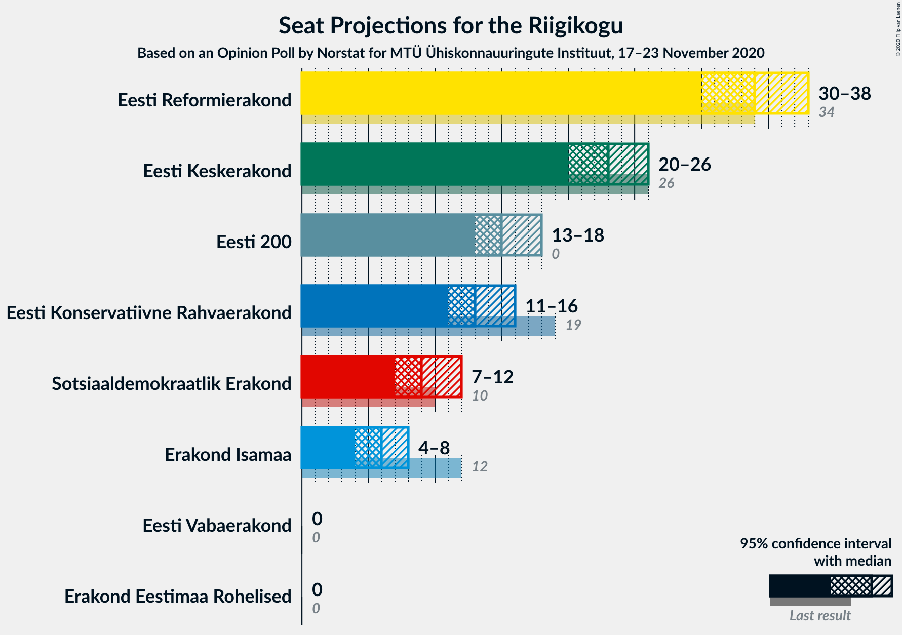

# Opinion Poll by Norstat for MTÜ Ühiskonnauuringute Instituut, 17–23 November 2020

<a href="#voting-intentions">Voting Intentions</a> | <a href="#seats">Seats</a> | <a href="#coalitions">Coalitions</a> | <a href="#technical-information">Technical Information</a>

## Voting Intentions

### Confidence Intervals

| Party | Last Result | Poll Result | 80% Confidence Interval | 90% Confidence Interval | 95% Confidence Interval | 99% Confidence Interval |
|:-----:|:-----------:|:-----------:|:-----------------------:|:-----------------------:|:-----------------------:|:-----------------------:|
| Eesti Reformierakond | 28.9% | 29.6% | 27.8–31.5% |27.3–32.0% |26.9–32.5% |26.0–33.4% |
| Eesti Keskerakond | 23.1% | 21.0% | 19.4–22.7% |19.0–23.2% |18.6–23.6% |17.8–24.5% |
| Eesti 200 | 4.4% | 14.8% | 13.4–16.3% |13.1–16.8% |12.7–17.1% |12.1–17.9% |
| Eesti Konservatiivne Rahvaerakond | 17.8% | 13.1% | 11.8–14.6% |11.4–15.0% |11.1–15.3% |10.6–16.1% |
| Sotsiaaldemokraatlik Erakond | 9.8% | 9.4% | 8.3–10.7% |8.0–11.1% |7.7–11.4% |7.2–12.0% |
| Erakond Isamaa | 11.4% | 6.5% | 5.6–7.6% |5.3–7.9% |5.1–8.2% |4.7–8.8% |
| Erakond Eestimaa Rohelised | 1.8% | 3.0% | 2.4–3.8% |2.2–4.1% |2.1–4.3% |1.9–4.7% |
| Eesti Vabaerakond | 1.2% | 0.4% | 0.2–0.8% |0.2–0.9% |0.2–1.0% |0.1–1.3% |

*Note:* The poll result column reflects the actual value used in the calculations. Published results may vary slightly, and in addition be rounded to fewer digits.

## Seats

### Confidence Intervals

| Party | Last Result | Median | 80% Confidence Interval | 90% Confidence Interval | 95% Confidence Interval | 99% Confidence Interval |
|:-----:|:-----------:|:------:|:-----------------------:|:-----------------------:|:-----------------------:|:-----------------------:|
| <a href="#eesti-reformierakond">Eesti Reformierakond</a> | 34 | 34 | 32–36 |31–37 |30–38 |29–39 |
| <a href="#eesti-keskerakond">Eesti Keskerakond</a> | 26 | 23 | 21–25 |20–26 |20–26 |19–27 |
| <a href="#eesti-200">Eesti 200</a> | 0 | 15 | 14–17 |13–18 |13–18 |12–19 |
| <a href="#eesti-konservatiivne-rahvaerakond">Eesti Konservatiivne Rahvaerakond</a> | 19 | 13 | 12–15 |11–16 |11–16 |10–17 |
| <a href="#sotsiaaldemokraatlik-erakond">Sotsiaaldemokraatlik Erakond</a> | 10 | 9 | 8–11 |8–11 |7–12 |7–12 |
| <a href="#erakond-isamaa">Erakond Isamaa</a> | 12 | 6 | 5–7 |5–7 |4–8 |0–8 |
| <a href="#erakond-eestimaa-rohelised">Erakond Eestimaa Rohelised</a> | 0 | 0 | 0 |0 |0 |0 |
| <a href="#eesti-vabaerakond">Eesti Vabaerakond</a> | 0 | 0 | 0 |0 |0 |0 |

### Eesti Reformierakond

*For a full overview of the results for this party, see the [Eesti Reformierakond](party-eestireformierakond.html) page.*

| Number of Seats | Probability | Accumulated | Special Marks |
|:---------------:|:-----------:|:-----------:|:-------------:|
| 28 | 0.1% | 100% |  |
| 29 | 0.4% | 99.9% |  |
| 30 | 2% | 99.5% |  |
| 31 | 6% | 97% |  |
| 32 | 11% | 91% |  |
| 33 | 23% | 79% |  |
| 34 | 20% | 57% | Last Result, Median |
| 35 | 19% | 36% |  |
| 36 | 11% | 17% |  |
| 37 | 4% | 6% |  |
| 38 | 2% | 3% |  |
| 39 | 0.5% | 0.7% |  |
| 40 | 0.1% | 0.1% |  |
| 41 | 0% | 0% |  |

### Eesti Keskerakond

*For a full overview of the results for this party, see the [Eesti Keskerakond](party-eestikeskerakond.html) page.*

| Number of Seats | Probability | Accumulated | Special Marks |
|:---------------:|:-----------:|:-----------:|:-------------:|
| 18 | 0.1% | 100% |  |
| 19 | 1.0% | 99.9% |  |
| 20 | 4% | 98.8% |  |
| 21 | 13% | 95% |  |
| 22 | 18% | 82% |  |
| 23 | 27% | 64% | Median |
| 24 | 18% | 37% |  |
| 25 | 13% | 19% |  |
| 26 | 4% | 6% | Last Result |
| 27 | 1.2% | 2% |  |
| 28 | 0.3% | 0.3% |  |
| 29 | 0.1% | 0.1% |  |
| 30 | 0% | 0% |  |

### Eesti 200

*For a full overview of the results for this party, see the [Eesti 200](party-eesti200.html) page.*

| Number of Seats | Probability | Accumulated | Special Marks |
|:---------------:|:-----------:|:-----------:|:-------------:|
| 0 | 0% | 100% | Last Result |
| 1 | 0% | 100% |  |
| 2 | 0% | 100% |  |
| 3 | 0% | 100% |  |
| 4 | 0% | 100% |  |
| 5 | 0% | 100% |  |
| 6 | 0% | 100% |  |
| 7 | 0% | 100% |  |
| 8 | 0% | 100% |  |
| 9 | 0% | 100% |  |
| 10 | 0% | 100% |  |
| 11 | 0.1% | 100% |  |
| 12 | 0.9% | 99.9% |  |
| 13 | 5% | 99.0% |  |
| 14 | 18% | 94% |  |
| 15 | 28% | 76% | Median |
| 16 | 26% | 48% |  |
| 17 | 16% | 22% |  |
| 18 | 5% | 6% |  |
| 19 | 1.0% | 1.3% |  |
| 20 | 0.2% | 0.3% |  |
| 21 | 0% | 0% |  |

### Eesti Konservatiivne Rahvaerakond

*For a full overview of the results for this party, see the [Eesti Konservatiivne Rahvaerakond](party-eestikonservatiivnerahvaerakond.html) page.*

| Number of Seats | Probability | Accumulated | Special Marks |
|:---------------:|:-----------:|:-----------:|:-------------:|
| 10 | 0.6% | 100% |  |
| 11 | 6% | 99.4% |  |
| 12 | 20% | 94% |  |
| 13 | 24% | 74% | Median |
| 14 | 28% | 49% |  |
| 15 | 15% | 21% |  |
| 16 | 5% | 6% |  |
| 17 | 0.8% | 0.9% |  |
| 18 | 0.1% | 0.1% |  |
| 19 | 0% | 0% | Last Result |

### Sotsiaaldemokraatlik Erakond

*For a full overview of the results for this party, see the [Sotsiaaldemokraatlik Erakond](party-sotsiaaldemokraatlikerakond.html) page.*

| Number of Seats | Probability | Accumulated | Special Marks |
|:---------------:|:-----------:|:-----------:|:-------------:|
| 6 | 0.2% | 100% |  |
| 7 | 5% | 99.8% |  |
| 8 | 21% | 95% |  |
| 9 | 32% | 74% | Median |
| 10 | 31% | 42% | Last Result |
| 11 | 8% | 10% |  |
| 12 | 3% | 3% |  |
| 13 | 0.2% | 0.2% |  |
| 14 | 0% | 0% |  |

### Erakond Isamaa

*For a full overview of the results for this party, see the [Erakond Isamaa](party-erakondisamaa.html) page.*

| Number of Seats | Probability | Accumulated | Special Marks |
|:---------------:|:-----------:|:-----------:|:-------------:|
| 0 | 2% | 100% |  |
| 1 | 0% | 98% |  |
| 2 | 0% | 98% |  |
| 3 | 0% | 98% |  |
| 4 | 2% | 98% |  |
| 5 | 25% | 97% |  |
| 6 | 42% | 71% | Median |
| 7 | 26% | 29% |  |
| 8 | 3% | 4% |  |
| 9 | 0.4% | 0.4% |  |
| 10 | 0% | 0% |  |
| 11 | 0% | 0% |  |
| 12 | 0% | 0% | Last Result |

### Erakond Eestimaa Rohelised

*For a full overview of the results for this party, see the [Erakond Eestimaa Rohelised](party-erakondeestimaarohelised.html) page.*

| Number of Seats | Probability | Accumulated | Special Marks |
|:---------------:|:-----------:|:-----------:|:-------------:|
| 0 | 99.9% | 100% | Last Result, Median |
| 1 | 0% | 0.1% |  |
| 2 | 0% | 0.1% |  |
| 3 | 0% | 0.1% |  |
| 4 | 0.1% | 0.1% |  |
| 5 | 0% | 0% |  |

### Eesti Vabaerakond

*For a full overview of the results for this party, see the [Eesti Vabaerakond](party-eestivabaerakond.html) page.*

| Number of Seats | Probability | Accumulated | Special Marks |
|:---------------:|:-----------:|:-----------:|:-------------:|
| 0 | 100% | 100% | Last Result, Median |

## Coalitions

### Confidence Intervals

| Coalition | Last Result | Median | Majority? | 80% Confidence Interval | 90% Confidence Interval | 95% Confidence Interval | 99% Confidence Interval |
|:---------:|:-----------:|:------:|:---------:|:-----------------------:|:-----------------------:|:-----------------------:|:-----------------------:|
| Eesti Reformierakond – Eesti Keskerakond – Eesti Konservatiivne Rahvaerakond | 79 | 70 | 100% | 68–73 | 67–73 | 67–74 | 66–76 |
| Eesti Reformierakond – Eesti Keskerakond | 60 | 57 | 100% | 55–59 | 54–60 | 53–61 | 52–62 |
| Eesti Reformierakond – Eesti Konservatiivne Rahvaerakond – Erakond Isamaa | 65 | 53 | 92% | 51–56 | 50–57 | 49–57 | 48–58 |
| Eesti Reformierakond – Sotsiaaldemokraatlik Erakond – Erakond Isamaa – Eesti Vabaerakond | 56 | 49 | 24% | 47–52 | 46–52 | 45–53 | 44–54 |
| Eesti Reformierakond – Sotsiaaldemokraatlik Erakond – Erakond Isamaa | 56 | 49 | 24% | 47–52 | 46–52 | 45–53 | 44–54 |
| Eesti Reformierakond – Eesti Konservatiivne Rahvaerakond | 53 | 47 | 5% | 45–50 | 44–50 | 44–51 | 42–52 |
| Eesti Reformierakond – Sotsiaaldemokraatlik Erakond | 44 | 43 | 0% | 41–46 | 40–46 | 39–47 | 38–48 |
| Eesti Keskerakond – Eesti Konservatiivne Rahvaerakond – Erakond Isamaa | 57 | 42 | 0% | 40–45 | 39–46 | 39–46 | 37–47 |
| Eesti Reformierakond – Erakond Isamaa | 46 | 40 | 0% | 37–42 | 37–43 | 36–44 | 35–45 |
| Eesti Keskerakond – Sotsiaaldemokraatlik Erakond – Erakond Isamaa | 48 | 38 | 0% | 36–40 | 35–41 | 34–42 | 33–43 |
| Eesti Keskerakond – Eesti Konservatiivne Rahvaerakond | 45 | 36 | 0% | 34–39 | 33–40 | 33–40 | 32–41 |
| Eesti Keskerakond – Sotsiaaldemokraatlik Erakond | 36 | 32 | 0% | 30–35 | 29–35 | 29–36 | 28–37 |
| Eesti Konservatiivne Rahvaerakond – Sotsiaaldemokraatlik Erakond | 29 | 23 | 0% | 21–25 | 20–25 | 20–26 | 19–27 |

### Eesti Reformierakond – Eesti Keskerakond – Eesti Konservatiivne Rahvaerakond

| Number of Seats | Probability | Accumulated | Special Marks |
|:---------------:|:-----------:|:-----------:|:-------------:|
| 64 | 0% | 100% |  |
| 65 | 0.2% | 99.9% |  |
| 66 | 1.3% | 99.7% |  |
| 67 | 4% | 98% |  |
| 68 | 10% | 95% |  |
| 69 | 18% | 85% |  |
| 70 | 21% | 67% | Median |
| 71 | 22% | 46% |  |
| 72 | 13% | 24% |  |
| 73 | 7% | 11% |  |
| 74 | 2% | 4% |  |
| 75 | 1.1% | 2% |  |
| 76 | 0.5% | 0.9% |  |
| 77 | 0.2% | 0.3% |  |
| 78 | 0.1% | 0.1% |  |
| 79 | 0% | 0% | Last Result |

### Eesti Reformierakond – Eesti Keskerakond

| Number of Seats | Probability | Accumulated | Special Marks |
|:---------------:|:-----------:|:-----------:|:-------------:|
| 51 | 0.2% | 100% | Majority |
| 52 | 0.9% | 99.8% |  |
| 53 | 2% | 98.9% |  |
| 54 | 6% | 97% |  |
| 55 | 13% | 91% |  |
| 56 | 20% | 78% |  |
| 57 | 21% | 58% | Median |
| 58 | 19% | 37% |  |
| 59 | 8% | 17% |  |
| 60 | 6% | 9% | Last Result |
| 61 | 2% | 3% |  |
| 62 | 0.9% | 1.3% |  |
| 63 | 0.3% | 0.5% |  |
| 64 | 0.1% | 0.1% |  |
| 65 | 0% | 0% |  |

### Eesti Reformierakond – Eesti Konservatiivne Rahvaerakond – Erakond Isamaa

| Number of Seats | Probability | Accumulated | Special Marks |
|:---------------:|:-----------:|:-----------:|:-------------:|
| 47 | 0.2% | 100% |  |
| 48 | 0.5% | 99.8% |  |
| 49 | 2% | 99.3% |  |
| 50 | 6% | 97% |  |
| 51 | 9% | 92% | Majority |
| 52 | 16% | 83% |  |
| 53 | 24% | 67% | Median |
| 54 | 19% | 43% |  |
| 55 | 11% | 24% |  |
| 56 | 8% | 13% |  |
| 57 | 4% | 5% |  |
| 58 | 1.0% | 1.3% |  |
| 59 | 0.3% | 0.3% |  |
| 60 | 0.1% | 0.1% |  |
| 61 | 0% | 0% |  |
| 62 | 0% | 0% |  |
| 63 | 0% | 0% |  |
| 64 | 0% | 0% |  |
| 65 | 0% | 0% | Last Result |

### Eesti Reformierakond – Sotsiaaldemokraatlik Erakond – Erakond Isamaa – Eesti Vabaerakond

| Number of Seats | Probability | Accumulated | Special Marks |
|:---------------:|:-----------:|:-----------:|:-------------:|
| 42 | 0.1% | 100% |  |
| 43 | 0.2% | 99.9% |  |
| 44 | 0.6% | 99.7% |  |
| 45 | 3% | 99.1% |  |
| 46 | 6% | 96% |  |
| 47 | 10% | 90% |  |
| 48 | 19% | 81% |  |
| 49 | 23% | 61% | Median |
| 50 | 15% | 39% |  |
| 51 | 13% | 24% | Majority |
| 52 | 7% | 10% |  |
| 53 | 3% | 4% |  |
| 54 | 0.7% | 0.9% |  |
| 55 | 0.2% | 0.2% |  |
| 56 | 0% | 0% | Last Result |

### Eesti Reformierakond – Sotsiaaldemokraatlik Erakond – Erakond Isamaa

| Number of Seats | Probability | Accumulated | Special Marks |
|:---------------:|:-----------:|:-----------:|:-------------:|
| 42 | 0.1% | 100% |  |
| 43 | 0.2% | 99.9% |  |
| 44 | 0.6% | 99.7% |  |
| 45 | 3% | 99.1% |  |
| 46 | 6% | 96% |  |
| 47 | 10% | 90% |  |
| 48 | 19% | 81% |  |
| 49 | 23% | 61% | Median |
| 50 | 15% | 39% |  |
| 51 | 13% | 24% | Majority |
| 52 | 7% | 10% |  |
| 53 | 3% | 4% |  |
| 54 | 0.7% | 0.9% |  |
| 55 | 0.2% | 0.2% |  |
| 56 | 0% | 0% | Last Result |

### Eesti Reformierakond – Eesti Konservatiivne Rahvaerakond

| Number of Seats | Probability | Accumulated | Special Marks |
|:---------------:|:-----------:|:-----------:|:-------------:|
| 41 | 0.1% | 100% |  |
| 42 | 0.7% | 99.9% |  |
| 43 | 1.3% | 99.3% |  |
| 44 | 4% | 98% |  |
| 45 | 11% | 94% |  |
| 46 | 15% | 82% |  |
| 47 | 24% | 68% | Median |
| 48 | 18% | 44% |  |
| 49 | 12% | 26% |  |
| 50 | 9% | 14% |  |
| 51 | 3% | 5% | Majority |
| 52 | 1.3% | 2% |  |
| 53 | 0.3% | 0.4% | Last Result |
| 54 | 0.1% | 0.1% |  |
| 55 | 0% | 0% |  |

### Eesti Reformierakond – Sotsiaaldemokraatlik Erakond

| Number of Seats | Probability | Accumulated | Special Marks |
|:---------------:|:-----------:|:-----------:|:-------------:|
| 37 | 0.1% | 100% |  |
| 38 | 0.5% | 99.9% |  |
| 39 | 2% | 99.4% |  |
| 40 | 6% | 97% |  |
| 41 | 9% | 91% |  |
| 42 | 20% | 82% |  |
| 43 | 23% | 62% | Median |
| 44 | 17% | 40% | Last Result |
| 45 | 12% | 23% |  |
| 46 | 8% | 11% |  |
| 47 | 2% | 3% |  |
| 48 | 1.1% | 1.3% |  |
| 49 | 0.2% | 0.3% |  |
| 50 | 0% | 0.1% |  |
| 51 | 0% | 0% | Majority |

### Eesti Keskerakond – Eesti Konservatiivne Rahvaerakond – Erakond Isamaa

| Number of Seats | Probability | Accumulated | Special Marks |
|:---------------:|:-----------:|:-----------:|:-------------:|
| 35 | 0.1% | 100% |  |
| 36 | 0.2% | 99.9% |  |
| 37 | 0.5% | 99.8% |  |
| 38 | 2% | 99.2% |  |
| 39 | 6% | 98% |  |
| 40 | 7% | 92% |  |
| 41 | 16% | 85% |  |
| 42 | 23% | 69% | Median |
| 43 | 18% | 47% |  |
| 44 | 16% | 29% |  |
| 45 | 7% | 13% |  |
| 46 | 5% | 6% |  |
| 47 | 1.3% | 2% |  |
| 48 | 0.3% | 0.3% |  |
| 49 | 0.1% | 0.1% |  |
| 50 | 0% | 0% |  |
| 51 | 0% | 0% | Majority |
| 52 | 0% | 0% |  |
| 53 | 0% | 0% |  |
| 54 | 0% | 0% |  |
| 55 | 0% | 0% |  |
| 56 | 0% | 0% |  |
| 57 | 0% | 0% | Last Result |

### Eesti Reformierakond – Erakond Isamaa

| Number of Seats | Probability | Accumulated | Special Marks |
|:---------------:|:-----------:|:-----------:|:-------------:|
| 32 | 0.1% | 100% |  |
| 33 | 0.1% | 99.9% |  |
| 34 | 0.3% | 99.8% |  |
| 35 | 0.9% | 99.5% |  |
| 36 | 3% | 98.7% |  |
| 37 | 7% | 96% |  |
| 38 | 12% | 89% |  |
| 39 | 22% | 77% |  |
| 40 | 21% | 56% | Median |
| 41 | 16% | 35% |  |
| 42 | 12% | 19% |  |
| 43 | 5% | 7% |  |
| 44 | 2% | 3% |  |
| 45 | 0.5% | 0.6% |  |
| 46 | 0.1% | 0.1% | Last Result |
| 47 | 0% | 0% |  |

### Eesti Keskerakond – Sotsiaaldemokraatlik Erakond – Erakond Isamaa

| Number of Seats | Probability | Accumulated | Special Marks |
|:---------------:|:-----------:|:-----------:|:-------------:|
| 31 | 0.1% | 100% |  |
| 32 | 0.2% | 99.9% |  |
| 33 | 0.5% | 99.7% |  |
| 34 | 2% | 99.2% |  |
| 35 | 5% | 97% |  |
| 36 | 11% | 92% |  |
| 37 | 20% | 82% |  |
| 38 | 15% | 62% | Median |
| 39 | 20% | 47% |  |
| 40 | 17% | 27% |  |
| 41 | 5% | 10% |  |
| 42 | 3% | 4% |  |
| 43 | 0.6% | 0.8% |  |
| 44 | 0.2% | 0.2% |  |
| 45 | 0% | 0% |  |
| 46 | 0% | 0% |  |
| 47 | 0% | 0% |  |
| 48 | 0% | 0% | Last Result |

### Eesti Keskerakond – Eesti Konservatiivne Rahvaerakond

| Number of Seats | Probability | Accumulated | Special Marks |
|:---------------:|:-----------:|:-----------:|:-------------:|
| 31 | 0.3% | 100% |  |
| 32 | 1.3% | 99.6% |  |
| 33 | 3% | 98% |  |
| 34 | 8% | 95% |  |
| 35 | 19% | 86% |  |
| 36 | 20% | 67% | Median |
| 37 | 17% | 48% |  |
| 38 | 17% | 31% |  |
| 39 | 9% | 14% |  |
| 40 | 4% | 5% |  |
| 41 | 1.0% | 1.5% |  |
| 42 | 0.3% | 0.4% |  |
| 43 | 0.1% | 0.1% |  |
| 44 | 0% | 0% |  |
| 45 | 0% | 0% | Last Result |

### Eesti Keskerakond – Sotsiaaldemokraatlik Erakond

| Number of Seats | Probability | Accumulated | Special Marks |
|:---------------:|:-----------:|:-----------:|:-------------:|
| 27 | 0.3% | 100% |  |
| 28 | 1.0% | 99.6% |  |
| 29 | 6% | 98.6% |  |
| 30 | 9% | 93% |  |
| 31 | 16% | 83% |  |
| 32 | 21% | 68% | Median |
| 33 | 24% | 46% |  |
| 34 | 12% | 22% |  |
| 35 | 6% | 10% |  |
| 36 | 3% | 4% | Last Result |
| 37 | 0.8% | 1.0% |  |
| 38 | 0.2% | 0.2% |  |
| 39 | 0% | 0% |  |

### Eesti Konservatiivne Rahvaerakond – Sotsiaaldemokraatlik Erakond

| Number of Seats | Probability | Accumulated | Special Marks |
|:---------------:|:-----------:|:-----------:|:-------------:|
| 18 | 0.3% | 100% |  |
| 19 | 1.5% | 99.7% |  |
| 20 | 6% | 98% |  |
| 21 | 15% | 92% |  |
| 22 | 23% | 77% | Median |
| 23 | 26% | 55% |  |
| 24 | 16% | 28% |  |
| 25 | 8% | 12% |  |
| 26 | 2% | 4% |  |
| 27 | 1.3% | 1.5% |  |
| 28 | 0.1% | 0.1% |  |
| 29 | 0% | 0% | Last Result |

## Technical Information

### Opinion Poll

+ **Polling firm:** Norstat
+ **Commissioner(s):** MTÜ Ühiskonnauuringute Instituut
+ **Fieldwork period:** 17–23 November 2020

### Calculations

+ **Sample size:** 1000
+ **Simulations done:** 1,048,576
+ **Error estimate:** 1.36%

