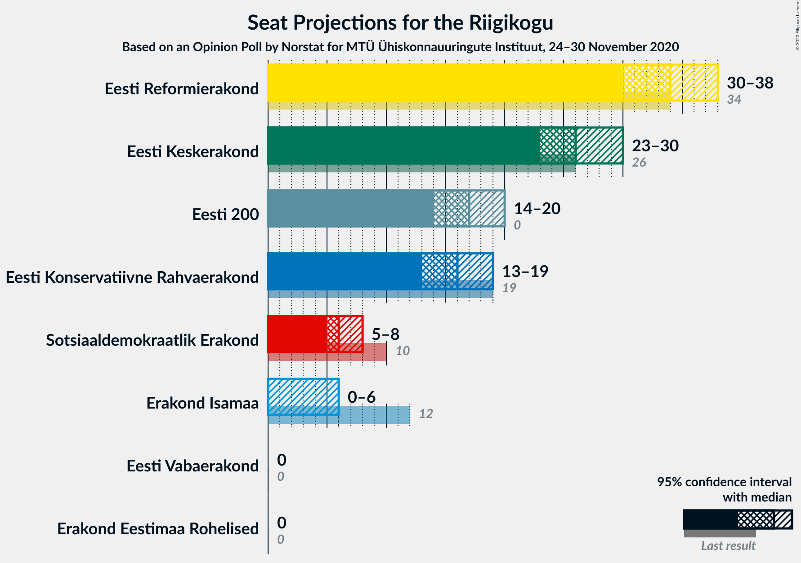
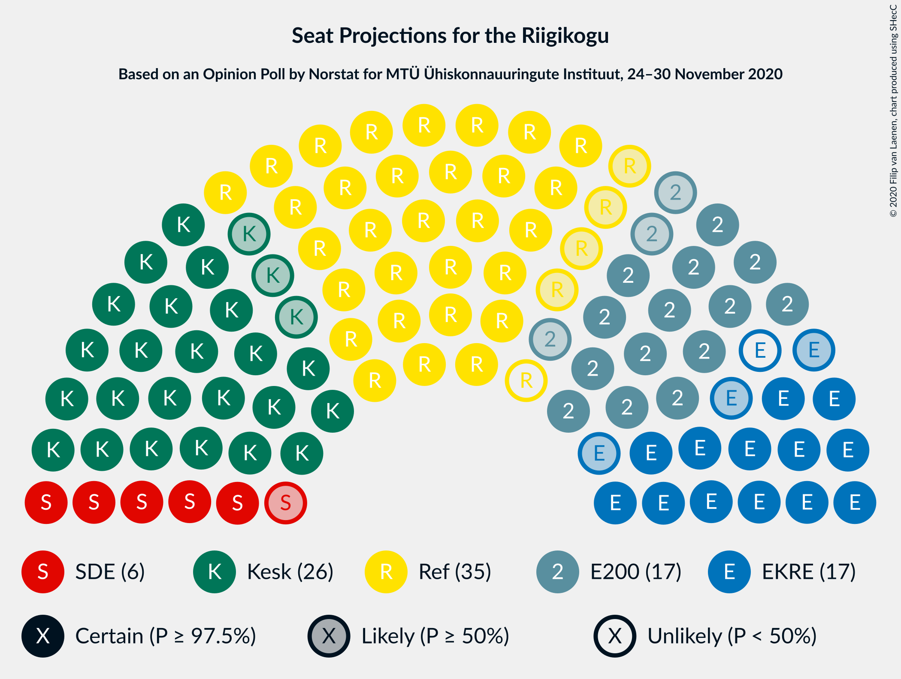
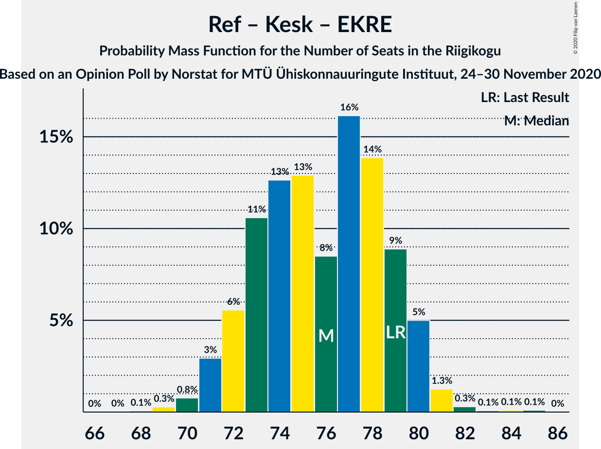
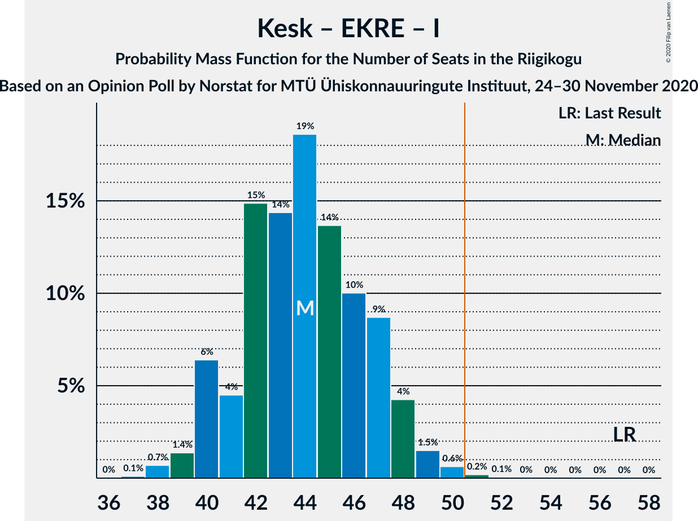

# Opinion Poll by Norstat for MTÜ Ühiskonnauuringute Instituut, 24–30 November 2020

<a href="#voting-intentions">Voting Intentions</a> | <a href="#seats">Seats</a> | <a href="#coalitions">Coalitions</a> | <a href="#technical-information">Technical Information</a>

## Voting Intentions

### Confidence Intervals

| Party | Last Result | Poll Result | 80% Confidence Interval | 90% Confidence Interval | 95% Confidence Interval | 99% Confidence Interval |
|:-----:|:-----------:|:-----------:|:-----------------------:|:-----------------------:|:-----------------------:|:-----------------------:|
| Eesti Reformierakond | 28.9% | 28.8% | 27.0–30.7% |26.5–31.2% |26.1–31.7% |25.2–32.6% |
| Eesti Keskerakond | 23.1% | 22.8% | 21.2–24.6% |20.7–25.1% |20.3–25.5% |19.5–26.4% |
| Eesti 200 | 4.4% | 15.3% | 13.9–16.8% |13.5–17.3% |13.2–17.7% |12.6–18.4% |
| Eesti Konservatiivne Rahvaerakond | 17.8% | 14.7% | 13.3–16.2% |13.0–16.7% |12.6–17.0% |12.0–17.8% |
| Sotsiaaldemokraatlik Erakond | 9.8% | 6.6% | 5.7–7.7% |5.4–8.0% |5.2–8.3% |4.8–8.9% |
| Erakond Isamaa | 11.4% | 4.9% | 4.1–5.9% |3.9–6.2% |3.7–6.4% |3.4–6.9% |
| Erakond Eestimaa Rohelised | 1.8% | 3.6% | 2.9–4.5% |2.8–4.7% |2.6–5.0% |2.3–5.4% |
| Eesti Vabaerakond | 1.2% | 1.1% | 0.8–1.7% |0.7–1.8% |0.6–2.0% |0.5–2.3% |

*Note:* The poll result column reflects the actual value used in the calculations. Published results may vary slightly, and in addition be rounded to fewer digits.

## Seats

### Confidence Intervals

| Party | Last Result | Median | 80% Confidence Interval | 90% Confidence Interval | 95% Confidence Interval | 99% Confidence Interval |
|:-----:|:-----------:|:------:|:-----------------------:|:-----------------------:|:-----------------------:|:-----------------------:|
| <a href="#eesti-reformierakond">Eesti Reformierakond</a> | 34 | 34 | 31–36 |31–37 |30–38 |29–39 |
| <a href="#eesti-keskerakond">Eesti Keskerakond</a> | 26 | 26 | 24–28 |23–29 |23–30 |22–31 |
| <a href="#eesti-200">Eesti 200</a> | 0 | 17 | 15–19 |14–19 |14–20 |13–21 |
| <a href="#eesti-konservatiivne-rahvaerakond">Eesti Konservatiivne Rahvaerakond</a> | 19 | 16 | 14–18 |13–18 |13–19 |12–20 |
| <a href="#sotsiaaldemokraatlik-erakond">Sotsiaaldemokraatlik Erakond</a> | 10 | 6 | 5–7 |5–8 |5–8 |0–9 |
| <a href="#erakond-isamaa">Erakond Isamaa</a> | 12 | 0 | 0–5 |0–6 |0–6 |0–6 |
| <a href="#erakond-eestimaa-rohelised">Erakond Eestimaa Rohelised</a> | 0 | 0 | 0 |0 |0 |0–5 |
| <a href="#eesti-vabaerakond">Eesti Vabaerakond</a> | 0 | 0 | 0 |0 |0 |0 |

### Eesti Reformierakond

*For a full overview of the results for this party, see the [Eesti Reformierakond](party-eestireformierakond.html) page.*

| Number of Seats | Probability | Accumulated | Special Marks |
|:---------------:|:-----------:|:-----------:|:-------------:|
| 27 | 0.1% | 100% |  |
| 28 | 0.2% | 99.9% |  |
| 29 | 1.4% | 99.8% |  |
| 30 | 3% | 98% |  |
| 31 | 6% | 95% |  |
| 32 | 10% | 89% |  |
| 33 | 16% | 79% |  |
| 34 | 20% | 63% | Last Result, Median |
| 35 | 25% | 43% |  |
| 36 | 11% | 18% |  |
| 37 | 4% | 7% |  |
| 38 | 2% | 3% |  |
| 39 | 0.9% | 1.2% |  |
| 40 | 0.3% | 0.3% |  |
| 41 | 0.1% | 0.1% |  |
| 42 | 0% | 0% |  |

### Eesti Keskerakond

*For a full overview of the results for this party, see the [Eesti Keskerakond](party-eestikeskerakond.html) page.*

| Number of Seats | Probability | Accumulated | Special Marks |
|:---------------:|:-----------:|:-----------:|:-------------:|
| 21 | 0.3% | 100% |  |
| 22 | 1.3% | 99.7% |  |
| 23 | 6% | 98% |  |
| 24 | 11% | 92% |  |
| 25 | 18% | 81% |  |
| 26 | 24% | 62% | Last Result, Median |
| 27 | 21% | 38% |  |
| 28 | 9% | 17% |  |
| 29 | 5% | 8% |  |
| 30 | 2% | 3% |  |
| 31 | 0.5% | 0.7% |  |
| 32 | 0.2% | 0.2% |  |
| 33 | 0% | 0% |  |

### Eesti 200

*For a full overview of the results for this party, see the [Eesti 200](party-eesti200.html) page.*

| Number of Seats | Probability | Accumulated | Special Marks |
|:---------------:|:-----------:|:-----------:|:-------------:|
| 0 | 0% | 100% | Last Result |
| 1 | 0% | 100% |  |
| 2 | 0% | 100% |  |
| 3 | 0% | 100% |  |
| 4 | 0% | 100% |  |
| 5 | 0% | 100% |  |
| 6 | 0% | 100% |  |
| 7 | 0% | 100% |  |
| 8 | 0% | 100% |  |
| 9 | 0% | 100% |  |
| 10 | 0% | 100% |  |
| 11 | 0% | 100% |  |
| 12 | 0.1% | 100% |  |
| 13 | 1.0% | 99.9% |  |
| 14 | 5% | 98.9% |  |
| 15 | 12% | 94% |  |
| 16 | 27% | 82% |  |
| 17 | 25% | 55% | Median |
| 18 | 19% | 31% |  |
| 19 | 8% | 11% |  |
| 20 | 2% | 3% |  |
| 21 | 0.4% | 0.5% |  |
| 22 | 0.1% | 0.1% |  |
| 23 | 0% | 0% |  |

### Eesti Konservatiivne Rahvaerakond

*For a full overview of the results for this party, see the [Eesti Konservatiivne Rahvaerakond](party-eestikonservatiivnerahvaerakond.html) page.*

| Number of Seats | Probability | Accumulated | Special Marks |
|:---------------:|:-----------:|:-----------:|:-------------:|
| 11 | 0.1% | 100% |  |
| 12 | 0.5% | 99.9% |  |
| 13 | 4% | 99.4% |  |
| 14 | 14% | 95% |  |
| 15 | 20% | 81% |  |
| 16 | 25% | 61% | Median |
| 17 | 23% | 36% |  |
| 18 | 10% | 13% |  |
| 19 | 2% | 3% | Last Result |
| 20 | 0.6% | 0.7% |  |
| 21 | 0.1% | 0.1% |  |
| 22 | 0% | 0% |  |

### Sotsiaaldemokraatlik Erakond

*For a full overview of the results for this party, see the [Sotsiaaldemokraatlik Erakond](party-sotsiaaldemokraatlikerakond.html) page.*

| Number of Seats | Probability | Accumulated | Special Marks |
|:---------------:|:-----------:|:-----------:|:-------------:|
| 0 | 1.2% | 100% |  |
| 1 | 0% | 98.8% |  |
| 2 | 0% | 98.8% |  |
| 3 | 0% | 98.8% |  |
| 4 | 1.2% | 98.8% |  |
| 5 | 11% | 98% |  |
| 6 | 51% | 87% | Median |
| 7 | 31% | 36% |  |
| 8 | 4% | 5% |  |
| 9 | 1.0% | 1.1% |  |
| 10 | 0.1% | 0.1% | Last Result |
| 11 | 0% | 0% |  |

### Erakond Isamaa

*For a full overview of the results for this party, see the [Erakond Isamaa](party-erakondisamaa.html) page.*

| Number of Seats | Probability | Accumulated | Special Marks |
|:---------------:|:-----------:|:-----------:|:-------------:|
| 0 | 58% | 100% | Median |
| 1 | 0% | 42% |  |
| 2 | 0% | 42% |  |
| 3 | 0% | 42% |  |
| 4 | 9% | 42% |  |
| 5 | 27% | 32% |  |
| 6 | 5% | 6% |  |
| 7 | 0.4% | 0.4% |  |
| 8 | 0% | 0% |  |
| 9 | 0% | 0% |  |
| 10 | 0% | 0% |  |
| 11 | 0% | 0% |  |
| 12 | 0% | 0% | Last Result |

### Erakond Eestimaa Rohelised

*For a full overview of the results for this party, see the [Erakond Eestimaa Rohelised](party-erakondeestimaarohelised.html) page.*

| Number of Seats | Probability | Accumulated | Special Marks |
|:---------------:|:-----------:|:-----------:|:-------------:|
| 0 | 98% | 100% | Last Result, Median |
| 1 | 0% | 2% |  |
| 2 | 0% | 2% |  |
| 3 | 0% | 2% |  |
| 4 | 0.9% | 2% |  |
| 5 | 1.2% | 1.2% |  |
| 6 | 0% | 0% |  |

### Eesti Vabaerakond

*For a full overview of the results for this party, see the [Eesti Vabaerakond](party-eestivabaerakond.html) page.*

| Number of Seats | Probability | Accumulated | Special Marks |
|:---------------:|:-----------:|:-----------:|:-------------:|
| 0 | 100% | 100% | Last Result, Median |

## Coalitions

### Confidence Intervals

| Coalition | Last Result | Median | Majority? | 80% Confidence Interval | 90% Confidence Interval | 95% Confidence Interval | 99% Confidence Interval |
|:---------:|:-----------:|:------:|:---------:|:-----------------------:|:-----------------------:|:-----------------------:|:-----------------------:|
| Eesti Reformierakond – Eesti Keskerakond – Eesti Konservatiivne Rahvaerakond | 79 | 76 | 100% | 73–79 | 72–80 | 71–80 | 70–82 |
| Eesti Reformierakond – Eesti Keskerakond | 60 | 60 | 100% | 57–63 | 56–64 | 55–64 | 54–66 |
| Eesti Reformierakond – Eesti Konservatiivne Rahvaerakond – Erakond Isamaa | 65 | 52 | 80% | 49–55 | 48–56 | 48–57 | 47–58 |
| Eesti Reformierakond – Eesti Konservatiivne Rahvaerakond | 53 | 50 | 47% | 47–52 | 46–53 | 45–54 | 44–56 |
| Eesti Keskerakond – Eesti Konservatiivne Rahvaerakond – Erakond Isamaa | 57 | 44 | 0.3% | 41–47 | 40–48 | 40–48 | 38–50 |
| Eesti Reformierakond – Sotsiaaldemokraatlik Erakond – Erakond Isamaa – Eesti Vabaerakond | 56 | 42 | 0% | 40–45 | 39–46 | 38–47 | 36–49 |
| Eesti Reformierakond – Sotsiaaldemokraatlik Erakond – Erakond Isamaa | 56 | 42 | 0% | 40–45 | 39–46 | 38–47 | 36–49 |
| Eesti Keskerakond – Eesti Konservatiivne Rahvaerakond | 45 | 42 | 0% | 39–45 | 38–46 | 38–46 | 36–48 |
| Eesti Reformierakond – Sotsiaaldemokraatlik Erakond | 44 | 40 | 0% | 38–42 | 36–43 | 36–44 | 34–46 |
| Eesti Reformierakond – Erakond Isamaa | 46 | 36 | 0% | 33–39 | 32–40 | 32–41 | 30–42 |
| Eesti Keskerakond – Sotsiaaldemokraatlik Erakond – Erakond Isamaa | 48 | 34 | 0% | 32–38 | 31–38 | 30–39 | 28–40 |
| Eesti Keskerakond – Sotsiaaldemokraatlik Erakond | 36 | 32 | 0% | 30–34 | 29–35 | 28–36 | 27–37 |
| Eesti Konservatiivne Rahvaerakond – Sotsiaaldemokraatlik Erakond | 29 | 22 | 0% | 20–24 | 19–25 | 19–25 | 17–27 |

### Eesti Reformierakond – Eesti Keskerakond – Eesti Konservatiivne Rahvaerakond

| Number of Seats | Probability | Accumulated | Special Marks |
|:---------------:|:-----------:|:-----------:|:-------------:|
| 68 | 0.1% | 100% |  |
| 69 | 0.3% | 99.9% |  |
| 70 | 0.8% | 99.6% |  |
| 71 | 3% | 98.9% |  |
| 72 | 6% | 96% |  |
| 73 | 11% | 90% |  |
| 74 | 13% | 80% |  |
| 75 | 13% | 67% |  |
| 76 | 8% | 54% | Median |
| 77 | 16% | 46% |  |
| 78 | 14% | 30% |  |
| 79 | 9% | 16% | Last Result |
| 80 | 5% | 7% |  |
| 81 | 1.3% | 2% |  |
| 82 | 0.3% | 0.6% |  |
| 83 | 0.1% | 0.3% |  |
| 84 | 0.1% | 0.2% |  |
| 85 | 0.1% | 0.1% |  |
| 86 | 0% | 0% |  |

### Eesti Reformierakond – Eesti Keskerakond

| Number of Seats | Probability | Accumulated | Special Marks |
|:---------------:|:-----------:|:-----------:|:-------------:|
| 52 | 0.1% | 100% |  |
| 53 | 0.2% | 99.9% |  |
| 54 | 0.8% | 99.8% |  |
| 55 | 2% | 99.0% |  |
| 56 | 6% | 97% |  |
| 57 | 9% | 91% |  |
| 58 | 9% | 82% |  |
| 59 | 12% | 73% |  |
| 60 | 19% | 61% | Last Result, Median |
| 61 | 17% | 43% |  |
| 62 | 11% | 25% |  |
| 63 | 7% | 14% |  |
| 64 | 5% | 7% |  |
| 65 | 2% | 2% |  |
| 66 | 0.6% | 0.9% |  |
| 67 | 0.3% | 0.3% |  |
| 68 | 0% | 0% |  |

### Eesti Reformierakond – Eesti Konservatiivne Rahvaerakond – Erakond Isamaa

| Number of Seats | Probability | Accumulated | Special Marks |
|:---------------:|:-----------:|:-----------:|:-------------:|
| 45 | 0.1% | 100% |  |
| 46 | 0.3% | 99.9% |  |
| 47 | 2% | 99.6% |  |
| 48 | 4% | 98% |  |
| 49 | 6% | 94% |  |
| 50 | 9% | 88% | Median |
| 51 | 24% | 80% | Majority |
| 52 | 20% | 56% |  |
| 53 | 16% | 36% |  |
| 54 | 10% | 20% |  |
| 55 | 3% | 10% |  |
| 56 | 4% | 7% |  |
| 57 | 2% | 3% |  |
| 58 | 0.6% | 1.0% |  |
| 59 | 0.2% | 0.4% |  |
| 60 | 0.1% | 0.2% |  |
| 61 | 0% | 0% |  |
| 62 | 0% | 0% |  |
| 63 | 0% | 0% |  |
| 64 | 0% | 0% |  |
| 65 | 0% | 0% | Last Result |

### Eesti Reformierakond – Eesti Konservatiivne Rahvaerakond

| Number of Seats | Probability | Accumulated | Special Marks |
|:---------------:|:-----------:|:-----------:|:-------------:|
| 43 | 0.2% | 100% |  |
| 44 | 1.2% | 99.8% |  |
| 45 | 2% | 98.6% |  |
| 46 | 3% | 97% |  |
| 47 | 8% | 94% |  |
| 48 | 15% | 86% |  |
| 49 | 13% | 71% |  |
| 50 | 11% | 58% | Median |
| 51 | 24% | 47% | Majority |
| 52 | 16% | 23% |  |
| 53 | 4% | 7% | Last Result |
| 54 | 2% | 4% |  |
| 55 | 1.1% | 2% |  |
| 56 | 0.3% | 0.6% |  |
| 57 | 0.2% | 0.3% |  |
| 58 | 0.1% | 0.1% |  |
| 59 | 0% | 0% |  |

### Eesti Keskerakond – Eesti Konservatiivne Rahvaerakond – Erakond Isamaa

| Number of Seats | Probability | Accumulated | Special Marks |
|:---------------:|:-----------:|:-----------:|:-------------:|
| 37 | 0.1% | 100% |  |
| 38 | 0.7% | 99.9% |  |
| 39 | 1.4% | 99.2% |  |
| 40 | 6% | 98% |  |
| 41 | 4% | 91% |  |
| 42 | 15% | 87% | Median |
| 43 | 14% | 72% |  |
| 44 | 19% | 58% |  |
| 45 | 14% | 39% |  |
| 46 | 10% | 25% |  |
| 47 | 9% | 15% |  |
| 48 | 4% | 7% |  |
| 49 | 1.5% | 2% |  |
| 50 | 0.6% | 0.9% |  |
| 51 | 0.2% | 0.3% | Majority |
| 52 | 0.1% | 0.1% |  |
| 53 | 0% | 0% |  |
| 54 | 0% | 0% |  |
| 55 | 0% | 0% |  |
| 56 | 0% | 0% |  |
| 57 | 0% | 0% | Last Result |

### Eesti Reformierakond – Sotsiaaldemokraatlik Erakond – Erakond Isamaa – Eesti Vabaerakond

| Number of Seats | Probability | Accumulated | Special Marks |
|:---------------:|:-----------:|:-----------:|:-------------:|
| 34 | 0.1% | 100% |  |
| 35 | 0.1% | 99.9% |  |
| 36 | 0.5% | 99.8% |  |
| 37 | 1.3% | 99.3% |  |
| 38 | 2% | 98% |  |
| 39 | 6% | 96% |  |
| 40 | 12% | 90% | Median |
| 41 | 20% | 78% |  |
| 42 | 14% | 58% |  |
| 43 | 14% | 44% |  |
| 44 | 11% | 30% |  |
| 45 | 9% | 19% |  |
| 46 | 6% | 10% |  |
| 47 | 3% | 4% |  |
| 48 | 0.7% | 1.2% |  |
| 49 | 0.4% | 0.5% |  |
| 50 | 0.1% | 0.1% |  |
| 51 | 0% | 0% | Majority |
| 52 | 0% | 0% |  |
| 53 | 0% | 0% |  |
| 54 | 0% | 0% |  |
| 55 | 0% | 0% |  |
| 56 | 0% | 0% | Last Result |

### Eesti Reformierakond – Sotsiaaldemokraatlik Erakond – Erakond Isamaa

| Number of Seats | Probability | Accumulated | Special Marks |
|:---------------:|:-----------:|:-----------:|:-------------:|
| 34 | 0.1% | 100% |  |
| 35 | 0.1% | 99.9% |  |
| 36 | 0.5% | 99.8% |  |
| 37 | 1.3% | 99.3% |  |
| 38 | 2% | 98% |  |
| 39 | 6% | 96% |  |
| 40 | 12% | 90% | Median |
| 41 | 20% | 78% |  |
| 42 | 14% | 58% |  |
| 43 | 14% | 44% |  |
| 44 | 11% | 30% |  |
| 45 | 9% | 19% |  |
| 46 | 6% | 10% |  |
| 47 | 3% | 4% |  |
| 48 | 0.7% | 1.2% |  |
| 49 | 0.4% | 0.5% |  |
| 50 | 0.1% | 0.1% |  |
| 51 | 0% | 0% | Majority |
| 52 | 0% | 0% |  |
| 53 | 0% | 0% |  |
| 54 | 0% | 0% |  |
| 55 | 0% | 0% |  |
| 56 | 0% | 0% | Last Result |

### Eesti Keskerakond – Eesti Konservatiivne Rahvaerakond

| Number of Seats | Probability | Accumulated | Special Marks |
|:---------------:|:-----------:|:-----------:|:-------------:|
| 35 | 0.1% | 100% |  |
| 36 | 0.5% | 99.9% |  |
| 37 | 2% | 99.5% |  |
| 38 | 3% | 98% |  |
| 39 | 7% | 94% |  |
| 40 | 17% | 87% |  |
| 41 | 11% | 71% |  |
| 42 | 22% | 60% | Median |
| 43 | 15% | 38% |  |
| 44 | 11% | 23% |  |
| 45 | 7% | 12% | Last Result |
| 46 | 3% | 5% |  |
| 47 | 1.1% | 2% |  |
| 48 | 0.4% | 0.5% |  |
| 49 | 0.1% | 0.1% |  |
| 50 | 0% | 0% |  |

### Eesti Reformierakond – Sotsiaaldemokraatlik Erakond

| Number of Seats | Probability | Accumulated | Special Marks |
|:---------------:|:-----------:|:-----------:|:-------------:|
| 32 | 0.1% | 100% |  |
| 33 | 0.1% | 99.9% |  |
| 34 | 0.4% | 99.8% |  |
| 35 | 2% | 99.4% |  |
| 36 | 3% | 98% |  |
| 37 | 4% | 95% |  |
| 38 | 10% | 91% |  |
| 39 | 13% | 82% |  |
| 40 | 21% | 68% | Median |
| 41 | 23% | 47% |  |
| 42 | 14% | 24% |  |
| 43 | 6% | 10% |  |
| 44 | 2% | 4% | Last Result |
| 45 | 1.2% | 2% |  |
| 46 | 0.6% | 0.7% |  |
| 47 | 0.1% | 0.2% |  |
| 48 | 0% | 0% |  |

### Eesti Reformierakond – Erakond Isamaa

| Number of Seats | Probability | Accumulated | Special Marks |
|:---------------:|:-----------:|:-----------:|:-------------:|
| 29 | 0.1% | 100% |  |
| 30 | 0.4% | 99.9% |  |
| 31 | 1.3% | 99.4% |  |
| 32 | 3% | 98% |  |
| 33 | 7% | 95% |  |
| 34 | 14% | 88% | Median |
| 35 | 23% | 75% |  |
| 36 | 13% | 52% |  |
| 37 | 13% | 39% |  |
| 38 | 10% | 26% |  |
| 39 | 7% | 17% |  |
| 40 | 5% | 10% |  |
| 41 | 3% | 4% |  |
| 42 | 1.1% | 1.4% |  |
| 43 | 0.3% | 0.4% |  |
| 44 | 0.1% | 0.1% |  |
| 45 | 0% | 0% |  |
| 46 | 0% | 0% | Last Result |

### Eesti Keskerakond – Sotsiaaldemokraatlik Erakond – Erakond Isamaa

| Number of Seats | Probability | Accumulated | Special Marks |
|:---------------:|:-----------:|:-----------:|:-------------:|
| 26 | 0.1% | 100% |  |
| 27 | 0.1% | 99.9% |  |
| 28 | 0.3% | 99.8% |  |
| 29 | 0.5% | 99.4% |  |
| 30 | 3% | 98.9% |  |
| 31 | 6% | 96% |  |
| 32 | 18% | 90% | Median |
| 33 | 17% | 73% |  |
| 34 | 13% | 56% |  |
| 35 | 10% | 43% |  |
| 36 | 12% | 33% |  |
| 37 | 10% | 21% |  |
| 38 | 6% | 11% |  |
| 39 | 3% | 5% |  |
| 40 | 1.4% | 2% |  |
| 41 | 0.4% | 0.5% |  |
| 42 | 0.1% | 0.1% |  |
| 43 | 0% | 0% |  |
| 44 | 0% | 0% |  |
| 45 | 0% | 0% |  |
| 46 | 0% | 0% |  |
| 47 | 0% | 0% |  |
| 48 | 0% | 0% | Last Result |

### Eesti Keskerakond – Sotsiaaldemokraatlik Erakond

| Number of Seats | Probability | Accumulated | Special Marks |
|:---------------:|:-----------:|:-----------:|:-------------:|
| 25 | 0.2% | 100% |  |
| 26 | 0.2% | 99.8% |  |
| 27 | 0.8% | 99.6% |  |
| 28 | 2% | 98.8% |  |
| 29 | 4% | 97% |  |
| 30 | 8% | 93% |  |
| 31 | 16% | 85% |  |
| 32 | 26% | 68% | Median |
| 33 | 21% | 43% |  |
| 34 | 12% | 22% |  |
| 35 | 5% | 10% |  |
| 36 | 4% | 5% | Last Result |
| 37 | 1.0% | 1.4% |  |
| 38 | 0.4% | 0.5% |  |
| 39 | 0.1% | 0.1% |  |
| 40 | 0% | 0% |  |

### Eesti Konservatiivne Rahvaerakond – Sotsiaaldemokraatlik Erakond

| Number of Seats | Probability | Accumulated | Special Marks |
|:---------------:|:-----------:|:-----------:|:-------------:|
| 14 | 0.1% | 100% |  |
| 15 | 0.2% | 99.9% |  |
| 16 | 0.3% | 99.8% |  |
| 17 | 0.4% | 99.5% |  |
| 18 | 1.2% | 99.1% |  |
| 19 | 4% | 98% |  |
| 20 | 11% | 94% |  |
| 21 | 18% | 83% |  |
| 22 | 21% | 65% | Median |
| 23 | 24% | 44% |  |
| 24 | 13% | 20% |  |
| 25 | 5% | 7% |  |
| 26 | 1.5% | 2% |  |
| 27 | 0.4% | 0.5% |  |
| 28 | 0.1% | 0.1% |  |
| 29 | 0% | 0% | Last Result |

## Technical Information

### Opinion Poll

+ **Polling firm:** Norstat
+ **Commissioner(s):** MTÜ Ühiskonnauuringute Instituut
+ **Fieldwork period:** 24–30 November 2020

### Calculations

+ **Sample size:** 1000
+ **Simulations done:** 1,048,576
+ **Error estimate:** 1.02%

