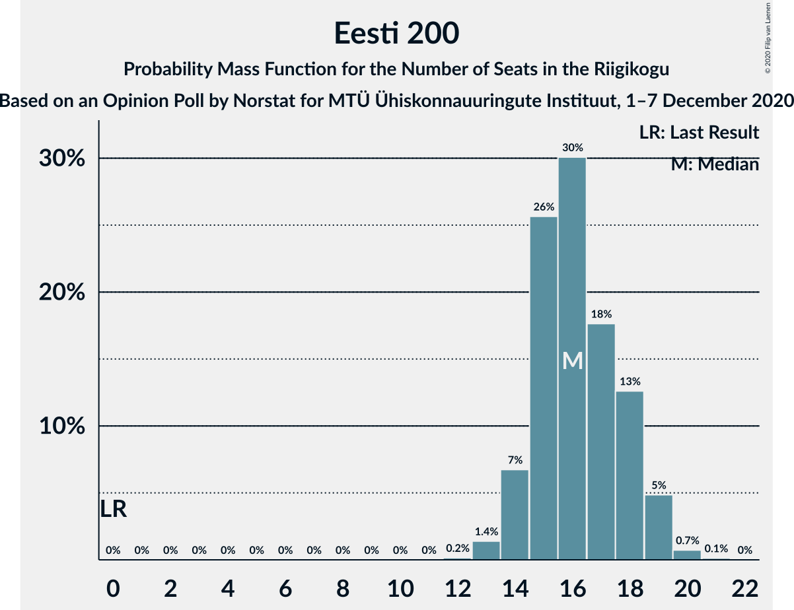
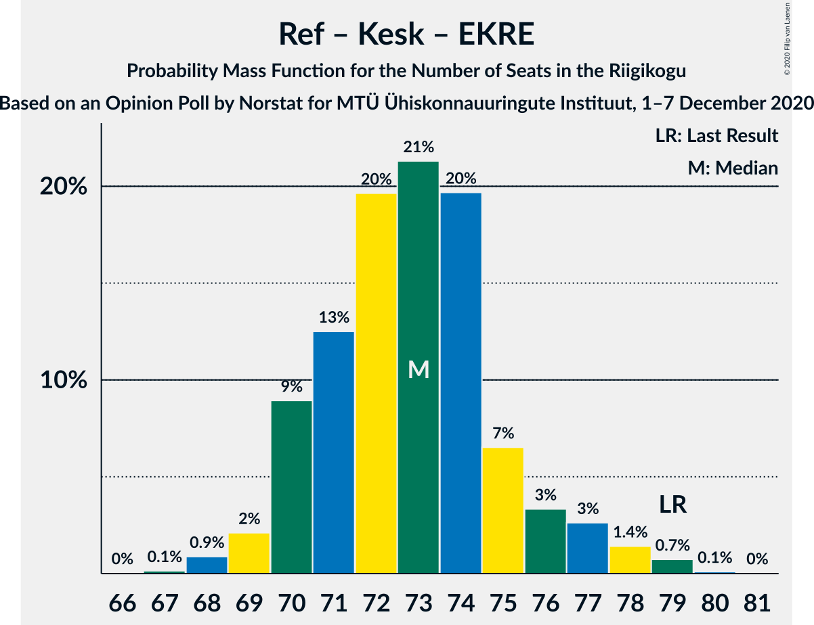

# Opinion Poll by Norstat for MTÜ Ühiskonnauuringute Instituut, 1–7 December 2020

<a href="#voting-intentions">Voting Intentions</a> | <a href="#seats">Seats</a> | <a href="#coalitions">Coalitions</a> | <a href="#technical-information">Technical Information</a>

## Voting Intentions

### Confidence Intervals

| Party | Last Result | Poll Result | 80% Confidence Interval | 90% Confidence Interval | 95% Confidence Interval | 99% Confidence Interval |
|:-----:|:-----------:|:-----------:|:-----------------------:|:-----------------------:|:-----------------------:|:-----------------------:|
| Eesti Reformierakond | 28.9% | 32.3% | 30.4–34.2% |29.9–34.8% |29.4–35.2% |28.6–36.2% |
| Eesti Keskerakond | 23.1% | 22.2% | 20.6–23.9% |20.1–24.4% |19.7–24.9% |19.0–25.7% |
| Eesti 200 | 4.4% | 16.0% | 14.6–17.6% |14.2–18.0% |13.8–18.4% |13.2–19.2% |
| Eesti Konservatiivne Rahvaerakond | 17.8% | 13.7% | 12.4–15.2% |12.0–15.6% |11.7–16.0% |11.1–16.7% |
| Sotsiaaldemokraatlik Erakond | 9.8% | 8.4% | 7.4–9.6% |7.1–10.0% |6.8–10.3% |6.4–10.9% |
| Erakond Isamaa | 11.4% | 5.7% | 4.8–6.8% |4.6–7.0% |4.4–7.3% |4.0–7.8% |
| Erakond Eestimaa Rohelised | 1.8% | 1.8% | 1.4–2.5% |1.2–2.7% |1.1–2.8% |1.0–3.2% |

*Note:* The poll result column reflects the actual value used in the calculations. Published results may vary slightly, and in addition be rounded to fewer digits.

## Seats

### Confidence Intervals

| Party | Last Result | Median | 80% Confidence Interval | 90% Confidence Interval | 95% Confidence Interval | 99% Confidence Interval |
|:-----:|:-----------:|:------:|:-----------------------:|:-----------------------:|:-----------------------:|:-----------------------:|
| <a href="#eesti-reformierakond">Eesti Reformierakond</a> | 34 | 36 | 33–38 |33–39 |32–39 |31–41 |
| <a href="#eesti-keskerakond">Eesti Keskerakond</a> | 26 | 23 | 22–25 |21–26 |20–27 |20–28 |
| <a href="#eesti-200">Eesti 200</a> | 0 | 16 | 15–18 |14–19 |14–19 |13–20 |
| <a href="#eesti-konservatiivne-rahvaerakond">Eesti Konservatiivne Rahvaerakond</a> | 19 | 14 | 12–15 |12–16 |11–16 |11–17 |
| <a href="#sotsiaaldemokraatlik-erakond">Sotsiaaldemokraatlik Erakond</a> | 10 | 8 | 7–9 |6–9 |6–10 |5–10 |
| <a href="#erakond-isamaa">Erakond Isamaa</a> | 12 | 5 | 0–6 |0–6 |0–6 |0–7 |
| <a href="#erakond-eestimaa-rohelised">Erakond Eestimaa Rohelised</a> | 0 | 0 | 0 |0 |0 |0 |

### Eesti Reformierakond

*For a full overview of the results for this party, see the [Eesti Reformierakond](party-eestireformierakond.html) page.*

| Number of Seats | Probability | Accumulated | Special Marks |
|:---------------:|:-----------:|:-----------:|:-------------:|
| 30 | 0.1% | 100% |  |
| 31 | 0.5% | 99.9% |  |
| 32 | 3% | 99.3% |  |
| 33 | 7% | 97% |  |
| 34 | 10% | 89% | Last Result |
| 35 | 22% | 79% |  |
| 36 | 29% | 57% | Median |
| 37 | 14% | 29% |  |
| 38 | 7% | 14% |  |
| 39 | 5% | 7% |  |
| 40 | 1.4% | 2% |  |
| 41 | 0.6% | 0.8% |  |
| 42 | 0.2% | 0.2% |  |
| 43 | 0% | 0% |  |

### Eesti Keskerakond

*For a full overview of the results for this party, see the [Eesti Keskerakond](party-eestikeskerakond.html) page.*

| Number of Seats | Probability | Accumulated | Special Marks |
|:---------------:|:-----------:|:-----------:|:-------------:|
| 19 | 0.4% | 100% |  |
| 20 | 3% | 99.5% |  |
| 21 | 7% | 97% |  |
| 22 | 18% | 90% |  |
| 23 | 26% | 72% | Median |
| 24 | 22% | 46% |  |
| 25 | 15% | 24% |  |
| 26 | 6% | 9% | Last Result |
| 27 | 2% | 3% |  |
| 28 | 0.7% | 0.8% |  |
| 29 | 0.1% | 0.1% |  |
| 30 | 0% | 0% |  |

### Eesti 200

*For a full overview of the results for this party, see the [Eesti 200](party-eesti200.html) page.*

| Number of Seats | Probability | Accumulated | Special Marks |
|:---------------:|:-----------:|:-----------:|:-------------:|
| 0 | 0% | 100% | Last Result |
| 1 | 0% | 100% |  |
| 2 | 0% | 100% |  |
| 3 | 0% | 100% |  |
| 4 | 0% | 100% |  |
| 5 | 0% | 100% |  |
| 6 | 0% | 100% |  |
| 7 | 0% | 100% |  |
| 8 | 0% | 100% |  |
| 9 | 0% | 100% |  |
| 10 | 0% | 100% |  |
| 11 | 0% | 100% |  |
| 12 | 0.2% | 100% |  |
| 13 | 1.4% | 99.8% |  |
| 14 | 7% | 98% |  |
| 15 | 26% | 92% |  |
| 16 | 30% | 66% | Median |
| 17 | 18% | 36% |  |
| 18 | 13% | 18% |  |
| 19 | 5% | 6% |  |
| 20 | 0.7% | 0.9% |  |
| 21 | 0.1% | 0.1% |  |
| 22 | 0% | 0% |  |

### Eesti Konservatiivne Rahvaerakond

*For a full overview of the results for this party, see the [Eesti Konservatiivne Rahvaerakond](party-eestikonservatiivnerahvaerakond.html) page.*

| Number of Seats | Probability | Accumulated | Special Marks |
|:---------------:|:-----------:|:-----------:|:-------------:|
| 10 | 0.4% | 100% |  |
| 11 | 3% | 99.5% |  |
| 12 | 14% | 96% |  |
| 13 | 25% | 82% |  |
| 14 | 37% | 57% | Median |
| 15 | 15% | 20% |  |
| 16 | 5% | 6% |  |
| 17 | 0.9% | 1.1% |  |
| 18 | 0.2% | 0.2% |  |
| 19 | 0% | 0% | Last Result |

### Sotsiaaldemokraatlik Erakond

*For a full overview of the results for this party, see the [Sotsiaaldemokraatlik Erakond](party-sotsiaaldemokraatlikerakond.html) page.*

| Number of Seats | Probability | Accumulated | Special Marks |
|:---------------:|:-----------:|:-----------:|:-------------:|
| 5 | 0.7% | 100% |  |
| 6 | 8% | 99.3% |  |
| 7 | 29% | 91% |  |
| 8 | 42% | 62% | Median |
| 9 | 17% | 19% |  |
| 10 | 2% | 3% | Last Result |
| 11 | 0.4% | 0.5% |  |
| 12 | 0% | 0% |  |

### Erakond Isamaa

*For a full overview of the results for this party, see the [Erakond Isamaa](party-erakondisamaa.html) page.*

| Number of Seats | Probability | Accumulated | Special Marks |
|:---------------:|:-----------:|:-----------:|:-------------:|
| 0 | 14% | 100% |  |
| 1 | 0% | 86% |  |
| 2 | 0% | 86% |  |
| 3 | 0% | 86% |  |
| 4 | 21% | 86% |  |
| 5 | 49% | 66% | Median |
| 6 | 15% | 16% |  |
| 7 | 1.4% | 1.5% |  |
| 8 | 0.1% | 0.1% |  |
| 9 | 0% | 0% |  |
| 10 | 0% | 0% |  |
| 11 | 0% | 0% |  |
| 12 | 0% | 0% | Last Result |

### Erakond Eestimaa Rohelised

*For a full overview of the results for this party, see the [Erakond Eestimaa Rohelised](party-erakondeestimaarohelised.html) page.*

| Number of Seats | Probability | Accumulated | Special Marks |
|:---------------:|:-----------:|:-----------:|:-------------:|
| 0 | 100% | 100% | Last Result, Median |

## Coalitions

### Confidence Intervals

| Coalition | Last Result | Median | Majority? | 80% Confidence Interval | 90% Confidence Interval | 95% Confidence Interval | 99% Confidence Interval |
|:---------:|:-----------:|:------:|:---------:|:-----------------------:|:-----------------------:|:-----------------------:|:-----------------------:|
| Eesti Reformierakond – Eesti Keskerakond – Eesti Konservatiivne Rahvaerakond | 79 | 73 | 100% | 70–75 | 70–76 | 69–77 | 68–79 |
| Eesti Reformierakond – Eesti Keskerakond | 60 | 59 | 100% | 57–62 | 56–63 | 56–63 | 54–65 |
| Eesti Reformierakond – Eesti Konservatiivne Rahvaerakond – Erakond Isamaa | 65 | 54 | 92% | 51–56 | 50–57 | 49–57 | 48–59 |
| Eesti Reformierakond – Eesti Konservatiivne Rahvaerakond | 53 | 50 | 21% | 47–51 | 46–53 | 45–53 | 45–55 |
| Eesti Reformierakond – Sotsiaaldemokraatlik Erakond – Erakond Isamaa | 56 | 48 | 7% | 45–50 | 44–51 | 43–52 | 42–53 |
| Eesti Reformierakond – Sotsiaaldemokraatlik Erakond | 44 | 43 | 0.1% | 41–46 | 40–47 | 40–47 | 39–49 |
| Eesti Keskerakond – Eesti Konservatiivne Rahvaerakond – Erakond Isamaa | 57 | 42 | 0% | 39–44 | 37–45 | 37–45 | 35–46 |
| Eesti Reformierakond – Erakond Isamaa | 46 | 40 | 0% | 37–42 | 36–43 | 35–44 | 34–45 |
| Eesti Keskerakond – Eesti Konservatiivne Rahvaerakond | 45 | 37 | 0% | 35–39 | 34–40 | 33–41 | 32–42 |
| Eesti Keskerakond – Sotsiaaldemokraatlik Erakond – Erakond Isamaa | 48 | 36 | 0% | 33–38 | 32–39 | 31–39 | 30–40 |
| Eesti Keskerakond – Sotsiaaldemokraatlik Erakond | 36 | 31 | 0% | 29–33 | 28–34 | 28–35 | 27–36 |
| Eesti Konservatiivne Rahvaerakond – Sotsiaaldemokraatlik Erakond | 29 | 21 | 0% | 20–23 | 19–24 | 18–24 | 18–25 |

### Eesti Reformierakond – Eesti Keskerakond – Eesti Konservatiivne Rahvaerakond

| Number of Seats | Probability | Accumulated | Special Marks |
|:---------------:|:-----------:|:-----------:|:-------------:|
| 67 | 0.1% | 100% |  |
| 68 | 0.9% | 99.8% |  |
| 69 | 2% | 98.9% |  |
| 70 | 9% | 97% |  |
| 71 | 13% | 88% |  |
| 72 | 20% | 75% |  |
| 73 | 21% | 56% | Median |
| 74 | 20% | 34% |  |
| 75 | 7% | 15% |  |
| 76 | 3% | 8% |  |
| 77 | 3% | 5% |  |
| 78 | 1.4% | 2% |  |
| 79 | 0.7% | 0.9% | Last Result |
| 80 | 0.1% | 0.1% |  |
| 81 | 0% | 0% |  |

### Eesti Reformierakond – Eesti Keskerakond

| Number of Seats | Probability | Accumulated | Special Marks |
|:---------------:|:-----------:|:-----------:|:-------------:|
| 53 | 0.1% | 100% |  |
| 54 | 0.5% | 99.8% |  |
| 55 | 1.4% | 99.4% |  |
| 56 | 5% | 98% |  |
| 57 | 15% | 93% |  |
| 58 | 14% | 78% |  |
| 59 | 23% | 64% | Median |
| 60 | 21% | 42% | Last Result |
| 61 | 6% | 21% |  |
| 62 | 9% | 14% |  |
| 63 | 3% | 6% |  |
| 64 | 1.2% | 2% |  |
| 65 | 0.7% | 0.9% |  |
| 66 | 0.1% | 0.2% |  |
| 67 | 0.1% | 0.1% |  |
| 68 | 0% | 0% |  |

### Eesti Reformierakond – Eesti Konservatiivne Rahvaerakond – Erakond Isamaa

| Number of Seats | Probability | Accumulated | Special Marks |
|:---------------:|:-----------:|:-----------:|:-------------:|
| 46 | 0% | 100% |  |
| 47 | 0.3% | 99.9% |  |
| 48 | 0.4% | 99.7% |  |
| 49 | 4% | 99.3% |  |
| 50 | 4% | 96% |  |
| 51 | 7% | 92% | Majority |
| 52 | 9% | 84% |  |
| 53 | 16% | 75% |  |
| 54 | 22% | 59% |  |
| 55 | 22% | 37% | Median |
| 56 | 9% | 15% |  |
| 57 | 4% | 6% |  |
| 58 | 1.3% | 2% |  |
| 59 | 0.7% | 0.8% |  |
| 60 | 0.1% | 0.1% |  |
| 61 | 0% | 0% |  |
| 62 | 0% | 0% |  |
| 63 | 0% | 0% |  |
| 64 | 0% | 0% |  |
| 65 | 0% | 0% | Last Result |

### Eesti Reformierakond – Eesti Konservatiivne Rahvaerakond

| Number of Seats | Probability | Accumulated | Special Marks |
|:---------------:|:-----------:|:-----------:|:-------------:|
| 43 | 0.1% | 100% |  |
| 44 | 0.3% | 99.9% |  |
| 45 | 2% | 99.6% |  |
| 46 | 6% | 97% |  |
| 47 | 7% | 92% |  |
| 48 | 13% | 85% |  |
| 49 | 19% | 72% |  |
| 50 | 32% | 53% | Median |
| 51 | 12% | 21% | Majority |
| 52 | 4% | 10% |  |
| 53 | 3% | 5% | Last Result |
| 54 | 1.1% | 2% |  |
| 55 | 1.0% | 1.2% |  |
| 56 | 0.2% | 0.3% |  |
| 57 | 0% | 0.1% |  |
| 58 | 0% | 0% |  |

### Eesti Reformierakond – Sotsiaaldemokraatlik Erakond – Erakond Isamaa

| Number of Seats | Probability | Accumulated | Special Marks |
|:---------------:|:-----------:|:-----------:|:-------------:|
| 40 | 0.1% | 100% |  |
| 41 | 0.3% | 99.9% |  |
| 42 | 0.4% | 99.7% |  |
| 43 | 3% | 99.3% |  |
| 44 | 3% | 97% |  |
| 45 | 6% | 93% |  |
| 46 | 10% | 88% |  |
| 47 | 23% | 77% |  |
| 48 | 13% | 54% |  |
| 49 | 24% | 41% | Median |
| 50 | 10% | 18% |  |
| 51 | 4% | 7% | Majority |
| 52 | 3% | 3% |  |
| 53 | 0.6% | 0.7% |  |
| 54 | 0.1% | 0.1% |  |
| 55 | 0% | 0% |  |
| 56 | 0% | 0% | Last Result |

### Eesti Reformierakond – Sotsiaaldemokraatlik Erakond

| Number of Seats | Probability | Accumulated | Special Marks |
|:---------------:|:-----------:|:-----------:|:-------------:|
| 37 | 0% | 100% |  |
| 38 | 0.2% | 99.9% |  |
| 39 | 2% | 99.8% |  |
| 40 | 4% | 98% |  |
| 41 | 8% | 94% |  |
| 42 | 13% | 86% |  |
| 43 | 25% | 73% |  |
| 44 | 20% | 48% | Last Result, Median |
| 45 | 12% | 27% |  |
| 46 | 9% | 15% |  |
| 47 | 4% | 6% |  |
| 48 | 1.5% | 2% |  |
| 49 | 0.6% | 0.9% |  |
| 50 | 0.2% | 0.2% |  |
| 51 | 0% | 0.1% | Majority |
| 52 | 0% | 0% |  |

### Eesti Keskerakond – Eesti Konservatiivne Rahvaerakond – Erakond Isamaa

| Number of Seats | Probability | Accumulated | Special Marks |
|:---------------:|:-----------:|:-----------:|:-------------:|
| 34 | 0.2% | 100% |  |
| 35 | 0.8% | 99.8% |  |
| 36 | 0.8% | 99.0% |  |
| 37 | 3% | 98% |  |
| 38 | 4% | 95% |  |
| 39 | 6% | 91% |  |
| 40 | 19% | 85% |  |
| 41 | 15% | 66% |  |
| 42 | 24% | 51% | Median |
| 43 | 14% | 27% |  |
| 44 | 8% | 14% |  |
| 45 | 4% | 5% |  |
| 46 | 1.3% | 2% |  |
| 47 | 0.3% | 0.4% |  |
| 48 | 0.1% | 0.1% |  |
| 49 | 0% | 0% |  |
| 50 | 0% | 0% |  |
| 51 | 0% | 0% | Majority |
| 52 | 0% | 0% |  |
| 53 | 0% | 0% |  |
| 54 | 0% | 0% |  |
| 55 | 0% | 0% |  |
| 56 | 0% | 0% |  |
| 57 | 0% | 0% | Last Result |

### Eesti Reformierakond – Erakond Isamaa

| Number of Seats | Probability | Accumulated | Special Marks |
|:---------------:|:-----------:|:-----------:|:-------------:|
| 32 | 0.1% | 100% |  |
| 33 | 0.4% | 99.9% |  |
| 34 | 0.3% | 99.6% |  |
| 35 | 2% | 99.2% |  |
| 36 | 3% | 97% |  |
| 37 | 7% | 94% |  |
| 38 | 7% | 87% |  |
| 39 | 15% | 81% |  |
| 40 | 22% | 65% |  |
| 41 | 20% | 44% | Median |
| 42 | 14% | 23% |  |
| 43 | 5% | 9% |  |
| 44 | 3% | 4% |  |
| 45 | 0.6% | 0.8% |  |
| 46 | 0.2% | 0.2% | Last Result |
| 47 | 0% | 0% |  |

### Eesti Keskerakond – Eesti Konservatiivne Rahvaerakond

| Number of Seats | Probability | Accumulated | Special Marks |
|:---------------:|:-----------:|:-----------:|:-------------:|
| 31 | 0.2% | 100% |  |
| 32 | 0.4% | 99.8% |  |
| 33 | 2% | 99.4% |  |
| 34 | 4% | 97% |  |
| 35 | 13% | 93% |  |
| 36 | 17% | 80% |  |
| 37 | 25% | 63% | Median |
| 38 | 15% | 37% |  |
| 39 | 14% | 23% |  |
| 40 | 5% | 9% |  |
| 41 | 2% | 3% |  |
| 42 | 0.6% | 1.0% |  |
| 43 | 0.3% | 0.3% |  |
| 44 | 0% | 0.1% |  |
| 45 | 0% | 0% | Last Result |

### Eesti Keskerakond – Sotsiaaldemokraatlik Erakond – Erakond Isamaa

| Number of Seats | Probability | Accumulated | Special Marks |
|:---------------:|:-----------:|:-----------:|:-------------:|
| 28 | 0.1% | 100% |  |
| 29 | 0.3% | 99.9% |  |
| 30 | 0.9% | 99.6% |  |
| 31 | 2% | 98.7% |  |
| 32 | 3% | 96% |  |
| 33 | 10% | 94% |  |
| 34 | 9% | 84% |  |
| 35 | 25% | 75% |  |
| 36 | 23% | 50% | Median |
| 37 | 16% | 28% |  |
| 38 | 6% | 12% |  |
| 39 | 4% | 6% |  |
| 40 | 2% | 2% |  |
| 41 | 0.3% | 0.3% |  |
| 42 | 0.1% | 0.1% |  |
| 43 | 0% | 0% |  |
| 44 | 0% | 0% |  |
| 45 | 0% | 0% |  |
| 46 | 0% | 0% |  |
| 47 | 0% | 0% |  |
| 48 | 0% | 0% | Last Result |

### Eesti Keskerakond – Sotsiaaldemokraatlik Erakond

| Number of Seats | Probability | Accumulated | Special Marks |
|:---------------:|:-----------:|:-----------:|:-------------:|
| 26 | 0.2% | 100% |  |
| 27 | 1.4% | 99.8% |  |
| 28 | 4% | 98% |  |
| 29 | 8% | 94% |  |
| 30 | 20% | 86% |  |
| 31 | 28% | 66% | Median |
| 32 | 14% | 37% |  |
| 33 | 15% | 23% |  |
| 34 | 5% | 8% |  |
| 35 | 3% | 3% |  |
| 36 | 0.8% | 1.0% | Last Result |
| 37 | 0.1% | 0.2% |  |
| 38 | 0% | 0% |  |

### Eesti Konservatiivne Rahvaerakond – Sotsiaaldemokraatlik Erakond

| Number of Seats | Probability | Accumulated | Special Marks |
|:---------------:|:-----------:|:-----------:|:-------------:|
| 17 | 0.4% | 100% |  |
| 18 | 3% | 99.5% |  |
| 19 | 6% | 97% |  |
| 20 | 16% | 91% |  |
| 21 | 30% | 75% |  |
| 22 | 23% | 45% | Median |
| 23 | 15% | 21% |  |
| 24 | 5% | 7% |  |
| 25 | 2% | 2% |  |
| 26 | 0.3% | 0.4% |  |
| 27 | 0% | 0.1% |  |
| 28 | 0% | 0% |  |
| 29 | 0% | 0% | Last Result |

## Technical Information

### Opinion Poll

+ **Polling firm:** Norstat
+ **Commissioner(s):** MTÜ Ühiskonnauuringute Instituut
+ **Fieldwork period:** 1–7 December 2020

### Calculations

+ **Sample size:** 1001
+ **Simulations done:** 1,048,576
+ **Error estimate:** 0.82%

