# Opinion Poll by Turu-uuringute AS, 27 November–7 December 2020

<a href="#voting-intentions">Voting Intentions</a> | <a href="#seats">Seats</a> | <a href="#coalitions">Coalitions</a> | <a href="#technical-information">Technical Information</a>

## Voting Intentions

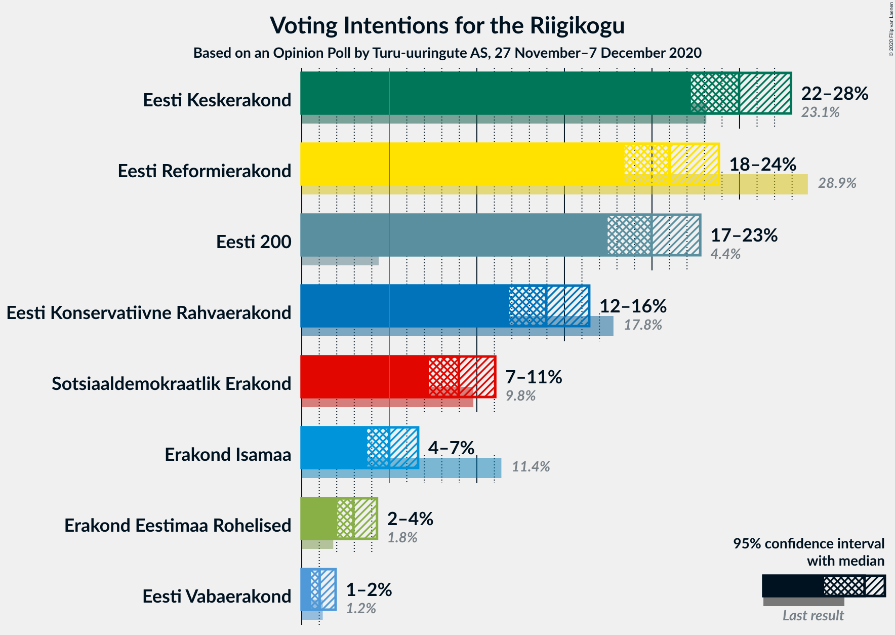

### Confidence Intervals

| Party | Last Result | Poll Result | 80% Confidence Interval | 90% Confidence Interval | 95% Confidence Interval | 99% Confidence Interval |
|:-----:|:-----------:|:-----------:|:-----------------------:|:-----------------------:|:-----------------------:|:-----------------------:|
| Eesti Keskerakond | 23.1% | 25.0% | 23.2–26.9% |22.7–27.5% |22.2–27.9% |21.4–28.9% |
| Eesti Reformierakond | 28.9% | 21.0% | 19.3–22.8% |18.8–23.4% |18.4–23.8% |17.6–24.7% |
| Eesti 200 | 4.4% | 20.0% | 18.3–21.8% |17.9–22.3% |17.5–22.8% |16.7–23.6% |
| Eesti Konservatiivne Rahvaerakond | 17.8% | 14.0% | 12.6–15.6% |12.2–16.0% |11.8–16.4% |11.2–17.2% |
| Sotsiaaldemokraatlik Erakond | 9.8% | 9.0% | 7.8–10.3% |7.5–10.7% |7.3–11.1% |6.7–11.7% |
| Erakond Isamaa | 11.4% | 5.0% | 4.2–6.1% |3.9–6.4% |3.7–6.6% |3.4–7.2% |
| Erakond Eestimaa Rohelised | 1.8% | 3.0% | 2.3–3.8% |2.2–4.1% |2.0–4.3% |1.8–4.8% |
| Eesti Vabaerakond | 1.2% | 1.0% | 0.7–1.6% |0.6–1.8% |0.5–1.9% |0.4–2.3% |

*Note:* The poll result column reflects the actual value used in the calculations. Published results may vary slightly, and in addition be rounded to fewer digits.

## Seats

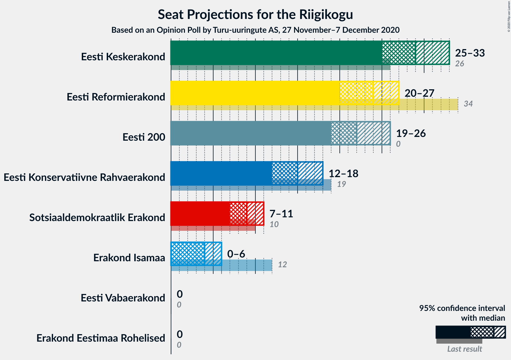

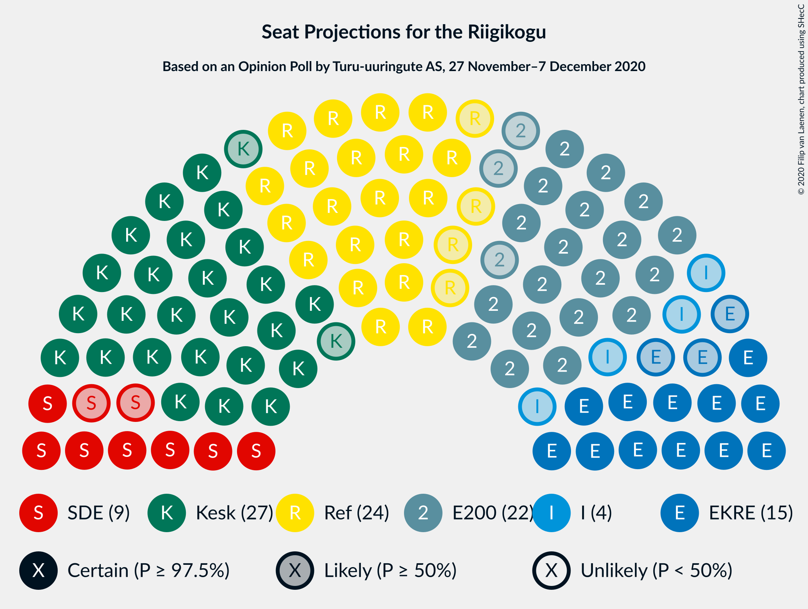

### Confidence Intervals

| Party | Last Result | Median | 80% Confidence Interval | 90% Confidence Interval | 95% Confidence Interval | 99% Confidence Interval |
|:-----:|:-----------:|:------:|:-----------------------:|:-----------------------:|:-----------------------:|:-----------------------:|
| <a href="#eesti-keskerakond">Eesti Keskerakond</a> | 26 | 29 | 26–31 |25–32 |25–33 |24–34 |
| <a href="#eesti-reformierakond">Eesti Reformierakond</a> | 34 | 24 | 21–26 |21–27 |20–27 |19–28 |
| <a href="#eesti-200">Eesti 200</a> | 0 | 22 | 20–25 |19–26 |19–26 |18–27 |
| <a href="#eesti-konservatiivne-rahvaerakond">Eesti Konservatiivne Rahvaerakond</a> | 19 | 15 | 13–17 |13–17 |12–18 |11–19 |
| <a href="#sotsiaaldemokraatlik-erakond">Sotsiaaldemokraatlik Erakond</a> | 10 | 9 | 7–10 |7–11 |7–11 |6–12 |
| <a href="#erakond-isamaa">Erakond Isamaa</a> | 12 | 4 | 0–5 |0–6 |0–6 |0–7 |
| <a href="#erakond-eestimaa-rohelised">Erakond Eestimaa Rohelised</a> | 0 | 0 | 0 |0 |0 |0 |
| <a href="#eesti-vabaerakond">Eesti Vabaerakond</a> | 0 | 0 | 0 |0 |0 |0 |

### Eesti Keskerakond

*For a full overview of the results for this party, see the [Eesti Keskerakond](party-eestikeskerakond.html) page.*

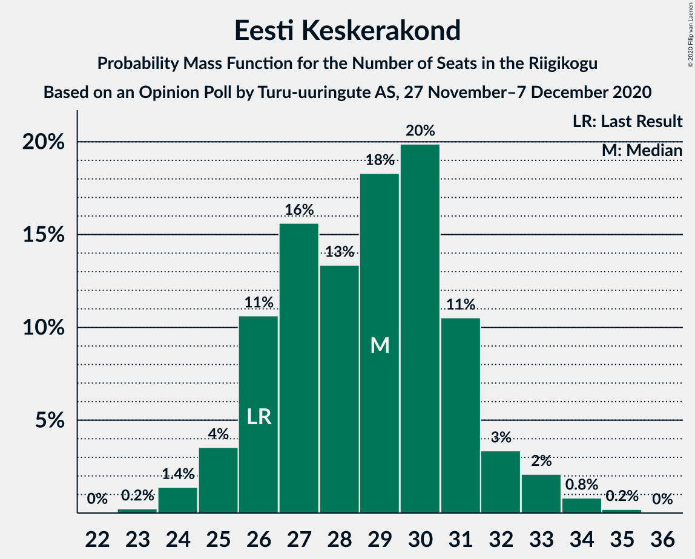

| Number of Seats | Probability | Accumulated | Special Marks |
|:---------------:|:-----------:|:-----------:|:-------------:|
| 22 | 0% | 100% |  |
| 23 | 0.2% | 99.9% |  |
| 24 | 1.4% | 99.7% |  |
| 25 | 4% | 98% |  |
| 26 | 11% | 95% | Last Result |
| 27 | 16% | 84% |  |
| 28 | 13% | 69% |  |
| 29 | 18% | 55% | Median |
| 30 | 20% | 37% |  |
| 31 | 11% | 17% |  |
| 32 | 3% | 6% |  |
| 33 | 2% | 3% |  |
| 34 | 0.8% | 1.1% |  |
| 35 | 0.2% | 0.2% |  |
| 36 | 0% | 0% |  |

### Eesti Reformierakond

*For a full overview of the results for this party, see the [Eesti Reformierakond](party-eestireformierakond.html) page.*

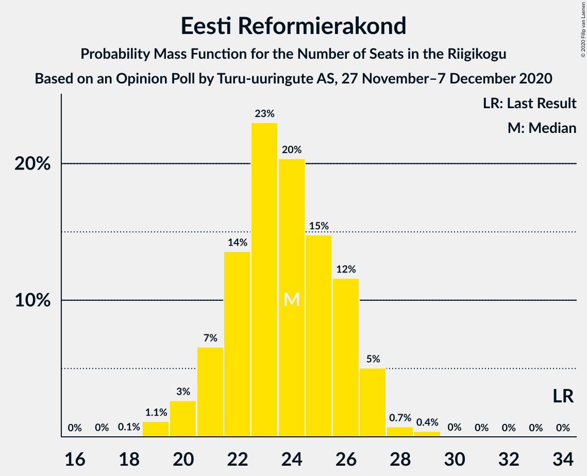

| Number of Seats | Probability | Accumulated | Special Marks |
|:---------------:|:-----------:|:-----------:|:-------------:|
| 18 | 0.1% | 100% |  |
| 19 | 1.1% | 99.9% |  |
| 20 | 3% | 98.8% |  |
| 21 | 7% | 96% |  |
| 22 | 14% | 90% |  |
| 23 | 23% | 76% |  |
| 24 | 20% | 53% | Median |
| 25 | 15% | 33% |  |
| 26 | 12% | 18% |  |
| 27 | 5% | 6% |  |
| 28 | 0.7% | 1.2% |  |
| 29 | 0.4% | 0.5% |  |
| 30 | 0% | 0.1% |  |
| 31 | 0% | 0% |  |
| 32 | 0% | 0% |  |
| 33 | 0% | 0% |  |
| 34 | 0% | 0% | Last Result |

### Eesti 200

*For a full overview of the results for this party, see the [Eesti 200](party-eesti200.html) page.*

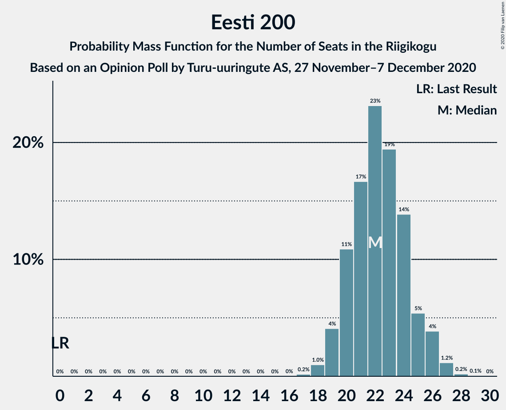

| Number of Seats | Probability | Accumulated | Special Marks |
|:---------------:|:-----------:|:-----------:|:-------------:|
| 0 | 0% | 100% | Last Result |
| 1 | 0% | 100% |  |
| 2 | 0% | 100% |  |
| 3 | 0% | 100% |  |
| 4 | 0% | 100% |  |
| 5 | 0% | 100% |  |
| 6 | 0% | 100% |  |
| 7 | 0% | 100% |  |
| 8 | 0% | 100% |  |
| 9 | 0% | 100% |  |
| 10 | 0% | 100% |  |
| 11 | 0% | 100% |  |
| 12 | 0% | 100% |  |
| 13 | 0% | 100% |  |
| 14 | 0% | 100% |  |
| 15 | 0% | 100% |  |
| 16 | 0% | 100% |  |
| 17 | 0.2% | 100% |  |
| 18 | 1.0% | 99.8% |  |
| 19 | 4% | 98.8% |  |
| 20 | 11% | 95% |  |
| 21 | 17% | 84% |  |
| 22 | 23% | 67% | Median |
| 23 | 19% | 44% |  |
| 24 | 14% | 25% |  |
| 25 | 5% | 11% |  |
| 26 | 4% | 5% |  |
| 27 | 1.2% | 1.4% |  |
| 28 | 0.2% | 0.3% |  |
| 29 | 0.1% | 0.1% |  |
| 30 | 0% | 0% |  |

### Eesti Konservatiivne Rahvaerakond

*For a full overview of the results for this party, see the [Eesti Konservatiivne Rahvaerakond](party-eestikonservatiivnerahvaerakond.html) page.*

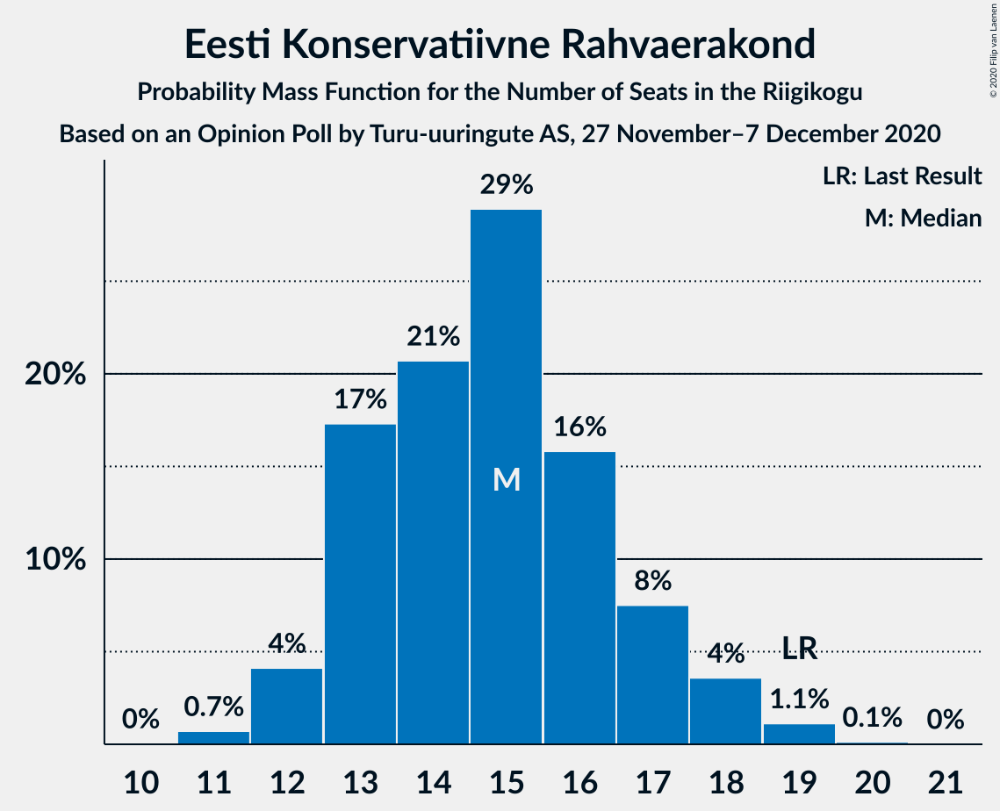

| Number of Seats | Probability | Accumulated | Special Marks |
|:---------------:|:-----------:|:-----------:|:-------------:|
| 11 | 0.7% | 100% |  |
| 12 | 4% | 99.2% |  |
| 13 | 17% | 95% |  |
| 14 | 21% | 78% |  |
| 15 | 29% | 57% | Median |
| 16 | 16% | 28% |  |
| 17 | 8% | 12% |  |
| 18 | 4% | 5% |  |
| 19 | 1.1% | 1.3% | Last Result |
| 20 | 0.1% | 0.1% |  |
| 21 | 0% | 0% |  |

### Sotsiaaldemokraatlik Erakond

*For a full overview of the results for this party, see the [Sotsiaaldemokraatlik Erakond](party-sotsiaaldemokraatlikerakond.html) page.*

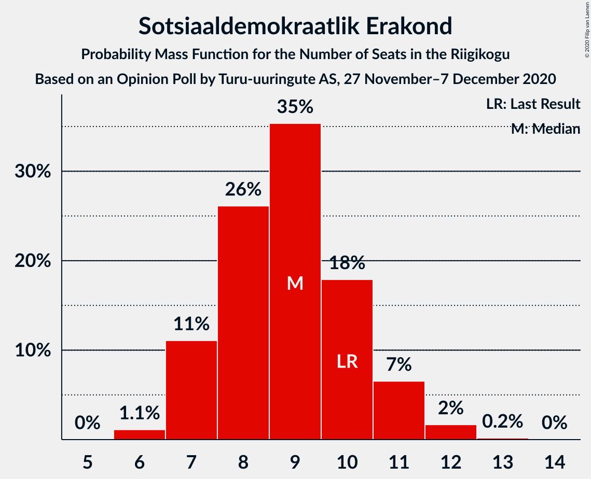

| Number of Seats | Probability | Accumulated | Special Marks |
|:---------------:|:-----------:|:-----------:|:-------------:|
| 6 | 1.1% | 100% |  |
| 7 | 11% | 98.9% |  |
| 8 | 26% | 88% |  |
| 9 | 35% | 62% | Median |
| 10 | 18% | 26% | Last Result |
| 11 | 7% | 8% |  |
| 12 | 2% | 2% |  |
| 13 | 0.2% | 0.2% |  |
| 14 | 0% | 0% |  |

### Erakond Isamaa

*For a full overview of the results for this party, see the [Erakond Isamaa](party-erakondisamaa.html) page.*

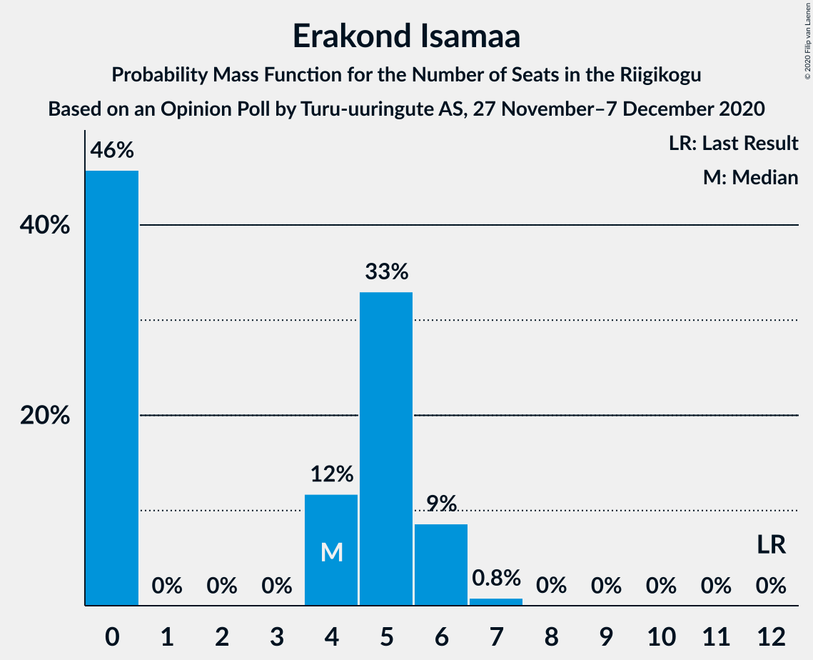

| Number of Seats | Probability | Accumulated | Special Marks |
|:---------------:|:-----------:|:-----------:|:-------------:|
| 0 | 46% | 100% |  |
| 1 | 0% | 54% |  |
| 2 | 0% | 54% |  |
| 3 | 0% | 54% |  |
| 4 | 12% | 54% | Median |
| 5 | 33% | 42% |  |
| 6 | 9% | 9% |  |
| 7 | 0.8% | 0.9% |  |
| 8 | 0% | 0% |  |
| 9 | 0% | 0% |  |
| 10 | 0% | 0% |  |
| 11 | 0% | 0% |  |
| 12 | 0% | 0% | Last Result |

### Erakond Eestimaa Rohelised

*For a full overview of the results for this party, see the [Erakond Eestimaa Rohelised](party-erakondeestimaarohelised.html) page.*

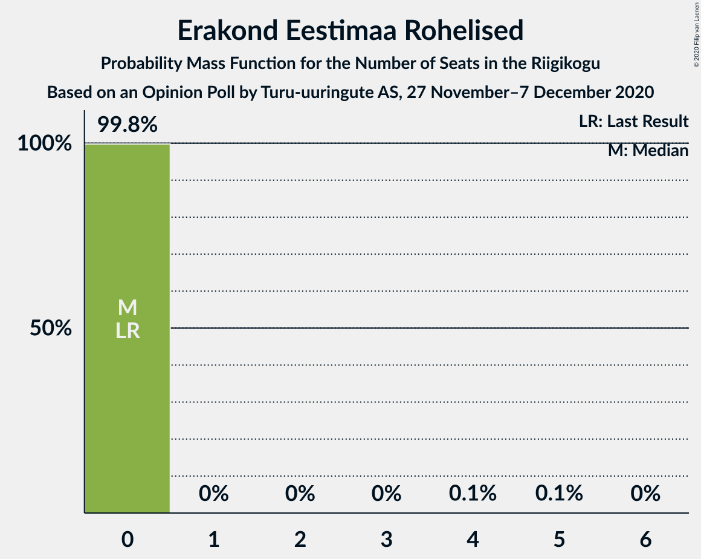

| Number of Seats | Probability | Accumulated | Special Marks |
|:---------------:|:-----------:|:-----------:|:-------------:|
| 0 | 99.8% | 100% | Last Result, Median |
| 1 | 0% | 0.2% |  |
| 2 | 0% | 0.2% |  |
| 3 | 0% | 0.2% |  |
| 4 | 0.1% | 0.2% |  |
| 5 | 0.1% | 0.1% |  |
| 6 | 0% | 0% |  |

### Eesti Vabaerakond

*For a full overview of the results for this party, see the [Eesti Vabaerakond](party-eestivabaerakond.html) page.*

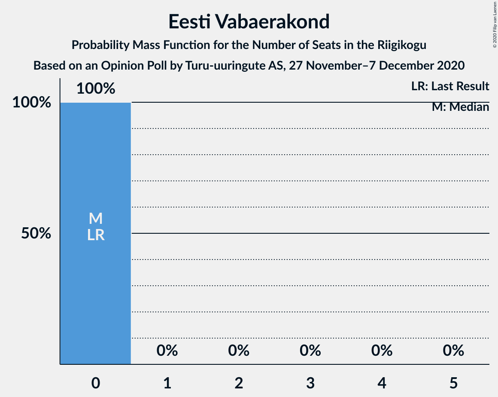

| Number of Seats | Probability | Accumulated | Special Marks |
|:---------------:|:-----------:|:-----------:|:-------------:|
| 0 | 100% | 100% | Last Result, Median |

## Coalitions

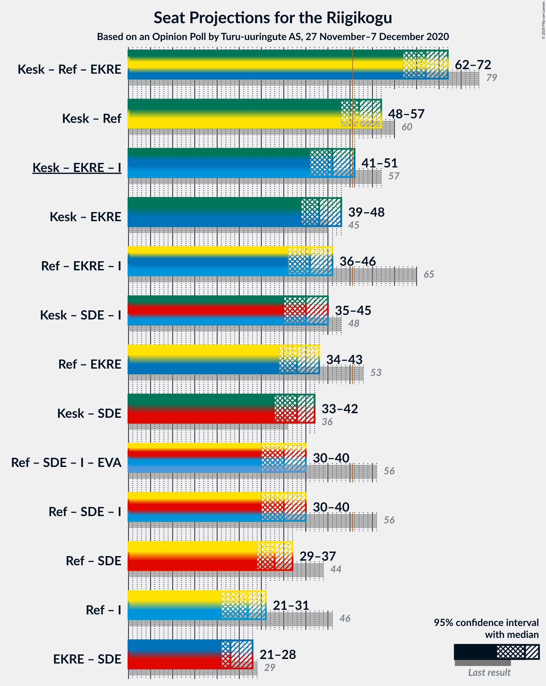

### Confidence Intervals

| Coalition | Last Result | Median | Majority? | 80% Confidence Interval | 90% Confidence Interval | 95% Confidence Interval | 99% Confidence Interval |
|:---------:|:-----------:|:------:|:---------:|:-----------------------:|:-----------------------:|:-----------------------:|:-----------------------:|
| Eesti Keskerakond – Eesti Reformierakond – Eesti Konservatiivne Rahvaerakond | 79 | 67 | 100% | 64–70 | 63–71 | 62–72 | 61–73 |
| Eesti Keskerakond – Eesti Reformierakond | 60 | 52 | 81% | 49–56 | 48–57 | 48–57 | 46–58 |
| Eesti Keskerakond – Eesti Konservatiivne Rahvaerakond – Erakond Isamaa | 57 | 46 | 3% | 43–49 | 42–50 | 41–51 | 40–52 |
| Eesti Keskerakond – Eesti Konservatiivne Rahvaerakond | 45 | 43 | 0.1% | 41–47 | 40–48 | 39–48 | 38–50 |
| Eesti Reformierakond – Eesti Konservatiivne Rahvaerakond – Erakond Isamaa | 65 | 41 | 0% | 38–45 | 37–45 | 36–46 | 35–47 |
| Eesti Keskerakond – Sotsiaaldemokraatlik Erakond – Erakond Isamaa | 48 | 40 | 0% | 37–43 | 36–44 | 35–45 | 34–46 |
| Eesti Reformierakond – Eesti Konservatiivne Rahvaerakond | 53 | 38 | 0% | 36–41 | 35–42 | 34–43 | 33–44 |
| Eesti Keskerakond – Sotsiaaldemokraatlik Erakond | 36 | 38 | 0% | 35–40 | 34–41 | 33–42 | 32–44 |
| Eesti Reformierakond – Sotsiaaldemokraatlik Erakond – Erakond Isamaa – Eesti Vabaerakond | 56 | 35 | 0% | 32–39 | 31–39 | 30–40 | 29–41 |
| Eesti Reformierakond – Sotsiaaldemokraatlik Erakond – Erakond Isamaa | 56 | 35 | 0% | 32–39 | 31–39 | 30–40 | 29–41 |
| Eesti Reformierakond – Sotsiaaldemokraatlik Erakond | 44 | 33 | 0% | 30–35 | 29–36 | 29–37 | 27–38 |
| Eesti Reformierakond – Erakond Isamaa | 46 | 27 | 0% | 23–30 | 22–30 | 21–31 | 20–32 |
| Eesti Konservatiivne Rahvaerakond – Sotsiaaldemokraatlik Erakond | 29 | 23 | 0% | 21–26 | 21–27 | 21–28 | 19–29 |

### Eesti Keskerakond – Eesti Reformierakond – Eesti Konservatiivne Rahvaerakond

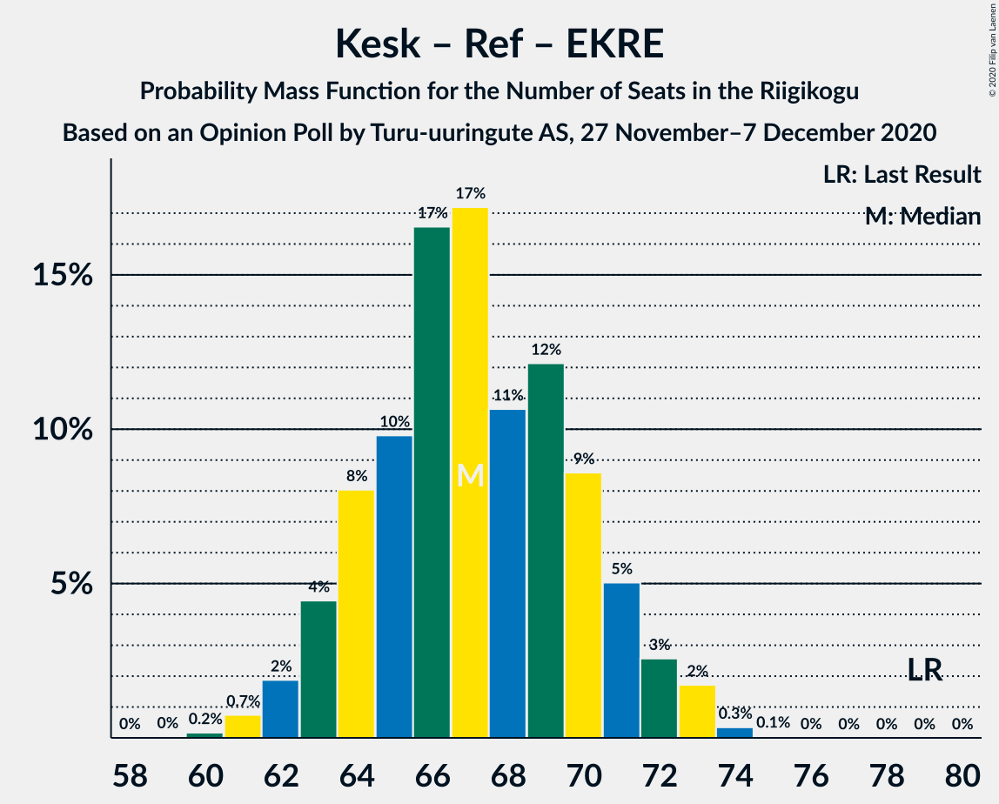

| Number of Seats | Probability | Accumulated | Special Marks |
|:---------------:|:-----------:|:-----------:|:-------------:|
| 60 | 0.2% | 100% |  |
| 61 | 0.7% | 99.8% |  |
| 62 | 2% | 99.0% |  |
| 63 | 4% | 97% |  |
| 64 | 8% | 93% |  |
| 65 | 10% | 85% |  |
| 66 | 17% | 75% |  |
| 67 | 17% | 58% |  |
| 68 | 11% | 41% | Median |
| 69 | 12% | 30% |  |
| 70 | 9% | 18% |  |
| 71 | 5% | 10% |  |
| 72 | 3% | 5% |  |
| 73 | 2% | 2% |  |
| 74 | 0.3% | 0.4% |  |
| 75 | 0.1% | 0.1% |  |
| 76 | 0% | 0% |  |
| 77 | 0% | 0% |  |
| 78 | 0% | 0% |  |
| 79 | 0% | 0% | Last Result |

### Eesti Keskerakond – Eesti Reformierakond

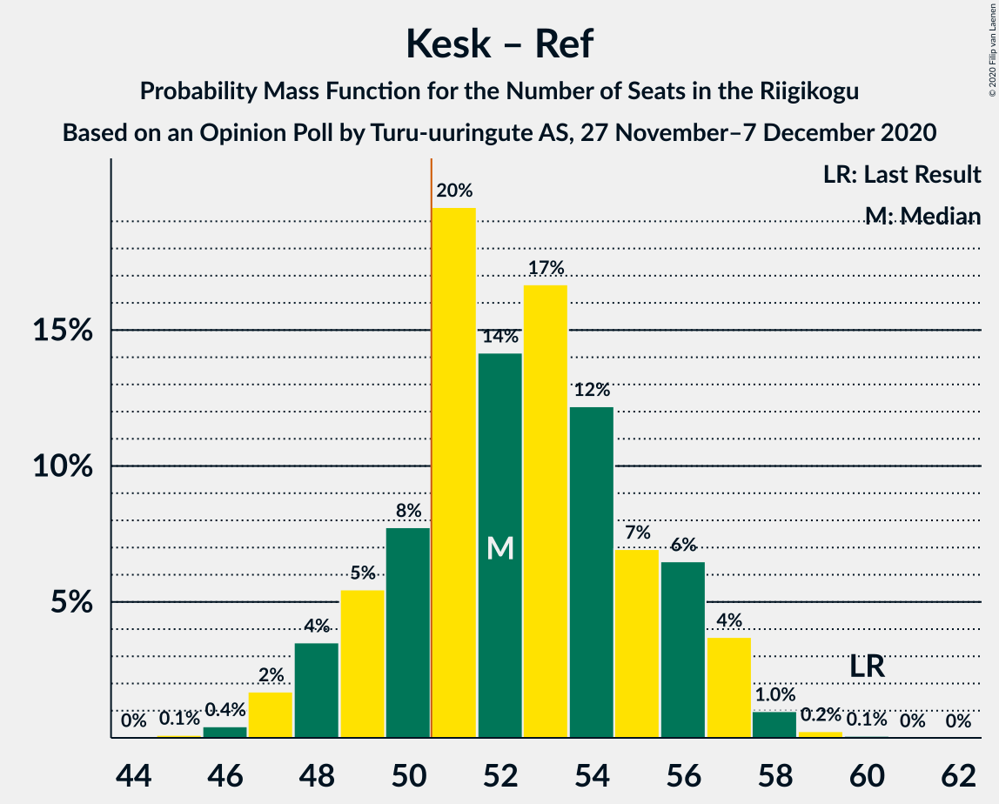

| Number of Seats | Probability | Accumulated | Special Marks |
|:---------------:|:-----------:|:-----------:|:-------------:|
| 45 | 0.1% | 100% |  |
| 46 | 0.4% | 99.9% |  |
| 47 | 2% | 99.4% |  |
| 48 | 4% | 98% |  |
| 49 | 5% | 94% |  |
| 50 | 8% | 89% |  |
| 51 | 20% | 81% | Majority |
| 52 | 14% | 62% |  |
| 53 | 17% | 47% | Median |
| 54 | 12% | 31% |  |
| 55 | 7% | 18% |  |
| 56 | 6% | 12% |  |
| 57 | 4% | 5% |  |
| 58 | 1.0% | 1.3% |  |
| 59 | 0.2% | 0.3% |  |
| 60 | 0.1% | 0.1% | Last Result |
| 61 | 0% | 0% |  |

### Eesti Keskerakond – Eesti Konservatiivne Rahvaerakond – Erakond Isamaa

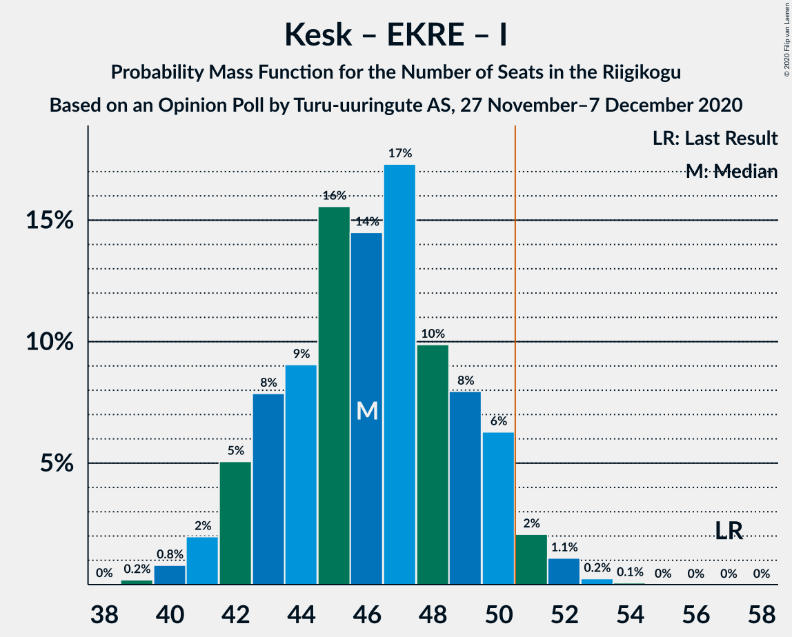

| Number of Seats | Probability | Accumulated | Special Marks |
|:---------------:|:-----------:|:-----------:|:-------------:|
| 39 | 0.2% | 100% |  |
| 40 | 0.8% | 99.8% |  |
| 41 | 2% | 99.0% |  |
| 42 | 5% | 97% |  |
| 43 | 8% | 92% |  |
| 44 | 9% | 84% |  |
| 45 | 16% | 75% |  |
| 46 | 14% | 59% |  |
| 47 | 17% | 45% |  |
| 48 | 10% | 28% | Median |
| 49 | 8% | 18% |  |
| 50 | 6% | 10% |  |
| 51 | 2% | 3% | Majority |
| 52 | 1.1% | 1.4% |  |
| 53 | 0.2% | 0.3% |  |
| 54 | 0.1% | 0.1% |  |
| 55 | 0% | 0% |  |
| 56 | 0% | 0% |  |
| 57 | 0% | 0% | Last Result |

### Eesti Keskerakond – Eesti Konservatiivne Rahvaerakond

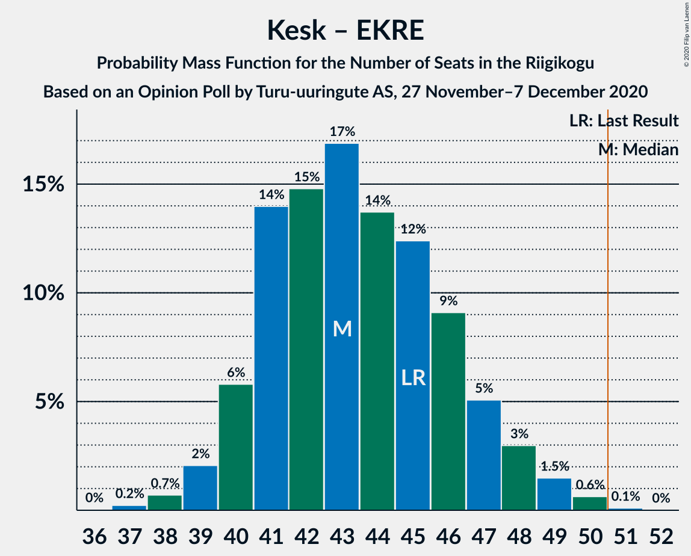

| Number of Seats | Probability | Accumulated | Special Marks |
|:---------------:|:-----------:|:-----------:|:-------------:|
| 36 | 0% | 100% |  |
| 37 | 0.2% | 99.9% |  |
| 38 | 0.7% | 99.7% |  |
| 39 | 2% | 99.0% |  |
| 40 | 6% | 97% |  |
| 41 | 14% | 91% |  |
| 42 | 15% | 77% |  |
| 43 | 17% | 62% |  |
| 44 | 14% | 46% | Median |
| 45 | 12% | 32% | Last Result |
| 46 | 9% | 19% |  |
| 47 | 5% | 10% |  |
| 48 | 3% | 5% |  |
| 49 | 1.5% | 2% |  |
| 50 | 0.6% | 0.8% |  |
| 51 | 0.1% | 0.1% | Majority |
| 52 | 0% | 0% |  |

### Eesti Reformierakond – Eesti Konservatiivne Rahvaerakond – Erakond Isamaa

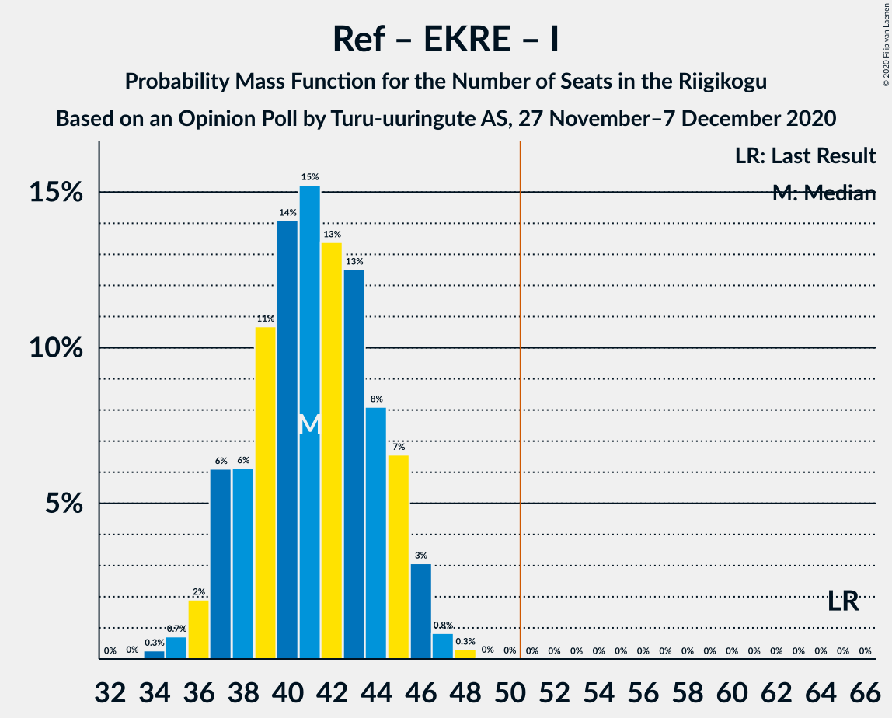

| Number of Seats | Probability | Accumulated | Special Marks |
|:---------------:|:-----------:|:-----------:|:-------------:|
| 33 | 0% | 100% |  |
| 34 | 0.3% | 99.9% |  |
| 35 | 0.7% | 99.7% |  |
| 36 | 2% | 99.0% |  |
| 37 | 6% | 97% |  |
| 38 | 6% | 91% |  |
| 39 | 11% | 85% |  |
| 40 | 14% | 74% |  |
| 41 | 15% | 60% |  |
| 42 | 13% | 45% |  |
| 43 | 13% | 31% | Median |
| 44 | 8% | 19% |  |
| 45 | 7% | 11% |  |
| 46 | 3% | 4% |  |
| 47 | 0.8% | 1.2% |  |
| 48 | 0.3% | 0.4% |  |
| 49 | 0% | 0.1% |  |
| 50 | 0% | 0% |  |
| 51 | 0% | 0% | Majority |
| 52 | 0% | 0% |  |
| 53 | 0% | 0% |  |
| 54 | 0% | 0% |  |
| 55 | 0% | 0% |  |
| 56 | 0% | 0% |  |
| 57 | 0% | 0% |  |
| 58 | 0% | 0% |  |
| 59 | 0% | 0% |  |
| 60 | 0% | 0% |  |
| 61 | 0% | 0% |  |
| 62 | 0% | 0% |  |
| 63 | 0% | 0% |  |
| 64 | 0% | 0% |  |
| 65 | 0% | 0% | Last Result |

### Eesti Keskerakond – Sotsiaaldemokraatlik Erakond – Erakond Isamaa

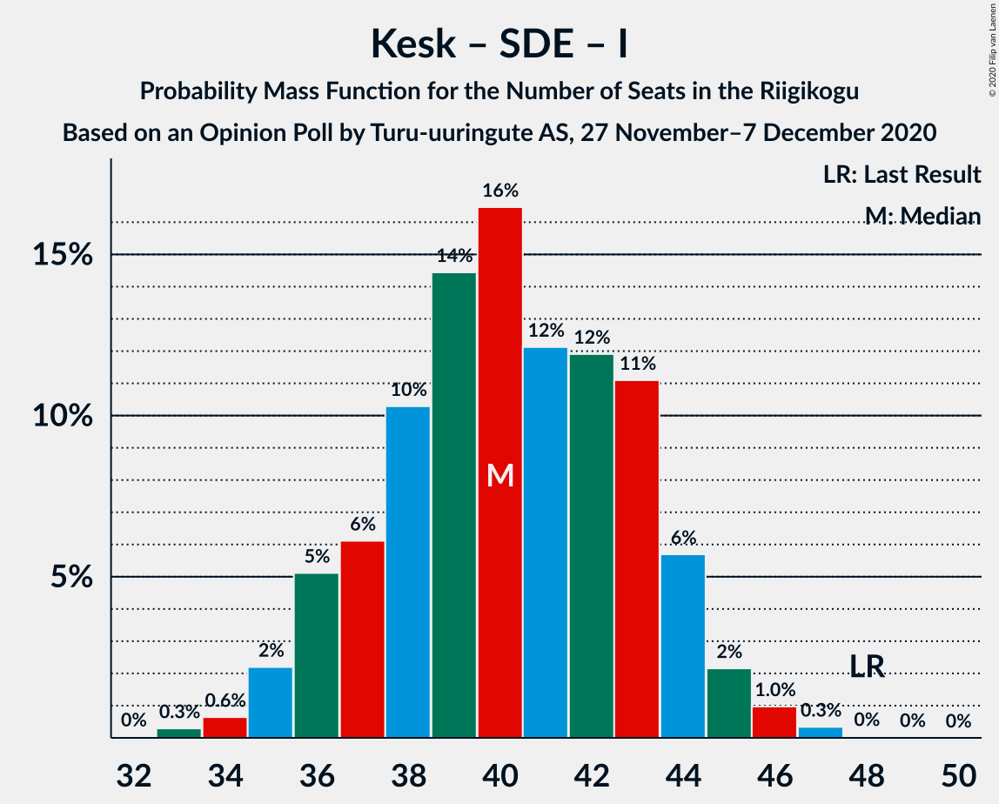

| Number of Seats | Probability | Accumulated | Special Marks |
|:---------------:|:-----------:|:-----------:|:-------------:|
| 33 | 0.3% | 100% |  |
| 34 | 0.6% | 99.7% |  |
| 35 | 2% | 99.0% |  |
| 36 | 5% | 97% |  |
| 37 | 6% | 92% |  |
| 38 | 10% | 86% |  |
| 39 | 14% | 75% |  |
| 40 | 16% | 61% |  |
| 41 | 12% | 44% |  |
| 42 | 12% | 32% | Median |
| 43 | 11% | 20% |  |
| 44 | 6% | 9% |  |
| 45 | 2% | 4% |  |
| 46 | 1.0% | 1.4% |  |
| 47 | 0.3% | 0.4% |  |
| 48 | 0% | 0.1% | Last Result |
| 49 | 0% | 0% |  |

### Eesti Reformierakond – Eesti Konservatiivne Rahvaerakond

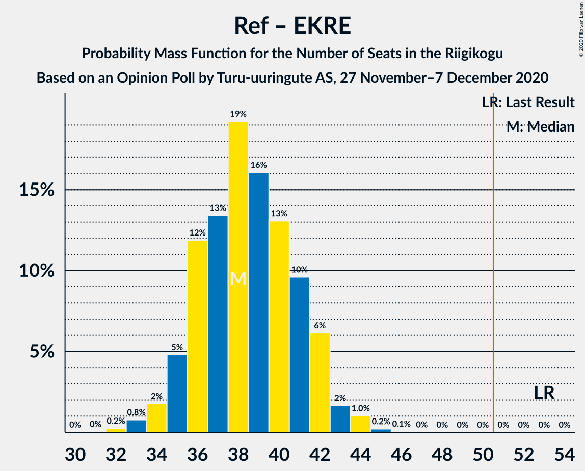

| Number of Seats | Probability | Accumulated | Special Marks |
|:---------------:|:-----------:|:-----------:|:-------------:|
| 32 | 0.2% | 100% |  |
| 33 | 0.8% | 99.7% |  |
| 34 | 2% | 98.9% |  |
| 35 | 5% | 97% |  |
| 36 | 12% | 92% |  |
| 37 | 13% | 81% |  |
| 38 | 19% | 67% |  |
| 39 | 16% | 48% | Median |
| 40 | 13% | 32% |  |
| 41 | 10% | 19% |  |
| 42 | 6% | 9% |  |
| 43 | 2% | 3% |  |
| 44 | 1.0% | 1.3% |  |
| 45 | 0.2% | 0.3% |  |
| 46 | 0.1% | 0.1% |  |
| 47 | 0% | 0% |  |
| 48 | 0% | 0% |  |
| 49 | 0% | 0% |  |
| 50 | 0% | 0% |  |
| 51 | 0% | 0% | Majority |
| 52 | 0% | 0% |  |
| 53 | 0% | 0% | Last Result |

### Eesti Keskerakond – Sotsiaaldemokraatlik Erakond

| Number of Seats | Probability | Accumulated | Special Marks |
|:---------------:|:-----------:|:-----------:|:-------------:|
| 31 | 0.2% | 100% |  |
| 32 | 0.5% | 99.8% |  |
| 33 | 2% | 99.3% |  |
| 34 | 6% | 97% |  |
| 35 | 10% | 91% |  |
| 36 | 16% | 81% | Last Result |
| 37 | 14% | 65% |  |
| 38 | 16% | 51% | Median |
| 39 | 18% | 35% |  |
| 40 | 9% | 17% |  |
| 41 | 4% | 8% |  |
| 42 | 2% | 4% |  |
| 43 | 1.0% | 2% |  |
| 44 | 0.5% | 0.6% |  |
| 45 | 0.1% | 0.1% |  |
| 46 | 0% | 0% |  |

### Eesti Reformierakond – Sotsiaaldemokraatlik Erakond – Erakond Isamaa – Eesti Vabaerakond

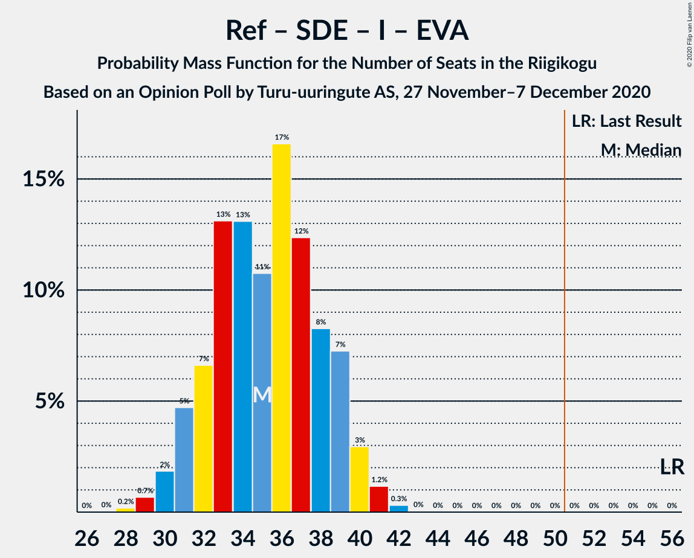

| Number of Seats | Probability | Accumulated | Special Marks |
|:---------------:|:-----------:|:-----------:|:-------------:|
| 28 | 0.2% | 100% |  |
| 29 | 0.7% | 99.8% |  |
| 30 | 2% | 99.1% |  |
| 31 | 5% | 97% |  |
| 32 | 7% | 93% |  |
| 33 | 13% | 86% |  |
| 34 | 13% | 73% |  |
| 35 | 11% | 60% |  |
| 36 | 17% | 49% |  |
| 37 | 12% | 32% | Median |
| 38 | 8% | 20% |  |
| 39 | 7% | 12% |  |
| 40 | 3% | 4% |  |
| 41 | 1.2% | 2% |  |
| 42 | 0.3% | 0.4% |  |
| 43 | 0% | 0.1% |  |
| 44 | 0% | 0% |  |
| 45 | 0% | 0% |  |
| 46 | 0% | 0% |  |
| 47 | 0% | 0% |  |
| 48 | 0% | 0% |  |
| 49 | 0% | 0% |  |
| 50 | 0% | 0% |  |
| 51 | 0% | 0% | Majority |
| 52 | 0% | 0% |  |
| 53 | 0% | 0% |  |
| 54 | 0% | 0% |  |
| 55 | 0% | 0% |  |
| 56 | 0% | 0% | Last Result |

### Eesti Reformierakond – Sotsiaaldemokraatlik Erakond – Erakond Isamaa

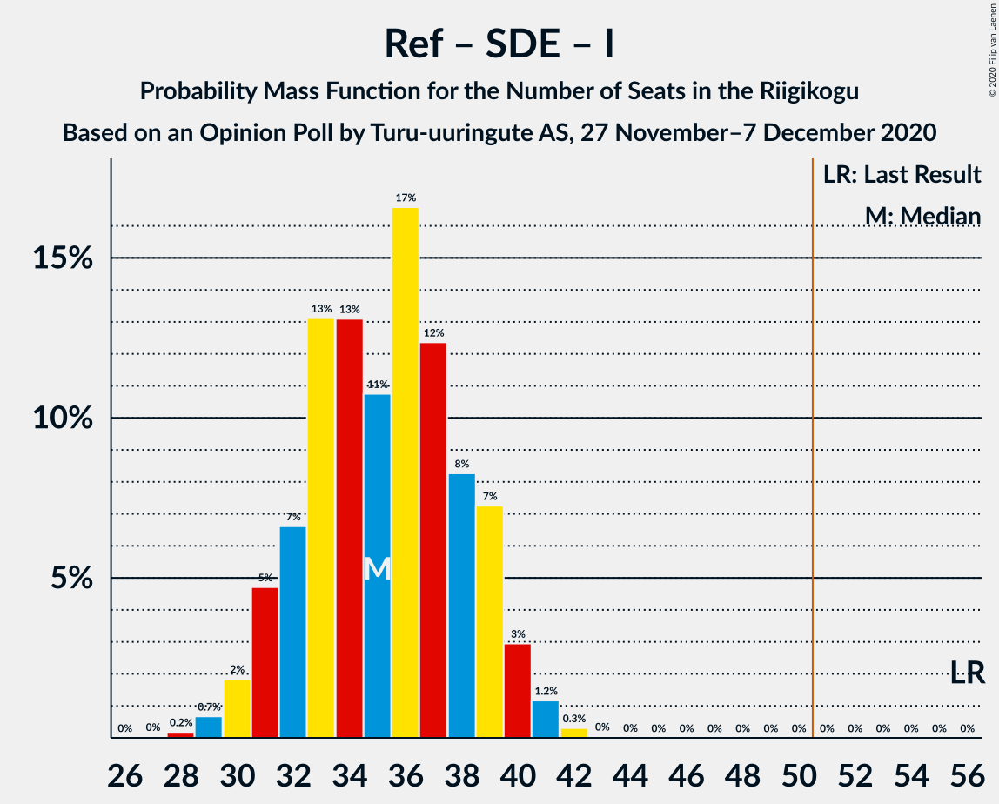

| Number of Seats | Probability | Accumulated | Special Marks |
|:---------------:|:-----------:|:-----------:|:-------------:|
| 28 | 0.2% | 100% |  |
| 29 | 0.7% | 99.8% |  |
| 30 | 2% | 99.1% |  |
| 31 | 5% | 97% |  |
| 32 | 7% | 93% |  |
| 33 | 13% | 86% |  |
| 34 | 13% | 73% |  |
| 35 | 11% | 60% |  |
| 36 | 17% | 49% |  |
| 37 | 12% | 32% | Median |
| 38 | 8% | 20% |  |
| 39 | 7% | 12% |  |
| 40 | 3% | 4% |  |
| 41 | 1.2% | 2% |  |
| 42 | 0.3% | 0.4% |  |
| 43 | 0% | 0.1% |  |
| 44 | 0% | 0% |  |
| 45 | 0% | 0% |  |
| 46 | 0% | 0% |  |
| 47 | 0% | 0% |  |
| 48 | 0% | 0% |  |
| 49 | 0% | 0% |  |
| 50 | 0% | 0% |  |
| 51 | 0% | 0% | Majority |
| 52 | 0% | 0% |  |
| 53 | 0% | 0% |  |
| 54 | 0% | 0% |  |
| 55 | 0% | 0% |  |
| 56 | 0% | 0% | Last Result |

### Eesti Reformierakond – Sotsiaaldemokraatlik Erakond

| Number of Seats | Probability | Accumulated | Special Marks |
|:---------------:|:-----------:|:-----------:|:-------------:|
| 26 | 0.1% | 100% |  |
| 27 | 0.4% | 99.9% |  |
| 28 | 2% | 99.5% |  |
| 29 | 4% | 98% |  |
| 30 | 9% | 94% |  |
| 31 | 15% | 85% |  |
| 32 | 18% | 70% |  |
| 33 | 19% | 52% | Median |
| 34 | 18% | 33% |  |
| 35 | 8% | 15% |  |
| 36 | 4% | 8% |  |
| 37 | 2% | 3% |  |
| 38 | 0.5% | 0.7% |  |
| 39 | 0.2% | 0.2% |  |
| 40 | 0.1% | 0.1% |  |
| 41 | 0% | 0% |  |
| 42 | 0% | 0% |  |
| 43 | 0% | 0% |  |
| 44 | 0% | 0% | Last Result |

### Eesti Reformierakond – Erakond Isamaa

| Number of Seats | Probability | Accumulated | Special Marks |
|:---------------:|:-----------:|:-----------:|:-------------:|
| 19 | 0.1% | 100% |  |
| 20 | 0.6% | 99.9% |  |
| 21 | 2% | 99.3% |  |
| 22 | 3% | 97% |  |
| 23 | 9% | 93% |  |
| 24 | 12% | 84% |  |
| 25 | 8% | 72% |  |
| 26 | 13% | 64% |  |
| 27 | 16% | 52% |  |
| 28 | 12% | 36% | Median |
| 29 | 9% | 24% |  |
| 30 | 10% | 15% |  |
| 31 | 4% | 5% |  |
| 32 | 0.7% | 1.0% |  |
| 33 | 0.3% | 0.3% |  |
| 34 | 0% | 0% |  |
| 35 | 0% | 0% |  |
| 36 | 0% | 0% |  |
| 37 | 0% | 0% |  |
| 38 | 0% | 0% |  |
| 39 | 0% | 0% |  |
| 40 | 0% | 0% |  |
| 41 | 0% | 0% |  |
| 42 | 0% | 0% |  |
| 43 | 0% | 0% |  |
| 44 | 0% | 0% |  |
| 45 | 0% | 0% |  |
| 46 | 0% | 0% | Last Result |

### Eesti Konservatiivne Rahvaerakond – Sotsiaaldemokraatlik Erakond

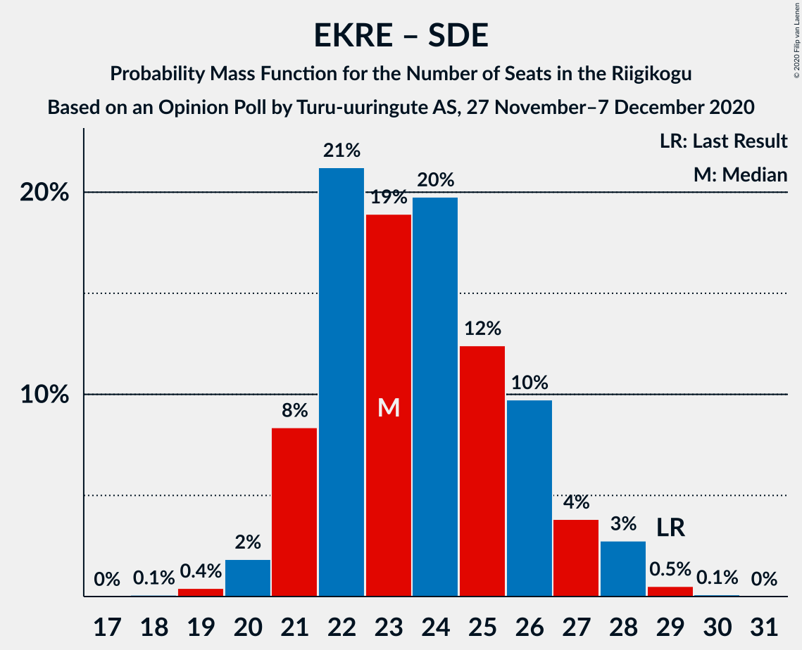

| Number of Seats | Probability | Accumulated | Special Marks |
|:---------------:|:-----------:|:-----------:|:-------------:|
| 18 | 0.1% | 100% |  |
| 19 | 0.4% | 99.9% |  |
| 20 | 2% | 99.5% |  |
| 21 | 8% | 98% |  |
| 22 | 21% | 89% |  |
| 23 | 19% | 68% |  |
| 24 | 20% | 49% | Median |
| 25 | 12% | 29% |  |
| 26 | 10% | 17% |  |
| 27 | 4% | 7% |  |
| 28 | 3% | 3% |  |
| 29 | 0.5% | 0.6% | Last Result |
| 30 | 0.1% | 0.1% |  |
| 31 | 0% | 0% |  |

## Technical Information

### Opinion Poll

+ **Polling firm:** Turu-uuringute AS
+ **Commissioner(s):** —
+ **Fieldwork period:** 27 November–7 December 2020

### Calculations

+ **Sample size:** 881
+ **Simulations done:** 1,048,576
+ **Error estimate:** 2.00%

