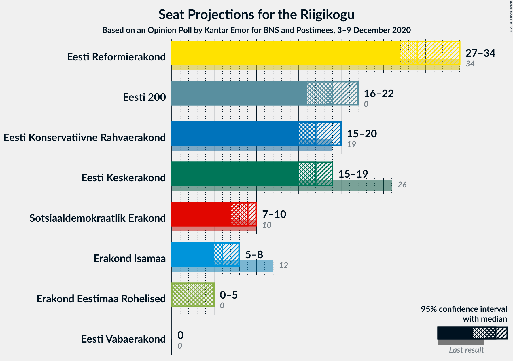
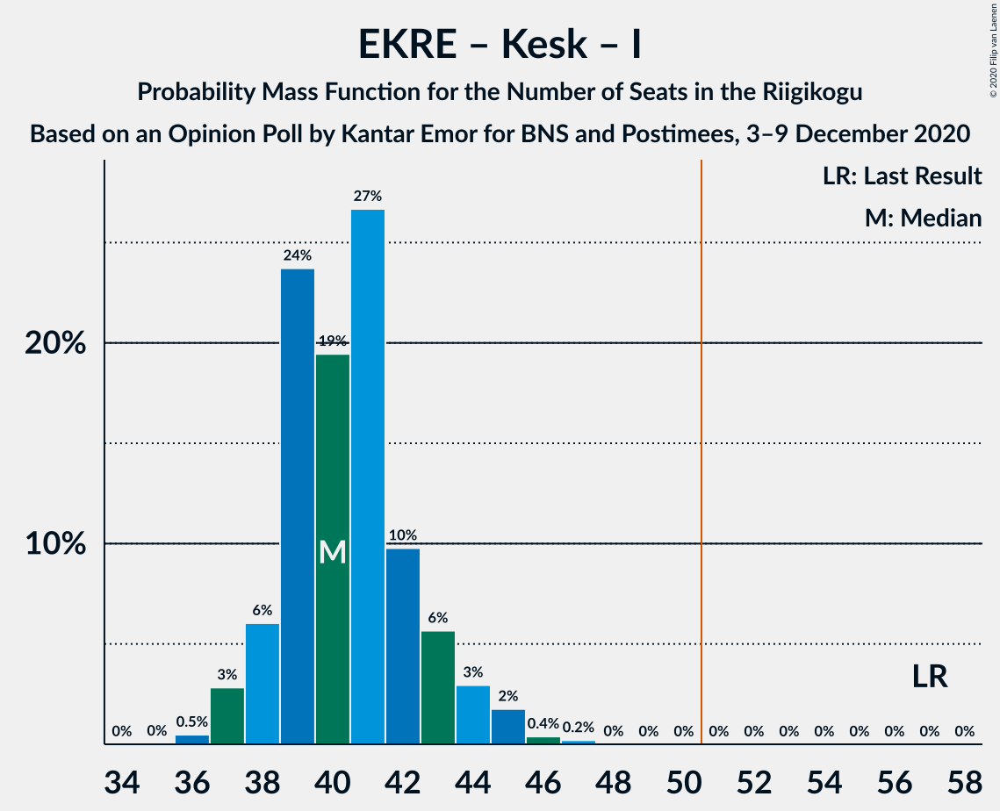

# Opinion Poll by Kantar Emor for BNS and Postimees, 3–9 December 2020

<a href="#voting-intentions">Voting Intentions</a> | <a href="#seats">Seats</a> | <a href="#coalitions">Coalitions</a> | <a href="#technical-information">Technical Information</a>

## Voting Intentions

### Confidence Intervals

| Party | Last Result | Poll Result | 80% Confidence Interval | 90% Confidence Interval | 95% Confidence Interval | 99% Confidence Interval |
|:-----:|:-----------:|:-----------:|:-----------------------:|:-----------------------:|:-----------------------:|:-----------------------:|
| Eesti Reformierakond | 28.9% | 27.0% | 25.4–28.6% |25.0–29.1% |24.6–29.5% |23.9–30.3% |
| Eesti 200 | 4.4% | 18.0% | 16.7–19.5% |16.3–19.9% |16.0–20.2% |15.4–20.9% |
| Eesti Konservatiivne Rahvaerakond | 17.8% | 17.0% | 15.7–18.4% |15.3–18.8% |15.0–19.2% |14.4–19.9% |
| Eesti Keskerakond | 23.1% | 16.0% | 14.7–17.4% |14.4–17.8% |14.1–18.1% |13.5–18.8% |
| Sotsiaaldemokraatlik Erakond | 9.8% | 9.0% | 8.0–10.1% |7.7–10.4% |7.5–10.7% |7.1–11.2% |
| Erakond Isamaa | 11.4% | 7.0% | 6.2–8.0% |5.9–8.3% |5.7–8.6% |5.4–9.1% |
| Erakond Eestimaa Rohelised | 1.8% | 5.0% | 4.3–5.9% |4.1–6.1% |3.9–6.3% |3.6–6.8% |
| Eesti Vabaerakond | 1.2% | 1.0% | 0.7–1.5% |0.7–1.6% |0.6–1.7% |0.5–2.0% |

*Note:* The poll result column reflects the actual value used in the calculations. Published results may vary slightly, and in addition be rounded to fewer digits.

## Seats

### Confidence Intervals

| Party | Last Result | Median | 80% Confidence Interval | 90% Confidence Interval | 95% Confidence Interval | 99% Confidence Interval |
|:-----:|:-----------:|:------:|:-----------------------:|:-----------------------:|:-----------------------:|:-----------------------:|
| <a href="#eesti-reformierakond">Eesti Reformierakond</a> | 34 | 29 | 28–32 |28–33 |27–34 |26–35 |
| <a href="#eesti-200">Eesti 200</a> | 0 | 19 | 17–20 |17–21 |16–22 |16–22 |
| <a href="#eesti-konservatiivne-rahvaerakond">Eesti Konservatiivne Rahvaerakond</a> | 19 | 17 | 16–19 |16–20 |15–20 |15–21 |
| <a href="#eesti-keskerakond">Eesti Keskerakond</a> | 26 | 17 | 15–18 |15–19 |15–19 |14–20 |
| <a href="#sotsiaaldemokraatlik-erakond">Sotsiaaldemokraatlik Erakond</a> | 10 | 9 | 8–9 |7–10 |7–10 |7–10 |
| <a href="#erakond-isamaa">Erakond Isamaa</a> | 12 | 6 | 5–7 |5–8 |5–8 |5–9 |
| <a href="#erakond-eestimaa-rohelised">Erakond Eestimaa Rohelised</a> | 0 | 5 | 0–5 |0–5 |0–5 |0–6 |
| <a href="#eesti-vabaerakond">Eesti Vabaerakond</a> | 0 | 0 | 0 |0 |0 |0 |

### Eesti Reformierakond

*For a full overview of the results for this party, see the [Eesti Reformierakond](party-eestireformierakond.html) page.*

| Number of Seats | Probability | Accumulated | Special Marks |
|:---------------:|:-----------:|:-----------:|:-------------:|
| 25 | 0.1% | 100% |  |
| 26 | 0.5% | 99.9% |  |
| 27 | 3% | 99.4% |  |
| 28 | 17% | 96% |  |
| 29 | 32% | 79% | Median |
| 30 | 16% | 47% |  |
| 31 | 16% | 31% |  |
| 32 | 6% | 15% |  |
| 33 | 6% | 10% |  |
| 34 | 2% | 3% | Last Result |
| 35 | 0.9% | 1.1% |  |
| 36 | 0.2% | 0.2% |  |
| 37 | 0% | 0% |  |

### Eesti 200

*For a full overview of the results for this party, see the [Eesti 200](party-eesti200.html) page.*

| Number of Seats | Probability | Accumulated | Special Marks |
|:---------------:|:-----------:|:-----------:|:-------------:|
| 0 | 0% | 100% | Last Result |
| 1 | 0% | 100% |  |
| 2 | 0% | 100% |  |
| 3 | 0% | 100% |  |
| 4 | 0% | 100% |  |
| 5 | 0% | 100% |  |
| 6 | 0% | 100% |  |
| 7 | 0% | 100% |  |
| 8 | 0% | 100% |  |
| 9 | 0% | 100% |  |
| 10 | 0% | 100% |  |
| 11 | 0% | 100% |  |
| 12 | 0% | 100% |  |
| 13 | 0% | 100% |  |
| 14 | 0% | 100% |  |
| 15 | 0.3% | 100% |  |
| 16 | 4% | 99.7% |  |
| 17 | 9% | 96% |  |
| 18 | 23% | 87% |  |
| 19 | 36% | 64% | Median |
| 20 | 19% | 28% |  |
| 21 | 7% | 9% |  |
| 22 | 2% | 3% |  |
| 23 | 0.3% | 0.4% |  |
| 24 | 0% | 0% |  |

### Eesti Konservatiivne Rahvaerakond

*For a full overview of the results for this party, see the [Eesti Konservatiivne Rahvaerakond](party-eestikonservatiivnerahvaerakond.html) page.*

| Number of Seats | Probability | Accumulated | Special Marks |
|:---------------:|:-----------:|:-----------:|:-------------:|
| 14 | 0.1% | 100% |  |
| 15 | 3% | 99.9% |  |
| 16 | 22% | 97% |  |
| 17 | 34% | 75% | Median |
| 18 | 26% | 41% |  |
| 19 | 10% | 15% | Last Result |
| 20 | 4% | 5% |  |
| 21 | 1.0% | 1.1% |  |
| 22 | 0.1% | 0.1% |  |
| 23 | 0% | 0% |  |

### Eesti Keskerakond

*For a full overview of the results for this party, see the [Eesti Keskerakond](party-eestikeskerakond.html) page.*

| Number of Seats | Probability | Accumulated | Special Marks |
|:---------------:|:-----------:|:-----------:|:-------------:|
| 13 | 0.1% | 100% |  |
| 14 | 1.5% | 99.9% |  |
| 15 | 10% | 98% |  |
| 16 | 26% | 88% |  |
| 17 | 41% | 63% | Median |
| 18 | 15% | 22% |  |
| 19 | 5% | 7% |  |
| 20 | 1.2% | 1.5% |  |
| 21 | 0.3% | 0.3% |  |
| 22 | 0% | 0% |  |
| 23 | 0% | 0% |  |
| 24 | 0% | 0% |  |
| 25 | 0% | 0% |  |
| 26 | 0% | 0% | Last Result |

### Sotsiaaldemokraatlik Erakond

*For a full overview of the results for this party, see the [Sotsiaaldemokraatlik Erakond](party-sotsiaaldemokraatlikerakond.html) page.*

| Number of Seats | Probability | Accumulated | Special Marks |
|:---------------:|:-----------:|:-----------:|:-------------:|
| 6 | 0.1% | 100% |  |
| 7 | 5% | 99.9% |  |
| 8 | 39% | 95% |  |
| 9 | 50% | 55% | Median |
| 10 | 5% | 5% | Last Result |
| 11 | 0.2% | 0.2% |  |
| 12 | 0% | 0% |  |

### Erakond Isamaa

*For a full overview of the results for this party, see the [Erakond Isamaa](party-erakondisamaa.html) page.*

| Number of Seats | Probability | Accumulated | Special Marks |
|:---------------:|:-----------:|:-----------:|:-------------:|
| 4 | 0.2% | 100% |  |
| 5 | 12% | 99.8% |  |
| 6 | 54% | 88% | Median |
| 7 | 29% | 35% |  |
| 8 | 5% | 6% |  |
| 9 | 0.6% | 0.6% |  |
| 10 | 0% | 0% |  |
| 11 | 0% | 0% |  |
| 12 | 0% | 0% | Last Result |

### Erakond Eestimaa Rohelised

*For a full overview of the results for this party, see the [Erakond Eestimaa Rohelised](party-erakondeestimaarohelised.html) page.*

| Number of Seats | Probability | Accumulated | Special Marks |
|:---------------:|:-----------:|:-----------:|:-------------:|
| 0 | 30% | 100% | Last Result |
| 1 | 0% | 70% |  |
| 2 | 0% | 70% |  |
| 3 | 0% | 70% |  |
| 4 | 19% | 70% |  |
| 5 | 49% | 51% | Median |
| 6 | 2% | 2% |  |
| 7 | 0% | 0% |  |

### Eesti Vabaerakond

*For a full overview of the results for this party, see the [Eesti Vabaerakond](party-eestivabaerakond.html) page.*

| Number of Seats | Probability | Accumulated | Special Marks |
|:---------------:|:-----------:|:-----------:|:-------------:|
| 0 | 100% | 100% | Last Result, Median |

## Coalitions

### Confidence Intervals

| Coalition | Last Result | Median | Majority? | 80% Confidence Interval | 90% Confidence Interval | 95% Confidence Interval | 99% Confidence Interval |
|:---------:|:-----------:|:------:|:---------:|:-----------------------:|:-----------------------:|:-----------------------:|:-----------------------:|
| Eesti Reformierakond – Eesti Konservatiivne Rahvaerakond – Eesti Keskerakond | 79 | 64 | 100% | 62–67 | 61–68 | 60–69 | 60–69 |
| Eesti Reformierakond – Eesti Konservatiivne Rahvaerakond – Erakond Isamaa | 65 | 53 | 97% | 51–56 | 51–58 | 50–58 | 49–60 |
| Eesti Reformierakond – Eesti Konservatiivne Rahvaerakond | 53 | 47 | 6% | 45–50 | 45–51 | 44–52 | 43–53 |
| Eesti Reformierakond – Eesti Keskerakond | 60 | 46 | 3% | 45–50 | 44–50 | 43–51 | 43–51 |
| Eesti Reformierakond – Sotsiaaldemokraatlik Erakond – Erakond Isamaa – Eesti Vabaerakond | 56 | 44 | 0.4% | 42–47 | 42–48 | 42–49 | 40–50 |
| Eesti Reformierakond – Sotsiaaldemokraatlik Erakond – Erakond Isamaa | 56 | 44 | 0.4% | 42–47 | 42–48 | 42–49 | 40–50 |
| Eesti Konservatiivne Rahvaerakond – Eesti Keskerakond – Erakond Isamaa | 57 | 40 | 0% | 39–43 | 38–44 | 37–44 | 36–46 |
| Eesti Reformierakond – Sotsiaaldemokraatlik Erakond | 44 | 38 | 0% | 36–41 | 36–41 | 35–43 | 34–43 |
| Eesti Reformierakond – Erakond Isamaa | 46 | 36 | 0% | 34–39 | 34–40 | 33–40 | 33–42 |
| Eesti Konservatiivne Rahvaerakond – Eesti Keskerakond | 45 | 34 | 0% | 32–36 | 32–37 | 31–38 | 30–39 |
| Eesti Keskerakond – Sotsiaaldemokraatlik Erakond – Erakond Isamaa | 48 | 32 | 0% | 29–33 | 29–34 | 28–35 | 27–36 |
| Eesti Konservatiivne Rahvaerakond – Sotsiaaldemokraatlik Erakond | 29 | 26 | 0% | 25–27 | 24–28 | 24–28 | 23–29 |
| Eesti Keskerakond – Sotsiaaldemokraatlik Erakond | 36 | 25 | 0% | 23–27 | 23–28 | 23–28 | 21–30 |

### Eesti Reformierakond – Eesti Konservatiivne Rahvaerakond – Eesti Keskerakond

| Number of Seats | Probability | Accumulated | Special Marks |
|:---------------:|:-----------:|:-----------:|:-------------:|
| 58 | 0.1% | 100% |  |
| 59 | 0.3% | 99.9% |  |
| 60 | 3% | 99.6% |  |
| 61 | 5% | 96% |  |
| 62 | 24% | 91% |  |
| 63 | 15% | 68% | Median |
| 64 | 18% | 53% |  |
| 65 | 7% | 35% |  |
| 66 | 14% | 28% |  |
| 67 | 7% | 14% |  |
| 68 | 4% | 7% |  |
| 69 | 3% | 4% |  |
| 70 | 0.3% | 0.4% |  |
| 71 | 0.1% | 0.1% |  |
| 72 | 0% | 0% |  |
| 73 | 0% | 0% |  |
| 74 | 0% | 0% |  |
| 75 | 0% | 0% |  |
| 76 | 0% | 0% |  |
| 77 | 0% | 0% |  |
| 78 | 0% | 0% |  |
| 79 | 0% | 0% | Last Result |

### Eesti Reformierakond – Eesti Konservatiivne Rahvaerakond – Erakond Isamaa

| Number of Seats | Probability | Accumulated | Special Marks |
|:---------------:|:-----------:|:-----------:|:-------------:|
| 48 | 0.1% | 100% |  |
| 49 | 0.7% | 99.9% |  |
| 50 | 2% | 99.2% |  |
| 51 | 16% | 97% | Majority |
| 52 | 18% | 81% | Median |
| 53 | 20% | 63% |  |
| 54 | 17% | 43% |  |
| 55 | 9% | 26% |  |
| 56 | 8% | 17% |  |
| 57 | 4% | 10% |  |
| 58 | 4% | 6% |  |
| 59 | 0.9% | 2% |  |
| 60 | 0.6% | 0.7% |  |
| 61 | 0.1% | 0.1% |  |
| 62 | 0% | 0% |  |
| 63 | 0% | 0% |  |
| 64 | 0% | 0% |  |
| 65 | 0% | 0% | Last Result |

### Eesti Reformierakond – Eesti Konservatiivne Rahvaerakond

| Number of Seats | Probability | Accumulated | Special Marks |
|:---------------:|:-----------:|:-----------:|:-------------:|
| 42 | 0.1% | 100% |  |
| 43 | 1.2% | 99.9% |  |
| 44 | 3% | 98.7% |  |
| 45 | 18% | 96% |  |
| 46 | 21% | 78% | Median |
| 47 | 19% | 57% |  |
| 48 | 15% | 38% |  |
| 49 | 9% | 24% |  |
| 50 | 9% | 15% |  |
| 51 | 3% | 6% | Majority |
| 52 | 2% | 3% |  |
| 53 | 1.0% | 1.1% | Last Result |
| 54 | 0.1% | 0.1% |  |
| 55 | 0% | 0% |  |

### Eesti Reformierakond – Eesti Keskerakond

| Number of Seats | Probability | Accumulated | Special Marks |
|:---------------:|:-----------:|:-----------:|:-------------:|
| 41 | 0.1% | 100% |  |
| 42 | 0.3% | 99.9% |  |
| 43 | 3% | 99.6% |  |
| 44 | 5% | 96% |  |
| 45 | 22% | 91% |  |
| 46 | 27% | 69% | Median |
| 47 | 14% | 42% |  |
| 48 | 8% | 28% |  |
| 49 | 9% | 20% |  |
| 50 | 8% | 11% |  |
| 51 | 3% | 3% | Majority |
| 52 | 0.4% | 0.4% |  |
| 53 | 0% | 0% |  |
| 54 | 0% | 0% |  |
| 55 | 0% | 0% |  |
| 56 | 0% | 0% |  |
| 57 | 0% | 0% |  |
| 58 | 0% | 0% |  |
| 59 | 0% | 0% |  |
| 60 | 0% | 0% | Last Result |

### Eesti Reformierakond – Sotsiaaldemokraatlik Erakond – Erakond Isamaa – Eesti Vabaerakond

| Number of Seats | Probability | Accumulated | Special Marks |
|:---------------:|:-----------:|:-----------:|:-------------:|
| 39 | 0.1% | 100% |  |
| 40 | 0.7% | 99.9% |  |
| 41 | 2% | 99.3% |  |
| 42 | 11% | 98% |  |
| 43 | 12% | 86% |  |
| 44 | 27% | 75% | Median |
| 45 | 18% | 48% |  |
| 46 | 13% | 30% |  |
| 47 | 8% | 17% |  |
| 48 | 5% | 9% |  |
| 49 | 3% | 4% |  |
| 50 | 0.8% | 1.2% |  |
| 51 | 0.3% | 0.4% | Majority |
| 52 | 0% | 0.1% |  |
| 53 | 0% | 0% |  |
| 54 | 0% | 0% |  |
| 55 | 0% | 0% |  |
| 56 | 0% | 0% | Last Result |

### Eesti Reformierakond – Sotsiaaldemokraatlik Erakond – Erakond Isamaa

| Number of Seats | Probability | Accumulated | Special Marks |
|:---------------:|:-----------:|:-----------:|:-------------:|
| 39 | 0.1% | 100% |  |
| 40 | 0.7% | 99.9% |  |
| 41 | 2% | 99.3% |  |
| 42 | 11% | 98% |  |
| 43 | 12% | 86% |  |
| 44 | 27% | 75% | Median |
| 45 | 18% | 48% |  |
| 46 | 13% | 30% |  |
| 47 | 8% | 17% |  |
| 48 | 5% | 9% |  |
| 49 | 3% | 4% |  |
| 50 | 0.8% | 1.2% |  |
| 51 | 0.3% | 0.4% | Majority |
| 52 | 0% | 0.1% |  |
| 53 | 0% | 0% |  |
| 54 | 0% | 0% |  |
| 55 | 0% | 0% |  |
| 56 | 0% | 0% | Last Result |

### Eesti Konservatiivne Rahvaerakond – Eesti Keskerakond – Erakond Isamaa

| Number of Seats | Probability | Accumulated | Special Marks |
|:---------------:|:-----------:|:-----------:|:-------------:|
| 36 | 0.5% | 100% |  |
| 37 | 3% | 99.5% |  |
| 38 | 6% | 97% |  |
| 39 | 24% | 91% |  |
| 40 | 19% | 67% | Median |
| 41 | 27% | 47% |  |
| 42 | 10% | 21% |  |
| 43 | 6% | 11% |  |
| 44 | 3% | 5% |  |
| 45 | 2% | 2% |  |
| 46 | 0.4% | 0.6% |  |
| 47 | 0.2% | 0.2% |  |
| 48 | 0% | 0% |  |
| 49 | 0% | 0% |  |
| 50 | 0% | 0% |  |
| 51 | 0% | 0% | Majority |
| 52 | 0% | 0% |  |
| 53 | 0% | 0% |  |
| 54 | 0% | 0% |  |
| 55 | 0% | 0% |  |
| 56 | 0% | 0% |  |
| 57 | 0% | 0% | Last Result |

### Eesti Reformierakond – Sotsiaaldemokraatlik Erakond

| Number of Seats | Probability | Accumulated | Special Marks |
|:---------------:|:-----------:|:-----------:|:-------------:|
| 33 | 0.1% | 100% |  |
| 34 | 0.7% | 99.9% |  |
| 35 | 2% | 99.2% |  |
| 36 | 13% | 97% |  |
| 37 | 9% | 84% |  |
| 38 | 39% | 76% | Median |
| 39 | 13% | 37% |  |
| 40 | 10% | 24% |  |
| 41 | 10% | 14% |  |
| 42 | 2% | 4% |  |
| 43 | 2% | 3% |  |
| 44 | 0.3% | 0.3% | Last Result |
| 45 | 0% | 0% |  |

### Eesti Reformierakond – Erakond Isamaa

| Number of Seats | Probability | Accumulated | Special Marks |
|:---------------:|:-----------:|:-----------:|:-------------:|
| 32 | 0.3% | 100% |  |
| 33 | 3% | 99.7% |  |
| 34 | 11% | 97% |  |
| 35 | 32% | 86% | Median |
| 36 | 19% | 54% |  |
| 37 | 16% | 35% |  |
| 38 | 5% | 19% |  |
| 39 | 8% | 13% |  |
| 40 | 4% | 6% |  |
| 41 | 1.3% | 2% |  |
| 42 | 0.4% | 0.6% |  |
| 43 | 0.2% | 0.2% |  |
| 44 | 0% | 0% |  |
| 45 | 0% | 0% |  |
| 46 | 0% | 0% | Last Result |

### Eesti Konservatiivne Rahvaerakond – Eesti Keskerakond

| Number of Seats | Probability | Accumulated | Special Marks |
|:---------------:|:-----------:|:-----------:|:-------------:|
| 29 | 0.1% | 100% |  |
| 30 | 0.8% | 99.9% |  |
| 31 | 2% | 99.2% |  |
| 32 | 11% | 97% |  |
| 33 | 28% | 86% |  |
| 34 | 17% | 58% | Median |
| 35 | 22% | 41% |  |
| 36 | 11% | 19% |  |
| 37 | 4% | 8% |  |
| 38 | 3% | 4% |  |
| 39 | 0.5% | 0.7% |  |
| 40 | 0.2% | 0.2% |  |
| 41 | 0.1% | 0.1% |  |
| 42 | 0% | 0% |  |
| 43 | 0% | 0% |  |
| 44 | 0% | 0% |  |
| 45 | 0% | 0% | Last Result |

### Eesti Keskerakond – Sotsiaaldemokraatlik Erakond – Erakond Isamaa

| Number of Seats | Probability | Accumulated | Special Marks |
|:---------------:|:-----------:|:-----------:|:-------------:|
| 27 | 0.5% | 100% |  |
| 28 | 3% | 99.5% |  |
| 29 | 9% | 97% |  |
| 30 | 5% | 87% |  |
| 31 | 20% | 82% |  |
| 32 | 40% | 62% | Median |
| 33 | 14% | 22% |  |
| 34 | 4% | 7% |  |
| 35 | 1.3% | 3% |  |
| 36 | 2% | 2% |  |
| 37 | 0.5% | 0.5% |  |
| 38 | 0% | 0% |  |
| 39 | 0% | 0% |  |
| 40 | 0% | 0% |  |
| 41 | 0% | 0% |  |
| 42 | 0% | 0% |  |
| 43 | 0% | 0% |  |
| 44 | 0% | 0% |  |
| 45 | 0% | 0% |  |
| 46 | 0% | 0% |  |
| 47 | 0% | 0% |  |
| 48 | 0% | 0% | Last Result |

### Eesti Konservatiivne Rahvaerakond – Sotsiaaldemokraatlik Erakond

| Number of Seats | Probability | Accumulated | Special Marks |
|:---------------:|:-----------:|:-----------:|:-------------:|
| 23 | 0.9% | 100% |  |
| 24 | 7% | 99.1% |  |
| 25 | 32% | 92% |  |
| 26 | 33% | 60% | Median |
| 27 | 18% | 27% |  |
| 28 | 7% | 9% |  |
| 29 | 1.0% | 1.4% | Last Result |
| 30 | 0.3% | 0.4% |  |
| 31 | 0.1% | 0.1% |  |
| 32 | 0% | 0% |  |

### Eesti Keskerakond – Sotsiaaldemokraatlik Erakond

| Number of Seats | Probability | Accumulated | Special Marks |
|:---------------:|:-----------:|:-----------:|:-------------:|
| 21 | 0.6% | 100% |  |
| 22 | 2% | 99.4% |  |
| 23 | 9% | 98% |  |
| 24 | 11% | 89% |  |
| 25 | 31% | 78% |  |
| 26 | 31% | 47% | Median |
| 27 | 10% | 16% |  |
| 28 | 3% | 5% |  |
| 29 | 2% | 2% |  |
| 30 | 0.4% | 0.6% |  |
| 31 | 0.2% | 0.2% |  |
| 32 | 0% | 0% |  |
| 33 | 0% | 0% |  |
| 34 | 0% | 0% |  |
| 35 | 0% | 0% |  |
| 36 | 0% | 0% | Last Result |

## Technical Information

### Opinion Poll

+ **Polling firm:** Kantar Emor
+ **Commissioner(s):** BNS and Postimees
+ **Fieldwork period:** 3–9 December 2020

### Calculations

+ **Sample size:** 1282
+ **Simulations done:** 1,048,576
+ **Error estimate:** 1.13%

