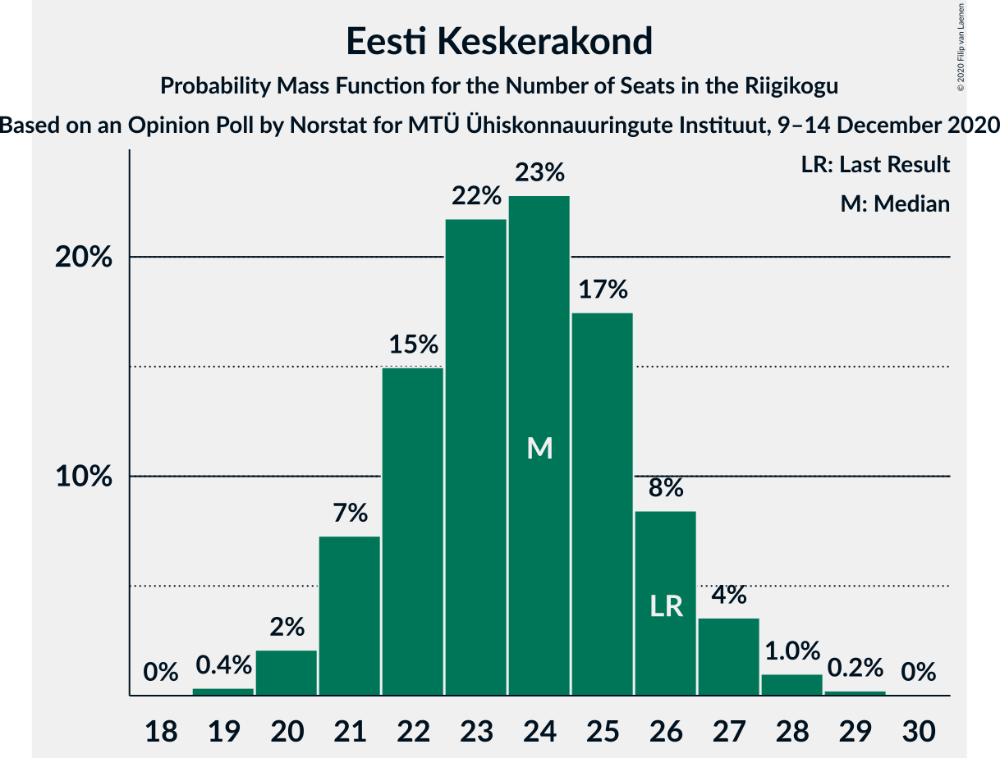
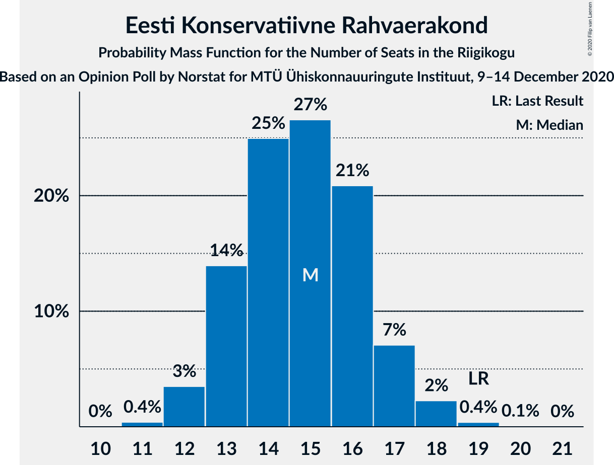

# Opinion Poll by Norstat for MTÜ Ühiskonnauuringute Instituut, 9–14 December 2020

<a href="#voting-intentions">Voting Intentions</a> | <a href="#seats">Seats</a> | <a href="#coalitions">Coalitions</a> | <a href="#technical-information">Technical Information</a>

## Voting Intentions

### Confidence Intervals

| Party | Last Result | Poll Result | 80% Confidence Interval | 90% Confidence Interval | 95% Confidence Interval | 99% Confidence Interval |
|:-----:|:-----------:|:-----------:|:-----------------------:|:-----------------------:|:-----------------------:|:-----------------------:|
| Eesti Reformierakond | 28.9% | 26.4% | 24.7–28.2% |24.2–28.8% |23.8–29.2% |23.0–30.1% |
| Eesti Keskerakond | 23.1% | 21.5% | 19.9–23.2% |19.4–23.7% |19.1–24.2% |18.3–25.0% |
| Eesti 200 | 4.4% | 18.1% | 16.6–19.7% |16.2–20.2% |15.8–20.6% |15.2–21.4% |
| Eesti Konservatiivne Rahvaerakond | 17.8% | 14.2% | 12.9–15.7% |12.5–16.1% |12.2–16.5% |11.6–17.3% |
| Sotsiaaldemokraatlik Erakond | 9.8% | 8.6% | 7.6–9.8% |7.3–10.2% |7.0–10.5% |6.5–11.1% |
| Erakond Isamaa | 11.4% | 5.9% | 5.0–7.0% |4.8–7.3% |4.6–7.5% |4.2–8.1% |
| Erakond Eestimaa Rohelised | 1.8% | 3.1% | 2.5–3.9% |2.3–4.2% |2.2–4.4% |1.9–4.8% |

*Note:* The poll result column reflects the actual value used in the calculations. Published results may vary slightly, and in addition be rounded to fewer digits.

## Seats

### Confidence Intervals

| Party | Last Result | Median | 80% Confidence Interval | 90% Confidence Interval | 95% Confidence Interval | 99% Confidence Interval |
|:-----:|:-----------:|:------:|:-----------------------:|:-----------------------:|:-----------------------:|:-----------------------:|
| <a href="#eesti-reformierakond">Eesti Reformierakond</a> | 34 | 30 | 28–32 |27–33 |26–33 |25–35 |
| <a href="#eesti-keskerakond">Eesti Keskerakond</a> | 26 | 24 | 22–26 |21–26 |21–27 |20–28 |
| <a href="#eesti-200">Eesti 200</a> | 0 | 19 | 18–21 |17–22 |17–23 |16–24 |
| <a href="#eesti-konservatiivne-rahvaerakond">Eesti Konservatiivne Rahvaerakond</a> | 19 | 15 | 13–16 |13–17 |12–18 |12–18 |
| <a href="#sotsiaaldemokraatlik-erakond">Sotsiaaldemokraatlik Erakond</a> | 10 | 8 | 7–10 |7–10 |6–10 |6–11 |
| <a href="#erakond-isamaa">Erakond Isamaa</a> | 12 | 5 | 4–6 |0–7 |0–7 |0–8 |
| <a href="#erakond-eestimaa-rohelised">Erakond Eestimaa Rohelised</a> | 0 | 0 | 0 |0 |0 |0 |

### Eesti Reformierakond

*For a full overview of the results for this party, see the [Eesti Reformierakond](party-eestireformierakond.html) page.*

| Number of Seats | Probability | Accumulated | Special Marks |
|:---------------:|:-----------:|:-----------:|:-------------:|
| 24 | 0.1% | 100% |  |
| 25 | 0.5% | 99.9% |  |
| 26 | 2% | 99.4% |  |
| 27 | 6% | 97% |  |
| 28 | 16% | 91% |  |
| 29 | 17% | 75% |  |
| 30 | 23% | 57% | Median |
| 31 | 16% | 34% |  |
| 32 | 11% | 18% |  |
| 33 | 5% | 7% |  |
| 34 | 2% | 2% | Last Result |
| 35 | 0.5% | 0.7% |  |
| 36 | 0.1% | 0.2% |  |
| 37 | 0% | 0% |  |

### Eesti Keskerakond

*For a full overview of the results for this party, see the [Eesti Keskerakond](party-eestikeskerakond.html) page.*

| Number of Seats | Probability | Accumulated | Special Marks |
|:---------------:|:-----------:|:-----------:|:-------------:|
| 19 | 0.4% | 100% |  |
| 20 | 2% | 99.6% |  |
| 21 | 7% | 98% |  |
| 22 | 15% | 90% |  |
| 23 | 22% | 75% |  |
| 24 | 23% | 54% | Median |
| 25 | 17% | 31% |  |
| 26 | 8% | 13% | Last Result |
| 27 | 4% | 5% |  |
| 28 | 1.0% | 1.3% |  |
| 29 | 0.2% | 0.3% |  |
| 30 | 0% | 0% |  |

### Eesti 200

*For a full overview of the results for this party, see the [Eesti 200](party-eesti200.html) page.*

| Number of Seats | Probability | Accumulated | Special Marks |
|:---------------:|:-----------:|:-----------:|:-------------:|
| 0 | 0% | 100% | Last Result |
| 1 | 0% | 100% |  |
| 2 | 0% | 100% |  |
| 3 | 0% | 100% |  |
| 4 | 0% | 100% |  |
| 5 | 0% | 100% |  |
| 6 | 0% | 100% |  |
| 7 | 0% | 100% |  |
| 8 | 0% | 100% |  |
| 9 | 0% | 100% |  |
| 10 | 0% | 100% |  |
| 11 | 0% | 100% |  |
| 12 | 0% | 100% |  |
| 13 | 0% | 100% |  |
| 14 | 0% | 100% |  |
| 15 | 0.2% | 100% |  |
| 16 | 2% | 99.7% |  |
| 17 | 7% | 98% |  |
| 18 | 17% | 91% |  |
| 19 | 26% | 74% | Median |
| 20 | 24% | 49% |  |
| 21 | 16% | 25% |  |
| 22 | 6% | 9% |  |
| 23 | 3% | 3% |  |
| 24 | 0.4% | 0.5% |  |
| 25 | 0.1% | 0.1% |  |
| 26 | 0% | 0% |  |

### Eesti Konservatiivne Rahvaerakond

*For a full overview of the results for this party, see the [Eesti Konservatiivne Rahvaerakond](party-eestikonservatiivnerahvaerakond.html) page.*

| Number of Seats | Probability | Accumulated | Special Marks |
|:---------------:|:-----------:|:-----------:|:-------------:|
| 11 | 0.4% | 100% |  |
| 12 | 3% | 99.6% |  |
| 13 | 14% | 96% |  |
| 14 | 25% | 82% |  |
| 15 | 27% | 57% | Median |
| 16 | 21% | 31% |  |
| 17 | 7% | 10% |  |
| 18 | 2% | 3% |  |
| 19 | 0.4% | 0.4% | Last Result |
| 20 | 0.1% | 0.1% |  |
| 21 | 0% | 0% |  |

### Sotsiaaldemokraatlik Erakond

*For a full overview of the results for this party, see the [Sotsiaaldemokraatlik Erakond](party-sotsiaaldemokraatlikerakond.html) page.*

| Number of Seats | Probability | Accumulated | Special Marks |
|:---------------:|:-----------:|:-----------:|:-------------:|
| 5 | 0.1% | 100% |  |
| 6 | 3% | 99.9% |  |
| 7 | 19% | 97% |  |
| 8 | 37% | 77% | Median |
| 9 | 29% | 41% |  |
| 10 | 10% | 12% | Last Result |
| 11 | 2% | 2% |  |
| 12 | 0.2% | 0.2% |  |
| 13 | 0% | 0% |  |

### Erakond Isamaa

*For a full overview of the results for this party, see the [Erakond Isamaa](party-erakondisamaa.html) page.*

| Number of Seats | Probability | Accumulated | Special Marks |
|:---------------:|:-----------:|:-----------:|:-------------:|
| 0 | 10% | 100% |  |
| 1 | 0% | 90% |  |
| 2 | 0% | 90% |  |
| 3 | 0% | 90% |  |
| 4 | 6% | 90% |  |
| 5 | 44% | 84% | Median |
| 6 | 31% | 39% |  |
| 7 | 7% | 8% |  |
| 8 | 0.7% | 0.7% |  |
| 9 | 0% | 0% |  |
| 10 | 0% | 0% |  |
| 11 | 0% | 0% |  |
| 12 | 0% | 0% | Last Result |

### Erakond Eestimaa Rohelised

*For a full overview of the results for this party, see the [Erakond Eestimaa Rohelised](party-erakondeestimaarohelised.html) page.*

| Number of Seats | Probability | Accumulated | Special Marks |
|:---------------:|:-----------:|:-----------:|:-------------:|
| 0 | 99.8% | 100% | Last Result, Median |
| 1 | 0% | 0.2% |  |
| 2 | 0% | 0.2% |  |
| 3 | 0% | 0.2% |  |
| 4 | 0.1% | 0.2% |  |
| 5 | 0.1% | 0.1% |  |
| 6 | 0% | 0% |  |

## Coalitions

### Confidence Intervals

| Coalition | Last Result | Median | Majority? | 80% Confidence Interval | 90% Confidence Interval | 95% Confidence Interval | 99% Confidence Interval |
|:---------:|:-----------:|:------:|:---------:|:-----------------------:|:-----------------------:|:-----------------------:|:-----------------------:|
| Eesti Reformierakond – Eesti Keskerakond – Eesti Konservatiivne Rahvaerakond | 79 | 68 | 100% | 66–71 | 65–72 | 64–73 | 63–74 |
| Eesti Reformierakond – Eesti Keskerakond | 60 | 53 | 93% | 51–56 | 50–57 | 50–58 | 48–59 |
| Eesti Reformierakond – Eesti Konservatiivne Rahvaerakond – Erakond Isamaa | 65 | 50 | 33% | 47–52 | 46–53 | 45–53 | 43–55 |
| Eesti Reformierakond – Eesti Konservatiivne Rahvaerakond | 53 | 45 | 0.3% | 42–47 | 41–48 | 41–49 | 40–50 |
| Eesti Keskerakond – Eesti Konservatiivne Rahvaerakond – Erakond Isamaa | 57 | 44 | 0% | 41–46 | 40–47 | 39–47 | 37–49 |
| Eesti Reformierakond – Sotsiaaldemokraatlik Erakond – Erakond Isamaa | 56 | 43 | 0% | 40–46 | 39–46 | 38–47 | 37–48 |
| Eesti Keskerakond – Eesti Konservatiivne Rahvaerakond | 45 | 38 | 0% | 36–41 | 35–42 | 35–42 | 34–44 |
| Eesti Reformierakond – Sotsiaaldemokraatlik Erakond | 44 | 38 | 0% | 36–41 | 35–42 | 34–42 | 33–43 |
| Eesti Keskerakond – Sotsiaaldemokraatlik Erakond – Erakond Isamaa | 48 | 37 | 0% | 34–40 | 33–40 | 32–41 | 31–42 |
| Eesti Reformierakond – Erakond Isamaa | 46 | 35 | 0% | 32–37 | 31–38 | 30–39 | 28–40 |
| Eesti Keskerakond – Sotsiaaldemokraatlik Erakond | 36 | 32 | 0% | 30–34 | 29–35 | 28–36 | 27–37 |
| Eesti Konservatiivne Rahvaerakond – Sotsiaaldemokraatlik Erakond | 29 | 23 | 0% | 21–25 | 20–26 | 20–26 | 19–28 |

### Eesti Reformierakond – Eesti Keskerakond – Eesti Konservatiivne Rahvaerakond

| Number of Seats | Probability | Accumulated | Special Marks |
|:---------------:|:-----------:|:-----------:|:-------------:|
| 62 | 0.1% | 100% |  |
| 63 | 0.4% | 99.9% |  |
| 64 | 2% | 99.4% |  |
| 65 | 5% | 97% |  |
| 66 | 11% | 92% |  |
| 67 | 19% | 82% |  |
| 68 | 19% | 62% |  |
| 69 | 18% | 43% | Median |
| 70 | 12% | 25% |  |
| 71 | 6% | 13% |  |
| 72 | 4% | 7% |  |
| 73 | 2% | 3% |  |
| 74 | 1.1% | 2% |  |
| 75 | 0.3% | 0.4% |  |
| 76 | 0.1% | 0.1% |  |
| 77 | 0% | 0% |  |
| 78 | 0% | 0% |  |
| 79 | 0% | 0% | Last Result |

### Eesti Reformierakond – Eesti Keskerakond

| Number of Seats | Probability | Accumulated | Special Marks |
|:---------------:|:-----------:|:-----------:|:-------------:|
| 47 | 0.1% | 100% |  |
| 48 | 0.5% | 99.9% |  |
| 49 | 1.5% | 99.4% |  |
| 50 | 5% | 98% |  |
| 51 | 10% | 93% | Majority |
| 52 | 14% | 83% |  |
| 53 | 22% | 69% |  |
| 54 | 17% | 47% | Median |
| 55 | 14% | 30% |  |
| 56 | 8% | 16% |  |
| 57 | 4% | 8% |  |
| 58 | 2% | 4% |  |
| 59 | 0.8% | 1.3% |  |
| 60 | 0.3% | 0.5% | Last Result |
| 61 | 0.1% | 0.1% |  |
| 62 | 0% | 0% |  |

### Eesti Reformierakond – Eesti Konservatiivne Rahvaerakond – Erakond Isamaa

| Number of Seats | Probability | Accumulated | Special Marks |
|:---------------:|:-----------:|:-----------:|:-------------:|
| 42 | 0.1% | 100% |  |
| 43 | 0.4% | 99.9% |  |
| 44 | 0.9% | 99.5% |  |
| 45 | 2% | 98.5% |  |
| 46 | 5% | 97% |  |
| 47 | 9% | 92% |  |
| 48 | 14% | 83% |  |
| 49 | 17% | 69% |  |
| 50 | 18% | 52% | Median |
| 51 | 15% | 33% | Majority |
| 52 | 11% | 19% |  |
| 53 | 5% | 7% |  |
| 54 | 2% | 2% |  |
| 55 | 0.4% | 0.5% |  |
| 56 | 0.1% | 0.1% |  |
| 57 | 0% | 0% |  |
| 58 | 0% | 0% |  |
| 59 | 0% | 0% |  |
| 60 | 0% | 0% |  |
| 61 | 0% | 0% |  |
| 62 | 0% | 0% |  |
| 63 | 0% | 0% |  |
| 64 | 0% | 0% |  |
| 65 | 0% | 0% | Last Result |

### Eesti Reformierakond – Eesti Konservatiivne Rahvaerakond

| Number of Seats | Probability | Accumulated | Special Marks |
|:---------------:|:-----------:|:-----------:|:-------------:|
| 38 | 0.1% | 100% |  |
| 39 | 0.3% | 99.9% |  |
| 40 | 2% | 99.6% |  |
| 41 | 4% | 98% |  |
| 42 | 9% | 94% |  |
| 43 | 17% | 85% |  |
| 44 | 16% | 68% |  |
| 45 | 18% | 52% | Median |
| 46 | 17% | 34% |  |
| 47 | 10% | 17% |  |
| 48 | 4% | 8% |  |
| 49 | 2% | 3% |  |
| 50 | 0.9% | 1.1% |  |
| 51 | 0.2% | 0.3% | Majority |
| 52 | 0% | 0.1% |  |
| 53 | 0% | 0% | Last Result |

### Eesti Keskerakond – Eesti Konservatiivne Rahvaerakond – Erakond Isamaa

| Number of Seats | Probability | Accumulated | Special Marks |
|:---------------:|:-----------:|:-----------:|:-------------:|
| 36 | 0.2% | 100% |  |
| 37 | 0.3% | 99.8% |  |
| 38 | 1.4% | 99.5% |  |
| 39 | 3% | 98% |  |
| 40 | 4% | 96% |  |
| 41 | 9% | 91% |  |
| 42 | 15% | 82% |  |
| 43 | 17% | 68% |  |
| 44 | 21% | 50% | Median |
| 45 | 14% | 29% |  |
| 46 | 9% | 15% |  |
| 47 | 5% | 6% |  |
| 48 | 1.3% | 2% |  |
| 49 | 0.4% | 0.5% |  |
| 50 | 0.1% | 0.1% |  |
| 51 | 0% | 0% | Majority |
| 52 | 0% | 0% |  |
| 53 | 0% | 0% |  |
| 54 | 0% | 0% |  |
| 55 | 0% | 0% |  |
| 56 | 0% | 0% |  |
| 57 | 0% | 0% | Last Result |

### Eesti Reformierakond – Sotsiaaldemokraatlik Erakond – Erakond Isamaa

| Number of Seats | Probability | Accumulated | Special Marks |
|:---------------:|:-----------:|:-----------:|:-------------:|
| 35 | 0.1% | 100% |  |
| 36 | 0.2% | 99.9% |  |
| 37 | 0.5% | 99.7% |  |
| 38 | 2% | 99.2% |  |
| 39 | 4% | 97% |  |
| 40 | 6% | 94% |  |
| 41 | 8% | 88% |  |
| 42 | 16% | 80% |  |
| 43 | 22% | 64% | Median |
| 44 | 19% | 41% |  |
| 45 | 10% | 23% |  |
| 46 | 8% | 12% |  |
| 47 | 3% | 5% |  |
| 48 | 1.2% | 1.4% |  |
| 49 | 0.2% | 0.2% |  |
| 50 | 0% | 0% |  |
| 51 | 0% | 0% | Majority |
| 52 | 0% | 0% |  |
| 53 | 0% | 0% |  |
| 54 | 0% | 0% |  |
| 55 | 0% | 0% |  |
| 56 | 0% | 0% | Last Result |

### Eesti Keskerakond – Eesti Konservatiivne Rahvaerakond

| Number of Seats | Probability | Accumulated | Special Marks |
|:---------------:|:-----------:|:-----------:|:-------------:|
| 32 | 0.1% | 100% |  |
| 33 | 0.3% | 99.9% |  |
| 34 | 1.5% | 99.6% |  |
| 35 | 4% | 98% |  |
| 36 | 9% | 94% |  |
| 37 | 16% | 85% |  |
| 38 | 22% | 69% |  |
| 39 | 19% | 47% | Median |
| 40 | 14% | 29% |  |
| 41 | 8% | 14% |  |
| 42 | 4% | 7% |  |
| 43 | 2% | 2% |  |
| 44 | 0.5% | 0.7% |  |
| 45 | 0.1% | 0.2% | Last Result |
| 46 | 0% | 0% |  |

### Eesti Reformierakond – Sotsiaaldemokraatlik Erakond

| Number of Seats | Probability | Accumulated | Special Marks |
|:---------------:|:-----------:|:-----------:|:-------------:|
| 32 | 0.1% | 100% |  |
| 33 | 0.6% | 99.9% |  |
| 34 | 3% | 99.4% |  |
| 35 | 5% | 97% |  |
| 36 | 10% | 92% |  |
| 37 | 19% | 82% |  |
| 38 | 24% | 63% | Median |
| 39 | 17% | 38% |  |
| 40 | 9% | 21% |  |
| 41 | 7% | 13% |  |
| 42 | 3% | 5% |  |
| 43 | 1.3% | 2% |  |
| 44 | 0.3% | 0.4% | Last Result |
| 45 | 0.1% | 0.1% |  |
| 46 | 0% | 0% |  |

### Eesti Keskerakond – Sotsiaaldemokraatlik Erakond – Erakond Isamaa

| Number of Seats | Probability | Accumulated | Special Marks |
|:---------------:|:-----------:|:-----------:|:-------------:|
| 29 | 0.1% | 100% |  |
| 30 | 0.2% | 99.9% |  |
| 31 | 0.8% | 99.7% |  |
| 32 | 2% | 98.8% |  |
| 33 | 3% | 97% |  |
| 34 | 6% | 94% |  |
| 35 | 13% | 87% |  |
| 36 | 15% | 75% |  |
| 37 | 20% | 60% | Median |
| 38 | 16% | 39% |  |
| 39 | 12% | 23% |  |
| 40 | 7% | 11% |  |
| 41 | 2% | 3% |  |
| 42 | 0.8% | 1.0% |  |
| 43 | 0.2% | 0.2% |  |
| 44 | 0% | 0% |  |
| 45 | 0% | 0% |  |
| 46 | 0% | 0% |  |
| 47 | 0% | 0% |  |
| 48 | 0% | 0% | Last Result |

### Eesti Reformierakond – Erakond Isamaa

| Number of Seats | Probability | Accumulated | Special Marks |
|:---------------:|:-----------:|:-----------:|:-------------:|
| 27 | 0.1% | 100% |  |
| 28 | 0.6% | 99.9% |  |
| 29 | 0.9% | 99.3% |  |
| 30 | 3% | 98% |  |
| 31 | 4% | 96% |  |
| 32 | 6% | 92% |  |
| 33 | 14% | 87% |  |
| 34 | 15% | 73% |  |
| 35 | 21% | 58% | Median |
| 36 | 15% | 37% |  |
| 37 | 14% | 22% |  |
| 38 | 5% | 8% |  |
| 39 | 2% | 3% |  |
| 40 | 0.5% | 0.6% |  |
| 41 | 0.1% | 0.1% |  |
| 42 | 0% | 0% |  |
| 43 | 0% | 0% |  |
| 44 | 0% | 0% |  |
| 45 | 0% | 0% |  |
| 46 | 0% | 0% | Last Result |

### Eesti Keskerakond – Sotsiaaldemokraatlik Erakond

| Number of Seats | Probability | Accumulated | Special Marks |
|:---------------:|:-----------:|:-----------:|:-------------:|
| 26 | 0.1% | 100% |  |
| 27 | 0.5% | 99.9% |  |
| 28 | 2% | 99.5% |  |
| 29 | 7% | 97% |  |
| 30 | 14% | 91% |  |
| 31 | 17% | 76% |  |
| 32 | 20% | 59% | Median |
| 33 | 18% | 39% |  |
| 34 | 12% | 21% |  |
| 35 | 6% | 9% |  |
| 36 | 2% | 3% | Last Result |
| 37 | 0.9% | 1.1% |  |
| 38 | 0.2% | 0.2% |  |
| 39 | 0% | 0% |  |

### Eesti Konservatiivne Rahvaerakond – Sotsiaaldemokraatlik Erakond

| Number of Seats | Probability | Accumulated | Special Marks |
|:---------------:|:-----------:|:-----------:|:-------------:|
| 18 | 0.1% | 100% |  |
| 19 | 0.9% | 99.9% |  |
| 20 | 4% | 99.0% |  |
| 21 | 12% | 95% |  |
| 22 | 20% | 83% |  |
| 23 | 23% | 63% | Median |
| 24 | 21% | 40% |  |
| 25 | 12% | 19% |  |
| 26 | 5% | 7% |  |
| 27 | 2% | 2% |  |
| 28 | 0.5% | 0.5% |  |
| 29 | 0.1% | 0.1% | Last Result |
| 30 | 0% | 0% |  |

## Technical Information

### Opinion Poll

+ **Polling firm:** Norstat
+ **Commissioner(s):** MTÜ Ühiskonnauuringute Instituut
+ **Fieldwork period:** 9–14 December 2020

### Calculations

+ **Sample size:** 1000
+ **Simulations done:** 1,048,576
+ **Error estimate:** 1.36%

