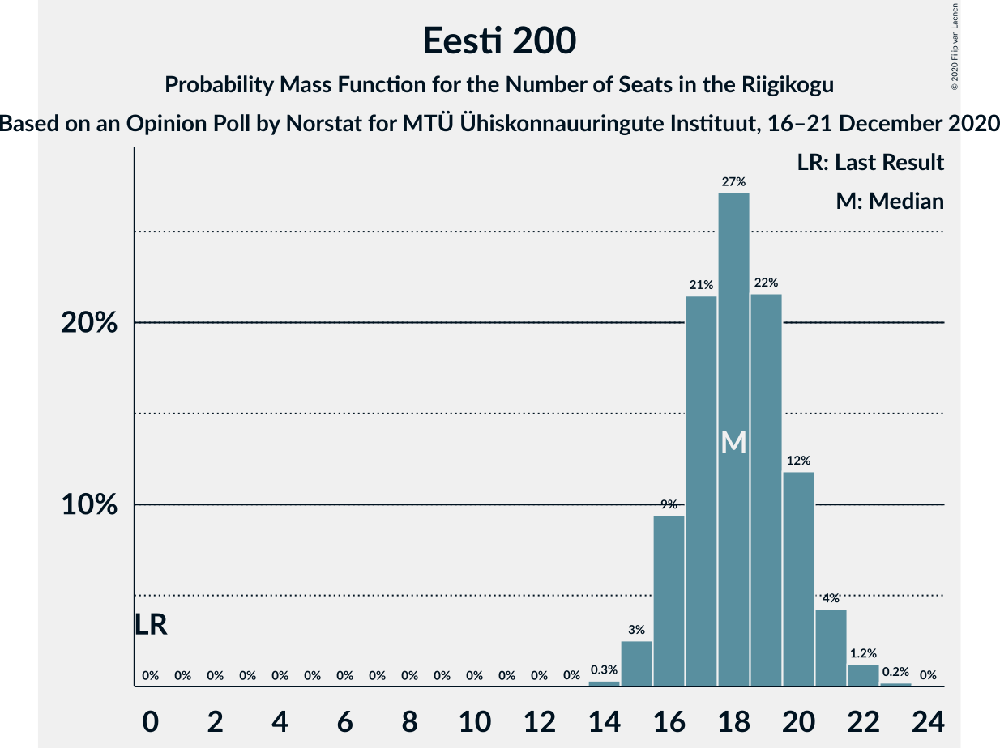
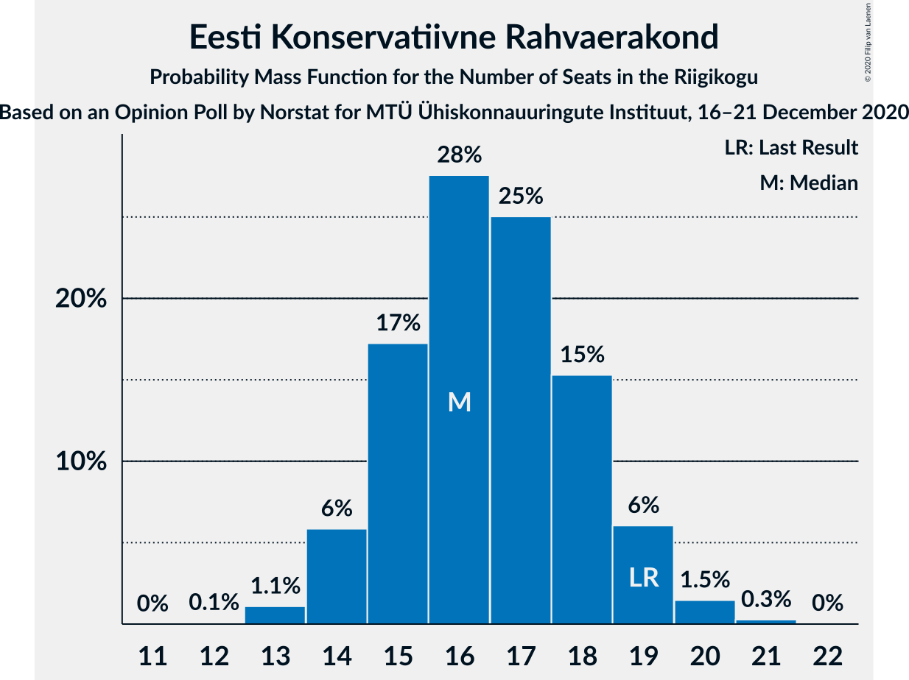
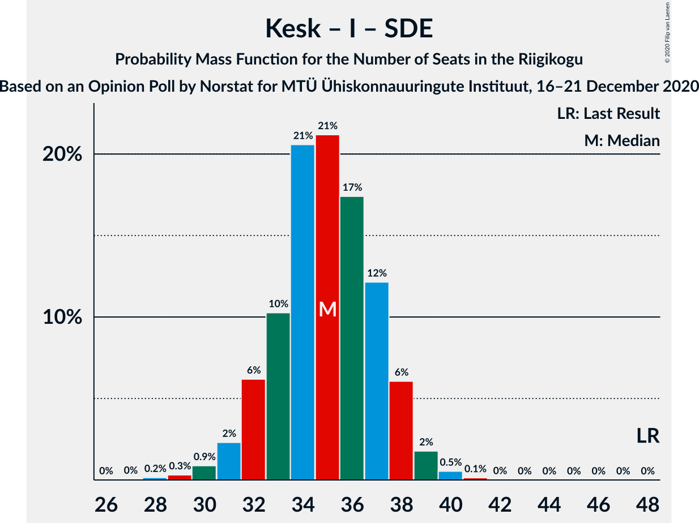

# Opinion Poll by Norstat for MTÜ Ühiskonnauuringute Instituut, 16–21 December 2020

<a href="#voting-intentions">Voting Intentions</a> | <a href="#seats">Seats</a> | <a href="#coalitions">Coalitions</a> | <a href="#technical-information">Technical Information</a>

## Voting Intentions

### Confidence Intervals

| Party | Last Result | Poll Result | 80% Confidence Interval | 90% Confidence Interval | 95% Confidence Interval | 99% Confidence Interval |
|:-----:|:-----------:|:-----------:|:-----------------------:|:-----------------------:|:-----------------------:|:-----------------------:|
| Eesti Reformierakond | 28.9% | 28.1% | 26.3–30.0% |25.8–30.5% |25.4–31.0% |24.6–31.9% |
| Eesti Keskerakond | 23.1% | 20.9% | 19.3–22.6% |18.9–23.1% |18.5–23.5% |17.8–24.4% |
| Eesti 200 | 4.4% | 17.3% | 15.8–18.9% |15.4–19.4% |15.1–19.8% |14.4–20.6% |
| Eesti Konservatiivne Rahvaerakond | 17.8% | 15.9% | 14.5–17.5% |14.1–17.9% |13.8–18.3% |13.1–19.1% |
| Erakond Isamaa | 11.4% | 7.4% | 6.4–8.6% |6.2–8.9% |5.9–9.2% |5.5–9.8% |
| Sotsiaaldemokraatlik Erakond | 9.8% | 6.4% | 5.5–7.5% |5.3–7.8% |5.0–8.1% |4.6–8.7% |
| Erakond Eestimaa Rohelised | 1.8% | 2.1% | 1.6–2.8% |1.5–3.0% |1.4–3.2% |1.2–3.6% |

*Note:* The poll result column reflects the actual value used in the calculations. Published results may vary slightly, and in addition be rounded to fewer digits.

## Seats

### Confidence Intervals

| Party | Last Result | Median | 80% Confidence Interval | 90% Confidence Interval | 95% Confidence Interval | 99% Confidence Interval |
|:-----:|:-----------:|:------:|:-----------------------:|:-----------------------:|:-----------------------:|:-----------------------:|
| <a href="#eesti-reformierakond">Eesti Reformierakond</a> | 34 | 31 | 30–34 |29–34 |28–35 |27–36 |
| <a href="#eesti-keskerakond">Eesti Keskerakond</a> | 26 | 22 | 21–24 |20–25 |19–26 |19–26 |
| <a href="#eesti-200">Eesti 200</a> | 0 | 18 | 17–20 |16–21 |16–22 |15–22 |
| <a href="#eesti-konservatiivne-rahvaerakond">Eesti Konservatiivne Rahvaerakond</a> | 19 | 16 | 15–18 |14–19 |14–19 |13–20 |
| <a href="#erakond-isamaa">Erakond Isamaa</a> | 12 | 7 | 6–8 |5–8 |5–9 |5–9 |
| <a href="#sotsiaaldemokraatlik-erakond">Sotsiaaldemokraatlik Erakond</a> | 10 | 5 | 5–7 |4–7 |0–7 |0–8 |
| <a href="#erakond-eestimaa-rohelised">Erakond Eestimaa Rohelised</a> | 0 | 0 | 0 |0 |0 |0 |

### Eesti Reformierakond

*For a full overview of the results for this party, see the [Eesti Reformierakond](party-eestireformierakond.html) page.*

| Number of Seats | Probability | Accumulated | Special Marks |
|:---------------:|:-----------:|:-----------:|:-------------:|
| 26 | 0.2% | 100% |  |
| 27 | 0.8% | 99.8% |  |
| 28 | 4% | 98.9% |  |
| 29 | 5% | 95% |  |
| 30 | 28% | 90% |  |
| 31 | 13% | 62% | Median |
| 32 | 21% | 49% |  |
| 33 | 9% | 28% |  |
| 34 | 16% | 19% | Last Result |
| 35 | 2% | 4% |  |
| 36 | 1.4% | 2% |  |
| 37 | 0.3% | 0.3% |  |
| 38 | 0% | 0% |  |

### Eesti Keskerakond

*For a full overview of the results for this party, see the [Eesti Keskerakond](party-eestikeskerakond.html) page.*

| Number of Seats | Probability | Accumulated | Special Marks |
|:---------------:|:-----------:|:-----------:|:-------------:|
| 17 | 0.1% | 100% |  |
| 18 | 0.2% | 99.9% |  |
| 19 | 3% | 99.7% |  |
| 20 | 5% | 97% |  |
| 21 | 18% | 92% |  |
| 22 | 29% | 74% | Median |
| 23 | 19% | 45% |  |
| 24 | 17% | 26% |  |
| 25 | 4% | 8% |  |
| 26 | 4% | 5% | Last Result |
| 27 | 0.3% | 0.4% |  |
| 28 | 0.1% | 0.1% |  |
| 29 | 0% | 0% |  |

### Eesti 200

*For a full overview of the results for this party, see the [Eesti 200](party-eesti200.html) page.*

| Number of Seats | Probability | Accumulated | Special Marks |
|:---------------:|:-----------:|:-----------:|:-------------:|
| 0 | 0% | 100% | Last Result |
| 1 | 0% | 100% |  |
| 2 | 0% | 100% |  |
| 3 | 0% | 100% |  |
| 4 | 0% | 100% |  |
| 5 | 0% | 100% |  |
| 6 | 0% | 100% |  |
| 7 | 0% | 100% |  |
| 8 | 0% | 100% |  |
| 9 | 0% | 100% |  |
| 10 | 0% | 100% |  |
| 11 | 0% | 100% |  |
| 12 | 0% | 100% |  |
| 13 | 0% | 100% |  |
| 14 | 0.4% | 100% |  |
| 15 | 2% | 99.6% |  |
| 16 | 6% | 98% |  |
| 17 | 14% | 92% |  |
| 18 | 29% | 77% | Median |
| 19 | 19% | 49% |  |
| 20 | 20% | 30% |  |
| 21 | 7% | 10% |  |
| 22 | 2% | 3% |  |
| 23 | 0.3% | 0.3% |  |
| 24 | 0% | 0% |  |

### Eesti Konservatiivne Rahvaerakond

*For a full overview of the results for this party, see the [Eesti Konservatiivne Rahvaerakond](party-eestikonservatiivnerahvaerakond.html) page.*

| Number of Seats | Probability | Accumulated | Special Marks |
|:---------------:|:-----------:|:-----------:|:-------------:|
| 12 | 0.1% | 100% |  |
| 13 | 0.8% | 99.9% |  |
| 14 | 6% | 99.2% |  |
| 15 | 18% | 93% |  |
| 16 | 29% | 74% | Median |
| 17 | 24% | 46% |  |
| 18 | 12% | 21% |  |
| 19 | 7% | 9% | Last Result |
| 20 | 2% | 2% |  |
| 21 | 0.2% | 0.3% |  |
| 22 | 0% | 0% |  |

### Erakond Isamaa

*For a full overview of the results for this party, see the [Erakond Isamaa](party-erakondisamaa.html) page.*

| Number of Seats | Probability | Accumulated | Special Marks |
|:---------------:|:-----------:|:-----------:|:-------------:|
| 0 | 0.1% | 100% |  |
| 1 | 0% | 99.9% |  |
| 2 | 0% | 99.9% |  |
| 3 | 0% | 99.9% |  |
| 4 | 0.3% | 99.9% |  |
| 5 | 6% | 99.7% |  |
| 6 | 41% | 93% |  |
| 7 | 39% | 52% | Median |
| 8 | 10% | 13% |  |
| 9 | 3% | 3% |  |
| 10 | 0.3% | 0.3% |  |
| 11 | 0% | 0% |  |
| 12 | 0% | 0% | Last Result |

### Sotsiaaldemokraatlik Erakond

*For a full overview of the results for this party, see the [Sotsiaaldemokraatlik Erakond](party-sotsiaaldemokraatlikerakond.html) page.*

| Number of Seats | Probability | Accumulated | Special Marks |
|:---------------:|:-----------:|:-----------:|:-------------:|
| 0 | 4% | 100% |  |
| 1 | 0% | 96% |  |
| 2 | 0% | 96% |  |
| 3 | 0% | 96% |  |
| 4 | 3% | 96% |  |
| 5 | 45% | 93% | Median |
| 6 | 34% | 48% |  |
| 7 | 12% | 14% |  |
| 8 | 2% | 2% |  |
| 9 | 0.1% | 0.2% |  |
| 10 | 0% | 0% | Last Result |

### Erakond Eestimaa Rohelised

*For a full overview of the results for this party, see the [Erakond Eestimaa Rohelised](party-erakondeestimaarohelised.html) page.*

| Number of Seats | Probability | Accumulated | Special Marks |
|:---------------:|:-----------:|:-----------:|:-------------:|
| 0 | 100% | 100% | Last Result, Median |

## Coalitions

### Confidence Intervals

| Coalition | Last Result | Median | Majority? | 80% Confidence Interval | 90% Confidence Interval | 95% Confidence Interval | 99% Confidence Interval |
|:---------:|:-----------:|:------:|:---------:|:-----------------------:|:-----------------------:|:-----------------------:|:-----------------------:|
| Eesti Reformierakond – Eesti Keskerakond – Eesti Konservatiivne Rahvaerakond | 79 | 70 | 100% | 68–73 | 68–74 | 67–75 | 66–77 |
| Eesti Reformierakond – Eesti Konservatiivne Rahvaerakond – Erakond Isamaa | 65 | 55 | 98.7% | 52–57 | 51–58 | 51–59 | 50–60 |
| Eesti Reformierakond – Eesti Keskerakond | 60 | 54 | 96% | 51–56 | 51–58 | 50–58 | 49–60 |
| Eesti Reformierakond – Eesti Konservatiivne Rahvaerakond | 53 | 48 | 10% | 46–51 | 45–51 | 44–52 | 43–53 |
| Eesti Keskerakond – Eesti Konservatiivne Rahvaerakond – Erakond Isamaa | 57 | 45 | 0.6% | 43–48 | 42–49 | 42–50 | 41–51 |
| Eesti Reformierakond – Erakond Isamaa – Sotsiaaldemokraatlik Erakond | 56 | 43 | 0% | 41–46 | 40–47 | 39–47 | 38–49 |
| Eesti Keskerakond – Eesti Konservatiivne Rahvaerakond | 45 | 39 | 0% | 37–42 | 36–43 | 35–43 | 34–44 |
| Eesti Reformierakond – Erakond Isamaa | 46 | 38 | 0% | 36–41 | 35–41 | 35–42 | 33–43 |
| Eesti Reformierakond – Sotsiaaldemokraatlik Erakond | 44 | 37 | 0% | 35–39 | 34–40 | 32–41 | 30–42 |
| Eesti Keskerakond – Erakond Isamaa – Sotsiaaldemokraatlik Erakond | 48 | 34 | 0% | 32–37 | 31–38 | 31–38 | 29–40 |
| Eesti Keskerakond – Sotsiaaldemokraatlik Erakond | 36 | 28 | 0% | 26–30 | 25–31 | 24–31 | 22–32 |
| Eesti Konservatiivne Rahvaerakond – Sotsiaaldemokraatlik Erakond | 29 | 22 | 0% | 20–24 | 19–25 | 17–25 | 16–26 |

### Eesti Reformierakond – Eesti Keskerakond – Eesti Konservatiivne Rahvaerakond

| Number of Seats | Probability | Accumulated | Special Marks |
|:---------------:|:-----------:|:-----------:|:-------------:|
| 65 | 0.4% | 100% |  |
| 66 | 2% | 99.5% |  |
| 67 | 2% | 98% |  |
| 68 | 14% | 96% |  |
| 69 | 16% | 82% | Median |
| 70 | 17% | 66% |  |
| 71 | 22% | 49% |  |
| 72 | 15% | 27% |  |
| 73 | 6% | 12% |  |
| 74 | 3% | 6% |  |
| 75 | 1.4% | 3% |  |
| 76 | 0.4% | 1.1% |  |
| 77 | 0.4% | 0.8% |  |
| 78 | 0.3% | 0.3% |  |
| 79 | 0% | 0% | Last Result |

### Eesti Reformierakond – Eesti Konservatiivne Rahvaerakond – Erakond Isamaa

| Number of Seats | Probability | Accumulated | Special Marks |
|:---------------:|:-----------:|:-----------:|:-------------:|
| 48 | 0.1% | 100% |  |
| 49 | 0.2% | 99.9% |  |
| 50 | 1.1% | 99.7% |  |
| 51 | 4% | 98.7% | Majority |
| 52 | 10% | 95% |  |
| 53 | 18% | 85% |  |
| 54 | 14% | 67% | Median |
| 55 | 21% | 54% |  |
| 56 | 19% | 32% |  |
| 57 | 7% | 13% |  |
| 58 | 3% | 6% |  |
| 59 | 2% | 3% |  |
| 60 | 1.2% | 1.4% |  |
| 61 | 0.1% | 0.2% |  |
| 62 | 0% | 0.1% |  |
| 63 | 0% | 0% |  |
| 64 | 0% | 0% |  |
| 65 | 0% | 0% | Last Result |

### Eesti Reformierakond – Eesti Keskerakond

| Number of Seats | Probability | Accumulated | Special Marks |
|:---------------:|:-----------:|:-----------:|:-------------:|
| 48 | 0.1% | 100% |  |
| 49 | 1.2% | 99.8% |  |
| 50 | 2% | 98.6% |  |
| 51 | 9% | 96% | Majority |
| 52 | 9% | 87% |  |
| 53 | 22% | 78% | Median |
| 54 | 19% | 57% |  |
| 55 | 13% | 37% |  |
| 56 | 15% | 24% |  |
| 57 | 4% | 9% |  |
| 58 | 4% | 5% |  |
| 59 | 0.5% | 1.4% |  |
| 60 | 0.8% | 0.9% | Last Result |
| 61 | 0.1% | 0.1% |  |
| 62 | 0% | 0% |  |

### Eesti Reformierakond – Eesti Konservatiivne Rahvaerakond

| Number of Seats | Probability | Accumulated | Special Marks |
|:---------------:|:-----------:|:-----------:|:-------------:|
| 42 | 0.2% | 100% |  |
| 43 | 0.9% | 99.8% |  |
| 44 | 3% | 98.9% |  |
| 45 | 5% | 96% |  |
| 46 | 17% | 92% |  |
| 47 | 18% | 75% | Median |
| 48 | 16% | 57% |  |
| 49 | 21% | 41% |  |
| 50 | 9% | 19% |  |
| 51 | 7% | 10% | Majority |
| 52 | 2% | 3% |  |
| 53 | 0.5% | 1.0% | Last Result |
| 54 | 0.4% | 0.5% |  |
| 55 | 0.1% | 0.1% |  |
| 56 | 0% | 0% |  |

### Eesti Keskerakond – Eesti Konservatiivne Rahvaerakond – Erakond Isamaa

| Number of Seats | Probability | Accumulated | Special Marks |
|:---------------:|:-----------:|:-----------:|:-------------:|
| 40 | 0.1% | 100% |  |
| 41 | 2% | 99.8% |  |
| 42 | 4% | 98% |  |
| 43 | 6% | 94% |  |
| 44 | 16% | 88% |  |
| 45 | 29% | 73% | Median |
| 46 | 18% | 44% |  |
| 47 | 9% | 26% |  |
| 48 | 9% | 17% |  |
| 49 | 5% | 9% |  |
| 50 | 3% | 3% |  |
| 51 | 0.4% | 0.6% | Majority |
| 52 | 0.2% | 0.3% |  |
| 53 | 0.1% | 0.1% |  |
| 54 | 0% | 0% |  |
| 55 | 0% | 0% |  |
| 56 | 0% | 0% |  |
| 57 | 0% | 0% | Last Result |

### Eesti Reformierakond – Erakond Isamaa – Sotsiaaldemokraatlik Erakond

| Number of Seats | Probability | Accumulated | Special Marks |
|:---------------:|:-----------:|:-----------:|:-------------:|
| 36 | 0.1% | 100% |  |
| 37 | 0.1% | 99.9% |  |
| 38 | 0.8% | 99.8% |  |
| 39 | 2% | 99.0% |  |
| 40 | 4% | 97% |  |
| 41 | 11% | 93% |  |
| 42 | 14% | 82% |  |
| 43 | 19% | 68% | Median |
| 44 | 18% | 50% |  |
| 45 | 10% | 32% |  |
| 46 | 17% | 22% |  |
| 47 | 3% | 5% |  |
| 48 | 2% | 2% |  |
| 49 | 0.4% | 0.6% |  |
| 50 | 0.1% | 0.2% |  |
| 51 | 0% | 0% | Majority |
| 52 | 0% | 0% |  |
| 53 | 0% | 0% |  |
| 54 | 0% | 0% |  |
| 55 | 0% | 0% |  |
| 56 | 0% | 0% | Last Result |

### Eesti Keskerakond – Eesti Konservatiivne Rahvaerakond

| Number of Seats | Probability | Accumulated | Special Marks |
|:---------------:|:-----------:|:-----------:|:-------------:|
| 33 | 0.1% | 100% |  |
| 34 | 0.4% | 99.8% |  |
| 35 | 3% | 99.4% |  |
| 36 | 4% | 96% |  |
| 37 | 14% | 92% |  |
| 38 | 21% | 78% | Median |
| 39 | 25% | 57% |  |
| 40 | 14% | 32% |  |
| 41 | 5% | 18% |  |
| 42 | 8% | 13% |  |
| 43 | 5% | 5% |  |
| 44 | 0.5% | 0.7% |  |
| 45 | 0.2% | 0.2% | Last Result |
| 46 | 0% | 0.1% |  |
| 47 | 0% | 0% |  |

### Eesti Reformierakond – Erakond Isamaa

| Number of Seats | Probability | Accumulated | Special Marks |
|:---------------:|:-----------:|:-----------:|:-------------:|
| 32 | 0.1% | 100% |  |
| 33 | 0.4% | 99.9% |  |
| 34 | 2% | 99.4% |  |
| 35 | 5% | 98% |  |
| 36 | 16% | 93% |  |
| 37 | 15% | 77% |  |
| 38 | 23% | 62% | Median |
| 39 | 15% | 39% |  |
| 40 | 9% | 24% |  |
| 41 | 12% | 14% |  |
| 42 | 2% | 3% |  |
| 43 | 0.7% | 1.2% |  |
| 44 | 0.4% | 0.5% |  |
| 45 | 0.1% | 0.1% |  |
| 46 | 0% | 0% | Last Result |

### Eesti Reformierakond – Sotsiaaldemokraatlik Erakond

| Number of Seats | Probability | Accumulated | Special Marks |
|:---------------:|:-----------:|:-----------:|:-------------:|
| 29 | 0% | 100% |  |
| 30 | 0.5% | 99.9% |  |
| 31 | 0.2% | 99.4% |  |
| 32 | 2% | 99.2% |  |
| 33 | 2% | 97% |  |
| 34 | 4% | 95% |  |
| 35 | 19% | 91% |  |
| 36 | 16% | 72% | Median |
| 37 | 17% | 57% |  |
| 38 | 11% | 39% |  |
| 39 | 21% | 28% |  |
| 40 | 4% | 7% |  |
| 41 | 2% | 3% |  |
| 42 | 0.7% | 0.9% |  |
| 43 | 0.1% | 0.1% |  |
| 44 | 0% | 0% | Last Result |

### Eesti Keskerakond – Erakond Isamaa – Sotsiaaldemokraatlik Erakond

| Number of Seats | Probability | Accumulated | Special Marks |
|:---------------:|:-----------:|:-----------:|:-------------:|
| 27 | 0.1% | 100% |  |
| 28 | 0.1% | 99.9% |  |
| 29 | 0.4% | 99.8% |  |
| 30 | 2% | 99.4% |  |
| 31 | 4% | 98% |  |
| 32 | 8% | 94% |  |
| 33 | 10% | 86% |  |
| 34 | 27% | 76% | Median |
| 35 | 21% | 49% |  |
| 36 | 15% | 28% |  |
| 37 | 8% | 13% |  |
| 38 | 3% | 5% |  |
| 39 | 2% | 2% |  |
| 40 | 0.4% | 0.5% |  |
| 41 | 0.1% | 0.1% |  |
| 42 | 0% | 0% |  |
| 43 | 0% | 0% |  |
| 44 | 0% | 0% |  |
| 45 | 0% | 0% |  |
| 46 | 0% | 0% |  |
| 47 | 0% | 0% |  |
| 48 | 0% | 0% | Last Result |

### Eesti Keskerakond – Sotsiaaldemokraatlik Erakond

| Number of Seats | Probability | Accumulated | Special Marks |
|:---------------:|:-----------:|:-----------:|:-------------:|
| 20 | 0.1% | 100% |  |
| 21 | 0.1% | 99.8% |  |
| 22 | 0.6% | 99.8% |  |
| 23 | 0.6% | 99.2% |  |
| 24 | 3% | 98.5% |  |
| 25 | 3% | 95% |  |
| 26 | 13% | 92% |  |
| 27 | 15% | 78% | Median |
| 28 | 31% | 64% |  |
| 29 | 12% | 32% |  |
| 30 | 13% | 20% |  |
| 31 | 5% | 7% |  |
| 32 | 1.4% | 2% |  |
| 33 | 0.3% | 0.4% |  |
| 34 | 0.1% | 0.1% |  |
| 35 | 0% | 0% |  |
| 36 | 0% | 0% | Last Result |

### Eesti Konservatiivne Rahvaerakond – Sotsiaaldemokraatlik Erakond

| Number of Seats | Probability | Accumulated | Special Marks |
|:---------------:|:-----------:|:-----------:|:-------------:|
| 14 | 0.1% | 100% |  |
| 15 | 0.3% | 99.9% |  |
| 16 | 0.7% | 99.6% |  |
| 17 | 2% | 98.9% |  |
| 18 | 1.4% | 97% |  |
| 19 | 3% | 96% |  |
| 20 | 14% | 92% |  |
| 21 | 14% | 78% | Median |
| 22 | 29% | 64% |  |
| 23 | 18% | 35% |  |
| 24 | 11% | 17% |  |
| 25 | 4% | 6% |  |
| 26 | 1.3% | 2% |  |
| 27 | 0.2% | 0.2% |  |
| 28 | 0% | 0.1% |  |
| 29 | 0% | 0% | Last Result |

## Technical Information

### Opinion Poll

+ **Polling firm:** Norstat
+ **Commissioner(s):** MTÜ Ühiskonnauuringute Instituut
+ **Fieldwork period:** 16–21 December 2020

### Calculations

+ **Sample size:** 1000
+ **Simulations done:** 131,072
+ **Error estimate:** 1.23%

