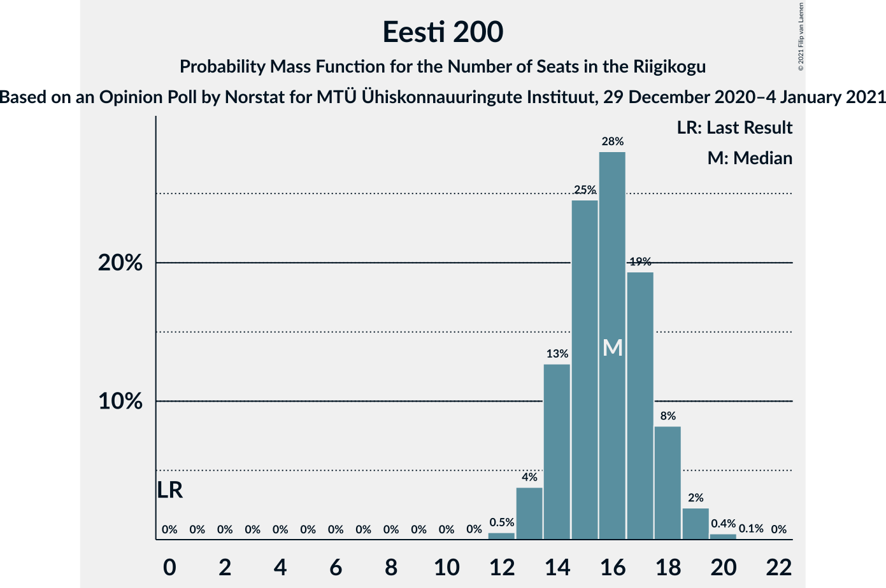

# Opinion Poll by Norstat for MTÜ Ühiskonnauuringute Instituut, 29 December 2020–4 January 2021

<a href="#voting-intentions">Voting Intentions</a> | <a href="#seats">Seats</a> | <a href="#coalitions">Coalitions</a> | <a href="#technical-information">Technical Information</a>

## Voting Intentions

### Confidence Intervals

| Party | Last Result | Poll Result | 80% Confidence Interval | 90% Confidence Interval | 95% Confidence Interval | 99% Confidence Interval |
|:-----:|:-----------:|:-----------:|:-----------------------:|:-----------------------:|:-----------------------:|:-----------------------:|
| Eesti Reformierakond | 28.9% | 29.6% | 27.8–31.5% |27.3–32.0% |26.9–32.5% |26.0–33.4% |
| Eesti Keskerakond | 23.1% | 22.1% | 20.5–23.9% |20.0–24.4% |19.6–24.8% |18.9–25.6% |
| Eesti 200 | 4.4% | 15.2% | 13.8–16.8% |13.4–17.2% |13.1–17.6% |12.5–18.3% |
| Eesti Konservatiivne Rahvaerakond | 17.8% | 14.7% | 13.3–16.2% |13.0–16.7% |12.6–17.0% |12.0–17.8% |
| Sotsiaaldemokraatlik Erakond | 9.8% | 8.8% | 7.7–10.1% |7.5–10.4% |7.2–10.7% |6.7–11.4% |
| Erakond Isamaa | 11.4% | 5.5% | 4.7–6.5% |4.4–6.8% |4.3–7.1% |3.9–7.6% |
| Erakond Eestimaa Rohelised | 1.8% | 2.0% | 1.5–2.7% |1.4–2.9% |1.3–3.1% |1.1–3.4% |

*Note:* The poll result column reflects the actual value used in the calculations. Published results may vary slightly, and in addition be rounded to fewer digits.

## Seats

### Confidence Intervals

| Party | Last Result | Median | 80% Confidence Interval | 90% Confidence Interval | 95% Confidence Interval | 99% Confidence Interval |
|:-----:|:-----------:|:------:|:-----------------------:|:-----------------------:|:-----------------------:|:-----------------------:|
| <a href="#eesti-reformierakond">Eesti Reformierakond</a> | 34 | 34 | 31–36 |30–37 |30–37 |29–39 |
| <a href="#eesti-keskerakond">Eesti Keskerakond</a> | 26 | 24 | 22–26 |21–27 |21–28 |20–29 |
| <a href="#eesti-200">Eesti 200</a> | 0 | 16 | 14–18 |14–18 |13–19 |12–20 |
| <a href="#eesti-konservatiivne-rahvaerakond">Eesti Konservatiivne Rahvaerakond</a> | 19 | 15 | 14–17 |13–18 |13–18 |12–19 |
| <a href="#sotsiaaldemokraatlik-erakond">Sotsiaaldemokraatlik Erakond</a> | 10 | 8 | 7–10 |7–10 |7–11 |6–11 |
| <a href="#erakond-isamaa">Erakond Isamaa</a> | 12 | 5 | 0–6 |0–6 |0–6 |0–7 |
| <a href="#erakond-eestimaa-rohelised">Erakond Eestimaa Rohelised</a> | 0 | 0 | 0 |0 |0 |0 |

### Eesti Reformierakond

*For a full overview of the results for this party, see the [Eesti Reformierakond](party-eestireformierakond.html) page.*

| Number of Seats | Probability | Accumulated | Special Marks |
|:---------------:|:-----------:|:-----------:|:-------------:|
| 28 | 0.2% | 100% |  |
| 29 | 1.1% | 99.8% |  |
| 30 | 4% | 98.6% |  |
| 31 | 9% | 95% |  |
| 32 | 16% | 86% |  |
| 33 | 20% | 71% |  |
| 34 | 19% | 50% | Last Result, Median |
| 35 | 17% | 31% |  |
| 36 | 8% | 14% |  |
| 37 | 4% | 6% |  |
| 38 | 1.5% | 2% |  |
| 39 | 0.5% | 0.7% |  |
| 40 | 0.1% | 0.2% |  |
| 41 | 0% | 0% |  |

### Eesti Keskerakond

*For a full overview of the results for this party, see the [Eesti Keskerakond](party-eestikeskerakond.html) page.*

| Number of Seats | Probability | Accumulated | Special Marks |
|:---------------:|:-----------:|:-----------:|:-------------:|
| 19 | 0.1% | 100% |  |
| 20 | 1.1% | 99.9% |  |
| 21 | 4% | 98.8% |  |
| 22 | 11% | 94% |  |
| 23 | 21% | 84% |  |
| 24 | 24% | 62% | Median |
| 25 | 18% | 39% |  |
| 26 | 13% | 21% | Last Result |
| 27 | 5% | 8% |  |
| 28 | 2% | 3% |  |
| 29 | 0.4% | 0.5% |  |
| 30 | 0.1% | 0.1% |  |
| 31 | 0% | 0% |  |

### Eesti 200

*For a full overview of the results for this party, see the [Eesti 200](party-eesti200.html) page.*

| Number of Seats | Probability | Accumulated | Special Marks |
|:---------------:|:-----------:|:-----------:|:-------------:|
| 0 | 0% | 100% | Last Result |
| 1 | 0% | 100% |  |
| 2 | 0% | 100% |  |
| 3 | 0% | 100% |  |
| 4 | 0% | 100% |  |
| 5 | 0% | 100% |  |
| 6 | 0% | 100% |  |
| 7 | 0% | 100% |  |
| 8 | 0% | 100% |  |
| 9 | 0% | 100% |  |
| 10 | 0% | 100% |  |
| 11 | 0% | 100% |  |
| 12 | 0.5% | 100% |  |
| 13 | 4% | 99.4% |  |
| 14 | 13% | 96% |  |
| 15 | 25% | 83% |  |
| 16 | 28% | 58% | Median |
| 17 | 19% | 30% |  |
| 18 | 8% | 11% |  |
| 19 | 2% | 3% |  |
| 20 | 0.4% | 0.5% |  |
| 21 | 0.1% | 0.1% |  |
| 22 | 0% | 0% |  |

### Eesti Konservatiivne Rahvaerakond

*For a full overview of the results for this party, see the [Eesti Konservatiivne Rahvaerakond](party-eestikonservatiivnerahvaerakond.html) page.*

| Number of Seats | Probability | Accumulated | Special Marks |
|:---------------:|:-----------:|:-----------:|:-------------:|
| 11 | 0.1% | 100% |  |
| 12 | 1.4% | 99.9% |  |
| 13 | 8% | 98% |  |
| 14 | 19% | 90% |  |
| 15 | 32% | 72% | Median |
| 16 | 22% | 39% |  |
| 17 | 12% | 17% |  |
| 18 | 4% | 5% |  |
| 19 | 1.1% | 1.3% | Last Result |
| 20 | 0.1% | 0.1% |  |
| 21 | 0% | 0% |  |

### Sotsiaaldemokraatlik Erakond

*For a full overview of the results for this party, see the [Sotsiaaldemokraatlik Erakond](party-sotsiaaldemokraatlikerakond.html) page.*

| Number of Seats | Probability | Accumulated | Special Marks |
|:---------------:|:-----------:|:-----------:|:-------------:|
| 5 | 0.1% | 100% |  |
| 6 | 2% | 99.9% |  |
| 7 | 15% | 98% |  |
| 8 | 39% | 83% | Median |
| 9 | 30% | 43% |  |
| 10 | 11% | 14% | Last Result |
| 11 | 3% | 3% |  |
| 12 | 0.3% | 0.3% |  |
| 13 | 0% | 0% |  |

### Erakond Isamaa

*For a full overview of the results for this party, see the [Erakond Isamaa](party-erakondisamaa.html) page.*

| Number of Seats | Probability | Accumulated | Special Marks |
|:---------------:|:-----------:|:-----------:|:-------------:|
| 0 | 22% | 100% |  |
| 1 | 0% | 78% |  |
| 2 | 0% | 78% |  |
| 3 | 0% | 78% |  |
| 4 | 14% | 78% |  |
| 5 | 47% | 64% | Median |
| 6 | 15% | 16% |  |
| 7 | 1.3% | 1.4% |  |
| 8 | 0.1% | 0.1% |  |
| 9 | 0% | 0% |  |
| 10 | 0% | 0% |  |
| 11 | 0% | 0% |  |
| 12 | 0% | 0% | Last Result |

### Erakond Eestimaa Rohelised

*For a full overview of the results for this party, see the [Erakond Eestimaa Rohelised](party-erakondeestimaarohelised.html) page.*

| Number of Seats | Probability | Accumulated | Special Marks |
|:---------------:|:-----------:|:-----------:|:-------------:|
| 0 | 100% | 100% | Last Result, Median |

## Coalitions

### Confidence Intervals

| Coalition | Last Result | Median | Majority? | 80% Confidence Interval | 90% Confidence Interval | 95% Confidence Interval | 99% Confidence Interval |
|:---------:|:-----------:|:------:|:---------:|:-----------------------:|:-----------------------:|:-----------------------:|:-----------------------:|
| Eesti Reformierakond – Eesti Keskerakond – Eesti Konservatiivne Rahvaerakond | 79 | 73 | 100% | 70–76 | 70–77 | 69–78 | 68–79 |
| Eesti Reformierakond – Eesti Keskerakond | 60 | 58 | 100% | 55–61 | 54–61 | 54–62 | 53–64 |
| Eesti Reformierakond – Eesti Konservatiivne Rahvaerakond – Erakond Isamaa | 65 | 53 | 84% | 50–55 | 49–56 | 48–57 | 47–58 |
| Eesti Reformierakond – Eesti Konservatiivne Rahvaerakond | 53 | 49 | 19% | 46–52 | 45–52 | 45–53 | 44–54 |
| Eesti Reformierakond – Sotsiaaldemokraatlik Erakond – Erakond Isamaa | 56 | 46 | 1.1% | 43–49 | 42–49 | 41–50 | 40–51 |
| Eesti Keskerakond – Eesti Konservatiivne Rahvaerakond – Erakond Isamaa | 57 | 43 | 0% | 40–46 | 39–47 | 39–47 | 37–49 |
| Eesti Reformierakond – Sotsiaaldemokraatlik Erakond | 44 | 42 | 0% | 39–45 | 39–45 | 38–46 | 37–48 |
| Eesti Keskerakond – Eesti Konservatiivne Rahvaerakond | 45 | 39 | 0% | 37–42 | 36–43 | 36–43 | 35–45 |
| Eesti Reformierakond – Erakond Isamaa | 46 | 38 | 0% | 34–40 | 33–41 | 32–42 | 31–43 |
| Eesti Keskerakond – Sotsiaaldemokraatlik Erakond – Erakond Isamaa | 48 | 37 | 0% | 33–39 | 32–40 | 32–41 | 30–42 |
| Eesti Keskerakond – Sotsiaaldemokraatlik Erakond | 36 | 32 | 0% | 30–35 | 30–36 | 29–36 | 28–38 |
| Eesti Konservatiivne Rahvaerakond – Sotsiaaldemokraatlik Erakond | 29 | 24 | 0% | 22–26 | 21–26 | 21–27 | 20–28 |

### Eesti Reformierakond – Eesti Keskerakond – Eesti Konservatiivne Rahvaerakond

| Number of Seats | Probability | Accumulated | Special Marks |
|:---------------:|:-----------:|:-----------:|:-------------:|
| 66 | 0% | 100% |  |
| 67 | 0.3% | 99.9% |  |
| 68 | 1.0% | 99.7% |  |
| 69 | 3% | 98.6% |  |
| 70 | 9% | 95% |  |
| 71 | 13% | 86% |  |
| 72 | 20% | 73% |  |
| 73 | 20% | 53% | Median |
| 74 | 11% | 33% |  |
| 75 | 8% | 22% |  |
| 76 | 5% | 14% |  |
| 77 | 5% | 8% |  |
| 78 | 2% | 3% |  |
| 79 | 0.8% | 1.0% | Last Result |
| 80 | 0.2% | 0.2% |  |
| 81 | 0% | 0% |  |

### Eesti Reformierakond – Eesti Keskerakond

| Number of Seats | Probability | Accumulated | Special Marks |
|:---------------:|:-----------:|:-----------:|:-------------:|
| 51 | 0.1% | 100% | Majority |
| 52 | 0.4% | 99.9% |  |
| 53 | 2% | 99.5% |  |
| 54 | 4% | 98% |  |
| 55 | 9% | 94% |  |
| 56 | 16% | 85% |  |
| 57 | 18% | 68% |  |
| 58 | 19% | 50% | Median |
| 59 | 11% | 31% |  |
| 60 | 9% | 20% | Last Result |
| 61 | 6% | 11% |  |
| 62 | 3% | 4% |  |
| 63 | 1.1% | 2% |  |
| 64 | 0.4% | 0.6% |  |
| 65 | 0.1% | 0.2% |  |
| 66 | 0% | 0% |  |

### Eesti Reformierakond – Eesti Konservatiivne Rahvaerakond – Erakond Isamaa

| Number of Seats | Probability | Accumulated | Special Marks |
|:---------------:|:-----------:|:-----------:|:-------------:|
| 45 | 0.1% | 100% |  |
| 46 | 0.2% | 99.9% |  |
| 47 | 1.0% | 99.7% |  |
| 48 | 2% | 98.7% |  |
| 49 | 5% | 96% |  |
| 50 | 8% | 92% |  |
| 51 | 11% | 84% | Majority |
| 52 | 17% | 72% |  |
| 53 | 19% | 56% |  |
| 54 | 16% | 37% | Median |
| 55 | 12% | 21% |  |
| 56 | 6% | 9% |  |
| 57 | 2% | 3% |  |
| 58 | 0.8% | 1.0% |  |
| 59 | 0.2% | 0.2% |  |
| 60 | 0% | 0% |  |
| 61 | 0% | 0% |  |
| 62 | 0% | 0% |  |
| 63 | 0% | 0% |  |
| 64 | 0% | 0% |  |
| 65 | 0% | 0% | Last Result |

### Eesti Reformierakond – Eesti Konservatiivne Rahvaerakond

| Number of Seats | Probability | Accumulated | Special Marks |
|:---------------:|:-----------:|:-----------:|:-------------:|
| 42 | 0.1% | 100% |  |
| 43 | 0.4% | 99.9% |  |
| 44 | 1.5% | 99.5% |  |
| 45 | 4% | 98% |  |
| 46 | 8% | 94% |  |
| 47 | 13% | 86% |  |
| 48 | 18% | 73% |  |
| 49 | 19% | 54% | Median |
| 50 | 16% | 35% |  |
| 51 | 8% | 19% | Majority |
| 52 | 7% | 11% |  |
| 53 | 3% | 4% | Last Result |
| 54 | 1.4% | 2% |  |
| 55 | 0.3% | 0.4% |  |
| 56 | 0.1% | 0.1% |  |
| 57 | 0% | 0% |  |

### Eesti Reformierakond – Sotsiaaldemokraatlik Erakond – Erakond Isamaa

| Number of Seats | Probability | Accumulated | Special Marks |
|:---------------:|:-----------:|:-----------:|:-------------:|
| 38 | 0.1% | 100% |  |
| 39 | 0.2% | 99.9% |  |
| 40 | 0.9% | 99.7% |  |
| 41 | 2% | 98.8% |  |
| 42 | 4% | 97% |  |
| 43 | 8% | 93% |  |
| 44 | 11% | 85% |  |
| 45 | 16% | 74% |  |
| 46 | 16% | 58% |  |
| 47 | 19% | 42% | Median |
| 48 | 13% | 23% |  |
| 49 | 7% | 10% |  |
| 50 | 3% | 4% |  |
| 51 | 0.8% | 1.1% | Majority |
| 52 | 0.2% | 0.3% |  |
| 53 | 0% | 0% |  |
| 54 | 0% | 0% |  |
| 55 | 0% | 0% |  |
| 56 | 0% | 0% | Last Result |

### Eesti Keskerakond – Eesti Konservatiivne Rahvaerakond – Erakond Isamaa

| Number of Seats | Probability | Accumulated | Special Marks |
|:---------------:|:-----------:|:-----------:|:-------------:|
| 36 | 0.2% | 100% |  |
| 37 | 0.5% | 99.8% |  |
| 38 | 2% | 99.3% |  |
| 39 | 3% | 98% |  |
| 40 | 6% | 94% |  |
| 41 | 10% | 89% |  |
| 42 | 13% | 79% |  |
| 43 | 20% | 66% |  |
| 44 | 16% | 45% | Median |
| 45 | 14% | 29% |  |
| 46 | 9% | 16% |  |
| 47 | 5% | 7% |  |
| 48 | 2% | 2% |  |
| 49 | 0.4% | 0.5% |  |
| 50 | 0.1% | 0.1% |  |
| 51 | 0% | 0% | Majority |
| 52 | 0% | 0% |  |
| 53 | 0% | 0% |  |
| 54 | 0% | 0% |  |
| 55 | 0% | 0% |  |
| 56 | 0% | 0% |  |
| 57 | 0% | 0% | Last Result |

### Eesti Reformierakond – Sotsiaaldemokraatlik Erakond

| Number of Seats | Probability | Accumulated | Special Marks |
|:---------------:|:-----------:|:-----------:|:-------------:|
| 36 | 0.2% | 100% |  |
| 37 | 0.8% | 99.8% |  |
| 38 | 2% | 98.9% |  |
| 39 | 8% | 96% |  |
| 40 | 12% | 88% |  |
| 41 | 18% | 76% |  |
| 42 | 20% | 58% | Median |
| 43 | 17% | 38% |  |
| 44 | 11% | 22% | Last Result |
| 45 | 6% | 10% |  |
| 46 | 3% | 4% |  |
| 47 | 1.2% | 2% |  |
| 48 | 0.4% | 0.5% |  |
| 49 | 0.1% | 0.1% |  |
| 50 | 0% | 0% |  |

### Eesti Keskerakond – Eesti Konservatiivne Rahvaerakond

| Number of Seats | Probability | Accumulated | Special Marks |
|:---------------:|:-----------:|:-----------:|:-------------:|
| 33 | 0.1% | 100% |  |
| 34 | 0.4% | 99.9% |  |
| 35 | 2% | 99.5% |  |
| 36 | 5% | 98% |  |
| 37 | 11% | 93% |  |
| 38 | 18% | 82% |  |
| 39 | 19% | 64% | Median |
| 40 | 18% | 45% |  |
| 41 | 12% | 27% |  |
| 42 | 8% | 15% |  |
| 43 | 4% | 7% |  |
| 44 | 2% | 2% |  |
| 45 | 0.4% | 0.6% | Last Result |
| 46 | 0.1% | 0.2% |  |
| 47 | 0% | 0% |  |

### Eesti Reformierakond – Erakond Isamaa

| Number of Seats | Probability | Accumulated | Special Marks |
|:---------------:|:-----------:|:-----------:|:-------------:|
| 30 | 0.2% | 100% |  |
| 31 | 0.5% | 99.8% |  |
| 32 | 2% | 99.3% |  |
| 33 | 3% | 97% |  |
| 34 | 6% | 94% |  |
| 35 | 9% | 89% |  |
| 36 | 12% | 80% |  |
| 37 | 15% | 68% |  |
| 38 | 18% | 53% |  |
| 39 | 16% | 35% | Median |
| 40 | 12% | 19% |  |
| 41 | 4% | 7% |  |
| 42 | 2% | 3% |  |
| 43 | 0.5% | 0.6% |  |
| 44 | 0.1% | 0.1% |  |
| 45 | 0% | 0% |  |
| 46 | 0% | 0% | Last Result |

### Eesti Keskerakond – Sotsiaaldemokraatlik Erakond – Erakond Isamaa

| Number of Seats | Probability | Accumulated | Special Marks |
|:---------------:|:-----------:|:-----------:|:-------------:|
| 29 | 0.1% | 100% |  |
| 30 | 0.4% | 99.8% |  |
| 31 | 2% | 99.5% |  |
| 32 | 4% | 98% |  |
| 33 | 5% | 94% |  |
| 34 | 9% | 90% |  |
| 35 | 12% | 81% |  |
| 36 | 19% | 69% |  |
| 37 | 18% | 50% | Median |
| 38 | 15% | 32% |  |
| 39 | 10% | 17% |  |
| 40 | 4% | 7% |  |
| 41 | 2% | 3% |  |
| 42 | 0.5% | 0.7% |  |
| 43 | 0.1% | 0.1% |  |
| 44 | 0% | 0% |  |
| 45 | 0% | 0% |  |
| 46 | 0% | 0% |  |
| 47 | 0% | 0% |  |
| 48 | 0% | 0% | Last Result |

### Eesti Keskerakond – Sotsiaaldemokraatlik Erakond

| Number of Seats | Probability | Accumulated | Special Marks |
|:---------------:|:-----------:|:-----------:|:-------------:|
| 27 | 0.2% | 100% |  |
| 28 | 1.0% | 99.8% |  |
| 29 | 3% | 98.7% |  |
| 30 | 9% | 95% |  |
| 31 | 17% | 86% |  |
| 32 | 22% | 69% | Median |
| 33 | 19% | 47% |  |
| 34 | 14% | 29% |  |
| 35 | 9% | 15% |  |
| 36 | 4% | 6% | Last Result |
| 37 | 1.5% | 2% |  |
| 38 | 0.5% | 0.6% |  |
| 39 | 0.1% | 0.1% |  |
| 40 | 0% | 0% |  |

### Eesti Konservatiivne Rahvaerakond – Sotsiaaldemokraatlik Erakond

| Number of Seats | Probability | Accumulated | Special Marks |
|:---------------:|:-----------:|:-----------:|:-------------:|
| 19 | 0.3% | 100% |  |
| 20 | 2% | 99.6% |  |
| 21 | 6% | 98% |  |
| 22 | 16% | 92% |  |
| 23 | 25% | 76% | Median |
| 24 | 23% | 51% |  |
| 25 | 15% | 28% |  |
| 26 | 8% | 13% |  |
| 27 | 3% | 5% |  |
| 28 | 1.4% | 2% |  |
| 29 | 0.3% | 0.3% | Last Result |
| 30 | 0% | 0% |  |

## Technical Information

### Opinion Poll

+ **Polling firm:** Norstat
+ **Commissioner(s):** MTÜ Ühiskonnauuringute Instituut
+ **Fieldwork period:** 29 December 2020–4 January 2021

### Calculations

+ **Sample size:** 1000
+ **Simulations done:** 1,048,576
+ **Error estimate:** 0.73%

