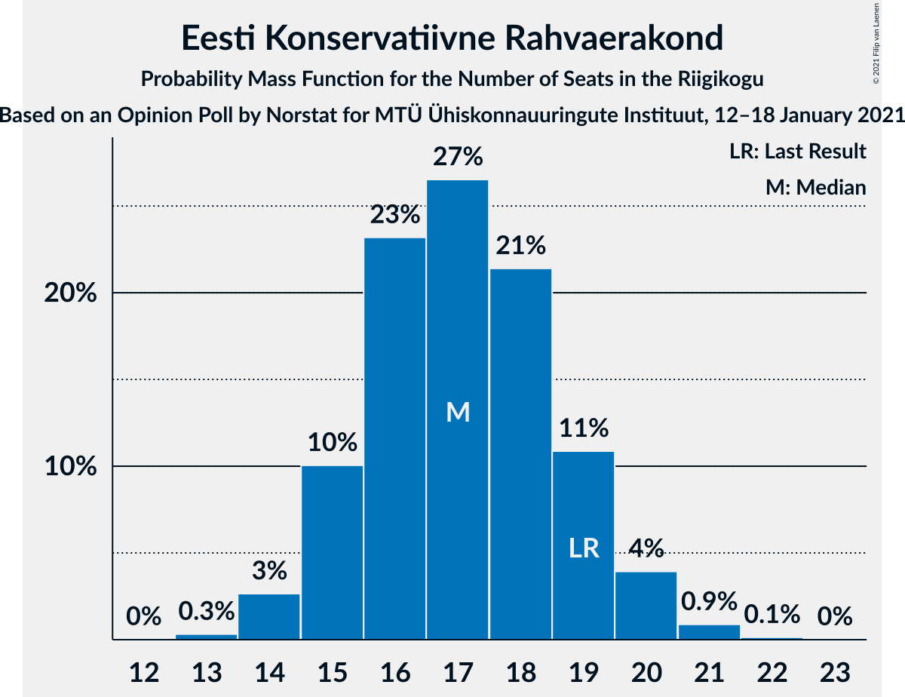
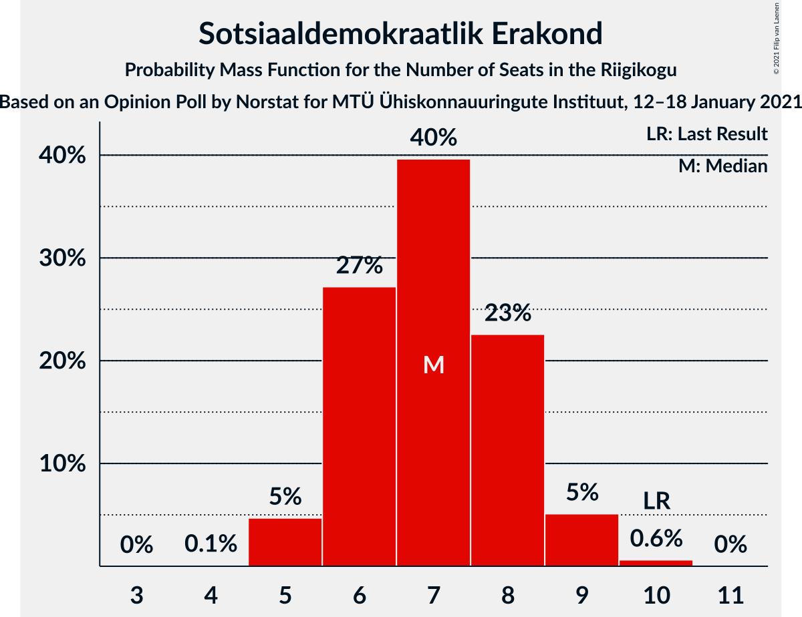
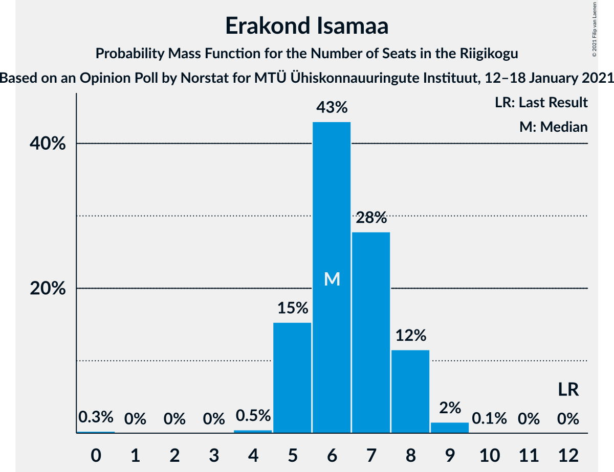

# Opinion Poll by Norstat for MTÜ Ühiskonnauuringute Instituut, 12–18 January 2021

<a href="#voting-intentions">Voting Intentions</a> | <a href="#seats">Seats</a> | <a href="#coalitions">Coalitions</a> | <a href="#technical-information">Technical Information</a>

## Voting Intentions

### Confidence Intervals

| Party | Last Result | Poll Result | 80% Confidence Interval | 90% Confidence Interval | 95% Confidence Interval | 99% Confidence Interval |
|:-----:|:-----------:|:-----------:|:-----------------------:|:-----------------------:|:-----------------------:|:-----------------------:|
| Eesti Reformierakond | 28.9% | 28.7% | 26.9–30.6% |26.4–31.1% |26.0–31.6% |25.1–32.5% |
| Eesti Keskerakond | 23.1% | 21.8% | 20.2–23.5% |19.7–24.0% |19.3–24.5% |18.6–25.3% |
| Eesti Konservatiivne Rahvaerakond | 17.8% | 16.3% | 14.9–17.9% |14.5–18.3% |14.1–18.7% |13.5–19.5% |
| Eesti 200 | 4.4% | 14.2% | 12.9–15.7% |12.5–16.1% |12.2–16.5% |11.6–17.3% |
| Sotsiaaldemokraatlik Erakond | 9.8% | 7.5% | 6.5–8.7% |6.2–9.0% |6.0–9.3% |5.6–9.9% |
| Erakond Isamaa | 11.4% | 7.0% | 6.1–8.2% |5.8–8.5% |5.6–8.8% |5.2–9.3% |
| Erakond Eestimaa Rohelised | 1.8% | 2.7% | 2.1–3.5% |2.0–3.7% |1.9–3.9% |1.6–4.3% |

*Note:* The poll result column reflects the actual value used in the calculations. Published results may vary slightly, and in addition be rounded to fewer digits.

## Seats

### Confidence Intervals

| Party | Last Result | Median | 80% Confidence Interval | 90% Confidence Interval | 95% Confidence Interval | 99% Confidence Interval |
|:-----:|:-----------:|:------:|:-----------------------:|:-----------------------:|:-----------------------:|:-----------------------:|
| <a href="#eesti-reformierakond">Eesti Reformierakond</a> | 34 | 32 | 30–35 |29–35 |29–36 |28–37 |
| <a href="#eesti-keskerakond">Eesti Keskerakond</a> | 26 | 24 | 22–26 |21–26 |21–27 |20–28 |
| <a href="#eesti-konservatiivne-rahvaerakond">Eesti Konservatiivne Rahvaerakond</a> | 19 | 17 | 15–19 |15–19 |14–20 |14–21 |
| <a href="#eesti-200">Eesti 200</a> | 0 | 15 | 13–16 |12–17 |12–17 |11–18 |
| <a href="#sotsiaaldemokraatlik-erakond">Sotsiaaldemokraatlik Erakond</a> | 10 | 7 | 6–8 |6–9 |5–9 |5–10 |
| <a href="#erakond-isamaa">Erakond Isamaa</a> | 12 | 6 | 5–8 |5–8 |5–8 |4–9 |
| <a href="#erakond-eestimaa-rohelised">Erakond Eestimaa Rohelised</a> | 0 | 0 | 0 |0 |0 |0 |

### Eesti Reformierakond

*For a full overview of the results for this party, see the [Eesti Reformierakond](party-eestireformierakond.html) page.*

| Number of Seats | Probability | Accumulated | Special Marks |
|:---------------:|:-----------:|:-----------:|:-------------:|
| 27 | 0.2% | 100% |  |
| 28 | 1.3% | 99.7% |  |
| 29 | 4% | 98% |  |
| 30 | 10% | 94% |  |
| 31 | 17% | 84% |  |
| 32 | 23% | 67% | Median |
| 33 | 20% | 44% |  |
| 34 | 13% | 25% | Last Result |
| 35 | 8% | 12% |  |
| 36 | 3% | 4% |  |
| 37 | 0.9% | 1.1% |  |
| 38 | 0.2% | 0.2% |  |
| 39 | 0% | 0% |  |

### Eesti Keskerakond

*For a full overview of the results for this party, see the [Eesti Keskerakond](party-eestikeskerakond.html) page.*

| Number of Seats | Probability | Accumulated | Special Marks |
|:---------------:|:-----------:|:-----------:|:-------------:|
| 19 | 0.3% | 100% |  |
| 20 | 2% | 99.7% |  |
| 21 | 6% | 98% |  |
| 22 | 15% | 92% |  |
| 23 | 23% | 76% |  |
| 24 | 23% | 53% | Median |
| 25 | 16% | 30% |  |
| 26 | 9% | 14% | Last Result |
| 27 | 3% | 4% |  |
| 28 | 0.9% | 1.1% |  |
| 29 | 0.2% | 0.2% |  |
| 30 | 0% | 0% |  |

### Eesti Konservatiivne Rahvaerakond

*For a full overview of the results for this party, see the [Eesti Konservatiivne Rahvaerakond](party-eestikonservatiivnerahvaerakond.html) page.*

| Number of Seats | Probability | Accumulated | Special Marks |
|:---------------:|:-----------:|:-----------:|:-------------:|
| 13 | 0.3% | 100% |  |
| 14 | 3% | 99.7% |  |
| 15 | 10% | 97% |  |
| 16 | 23% | 87% |  |
| 17 | 27% | 64% | Median |
| 18 | 21% | 37% |  |
| 19 | 11% | 16% | Last Result |
| 20 | 4% | 5% |  |
| 21 | 0.9% | 1.0% |  |
| 22 | 0.1% | 0.2% |  |
| 23 | 0% | 0% |  |

### Eesti 200

*For a full overview of the results for this party, see the [Eesti 200](party-eesti200.html) page.*

| Number of Seats | Probability | Accumulated | Special Marks |
|:---------------:|:-----------:|:-----------:|:-------------:|
| 0 | 0% | 100% | Last Result |
| 1 | 0% | 100% |  |
| 2 | 0% | 100% |  |
| 3 | 0% | 100% |  |
| 4 | 0% | 100% |  |
| 5 | 0% | 100% |  |
| 6 | 0% | 100% |  |
| 7 | 0% | 100% |  |
| 8 | 0% | 100% |  |
| 9 | 0% | 100% |  |
| 10 | 0% | 100% |  |
| 11 | 0.6% | 100% |  |
| 12 | 5% | 99.4% |  |
| 13 | 17% | 95% |  |
| 14 | 26% | 78% |  |
| 15 | 27% | 52% | Median |
| 16 | 17% | 26% |  |
| 17 | 6% | 8% |  |
| 18 | 2% | 2% |  |
| 19 | 0.2% | 0.2% |  |
| 20 | 0% | 0% |  |

### Sotsiaaldemokraatlik Erakond

*For a full overview of the results for this party, see the [Sotsiaaldemokraatlik Erakond](party-sotsiaaldemokraatlikerakond.html) page.*

| Number of Seats | Probability | Accumulated | Special Marks |
|:---------------:|:-----------:|:-----------:|:-------------:|
| 4 | 0.1% | 100% |  |
| 5 | 5% | 99.9% |  |
| 6 | 27% | 95% |  |
| 7 | 40% | 68% | Median |
| 8 | 23% | 28% |  |
| 9 | 5% | 6% |  |
| 10 | 0.6% | 0.7% | Last Result |
| 11 | 0% | 0% |  |

### Erakond Isamaa

*For a full overview of the results for this party, see the [Erakond Isamaa](party-erakondisamaa.html) page.*

| Number of Seats | Probability | Accumulated | Special Marks |
|:---------------:|:-----------:|:-----------:|:-------------:|
| 0 | 0.3% | 100% |  |
| 1 | 0% | 99.7% |  |
| 2 | 0% | 99.7% |  |
| 3 | 0% | 99.7% |  |
| 4 | 0.5% | 99.7% |  |
| 5 | 15% | 99.3% |  |
| 6 | 43% | 84% | Median |
| 7 | 28% | 41% |  |
| 8 | 12% | 13% |  |
| 9 | 2% | 2% |  |
| 10 | 0.1% | 0.1% |  |
| 11 | 0% | 0% |  |
| 12 | 0% | 0% | Last Result |

### Erakond Eestimaa Rohelised

*For a full overview of the results for this party, see the [Erakond Eestimaa Rohelised](party-erakondeestimaarohelised.html) page.*

| Number of Seats | Probability | Accumulated | Special Marks |
|:---------------:|:-----------:|:-----------:|:-------------:|
| 0 | 100% | 100% | Last Result, Median |

## Coalitions

### Confidence Intervals

| Coalition | Last Result | Median | Majority? | 80% Confidence Interval | 90% Confidence Interval | 95% Confidence Interval | 99% Confidence Interval |
|:---------:|:-----------:|:------:|:---------:|:-----------------------:|:-----------------------:|:-----------------------:|:-----------------------:|
| Eesti Reformierakond – Eesti Keskerakond – Eesti Konservatiivne Rahvaerakond | 79 | 73 | 100% | 71–75 | 70–76 | 70–76 | 69–78 |
| Eesti Reformierakond – Eesti Keskerakond | 60 | 56 | 99.8% | 53–59 | 53–59 | 52–60 | 51–61 |
| Eesti Reformierakond – Eesti Konservatiivne Rahvaerakond – Erakond Isamaa | 65 | 56 | 99.7% | 53–58 | 53–59 | 52–60 | 51–61 |
| Eesti Reformierakond – Eesti Konservatiivne Rahvaerakond | 53 | 49 | 27% | 47–52 | 46–53 | 46–53 | 45–54 |
| Eesti Keskerakond – Eesti Konservatiivne Rahvaerakond – Erakond Isamaa | 57 | 47 | 4% | 45–49 | 44–50 | 43–51 | 42–52 |
| Eesti Reformierakond – Sotsiaaldemokraatlik Erakond – Erakond Isamaa | 56 | 46 | 0.6% | 43–48 | 42–49 | 42–49 | 41–51 |
| Eesti Keskerakond – Eesti Konservatiivne Rahvaerakond | 45 | 41 | 0% | 38–43 | 38–44 | 37–44 | 36–46 |
| Eesti Reformierakond – Sotsiaaldemokraatlik Erakond | 44 | 39 | 0% | 37–42 | 36–42 | 36–43 | 35–44 |
| Eesti Reformierakond – Erakond Isamaa | 46 | 39 | 0% | 36–41 | 36–42 | 35–43 | 34–44 |
| Eesti Keskerakond – Sotsiaaldemokraatlik Erakond – Erakond Isamaa | 48 | 37 | 0% | 35–39 | 34–40 | 33–41 | 32–42 |
| Eesti Keskerakond – Sotsiaaldemokraatlik Erakond | 36 | 31 | 0% | 28–33 | 28–34 | 27–34 | 26–35 |
| Eesti Konservatiivne Rahvaerakond – Sotsiaaldemokraatlik Erakond | 29 | 24 | 0% | 22–26 | 21–27 | 21–27 | 20–28 |

### Eesti Reformierakond – Eesti Keskerakond – Eesti Konservatiivne Rahvaerakond

| Number of Seats | Probability | Accumulated | Special Marks |
|:---------------:|:-----------:|:-----------:|:-------------:|
| 67 | 0.1% | 100% |  |
| 68 | 0.4% | 99.9% |  |
| 69 | 2% | 99.5% |  |
| 70 | 5% | 98% |  |
| 71 | 11% | 93% |  |
| 72 | 19% | 81% |  |
| 73 | 23% | 62% | Median |
| 74 | 19% | 39% |  |
| 75 | 12% | 20% |  |
| 76 | 6% | 8% |  |
| 77 | 2% | 2% |  |
| 78 | 0.5% | 0.6% |  |
| 79 | 0.1% | 0.2% | Last Result |
| 80 | 0% | 0% |  |

### Eesti Reformierakond – Eesti Keskerakond

| Number of Seats | Probability | Accumulated | Special Marks |
|:---------------:|:-----------:|:-----------:|:-------------:|
| 50 | 0.1% | 100% |  |
| 51 | 0.7% | 99.8% | Majority |
| 52 | 3% | 99.2% |  |
| 53 | 7% | 96% |  |
| 54 | 13% | 90% |  |
| 55 | 20% | 77% |  |
| 56 | 16% | 57% | Median |
| 57 | 20% | 41% |  |
| 58 | 10% | 21% |  |
| 59 | 6% | 11% |  |
| 60 | 4% | 5% | Last Result |
| 61 | 0.5% | 0.7% |  |
| 62 | 0.1% | 0.2% |  |
| 63 | 0% | 0% |  |

### Eesti Reformierakond – Eesti Konservatiivne Rahvaerakond – Erakond Isamaa

| Number of Seats | Probability | Accumulated | Special Marks |
|:---------------:|:-----------:|:-----------:|:-------------:|
| 49 | 0.1% | 100% |  |
| 50 | 0.2% | 99.9% |  |
| 51 | 1.0% | 99.7% | Majority |
| 52 | 3% | 98.7% |  |
| 53 | 7% | 95% |  |
| 54 | 13% | 88% |  |
| 55 | 21% | 75% | Median |
| 56 | 19% | 54% |  |
| 57 | 17% | 35% |  |
| 58 | 11% | 19% |  |
| 59 | 5% | 8% |  |
| 60 | 2% | 3% |  |
| 61 | 0.5% | 0.6% |  |
| 62 | 0.1% | 0.1% |  |
| 63 | 0% | 0% |  |
| 64 | 0% | 0% |  |
| 65 | 0% | 0% | Last Result |

### Eesti Reformierakond – Eesti Konservatiivne Rahvaerakond

| Number of Seats | Probability | Accumulated | Special Marks |
|:---------------:|:-----------:|:-----------:|:-------------:|
| 43 | 0.1% | 100% |  |
| 44 | 0.4% | 99.9% |  |
| 45 | 2% | 99.5% |  |
| 46 | 4% | 98% |  |
| 47 | 10% | 94% |  |
| 48 | 17% | 84% |  |
| 49 | 19% | 66% | Median |
| 50 | 21% | 48% |  |
| 51 | 14% | 27% | Majority |
| 52 | 8% | 13% |  |
| 53 | 4% | 5% | Last Result |
| 54 | 1.2% | 2% |  |
| 55 | 0.3% | 0.4% |  |
| 56 | 0.1% | 0.1% |  |
| 57 | 0% | 0% |  |

### Eesti Keskerakond – Eesti Konservatiivne Rahvaerakond – Erakond Isamaa

| Number of Seats | Probability | Accumulated | Special Marks |
|:---------------:|:-----------:|:-----------:|:-------------:|
| 41 | 0.1% | 100% |  |
| 42 | 0.5% | 99.9% |  |
| 43 | 3% | 99.3% |  |
| 44 | 5% | 97% |  |
| 45 | 11% | 92% |  |
| 46 | 19% | 81% |  |
| 47 | 19% | 62% | Median |
| 48 | 18% | 42% |  |
| 49 | 15% | 24% |  |
| 50 | 6% | 10% |  |
| 51 | 2% | 4% | Majority |
| 52 | 1.1% | 1.3% |  |
| 53 | 0.2% | 0.2% |  |
| 54 | 0% | 0% |  |
| 55 | 0% | 0% |  |
| 56 | 0% | 0% |  |
| 57 | 0% | 0% | Last Result |

### Eesti Reformierakond – Sotsiaaldemokraatlik Erakond – Erakond Isamaa

| Number of Seats | Probability | Accumulated | Special Marks |
|:---------------:|:-----------:|:-----------:|:-------------:|
| 39 | 0.1% | 100% |  |
| 40 | 0.3% | 99.9% |  |
| 41 | 1.1% | 99.6% |  |
| 42 | 4% | 98.6% |  |
| 43 | 8% | 95% |  |
| 44 | 13% | 86% |  |
| 45 | 20% | 73% | Median |
| 46 | 21% | 53% |  |
| 47 | 16% | 33% |  |
| 48 | 9% | 17% |  |
| 49 | 5% | 7% |  |
| 50 | 2% | 2% |  |
| 51 | 0.4% | 0.6% | Majority |
| 52 | 0.1% | 0.1% |  |
| 53 | 0% | 0% |  |
| 54 | 0% | 0% |  |
| 55 | 0% | 0% |  |
| 56 | 0% | 0% | Last Result |

### Eesti Keskerakond – Eesti Konservatiivne Rahvaerakond

| Number of Seats | Probability | Accumulated | Special Marks |
|:---------------:|:-----------:|:-----------:|:-------------:|
| 35 | 0.2% | 100% |  |
| 36 | 0.8% | 99.8% |  |
| 37 | 3% | 99.0% |  |
| 38 | 7% | 96% |  |
| 39 | 14% | 89% |  |
| 40 | 20% | 74% |  |
| 41 | 20% | 54% | Median |
| 42 | 17% | 35% |  |
| 43 | 10% | 17% |  |
| 44 | 5% | 7% |  |
| 45 | 2% | 2% | Last Result |
| 46 | 0.5% | 0.7% |  |
| 47 | 0.1% | 0.1% |  |
| 48 | 0% | 0% |  |

### Eesti Reformierakond – Sotsiaaldemokraatlik Erakond

| Number of Seats | Probability | Accumulated | Special Marks |
|:---------------:|:-----------:|:-----------:|:-------------:|
| 33 | 0.1% | 100% |  |
| 34 | 0.4% | 99.9% |  |
| 35 | 2% | 99.5% |  |
| 36 | 4% | 98% |  |
| 37 | 11% | 94% |  |
| 38 | 16% | 83% |  |
| 39 | 21% | 66% | Median |
| 40 | 21% | 45% |  |
| 41 | 13% | 25% |  |
| 42 | 7% | 12% |  |
| 43 | 3% | 4% |  |
| 44 | 1.1% | 1.4% | Last Result |
| 45 | 0.3% | 0.3% |  |
| 46 | 0% | 0.1% |  |
| 47 | 0% | 0% |  |

### Eesti Reformierakond – Erakond Isamaa

| Number of Seats | Probability | Accumulated | Special Marks |
|:---------------:|:-----------:|:-----------:|:-------------:|
| 32 | 0% | 100% |  |
| 33 | 0.2% | 99.9% |  |
| 34 | 0.9% | 99.7% |  |
| 35 | 3% | 98.9% |  |
| 36 | 9% | 95% |  |
| 37 | 13% | 86% |  |
| 38 | 20% | 73% | Median |
| 39 | 21% | 53% |  |
| 40 | 15% | 33% |  |
| 41 | 10% | 18% |  |
| 42 | 5% | 8% |  |
| 43 | 2% | 3% |  |
| 44 | 0.5% | 0.6% |  |
| 45 | 0.1% | 0.1% |  |
| 46 | 0% | 0% | Last Result |

### Eesti Keskerakond – Sotsiaaldemokraatlik Erakond – Erakond Isamaa

| Number of Seats | Probability | Accumulated | Special Marks |
|:---------------:|:-----------:|:-----------:|:-------------:|
| 31 | 0.1% | 100% |  |
| 32 | 0.6% | 99.8% |  |
| 33 | 2% | 99.2% |  |
| 34 | 5% | 97% |  |
| 35 | 13% | 92% |  |
| 36 | 19% | 79% |  |
| 37 | 21% | 61% | Median |
| 38 | 18% | 39% |  |
| 39 | 12% | 22% |  |
| 40 | 6% | 9% |  |
| 41 | 2% | 3% |  |
| 42 | 0.6% | 0.8% |  |
| 43 | 0.1% | 0.2% |  |
| 44 | 0% | 0% |  |
| 45 | 0% | 0% |  |
| 46 | 0% | 0% |  |
| 47 | 0% | 0% |  |
| 48 | 0% | 0% | Last Result |

### Eesti Keskerakond – Sotsiaaldemokraatlik Erakond

| Number of Seats | Probability | Accumulated | Special Marks |
|:---------------:|:-----------:|:-----------:|:-------------:|
| 25 | 0.1% | 100% |  |
| 26 | 0.6% | 99.9% |  |
| 27 | 3% | 99.3% |  |
| 28 | 7% | 96% |  |
| 29 | 15% | 90% |  |
| 30 | 22% | 74% |  |
| 31 | 19% | 52% | Median |
| 32 | 19% | 33% |  |
| 33 | 8% | 14% |  |
| 34 | 5% | 6% |  |
| 35 | 1.0% | 1.4% |  |
| 36 | 0.3% | 0.4% | Last Result |
| 37 | 0.1% | 0.1% |  |
| 38 | 0% | 0% |  |

### Eesti Konservatiivne Rahvaerakond – Sotsiaaldemokraatlik Erakond

| Number of Seats | Probability | Accumulated | Special Marks |
|:---------------:|:-----------:|:-----------:|:-------------:|
| 19 | 0.2% | 100% |  |
| 20 | 1.1% | 99.8% |  |
| 21 | 4% | 98.7% |  |
| 22 | 12% | 95% |  |
| 23 | 22% | 83% |  |
| 24 | 23% | 61% | Median |
| 25 | 19% | 38% |  |
| 26 | 11% | 19% |  |
| 27 | 6% | 8% |  |
| 28 | 2% | 2% |  |
| 29 | 0.3% | 0.3% | Last Result |
| 30 | 0% | 0.1% |  |
| 31 | 0% | 0% |  |

## Technical Information

### Opinion Poll

+ **Polling firm:** Norstat
+ **Commissioner(s):** MTÜ Ühiskonnauuringute Instituut
+ **Fieldwork period:** 12–18 January 2021

### Calculations

+ **Sample size:** 1000
+ **Simulations done:** 1,048,576
+ **Error estimate:** 0.55%

