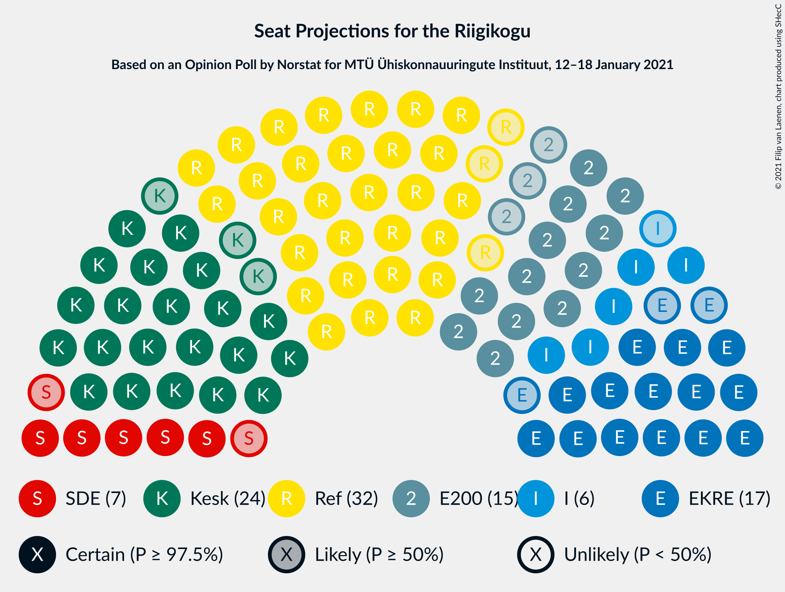

# Opinion Poll by Norstat for MTÜ Ühiskonnauuringute Instituut, 12–18 January 2021

<a href="#voting-intentions">Voting Intentions</a> | <a href="#seats">Seats</a> | <a href="#coalitions">Coalitions</a> | <a href="#technical-information">Technical Information</a>

## Voting Intentions

### Confidence Intervals

| Party | Last Result | Poll Result | 80% Confidence Interval | 90% Confidence Interval | 95% Confidence Interval | 99% Confidence Interval |
|:-----:|:-----------:|:-----------:|:-----------------------:|:-----------------------:|:-----------------------:|:-----------------------:|
| Eesti Reformierakond | 28.9% | 28.7% | 26.9–30.6% |26.4–31.1% |26.0–31.6% |25.1–32.5% |
| Eesti Keskerakond | 23.1% | 21.8% | 20.2–23.5% |19.7–24.0% |19.3–24.5% |18.6–25.3% |
| Eesti Konservatiivne Rahvaerakond | 17.8% | 16.3% | 14.9–17.9% |14.5–18.3% |14.1–18.7% |13.5–19.5% |
| Eesti 200 | 4.4% | 14.2% | 12.9–15.7% |12.5–16.1% |12.2–16.5% |11.6–17.3% |
| Sotsiaaldemokraatlik Erakond | 9.8% | 7.5% | 6.5–8.7% |6.2–9.0% |6.0–9.3% |5.6–9.9% |
| Erakond Isamaa | 11.4% | 7.0% | 6.1–8.2% |5.8–8.5% |5.6–8.8% |5.2–9.3% |
| Erakond Eestimaa Rohelised | 1.8% | 2.7% | 2.1–3.5% |2.0–3.7% |1.9–3.9% |1.6–4.3% |

*Note:* The poll result column reflects the actual value used in the calculations. Published results may vary slightly, and in addition be rounded to fewer digits.

## Seats

### Confidence Intervals

| Party | Last Result | Median | 80% Confidence Interval | 90% Confidence Interval | 95% Confidence Interval | 99% Confidence Interval |
|:-----:|:-----------:|:------:|:-----------------------:|:-----------------------:|:-----------------------:|:-----------------------:|
| <a href="#eesti-reformierakond">Eesti Reformierakond</a> | 34 | 32 | 30–35 |29–36 |29–36 |28–37 |
| <a href="#eesti-keskerakond">Eesti Keskerakond</a> | 26 | 24 | 22–26 |21–26 |21–27 |20–28 |
| <a href="#eesti-konservatiivne-rahvaerakond">Eesti Konservatiivne Rahvaerakond</a> | 19 | 17 | 15–19 |15–19 |14–20 |14–21 |
| <a href="#eesti-200">Eesti 200</a> | 0 | 14 | 13–16 |12–17 |12–17 |11–18 |
| <a href="#sotsiaaldemokraatlik-erakond">Sotsiaaldemokraatlik Erakond</a> | 10 | 7 | 6–8 |6–9 |5–9 |5–10 |
| <a href="#erakond-isamaa">Erakond Isamaa</a> | 12 | 6 | 6–7 |5–8 |5–8 |4–9 |
| <a href="#erakond-eestimaa-rohelised">Erakond Eestimaa Rohelised</a> | 0 | 0 | 0 |0 |0 |0 |

### Eesti Reformierakond

*For a full overview of the results for this party, see the [Eesti Reformierakond](party-eestireformierakond.html) page.*

| Number of Seats | Probability | Accumulated | Special Marks |
|:---------------:|:-----------:|:-----------:|:-------------:|
| 27 | 0.1% | 100% |  |
| 28 | 1.3% | 99.8% |  |
| 29 | 5% | 98% |  |
| 30 | 8% | 93% |  |
| 31 | 14% | 86% |  |
| 32 | 30% | 71% | Median |
| 33 | 18% | 41% |  |
| 34 | 8% | 23% | Last Result |
| 35 | 10% | 15% |  |
| 36 | 4% | 5% |  |
| 37 | 0.5% | 0.7% |  |
| 38 | 0.1% | 0.2% |  |
| 39 | 0% | 0% |  |

### Eesti Keskerakond

*For a full overview of the results for this party, see the [Eesti Keskerakond](party-eestikeskerakond.html) page.*

| Number of Seats | Probability | Accumulated | Special Marks |
|:---------------:|:-----------:|:-----------:|:-------------:|
| 19 | 0.3% | 100% |  |
| 20 | 2% | 99.7% |  |
| 21 | 5% | 98% |  |
| 22 | 16% | 93% |  |
| 23 | 24% | 77% |  |
| 24 | 20% | 53% | Median |
| 25 | 17% | 32% |  |
| 26 | 11% | 15% | Last Result |
| 27 | 3% | 4% |  |
| 28 | 0.8% | 1.0% |  |
| 29 | 0.1% | 0.1% |  |
| 30 | 0% | 0% |  |

### Eesti Konservatiivne Rahvaerakond

*For a full overview of the results for this party, see the [Eesti Konservatiivne Rahvaerakond](party-eestikonservatiivnerahvaerakond.html) page.*

| Number of Seats | Probability | Accumulated | Special Marks |
|:---------------:|:-----------:|:-----------:|:-------------:|
| 13 | 0.2% | 100% |  |
| 14 | 2% | 99.7% |  |
| 15 | 12% | 97% |  |
| 16 | 28% | 86% |  |
| 17 | 26% | 58% | Median |
| 18 | 17% | 32% |  |
| 19 | 11% | 15% | Last Result |
| 20 | 3% | 3% |  |
| 21 | 0.6% | 0.8% |  |
| 22 | 0.1% | 0.1% |  |
| 23 | 0% | 0% |  |

### Eesti 200

*For a full overview of the results for this party, see the [Eesti 200](party-eesti200.html) page.*

| Number of Seats | Probability | Accumulated | Special Marks |
|:---------------:|:-----------:|:-----------:|:-------------:|
| 0 | 0% | 100% | Last Result |
| 1 | 0% | 100% |  |
| 2 | 0% | 100% |  |
| 3 | 0% | 100% |  |
| 4 | 0% | 100% |  |
| 5 | 0% | 100% |  |
| 6 | 0% | 100% |  |
| 7 | 0% | 100% |  |
| 8 | 0% | 100% |  |
| 9 | 0% | 100% |  |
| 10 | 0% | 100% |  |
| 11 | 0.5% | 100% |  |
| 12 | 5% | 99.5% |  |
| 13 | 18% | 94% |  |
| 14 | 27% | 77% | Median |
| 15 | 24% | 49% |  |
| 16 | 19% | 25% |  |
| 17 | 5% | 6% |  |
| 18 | 1.2% | 1.4% |  |
| 19 | 0.2% | 0.2% |  |
| 20 | 0% | 0% |  |

### Sotsiaaldemokraatlik Erakond

*For a full overview of the results for this party, see the [Sotsiaaldemokraatlik Erakond](party-sotsiaaldemokraatlikerakond.html) page.*

| Number of Seats | Probability | Accumulated | Special Marks |
|:---------------:|:-----------:|:-----------:|:-------------:|
| 4 | 0.1% | 100% |  |
| 5 | 4% | 99.9% |  |
| 6 | 28% | 96% |  |
| 7 | 36% | 68% | Median |
| 8 | 26% | 32% |  |
| 9 | 5% | 6% |  |
| 10 | 0.7% | 0.8% | Last Result |
| 11 | 0% | 0% |  |

### Erakond Isamaa

*For a full overview of the results for this party, see the [Erakond Isamaa](party-erakondisamaa.html) page.*

| Number of Seats | Probability | Accumulated | Special Marks |
|:---------------:|:-----------:|:-----------:|:-------------:|
| 0 | 0.4% | 100% |  |
| 1 | 0% | 99.6% |  |
| 2 | 0% | 99.6% |  |
| 3 | 0% | 99.6% |  |
| 4 | 0.7% | 99.6% |  |
| 5 | 7% | 99.0% |  |
| 6 | 44% | 92% | Median |
| 7 | 41% | 48% |  |
| 8 | 5% | 7% |  |
| 9 | 2% | 2% |  |
| 10 | 0.1% | 0.1% |  |
| 11 | 0% | 0% |  |
| 12 | 0% | 0% | Last Result |

### Erakond Eestimaa Rohelised

*For a full overview of the results for this party, see the [Erakond Eestimaa Rohelised](party-erakondeestimaarohelised.html) page.*

| Number of Seats | Probability | Accumulated | Special Marks |
|:---------------:|:-----------:|:-----------:|:-------------:|
| 0 | 100% | 100% | Last Result, Median |

## Coalitions

### Confidence Intervals

| Coalition | Last Result | Median | Majority? | 80% Confidence Interval | 90% Confidence Interval | 95% Confidence Interval | 99% Confidence Interval |
|:---------:|:-----------:|:------:|:---------:|:-----------------------:|:-----------------------:|:-----------------------:|:-----------------------:|
| Eesti Reformierakond – Eesti Keskerakond – Eesti Konservatiivne Rahvaerakond | 79 | 73 | 100% | 71–75 | 70–76 | 70–76 | 69–77 |
| Eesti Reformierakond – Eesti Keskerakond | 60 | 56 | 99.9% | 53–58 | 53–59 | 52–60 | 51–61 |
| Eesti Reformierakond – Eesti Konservatiivne Rahvaerakond – Erakond Isamaa | 65 | 56 | 99.8% | 53–58 | 53–59 | 52–60 | 51–61 |
| Eesti Reformierakond – Eesti Konservatiivne Rahvaerakond | 53 | 49 | 29% | 47–51 | 46–53 | 46–53 | 45–54 |
| Eesti Keskerakond – Eesti Konservatiivne Rahvaerakond – Erakond Isamaa | 57 | 47 | 3% | 45–50 | 44–50 | 43–51 | 42–52 |
| Eesti Reformierakond – Sotsiaaldemokraatlik Erakond – Erakond Isamaa | 56 | 46 | 0.4% | 44–48 | 43–49 | 42–50 | 41–50 |
| Eesti Keskerakond – Eesti Konservatiivne Rahvaerakond | 45 | 41 | 0% | 38–43 | 38–44 | 37–44 | 36–45 |
| Eesti Reformierakond – Sotsiaaldemokraatlik Erakond | 44 | 39 | 0% | 37–42 | 36–42 | 36–43 | 34–44 |
| Eesti Reformierakond – Erakond Isamaa | 46 | 39 | 0% | 36–41 | 35–42 | 35–42 | 34–43 |
| Eesti Keskerakond – Sotsiaaldemokraatlik Erakond – Erakond Isamaa | 48 | 37 | 0% | 35–39 | 34–40 | 34–41 | 32–42 |
| Eesti Keskerakond – Sotsiaaldemokraatlik Erakond | 36 | 31 | 0% | 29–33 | 28–34 | 27–34 | 26–35 |
| Eesti Konservatiivne Rahvaerakond – Sotsiaaldemokraatlik Erakond | 29 | 24 | 0% | 22–26 | 22–27 | 21–27 | 20–28 |

### Eesti Reformierakond – Eesti Keskerakond – Eesti Konservatiivne Rahvaerakond

| Number of Seats | Probability | Accumulated | Special Marks |
|:---------------:|:-----------:|:-----------:|:-------------:|
| 67 | 0.1% | 100% |  |
| 68 | 0.4% | 99.9% |  |
| 69 | 1.3% | 99.6% |  |
| 70 | 5% | 98% |  |
| 71 | 10% | 93% |  |
| 72 | 25% | 83% |  |
| 73 | 19% | 58% | Median |
| 74 | 22% | 39% |  |
| 75 | 10% | 17% |  |
| 76 | 5% | 7% |  |
| 77 | 1.1% | 1.5% |  |
| 78 | 0.3% | 0.4% |  |
| 79 | 0.1% | 0.1% | Last Result |
| 80 | 0.1% | 0.1% |  |
| 81 | 0% | 0% |  |

### Eesti Reformierakond – Eesti Keskerakond

| Number of Seats | Probability | Accumulated | Special Marks |
|:---------------:|:-----------:|:-----------:|:-------------:|
| 50 | 0.1% | 100% |  |
| 51 | 0.8% | 99.9% | Majority |
| 52 | 3% | 99.1% |  |
| 53 | 8% | 96% |  |
| 54 | 7% | 88% |  |
| 55 | 18% | 81% |  |
| 56 | 16% | 63% | Median |
| 57 | 26% | 47% |  |
| 58 | 12% | 20% |  |
| 59 | 4% | 8% |  |
| 60 | 3% | 4% | Last Result |
| 61 | 0.6% | 0.8% |  |
| 62 | 0.1% | 0.2% |  |
| 63 | 0.1% | 0.1% |  |
| 64 | 0% | 0% |  |

### Eesti Reformierakond – Eesti Konservatiivne Rahvaerakond – Erakond Isamaa

| Number of Seats | Probability | Accumulated | Special Marks |
|:---------------:|:-----------:|:-----------:|:-------------:|
| 49 | 0.1% | 100% |  |
| 50 | 0.1% | 99.9% |  |
| 51 | 1.0% | 99.8% | Majority |
| 52 | 3% | 98.7% |  |
| 53 | 6% | 96% |  |
| 54 | 15% | 90% |  |
| 55 | 23% | 75% | Median |
| 56 | 19% | 52% |  |
| 57 | 17% | 33% |  |
| 58 | 8% | 16% |  |
| 59 | 5% | 8% |  |
| 60 | 3% | 3% |  |
| 61 | 0.4% | 0.6% |  |
| 62 | 0.1% | 0.1% |  |
| 63 | 0% | 0% |  |
| 64 | 0% | 0% |  |
| 65 | 0% | 0% | Last Result |

### Eesti Reformierakond – Eesti Konservatiivne Rahvaerakond

| Number of Seats | Probability | Accumulated | Special Marks |
|:---------------:|:-----------:|:-----------:|:-------------:|
| 43 | 0% | 100% |  |
| 44 | 0.3% | 99.9% |  |
| 45 | 2% | 99.7% |  |
| 46 | 4% | 98% |  |
| 47 | 13% | 94% |  |
| 48 | 19% | 81% |  |
| 49 | 17% | 62% | Median |
| 50 | 15% | 45% |  |
| 51 | 20% | 29% | Majority |
| 52 | 4% | 10% |  |
| 53 | 4% | 6% | Last Result |
| 54 | 0.9% | 1.3% |  |
| 55 | 0.3% | 0.4% |  |
| 56 | 0.1% | 0.1% |  |
| 57 | 0% | 0% |  |

### Eesti Keskerakond – Eesti Konservatiivne Rahvaerakond – Erakond Isamaa

| Number of Seats | Probability | Accumulated | Special Marks |
|:---------------:|:-----------:|:-----------:|:-------------:|
| 41 | 0.1% | 100% |  |
| 42 | 0.6% | 99.9% |  |
| 43 | 4% | 99.3% |  |
| 44 | 3% | 96% |  |
| 45 | 12% | 92% |  |
| 46 | 20% | 80% |  |
| 47 | 16% | 60% | Median |
| 48 | 18% | 44% |  |
| 49 | 16% | 26% |  |
| 50 | 7% | 10% |  |
| 51 | 2% | 3% | Majority |
| 52 | 0.9% | 1.1% |  |
| 53 | 0.2% | 0.3% |  |
| 54 | 0% | 0% |  |
| 55 | 0% | 0% |  |
| 56 | 0% | 0% |  |
| 57 | 0% | 0% | Last Result |

### Eesti Reformierakond – Sotsiaaldemokraatlik Erakond – Erakond Isamaa

| Number of Seats | Probability | Accumulated | Special Marks |
|:---------------:|:-----------:|:-----------:|:-------------:|
| 39 | 0.1% | 100% |  |
| 40 | 0.2% | 99.8% |  |
| 41 | 0.9% | 99.7% |  |
| 42 | 3% | 98.8% |  |
| 43 | 6% | 96% |  |
| 44 | 16% | 91% |  |
| 45 | 17% | 74% | Median |
| 46 | 20% | 57% |  |
| 47 | 22% | 37% |  |
| 48 | 6% | 16% |  |
| 49 | 7% | 10% |  |
| 50 | 3% | 3% |  |
| 51 | 0.3% | 0.4% | Majority |
| 52 | 0.1% | 0.1% |  |
| 53 | 0% | 0% |  |
| 54 | 0% | 0% |  |
| 55 | 0% | 0% |  |
| 56 | 0% | 0% | Last Result |

### Eesti Keskerakond – Eesti Konservatiivne Rahvaerakond

| Number of Seats | Probability | Accumulated | Special Marks |
|:---------------:|:-----------:|:-----------:|:-------------:|
| 35 | 0.1% | 100% |  |
| 36 | 0.9% | 99.8% |  |
| 37 | 3% | 98.9% |  |
| 38 | 7% | 96% |  |
| 39 | 15% | 89% |  |
| 40 | 23% | 74% |  |
| 41 | 17% | 51% | Median |
| 42 | 19% | 34% |  |
| 43 | 10% | 15% |  |
| 44 | 4% | 5% |  |
| 45 | 1.4% | 2% | Last Result |
| 46 | 0.4% | 0.5% |  |
| 47 | 0.1% | 0.1% |  |
| 48 | 0% | 0% |  |

### Eesti Reformierakond – Sotsiaaldemokraatlik Erakond

| Number of Seats | Probability | Accumulated | Special Marks |
|:---------------:|:-----------:|:-----------:|:-------------:|
| 33 | 0.1% | 100% |  |
| 34 | 0.5% | 99.9% |  |
| 35 | 1.0% | 99.5% |  |
| 36 | 4% | 98% |  |
| 37 | 13% | 95% |  |
| 38 | 11% | 81% |  |
| 39 | 25% | 70% | Median |
| 40 | 19% | 45% |  |
| 41 | 13% | 26% |  |
| 42 | 9% | 13% |  |
| 43 | 2% | 5% |  |
| 44 | 2% | 2% | Last Result |
| 45 | 0.3% | 0.3% |  |
| 46 | 0% | 0% |  |

### Eesti Reformierakond – Erakond Isamaa

| Number of Seats | Probability | Accumulated | Special Marks |
|:---------------:|:-----------:|:-----------:|:-------------:|
| 32 | 0.1% | 100% |  |
| 33 | 0.2% | 99.9% |  |
| 34 | 0.6% | 99.7% |  |
| 35 | 4% | 99.1% |  |
| 36 | 5% | 95% |  |
| 37 | 8% | 90% |  |
| 38 | 26% | 81% | Median |
| 39 | 26% | 55% |  |
| 40 | 9% | 29% |  |
| 41 | 10% | 20% |  |
| 42 | 8% | 10% |  |
| 43 | 1.1% | 2% |  |
| 44 | 0.4% | 0.4% |  |
| 45 | 0.1% | 0.1% |  |
| 46 | 0% | 0% | Last Result |

### Eesti Keskerakond – Sotsiaaldemokraatlik Erakond – Erakond Isamaa

| Number of Seats | Probability | Accumulated | Special Marks |
|:---------------:|:-----------:|:-----------:|:-------------:|
| 30 | 0% | 100% |  |
| 31 | 0.1% | 99.9% |  |
| 32 | 0.5% | 99.9% |  |
| 33 | 1.3% | 99.3% |  |
| 34 | 3% | 98% |  |
| 35 | 15% | 95% |  |
| 36 | 17% | 80% |  |
| 37 | 20% | 63% | Median |
| 38 | 14% | 43% |  |
| 39 | 20% | 30% |  |
| 40 | 7% | 10% |  |
| 41 | 2% | 3% |  |
| 42 | 0.6% | 0.7% |  |
| 43 | 0.2% | 0.2% |  |
| 44 | 0% | 0% |  |
| 45 | 0% | 0% |  |
| 46 | 0% | 0% |  |
| 47 | 0% | 0% |  |
| 48 | 0% | 0% | Last Result |

### Eesti Keskerakond – Sotsiaaldemokraatlik Erakond

| Number of Seats | Probability | Accumulated | Special Marks |
|:---------------:|:-----------:|:-----------:|:-------------:|
| 25 | 0.1% | 100% |  |
| 26 | 0.6% | 99.9% |  |
| 27 | 2% | 99.3% |  |
| 28 | 6% | 97% |  |
| 29 | 15% | 91% |  |
| 30 | 20% | 76% |  |
| 31 | 18% | 55% | Median |
| 32 | 24% | 37% |  |
| 33 | 8% | 13% |  |
| 34 | 4% | 5% |  |
| 35 | 1.0% | 1.4% |  |
| 36 | 0.4% | 0.4% | Last Result |
| 37 | 0.1% | 0.1% |  |
| 38 | 0% | 0% |  |

### Eesti Konservatiivne Rahvaerakond – Sotsiaaldemokraatlik Erakond

| Number of Seats | Probability | Accumulated | Special Marks |
|:---------------:|:-----------:|:-----------:|:-------------:|
| 19 | 0.1% | 100% |  |
| 20 | 2% | 99.9% |  |
| 21 | 3% | 98% |  |
| 22 | 13% | 96% |  |
| 23 | 26% | 82% |  |
| 24 | 20% | 56% | Median |
| 25 | 19% | 36% |  |
| 26 | 10% | 17% |  |
| 27 | 6% | 7% |  |
| 28 | 1.4% | 2% |  |
| 29 | 0.3% | 0.3% | Last Result |
| 30 | 0% | 0.1% |  |
| 31 | 0% | 0% |  |

## Technical Information

### Opinion Poll

+ **Polling firm:** Norstat
+ **Commissioner(s):** MTÜ Ühiskonnauuringute Instituut
+ **Fieldwork period:** 12–18 January 2021

### Calculations

+ **Sample size:** 1000
+ **Simulations done:** 131,072
+ **Error estimate:** 1.69%

