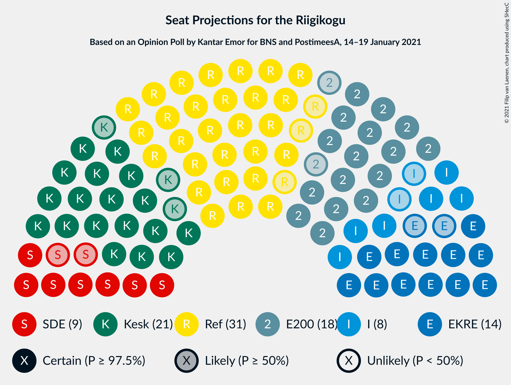
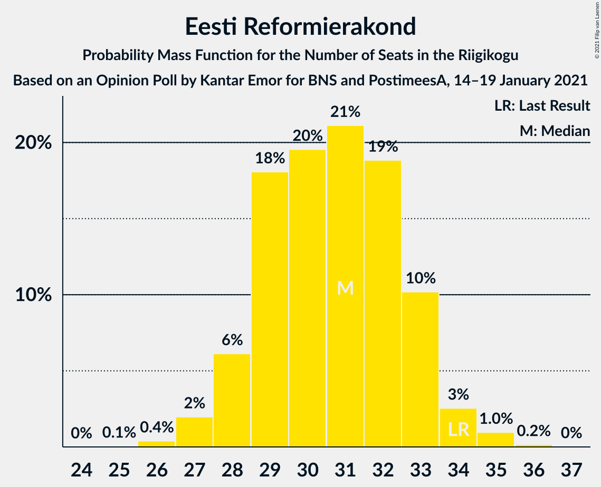
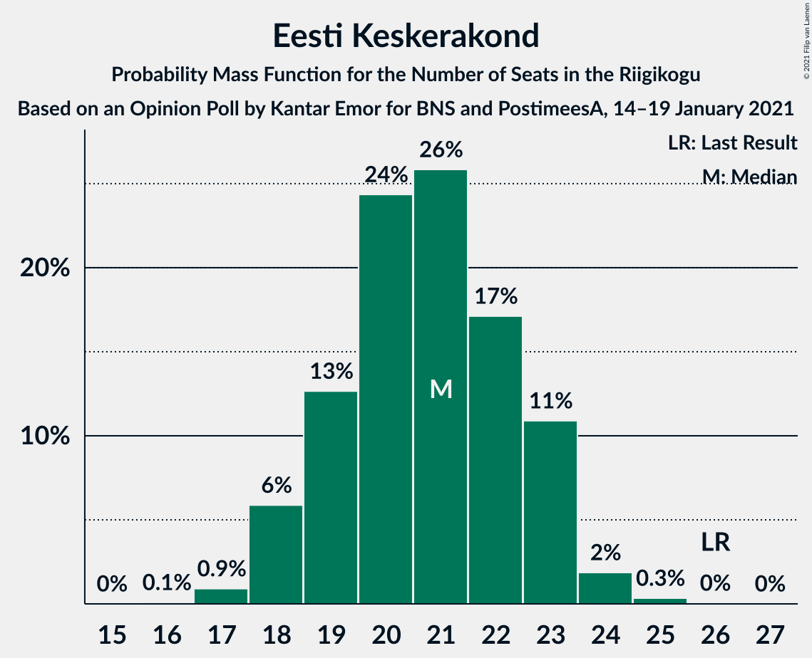
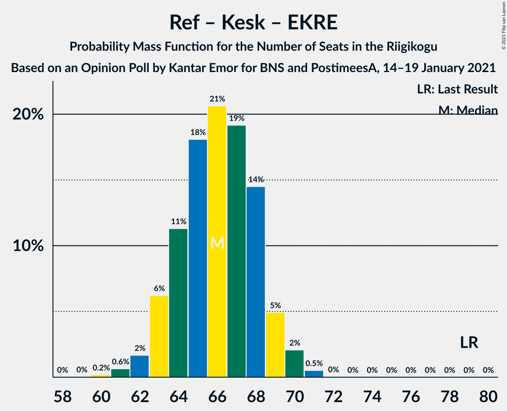
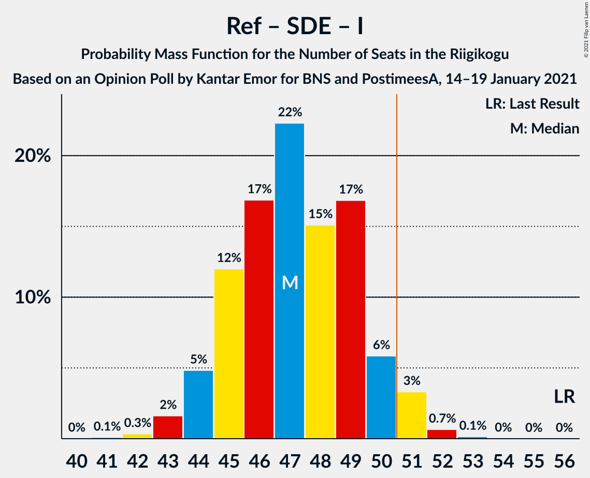
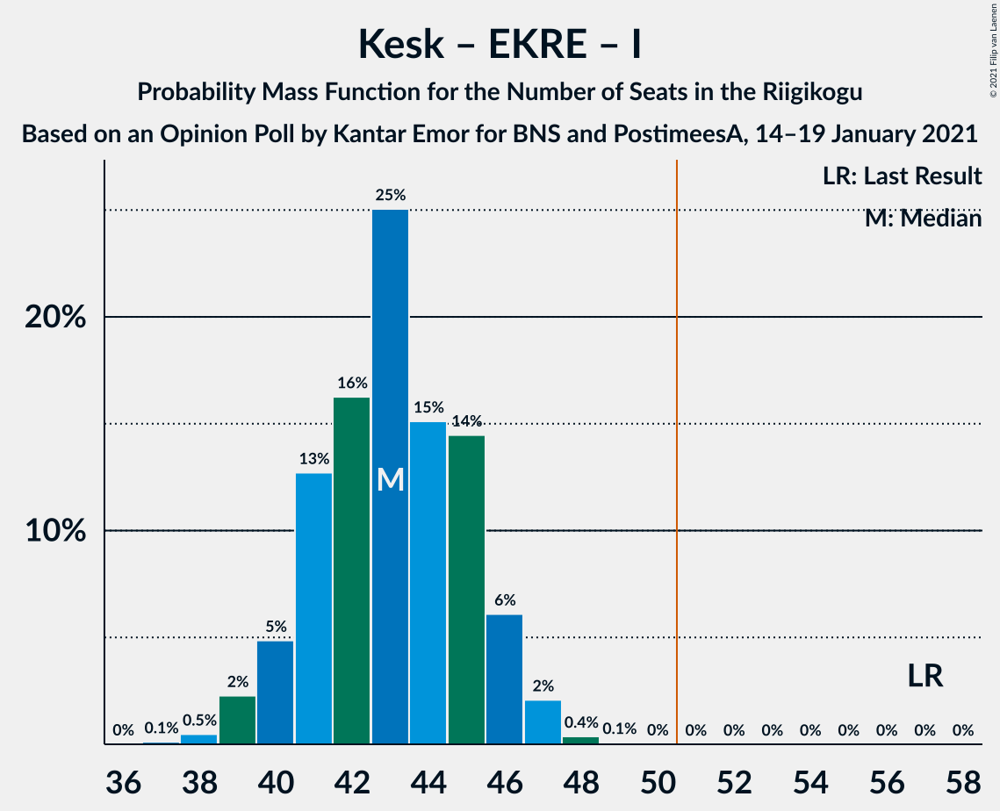

# Opinion Poll by Kantar Emor for BNS and PostimeesA, 14–19 January 2021

<a href="#voting-intentions">Voting Intentions</a> | <a href="#seats">Seats</a> | <a href="#coalitions">Coalitions</a> | <a href="#technical-information">Technical Information</a>

## Voting Intentions

### Confidence Intervals

| Party | Last Result | Poll Result | 80% Confidence Interval | 90% Confidence Interval | 95% Confidence Interval | 99% Confidence Interval |
|:-----:|:-----------:|:-----------:|:-----------------------:|:-----------------------:|:-----------------------:|:-----------------------:|
| Eesti Reformierakond | 28.9% | 27.0% | 25.4–28.7% |25.0–29.1% |24.6–29.6% |23.8–30.4% |
| Eesti Keskerakond | 23.1% | 19.0% | 17.6–20.5% |17.3–21.0% |16.9–21.3% |16.3–22.1% |
| Eesti 200 | 4.4% | 17.0% | 15.7–18.4% |15.3–18.8% |15.0–19.2% |14.4–19.9% |
| Eesti Konservatiivne Rahvaerakond | 17.8% | 14.0% | 12.8–15.4% |12.5–15.8% |12.2–16.1% |11.6–16.8% |
| Sotsiaaldemokraatlik Erakond | 9.8% | 9.0% | 8.0–10.2% |7.8–10.5% |7.5–10.8% |7.1–11.3% |
| Erakond Isamaa | 11.4% | 8.0% | 7.1–9.1% |6.9–9.4% |6.6–9.7% |6.2–10.3% |
| Erakond Eestimaa Rohelised | 1.8% | 4.0% | 3.4–4.8% |3.2–5.1% |3.0–5.3% |2.8–5.7% |
| Eesti Vabaerakond | 1.2% | 1.0% | 0.7–1.5% |0.6–1.6% |0.6–1.7% |0.5–2.0% |

*Note:* The poll result column reflects the actual value used in the calculations. Published results may vary slightly, and in addition be rounded to fewer digits.

## Seats

### Confidence Intervals

| Party | Last Result | Median | 80% Confidence Interval | 90% Confidence Interval | 95% Confidence Interval | 99% Confidence Interval |
|:-----:|:-----------:|:------:|:-----------------------:|:-----------------------:|:-----------------------:|:-----------------------:|
| <a href="#eesti-reformierakond">Eesti Reformierakond</a> | 34 | 31 | 28–33 |28–34 |27–34 |27–35 |
| <a href="#eesti-keskerakond">Eesti Keskerakond</a> | 26 | 21 | 19–23 |18–23 |18–23 |17–24 |
| <a href="#eesti-200">Eesti 200</a> | 0 | 18 | 16–20 |16–21 |16–21 |15–22 |
| <a href="#eesti-konservatiivne-rahvaerakond">Eesti Konservatiivne Rahvaerakond</a> | 19 | 14 | 13–16 |13–17 |12–17 |12–18 |
| <a href="#sotsiaaldemokraatlik-erakond">Sotsiaaldemokraatlik Erakond</a> | 10 | 9 | 7–10 |7–11 |7–11 |6–11 |
| <a href="#erakond-isamaa">Erakond Isamaa</a> | 12 | 8 | 6–9 |6–9 |6–10 |6–10 |
| <a href="#erakond-eestimaa-rohelised">Erakond Eestimaa Rohelised</a> | 0 | 0 | 0 |0–4 |0–5 |0–5 |
| <a href="#eesti-vabaerakond">Eesti Vabaerakond</a> | 0 | 0 | 0 |0 |0 |0 |

### Eesti Reformierakond

*For a full overview of the results for this party, see the [Eesti Reformierakond](party-eestireformierakond.html) page.*

| Number of Seats | Probability | Accumulated | Special Marks |
|:---------------:|:-----------:|:-----------:|:-------------:|
| 25 | 0.1% | 100% |  |
| 26 | 0.2% | 99.9% |  |
| 27 | 4% | 99.7% |  |
| 28 | 11% | 96% |  |
| 29 | 14% | 85% |  |
| 30 | 13% | 71% |  |
| 31 | 19% | 57% | Median |
| 32 | 19% | 38% |  |
| 33 | 14% | 19% |  |
| 34 | 4% | 5% | Last Result |
| 35 | 1.1% | 1.2% |  |
| 36 | 0.1% | 0.1% |  |
| 37 | 0% | 0% |  |

### Eesti Keskerakond

*For a full overview of the results for this party, see the [Eesti Keskerakond](party-eestikeskerakond.html) page.*

| Number of Seats | Probability | Accumulated | Special Marks |
|:---------------:|:-----------:|:-----------:|:-------------:|
| 16 | 0.1% | 100% |  |
| 17 | 2% | 99.9% |  |
| 18 | 6% | 98% |  |
| 19 | 10% | 92% |  |
| 20 | 22% | 83% |  |
| 21 | 23% | 61% | Median |
| 22 | 17% | 38% |  |
| 23 | 20% | 22% |  |
| 24 | 1.4% | 2% |  |
| 25 | 0.4% | 0.4% |  |
| 26 | 0.1% | 0.1% | Last Result |
| 27 | 0% | 0% |  |

### Eesti 200

*For a full overview of the results for this party, see the [Eesti 200](party-eesti200.html) page.*

| Number of Seats | Probability | Accumulated | Special Marks |
|:---------------:|:-----------:|:-----------:|:-------------:|
| 0 | 0% | 100% | Last Result |
| 1 | 0% | 100% |  |
| 2 | 0% | 100% |  |
| 3 | 0% | 100% |  |
| 4 | 0% | 100% |  |
| 5 | 0% | 100% |  |
| 6 | 0% | 100% |  |
| 7 | 0% | 100% |  |
| 8 | 0% | 100% |  |
| 9 | 0% | 100% |  |
| 10 | 0% | 100% |  |
| 11 | 0% | 100% |  |
| 12 | 0% | 100% |  |
| 13 | 0% | 100% |  |
| 14 | 0.2% | 100% |  |
| 15 | 2% | 99.8% |  |
| 16 | 19% | 98% |  |
| 17 | 18% | 79% |  |
| 18 | 26% | 61% | Median |
| 19 | 24% | 35% |  |
| 20 | 5% | 11% |  |
| 21 | 6% | 7% |  |
| 22 | 0.9% | 1.0% |  |
| 23 | 0% | 0% |  |

### Eesti Konservatiivne Rahvaerakond

*For a full overview of the results for this party, see the [Eesti Konservatiivne Rahvaerakond](party-eestikonservatiivnerahvaerakond.html) page.*

| Number of Seats | Probability | Accumulated | Special Marks |
|:---------------:|:-----------:|:-----------:|:-------------:|
| 11 | 0.4% | 100% |  |
| 12 | 2% | 99.6% |  |
| 13 | 15% | 97% |  |
| 14 | 43% | 82% | Median |
| 15 | 14% | 39% |  |
| 16 | 16% | 25% |  |
| 17 | 8% | 9% |  |
| 18 | 1.0% | 1.1% |  |
| 19 | 0.1% | 0.1% | Last Result |
| 20 | 0% | 0% |  |

### Sotsiaaldemokraatlik Erakond

*For a full overview of the results for this party, see the [Sotsiaaldemokraatlik Erakond](party-sotsiaaldemokraatlikerakond.html) page.*

| Number of Seats | Probability | Accumulated | Special Marks |
|:---------------:|:-----------:|:-----------:|:-------------:|
| 6 | 0.9% | 100% |  |
| 7 | 10% | 99.1% |  |
| 8 | 30% | 89% |  |
| 9 | 29% | 59% | Median |
| 10 | 21% | 29% | Last Result |
| 11 | 7% | 8% |  |
| 12 | 0.3% | 0.4% |  |
| 13 | 0% | 0% |  |

### Erakond Isamaa

*For a full overview of the results for this party, see the [Erakond Isamaa](party-erakondisamaa.html) page.*

| Number of Seats | Probability | Accumulated | Special Marks |
|:---------------:|:-----------:|:-----------:|:-------------:|
| 5 | 0.3% | 100% |  |
| 6 | 13% | 99.7% |  |
| 7 | 28% | 87% |  |
| 8 | 40% | 59% | Median |
| 9 | 15% | 20% |  |
| 10 | 5% | 5% |  |
| 11 | 0.1% | 0.1% |  |
| 12 | 0% | 0% | Last Result |

### Erakond Eestimaa Rohelised

*For a full overview of the results for this party, see the [Erakond Eestimaa Rohelised](party-erakondeestimaarohelised.html) page.*

| Number of Seats | Probability | Accumulated | Special Marks |
|:---------------:|:-----------:|:-----------:|:-------------:|
| 0 | 92% | 100% | Last Result, Median |
| 1 | 0% | 8% |  |
| 2 | 0% | 8% |  |
| 3 | 0% | 8% |  |
| 4 | 5% | 8% |  |
| 5 | 3% | 3% |  |
| 6 | 0.1% | 0.1% |  |
| 7 | 0% | 0% |  |

### Eesti Vabaerakond

*For a full overview of the results for this party, see the [Eesti Vabaerakond](party-eestivabaerakond.html) page.*

| Number of Seats | Probability | Accumulated | Special Marks |
|:---------------:|:-----------:|:-----------:|:-------------:|
| 0 | 100% | 100% | Last Result, Median |

## Coalitions

### Confidence Intervals

| Coalition | Last Result | Median | Majority? | 80% Confidence Interval | 90% Confidence Interval | 95% Confidence Interval | 99% Confidence Interval |
|:---------:|:-----------:|:------:|:---------:|:-----------------------:|:-----------------------:|:-----------------------:|:-----------------------:|
| Eesti Reformierakond – Eesti Keskerakond – Eesti Konservatiivne Rahvaerakond | 79 | 67 | 100% | 64–69 | 63–69 | 62–69 | 61–71 |
| Eesti Reformierakond – Eesti Konservatiivne Rahvaerakond – Erakond Isamaa | 65 | 53 | 77% | 50–56 | 50–56 | 49–57 | 48–57 |
| Eesti Reformierakond – Eesti Keskerakond | 60 | 52 | 72% | 49–54 | 48–55 | 48–55 | 47–56 |
| Eesti Reformierakond – Sotsiaaldemokraatlik Erakond – Erakond Isamaa – Eesti Vabaerakond | 56 | 47 | 5% | 45–49 | 44–50 | 44–51 | 42–53 |
| Eesti Reformierakond – Sotsiaaldemokraatlik Erakond – Erakond Isamaa | 56 | 47 | 5% | 45–49 | 44–50 | 44–51 | 42–53 |
| Eesti Reformierakond – Eesti Konservatiivne Rahvaerakond | 53 | 45 | 0.1% | 42–48 | 42–48 | 42–49 | 41–49 |
| Eesti Keskerakond – Eesti Konservatiivne Rahvaerakond – Erakond Isamaa | 57 | 43 | 0% | 41–45 | 40–46 | 39–46 | 38–48 |
| Eesti Reformierakond – Sotsiaaldemokraatlik Erakond | 44 | 40 | 0% | 37–42 | 37–42 | 36–43 | 35–44 |
| Eesti Reformierakond – Erakond Isamaa | 46 | 39 | 0% | 36–41 | 35–42 | 35–42 | 34–44 |
| Eesti Keskerakond – Sotsiaaldemokraatlik Erakond – Erakond Isamaa | 48 | 38 | 0% | 35–40 | 34–41 | 33–41 | 33–41 |
| Eesti Keskerakond – Eesti Konservatiivne Rahvaerakond | 45 | 36 | 0% | 33–37 | 33–38 | 32–38 | 31–40 |
| Eesti Keskerakond – Sotsiaaldemokraatlik Erakond | 36 | 30 | 0% | 27–33 | 27–33 | 26–33 | 26–34 |
| Eesti Konservatiivne Rahvaerakond – Sotsiaaldemokraatlik Erakond | 29 | 23 | 0% | 22–25 | 21–26 | 21–27 | 20–27 |

### Eesti Reformierakond – Eesti Keskerakond – Eesti Konservatiivne Rahvaerakond

| Number of Seats | Probability | Accumulated | Special Marks |
|:---------------:|:-----------:|:-----------:|:-------------:|
| 60 | 0.3% | 100% |  |
| 61 | 0.7% | 99.7% |  |
| 62 | 2% | 99.0% |  |
| 63 | 6% | 97% |  |
| 64 | 10% | 90% |  |
| 65 | 20% | 80% |  |
| 66 | 10% | 60% | Median |
| 67 | 22% | 50% |  |
| 68 | 15% | 29% |  |
| 69 | 13% | 14% |  |
| 70 | 0.4% | 1.4% |  |
| 71 | 1.0% | 1.1% |  |
| 72 | 0% | 0% |  |
| 73 | 0% | 0% |  |
| 74 | 0% | 0% |  |
| 75 | 0% | 0% |  |
| 76 | 0% | 0% |  |
| 77 | 0% | 0% |  |
| 78 | 0% | 0% |  |
| 79 | 0% | 0% | Last Result |

### Eesti Reformierakond – Eesti Konservatiivne Rahvaerakond – Erakond Isamaa

| Number of Seats | Probability | Accumulated | Special Marks |
|:---------------:|:-----------:|:-----------:|:-------------:|
| 47 | 0.1% | 100% |  |
| 48 | 1.1% | 99.9% |  |
| 49 | 3% | 98.9% |  |
| 50 | 19% | 96% |  |
| 51 | 10% | 77% | Majority |
| 52 | 12% | 67% |  |
| 53 | 10% | 56% | Median |
| 54 | 11% | 46% |  |
| 55 | 18% | 35% |  |
| 56 | 12% | 16% |  |
| 57 | 4% | 4% |  |
| 58 | 0.2% | 0.2% |  |
| 59 | 0% | 0.1% |  |
| 60 | 0% | 0% |  |
| 61 | 0% | 0% |  |
| 62 | 0% | 0% |  |
| 63 | 0% | 0% |  |
| 64 | 0% | 0% |  |
| 65 | 0% | 0% | Last Result |

### Eesti Reformierakond – Eesti Keskerakond

| Number of Seats | Probability | Accumulated | Special Marks |
|:---------------:|:-----------:|:-----------:|:-------------:|
| 45 | 0.1% | 100% |  |
| 46 | 0.3% | 99.9% |  |
| 47 | 0.9% | 99.7% |  |
| 48 | 6% | 98.8% |  |
| 49 | 10% | 92% |  |
| 50 | 11% | 83% |  |
| 51 | 20% | 72% | Majority |
| 52 | 12% | 52% | Median |
| 53 | 19% | 40% |  |
| 54 | 12% | 21% |  |
| 55 | 8% | 9% |  |
| 56 | 0.7% | 0.9% |  |
| 57 | 0.1% | 0.2% |  |
| 58 | 0.1% | 0.1% |  |
| 59 | 0% | 0% |  |
| 60 | 0% | 0% | Last Result |

### Eesti Reformierakond – Sotsiaaldemokraatlik Erakond – Erakond Isamaa – Eesti Vabaerakond

| Number of Seats | Probability | Accumulated | Special Marks |
|:---------------:|:-----------:|:-----------:|:-------------:|
| 41 | 0.1% | 100% |  |
| 42 | 0.6% | 99.9% |  |
| 43 | 2% | 99.3% |  |
| 44 | 4% | 98% |  |
| 45 | 15% | 94% |  |
| 46 | 16% | 79% |  |
| 47 | 13% | 62% |  |
| 48 | 18% | 49% | Median |
| 49 | 23% | 31% |  |
| 50 | 3% | 8% |  |
| 51 | 4% | 5% | Majority |
| 52 | 0.5% | 1.0% |  |
| 53 | 0.5% | 0.5% |  |
| 54 | 0% | 0% |  |
| 55 | 0% | 0% |  |
| 56 | 0% | 0% | Last Result |

### Eesti Reformierakond – Sotsiaaldemokraatlik Erakond – Erakond Isamaa

| Number of Seats | Probability | Accumulated | Special Marks |
|:---------------:|:-----------:|:-----------:|:-------------:|
| 41 | 0.1% | 100% |  |
| 42 | 0.6% | 99.9% |  |
| 43 | 2% | 99.3% |  |
| 44 | 4% | 98% |  |
| 45 | 15% | 94% |  |
| 46 | 16% | 79% |  |
| 47 | 13% | 62% |  |
| 48 | 18% | 49% | Median |
| 49 | 23% | 31% |  |
| 50 | 3% | 8% |  |
| 51 | 4% | 5% | Majority |
| 52 | 0.5% | 1.0% |  |
| 53 | 0.5% | 0.5% |  |
| 54 | 0% | 0% |  |
| 55 | 0% | 0% |  |
| 56 | 0% | 0% | Last Result |

### Eesti Reformierakond – Eesti Konservatiivne Rahvaerakond

| Number of Seats | Probability | Accumulated | Special Marks |
|:---------------:|:-----------:|:-----------:|:-------------:|
| 40 | 0.2% | 100% |  |
| 41 | 1.4% | 99.8% |  |
| 42 | 11% | 98% |  |
| 43 | 11% | 88% |  |
| 44 | 22% | 76% |  |
| 45 | 5% | 55% | Median |
| 46 | 11% | 49% |  |
| 47 | 21% | 38% |  |
| 48 | 14% | 17% |  |
| 49 | 3% | 3% |  |
| 50 | 0.3% | 0.4% |  |
| 51 | 0.1% | 0.1% | Majority |
| 52 | 0% | 0% |  |
| 53 | 0% | 0% | Last Result |

### Eesti Keskerakond – Eesti Konservatiivne Rahvaerakond – Erakond Isamaa

| Number of Seats | Probability | Accumulated | Special Marks |
|:---------------:|:-----------:|:-----------:|:-------------:|
| 37 | 0.1% | 100% |  |
| 38 | 0.8% | 99.9% |  |
| 39 | 2% | 99.1% |  |
| 40 | 4% | 97% |  |
| 41 | 13% | 92% |  |
| 42 | 13% | 79% |  |
| 43 | 20% | 66% | Median |
| 44 | 17% | 47% |  |
| 45 | 21% | 29% |  |
| 46 | 6% | 8% |  |
| 47 | 2% | 2% |  |
| 48 | 0.4% | 0.6% |  |
| 49 | 0.2% | 0.2% |  |
| 50 | 0% | 0% |  |
| 51 | 0% | 0% | Majority |
| 52 | 0% | 0% |  |
| 53 | 0% | 0% |  |
| 54 | 0% | 0% |  |
| 55 | 0% | 0% |  |
| 56 | 0% | 0% |  |
| 57 | 0% | 0% | Last Result |

### Eesti Reformierakond – Sotsiaaldemokraatlik Erakond

| Number of Seats | Probability | Accumulated | Special Marks |
|:---------------:|:-----------:|:-----------:|:-------------:|
| 33 | 0.1% | 100% |  |
| 34 | 0.1% | 99.9% |  |
| 35 | 0.8% | 99.8% |  |
| 36 | 3% | 99.0% |  |
| 37 | 10% | 96% |  |
| 38 | 17% | 86% |  |
| 39 | 17% | 69% |  |
| 40 | 19% | 53% | Median |
| 41 | 20% | 34% |  |
| 42 | 10% | 13% |  |
| 43 | 2% | 4% |  |
| 44 | 1.1% | 2% | Last Result |
| 45 | 0.4% | 0.4% |  |
| 46 | 0% | 0% |  |

### Eesti Reformierakond – Erakond Isamaa

| Number of Seats | Probability | Accumulated | Special Marks |
|:---------------:|:-----------:|:-----------:|:-------------:|
| 33 | 0.1% | 100% |  |
| 34 | 2% | 99.9% |  |
| 35 | 3% | 98% |  |
| 36 | 23% | 95% |  |
| 37 | 8% | 72% |  |
| 38 | 11% | 64% |  |
| 39 | 21% | 53% | Median |
| 40 | 12% | 32% |  |
| 41 | 15% | 21% |  |
| 42 | 3% | 5% |  |
| 43 | 1.3% | 2% |  |
| 44 | 0.5% | 0.6% |  |
| 45 | 0% | 0% |  |
| 46 | 0% | 0% | Last Result |

### Eesti Keskerakond – Sotsiaaldemokraatlik Erakond – Erakond Isamaa

| Number of Seats | Probability | Accumulated | Special Marks |
|:---------------:|:-----------:|:-----------:|:-------------:|
| 31 | 0.1% | 100% |  |
| 32 | 0.4% | 99.9% |  |
| 33 | 2% | 99.6% |  |
| 34 | 3% | 97% |  |
| 35 | 12% | 94% |  |
| 36 | 14% | 82% |  |
| 37 | 17% | 68% |  |
| 38 | 18% | 51% | Median |
| 39 | 16% | 33% |  |
| 40 | 9% | 18% |  |
| 41 | 8% | 8% |  |
| 42 | 0.3% | 0.4% |  |
| 43 | 0% | 0% |  |
| 44 | 0% | 0% |  |
| 45 | 0% | 0% |  |
| 46 | 0% | 0% |  |
| 47 | 0% | 0% |  |
| 48 | 0% | 0% | Last Result |

### Eesti Keskerakond – Eesti Konservatiivne Rahvaerakond

| Number of Seats | Probability | Accumulated | Special Marks |
|:---------------:|:-----------:|:-----------:|:-------------:|
| 30 | 0.2% | 100% |  |
| 31 | 1.3% | 99.8% |  |
| 32 | 3% | 98% |  |
| 33 | 8% | 95% |  |
| 34 | 18% | 87% |  |
| 35 | 10% | 69% | Median |
| 36 | 27% | 59% |  |
| 37 | 24% | 32% |  |
| 38 | 6% | 8% |  |
| 39 | 1.4% | 2% |  |
| 40 | 0.6% | 0.7% |  |
| 41 | 0.2% | 0.2% |  |
| 42 | 0% | 0% |  |
| 43 | 0% | 0% |  |
| 44 | 0% | 0% |  |
| 45 | 0% | 0% | Last Result |

### Eesti Keskerakond – Sotsiaaldemokraatlik Erakond

| Number of Seats | Probability | Accumulated | Special Marks |
|:---------------:|:-----------:|:-----------:|:-------------:|
| 24 | 0% | 100% |  |
| 25 | 0.2% | 99.9% |  |
| 26 | 5% | 99.8% |  |
| 27 | 9% | 95% |  |
| 28 | 14% | 86% |  |
| 29 | 18% | 72% |  |
| 30 | 19% | 54% | Median |
| 31 | 10% | 35% |  |
| 32 | 14% | 26% |  |
| 33 | 11% | 12% |  |
| 34 | 0.7% | 0.7% |  |
| 35 | 0% | 0.1% |  |
| 36 | 0% | 0% | Last Result |

### Eesti Konservatiivne Rahvaerakond – Sotsiaaldemokraatlik Erakond

| Number of Seats | Probability | Accumulated | Special Marks |
|:---------------:|:-----------:|:-----------:|:-------------:|
| 19 | 0.3% | 100% |  |
| 20 | 2% | 99.7% |  |
| 21 | 7% | 98% |  |
| 22 | 20% | 91% |  |
| 23 | 28% | 71% | Median |
| 24 | 21% | 43% |  |
| 25 | 13% | 22% |  |
| 26 | 7% | 10% |  |
| 27 | 3% | 3% |  |
| 28 | 0.1% | 0.2% |  |
| 29 | 0% | 0% | Last Result |

## Technical Information

### Opinion Poll

+ **Polling firm:** Kantar Emor
+ **Commissioner(s):** BNS and PostimeesA
+ **Fieldwork period:** 14–19 January 2021

### Calculations

+ **Sample size:** 1219
+ **Simulations done:** 131,072
+ **Error estimate:** 2.97%

