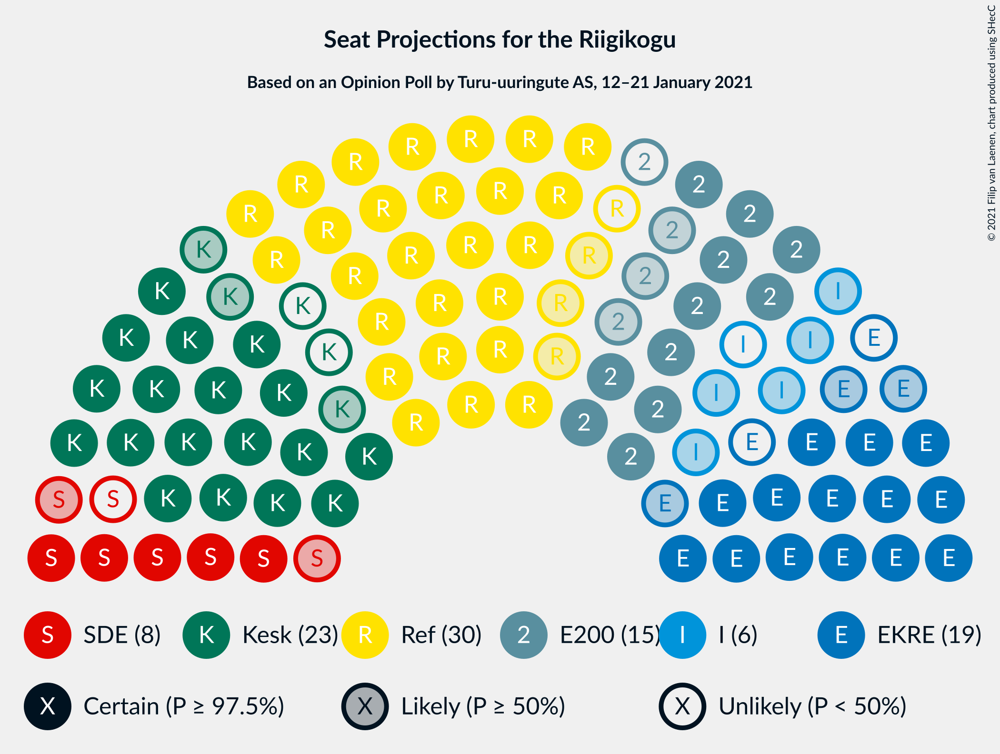
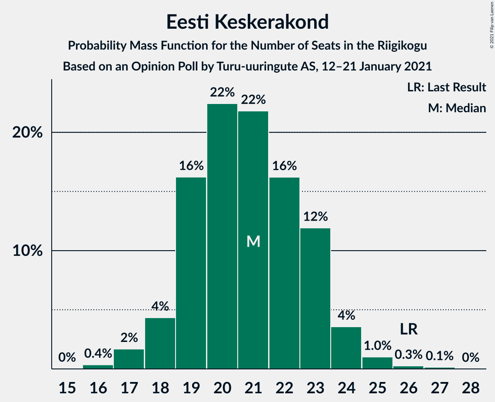
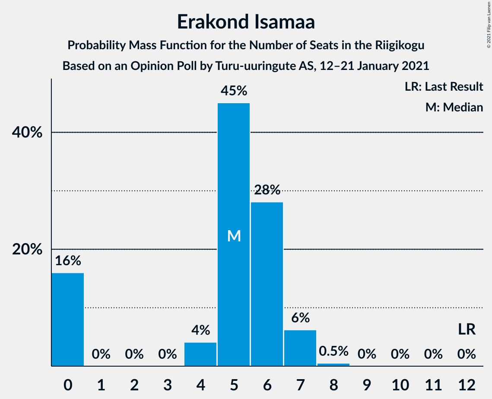

# Opinion Poll by Turu-uuringute AS, 12–21 January 2021

<a href="#voting-intentions">Voting Intentions</a> | <a href="#seats">Seats</a> | <a href="#coalitions">Coalitions</a> | <a href="#technical-information">Technical Information</a>

## Voting Intentions

### Confidence Intervals

| Party | Last Result | Poll Result | 80% Confidence Interval | 90% Confidence Interval | 95% Confidence Interval | 99% Confidence Interval |
|:-----:|:-----------:|:-----------:|:-----------------------:|:-----------------------:|:-----------------------:|:-----------------------:|
| Eesti Reformierakond | 28.9% | 25.2% | 23.5–27.0% |23.0–27.5% |22.6–28.0% |21.8–28.9% |
| Eesti Keskerakond | 23.1% | 18.7% | 17.1–20.3% |16.7–20.8% |16.4–21.2% |15.7–22.0% |
| Eesti Konservatiivne Rahvaerakond | 17.8% | 15.9% | 14.5–17.4% |14.1–17.9% |13.7–18.3% |13.1–19.0% |
| Eesti 200 | 4.4% | 13.1% | 11.8–14.6% |11.5–15.0% |11.1–15.3% |10.6–16.0% |
| Sotsiaaldemokraatlik Erakond | 9.8% | 7.4% | 6.5–8.6% |6.2–8.9% |6.0–9.2% |5.5–9.8% |
| Erakond Isamaa | 11.4% | 5.7% | 4.8–6.7% |4.6–7.0% |4.4–7.3% |4.0–7.8% |
| Eesti Vabaerakond | 1.2% | 4.7% | 3.9–5.6% |3.7–5.9% |3.5–6.2% |3.2–6.6% |
| Erakond Eestimaa Rohelised | 1.8% | 2.8% | 2.2–3.6% |2.1–3.8% |1.9–4.0% |1.7–4.4% |

*Note:* The poll result column reflects the actual value used in the calculations. Published results may vary slightly, and in addition be rounded to fewer digits.

## Seats

### Confidence Intervals

| Party | Last Result | Median | 80% Confidence Interval | 90% Confidence Interval | 95% Confidence Interval | 99% Confidence Interval |
|:-----:|:-----------:|:------:|:-----------------------:|:-----------------------:|:-----------------------:|:-----------------------:|
| <a href="#eesti-reformierakond">Eesti Reformierakond</a> | 34 | 29 | 27–32 |26–32 |25–33 |25–35 |
| <a href="#eesti-keskerakond">Eesti Keskerakond</a> | 26 | 21 | 19–23 |18–23 |17–24 |17–25 |
| <a href="#eesti-konservatiivne-rahvaerakond">Eesti Konservatiivne Rahvaerakond</a> | 19 | 17 | 16–19 |15–20 |14–20 |13–22 |
| <a href="#eesti-200">Eesti 200</a> | 0 | 14 | 12–16 |12–16 |12–17 |11–18 |
| <a href="#sotsiaaldemokraatlik-erakond">Sotsiaaldemokraatlik Erakond</a> | 10 | 7 | 6–9 |6–9 |6–9 |5–10 |
| <a href="#erakond-isamaa">Erakond Isamaa</a> | 12 | 5 | 0–6 |0–7 |0–7 |0–7 |
| <a href="#eesti-vabaerakond">Eesti Vabaerakond</a> | 0 | 0 | 0–5 |0–5 |0–6 |0–6 |
| <a href="#erakond-eestimaa-rohelised">Erakond Eestimaa Rohelised</a> | 0 | 0 | 0 |0 |0 |0 |

### Eesti Reformierakond

*For a full overview of the results for this party, see the [Eesti Reformierakond](party-eestireformierakond.html) page.*

| Number of Seats | Probability | Accumulated | Special Marks |
|:---------------:|:-----------:|:-----------:|:-------------:|
| 23 | 0.1% | 100% |  |
| 24 | 0.4% | 99.9% |  |
| 25 | 3% | 99.5% |  |
| 26 | 3% | 97% |  |
| 27 | 15% | 94% |  |
| 28 | 14% | 78% |  |
| 29 | 18% | 64% | Median |
| 30 | 19% | 46% |  |
| 31 | 13% | 27% |  |
| 32 | 11% | 14% |  |
| 33 | 1.1% | 3% |  |
| 34 | 0.7% | 2% | Last Result |
| 35 | 0.9% | 1.1% |  |
| 36 | 0.2% | 0.3% |  |
| 37 | 0% | 0% |  |

### Eesti Keskerakond

*For a full overview of the results for this party, see the [Eesti Keskerakond](party-eestikeskerakond.html) page.*

| Number of Seats | Probability | Accumulated | Special Marks |
|:---------------:|:-----------:|:-----------:|:-------------:|
| 16 | 0.2% | 100% |  |
| 17 | 3% | 99.7% |  |
| 18 | 4% | 97% |  |
| 19 | 13% | 93% |  |
| 20 | 26% | 80% |  |
| 21 | 21% | 54% | Median |
| 22 | 17% | 32% |  |
| 23 | 10% | 15% |  |
| 24 | 3% | 5% |  |
| 25 | 0.9% | 1.3% |  |
| 26 | 0.3% | 0.4% | Last Result |
| 27 | 0.1% | 0.1% |  |
| 28 | 0% | 0% |  |

### Eesti Konservatiivne Rahvaerakond

*For a full overview of the results for this party, see the [Eesti Konservatiivne Rahvaerakond](party-eestikonservatiivnerahvaerakond.html) page.*

| Number of Seats | Probability | Accumulated | Special Marks |
|:---------------:|:-----------:|:-----------:|:-------------:|
| 13 | 0.5% | 100% |  |
| 14 | 2% | 99.5% |  |
| 15 | 5% | 97% |  |
| 16 | 23% | 92% |  |
| 17 | 20% | 69% | Median |
| 18 | 26% | 49% |  |
| 19 | 15% | 23% | Last Result |
| 20 | 6% | 8% |  |
| 21 | 1.3% | 2% |  |
| 22 | 0.5% | 0.6% |  |
| 23 | 0% | 0.1% |  |
| 24 | 0% | 0% |  |

### Eesti 200

*For a full overview of the results for this party, see the [Eesti 200](party-eesti200.html) page.*

| Number of Seats | Probability | Accumulated | Special Marks |
|:---------------:|:-----------:|:-----------:|:-------------:|
| 0 | 0% | 100% | Last Result |
| 1 | 0% | 100% |  |
| 2 | 0% | 100% |  |
| 3 | 0% | 100% |  |
| 4 | 0% | 100% |  |
| 5 | 0% | 100% |  |
| 6 | 0% | 100% |  |
| 7 | 0% | 100% |  |
| 8 | 0% | 100% |  |
| 9 | 0% | 100% |  |
| 10 | 0.4% | 100% |  |
| 11 | 1.3% | 99.6% |  |
| 12 | 18% | 98% |  |
| 13 | 24% | 81% |  |
| 14 | 20% | 56% | Median |
| 15 | 25% | 36% |  |
| 16 | 8% | 12% |  |
| 17 | 3% | 4% |  |
| 18 | 0.6% | 0.7% |  |
| 19 | 0% | 0.1% |  |
| 20 | 0% | 0% |  |

### Sotsiaaldemokraatlik Erakond

*For a full overview of the results for this party, see the [Sotsiaaldemokraatlik Erakond](party-sotsiaaldemokraatlikerakond.html) page.*

| Number of Seats | Probability | Accumulated | Special Marks |
|:---------------:|:-----------:|:-----------:|:-------------:|
| 4 | 0.1% | 100% |  |
| 5 | 2% | 99.9% |  |
| 6 | 16% | 98% |  |
| 7 | 40% | 82% | Median |
| 8 | 26% | 41% |  |
| 9 | 14% | 15% |  |
| 10 | 1.3% | 1.4% | Last Result |
| 11 | 0.2% | 0.2% |  |
| 12 | 0% | 0% |  |

### Erakond Isamaa

*For a full overview of the results for this party, see the [Erakond Isamaa](party-erakondisamaa.html) page.*

| Number of Seats | Probability | Accumulated | Special Marks |
|:---------------:|:-----------:|:-----------:|:-------------:|
| 0 | 17% | 100% |  |
| 1 | 0% | 83% |  |
| 2 | 0% | 83% |  |
| 3 | 0% | 83% |  |
| 4 | 3% | 83% |  |
| 5 | 46% | 79% | Median |
| 6 | 27% | 34% |  |
| 7 | 6% | 7% |  |
| 8 | 0.4% | 0.5% |  |
| 9 | 0% | 0% |  |
| 10 | 0% | 0% |  |
| 11 | 0% | 0% |  |
| 12 | 0% | 0% | Last Result |

### Eesti Vabaerakond

*For a full overview of the results for this party, see the [Eesti Vabaerakond](party-eestivabaerakond.html) page.*

| Number of Seats | Probability | Accumulated | Special Marks |
|:---------------:|:-----------:|:-----------:|:-------------:|
| 0 | 69% | 100% | Last Result, Median |
| 1 | 0% | 31% |  |
| 2 | 0% | 31% |  |
| 3 | 0% | 31% |  |
| 4 | 3% | 31% |  |
| 5 | 25% | 28% |  |
| 6 | 3% | 3% |  |
| 7 | 0.1% | 0.1% |  |
| 8 | 0% | 0% |  |

### Erakond Eestimaa Rohelised

*For a full overview of the results for this party, see the [Erakond Eestimaa Rohelised](party-erakondeestimaarohelised.html) page.*

| Number of Seats | Probability | Accumulated | Special Marks |
|:---------------:|:-----------:|:-----------:|:-------------:|
| 0 | 100% | 100% | Last Result, Median |

## Coalitions

### Confidence Intervals

| Coalition | Last Result | Median | Majority? | 80% Confidence Interval | 90% Confidence Interval | 95% Confidence Interval | 99% Confidence Interval |
|:---------:|:-----------:|:------:|:---------:|:-----------------------:|:-----------------------:|:-----------------------:|:-----------------------:|
| Eesti Reformierakond – Eesti Keskerakond – Eesti Konservatiivne Rahvaerakond | 79 | 67 | 100% | 64–70 | 63–72 | 62–73 | 61–74 |
| Eesti Reformierakond – Eesti Keskerakond | 60 | 50 | 37% | 47–53 | 46–54 | 46–55 | 45–57 |
| Eesti Reformierakond – Eesti Konservatiivne Rahvaerakond – Erakond Isamaa | 65 | 51 | 58% | 48–55 | 47–55 | 46–55 | 44–57 |
| Eesti Reformierakond – Eesti Konservatiivne Rahvaerakond | 53 | 46 | 4% | 44–50 | 43–50 | 42–51 | 41–54 |
| Eesti Reformierakond – Sotsiaaldemokraatlik Erakond – Erakond Isamaa – Eesti Vabaerakond | 56 | 43 | 0% | 39–46 | 39–47 | 38–48 | 36–49 |
| Eesti Keskerakond – Eesti Konservatiivne Rahvaerakond – Erakond Isamaa | 57 | 43 | 0% | 39–46 | 38–47 | 38–47 | 36–48 |
| Eesti Reformierakond – Sotsiaaldemokraatlik Erakond – Erakond Isamaa | 56 | 41 | 0% | 38–44 | 37–45 | 36–46 | 35–47 |
| Eesti Keskerakond – Eesti Konservatiivne Rahvaerakond | 45 | 38 | 0% | 36–41 | 35–42 | 33–42 | 33–44 |
| Eesti Reformierakond – Sotsiaaldemokraatlik Erakond | 44 | 37 | 0% | 34–39 | 33–40 | 32–41 | 31–43 |
| Eesti Reformierakond – Erakond Isamaa | 46 | 34 | 0% | 31–37 | 29–37 | 29–38 | 27–39 |
| Eesti Keskerakond – Sotsiaaldemokraatlik Erakond – Erakond Isamaa | 48 | 33 | 0% | 29–35 | 28–36 | 27–37 | 25–38 |
| Eesti Keskerakond – Sotsiaaldemokraatlik Erakond | 36 | 28 | 0% | 26–30 | 25–31 | 24–32 | 24–34 |
| Eesti Konservatiivne Rahvaerakond – Sotsiaaldemokraatlik Erakond | 29 | 25 | 0% | 23–27 | 22–28 | 21–28 | 20–30 |

### Eesti Reformierakond – Eesti Keskerakond – Eesti Konservatiivne Rahvaerakond

| Number of Seats | Probability | Accumulated | Special Marks |
|:---------------:|:-----------:|:-----------:|:-------------:|
| 59 | 0.1% | 100% |  |
| 60 | 0.1% | 99.9% |  |
| 61 | 0.7% | 99.9% |  |
| 62 | 2% | 99.1% |  |
| 63 | 4% | 97% |  |
| 64 | 4% | 93% |  |
| 65 | 9% | 89% |  |
| 66 | 23% | 80% |  |
| 67 | 9% | 57% | Median |
| 68 | 10% | 49% |  |
| 69 | 18% | 39% |  |
| 70 | 13% | 21% |  |
| 71 | 3% | 8% |  |
| 72 | 2% | 5% |  |
| 73 | 2% | 3% |  |
| 74 | 0.8% | 1.2% |  |
| 75 | 0.4% | 0.4% |  |
| 76 | 0% | 0.1% |  |
| 77 | 0% | 0% |  |
| 78 | 0% | 0% |  |
| 79 | 0% | 0% | Last Result |

### Eesti Reformierakond – Eesti Keskerakond

| Number of Seats | Probability | Accumulated | Special Marks |
|:---------------:|:-----------:|:-----------:|:-------------:|
| 43 | 0.1% | 100% |  |
| 44 | 0.3% | 99.9% |  |
| 45 | 2% | 99.6% |  |
| 46 | 4% | 98% |  |
| 47 | 8% | 94% |  |
| 48 | 12% | 86% |  |
| 49 | 11% | 73% |  |
| 50 | 26% | 63% | Median |
| 51 | 7% | 37% | Majority |
| 52 | 19% | 30% |  |
| 53 | 6% | 11% |  |
| 54 | 3% | 6% |  |
| 55 | 2% | 3% |  |
| 56 | 0.4% | 1.0% |  |
| 57 | 0.4% | 0.5% |  |
| 58 | 0.1% | 0.1% |  |
| 59 | 0% | 0% |  |
| 60 | 0% | 0% | Last Result |

### Eesti Reformierakond – Eesti Konservatiivne Rahvaerakond – Erakond Isamaa

| Number of Seats | Probability | Accumulated | Special Marks |
|:---------------:|:-----------:|:-----------:|:-------------:|
| 42 | 0.1% | 100% |  |
| 43 | 0.2% | 99.9% |  |
| 44 | 0.4% | 99.7% |  |
| 45 | 0.6% | 99.3% |  |
| 46 | 2% | 98.7% |  |
| 47 | 5% | 97% |  |
| 48 | 4% | 92% |  |
| 49 | 18% | 88% |  |
| 50 | 12% | 70% |  |
| 51 | 12% | 58% | Median, Majority |
| 52 | 16% | 47% |  |
| 53 | 12% | 30% |  |
| 54 | 3% | 19% |  |
| 55 | 13% | 15% |  |
| 56 | 2% | 2% |  |
| 57 | 0.3% | 0.6% |  |
| 58 | 0.2% | 0.3% |  |
| 59 | 0.1% | 0.1% |  |
| 60 | 0% | 0% |  |
| 61 | 0% | 0% |  |
| 62 | 0% | 0% |  |
| 63 | 0% | 0% |  |
| 64 | 0% | 0% |  |
| 65 | 0% | 0% | Last Result |

### Eesti Reformierakond – Eesti Konservatiivne Rahvaerakond

| Number of Seats | Probability | Accumulated | Special Marks |
|:---------------:|:-----------:|:-----------:|:-------------:|
| 39 | 0% | 100% |  |
| 40 | 0.1% | 99.9% |  |
| 41 | 1.0% | 99.8% |  |
| 42 | 3% | 98.8% |  |
| 43 | 5% | 96% |  |
| 44 | 7% | 91% |  |
| 45 | 15% | 83% |  |
| 46 | 19% | 69% | Median |
| 47 | 18% | 49% |  |
| 48 | 5% | 31% |  |
| 49 | 13% | 26% |  |
| 50 | 9% | 13% |  |
| 51 | 2% | 4% | Majority |
| 52 | 0.5% | 2% |  |
| 53 | 0.5% | 1.2% | Last Result |
| 54 | 0.2% | 0.7% |  |
| 55 | 0.5% | 0.5% |  |
| 56 | 0% | 0% |  |

### Eesti Reformierakond – Sotsiaaldemokraatlik Erakond – Erakond Isamaa – Eesti Vabaerakond

| Number of Seats | Probability | Accumulated | Special Marks |
|:---------------:|:-----------:|:-----------:|:-------------:|
| 35 | 0.4% | 100% |  |
| 36 | 0.8% | 99.5% |  |
| 37 | 0.9% | 98.7% |  |
| 38 | 2% | 98% |  |
| 39 | 6% | 95% |  |
| 40 | 8% | 89% |  |
| 41 | 13% | 81% | Median |
| 42 | 6% | 68% |  |
| 43 | 29% | 62% |  |
| 44 | 12% | 33% |  |
| 45 | 7% | 20% |  |
| 46 | 5% | 13% |  |
| 47 | 6% | 9% |  |
| 48 | 2% | 3% |  |
| 49 | 0.7% | 1.1% |  |
| 50 | 0.3% | 0.3% |  |
| 51 | 0% | 0% | Majority |
| 52 | 0% | 0% |  |
| 53 | 0% | 0% |  |
| 54 | 0% | 0% |  |
| 55 | 0% | 0% |  |
| 56 | 0% | 0% | Last Result |

### Eesti Keskerakond – Eesti Konservatiivne Rahvaerakond – Erakond Isamaa

| Number of Seats | Probability | Accumulated | Special Marks |
|:---------------:|:-----------:|:-----------:|:-------------:|
| 35 | 0.3% | 100% |  |
| 36 | 1.0% | 99.7% |  |
| 37 | 1.0% | 98.7% |  |
| 38 | 4% | 98% |  |
| 39 | 8% | 94% |  |
| 40 | 6% | 86% |  |
| 41 | 10% | 80% |  |
| 42 | 12% | 70% |  |
| 43 | 21% | 58% | Median |
| 44 | 14% | 37% |  |
| 45 | 11% | 23% |  |
| 46 | 2% | 12% |  |
| 47 | 8% | 9% |  |
| 48 | 1.2% | 2% |  |
| 49 | 0.2% | 0.4% |  |
| 50 | 0.2% | 0.2% |  |
| 51 | 0% | 0% | Majority |
| 52 | 0% | 0% |  |
| 53 | 0% | 0% |  |
| 54 | 0% | 0% |  |
| 55 | 0% | 0% |  |
| 56 | 0% | 0% |  |
| 57 | 0% | 0% | Last Result |

### Eesti Reformierakond – Sotsiaaldemokraatlik Erakond – Erakond Isamaa

| Number of Seats | Probability | Accumulated | Special Marks |
|:---------------:|:-----------:|:-----------:|:-------------:|
| 33 | 0.1% | 100% |  |
| 34 | 0.2% | 99.8% |  |
| 35 | 0.8% | 99.7% |  |
| 36 | 4% | 98.9% |  |
| 37 | 3% | 95% |  |
| 38 | 10% | 92% |  |
| 39 | 8% | 82% |  |
| 40 | 12% | 73% |  |
| 41 | 13% | 61% | Median |
| 42 | 10% | 49% |  |
| 43 | 22% | 39% |  |
| 44 | 10% | 16% |  |
| 45 | 3% | 6% |  |
| 46 | 3% | 3% |  |
| 47 | 0.4% | 0.5% |  |
| 48 | 0.2% | 0.2% |  |
| 49 | 0% | 0% |  |
| 50 | 0% | 0% |  |
| 51 | 0% | 0% | Majority |
| 52 | 0% | 0% |  |
| 53 | 0% | 0% |  |
| 54 | 0% | 0% |  |
| 55 | 0% | 0% |  |
| 56 | 0% | 0% | Last Result |

### Eesti Keskerakond – Eesti Konservatiivne Rahvaerakond

| Number of Seats | Probability | Accumulated | Special Marks |
|:---------------:|:-----------:|:-----------:|:-------------:|
| 31 | 0.1% | 100% |  |
| 32 | 0.2% | 99.9% |  |
| 33 | 3% | 99.7% |  |
| 34 | 2% | 97% |  |
| 35 | 3% | 95% |  |
| 36 | 8% | 92% |  |
| 37 | 21% | 84% |  |
| 38 | 22% | 63% | Median |
| 39 | 19% | 41% |  |
| 40 | 9% | 22% |  |
| 41 | 4% | 12% |  |
| 42 | 7% | 8% |  |
| 43 | 0.9% | 2% |  |
| 44 | 0.3% | 0.7% |  |
| 45 | 0.4% | 0.4% | Last Result |
| 46 | 0% | 0% |  |

### Eesti Reformierakond – Sotsiaaldemokraatlik Erakond

| Number of Seats | Probability | Accumulated | Special Marks |
|:---------------:|:-----------:|:-----------:|:-------------:|
| 30 | 0.2% | 100% |  |
| 31 | 0.9% | 99.8% |  |
| 32 | 2% | 98.9% |  |
| 33 | 3% | 97% |  |
| 34 | 12% | 94% |  |
| 35 | 13% | 82% |  |
| 36 | 17% | 70% | Median |
| 37 | 16% | 53% |  |
| 38 | 20% | 37% |  |
| 39 | 10% | 17% |  |
| 40 | 5% | 7% |  |
| 41 | 0.7% | 3% |  |
| 42 | 0.8% | 2% |  |
| 43 | 0.5% | 1.0% |  |
| 44 | 0.5% | 0.5% | Last Result |
| 45 | 0% | 0% |  |

### Eesti Reformierakond – Erakond Isamaa

| Number of Seats | Probability | Accumulated | Special Marks |
|:---------------:|:-----------:|:-----------:|:-------------:|
| 25 | 0% | 100% |  |
| 26 | 0.1% | 99.9% |  |
| 27 | 0.4% | 99.8% |  |
| 28 | 2% | 99.4% |  |
| 29 | 3% | 98% |  |
| 30 | 3% | 95% |  |
| 31 | 9% | 91% |  |
| 32 | 16% | 82% |  |
| 33 | 10% | 66% |  |
| 34 | 14% | 56% | Median |
| 35 | 14% | 42% |  |
| 36 | 12% | 28% |  |
| 37 | 12% | 16% |  |
| 38 | 3% | 4% |  |
| 39 | 0.6% | 0.9% |  |
| 40 | 0.1% | 0.2% |  |
| 41 | 0.1% | 0.1% |  |
| 42 | 0% | 0% |  |
| 43 | 0% | 0% |  |
| 44 | 0% | 0% |  |
| 45 | 0% | 0% |  |
| 46 | 0% | 0% | Last Result |

### Eesti Keskerakond – Sotsiaaldemokraatlik Erakond – Erakond Isamaa

| Number of Seats | Probability | Accumulated | Special Marks |
|:---------------:|:-----------:|:-----------:|:-------------:|
| 24 | 0.1% | 100% |  |
| 25 | 0.7% | 99.9% |  |
| 26 | 0.3% | 99.2% |  |
| 27 | 2% | 99.0% |  |
| 28 | 7% | 97% |  |
| 29 | 6% | 91% |  |
| 30 | 7% | 85% |  |
| 31 | 5% | 78% |  |
| 32 | 18% | 73% |  |
| 33 | 12% | 55% | Median |
| 34 | 10% | 42% |  |
| 35 | 23% | 32% |  |
| 36 | 7% | 10% |  |
| 37 | 2% | 3% |  |
| 38 | 0.5% | 1.0% |  |
| 39 | 0.4% | 0.5% |  |
| 40 | 0.1% | 0.1% |  |
| 41 | 0% | 0% |  |
| 42 | 0% | 0% |  |
| 43 | 0% | 0% |  |
| 44 | 0% | 0% |  |
| 45 | 0% | 0% |  |
| 46 | 0% | 0% |  |
| 47 | 0% | 0% |  |
| 48 | 0% | 0% | Last Result |

### Eesti Keskerakond – Sotsiaaldemokraatlik Erakond

| Number of Seats | Probability | Accumulated | Special Marks |
|:---------------:|:-----------:|:-----------:|:-------------:|
| 22 | 0.1% | 100% |  |
| 23 | 0.3% | 99.9% |  |
| 24 | 3% | 99.6% |  |
| 25 | 4% | 96% |  |
| 26 | 10% | 93% |  |
| 27 | 22% | 83% |  |
| 28 | 20% | 61% | Median |
| 29 | 12% | 41% |  |
| 30 | 23% | 29% |  |
| 31 | 3% | 6% |  |
| 32 | 1.3% | 3% |  |
| 33 | 0.5% | 2% |  |
| 34 | 0.9% | 1.0% |  |
| 35 | 0.1% | 0.1% |  |
| 36 | 0% | 0% | Last Result |

### Eesti Konservatiivne Rahvaerakond – Sotsiaaldemokraatlik Erakond

| Number of Seats | Probability | Accumulated | Special Marks |
|:---------------:|:-----------:|:-----------:|:-------------:|
| 19 | 0.1% | 100% |  |
| 20 | 0.9% | 99.9% |  |
| 21 | 3% | 99.0% |  |
| 22 | 5% | 96% |  |
| 23 | 17% | 91% |  |
| 24 | 12% | 74% | Median |
| 25 | 32% | 62% |  |
| 26 | 13% | 30% |  |
| 27 | 12% | 17% |  |
| 28 | 3% | 5% |  |
| 29 | 2% | 2% | Last Result |
| 30 | 0.5% | 0.6% |  |
| 31 | 0% | 0.1% |  |
| 32 | 0% | 0.1% |  |
| 33 | 0% | 0% |  |

## Technical Information

### Opinion Poll

+ **Polling firm:** Turu-uuringute AS
+ **Commissioner(s):** —
+ **Fieldwork period:** 12–21 January 2021

### Calculations

+ **Sample size:** 1008
+ **Simulations done:** 131,072
+ **Error estimate:** 1.69%

