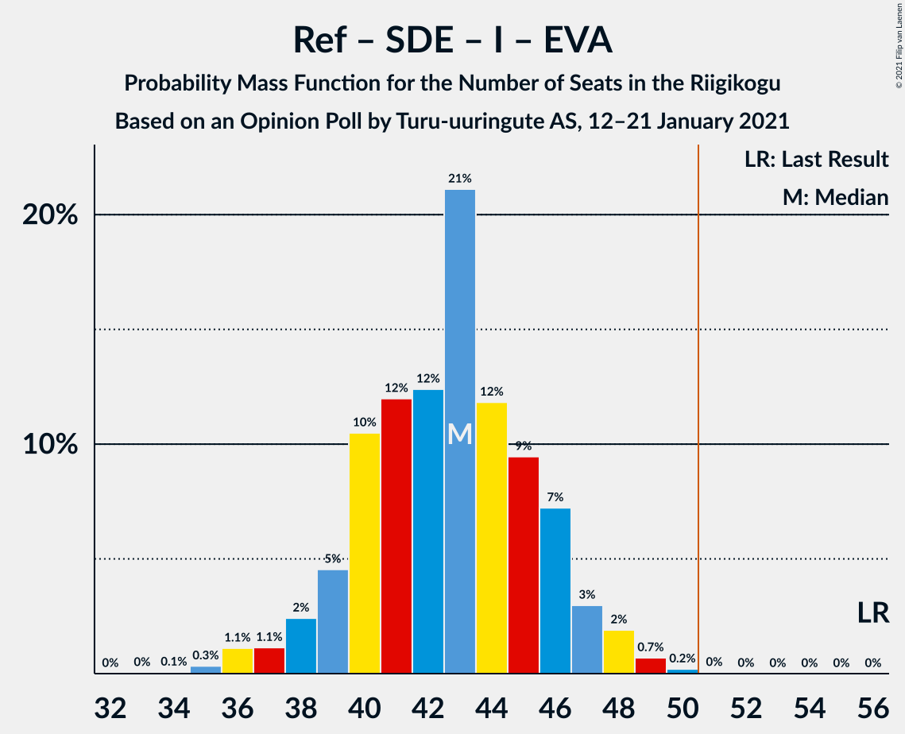

# Opinion Poll by Turu-uuringute AS, 12–21 January 2021

<a href="#voting-intentions">Voting Intentions</a> | <a href="#seats">Seats</a> | <a href="#coalitions">Coalitions</a> | <a href="#technical-information">Technical Information</a>

## Voting Intentions

### Confidence Intervals

| Party | Last Result | Poll Result | 80% Confidence Interval | 90% Confidence Interval | 95% Confidence Interval | 99% Confidence Interval |
|:-----:|:-----------:|:-----------:|:-----------------------:|:-----------------------:|:-----------------------:|:-----------------------:|
| Eesti Reformierakond | 28.9% | 25.2% | 23.5–27.0% |23.0–27.5% |22.6–28.0% |21.8–28.9% |
| Eesti Keskerakond | 23.1% | 18.7% | 17.1–20.3% |16.7–20.8% |16.4–21.2% |15.7–22.0% |
| Eesti Konservatiivne Rahvaerakond | 17.8% | 15.9% | 14.5–17.4% |14.1–17.9% |13.7–18.3% |13.1–19.0% |
| Eesti 200 | 4.4% | 13.1% | 11.8–14.6% |11.5–15.0% |11.1–15.3% |10.6–16.0% |
| Sotsiaaldemokraatlik Erakond | 9.8% | 7.4% | 6.5–8.6% |6.2–8.9% |6.0–9.2% |5.5–9.8% |
| Erakond Isamaa | 11.4% | 5.7% | 4.8–6.7% |4.6–7.0% |4.4–7.3% |4.0–7.8% |
| Eesti Vabaerakond | 1.2% | 4.7% | 3.9–5.6% |3.7–5.9% |3.5–6.2% |3.2–6.6% |
| Erakond Eestimaa Rohelised | 1.8% | 2.8% | 2.2–3.6% |2.1–3.8% |1.9–4.0% |1.7–4.4% |

*Note:* The poll result column reflects the actual value used in the calculations. Published results may vary slightly, and in addition be rounded to fewer digits.

## Seats

### Confidence Intervals

| Party | Last Result | Median | 80% Confidence Interval | 90% Confidence Interval | 95% Confidence Interval | 99% Confidence Interval |
|:-----:|:-----------:|:------:|:-----------------------:|:-----------------------:|:-----------------------:|:-----------------------:|
| <a href="#eesti-reformierakond">Eesti Reformierakond</a> | 34 | 29 | 27–32 |26–33 |26–33 |25–35 |
| <a href="#eesti-keskerakond">Eesti Keskerakond</a> | 26 | 21 | 19–23 |18–24 |18–24 |17–25 |
| <a href="#eesti-konservatiivne-rahvaerakond">Eesti Konservatiivne Rahvaerakond</a> | 19 | 17 | 15–19 |15–20 |14–20 |14–22 |
| <a href="#eesti-200">Eesti 200</a> | 0 | 14 | 12–16 |12–16 |11–17 |11–18 |
| <a href="#sotsiaaldemokraatlik-erakond">Sotsiaaldemokraatlik Erakond</a> | 10 | 7 | 6–9 |6–9 |5–9 |5–10 |
| <a href="#erakond-isamaa">Erakond Isamaa</a> | 12 | 5 | 0–6 |0–7 |0–7 |0–8 |
| <a href="#eesti-vabaerakond">Eesti Vabaerakond</a> | 0 | 0 | 0–5 |0–5 |0–6 |0–6 |
| <a href="#erakond-eestimaa-rohelised">Erakond Eestimaa Rohelised</a> | 0 | 0 | 0 |0 |0 |0 |

### Eesti Reformierakond

*For a full overview of the results for this party, see the [Eesti Reformierakond](party-eestireformierakond.html) page.*

| Number of Seats | Probability | Accumulated | Special Marks |
|:---------------:|:-----------:|:-----------:|:-------------:|
| 23 | 0.1% | 100% |  |
| 24 | 0.4% | 99.9% |  |
| 25 | 2% | 99.5% |  |
| 26 | 5% | 98% |  |
| 27 | 12% | 93% |  |
| 28 | 16% | 80% |  |
| 29 | 20% | 65% | Median |
| 30 | 22% | 45% |  |
| 31 | 9% | 22% |  |
| 32 | 8% | 13% |  |
| 33 | 4% | 5% |  |
| 34 | 0.9% | 1.5% | Last Result |
| 35 | 0.3% | 0.6% |  |
| 36 | 0.2% | 0.2% |  |
| 37 | 0% | 0% |  |

### Eesti Keskerakond

*For a full overview of the results for this party, see the [Eesti Keskerakond](party-eestikeskerakond.html) page.*

| Number of Seats | Probability | Accumulated | Special Marks |
|:---------------:|:-----------:|:-----------:|:-------------:|
| 16 | 0.4% | 100% |  |
| 17 | 2% | 99.6% |  |
| 18 | 4% | 98% |  |
| 19 | 16% | 94% |  |
| 20 | 22% | 77% |  |
| 21 | 22% | 55% | Median |
| 22 | 16% | 33% |  |
| 23 | 12% | 17% |  |
| 24 | 4% | 5% |  |
| 25 | 1.0% | 1.4% |  |
| 26 | 0.3% | 0.4% | Last Result |
| 27 | 0.1% | 0.2% |  |
| 28 | 0% | 0% |  |

### Eesti Konservatiivne Rahvaerakond

*For a full overview of the results for this party, see the [Eesti Konservatiivne Rahvaerakond](party-eestikonservatiivnerahvaerakond.html) page.*

| Number of Seats | Probability | Accumulated | Special Marks |
|:---------------:|:-----------:|:-----------:|:-------------:|
| 13 | 0.3% | 100% |  |
| 14 | 3% | 99.7% |  |
| 15 | 9% | 97% |  |
| 16 | 20% | 88% |  |
| 17 | 21% | 68% | Median |
| 18 | 25% | 47% |  |
| 19 | 14% | 22% | Last Result |
| 20 | 6% | 8% |  |
| 21 | 2% | 2% |  |
| 22 | 0.4% | 0.5% |  |
| 23 | 0.1% | 0.1% |  |
| 24 | 0% | 0% |  |

### Eesti 200

*For a full overview of the results for this party, see the [Eesti 200](party-eesti200.html) page.*

| Number of Seats | Probability | Accumulated | Special Marks |
|:---------------:|:-----------:|:-----------:|:-------------:|
| 0 | 0% | 100% | Last Result |
| 1 | 0% | 100% |  |
| 2 | 0% | 100% |  |
| 3 | 0% | 100% |  |
| 4 | 0% | 100% |  |
| 5 | 0% | 100% |  |
| 6 | 0% | 100% |  |
| 7 | 0% | 100% |  |
| 8 | 0% | 100% |  |
| 9 | 0% | 100% |  |
| 10 | 0.4% | 100% |  |
| 11 | 2% | 99.6% |  |
| 12 | 13% | 97% |  |
| 13 | 22% | 84% |  |
| 14 | 28% | 62% | Median |
| 15 | 21% | 34% |  |
| 16 | 9% | 13% |  |
| 17 | 3% | 4% |  |
| 18 | 0.6% | 0.7% |  |
| 19 | 0.1% | 0.1% |  |
| 20 | 0% | 0% |  |

### Sotsiaaldemokraatlik Erakond

*For a full overview of the results for this party, see the [Sotsiaaldemokraatlik Erakond](party-sotsiaaldemokraatlikerakond.html) page.*

| Number of Seats | Probability | Accumulated | Special Marks |
|:---------------:|:-----------:|:-----------:|:-------------:|
| 4 | 0% | 100% |  |
| 5 | 3% | 99.9% |  |
| 6 | 22% | 97% |  |
| 7 | 36% | 75% | Median |
| 8 | 27% | 39% |  |
| 9 | 10% | 12% |  |
| 10 | 2% | 2% | Last Result |
| 11 | 0.1% | 0.1% |  |
| 12 | 0% | 0% |  |

### Erakond Isamaa

*For a full overview of the results for this party, see the [Erakond Isamaa](party-erakondisamaa.html) page.*

| Number of Seats | Probability | Accumulated | Special Marks |
|:---------------:|:-----------:|:-----------:|:-------------:|
| 0 | 16% | 100% |  |
| 1 | 0% | 84% |  |
| 2 | 0% | 84% |  |
| 3 | 0% | 84% |  |
| 4 | 4% | 84% |  |
| 5 | 45% | 80% | Median |
| 6 | 28% | 35% |  |
| 7 | 6% | 7% |  |
| 8 | 0.5% | 0.5% |  |
| 9 | 0% | 0% |  |
| 10 | 0% | 0% |  |
| 11 | 0% | 0% |  |
| 12 | 0% | 0% | Last Result |

### Eesti Vabaerakond

*For a full overview of the results for this party, see the [Eesti Vabaerakond](party-eestivabaerakond.html) page.*

| Number of Seats | Probability | Accumulated | Special Marks |
|:---------------:|:-----------:|:-----------:|:-------------:|
| 0 | 68% | 100% | Last Result, Median |
| 1 | 0% | 32% |  |
| 2 | 0% | 32% |  |
| 3 | 0% | 32% |  |
| 4 | 6% | 32% |  |
| 5 | 23% | 26% |  |
| 6 | 3% | 3% |  |
| 7 | 0.1% | 0.1% |  |
| 8 | 0% | 0% |  |

### Erakond Eestimaa Rohelised

*For a full overview of the results for this party, see the [Erakond Eestimaa Rohelised](party-erakondeestimaarohelised.html) page.*

| Number of Seats | Probability | Accumulated | Special Marks |
|:---------------:|:-----------:|:-----------:|:-------------:|
| 0 | 100% | 100% | Last Result, Median |

## Coalitions

### Confidence Intervals

| Coalition | Last Result | Median | Majority? | 80% Confidence Interval | 90% Confidence Interval | 95% Confidence Interval | 99% Confidence Interval |
|:---------:|:-----------:|:------:|:---------:|:-----------------------:|:-----------------------:|:-----------------------:|:-----------------------:|
| Eesti Reformierakond – Eesti Keskerakond – Eesti Konservatiivne Rahvaerakond | 79 | 67 | 100% | 64–71 | 63–72 | 62–73 | 61–75 |
| Eesti Reformierakond – Eesti Konservatiivne Rahvaerakond – Erakond Isamaa | 65 | 51 | 62% | 48–54 | 47–55 | 46–56 | 44–57 |
| Eesti Reformierakond – Eesti Keskerakond | 60 | 50 | 40% | 47–53 | 46–55 | 46–55 | 44–57 |
| Eesti Reformierakond – Eesti Konservatiivne Rahvaerakond | 53 | 47 | 6% | 44–50 | 43–51 | 42–51 | 41–53 |
| Eesti Reformierakond – Sotsiaaldemokraatlik Erakond – Erakond Isamaa – Eesti Vabaerakond | 56 | 43 | 0.1% | 40–46 | 38–47 | 37–48 | 36–49 |
| Eesti Keskerakond – Eesti Konservatiivne Rahvaerakond – Erakond Isamaa | 57 | 43 | 0% | 39–46 | 38–46 | 37–47 | 36–49 |
| Eesti Reformierakond – Sotsiaaldemokraatlik Erakond – Erakond Isamaa | 56 | 41 | 0% | 38–44 | 37–45 | 36–45 | 34–47 |
| Eesti Keskerakond – Eesti Konservatiivne Rahvaerakond | 45 | 38 | 0% | 35–41 | 35–42 | 34–42 | 33–44 |
| Eesti Reformierakond – Sotsiaaldemokraatlik Erakond | 44 | 36 | 0% | 34–39 | 33–40 | 32–41 | 31–42 |
| Eesti Reformierakond – Erakond Isamaa | 46 | 34 | 0% | 31–37 | 30–37 | 28–38 | 27–39 |
| Eesti Keskerakond – Sotsiaaldemokraatlik Erakond – Erakond Isamaa | 48 | 33 | 0% | 30–35 | 28–36 | 27–37 | 26–38 |
| Eesti Keskerakond – Sotsiaaldemokraatlik Erakond | 36 | 28 | 0% | 26–30 | 25–31 | 25–32 | 23–33 |
| Eesti Konservatiivne Rahvaerakond – Sotsiaaldemokraatlik Erakond | 29 | 25 | 0% | 22–27 | 22–28 | 21–28 | 20–30 |

### Eesti Reformierakond – Eesti Keskerakond – Eesti Konservatiivne Rahvaerakond

| Number of Seats | Probability | Accumulated | Special Marks |
|:---------------:|:-----------:|:-----------:|:-------------:|
| 60 | 0.2% | 100% |  |
| 61 | 0.8% | 99.8% |  |
| 62 | 2% | 99.0% |  |
| 63 | 3% | 97% |  |
| 64 | 6% | 93% |  |
| 65 | 13% | 87% |  |
| 66 | 12% | 74% |  |
| 67 | 17% | 63% | Median |
| 68 | 15% | 46% |  |
| 69 | 10% | 31% |  |
| 70 | 9% | 20% |  |
| 71 | 4% | 11% |  |
| 72 | 3% | 7% |  |
| 73 | 2% | 4% |  |
| 74 | 2% | 2% |  |
| 75 | 0.4% | 0.6% |  |
| 76 | 0.2% | 0.2% |  |
| 77 | 0% | 0.1% |  |
| 78 | 0% | 0% |  |
| 79 | 0% | 0% | Last Result |

### Eesti Reformierakond – Eesti Konservatiivne Rahvaerakond – Erakond Isamaa

| Number of Seats | Probability | Accumulated | Special Marks |
|:---------------:|:-----------:|:-----------:|:-------------:|
| 43 | 0.2% | 100% |  |
| 44 | 0.4% | 99.8% |  |
| 45 | 1.1% | 99.4% |  |
| 46 | 2% | 98% |  |
| 47 | 4% | 96% |  |
| 48 | 9% | 93% |  |
| 49 | 10% | 84% |  |
| 50 | 12% | 74% |  |
| 51 | 16% | 62% | Median, Majority |
| 52 | 15% | 46% |  |
| 53 | 15% | 32% |  |
| 54 | 9% | 17% |  |
| 55 | 5% | 7% |  |
| 56 | 2% | 3% |  |
| 57 | 0.8% | 1.1% |  |
| 58 | 0.2% | 0.3% |  |
| 59 | 0.1% | 0.1% |  |
| 60 | 0% | 0% |  |
| 61 | 0% | 0% |  |
| 62 | 0% | 0% |  |
| 63 | 0% | 0% |  |
| 64 | 0% | 0% |  |
| 65 | 0% | 0% | Last Result |

### Eesti Reformierakond – Eesti Keskerakond

| Number of Seats | Probability | Accumulated | Special Marks |
|:---------------:|:-----------:|:-----------:|:-------------:|
| 43 | 0.2% | 100% |  |
| 44 | 0.5% | 99.8% |  |
| 45 | 2% | 99.3% |  |
| 46 | 5% | 98% |  |
| 47 | 6% | 93% |  |
| 48 | 12% | 87% |  |
| 49 | 18% | 74% |  |
| 50 | 16% | 57% | Median |
| 51 | 15% | 40% | Majority |
| 52 | 13% | 26% |  |
| 53 | 4% | 13% |  |
| 54 | 4% | 9% |  |
| 55 | 4% | 5% |  |
| 56 | 0.8% | 1.4% |  |
| 57 | 0.3% | 0.6% |  |
| 58 | 0.2% | 0.2% |  |
| 59 | 0% | 0.1% |  |
| 60 | 0% | 0% | Last Result |

### Eesti Reformierakond – Eesti Konservatiivne Rahvaerakond

| Number of Seats | Probability | Accumulated | Special Marks |
|:---------------:|:-----------:|:-----------:|:-------------:|
| 39 | 0.1% | 100% |  |
| 40 | 0.2% | 99.9% |  |
| 41 | 0.8% | 99.7% |  |
| 42 | 3% | 98.9% |  |
| 43 | 6% | 96% |  |
| 44 | 11% | 90% |  |
| 45 | 12% | 79% |  |
| 46 | 16% | 67% | Median |
| 47 | 17% | 51% |  |
| 48 | 15% | 34% |  |
| 49 | 8% | 19% |  |
| 50 | 5% | 11% |  |
| 51 | 3% | 6% | Majority |
| 52 | 1.4% | 2% |  |
| 53 | 0.6% | 0.9% | Last Result |
| 54 | 0.2% | 0.3% |  |
| 55 | 0.1% | 0.1% |  |
| 56 | 0% | 0% |  |

### Eesti Reformierakond – Sotsiaaldemokraatlik Erakond – Erakond Isamaa – Eesti Vabaerakond

| Number of Seats | Probability | Accumulated | Special Marks |
|:---------------:|:-----------:|:-----------:|:-------------:|
| 33 | 0% | 100% |  |
| 34 | 0.1% | 99.9% |  |
| 35 | 0.3% | 99.9% |  |
| 36 | 1.1% | 99.5% |  |
| 37 | 1.1% | 98% |  |
| 38 | 2% | 97% |  |
| 39 | 5% | 95% |  |
| 40 | 10% | 90% |  |
| 41 | 12% | 80% | Median |
| 42 | 12% | 68% |  |
| 43 | 21% | 55% |  |
| 44 | 12% | 34% |  |
| 45 | 9% | 23% |  |
| 46 | 7% | 13% |  |
| 47 | 3% | 6% |  |
| 48 | 2% | 3% |  |
| 49 | 0.7% | 1.0% |  |
| 50 | 0.2% | 0.3% |  |
| 51 | 0% | 0.1% | Majority |
| 52 | 0% | 0% |  |
| 53 | 0% | 0% |  |
| 54 | 0% | 0% |  |
| 55 | 0% | 0% |  |
| 56 | 0% | 0% | Last Result |

### Eesti Keskerakond – Eesti Konservatiivne Rahvaerakond – Erakond Isamaa

| Number of Seats | Probability | Accumulated | Special Marks |
|:---------------:|:-----------:|:-----------:|:-------------:|
| 34 | 0% | 100% |  |
| 35 | 0.3% | 99.9% |  |
| 36 | 1.3% | 99.7% |  |
| 37 | 0.9% | 98% |  |
| 38 | 2% | 97% |  |
| 39 | 5% | 95% |  |
| 40 | 10% | 90% |  |
| 41 | 7% | 80% |  |
| 42 | 19% | 73% |  |
| 43 | 14% | 54% | Median |
| 44 | 16% | 40% |  |
| 45 | 11% | 24% |  |
| 46 | 9% | 13% |  |
| 47 | 3% | 5% |  |
| 48 | 0.8% | 1.5% |  |
| 49 | 0.5% | 0.6% |  |
| 50 | 0.1% | 0.2% |  |
| 51 | 0% | 0% | Majority |
| 52 | 0% | 0% |  |
| 53 | 0% | 0% |  |
| 54 | 0% | 0% |  |
| 55 | 0% | 0% |  |
| 56 | 0% | 0% |  |
| 57 | 0% | 0% | Last Result |

### Eesti Reformierakond – Sotsiaaldemokraatlik Erakond – Erakond Isamaa

| Number of Seats | Probability | Accumulated | Special Marks |
|:---------------:|:-----------:|:-----------:|:-------------:|
| 33 | 0.3% | 100% |  |
| 34 | 0.3% | 99.7% |  |
| 35 | 1.2% | 99.3% |  |
| 36 | 3% | 98% |  |
| 37 | 3% | 95% |  |
| 38 | 8% | 92% |  |
| 39 | 10% | 84% |  |
| 40 | 13% | 75% |  |
| 41 | 16% | 61% | Median |
| 42 | 14% | 45% |  |
| 43 | 17% | 32% |  |
| 44 | 8% | 15% |  |
| 45 | 5% | 7% |  |
| 46 | 2% | 2% |  |
| 47 | 0.4% | 0.6% |  |
| 48 | 0.2% | 0.2% |  |
| 49 | 0% | 0% |  |
| 50 | 0% | 0% |  |
| 51 | 0% | 0% | Majority |
| 52 | 0% | 0% |  |
| 53 | 0% | 0% |  |
| 54 | 0% | 0% |  |
| 55 | 0% | 0% |  |
| 56 | 0% | 0% | Last Result |

### Eesti Keskerakond – Eesti Konservatiivne Rahvaerakond

| Number of Seats | Probability | Accumulated | Special Marks |
|:---------------:|:-----------:|:-----------:|:-------------:|
| 32 | 0.3% | 100% |  |
| 33 | 1.3% | 99.7% |  |
| 34 | 3% | 98% |  |
| 35 | 7% | 96% |  |
| 36 | 10% | 88% |  |
| 37 | 16% | 78% |  |
| 38 | 20% | 61% | Median |
| 39 | 17% | 42% |  |
| 40 | 11% | 25% |  |
| 41 | 8% | 14% |  |
| 42 | 4% | 6% |  |
| 43 | 1.1% | 2% |  |
| 44 | 1.0% | 1.4% |  |
| 45 | 0.3% | 0.4% | Last Result |
| 46 | 0% | 0% |  |

### Eesti Reformierakond – Sotsiaaldemokraatlik Erakond

| Number of Seats | Probability | Accumulated | Special Marks |
|:---------------:|:-----------:|:-----------:|:-------------:|
| 30 | 0.2% | 100% |  |
| 31 | 0.9% | 99.8% |  |
| 32 | 2% | 98.9% |  |
| 33 | 4% | 97% |  |
| 34 | 12% | 93% |  |
| 35 | 13% | 81% |  |
| 36 | 21% | 68% | Median |
| 37 | 15% | 47% |  |
| 38 | 14% | 32% |  |
| 39 | 10% | 18% |  |
| 40 | 4% | 8% |  |
| 41 | 3% | 4% |  |
| 42 | 0.6% | 1.1% |  |
| 43 | 0.3% | 0.5% |  |
| 44 | 0.1% | 0.1% | Last Result |
| 45 | 0% | 0% |  |

### Eesti Reformierakond – Erakond Isamaa

| Number of Seats | Probability | Accumulated | Special Marks |
|:---------------:|:-----------:|:-----------:|:-------------:|
| 25 | 0.1% | 100% |  |
| 26 | 0.2% | 99.9% |  |
| 27 | 0.8% | 99.7% |  |
| 28 | 1.5% | 98.9% |  |
| 29 | 2% | 97% |  |
| 30 | 5% | 95% |  |
| 31 | 8% | 91% |  |
| 32 | 11% | 83% |  |
| 33 | 13% | 72% |  |
| 34 | 17% | 60% | Median |
| 35 | 19% | 42% |  |
| 36 | 12% | 23% |  |
| 37 | 7% | 11% |  |
| 38 | 3% | 5% |  |
| 39 | 1.1% | 2% |  |
| 40 | 0.3% | 0.4% |  |
| 41 | 0.1% | 0.1% |  |
| 42 | 0% | 0% |  |
| 43 | 0% | 0% |  |
| 44 | 0% | 0% |  |
| 45 | 0% | 0% |  |
| 46 | 0% | 0% | Last Result |

### Eesti Keskerakond – Sotsiaaldemokraatlik Erakond – Erakond Isamaa

| Number of Seats | Probability | Accumulated | Special Marks |
|:---------------:|:-----------:|:-----------:|:-------------:|
| 24 | 0% | 100% |  |
| 25 | 0.3% | 99.9% |  |
| 26 | 1.0% | 99.7% |  |
| 27 | 2% | 98.7% |  |
| 28 | 3% | 97% |  |
| 29 | 3% | 93% |  |
| 30 | 8% | 90% |  |
| 31 | 10% | 82% |  |
| 32 | 17% | 72% |  |
| 33 | 17% | 55% | Median |
| 34 | 14% | 38% |  |
| 35 | 15% | 24% |  |
| 36 | 5% | 9% |  |
| 37 | 3% | 4% |  |
| 38 | 1.0% | 1.2% |  |
| 39 | 0.2% | 0.2% |  |
| 40 | 0.1% | 0.1% |  |
| 41 | 0% | 0% |  |
| 42 | 0% | 0% |  |
| 43 | 0% | 0% |  |
| 44 | 0% | 0% |  |
| 45 | 0% | 0% |  |
| 46 | 0% | 0% |  |
| 47 | 0% | 0% |  |
| 48 | 0% | 0% | Last Result |

### Eesti Keskerakond – Sotsiaaldemokraatlik Erakond

| Number of Seats | Probability | Accumulated | Special Marks |
|:---------------:|:-----------:|:-----------:|:-------------:|
| 22 | 0.1% | 100% |  |
| 23 | 0.5% | 99.9% |  |
| 24 | 2% | 99.4% |  |
| 25 | 6% | 98% |  |
| 26 | 13% | 92% |  |
| 27 | 18% | 79% |  |
| 28 | 21% | 61% | Median |
| 29 | 17% | 40% |  |
| 30 | 14% | 23% |  |
| 31 | 5% | 9% |  |
| 32 | 3% | 4% |  |
| 33 | 0.6% | 1.1% |  |
| 34 | 0.3% | 0.5% |  |
| 35 | 0.1% | 0.1% |  |
| 36 | 0% | 0% | Last Result |

### Eesti Konservatiivne Rahvaerakond – Sotsiaaldemokraatlik Erakond

| Number of Seats | Probability | Accumulated | Special Marks |
|:---------------:|:-----------:|:-----------:|:-------------:|
| 19 | 0.1% | 100% |  |
| 20 | 0.7% | 99.9% |  |
| 21 | 4% | 99.2% |  |
| 22 | 8% | 95% |  |
| 23 | 15% | 87% |  |
| 24 | 21% | 72% | Median |
| 25 | 21% | 51% |  |
| 26 | 16% | 30% |  |
| 27 | 8% | 15% |  |
| 28 | 5% | 6% |  |
| 29 | 1.3% | 2% | Last Result |
| 30 | 0.4% | 0.5% |  |
| 31 | 0.1% | 0.1% |  |
| 32 | 0% | 0% |  |

## Technical Information

### Opinion Poll

+ **Polling firm:** Turu-uuringute AS
+ **Commissioner(s):** —
+ **Fieldwork period:** 12–21 January 2021

### Calculations

+ **Sample size:** 1008
+ **Simulations done:** 1,048,576
+ **Error estimate:** 1.83%

