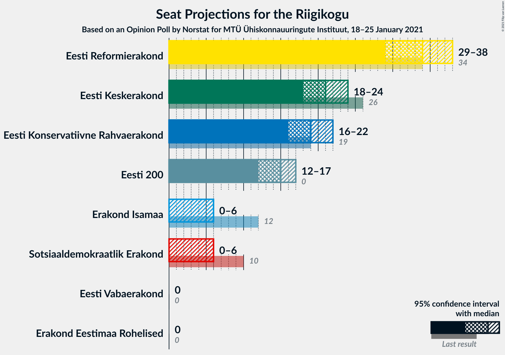

# Opinion Poll by Norstat for MTÜ Ühiskonnauuringute Instituut, 18–25 January 2021

<a href="#voting-intentions">Voting Intentions</a> | <a href="#seats">Seats</a> | <a href="#coalitions">Coalitions</a> | <a href="#technical-information">Technical Information</a>

## Voting Intentions

### Confidence Intervals

| Party | Last Result | Poll Result | 80% Confidence Interval | 90% Confidence Interval | 95% Confidence Interval | 99% Confidence Interval |
|:-----:|:-----------:|:-----------:|:-----------------------:|:-----------------------:|:-----------------------:|:-----------------------:|
| Eesti Reformierakond | 28.9% | 28.5% | 26.7–30.4% |26.2–30.9% |25.8–31.4% |25.0–32.3% |
| Eesti Keskerakond | 23.1% | 18.7% | 17.2–20.4% |16.8–20.8% |16.4–21.2% |15.7–22.1% |
| Eesti Konservatiivne Rahvaerakond | 17.8% | 17.3% | 15.8–18.9% |15.4–19.4% |15.1–19.8% |14.4–20.6% |
| Eesti 200 | 4.4% | 13.5% | 12.2–15.0% |11.8–15.4% |11.5–15.8% |10.9–16.5% |
| Erakond Isamaa | 11.4% | 4.7% | 3.9–5.7% |3.7–6.0% |3.6–6.2% |3.2–6.7% |
| Sotsiaaldemokraatlik Erakond | 9.8% | 4.6% | 3.9–5.6% |3.6–5.8% |3.5–6.1% |3.1–6.6% |
| Erakond Eestimaa Rohelised | 1.8% | 2.2% | 1.7–2.9% |1.6–3.1% |1.4–3.3% |1.2–3.7% |
| Eesti Vabaerakond | 1.2% | 0.7% | 0.5–1.2% |0.4–1.3% |0.3–1.4% |0.2–1.7% |

*Note:* The poll result column reflects the actual value used in the calculations. Published results may vary slightly, and in addition be rounded to fewer digits.

## Seats

### Confidence Intervals

| Party | Last Result | Median | 80% Confidence Interval | 90% Confidence Interval | 95% Confidence Interval | 99% Confidence Interval |
|:-----:|:-----------:|:------:|:-----------------------:|:-----------------------:|:-----------------------:|:-----------------------:|
| <a href="#eesti-reformierakond">Eesti Reformierakond</a> | 34 | 34 | 31–36 |30–37 |29–38 |28–39 |
| <a href="#eesti-keskerakond">Eesti Keskerakond</a> | 26 | 21 | 19–23 |18–24 |18–24 |17–25 |
| <a href="#eesti-konservatiivne-rahvaerakond">Eesti Konservatiivne Rahvaerakond</a> | 19 | 19 | 17–21 |16–22 |16–22 |15–23 |
| <a href="#eesti-200">Eesti 200</a> | 0 | 15 | 13–16 |12–17 |12–17 |11–18 |
| <a href="#erakond-isamaa">Erakond Isamaa</a> | 12 | 0 | 0–5 |0–5 |0–6 |0–6 |
| <a href="#sotsiaaldemokraatlik-erakond">Sotsiaaldemokraatlik Erakond</a> | 10 | 0 | 0–5 |0–5 |0–6 |0–6 |
| <a href="#erakond-eestimaa-rohelised">Erakond Eestimaa Rohelised</a> | 0 | 0 | 0 |0 |0 |0 |
| <a href="#eesti-vabaerakond">Eesti Vabaerakond</a> | 0 | 0 | 0 |0 |0 |0 |

### Eesti Reformierakond

*For a full overview of the results for this party, see the [Eesti Reformierakond](party-eestireformierakond.html) page.*

| Number of Seats | Probability | Accumulated | Special Marks |
|:---------------:|:-----------:|:-----------:|:-------------:|
| 27 | 0.1% | 100% |  |
| 28 | 0.4% | 99.9% |  |
| 29 | 2% | 99.4% |  |
| 30 | 5% | 97% |  |
| 31 | 10% | 92% |  |
| 32 | 13% | 82% |  |
| 33 | 12% | 69% |  |
| 34 | 22% | 57% | Last Result, Median |
| 35 | 17% | 35% |  |
| 36 | 11% | 18% |  |
| 37 | 5% | 7% |  |
| 38 | 2% | 3% |  |
| 39 | 0.7% | 1.0% |  |
| 40 | 0.3% | 0.3% |  |
| 41 | 0% | 0% |  |

### Eesti Keskerakond

*For a full overview of the results for this party, see the [Eesti Keskerakond](party-eestikeskerakond.html) page.*

| Number of Seats | Probability | Accumulated | Special Marks |
|:---------------:|:-----------:|:-----------:|:-------------:|
| 16 | 0.2% | 100% |  |
| 17 | 2% | 99.7% |  |
| 18 | 4% | 98% |  |
| 19 | 14% | 94% |  |
| 20 | 21% | 80% |  |
| 21 | 27% | 58% | Median |
| 22 | 15% | 31% |  |
| 23 | 10% | 16% |  |
| 24 | 4% | 6% |  |
| 25 | 2% | 2% |  |
| 26 | 0.4% | 0.4% | Last Result |
| 27 | 0.1% | 0.1% |  |
| 28 | 0% | 0% |  |

### Eesti Konservatiivne Rahvaerakond

*For a full overview of the results for this party, see the [Eesti Konservatiivne Rahvaerakond](party-eestikonservatiivnerahvaerakond.html) page.*

| Number of Seats | Probability | Accumulated | Special Marks |
|:---------------:|:-----------:|:-----------:|:-------------:|
| 14 | 0.1% | 100% |  |
| 15 | 0.6% | 99.9% |  |
| 16 | 4% | 99.3% |  |
| 17 | 13% | 95% |  |
| 18 | 15% | 81% |  |
| 19 | 26% | 66% | Last Result, Median |
| 20 | 23% | 41% |  |
| 21 | 10% | 18% |  |
| 22 | 6% | 8% |  |
| 23 | 0.8% | 1.2% |  |
| 24 | 0.3% | 0.4% |  |
| 25 | 0.1% | 0.1% |  |
| 26 | 0% | 0% |  |

### Eesti 200

*For a full overview of the results for this party, see the [Eesti 200](party-eesti200.html) page.*

| Number of Seats | Probability | Accumulated | Special Marks |
|:---------------:|:-----------:|:-----------:|:-------------:|
| 0 | 0% | 100% | Last Result |
| 1 | 0% | 100% |  |
| 2 | 0% | 100% |  |
| 3 | 0% | 100% |  |
| 4 | 0% | 100% |  |
| 5 | 0% | 100% |  |
| 6 | 0% | 100% |  |
| 7 | 0% | 100% |  |
| 8 | 0% | 100% |  |
| 9 | 0% | 100% |  |
| 10 | 0.1% | 100% |  |
| 11 | 1.3% | 99.9% |  |
| 12 | 7% | 98.5% |  |
| 13 | 18% | 92% |  |
| 14 | 23% | 74% |  |
| 15 | 30% | 51% | Median |
| 16 | 15% | 21% |  |
| 17 | 5% | 6% |  |
| 18 | 1.3% | 2% |  |
| 19 | 0.2% | 0.3% |  |
| 20 | 0% | 0% |  |

### Erakond Isamaa

*For a full overview of the results for this party, see the [Erakond Isamaa](party-erakondisamaa.html) page.*

| Number of Seats | Probability | Accumulated | Special Marks |
|:---------------:|:-----------:|:-----------:|:-------------:|
| 0 | 66% | 100% | Median |
| 1 | 0% | 34% |  |
| 2 | 0% | 34% |  |
| 3 | 0% | 34% |  |
| 4 | 9% | 34% |  |
| 5 | 23% | 26% |  |
| 6 | 3% | 3% |  |
| 7 | 0.1% | 0.2% |  |
| 8 | 0% | 0% |  |
| 9 | 0% | 0% |  |
| 10 | 0% | 0% |  |
| 11 | 0% | 0% |  |
| 12 | 0% | 0% | Last Result |

### Sotsiaaldemokraatlik Erakond

*For a full overview of the results for this party, see the [Sotsiaaldemokraatlik Erakond](party-sotsiaaldemokraatlikerakond.html) page.*

| Number of Seats | Probability | Accumulated | Special Marks |
|:---------------:|:-----------:|:-----------:|:-------------:|
| 0 | 72% | 100% | Median |
| 1 | 0% | 28% |  |
| 2 | 0% | 28% |  |
| 3 | 0% | 28% |  |
| 4 | 5% | 28% |  |
| 5 | 19% | 22% |  |
| 6 | 3% | 3% |  |
| 7 | 0.1% | 0.1% |  |
| 8 | 0% | 0% |  |
| 9 | 0% | 0% |  |
| 10 | 0% | 0% | Last Result |

### Erakond Eestimaa Rohelised

*For a full overview of the results for this party, see the [Erakond Eestimaa Rohelised](party-erakondeestimaarohelised.html) page.*

| Number of Seats | Probability | Accumulated | Special Marks |
|:---------------:|:-----------:|:-----------:|:-------------:|
| 0 | 100% | 100% | Last Result, Median |

### Eesti Vabaerakond

*For a full overview of the results for this party, see the [Eesti Vabaerakond](party-eestivabaerakond.html) page.*

| Number of Seats | Probability | Accumulated | Special Marks |
|:---------------:|:-----------:|:-----------:|:-------------:|
| 0 | 100% | 100% | Last Result, Median |

## Coalitions

### Confidence Intervals

| Coalition | Last Result | Median | Majority? | 80% Confidence Interval | 90% Confidence Interval | 95% Confidence Interval | 99% Confidence Interval |
|:---------:|:-----------:|:------:|:---------:|:-----------------------:|:-----------------------:|:-----------------------:|:-----------------------:|
| Eesti Reformierakond – Eesti Keskerakond – Eesti Konservatiivne Rahvaerakond | 79 | 74 | 100% | 69–77 | 68–78 | 67–78 | 66–80 |
| Eesti Reformierakond – Eesti Keskerakond | 60 | 55 | 92% | 51–58 | 50–58 | 49–59 | 48–61 |
| Eesti Reformierakond – Eesti Konservatiivne Rahvaerakond – Erakond Isamaa | 65 | 55 | 93% | 51–58 | 50–59 | 49–59 | 48–61 |
| Eesti Reformierakond – Eesti Konservatiivne Rahvaerakond | 53 | 53 | 78% | 49–56 | 48–56 | 48–57 | 46–59 |
| Eesti Keskerakond – Eesti Konservatiivne Rahvaerakond – Erakond Isamaa | 57 | 41 | 0% | 38–45 | 38–46 | 37–47 | 36–48 |
| Eesti Keskerakond – Eesti Konservatiivne Rahvaerakond | 45 | 40 | 0% | 37–43 | 36–44 | 36–44 | 34–46 |
| Eesti Reformierakond – Erakond Isamaa – Sotsiaaldemokraatlik Erakond – Eesti Vabaerakond | 56 | 36 | 0% | 33–40 | 33–41 | 32–42 | 30–43 |
| Eesti Reformierakond – Erakond Isamaa – Sotsiaaldemokraatlik Erakond | 56 | 36 | 0% | 33–40 | 33–41 | 32–42 | 30–43 |
| Eesti Reformierakond – Erakond Isamaa | 46 | 35 | 0% | 32–39 | 31–40 | 31–40 | 29–42 |
| Eesti Reformierakond – Sotsiaaldemokraatlik Erakond | 44 | 35 | 0% | 32–38 | 31–39 | 30–40 | 29–41 |
| Eesti Keskerakond – Erakond Isamaa – Sotsiaaldemokraatlik Erakond | 48 | 24 | 0% | 20–28 | 20–29 | 19–30 | 18–32 |
| Eesti Keskerakond – Sotsiaaldemokraatlik Erakond | 36 | 22 | 0% | 19–26 | 19–27 | 18–27 | 17–29 |
| Eesti Konservatiivne Rahvaerakond – Sotsiaaldemokraatlik Erakond | 29 | 20 | 0% | 18–24 | 17–24 | 16–25 | 16–27 |

### Eesti Reformierakond – Eesti Keskerakond – Eesti Konservatiivne Rahvaerakond

| Number of Seats | Probability | Accumulated | Special Marks |
|:---------------:|:-----------:|:-----------:|:-------------:|
| 65 | 0.1% | 100% |  |
| 66 | 0.7% | 99.9% |  |
| 67 | 2% | 99.1% |  |
| 68 | 3% | 97% |  |
| 69 | 5% | 94% |  |
| 70 | 6% | 89% |  |
| 71 | 9% | 83% |  |
| 72 | 10% | 74% |  |
| 73 | 9% | 64% |  |
| 74 | 14% | 55% | Median |
| 75 | 9% | 42% |  |
| 76 | 16% | 32% |  |
| 77 | 10% | 16% |  |
| 78 | 4% | 6% |  |
| 79 | 2% | 2% | Last Result |
| 80 | 0.5% | 0.6% |  |
| 81 | 0% | 0.1% |  |
| 82 | 0% | 0% |  |

### Eesti Reformierakond – Eesti Keskerakond

| Number of Seats | Probability | Accumulated | Special Marks |
|:---------------:|:-----------:|:-----------:|:-------------:|
| 46 | 0% | 100% |  |
| 47 | 0.1% | 99.9% |  |
| 48 | 0.8% | 99.8% |  |
| 49 | 2% | 99.0% |  |
| 50 | 5% | 97% |  |
| 51 | 6% | 92% | Majority |
| 52 | 10% | 86% |  |
| 53 | 11% | 77% |  |
| 54 | 14% | 65% |  |
| 55 | 13% | 51% | Median |
| 56 | 16% | 38% |  |
| 57 | 12% | 22% |  |
| 58 | 6% | 11% |  |
| 59 | 3% | 5% |  |
| 60 | 1.1% | 2% | Last Result |
| 61 | 0.6% | 0.7% |  |
| 62 | 0.1% | 0.1% |  |
| 63 | 0% | 0% |  |

### Eesti Reformierakond – Eesti Konservatiivne Rahvaerakond – Erakond Isamaa

| Number of Seats | Probability | Accumulated | Special Marks |
|:---------------:|:-----------:|:-----------:|:-------------:|
| 46 | 0.1% | 100% |  |
| 47 | 0.4% | 99.9% |  |
| 48 | 0.6% | 99.6% |  |
| 49 | 2% | 98.9% |  |
| 50 | 5% | 97% |  |
| 51 | 6% | 93% | Majority |
| 52 | 9% | 87% |  |
| 53 | 12% | 78% | Median |
| 54 | 15% | 66% |  |
| 55 | 20% | 51% |  |
| 56 | 11% | 30% |  |
| 57 | 8% | 19% |  |
| 58 | 5% | 11% |  |
| 59 | 4% | 6% |  |
| 60 | 2% | 2% |  |
| 61 | 0.5% | 0.5% |  |
| 62 | 0.1% | 0.1% |  |
| 63 | 0% | 0% |  |
| 64 | 0% | 0% |  |
| 65 | 0% | 0% | Last Result |

### Eesti Reformierakond – Eesti Konservatiivne Rahvaerakond

| Number of Seats | Probability | Accumulated | Special Marks |
|:---------------:|:-----------:|:-----------:|:-------------:|
| 45 | 0.1% | 100% |  |
| 46 | 0.4% | 99.8% |  |
| 47 | 1.4% | 99.4% |  |
| 48 | 5% | 98% |  |
| 49 | 6% | 93% |  |
| 50 | 9% | 87% |  |
| 51 | 11% | 78% | Majority |
| 52 | 12% | 67% |  |
| 53 | 12% | 56% | Last Result, Median |
| 54 | 14% | 44% |  |
| 55 | 18% | 30% |  |
| 56 | 7% | 12% |  |
| 57 | 2% | 4% |  |
| 58 | 2% | 2% |  |
| 59 | 0.7% | 0.8% |  |
| 60 | 0.1% | 0.1% |  |
| 61 | 0% | 0% |  |

### Eesti Keskerakond – Eesti Konservatiivne Rahvaerakond – Erakond Isamaa

| Number of Seats | Probability | Accumulated | Special Marks |
|:---------------:|:-----------:|:-----------:|:-------------:|
| 34 | 0.1% | 100% |  |
| 35 | 0.4% | 99.9% |  |
| 36 | 2% | 99.5% |  |
| 37 | 3% | 98% |  |
| 38 | 6% | 95% |  |
| 39 | 7% | 89% |  |
| 40 | 16% | 82% | Median |
| 41 | 19% | 66% |  |
| 42 | 12% | 47% |  |
| 43 | 13% | 35% |  |
| 44 | 7% | 22% |  |
| 45 | 8% | 15% |  |
| 46 | 4% | 7% |  |
| 47 | 2% | 3% |  |
| 48 | 0.5% | 0.9% |  |
| 49 | 0.3% | 0.4% |  |
| 50 | 0.1% | 0.1% |  |
| 51 | 0% | 0% | Majority |
| 52 | 0% | 0% |  |
| 53 | 0% | 0% |  |
| 54 | 0% | 0% |  |
| 55 | 0% | 0% |  |
| 56 | 0% | 0% |  |
| 57 | 0% | 0% | Last Result |

### Eesti Keskerakond – Eesti Konservatiivne Rahvaerakond

| Number of Seats | Probability | Accumulated | Special Marks |
|:---------------:|:-----------:|:-----------:|:-------------:|
| 33 | 0.1% | 100% |  |
| 34 | 0.5% | 99.9% |  |
| 35 | 2% | 99.4% |  |
| 36 | 5% | 98% |  |
| 37 | 8% | 93% |  |
| 38 | 11% | 84% |  |
| 39 | 12% | 73% |  |
| 40 | 19% | 61% | Median |
| 41 | 22% | 42% |  |
| 42 | 8% | 21% |  |
| 43 | 7% | 13% |  |
| 44 | 3% | 6% |  |
| 45 | 2% | 2% | Last Result |
| 46 | 0.4% | 0.5% |  |
| 47 | 0.1% | 0.1% |  |
| 48 | 0% | 0% |  |

### Eesti Reformierakond – Erakond Isamaa – Sotsiaaldemokraatlik Erakond – Eesti Vabaerakond

| Number of Seats | Probability | Accumulated | Special Marks |
|:---------------:|:-----------:|:-----------:|:-------------:|
| 29 | 0.1% | 100% |  |
| 30 | 0.5% | 99.9% |  |
| 31 | 1.1% | 99.4% |  |
| 32 | 3% | 98% |  |
| 33 | 5% | 95% |  |
| 34 | 13% | 90% | Median |
| 35 | 15% | 77% |  |
| 36 | 14% | 62% |  |
| 37 | 11% | 48% |  |
| 38 | 9% | 36% |  |
| 39 | 10% | 28% |  |
| 40 | 9% | 17% |  |
| 41 | 5% | 9% |  |
| 42 | 2% | 4% |  |
| 43 | 1.3% | 2% |  |
| 44 | 0.3% | 0.5% |  |
| 45 | 0.1% | 0.2% |  |
| 46 | 0% | 0% |  |
| 47 | 0% | 0% |  |
| 48 | 0% | 0% |  |
| 49 | 0% | 0% |  |
| 50 | 0% | 0% |  |
| 51 | 0% | 0% | Majority |
| 52 | 0% | 0% |  |
| 53 | 0% | 0% |  |
| 54 | 0% | 0% |  |
| 55 | 0% | 0% |  |
| 56 | 0% | 0% | Last Result |

### Eesti Reformierakond – Erakond Isamaa – Sotsiaaldemokraatlik Erakond

| Number of Seats | Probability | Accumulated | Special Marks |
|:---------------:|:-----------:|:-----------:|:-------------:|
| 29 | 0.1% | 100% |  |
| 30 | 0.5% | 99.9% |  |
| 31 | 1.1% | 99.4% |  |
| 32 | 3% | 98% |  |
| 33 | 5% | 95% |  |
| 34 | 13% | 90% | Median |
| 35 | 15% | 77% |  |
| 36 | 14% | 62% |  |
| 37 | 11% | 48% |  |
| 38 | 9% | 36% |  |
| 39 | 10% | 28% |  |
| 40 | 9% | 17% |  |
| 41 | 5% | 9% |  |
| 42 | 2% | 4% |  |
| 43 | 1.3% | 2% |  |
| 44 | 0.3% | 0.5% |  |
| 45 | 0.1% | 0.2% |  |
| 46 | 0% | 0% |  |
| 47 | 0% | 0% |  |
| 48 | 0% | 0% |  |
| 49 | 0% | 0% |  |
| 50 | 0% | 0% |  |
| 51 | 0% | 0% | Majority |
| 52 | 0% | 0% |  |
| 53 | 0% | 0% |  |
| 54 | 0% | 0% |  |
| 55 | 0% | 0% |  |
| 56 | 0% | 0% | Last Result |

### Eesti Reformierakond – Erakond Isamaa

| Number of Seats | Probability | Accumulated | Special Marks |
|:---------------:|:-----------:|:-----------:|:-------------:|
| 28 | 0.1% | 100% |  |
| 29 | 0.5% | 99.9% |  |
| 30 | 2% | 99.4% |  |
| 31 | 5% | 98% |  |
| 32 | 5% | 93% |  |
| 33 | 8% | 88% |  |
| 34 | 19% | 80% | Median |
| 35 | 18% | 61% |  |
| 36 | 14% | 43% |  |
| 37 | 11% | 29% |  |
| 38 | 6% | 18% |  |
| 39 | 5% | 12% |  |
| 40 | 5% | 7% |  |
| 41 | 1.2% | 2% |  |
| 42 | 0.5% | 0.8% |  |
| 43 | 0.2% | 0.2% |  |
| 44 | 0% | 0% |  |
| 45 | 0% | 0% |  |
| 46 | 0% | 0% | Last Result |

### Eesti Reformierakond – Sotsiaaldemokraatlik Erakond

| Number of Seats | Probability | Accumulated | Special Marks |
|:---------------:|:-----------:|:-----------:|:-------------:|
| 28 | 0.1% | 100% |  |
| 29 | 0.8% | 99.9% |  |
| 30 | 2% | 99.1% |  |
| 31 | 4% | 97% |  |
| 32 | 9% | 93% |  |
| 33 | 9% | 84% |  |
| 34 | 17% | 75% | Median |
| 35 | 18% | 58% |  |
| 36 | 17% | 40% |  |
| 37 | 8% | 23% |  |
| 38 | 6% | 15% |  |
| 39 | 5% | 9% |  |
| 40 | 2% | 3% |  |
| 41 | 0.7% | 1.1% |  |
| 42 | 0.3% | 0.4% |  |
| 43 | 0.1% | 0.1% |  |
| 44 | 0% | 0% | Last Result |

### Eesti Keskerakond – Erakond Isamaa – Sotsiaaldemokraatlik Erakond

| Number of Seats | Probability | Accumulated | Special Marks |
|:---------------:|:-----------:|:-----------:|:-------------:|
| 17 | 0.1% | 100% |  |
| 18 | 1.0% | 99.9% |  |
| 19 | 2% | 98.9% |  |
| 20 | 9% | 97% |  |
| 21 | 17% | 88% | Median |
| 22 | 9% | 71% |  |
| 23 | 9% | 62% |  |
| 24 | 13% | 53% |  |
| 25 | 9% | 40% |  |
| 26 | 11% | 31% |  |
| 27 | 7% | 20% |  |
| 28 | 6% | 13% |  |
| 29 | 4% | 7% |  |
| 30 | 1.4% | 3% |  |
| 31 | 1.0% | 2% |  |
| 32 | 0.4% | 0.6% |  |
| 33 | 0.1% | 0.1% |  |
| 34 | 0% | 0% |  |
| 35 | 0% | 0% |  |
| 36 | 0% | 0% |  |
| 37 | 0% | 0% |  |
| 38 | 0% | 0% |  |
| 39 | 0% | 0% |  |
| 40 | 0% | 0% |  |
| 41 | 0% | 0% |  |
| 42 | 0% | 0% |  |
| 43 | 0% | 0% |  |
| 44 | 0% | 0% |  |
| 45 | 0% | 0% |  |
| 46 | 0% | 0% |  |
| 47 | 0% | 0% |  |
| 48 | 0% | 0% | Last Result |

### Eesti Keskerakond – Sotsiaaldemokraatlik Erakond

| Number of Seats | Probability | Accumulated | Special Marks |
|:---------------:|:-----------:|:-----------:|:-------------:|
| 16 | 0.1% | 100% |  |
| 17 | 0.8% | 99.9% |  |
| 18 | 2% | 99.1% |  |
| 19 | 7% | 97% |  |
| 20 | 16% | 90% |  |
| 21 | 21% | 74% | Median |
| 22 | 13% | 53% |  |
| 23 | 11% | 40% |  |
| 24 | 11% | 28% |  |
| 25 | 6% | 17% |  |
| 26 | 6% | 11% |  |
| 27 | 3% | 6% |  |
| 28 | 2% | 2% |  |
| 29 | 0.5% | 0.6% |  |
| 30 | 0.1% | 0.1% |  |
| 31 | 0% | 0% |  |
| 32 | 0% | 0% |  |
| 33 | 0% | 0% |  |
| 34 | 0% | 0% |  |
| 35 | 0% | 0% |  |
| 36 | 0% | 0% | Last Result |

### Eesti Konservatiivne Rahvaerakond – Sotsiaaldemokraatlik Erakond

| Number of Seats | Probability | Accumulated | Special Marks |
|:---------------:|:-----------:|:-----------:|:-------------:|
| 15 | 0.3% | 100% |  |
| 16 | 2% | 99.7% |  |
| 17 | 6% | 97% |  |
| 18 | 9% | 91% |  |
| 19 | 18% | 82% | Median |
| 20 | 21% | 64% |  |
| 21 | 13% | 43% |  |
| 22 | 11% | 30% |  |
| 23 | 6% | 19% |  |
| 24 | 8% | 12% |  |
| 25 | 2% | 5% |  |
| 26 | 1.3% | 2% |  |
| 27 | 0.8% | 0.9% |  |
| 28 | 0.1% | 0.1% |  |
| 29 | 0% | 0% | Last Result |

## Technical Information

### Opinion Poll

+ **Polling firm:** Norstat
+ **Commissioner(s):** MTÜ Ühiskonnauuringute Instituut
+ **Fieldwork period:** 18–25 January 2021

### Calculations

+ **Sample size:** 1000
+ **Simulations done:** 1,048,576
+ **Error estimate:** 1.19%

