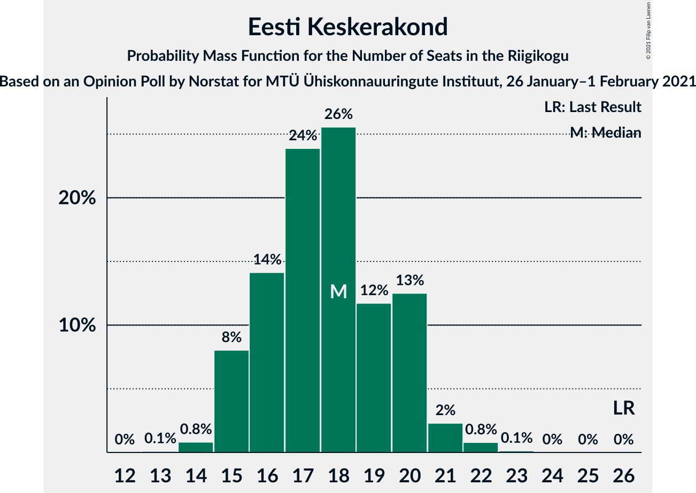

# Opinion Poll by Norstat for MTÜ Ühiskonnauuringute Instituut, 26 January–1 February 2021

<a href="#voting-intentions">Voting Intentions</a> | <a href="#seats">Seats</a> | <a href="#coalitions">Coalitions</a> | <a href="#technical-information">Technical Information</a>

## Voting Intentions

### Confidence Intervals

| Party | Last Result | Poll Result | 80% Confidence Interval | 90% Confidence Interval | 95% Confidence Interval | 99% Confidence Interval |
|:-----:|:-----------:|:-----------:|:-----------------------:|:-----------------------:|:-----------------------:|:-----------------------:|
| Eesti Reformierakond | 28.9% | 28.4% | 26.6–30.3% |26.1–30.8% |25.7–31.3% |24.9–32.2% |
| Eesti Keskerakond | 23.1% | 16.4% | 15.0–18.0% |14.6–18.4% |14.2–18.8% |13.6–19.6% |
| Eesti Konservatiivne Rahvaerakond | 17.8% | 15.0% | 13.6–16.5% |13.2–17.0% |12.9–17.4% |12.3–18.1% |
| Eesti 200 | 4.4% | 13.5% | 12.2–15.0% |11.8–15.4% |11.5–15.8% |10.9–16.5% |
| Sotsiaaldemokraatlik Erakond | 9.8% | 6.8% | 5.9–7.9% |5.6–8.3% |5.4–8.5% |5.0–9.1% |
| Erakond Isamaa | 11.4% | 4.5% | 3.8–5.5% |3.6–5.7% |3.4–6.0% |3.0–6.5% |
| Erakond Eestimaa Rohelised | 1.8% | 2.2% | 1.7–2.9% |1.6–3.1% |1.4–3.3% |1.2–3.7% |
| Eesti Vabaerakond | 1.2% | 1.1% | 0.8–1.7% |0.7–1.8% |0.6–2.0% |0.5–2.3% |

*Note:* The poll result column reflects the actual value used in the calculations. Published results may vary slightly, and in addition be rounded to fewer digits.

## Seats

### Confidence Intervals

| Party | Last Result | Median | 80% Confidence Interval | 90% Confidence Interval | 95% Confidence Interval | 99% Confidence Interval |
|:-----:|:-----------:|:------:|:-----------------------:|:-----------------------:|:-----------------------:|:-----------------------:|
| <a href="#eesti-reformierakond">Eesti Reformierakond</a> | 34 | 35 | 32–36 |31–36 |30–37 |28–38 |
| <a href="#eesti-keskerakond">Eesti Keskerakond</a> | 26 | 17 | 15–20 |15–21 |15–21 |14–23 |
| <a href="#eesti-konservatiivne-rahvaerakond">Eesti Konservatiivne Rahvaerakond</a> | 19 | 16 | 14–18 |14–18 |13–19 |13–20 |
| <a href="#eesti-200">Eesti 200</a> | 0 | 14 | 12–16 |12–16 |12–16 |11–17 |
| <a href="#sotsiaaldemokraatlik-erakond">Sotsiaaldemokraatlik Erakond</a> | 10 | 7 | 5–8 |5–8 |5–8 |0–9 |
| <a href="#erakond-isamaa">Erakond Isamaa</a> | 12 | 0 | 0–4 |0–5 |0–5 |0–6 |
| <a href="#erakond-eestimaa-rohelised">Erakond Eestimaa Rohelised</a> | 0 | 0 | 0 |0 |0 |0 |
| <a href="#eesti-vabaerakond">Eesti Vabaerakond</a> | 0 | 0 | 0 |0 |0 |0 |

### Eesti Reformierakond

*For a full overview of the results for this party, see the [Eesti Reformierakond](party-eestireformierakond.html) page.*

| Number of Seats | Probability | Accumulated | Special Marks |
|:---------------:|:-----------:|:-----------:|:-------------:|
| 26 | 0.1% | 100% |  |
| 27 | 0.2% | 99.9% |  |
| 28 | 0.6% | 99.8% |  |
| 29 | 1.2% | 99.1% |  |
| 30 | 2% | 98% |  |
| 31 | 5% | 96% |  |
| 32 | 8% | 91% |  |
| 33 | 13% | 83% |  |
| 34 | 17% | 70% | Last Result |
| 35 | 33% | 53% | Median |
| 36 | 18% | 21% |  |
| 37 | 2% | 3% |  |
| 38 | 1.1% | 1.3% |  |
| 39 | 0.1% | 0.2% |  |
| 40 | 0% | 0.1% |  |
| 41 | 0% | 0% |  |

### Eesti Keskerakond

*For a full overview of the results for this party, see the [Eesti Keskerakond](party-eestikeskerakond.html) page.*

| Number of Seats | Probability | Accumulated | Special Marks |
|:---------------:|:-----------:|:-----------:|:-------------:|
| 13 | 0.2% | 100% |  |
| 14 | 2% | 99.8% |  |
| 15 | 9% | 98% |  |
| 16 | 30% | 89% |  |
| 17 | 30% | 58% | Median |
| 18 | 11% | 28% |  |
| 19 | 6% | 17% |  |
| 20 | 5% | 11% |  |
| 21 | 5% | 7% |  |
| 22 | 0.8% | 2% |  |
| 23 | 0.7% | 0.7% |  |
| 24 | 0.1% | 0.1% |  |
| 25 | 0% | 0% |  |
| 26 | 0% | 0% | Last Result |

### Eesti Konservatiivne Rahvaerakond

*For a full overview of the results for this party, see the [Eesti Konservatiivne Rahvaerakond](party-eestikonservatiivnerahvaerakond.html) page.*

| Number of Seats | Probability | Accumulated | Special Marks |
|:---------------:|:-----------:|:-----------:|:-------------:|
| 11 | 0.1% | 100% |  |
| 12 | 0.3% | 99.9% |  |
| 13 | 3% | 99.6% |  |
| 14 | 13% | 97% |  |
| 15 | 19% | 84% |  |
| 16 | 22% | 64% | Median |
| 17 | 30% | 42% |  |
| 18 | 8% | 13% |  |
| 19 | 4% | 5% | Last Result |
| 20 | 0.7% | 0.9% |  |
| 21 | 0.2% | 0.2% |  |
| 22 | 0% | 0% |  |

### Eesti 200

*For a full overview of the results for this party, see the [Eesti 200](party-eesti200.html) page.*

| Number of Seats | Probability | Accumulated | Special Marks |
|:---------------:|:-----------:|:-----------:|:-------------:|
| 0 | 0% | 100% | Last Result |
| 1 | 0% | 100% |  |
| 2 | 0% | 100% |  |
| 3 | 0% | 100% |  |
| 4 | 0% | 100% |  |
| 5 | 0% | 100% |  |
| 6 | 0% | 100% |  |
| 7 | 0% | 100% |  |
| 8 | 0% | 100% |  |
| 9 | 0% | 100% |  |
| 10 | 0.2% | 100% |  |
| 11 | 2% | 99.8% |  |
| 12 | 10% | 98% |  |
| 13 | 31% | 88% |  |
| 14 | 29% | 56% | Median |
| 15 | 14% | 28% |  |
| 16 | 11% | 14% |  |
| 17 | 2% | 2% |  |
| 18 | 0.4% | 0.5% |  |
| 19 | 0.1% | 0.1% |  |
| 20 | 0% | 0% |  |

### Sotsiaaldemokraatlik Erakond

*For a full overview of the results for this party, see the [Sotsiaaldemokraatlik Erakond](party-sotsiaaldemokraatlikerakond.html) page.*

| Number of Seats | Probability | Accumulated | Special Marks |
|:---------------:|:-----------:|:-----------:|:-------------:|
| 0 | 0.7% | 100% |  |
| 1 | 0% | 99.3% |  |
| 2 | 0% | 99.3% |  |
| 3 | 0% | 99.3% |  |
| 4 | 0.2% | 99.3% |  |
| 5 | 14% | 99.1% |  |
| 6 | 27% | 85% |  |
| 7 | 33% | 59% | Median |
| 8 | 23% | 25% |  |
| 9 | 2% | 2% |  |
| 10 | 0.2% | 0.2% | Last Result |
| 11 | 0% | 0% |  |

### Erakond Isamaa

*For a full overview of the results for this party, see the [Erakond Isamaa](party-erakondisamaa.html) page.*

| Number of Seats | Probability | Accumulated | Special Marks |
|:---------------:|:-----------:|:-----------:|:-------------:|
| 0 | 87% | 100% | Median |
| 1 | 0% | 13% |  |
| 2 | 0% | 13% |  |
| 3 | 0% | 13% |  |
| 4 | 5% | 13% |  |
| 5 | 6% | 8% |  |
| 6 | 1.2% | 1.2% |  |
| 7 | 0% | 0% |  |
| 8 | 0% | 0% |  |
| 9 | 0% | 0% |  |
| 10 | 0% | 0% |  |
| 11 | 0% | 0% |  |
| 12 | 0% | 0% | Last Result |

### Erakond Eestimaa Rohelised

*For a full overview of the results for this party, see the [Erakond Eestimaa Rohelised](party-erakondeestimaarohelised.html) page.*

| Number of Seats | Probability | Accumulated | Special Marks |
|:---------------:|:-----------:|:-----------:|:-------------:|
| 0 | 100% | 100% | Last Result, Median |

### Eesti Vabaerakond

*For a full overview of the results for this party, see the [Eesti Vabaerakond](party-eestivabaerakond.html) page.*

| Number of Seats | Probability | Accumulated | Special Marks |
|:---------------:|:-----------:|:-----------:|:-------------:|
| 0 | 100% | 100% | Last Result, Median |

## Coalitions

### Confidence Intervals

| Coalition | Last Result | Median | Majority? | 80% Confidence Interval | 90% Confidence Interval | 95% Confidence Interval | 99% Confidence Interval |
|:---------:|:-----------:|:------:|:---------:|:-----------------------:|:-----------------------:|:-----------------------:|:-----------------------:|
| Eesti Reformierakond – Eesti Keskerakond – Eesti Konservatiivne Rahvaerakond | 79 | 68 | 100% | 65–70 | 64–70 | 63–71 | 61–72 |
| Eesti Reformierakond – Eesti Konservatiivne Rahvaerakond – Erakond Isamaa | 65 | 51 | 58% | 48–53 | 47–54 | 46–55 | 45–56 |
| Eesti Reformierakond – Eesti Keskerakond | 60 | 51 | 78% | 49–53 | 48–54 | 47–54 | 45–55 |
| Eesti Reformierakond – Eesti Konservatiivne Rahvaerakond | 53 | 50 | 49% | 47–53 | 46–53 | 45–54 | 43–55 |
| Eesti Reformierakond – Sotsiaaldemokraatlik Erakond – Erakond Isamaa – Eesti Vabaerakond | 56 | 42 | 0% | 38–44 | 37–45 | 36–45 | 34–46 |
| Eesti Reformierakond – Sotsiaaldemokraatlik Erakond – Erakond Isamaa | 56 | 42 | 0% | 38–44 | 37–45 | 36–45 | 34–46 |
| Eesti Reformierakond – Sotsiaaldemokraatlik Erakond | 44 | 41 | 0% | 38–43 | 36–44 | 35–44 | 34–45 |
| Eesti Keskerakond – Eesti Konservatiivne Rahvaerakond – Erakond Isamaa | 57 | 33 | 0% | 31–37 | 30–38 | 30–39 | 29–41 |
| Eesti Reformierakond – Erakond Isamaa | 46 | 35 | 0% | 32–37 | 31–38 | 31–38 | 29–40 |
| Eesti Keskerakond – Eesti Konservatiivne Rahvaerakond | 45 | 33 | 0% | 31–36 | 30–37 | 30–38 | 28–39 |
| Eesti Keskerakond – Sotsiaaldemokraatlik Erakond – Erakond Isamaa | 48 | 24 | 0% | 22–28 | 21–28 | 21–29 | 20–31 |
| Eesti Keskerakond – Sotsiaaldemokraatlik Erakond | 36 | 23 | 0% | 22–26 | 21–27 | 20–28 | 20–29 |
| Eesti Konservatiivne Rahvaerakond – Sotsiaaldemokraatlik Erakond | 29 | 23 | 0% | 21–24 | 20–24 | 19–25 | 17–28 |

### Eesti Reformierakond – Eesti Keskerakond – Eesti Konservatiivne Rahvaerakond

| Number of Seats | Probability | Accumulated | Special Marks |
|:---------------:|:-----------:|:-----------:|:-------------:|
| 59 | 0.1% | 100% |  |
| 60 | 0.2% | 99.9% |  |
| 61 | 0.5% | 99.7% |  |
| 62 | 0.8% | 99.2% |  |
| 63 | 3% | 98% |  |
| 64 | 4% | 95% |  |
| 65 | 9% | 91% |  |
| 66 | 14% | 83% |  |
| 67 | 16% | 69% |  |
| 68 | 27% | 53% | Median |
| 69 | 15% | 26% |  |
| 70 | 7% | 11% |  |
| 71 | 3% | 4% |  |
| 72 | 0.3% | 0.7% |  |
| 73 | 0.1% | 0.3% |  |
| 74 | 0.1% | 0.2% |  |
| 75 | 0.1% | 0.1% |  |
| 76 | 0% | 0% |  |
| 77 | 0% | 0% |  |
| 78 | 0% | 0% |  |
| 79 | 0% | 0% | Last Result |

### Eesti Reformierakond – Eesti Konservatiivne Rahvaerakond – Erakond Isamaa

| Number of Seats | Probability | Accumulated | Special Marks |
|:---------------:|:-----------:|:-----------:|:-------------:|
| 43 | 0.1% | 100% |  |
| 44 | 0.2% | 99.9% |  |
| 45 | 0.8% | 99.7% |  |
| 46 | 2% | 98.9% |  |
| 47 | 3% | 96% |  |
| 48 | 5% | 93% |  |
| 49 | 16% | 88% |  |
| 50 | 14% | 72% |  |
| 51 | 13% | 58% | Median, Majority |
| 52 | 27% | 46% |  |
| 53 | 11% | 18% |  |
| 54 | 4% | 8% |  |
| 55 | 2% | 3% |  |
| 56 | 0.9% | 1.1% |  |
| 57 | 0.1% | 0.2% |  |
| 58 | 0.1% | 0.1% |  |
| 59 | 0% | 0% |  |
| 60 | 0% | 0% |  |
| 61 | 0% | 0% |  |
| 62 | 0% | 0% |  |
| 63 | 0% | 0% |  |
| 64 | 0% | 0% |  |
| 65 | 0% | 0% | Last Result |

### Eesti Reformierakond – Eesti Keskerakond

| Number of Seats | Probability | Accumulated | Special Marks |
|:---------------:|:-----------:|:-----------:|:-------------:|
| 43 | 0.1% | 100% |  |
| 44 | 0.2% | 99.9% |  |
| 45 | 0.6% | 99.7% |  |
| 46 | 1.2% | 99.1% |  |
| 47 | 1.2% | 98% |  |
| 48 | 2% | 97% |  |
| 49 | 10% | 95% |  |
| 50 | 6% | 84% |  |
| 51 | 33% | 78% | Majority |
| 52 | 23% | 45% | Median |
| 53 | 17% | 22% |  |
| 54 | 4% | 5% |  |
| 55 | 0.5% | 1.0% |  |
| 56 | 0.3% | 0.5% |  |
| 57 | 0.2% | 0.2% |  |
| 58 | 0% | 0.1% |  |
| 59 | 0% | 0% |  |
| 60 | 0% | 0% | Last Result |

### Eesti Reformierakond – Eesti Konservatiivne Rahvaerakond

| Number of Seats | Probability | Accumulated | Special Marks |
|:---------------:|:-----------:|:-----------:|:-------------:|
| 42 | 0.1% | 100% |  |
| 43 | 0.5% | 99.9% |  |
| 44 | 0.9% | 99.4% |  |
| 45 | 2% | 98% |  |
| 46 | 5% | 97% |  |
| 47 | 4% | 92% |  |
| 48 | 6% | 88% |  |
| 49 | 19% | 81% |  |
| 50 | 13% | 63% |  |
| 51 | 12% | 49% | Median, Majority |
| 52 | 26% | 37% |  |
| 53 | 7% | 11% | Last Result |
| 54 | 4% | 4% |  |
| 55 | 0.7% | 0.8% |  |
| 56 | 0.1% | 0.1% |  |
| 57 | 0% | 0% |  |

### Eesti Reformierakond – Sotsiaaldemokraatlik Erakond – Erakond Isamaa – Eesti Vabaerakond

| Number of Seats | Probability | Accumulated | Special Marks |
|:---------------:|:-----------:|:-----------:|:-------------:|
| 33 | 0.1% | 100% |  |
| 34 | 0.4% | 99.9% |  |
| 35 | 0.8% | 99.5% |  |
| 36 | 3% | 98.6% |  |
| 37 | 3% | 96% |  |
| 38 | 3% | 93% |  |
| 39 | 5% | 90% |  |
| 40 | 11% | 85% |  |
| 41 | 17% | 74% |  |
| 42 | 27% | 56% | Median |
| 43 | 15% | 29% |  |
| 44 | 8% | 14% |  |
| 45 | 5% | 6% |  |
| 46 | 0.6% | 1.0% |  |
| 47 | 0.2% | 0.4% |  |
| 48 | 0.1% | 0.2% |  |
| 49 | 0% | 0% |  |
| 50 | 0% | 0% |  |
| 51 | 0% | 0% | Majority |
| 52 | 0% | 0% |  |
| 53 | 0% | 0% |  |
| 54 | 0% | 0% |  |
| 55 | 0% | 0% |  |
| 56 | 0% | 0% | Last Result |

### Eesti Reformierakond – Sotsiaaldemokraatlik Erakond – Erakond Isamaa

| Number of Seats | Probability | Accumulated | Special Marks |
|:---------------:|:-----------:|:-----------:|:-------------:|
| 33 | 0.1% | 100% |  |
| 34 | 0.4% | 99.9% |  |
| 35 | 0.8% | 99.5% |  |
| 36 | 3% | 98.6% |  |
| 37 | 3% | 96% |  |
| 38 | 3% | 93% |  |
| 39 | 5% | 90% |  |
| 40 | 11% | 85% |  |
| 41 | 17% | 74% |  |
| 42 | 27% | 56% | Median |
| 43 | 15% | 29% |  |
| 44 | 8% | 14% |  |
| 45 | 5% | 6% |  |
| 46 | 0.6% | 1.0% |  |
| 47 | 0.2% | 0.4% |  |
| 48 | 0.1% | 0.2% |  |
| 49 | 0% | 0% |  |
| 50 | 0% | 0% |  |
| 51 | 0% | 0% | Majority |
| 52 | 0% | 0% |  |
| 53 | 0% | 0% |  |
| 54 | 0% | 0% |  |
| 55 | 0% | 0% |  |
| 56 | 0% | 0% | Last Result |

### Eesti Reformierakond – Sotsiaaldemokraatlik Erakond

| Number of Seats | Probability | Accumulated | Special Marks |
|:---------------:|:-----------:|:-----------:|:-------------:|
| 31 | 0.1% | 100% |  |
| 32 | 0.1% | 99.9% |  |
| 33 | 0.2% | 99.8% |  |
| 34 | 0.8% | 99.6% |  |
| 35 | 2% | 98.8% |  |
| 36 | 3% | 97% |  |
| 37 | 4% | 94% |  |
| 38 | 5% | 90% |  |
| 39 | 7% | 85% |  |
| 40 | 13% | 78% |  |
| 41 | 19% | 65% |  |
| 42 | 26% | 46% | Median |
| 43 | 12% | 20% |  |
| 44 | 7% | 8% | Last Result |
| 45 | 1.1% | 1.3% |  |
| 46 | 0.1% | 0.1% |  |
| 47 | 0% | 0% |  |

### Eesti Keskerakond – Eesti Konservatiivne Rahvaerakond – Erakond Isamaa

| Number of Seats | Probability | Accumulated | Special Marks |
|:---------------:|:-----------:|:-----------:|:-------------:|
| 28 | 0.1% | 100% |  |
| 29 | 1.2% | 99.8% |  |
| 30 | 5% | 98.6% |  |
| 31 | 8% | 93% |  |
| 32 | 16% | 86% |  |
| 33 | 26% | 70% | Median |
| 34 | 11% | 44% |  |
| 35 | 10% | 33% |  |
| 36 | 11% | 23% |  |
| 37 | 3% | 12% |  |
| 38 | 5% | 9% |  |
| 39 | 3% | 4% |  |
| 40 | 1.0% | 2% |  |
| 41 | 0.4% | 0.7% |  |
| 42 | 0.3% | 0.3% |  |
| 43 | 0% | 0% |  |
| 44 | 0% | 0% |  |
| 45 | 0% | 0% |  |
| 46 | 0% | 0% |  |
| 47 | 0% | 0% |  |
| 48 | 0% | 0% |  |
| 49 | 0% | 0% |  |
| 50 | 0% | 0% |  |
| 51 | 0% | 0% | Majority |
| 52 | 0% | 0% |  |
| 53 | 0% | 0% |  |
| 54 | 0% | 0% |  |
| 55 | 0% | 0% |  |
| 56 | 0% | 0% |  |
| 57 | 0% | 0% | Last Result |

### Eesti Reformierakond – Erakond Isamaa

| Number of Seats | Probability | Accumulated | Special Marks |
|:---------------:|:-----------:|:-----------:|:-------------:|
| 27 | 0% | 100% |  |
| 28 | 0.2% | 99.9% |  |
| 29 | 0.6% | 99.7% |  |
| 30 | 2% | 99.1% |  |
| 31 | 4% | 98% |  |
| 32 | 4% | 94% |  |
| 33 | 10% | 90% |  |
| 34 | 15% | 80% |  |
| 35 | 33% | 64% | Median |
| 36 | 20% | 32% |  |
| 37 | 6% | 12% |  |
| 38 | 4% | 6% |  |
| 39 | 1.1% | 2% |  |
| 40 | 0.8% | 1.0% |  |
| 41 | 0.2% | 0.2% |  |
| 42 | 0% | 0.1% |  |
| 43 | 0% | 0% |  |
| 44 | 0% | 0% |  |
| 45 | 0% | 0% |  |
| 46 | 0% | 0% | Last Result |

### Eesti Keskerakond – Eesti Konservatiivne Rahvaerakond

| Number of Seats | Probability | Accumulated | Special Marks |
|:---------------:|:-----------:|:-----------:|:-------------:|
| 27 | 0.1% | 100% |  |
| 28 | 0.5% | 99.9% |  |
| 29 | 2% | 99.4% |  |
| 30 | 6% | 98% |  |
| 31 | 10% | 91% |  |
| 32 | 20% | 82% |  |
| 33 | 27% | 62% | Median |
| 34 | 13% | 36% |  |
| 35 | 10% | 23% |  |
| 36 | 7% | 13% |  |
| 37 | 2% | 6% |  |
| 38 | 2% | 4% |  |
| 39 | 1.2% | 1.5% |  |
| 40 | 0.2% | 0.3% |  |
| 41 | 0% | 0% |  |
| 42 | 0% | 0% |  |
| 43 | 0% | 0% |  |
| 44 | 0% | 0% |  |
| 45 | 0% | 0% | Last Result |

### Eesti Keskerakond – Sotsiaaldemokraatlik Erakond – Erakond Isamaa

| Number of Seats | Probability | Accumulated | Special Marks |
|:---------------:|:-----------:|:-----------:|:-------------:|
| 19 | 0.2% | 100% |  |
| 20 | 2% | 99.8% |  |
| 21 | 4% | 98% |  |
| 22 | 8% | 93% |  |
| 23 | 29% | 85% |  |
| 24 | 15% | 56% | Median |
| 25 | 13% | 41% |  |
| 26 | 10% | 28% |  |
| 27 | 6% | 18% |  |
| 28 | 8% | 12% |  |
| 29 | 2% | 4% |  |
| 30 | 1.3% | 2% |  |
| 31 | 0.4% | 0.9% |  |
| 32 | 0.4% | 0.5% |  |
| 33 | 0% | 0.1% |  |
| 34 | 0% | 0% |  |
| 35 | 0% | 0% |  |
| 36 | 0% | 0% |  |
| 37 | 0% | 0% |  |
| 38 | 0% | 0% |  |
| 39 | 0% | 0% |  |
| 40 | 0% | 0% |  |
| 41 | 0% | 0% |  |
| 42 | 0% | 0% |  |
| 43 | 0% | 0% |  |
| 44 | 0% | 0% |  |
| 45 | 0% | 0% |  |
| 46 | 0% | 0% |  |
| 47 | 0% | 0% |  |
| 48 | 0% | 0% | Last Result |

### Eesti Keskerakond – Sotsiaaldemokraatlik Erakond

| Number of Seats | Probability | Accumulated | Special Marks |
|:---------------:|:-----------:|:-----------:|:-------------:|
| 18 | 0.1% | 100% |  |
| 19 | 0.4% | 99.9% |  |
| 20 | 3% | 99.5% |  |
| 21 | 5% | 96% |  |
| 22 | 9% | 91% |  |
| 23 | 32% | 82% |  |
| 24 | 19% | 49% | Median |
| 25 | 13% | 31% |  |
| 26 | 10% | 17% |  |
| 27 | 5% | 7% |  |
| 28 | 2% | 3% |  |
| 29 | 0.6% | 0.8% |  |
| 30 | 0.2% | 0.2% |  |
| 31 | 0% | 0% |  |
| 32 | 0% | 0% |  |
| 33 | 0% | 0% |  |
| 34 | 0% | 0% |  |
| 35 | 0% | 0% |  |
| 36 | 0% | 0% | Last Result |

### Eesti Konservatiivne Rahvaerakond – Sotsiaaldemokraatlik Erakond

| Number of Seats | Probability | Accumulated | Special Marks |
|:---------------:|:-----------:|:-----------:|:-------------:|
| 14 | 0.1% | 100% |  |
| 15 | 0% | 99.9% |  |
| 16 | 0.2% | 99.9% |  |
| 17 | 0.2% | 99.7% |  |
| 18 | 0.7% | 99.4% |  |
| 19 | 3% | 98.8% |  |
| 20 | 4% | 96% |  |
| 21 | 12% | 92% |  |
| 22 | 20% | 80% |  |
| 23 | 21% | 60% | Median |
| 24 | 35% | 39% |  |
| 25 | 2% | 5% |  |
| 26 | 0.9% | 2% |  |
| 27 | 0.9% | 1.5% |  |
| 28 | 0.6% | 0.6% |  |
| 29 | 0% | 0% | Last Result |

## Technical Information

### Opinion Poll

+ **Polling firm:** Norstat
+ **Commissioner(s):** MTÜ Ühiskonnauuringute Instituut
+ **Fieldwork period:** 26 January–1 February 2021

### Calculations

+ **Sample size:** 1000
+ **Simulations done:** 131,072
+ **Error estimate:** 2.06%

