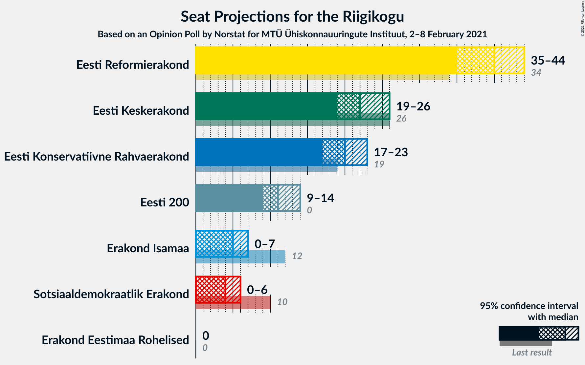
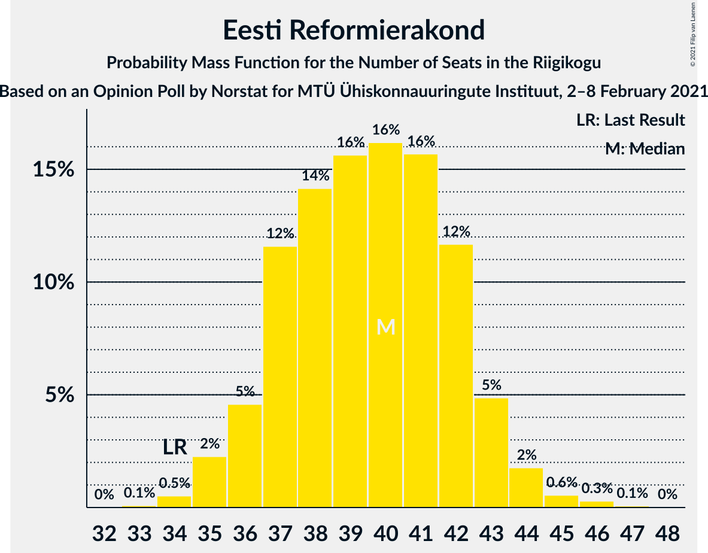
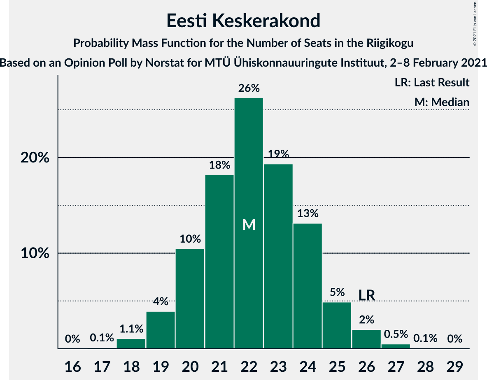
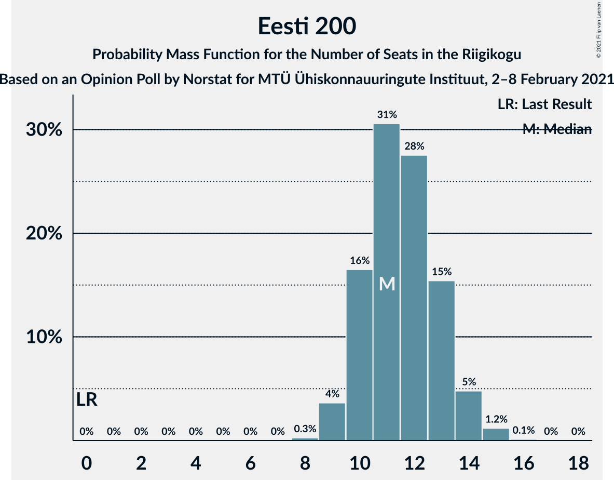
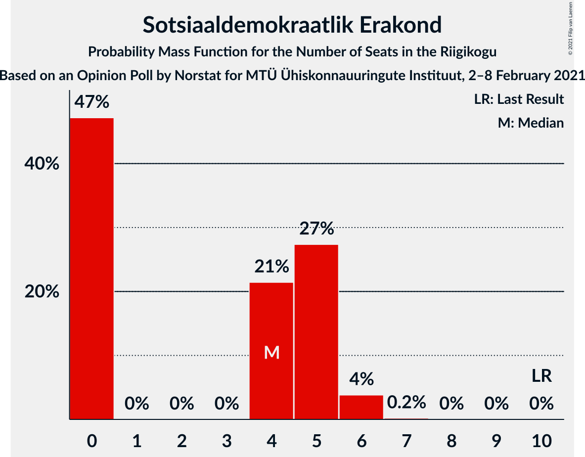
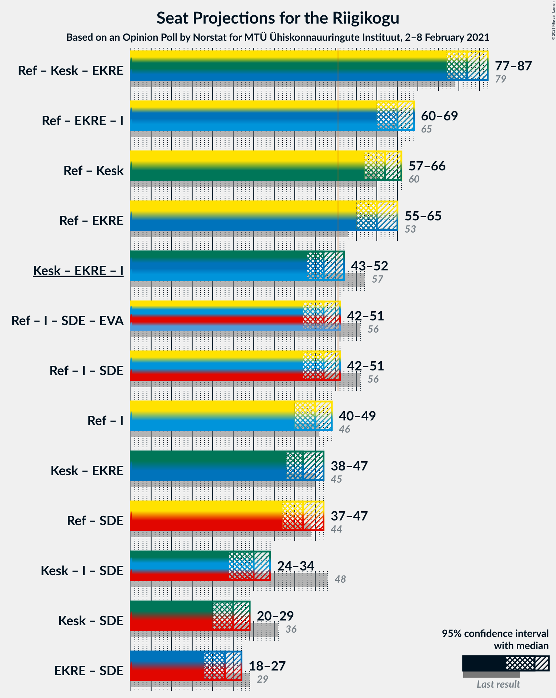
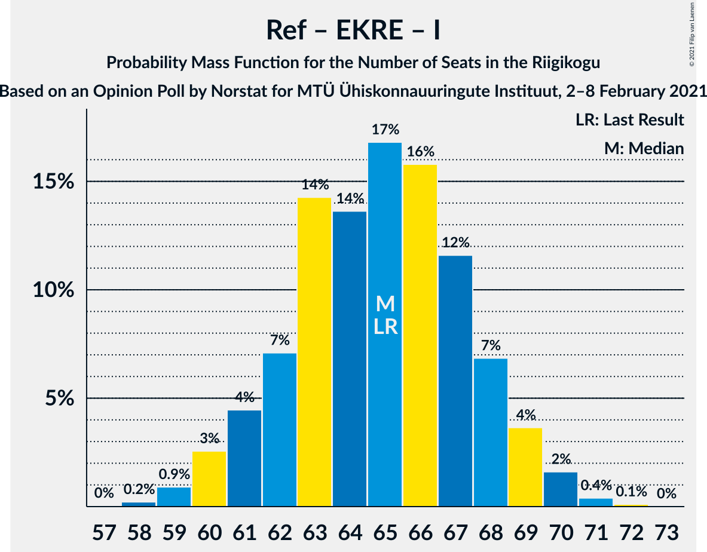

# Opinion Poll by Norstat for MTÜ Ühiskonnauuringute Instituut, 2–8 February 2021

<a href="#voting-intentions">Voting Intentions</a> | <a href="#seats">Seats</a> | <a href="#coalitions">Coalitions</a> | <a href="#technical-information">Technical Information</a>

## Voting Intentions

### Confidence Intervals

| Party | Last Result | Poll Result | 80% Confidence Interval | 90% Confidence Interval | 95% Confidence Interval | 99% Confidence Interval |
|:-----:|:-----------:|:-----------:|:-----------------------:|:-----------------------:|:-----------------------:|:-----------------------:|
| Eesti Reformierakond | 28.9% | 34.6% | 32.7–36.6% |32.2–37.1% |31.7–37.6% |30.8–38.6% |
| Eesti Keskerakond | 23.1% | 20.7% | 19.1–22.4% |18.7–22.9% |18.3–23.3% |17.6–24.2% |
| Eesti Konservatiivne Rahvaerakond | 17.8% | 19.1% | 17.6–20.8% |17.1–21.2% |16.8–21.7% |16.1–22.5% |
| Eesti 200 | 4.4% | 11.7% | 10.5–13.1% |10.1–13.5% |9.8–13.9% |9.3–14.5% |
| Erakond Isamaa | 11.4% | 6.1% | 5.2–7.2% |5.0–7.5% |4.8–7.8% |4.4–8.3% |
| Sotsiaaldemokraatlik Erakond | 9.8% | 5.0% | 4.2–6.0% |4.0–6.3% |3.8–6.5% |3.5–7.1% |
| Erakond Eestimaa Rohelised | 1.8% | 1.6% | 1.2–2.2% |1.1–2.4% |1.0–2.6% |0.8–2.9% |

*Note:* The poll result column reflects the actual value used in the calculations. Published results may vary slightly, and in addition be rounded to fewer digits.

## Seats

### Confidence Intervals

| Party | Last Result | Median | 80% Confidence Interval | 90% Confidence Interval | 95% Confidence Interval | 99% Confidence Interval |
|:-----:|:-----------:|:------:|:-----------------------:|:-----------------------:|:-----------------------:|:-----------------------:|
| <a href="#eesti-reformierakond">Eesti Reformierakond</a> | 34 | 40 | 37–42 |36–43 |35–44 |34–45 |
| <a href="#eesti-keskerakond">Eesti Keskerakond</a> | 26 | 22 | 20–24 |19–25 |19–26 |18–27 |
| <a href="#eesti-konservatiivne-rahvaerakond">Eesti Konservatiivne Rahvaerakond</a> | 19 | 20 | 18–22 |18–23 |17–23 |16–25 |
| <a href="#eesti-200">Eesti 200</a> | 0 | 11 | 10–13 |10–14 |9–14 |9–15 |
| <a href="#erakond-isamaa">Erakond Isamaa</a> | 12 | 5 | 4–6 |0–7 |0–7 |0–8 |
| <a href="#sotsiaaldemokraatlik-erakond">Sotsiaaldemokraatlik Erakond</a> | 10 | 4 | 0–5 |0–5 |0–6 |0–6 |
| <a href="#erakond-eestimaa-rohelised">Erakond Eestimaa Rohelised</a> | 0 | 0 | 0 |0 |0 |0 |

### Eesti Reformierakond

*For a full overview of the results for this party, see the [Eesti Reformierakond](party-eestireformierakond.html) page.*

| Number of Seats | Probability | Accumulated | Special Marks |
|:---------------:|:-----------:|:-----------:|:-------------:|
| 33 | 0.1% | 100% |  |
| 34 | 0.5% | 99.9% | Last Result |
| 35 | 2% | 99.4% |  |
| 36 | 5% | 97% |  |
| 37 | 12% | 93% |  |
| 38 | 14% | 81% |  |
| 39 | 16% | 67% |  |
| 40 | 16% | 51% | Median |
| 41 | 16% | 35% |  |
| 42 | 12% | 19% |  |
| 43 | 5% | 8% |  |
| 44 | 2% | 3% |  |
| 45 | 0.6% | 0.9% |  |
| 46 | 0.3% | 0.4% |  |
| 47 | 0.1% | 0.1% |  |
| 48 | 0% | 0% |  |

### Eesti Keskerakond

*For a full overview of the results for this party, see the [Eesti Keskerakond](party-eestikeskerakond.html) page.*

| Number of Seats | Probability | Accumulated | Special Marks |
|:---------------:|:-----------:|:-----------:|:-------------:|
| 17 | 0.1% | 100% |  |
| 18 | 1.1% | 99.9% |  |
| 19 | 4% | 98.8% |  |
| 20 | 10% | 95% |  |
| 21 | 18% | 84% |  |
| 22 | 26% | 66% | Median |
| 23 | 19% | 40% |  |
| 24 | 13% | 21% |  |
| 25 | 5% | 8% |  |
| 26 | 2% | 3% | Last Result |
| 27 | 0.5% | 0.6% |  |
| 28 | 0.1% | 0.1% |  |
| 29 | 0% | 0% |  |

### Eesti Konservatiivne Rahvaerakond

*For a full overview of the results for this party, see the [Eesti Konservatiivne Rahvaerakond](party-eestikonservatiivnerahvaerakond.html) page.*

| Number of Seats | Probability | Accumulated | Special Marks |
|:---------------:|:-----------:|:-----------:|:-------------:|
| 15 | 0.1% | 100% |  |
| 16 | 0.5% | 99.9% |  |
| 17 | 3% | 99.4% |  |
| 18 | 10% | 96% |  |
| 19 | 21% | 86% | Last Result |
| 20 | 25% | 65% | Median |
| 21 | 21% | 40% |  |
| 22 | 12% | 20% |  |
| 23 | 5% | 7% |  |
| 24 | 2% | 2% |  |
| 25 | 0.5% | 0.6% |  |
| 26 | 0.1% | 0.1% |  |
| 27 | 0% | 0% |  |

### Eesti 200

*For a full overview of the results for this party, see the [Eesti 200](party-eesti200.html) page.*

| Number of Seats | Probability | Accumulated | Special Marks |
|:---------------:|:-----------:|:-----------:|:-------------:|
| 0 | 0% | 100% | Last Result |
| 1 | 0% | 100% |  |
| 2 | 0% | 100% |  |
| 3 | 0% | 100% |  |
| 4 | 0% | 100% |  |
| 5 | 0% | 100% |  |
| 6 | 0% | 100% |  |
| 7 | 0% | 100% |  |
| 8 | 0.3% | 100% |  |
| 9 | 4% | 99.7% |  |
| 10 | 16% | 96% |  |
| 11 | 31% | 80% | Median |
| 12 | 28% | 49% |  |
| 13 | 15% | 22% |  |
| 14 | 5% | 6% |  |
| 15 | 1.2% | 1.3% |  |
| 16 | 0.1% | 0.1% |  |
| 17 | 0% | 0% |  |

### Erakond Isamaa

*For a full overview of the results for this party, see the [Erakond Isamaa](party-erakondisamaa.html) page.*

| Number of Seats | Probability | Accumulated | Special Marks |
|:---------------:|:-----------:|:-----------:|:-------------:|
| 0 | 7% | 100% |  |
| 1 | 0% | 93% |  |
| 2 | 0% | 93% |  |
| 3 | 0% | 93% |  |
| 4 | 7% | 93% |  |
| 5 | 43% | 86% | Median |
| 6 | 33% | 43% |  |
| 7 | 9% | 10% |  |
| 8 | 0.8% | 0.9% |  |
| 9 | 0% | 0% |  |
| 10 | 0% | 0% |  |
| 11 | 0% | 0% |  |
| 12 | 0% | 0% | Last Result |

### Sotsiaaldemokraatlik Erakond

*For a full overview of the results for this party, see the [Sotsiaaldemokraatlik Erakond](party-sotsiaaldemokraatlikerakond.html) page.*

| Number of Seats | Probability | Accumulated | Special Marks |
|:---------------:|:-----------:|:-----------:|:-------------:|
| 0 | 47% | 100% |  |
| 1 | 0% | 53% |  |
| 2 | 0% | 53% |  |
| 3 | 0% | 53% |  |
| 4 | 21% | 53% | Median |
| 5 | 27% | 31% |  |
| 6 | 4% | 4% |  |
| 7 | 0.2% | 0.2% |  |
| 8 | 0% | 0% |  |
| 9 | 0% | 0% |  |
| 10 | 0% | 0% | Last Result |

### Erakond Eestimaa Rohelised

*For a full overview of the results for this party, see the [Erakond Eestimaa Rohelised](party-erakondeestimaarohelised.html) page.*

| Number of Seats | Probability | Accumulated | Special Marks |
|:---------------:|:-----------:|:-----------:|:-------------:|
| 0 | 100% | 100% | Last Result, Median |

## Coalitions

### Confidence Intervals

| Coalition | Last Result | Median | Majority? | 80% Confidence Interval | 90% Confidence Interval | 95% Confidence Interval | 99% Confidence Interval |
|:---------:|:-----------:|:------:|:---------:|:-----------------------:|:-----------------------:|:-----------------------:|:-----------------------:|
| Eesti Reformierakond – Eesti Keskerakond – Eesti Konservatiivne Rahvaerakond | 79 | 82 | 100% | 79–85 | 78–86 | 77–87 | 76–90 |
| Eesti Reformierakond – Eesti Konservatiivne Rahvaerakond – Erakond Isamaa | 65 | 65 | 100% | 62–68 | 61–69 | 60–69 | 59–71 |
| Eesti Reformierakond – Eesti Keskerakond | 60 | 62 | 100% | 59–65 | 58–66 | 57–66 | 56–68 |
| Eesti Reformierakond – Eesti Konservatiivne Rahvaerakond | 53 | 60 | 100% | 57–63 | 56–64 | 55–65 | 54–67 |
| Eesti Keskerakond – Eesti Konservatiivne Rahvaerakond – Erakond Isamaa | 57 | 47 | 10% | 44–50 | 44–51 | 43–52 | 41–53 |
| Eesti Reformierakond – Erakond Isamaa – Sotsiaaldemokraatlik Erakond | 56 | 47 | 9% | 44–50 | 43–51 | 42–51 | 41–53 |
| Eesti Reformierakond – Erakond Isamaa | 46 | 45 | 0.4% | 42–47 | 41–48 | 40–49 | 39–50 |
| Eesti Keskerakond – Eesti Konservatiivne Rahvaerakond | 45 | 42 | 0% | 40–45 | 39–46 | 38–47 | 37–48 |
| Eesti Reformierakond – Sotsiaaldemokraatlik Erakond | 44 | 42 | 0% | 39–45 | 38–46 | 37–47 | 36–48 |
| Eesti Keskerakond – Erakond Isamaa – Sotsiaaldemokraatlik Erakond | 48 | 30 | 0% | 27–33 | 25–34 | 24–34 | 22–36 |
| Eesti Keskerakond – Sotsiaaldemokraatlik Erakond | 36 | 25 | 0% | 21–28 | 21–28 | 20–29 | 19–30 |
| Eesti Konservatiivne Rahvaerakond – Sotsiaaldemokraatlik Erakond | 29 | 23 | 0% | 19–26 | 19–26 | 18–27 | 17–28 |

### Eesti Reformierakond – Eesti Keskerakond – Eesti Konservatiivne Rahvaerakond

| Number of Seats | Probability | Accumulated | Special Marks |
|:---------------:|:-----------:|:-----------:|:-------------:|
| 75 | 0.1% | 100% |  |
| 76 | 0.7% | 99.9% |  |
| 77 | 3% | 99.3% |  |
| 78 | 5% | 97% |  |
| 79 | 8% | 92% | Last Result |
| 80 | 17% | 83% |  |
| 81 | 13% | 66% |  |
| 82 | 13% | 53% | Median |
| 83 | 12% | 40% |  |
| 84 | 14% | 28% |  |
| 85 | 7% | 14% |  |
| 86 | 3% | 7% |  |
| 87 | 1.3% | 4% |  |
| 88 | 0.6% | 2% |  |
| 89 | 1.2% | 2% |  |
| 90 | 0.4% | 0.6% |  |
| 91 | 0.1% | 0.2% |  |
| 92 | 0% | 0% |  |

### Eesti Reformierakond – Eesti Konservatiivne Rahvaerakond – Erakond Isamaa

| Number of Seats | Probability | Accumulated | Special Marks |
|:---------------:|:-----------:|:-----------:|:-------------:|
| 57 | 0% | 100% |  |
| 58 | 0.2% | 99.9% |  |
| 59 | 0.9% | 99.7% |  |
| 60 | 3% | 98.8% |  |
| 61 | 4% | 96% |  |
| 62 | 7% | 92% |  |
| 63 | 14% | 85% |  |
| 64 | 14% | 70% |  |
| 65 | 17% | 57% | Last Result, Median |
| 66 | 16% | 40% |  |
| 67 | 12% | 24% |  |
| 68 | 7% | 13% |  |
| 69 | 4% | 6% |  |
| 70 | 2% | 2% |  |
| 71 | 0.4% | 0.5% |  |
| 72 | 0.1% | 0.1% |  |
| 73 | 0% | 0% |  |

### Eesti Reformierakond – Eesti Keskerakond

| Number of Seats | Probability | Accumulated | Special Marks |
|:---------------:|:-----------:|:-----------:|:-------------:|
| 54 | 0% | 100% |  |
| 55 | 0.3% | 99.9% |  |
| 56 | 1.1% | 99.7% |  |
| 57 | 3% | 98.6% |  |
| 58 | 5% | 96% |  |
| 59 | 11% | 91% |  |
| 60 | 14% | 80% | Last Result |
| 61 | 15% | 66% |  |
| 62 | 13% | 51% | Median |
| 63 | 12% | 38% |  |
| 64 | 11% | 25% |  |
| 65 | 8% | 14% |  |
| 66 | 4% | 6% |  |
| 67 | 2% | 2% |  |
| 68 | 0.5% | 0.7% |  |
| 69 | 0.2% | 0.3% |  |
| 70 | 0.1% | 0.1% |  |
| 71 | 0% | 0% |  |

### Eesti Reformierakond – Eesti Konservatiivne Rahvaerakond

| Number of Seats | Probability | Accumulated | Special Marks |
|:---------------:|:-----------:|:-----------:|:-------------:|
| 53 | 0.2% | 100% | Last Result |
| 54 | 0.9% | 99.7% |  |
| 55 | 3% | 98.8% |  |
| 56 | 4% | 96% |  |
| 57 | 7% | 92% |  |
| 58 | 14% | 85% |  |
| 59 | 17% | 70% |  |
| 60 | 20% | 54% | Median |
| 61 | 15% | 33% |  |
| 62 | 7% | 18% |  |
| 63 | 4% | 11% |  |
| 64 | 4% | 7% |  |
| 65 | 2% | 4% |  |
| 66 | 1.1% | 2% |  |
| 67 | 0.4% | 0.6% |  |
| 68 | 0.2% | 0.2% |  |
| 69 | 0% | 0% |  |

### Eesti Keskerakond – Eesti Konservatiivne Rahvaerakond – Erakond Isamaa

| Number of Seats | Probability | Accumulated | Special Marks |
|:---------------:|:-----------:|:-----------:|:-------------:|
| 40 | 0.1% | 100% |  |
| 41 | 0.5% | 99.8% |  |
| 42 | 1.1% | 99.3% |  |
| 43 | 3% | 98% |  |
| 44 | 6% | 95% |  |
| 45 | 9% | 90% |  |
| 46 | 16% | 80% |  |
| 47 | 16% | 65% | Median |
| 48 | 15% | 49% |  |
| 49 | 16% | 34% |  |
| 50 | 9% | 19% |  |
| 51 | 5% | 10% | Majority |
| 52 | 3% | 4% |  |
| 53 | 1.1% | 2% |  |
| 54 | 0.4% | 0.4% |  |
| 55 | 0.1% | 0.1% |  |
| 56 | 0% | 0% |  |
| 57 | 0% | 0% | Last Result |

### Eesti Reformierakond – Erakond Isamaa – Sotsiaaldemokraatlik Erakond

| Number of Seats | Probability | Accumulated | Special Marks |
|:---------------:|:-----------:|:-----------:|:-------------:|
| 39 | 0.1% | 100% |  |
| 40 | 0.2% | 99.9% |  |
| 41 | 0.7% | 99.7% |  |
| 42 | 2% | 98.9% |  |
| 43 | 5% | 97% |  |
| 44 | 7% | 92% |  |
| 45 | 9% | 85% |  |
| 46 | 15% | 76% |  |
| 47 | 17% | 61% |  |
| 48 | 14% | 44% |  |
| 49 | 12% | 30% | Median |
| 50 | 9% | 17% |  |
| 51 | 6% | 9% | Majority |
| 52 | 2% | 2% |  |
| 53 | 0.5% | 0.7% |  |
| 54 | 0.1% | 0.2% |  |
| 55 | 0% | 0% |  |
| 56 | 0% | 0% | Last Result |

### Eesti Reformierakond – Erakond Isamaa

| Number of Seats | Probability | Accumulated | Special Marks |
|:---------------:|:-----------:|:-----------:|:-------------:|
| 36 | 0.1% | 100% |  |
| 37 | 0.1% | 99.9% |  |
| 38 | 0.3% | 99.8% |  |
| 39 | 0.9% | 99.6% |  |
| 40 | 3% | 98.6% |  |
| 41 | 4% | 96% |  |
| 42 | 9% | 92% |  |
| 43 | 14% | 83% |  |
| 44 | 15% | 68% |  |
| 45 | 16% | 54% | Median |
| 46 | 16% | 38% | Last Result |
| 47 | 12% | 22% |  |
| 48 | 6% | 10% |  |
| 49 | 3% | 4% |  |
| 50 | 0.9% | 1.3% |  |
| 51 | 0.3% | 0.4% | Majority |
| 52 | 0.1% | 0.1% |  |
| 53 | 0% | 0% |  |

### Eesti Keskerakond – Eesti Konservatiivne Rahvaerakond

| Number of Seats | Probability | Accumulated | Special Marks |
|:---------------:|:-----------:|:-----------:|:-------------:|
| 36 | 0.1% | 100% |  |
| 37 | 0.9% | 99.8% |  |
| 38 | 2% | 99.0% |  |
| 39 | 7% | 97% |  |
| 40 | 11% | 90% |  |
| 41 | 15% | 79% |  |
| 42 | 19% | 64% | Median |
| 43 | 16% | 45% |  |
| 44 | 14% | 30% |  |
| 45 | 8% | 16% | Last Result |
| 46 | 5% | 8% |  |
| 47 | 2% | 3% |  |
| 48 | 0.8% | 1.2% |  |
| 49 | 0.3% | 0.4% |  |
| 50 | 0.1% | 0.1% |  |
| 51 | 0% | 0% | Majority |

### Eesti Reformierakond – Sotsiaaldemokraatlik Erakond

| Number of Seats | Probability | Accumulated | Special Marks |
|:---------------:|:-----------:|:-----------:|:-------------:|
| 35 | 0.2% | 100% |  |
| 36 | 0.8% | 99.8% |  |
| 37 | 3% | 99.0% |  |
| 38 | 5% | 96% |  |
| 39 | 7% | 91% |  |
| 40 | 10% | 84% |  |
| 41 | 15% | 74% |  |
| 42 | 17% | 59% |  |
| 43 | 14% | 42% |  |
| 44 | 11% | 28% | Last Result, Median |
| 45 | 9% | 17% |  |
| 46 | 6% | 8% |  |
| 47 | 2% | 3% |  |
| 48 | 0.6% | 0.8% |  |
| 49 | 0.2% | 0.2% |  |
| 50 | 0.1% | 0.1% |  |
| 51 | 0% | 0% | Majority |

### Eesti Keskerakond – Erakond Isamaa – Sotsiaaldemokraatlik Erakond

| Number of Seats | Probability | Accumulated | Special Marks |
|:---------------:|:-----------:|:-----------:|:-------------:|
| 20 | 0.1% | 100% |  |
| 21 | 0.2% | 99.9% |  |
| 22 | 0.2% | 99.7% |  |
| 23 | 1.1% | 99.5% |  |
| 24 | 1.0% | 98% |  |
| 25 | 3% | 97% |  |
| 26 | 4% | 95% |  |
| 27 | 8% | 90% |  |
| 28 | 13% | 82% |  |
| 29 | 14% | 70% |  |
| 30 | 14% | 55% |  |
| 31 | 14% | 41% | Median |
| 32 | 14% | 27% |  |
| 33 | 7% | 13% |  |
| 34 | 4% | 5% |  |
| 35 | 1.2% | 2% |  |
| 36 | 0.5% | 0.6% |  |
| 37 | 0.1% | 0.1% |  |
| 38 | 0% | 0% |  |
| 39 | 0% | 0% |  |
| 40 | 0% | 0% |  |
| 41 | 0% | 0% |  |
| 42 | 0% | 0% |  |
| 43 | 0% | 0% |  |
| 44 | 0% | 0% |  |
| 45 | 0% | 0% |  |
| 46 | 0% | 0% |  |
| 47 | 0% | 0% |  |
| 48 | 0% | 0% | Last Result |

### Eesti Keskerakond – Sotsiaaldemokraatlik Erakond

| Number of Seats | Probability | Accumulated | Special Marks |
|:---------------:|:-----------:|:-----------:|:-------------:|
| 18 | 0.1% | 100% |  |
| 19 | 0.8% | 99.9% |  |
| 20 | 3% | 99.1% |  |
| 21 | 7% | 96% |  |
| 22 | 11% | 90% |  |
| 23 | 14% | 79% |  |
| 24 | 13% | 65% |  |
| 25 | 13% | 52% |  |
| 26 | 14% | 39% | Median |
| 27 | 12% | 25% |  |
| 28 | 8% | 12% |  |
| 29 | 3% | 5% |  |
| 30 | 1.0% | 1.4% |  |
| 31 | 0.3% | 0.4% |  |
| 32 | 0.1% | 0.1% |  |
| 33 | 0% | 0% |  |
| 34 | 0% | 0% |  |
| 35 | 0% | 0% |  |
| 36 | 0% | 0% | Last Result |

### Eesti Konservatiivne Rahvaerakond – Sotsiaaldemokraatlik Erakond

| Number of Seats | Probability | Accumulated | Special Marks |
|:---------------:|:-----------:|:-----------:|:-------------:|
| 16 | 0.1% | 100% |  |
| 17 | 0.6% | 99.9% |  |
| 18 | 3% | 99.3% |  |
| 19 | 8% | 96% |  |
| 20 | 11% | 88% |  |
| 21 | 12% | 77% |  |
| 22 | 12% | 65% |  |
| 23 | 13% | 54% |  |
| 24 | 15% | 41% | Median |
| 25 | 13% | 25% |  |
| 26 | 7% | 12% |  |
| 27 | 3% | 5% |  |
| 28 | 1.3% | 2% |  |
| 29 | 0.3% | 0.3% | Last Result |
| 30 | 0% | 0.1% |  |
| 31 | 0% | 0% |  |

## Technical Information

### Opinion Poll

+ **Polling firm:** Norstat
+ **Commissioner(s):** MTÜ Ühiskonnauuringute Instituut
+ **Fieldwork period:** 2–8 February 2021

### Calculations

+ **Sample size:** 1000
+ **Simulations done:** 1,048,576
+ **Error estimate:** 1.25%

