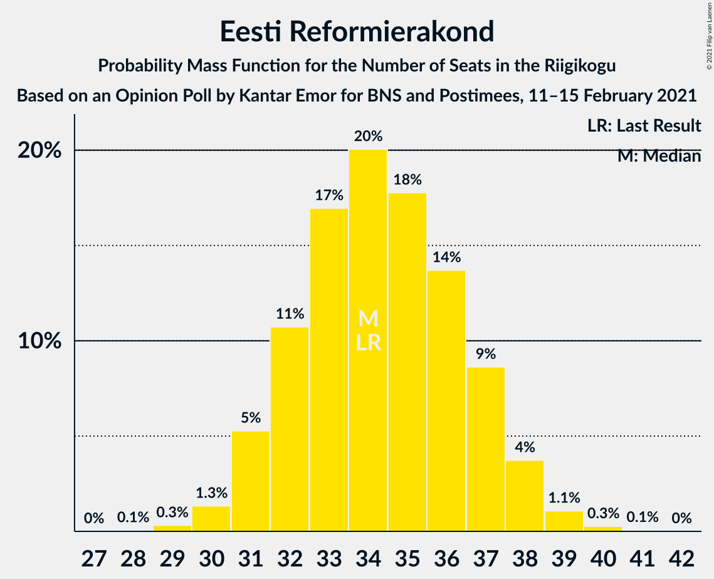
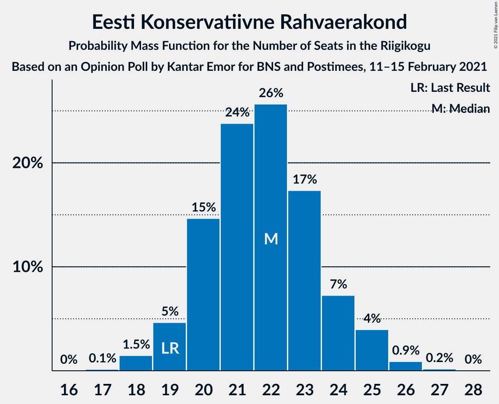
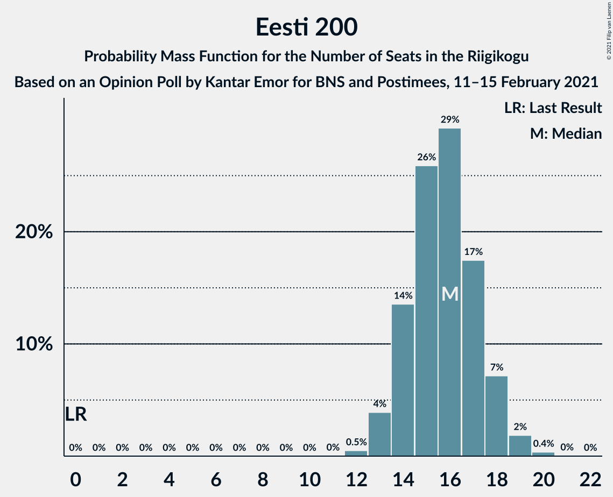

# Opinion Poll by Kantar Emor for BNS and Postimees, 11–15 February 2021

<a href="#voting-intentions">Voting Intentions</a> | <a href="#seats">Seats</a> | <a href="#coalitions">Coalitions</a> | <a href="#technical-information">Technical Information</a>

## Voting Intentions

### Confidence Intervals

| Party | Last Result | Poll Result | 80% Confidence Interval | 90% Confidence Interval | 95% Confidence Interval | 99% Confidence Interval |
|:-----:|:-----------:|:-----------:|:-----------------------:|:-----------------------:|:-----------------------:|:-----------------------:|
| Eesti Reformierakond | 28.9% | 30.0% | 28.3–31.8% |27.8–32.3% |27.4–32.7% |26.6–33.6% |
| Eesti Konservatiivne Rahvaerakond | 17.8% | 20.0% | 18.5–21.6% |18.1–22.1% |17.8–22.5% |17.1–23.2% |
| Eesti Keskerakond | 23.1% | 17.0% | 15.6–18.5% |15.2–18.9% |14.9–19.3% |14.3–20.0% |
| Eesti 200 | 4.4% | 15.0% | 13.7–16.5% |13.4–16.9% |13.1–17.3% |12.5–18.0% |
| Sotsiaaldemokraatlik Erakond | 9.8% | 9.0% | 8.0–10.2% |7.7–10.5% |7.5–10.8% |7.0–11.4% |
| Erakond Isamaa | 11.4% | 5.0% | 4.2–5.9% |4.0–6.2% |3.9–6.4% |3.5–6.9% |
| Erakond Eestimaa Rohelised | 1.8% | 2.0% | 1.5–2.6% |1.4–2.8% |1.3–3.0% |1.1–3.3% |

*Note:* The poll result column reflects the actual value used in the calculations. Published results may vary slightly, and in addition be rounded to fewer digits.

## Seats

### Confidence Intervals

| Party | Last Result | Median | 80% Confidence Interval | 90% Confidence Interval | 95% Confidence Interval | 99% Confidence Interval |
|:-----:|:-----------:|:------:|:-----------------------:|:-----------------------:|:-----------------------:|:-----------------------:|
| <a href="#eesti-reformierakond">Eesti Reformierakond</a> | 34 | 34 | 32–37 |31–38 |31–38 |30–39 |
| <a href="#eesti-konservatiivne-rahvaerakond">Eesti Konservatiivne Rahvaerakond</a> | 19 | 22 | 20–24 |19–25 |19–25 |18–26 |
| <a href="#eesti-keskerakond">Eesti Keskerakond</a> | 26 | 18 | 16–20 |16–21 |15–21 |15–22 |
| <a href="#eesti-200">Eesti 200</a> | 0 | 16 | 14–17 |14–18 |13–18 |12–19 |
| <a href="#sotsiaaldemokraatlik-erakond">Sotsiaaldemokraatlik Erakond</a> | 10 | 9 | 7–10 |7–10 |7–11 |6–11 |
| <a href="#erakond-isamaa">Erakond Isamaa</a> | 12 | 4 | 0–5 |0–5 |0–6 |0–6 |
| <a href="#erakond-eestimaa-rohelised">Erakond Eestimaa Rohelised</a> | 0 | 0 | 0 |0 |0 |0 |

### Eesti Reformierakond

*For a full overview of the results for this party, see the [Eesti Reformierakond](party-eestireformierakond.html) page.*

| Number of Seats | Probability | Accumulated | Special Marks |
|:---------------:|:-----------:|:-----------:|:-------------:|
| 28 | 0.1% | 100% |  |
| 29 | 0.3% | 99.9% |  |
| 30 | 1.3% | 99.6% |  |
| 31 | 5% | 98% |  |
| 32 | 11% | 93% |  |
| 33 | 17% | 82% |  |
| 34 | 20% | 65% | Last Result, Median |
| 35 | 18% | 45% |  |
| 36 | 14% | 27% |  |
| 37 | 9% | 14% |  |
| 38 | 4% | 5% |  |
| 39 | 1.1% | 1.4% |  |
| 40 | 0.3% | 0.3% |  |
| 41 | 0.1% | 0.1% |  |
| 42 | 0% | 0% |  |

### Eesti Konservatiivne Rahvaerakond

*For a full overview of the results for this party, see the [Eesti Konservatiivne Rahvaerakond](party-eestikonservatiivnerahvaerakond.html) page.*

| Number of Seats | Probability | Accumulated | Special Marks |
|:---------------:|:-----------:|:-----------:|:-------------:|
| 17 | 0.1% | 100% |  |
| 18 | 1.5% | 99.8% |  |
| 19 | 5% | 98% | Last Result |
| 20 | 15% | 94% |  |
| 21 | 24% | 79% |  |
| 22 | 26% | 55% | Median |
| 23 | 17% | 30% |  |
| 24 | 7% | 12% |  |
| 25 | 4% | 5% |  |
| 26 | 0.9% | 1.1% |  |
| 27 | 0.2% | 0.2% |  |
| 28 | 0% | 0% |  |

### Eesti Keskerakond

*For a full overview of the results for this party, see the [Eesti Keskerakond](party-eestikeskerakond.html) page.*

| Number of Seats | Probability | Accumulated | Special Marks |
|:---------------:|:-----------:|:-----------:|:-------------:|
| 14 | 0.3% | 100% |  |
| 15 | 3% | 99.6% |  |
| 16 | 10% | 97% |  |
| 17 | 21% | 87% |  |
| 18 | 28% | 66% | Median |
| 19 | 21% | 37% |  |
| 20 | 11% | 16% |  |
| 21 | 4% | 5% |  |
| 22 | 0.8% | 0.9% |  |
| 23 | 0.1% | 0.1% |  |
| 24 | 0% | 0% |  |
| 25 | 0% | 0% |  |
| 26 | 0% | 0% | Last Result |

### Eesti 200

*For a full overview of the results for this party, see the [Eesti 200](party-eesti200.html) page.*

| Number of Seats | Probability | Accumulated | Special Marks |
|:---------------:|:-----------:|:-----------:|:-------------:|
| 0 | 0% | 100% | Last Result |
| 1 | 0% | 100% |  |
| 2 | 0% | 100% |  |
| 3 | 0% | 100% |  |
| 4 | 0% | 100% |  |
| 5 | 0% | 100% |  |
| 6 | 0% | 100% |  |
| 7 | 0% | 100% |  |
| 8 | 0% | 100% |  |
| 9 | 0% | 100% |  |
| 10 | 0% | 100% |  |
| 11 | 0% | 100% |  |
| 12 | 0.5% | 100% |  |
| 13 | 4% | 99.5% |  |
| 14 | 14% | 96% |  |
| 15 | 26% | 82% |  |
| 16 | 29% | 56% | Median |
| 17 | 17% | 27% |  |
| 18 | 7% | 9% |  |
| 19 | 2% | 2% |  |
| 20 | 0.4% | 0.4% |  |
| 21 | 0% | 0% |  |

### Sotsiaaldemokraatlik Erakond

*For a full overview of the results for this party, see the [Sotsiaaldemokraatlik Erakond](party-sotsiaaldemokraatlikerakond.html) page.*

| Number of Seats | Probability | Accumulated | Special Marks |
|:---------------:|:-----------:|:-----------:|:-------------:|
| 6 | 0.9% | 100% |  |
| 7 | 11% | 99.1% |  |
| 8 | 31% | 88% |  |
| 9 | 36% | 57% | Median |
| 10 | 17% | 21% | Last Result |
| 11 | 4% | 4% |  |
| 12 | 0.4% | 0.5% |  |
| 13 | 0% | 0% |  |

### Erakond Isamaa

*For a full overview of the results for this party, see the [Erakond Isamaa](party-erakondisamaa.html) page.*

| Number of Seats | Probability | Accumulated | Special Marks |
|:---------------:|:-----------:|:-----------:|:-------------:|
| 0 | 49% | 100% |  |
| 1 | 0% | 51% |  |
| 2 | 0% | 51% |  |
| 3 | 0% | 51% |  |
| 4 | 18% | 51% | Median |
| 5 | 29% | 33% |  |
| 6 | 4% | 4% |  |
| 7 | 0.2% | 0.2% |  |
| 8 | 0% | 0% |  |
| 9 | 0% | 0% |  |
| 10 | 0% | 0% |  |
| 11 | 0% | 0% |  |
| 12 | 0% | 0% | Last Result |

### Erakond Eestimaa Rohelised

*For a full overview of the results for this party, see the [Erakond Eestimaa Rohelised](party-erakondeestimaarohelised.html) page.*

| Number of Seats | Probability | Accumulated | Special Marks |
|:---------------:|:-----------:|:-----------:|:-------------:|
| 0 | 100% | 100% | Last Result, Median |

## Coalitions

### Confidence Intervals

| Coalition | Last Result | Median | Majority? | 80% Confidence Interval | 90% Confidence Interval | 95% Confidence Interval | 99% Confidence Interval |
|:---------:|:-----------:|:------:|:---------:|:-----------------------:|:-----------------------:|:-----------------------:|:-----------------------:|
| Eesti Reformierakond – Eesti Konservatiivne Rahvaerakond – Eesti Keskerakond | 79 | 74 | 100% | 71–77 | 70–78 | 70–79 | 69–79 |
| Eesti Reformierakond – Eesti Konservatiivne Rahvaerakond – Erakond Isamaa | 65 | 59 | 100% | 56–61 | 55–62 | 54–62 | 53–63 |
| Eesti Reformierakond – Eesti Konservatiivne Rahvaerakond | 53 | 56 | 99.7% | 53–59 | 52–60 | 52–60 | 51–62 |
| Eesti Reformierakond – Eesti Keskerakond | 60 | 52 | 80% | 50–55 | 49–56 | 48–57 | 47–58 |
| Eesti Reformierakond – Sotsiaaldemokraatlik Erakond – Erakond Isamaa | 56 | 46 | 0.9% | 43–48 | 42–49 | 41–50 | 40–51 |
| Eesti Reformierakond – Sotsiaaldemokraatlik Erakond | 44 | 43 | 0% | 40–46 | 40–47 | 39–47 | 38–48 |
| Eesti Konservatiivne Rahvaerakond – Eesti Keskerakond – Erakond Isamaa | 57 | 42 | 0% | 39–45 | 39–46 | 38–47 | 37–48 |
| Eesti Konservatiivne Rahvaerakond – Eesti Keskerakond | 45 | 40 | 0% | 37–42 | 36–43 | 36–44 | 35–45 |
| Eesti Reformierakond – Erakond Isamaa | 46 | 37 | 0% | 34–40 | 33–41 | 32–41 | 31–42 |
| Eesti Konservatiivne Rahvaerakond – Sotsiaaldemokraatlik Erakond | 29 | 30 | 0% | 28–33 | 28–33 | 27–34 | 26–35 |
| Eesti Keskerakond – Sotsiaaldemokraatlik Erakond – Erakond Isamaa | 48 | 29 | 0% | 26–32 | 25–33 | 25–33 | 24–35 |
| Eesti Keskerakond – Sotsiaaldemokraatlik Erakond | 36 | 27 | 0% | 25–29 | 24–30 | 24–30 | 23–31 |

### Eesti Reformierakond – Eesti Konservatiivne Rahvaerakond – Eesti Keskerakond

| Number of Seats | Probability | Accumulated | Special Marks |
|:---------------:|:-----------:|:-----------:|:-------------:|
| 68 | 0.3% | 100% |  |
| 69 | 1.4% | 99.6% |  |
| 70 | 4% | 98% |  |
| 71 | 10% | 95% |  |
| 72 | 13% | 84% |  |
| 73 | 12% | 71% |  |
| 74 | 13% | 59% | Median |
| 75 | 16% | 46% |  |
| 76 | 12% | 31% |  |
| 77 | 10% | 19% |  |
| 78 | 5% | 8% |  |
| 79 | 2% | 3% | Last Result |
| 80 | 0.4% | 0.5% |  |
| 81 | 0% | 0% |  |

### Eesti Reformierakond – Eesti Konservatiivne Rahvaerakond – Erakond Isamaa

| Number of Seats | Probability | Accumulated | Special Marks |
|:---------------:|:-----------:|:-----------:|:-------------:|
| 52 | 0.1% | 100% |  |
| 53 | 0.6% | 99.9% |  |
| 54 | 2% | 99.3% |  |
| 55 | 6% | 97% |  |
| 56 | 9% | 92% |  |
| 57 | 14% | 83% |  |
| 58 | 19% | 69% |  |
| 59 | 18% | 50% |  |
| 60 | 16% | 32% | Median |
| 61 | 9% | 16% |  |
| 62 | 5% | 7% |  |
| 63 | 2% | 2% |  |
| 64 | 0.4% | 0.5% |  |
| 65 | 0.1% | 0.1% | Last Result |
| 66 | 0% | 0% |  |

### Eesti Reformierakond – Eesti Konservatiivne Rahvaerakond

| Number of Seats | Probability | Accumulated | Special Marks |
|:---------------:|:-----------:|:-----------:|:-------------:|
| 49 | 0.1% | 100% |  |
| 50 | 0.3% | 99.9% |  |
| 51 | 1.4% | 99.7% | Majority |
| 52 | 4% | 98% |  |
| 53 | 8% | 94% | Last Result |
| 54 | 12% | 86% |  |
| 55 | 16% | 74% |  |
| 56 | 16% | 58% | Median |
| 57 | 15% | 43% |  |
| 58 | 12% | 27% |  |
| 59 | 8% | 15% |  |
| 60 | 5% | 7% |  |
| 61 | 1.3% | 2% |  |
| 62 | 0.5% | 0.7% |  |
| 63 | 0.1% | 0.1% |  |
| 64 | 0% | 0% |  |

### Eesti Reformierakond – Eesti Keskerakond

| Number of Seats | Probability | Accumulated | Special Marks |
|:---------------:|:-----------:|:-----------:|:-------------:|
| 46 | 0.2% | 100% |  |
| 47 | 0.7% | 99.8% |  |
| 48 | 3% | 99.1% |  |
| 49 | 6% | 96% |  |
| 50 | 11% | 91% |  |
| 51 | 15% | 80% | Majority |
| 52 | 16% | 65% | Median |
| 53 | 18% | 49% |  |
| 54 | 14% | 31% |  |
| 55 | 8% | 17% |  |
| 56 | 5% | 9% |  |
| 57 | 2% | 3% |  |
| 58 | 0.7% | 1.0% |  |
| 59 | 0.2% | 0.2% |  |
| 60 | 0% | 0% | Last Result |

### Eesti Reformierakond – Sotsiaaldemokraatlik Erakond – Erakond Isamaa

| Number of Seats | Probability | Accumulated | Special Marks |
|:---------------:|:-----------:|:-----------:|:-------------:|
| 39 | 0.2% | 100% |  |
| 40 | 1.0% | 99.8% |  |
| 41 | 3% | 98.8% |  |
| 42 | 5% | 96% |  |
| 43 | 10% | 91% |  |
| 44 | 14% | 81% |  |
| 45 | 16% | 67% |  |
| 46 | 19% | 51% |  |
| 47 | 15% | 32% | Median |
| 48 | 9% | 17% |  |
| 49 | 5% | 8% |  |
| 50 | 3% | 3% |  |
| 51 | 0.7% | 0.9% | Majority |
| 52 | 0.1% | 0.2% |  |
| 53 | 0% | 0% |  |
| 54 | 0% | 0% |  |
| 55 | 0% | 0% |  |
| 56 | 0% | 0% | Last Result |

### Eesti Reformierakond – Sotsiaaldemokraatlik Erakond

| Number of Seats | Probability | Accumulated | Special Marks |
|:---------------:|:-----------:|:-----------:|:-------------:|
| 37 | 0.2% | 100% |  |
| 38 | 0.8% | 99.8% |  |
| 39 | 2% | 99.0% |  |
| 40 | 8% | 96% |  |
| 41 | 12% | 88% |  |
| 42 | 19% | 77% |  |
| 43 | 18% | 58% | Median |
| 44 | 15% | 39% | Last Result |
| 45 | 11% | 25% |  |
| 46 | 8% | 13% |  |
| 47 | 4% | 6% |  |
| 48 | 1.1% | 1.4% |  |
| 49 | 0.2% | 0.3% |  |
| 50 | 0.1% | 0.1% |  |
| 51 | 0% | 0% | Majority |

### Eesti Konservatiivne Rahvaerakond – Eesti Keskerakond – Erakond Isamaa

| Number of Seats | Probability | Accumulated | Special Marks |
|:---------------:|:-----------:|:-----------:|:-------------:|
| 36 | 0.3% | 100% |  |
| 37 | 1.4% | 99.7% |  |
| 38 | 2% | 98% |  |
| 39 | 10% | 97% |  |
| 40 | 9% | 86% |  |
| 41 | 14% | 77% |  |
| 42 | 14% | 62% |  |
| 43 | 19% | 48% |  |
| 44 | 13% | 30% | Median |
| 45 | 9% | 17% |  |
| 46 | 5% | 7% |  |
| 47 | 2% | 3% |  |
| 48 | 0.4% | 0.5% |  |
| 49 | 0.1% | 0.1% |  |
| 50 | 0% | 0% |  |
| 51 | 0% | 0% | Majority |
| 52 | 0% | 0% |  |
| 53 | 0% | 0% |  |
| 54 | 0% | 0% |  |
| 55 | 0% | 0% |  |
| 56 | 0% | 0% |  |
| 57 | 0% | 0% | Last Result |

### Eesti Konservatiivne Rahvaerakond – Eesti Keskerakond

| Number of Seats | Probability | Accumulated | Special Marks |
|:---------------:|:-----------:|:-----------:|:-------------:|
| 33 | 0% | 100% |  |
| 34 | 0.2% | 99.9% |  |
| 35 | 1.0% | 99.8% |  |
| 36 | 4% | 98.8% |  |
| 37 | 7% | 95% |  |
| 38 | 9% | 88% |  |
| 39 | 26% | 79% |  |
| 40 | 17% | 53% | Median |
| 41 | 15% | 36% |  |
| 42 | 12% | 21% |  |
| 43 | 6% | 9% |  |
| 44 | 2% | 3% |  |
| 45 | 1.0% | 1.3% | Last Result |
| 46 | 0.2% | 0.3% |  |
| 47 | 0% | 0% |  |

### Eesti Reformierakond – Erakond Isamaa

| Number of Seats | Probability | Accumulated | Special Marks |
|:---------------:|:-----------:|:-----------:|:-------------:|
| 30 | 0.1% | 100% |  |
| 31 | 0.7% | 99.9% |  |
| 32 | 2% | 99.2% |  |
| 33 | 6% | 97% |  |
| 34 | 9% | 91% |  |
| 35 | 13% | 83% |  |
| 36 | 14% | 69% |  |
| 37 | 17% | 55% |  |
| 38 | 17% | 38% | Median |
| 39 | 10% | 22% |  |
| 40 | 6% | 12% |  |
| 41 | 4% | 6% |  |
| 42 | 1.2% | 2% |  |
| 43 | 0.3% | 0.3% |  |
| 44 | 0% | 0.1% |  |
| 45 | 0% | 0% |  |
| 46 | 0% | 0% | Last Result |

### Eesti Konservatiivne Rahvaerakond – Sotsiaaldemokraatlik Erakond

| Number of Seats | Probability | Accumulated | Special Marks |
|:---------------:|:-----------:|:-----------:|:-------------:|
| 25 | 0.1% | 100% |  |
| 26 | 1.0% | 99.8% |  |
| 27 | 4% | 98.8% |  |
| 28 | 9% | 95% |  |
| 29 | 16% | 86% | Last Result |
| 30 | 21% | 70% |  |
| 31 | 23% | 49% | Median |
| 32 | 14% | 27% |  |
| 33 | 8% | 13% |  |
| 34 | 3% | 5% |  |
| 35 | 1.3% | 2% |  |
| 36 | 0.2% | 0.3% |  |
| 37 | 0% | 0% |  |

### Eesti Keskerakond – Sotsiaaldemokraatlik Erakond – Erakond Isamaa

| Number of Seats | Probability | Accumulated | Special Marks |
|:---------------:|:-----------:|:-----------:|:-------------:|
| 23 | 0.3% | 100% |  |
| 24 | 1.3% | 99.7% |  |
| 25 | 4% | 98% |  |
| 26 | 8% | 94% |  |
| 27 | 12% | 86% |  |
| 28 | 13% | 74% |  |
| 29 | 14% | 61% |  |
| 30 | 16% | 47% |  |
| 31 | 13% | 31% | Median |
| 32 | 10% | 18% |  |
| 33 | 6% | 8% |  |
| 34 | 2% | 2% |  |
| 35 | 0.4% | 0.5% |  |
| 36 | 0.1% | 0.1% |  |
| 37 | 0% | 0% |  |
| 38 | 0% | 0% |  |
| 39 | 0% | 0% |  |
| 40 | 0% | 0% |  |
| 41 | 0% | 0% |  |
| 42 | 0% | 0% |  |
| 43 | 0% | 0% |  |
| 44 | 0% | 0% |  |
| 45 | 0% | 0% |  |
| 46 | 0% | 0% |  |
| 47 | 0% | 0% |  |
| 48 | 0% | 0% | Last Result |

### Eesti Keskerakond – Sotsiaaldemokraatlik Erakond

| Number of Seats | Probability | Accumulated | Special Marks |
|:---------------:|:-----------:|:-----------:|:-------------:|
| 22 | 0.4% | 100% |  |
| 23 | 2% | 99.6% |  |
| 24 | 6% | 98% |  |
| 25 | 14% | 91% |  |
| 26 | 21% | 77% |  |
| 27 | 23% | 56% | Median |
| 28 | 18% | 33% |  |
| 29 | 9% | 16% |  |
| 30 | 5% | 6% |  |
| 31 | 1.4% | 2% |  |
| 32 | 0.2% | 0.3% |  |
| 33 | 0% | 0% |  |
| 34 | 0% | 0% |  |
| 35 | 0% | 0% |  |
| 36 | 0% | 0% | Last Result |

## Technical Information

### Opinion Poll

+ **Polling firm:** Kantar Emor
+ **Commissioner(s):** BNS and Postimees
+ **Fieldwork period:** 11–15 February 2021

### Calculations

+ **Sample size:** 1124
+ **Simulations done:** 1,048,576
+ **Error estimate:** 0.44%

