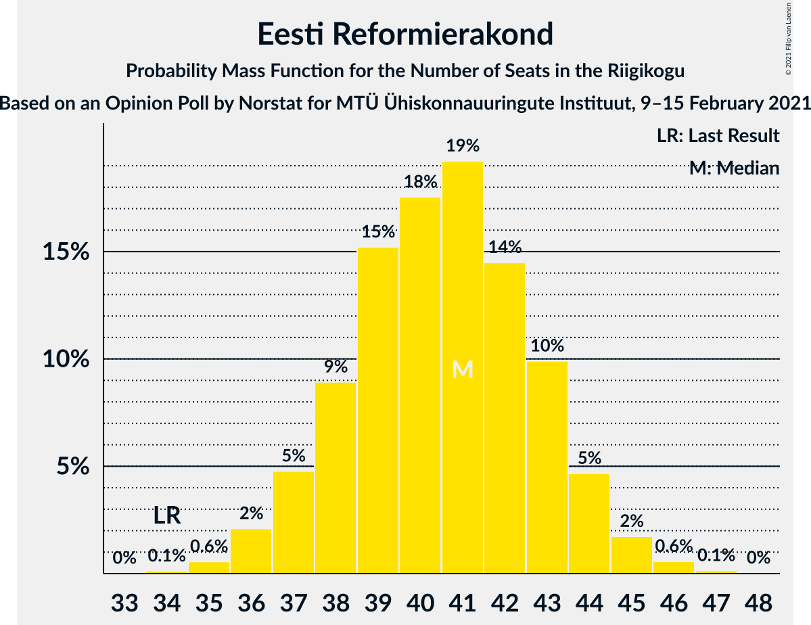
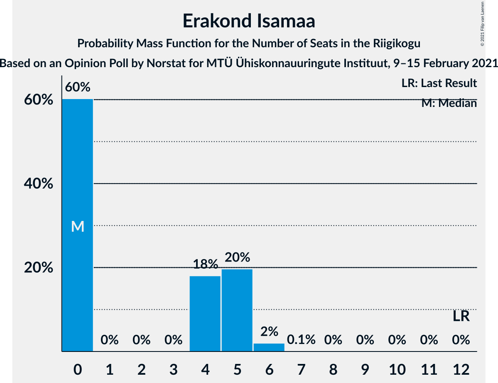

# Opinion Poll by Norstat for MTÜ Ühiskonnauuringute Instituut, 9–15 February 2021

<a href="#voting-intentions">Voting Intentions</a> | <a href="#seats">Seats</a> | <a href="#coalitions">Coalitions</a> | <a href="#technical-information">Technical Information</a>

## Voting Intentions

### Confidence Intervals

| Party | Last Result | Poll Result | 80% Confidence Interval | 90% Confidence Interval | 95% Confidence Interval | 99% Confidence Interval |
|:-----:|:-----------:|:-----------:|:-----------------------:|:-----------------------:|:-----------------------:|:-----------------------:|
| Eesti Reformierakond | 28.9% | 35.2% | 33.3–37.2% |32.8–37.7% |32.3–38.2% |31.4–39.2% |
| Eesti Konservatiivne Rahvaerakond | 17.8% | 20.2% | 18.6–21.9% |18.2–22.4% |17.8–22.8% |17.1–23.6% |
| Eesti Keskerakond | 23.1% | 15.5% | 14.1–17.1% |13.7–17.5% |13.4–17.9% |12.7–18.7% |
| Eesti 200 | 4.4% | 13.7% | 12.4–15.2% |12.0–15.6% |11.7–16.0% |11.1–16.7% |
| Sotsiaaldemokraatlik Erakond | 9.8% | 7.6% | 6.6–8.8% |6.3–9.1% |6.1–9.4% |5.7–10.0% |
| Erakond Isamaa | 11.4% | 4.8% | 4.0–5.8% |3.8–6.1% |3.6–6.3% |3.3–6.8% |
| Erakond Eestimaa Rohelised | 1.8% | 1.9% | 1.4–2.6% |1.3–2.8% |1.2–3.0% |1.0–3.3% |

*Note:* The poll result column reflects the actual value used in the calculations. Published results may vary slightly, and in addition be rounded to fewer digits.

## Seats

### Confidence Intervals

| Party | Last Result | Median | 80% Confidence Interval | 90% Confidence Interval | 95% Confidence Interval | 99% Confidence Interval |
|:-----:|:-----------:|:------:|:-----------------------:|:-----------------------:|:-----------------------:|:-----------------------:|
| <a href="#eesti-reformierakond">Eesti Reformierakond</a> | 34 | 41 | 38–43 |37–44 |36–44 |35–46 |
| <a href="#eesti-konservatiivne-rahvaerakond">Eesti Konservatiivne Rahvaerakond</a> | 19 | 22 | 20–24 |19–24 |19–25 |18–26 |
| <a href="#eesti-keskerakond">Eesti Keskerakond</a> | 26 | 16 | 14–18 |14–18 |13–19 |13–20 |
| <a href="#eesti-200">Eesti 200</a> | 0 | 14 | 12–16 |12–16 |11–17 |11–17 |
| <a href="#sotsiaaldemokraatlik-erakond">Sotsiaaldemokraatlik Erakond</a> | 10 | 7 | 6–8 |6–9 |5–9 |5–10 |
| <a href="#erakond-isamaa">Erakond Isamaa</a> | 12 | 0 | 0–5 |0–5 |0–5 |0–6 |
| <a href="#erakond-eestimaa-rohelised">Erakond Eestimaa Rohelised</a> | 0 | 0 | 0 |0 |0 |0 |

### Eesti Reformierakond

*For a full overview of the results for this party, see the [Eesti Reformierakond](party-eestireformierakond.html) page.*

| Number of Seats | Probability | Accumulated | Special Marks |
|:---------------:|:-----------:|:-----------:|:-------------:|
| 34 | 0.1% | 100% | Last Result |
| 35 | 0.6% | 99.9% |  |
| 36 | 2% | 99.3% |  |
| 37 | 5% | 97% |  |
| 38 | 9% | 92% |  |
| 39 | 15% | 84% |  |
| 40 | 18% | 68% |  |
| 41 | 19% | 51% | Median |
| 42 | 14% | 32% |  |
| 43 | 10% | 17% |  |
| 44 | 5% | 7% |  |
| 45 | 2% | 2% |  |
| 46 | 0.6% | 0.7% |  |
| 47 | 0.1% | 0.2% |  |
| 48 | 0% | 0% |  |

### Eesti Konservatiivne Rahvaerakond

*For a full overview of the results for this party, see the [Eesti Konservatiivne Rahvaerakond](party-eestikonservatiivnerahvaerakond.html) page.*

| Number of Seats | Probability | Accumulated | Special Marks |
|:---------------:|:-----------:|:-----------:|:-------------:|
| 17 | 0.3% | 100% |  |
| 18 | 2% | 99.7% |  |
| 19 | 7% | 98% | Last Result |
| 20 | 14% | 91% |  |
| 21 | 25% | 77% |  |
| 22 | 21% | 52% | Median |
| 23 | 17% | 30% |  |
| 24 | 10% | 14% |  |
| 25 | 3% | 4% |  |
| 26 | 0.9% | 1.1% |  |
| 27 | 0.2% | 0.2% |  |
| 28 | 0% | 0% |  |

### Eesti Keskerakond

*For a full overview of the results for this party, see the [Eesti Keskerakond](party-eestikeskerakond.html) page.*

| Number of Seats | Probability | Accumulated | Special Marks |
|:---------------:|:-----------:|:-----------:|:-------------:|
| 12 | 0.3% | 100% |  |
| 13 | 3% | 99.6% |  |
| 14 | 11% | 97% |  |
| 15 | 23% | 86% |  |
| 16 | 24% | 63% | Median |
| 17 | 24% | 39% |  |
| 18 | 11% | 16% |  |
| 19 | 4% | 5% |  |
| 20 | 0.7% | 0.9% |  |
| 21 | 0.1% | 0.2% |  |
| 22 | 0% | 0% |  |
| 23 | 0% | 0% |  |
| 24 | 0% | 0% |  |
| 25 | 0% | 0% |  |
| 26 | 0% | 0% | Last Result |

### Eesti 200

*For a full overview of the results for this party, see the [Eesti 200](party-eesti200.html) page.*

| Number of Seats | Probability | Accumulated | Special Marks |
|:---------------:|:-----------:|:-----------:|:-------------:|
| 0 | 0% | 100% | Last Result |
| 1 | 0% | 100% |  |
| 2 | 0% | 100% |  |
| 3 | 0% | 100% |  |
| 4 | 0% | 100% |  |
| 5 | 0% | 100% |  |
| 6 | 0% | 100% |  |
| 7 | 0% | 100% |  |
| 8 | 0% | 100% |  |
| 9 | 0% | 100% |  |
| 10 | 0.2% | 100% |  |
| 11 | 3% | 99.8% |  |
| 12 | 11% | 97% |  |
| 13 | 24% | 86% |  |
| 14 | 30% | 62% | Median |
| 15 | 21% | 32% |  |
| 16 | 8% | 12% |  |
| 17 | 3% | 3% |  |
| 18 | 0.4% | 0.5% |  |
| 19 | 0% | 0.1% |  |
| 20 | 0% | 0% |  |

### Sotsiaaldemokraatlik Erakond

*For a full overview of the results for this party, see the [Sotsiaaldemokraatlik Erakond](party-sotsiaaldemokraatlikerakond.html) page.*

| Number of Seats | Probability | Accumulated | Special Marks |
|:---------------:|:-----------:|:-----------:|:-------------:|
| 4 | 0.1% | 100% |  |
| 5 | 4% | 99.9% |  |
| 6 | 25% | 96% |  |
| 7 | 41% | 70% | Median |
| 8 | 23% | 30% |  |
| 9 | 6% | 7% |  |
| 10 | 0.8% | 0.9% | Last Result |
| 11 | 0.1% | 0.1% |  |
| 12 | 0% | 0% |  |

### Erakond Isamaa

*For a full overview of the results for this party, see the [Erakond Isamaa](party-erakondisamaa.html) page.*

| Number of Seats | Probability | Accumulated | Special Marks |
|:---------------:|:-----------:|:-----------:|:-------------:|
| 0 | 60% | 100% | Median |
| 1 | 0% | 40% |  |
| 2 | 0% | 40% |  |
| 3 | 0% | 40% |  |
| 4 | 18% | 40% |  |
| 5 | 20% | 22% |  |
| 6 | 2% | 2% |  |
| 7 | 0.1% | 0.1% |  |
| 8 | 0% | 0% |  |
| 9 | 0% | 0% |  |
| 10 | 0% | 0% |  |
| 11 | 0% | 0% |  |
| 12 | 0% | 0% | Last Result |

### Erakond Eestimaa Rohelised

*For a full overview of the results for this party, see the [Erakond Eestimaa Rohelised](party-erakondeestimaarohelised.html) page.*

| Number of Seats | Probability | Accumulated | Special Marks |
|:---------------:|:-----------:|:-----------:|:-------------:|
| 0 | 100% | 100% | Last Result, Median |

## Coalitions

### Confidence Intervals

| Coalition | Last Result | Median | Majority? | 80% Confidence Interval | 90% Confidence Interval | 95% Confidence Interval | 99% Confidence Interval |
|:---------:|:-----------:|:------:|:---------:|:-----------------------:|:-----------------------:|:-----------------------:|:-----------------------:|
| Eesti Reformierakond – Eesti Konservatiivne Rahvaerakond – Eesti Keskerakond | 79 | 78 | 100% | 75–81 | 74–82 | 74–82 | 72–83 |
| Eesti Reformierakond – Eesti Konservatiivne Rahvaerakond – Erakond Isamaa | 65 | 64 | 100% | 61–67 | 61–67 | 60–68 | 59–69 |
| Eesti Reformierakond – Eesti Konservatiivne Rahvaerakond | 53 | 62 | 100% | 59–65 | 58–66 | 58–66 | 56–68 |
| Eesti Reformierakond – Eesti Keskerakond | 60 | 57 | 99.7% | 54–60 | 53–60 | 52–61 | 51–62 |
| Eesti Reformierakond – Sotsiaaldemokraatlik Erakond – Erakond Isamaa | 56 | 49 | 31% | 46–52 | 46–53 | 45–54 | 44–55 |
| Eesti Reformierakond – Sotsiaaldemokraatlik Erakond | 44 | 48 | 8% | 45–50 | 44–51 | 43–52 | 42–53 |
| Eesti Reformierakond – Erakond Isamaa | 46 | 42 | 0% | 39–45 | 39–46 | 38–47 | 37–48 |
| Eesti Konservatiivne Rahvaerakond – Eesti Keskerakond – Erakond Isamaa | 57 | 39 | 0% | 37–43 | 36–43 | 35–44 | 34–45 |
| Eesti Konservatiivne Rahvaerakond – Eesti Keskerakond | 45 | 38 | 0% | 35–40 | 34–41 | 34–42 | 33–43 |
| Eesti Konservatiivne Rahvaerakond – Sotsiaaldemokraatlik Erakond | 29 | 29 | 0% | 26–31 | 26–32 | 25–32 | 24–34 |
| Eesti Keskerakond – Sotsiaaldemokraatlik Erakond – Erakond Isamaa | 48 | 25 | 0% | 22–28 | 21–29 | 21–30 | 20–31 |
| Eesti Keskerakond – Sotsiaaldemokraatlik Erakond | 36 | 23 | 0% | 21–25 | 20–26 | 20–26 | 19–27 |

### Eesti Reformierakond – Eesti Konservatiivne Rahvaerakond – Eesti Keskerakond

| Number of Seats | Probability | Accumulated | Special Marks |
|:---------------:|:-----------:|:-----------:|:-------------:|
| 71 | 0.1% | 100% |  |
| 72 | 0.4% | 99.9% |  |
| 73 | 2% | 99.5% |  |
| 74 | 4% | 98% |  |
| 75 | 9% | 94% |  |
| 76 | 11% | 85% |  |
| 77 | 12% | 74% |  |
| 78 | 13% | 62% |  |
| 79 | 13% | 48% | Last Result, Median |
| 80 | 17% | 35% |  |
| 81 | 11% | 18% |  |
| 82 | 6% | 7% |  |
| 83 | 1.5% | 2% |  |
| 84 | 0.2% | 0.2% |  |
| 85 | 0% | 0% |  |

### Eesti Reformierakond – Eesti Konservatiivne Rahvaerakond – Erakond Isamaa

| Number of Seats | Probability | Accumulated | Special Marks |
|:---------------:|:-----------:|:-----------:|:-------------:|
| 57 | 0.1% | 100% |  |
| 58 | 0.3% | 99.9% |  |
| 59 | 0.7% | 99.7% |  |
| 60 | 3% | 99.0% |  |
| 61 | 8% | 96% |  |
| 62 | 11% | 88% |  |
| 63 | 16% | 77% | Median |
| 64 | 20% | 61% |  |
| 65 | 18% | 41% | Last Result |
| 66 | 12% | 23% |  |
| 67 | 7% | 11% |  |
| 68 | 3% | 4% |  |
| 69 | 0.8% | 1.0% |  |
| 70 | 0.2% | 0.3% |  |
| 71 | 0% | 0% |  |

### Eesti Reformierakond – Eesti Konservatiivne Rahvaerakond

| Number of Seats | Probability | Accumulated | Special Marks |
|:---------------:|:-----------:|:-----------:|:-------------:|
| 53 | 0% | 100% | Last Result |
| 54 | 0% | 100% |  |
| 55 | 0.1% | 100% |  |
| 56 | 0.5% | 99.9% |  |
| 57 | 2% | 99.4% |  |
| 58 | 4% | 98% |  |
| 59 | 6% | 94% |  |
| 60 | 11% | 88% |  |
| 61 | 17% | 77% |  |
| 62 | 14% | 60% |  |
| 63 | 16% | 46% | Median |
| 64 | 15% | 30% |  |
| 65 | 6% | 15% |  |
| 66 | 6% | 8% |  |
| 67 | 2% | 2% |  |
| 68 | 0.5% | 0.6% |  |
| 69 | 0.1% | 0.1% |  |
| 70 | 0% | 0% |  |

### Eesti Reformierakond – Eesti Keskerakond

| Number of Seats | Probability | Accumulated | Special Marks |
|:---------------:|:-----------:|:-----------:|:-------------:|
| 49 | 0.1% | 100% |  |
| 50 | 0.2% | 99.9% |  |
| 51 | 1.2% | 99.7% | Majority |
| 52 | 3% | 98.6% |  |
| 53 | 5% | 96% |  |
| 54 | 10% | 90% |  |
| 55 | 13% | 81% |  |
| 56 | 16% | 68% |  |
| 57 | 17% | 52% | Median |
| 58 | 15% | 35% |  |
| 59 | 10% | 20% |  |
| 60 | 6% | 10% | Last Result |
| 61 | 3% | 4% |  |
| 62 | 0.8% | 1.0% |  |
| 63 | 0.2% | 0.2% |  |
| 64 | 0% | 0% |  |

### Eesti Reformierakond – Sotsiaaldemokraatlik Erakond – Erakond Isamaa

| Number of Seats | Probability | Accumulated | Special Marks |
|:---------------:|:-----------:|:-----------:|:-------------:|
| 42 | 0.1% | 100% |  |
| 43 | 0.2% | 99.9% |  |
| 44 | 1.3% | 99.7% |  |
| 45 | 2% | 98% |  |
| 46 | 7% | 96% |  |
| 47 | 11% | 90% |  |
| 48 | 14% | 78% | Median |
| 49 | 17% | 65% |  |
| 50 | 16% | 48% |  |
| 51 | 15% | 31% | Majority |
| 52 | 8% | 17% |  |
| 53 | 6% | 9% |  |
| 54 | 2% | 3% |  |
| 55 | 0.7% | 1.0% |  |
| 56 | 0.3% | 0.3% | Last Result |
| 57 | 0% | 0% |  |

### Eesti Reformierakond – Sotsiaaldemokraatlik Erakond

| Number of Seats | Probability | Accumulated | Special Marks |
|:---------------:|:-----------:|:-----------:|:-------------:|
| 41 | 0.2% | 100% |  |
| 42 | 0.7% | 99.7% |  |
| 43 | 3% | 99.0% |  |
| 44 | 5% | 96% | Last Result |
| 45 | 9% | 92% |  |
| 46 | 15% | 83% |  |
| 47 | 18% | 68% |  |
| 48 | 16% | 50% | Median |
| 49 | 15% | 34% |  |
| 50 | 10% | 19% |  |
| 51 | 5% | 8% | Majority |
| 52 | 2% | 3% |  |
| 53 | 0.7% | 0.9% |  |
| 54 | 0.2% | 0.3% |  |
| 55 | 0% | 0% |  |

### Eesti Reformierakond – Erakond Isamaa

| Number of Seats | Probability | Accumulated | Special Marks |
|:---------------:|:-----------:|:-----------:|:-------------:|
| 35 | 0% | 100% |  |
| 36 | 0.3% | 99.9% |  |
| 37 | 1.2% | 99.7% |  |
| 38 | 3% | 98% |  |
| 39 | 7% | 96% |  |
| 40 | 10% | 88% |  |
| 41 | 16% | 79% | Median |
| 42 | 16% | 63% |  |
| 43 | 15% | 47% |  |
| 44 | 15% | 32% |  |
| 45 | 8% | 17% |  |
| 46 | 5% | 9% | Last Result |
| 47 | 3% | 4% |  |
| 48 | 0.8% | 1.1% |  |
| 49 | 0.3% | 0.3% |  |
| 50 | 0% | 0.1% |  |
| 51 | 0% | 0% | Majority |

### Eesti Konservatiivne Rahvaerakond – Eesti Keskerakond – Erakond Isamaa

| Number of Seats | Probability | Accumulated | Special Marks |
|:---------------:|:-----------:|:-----------:|:-------------:|
| 33 | 0.2% | 100% |  |
| 34 | 0.7% | 99.8% |  |
| 35 | 3% | 99.1% |  |
| 36 | 6% | 96% |  |
| 37 | 10% | 91% |  |
| 38 | 13% | 81% | Median |
| 39 | 18% | 68% |  |
| 40 | 16% | 49% |  |
| 41 | 13% | 33% |  |
| 42 | 10% | 20% |  |
| 43 | 5% | 10% |  |
| 44 | 3% | 5% |  |
| 45 | 1.3% | 2% |  |
| 46 | 0.3% | 0.4% |  |
| 47 | 0.1% | 0.1% |  |
| 48 | 0% | 0% |  |
| 49 | 0% | 0% |  |
| 50 | 0% | 0% |  |
| 51 | 0% | 0% | Majority |
| 52 | 0% | 0% |  |
| 53 | 0% | 0% |  |
| 54 | 0% | 0% |  |
| 55 | 0% | 0% |  |
| 56 | 0% | 0% |  |
| 57 | 0% | 0% | Last Result |

### Eesti Konservatiivne Rahvaerakond – Eesti Keskerakond

| Number of Seats | Probability | Accumulated | Special Marks |
|:---------------:|:-----------:|:-----------:|:-------------:|
| 31 | 0.1% | 100% |  |
| 32 | 0.3% | 99.9% |  |
| 33 | 1.5% | 99.6% |  |
| 34 | 4% | 98% |  |
| 35 | 9% | 94% |  |
| 36 | 14% | 85% |  |
| 37 | 18% | 72% |  |
| 38 | 17% | 54% | Median |
| 39 | 17% | 37% |  |
| 40 | 11% | 19% |  |
| 41 | 5% | 9% |  |
| 42 | 2% | 3% |  |
| 43 | 0.7% | 0.9% |  |
| 44 | 0.2% | 0.2% |  |
| 45 | 0% | 0% | Last Result |

### Eesti Konservatiivne Rahvaerakond – Sotsiaaldemokraatlik Erakond

| Number of Seats | Probability | Accumulated | Special Marks |
|:---------------:|:-----------:|:-----------:|:-------------:|
| 23 | 0.1% | 100% |  |
| 24 | 0.5% | 99.8% |  |
| 25 | 3% | 99.3% |  |
| 26 | 8% | 96% |  |
| 27 | 13% | 88% |  |
| 28 | 24% | 75% |  |
| 29 | 17% | 52% | Last Result, Median |
| 30 | 19% | 35% |  |
| 31 | 10% | 16% |  |
| 32 | 4% | 6% |  |
| 33 | 1.2% | 2% |  |
| 34 | 0.5% | 0.6% |  |
| 35 | 0.1% | 0.1% |  |
| 36 | 0% | 0% |  |

### Eesti Keskerakond – Sotsiaaldemokraatlik Erakond – Erakond Isamaa

| Number of Seats | Probability | Accumulated | Special Marks |
|:---------------:|:-----------:|:-----------:|:-------------:|
| 19 | 0.2% | 100% |  |
| 20 | 1.4% | 99.7% |  |
| 21 | 5% | 98% |  |
| 22 | 9% | 94% |  |
| 23 | 16% | 85% | Median |
| 24 | 15% | 69% |  |
| 25 | 15% | 55% |  |
| 26 | 15% | 40% |  |
| 27 | 10% | 25% |  |
| 28 | 9% | 15% |  |
| 29 | 4% | 7% |  |
| 30 | 2% | 3% |  |
| 31 | 0.4% | 0.6% |  |
| 32 | 0.1% | 0.2% |  |
| 33 | 0% | 0% |  |
| 34 | 0% | 0% |  |
| 35 | 0% | 0% |  |
| 36 | 0% | 0% |  |
| 37 | 0% | 0% |  |
| 38 | 0% | 0% |  |
| 39 | 0% | 0% |  |
| 40 | 0% | 0% |  |
| 41 | 0% | 0% |  |
| 42 | 0% | 0% |  |
| 43 | 0% | 0% |  |
| 44 | 0% | 0% |  |
| 45 | 0% | 0% |  |
| 46 | 0% | 0% |  |
| 47 | 0% | 0% |  |
| 48 | 0% | 0% | Last Result |

### Eesti Keskerakond – Sotsiaaldemokraatlik Erakond

| Number of Seats | Probability | Accumulated | Special Marks |
|:---------------:|:-----------:|:-----------:|:-------------:|
| 18 | 0.2% | 100% |  |
| 19 | 1.2% | 99.8% |  |
| 20 | 4% | 98.6% |  |
| 21 | 12% | 94% |  |
| 22 | 19% | 82% |  |
| 23 | 23% | 63% | Median |
| 24 | 19% | 40% |  |
| 25 | 13% | 20% |  |
| 26 | 5% | 8% |  |
| 27 | 2% | 2% |  |
| 28 | 0.4% | 0.5% |  |
| 29 | 0.1% | 0.1% |  |
| 30 | 0% | 0% |  |
| 31 | 0% | 0% |  |
| 32 | 0% | 0% |  |
| 33 | 0% | 0% |  |
| 34 | 0% | 0% |  |
| 35 | 0% | 0% |  |
| 36 | 0% | 0% | Last Result |

## Technical Information

### Opinion Poll

+ **Polling firm:** Norstat
+ **Commissioner(s):** MTÜ Ühiskonnauuringute Instituut
+ **Fieldwork period:** 9–15 February 2021

### Calculations

+ **Sample size:** 1000
+ **Simulations done:** 1,048,576
+ **Error estimate:** 0.81%

