# Opinion Poll by Turu-uuringute AS, 10–15 February 2021

<a href="#voting-intentions">Voting Intentions</a> | <a href="#seats">Seats</a> | <a href="#coalitions">Coalitions</a> | <a href="#technical-information">Technical Information</a>

## Voting Intentions

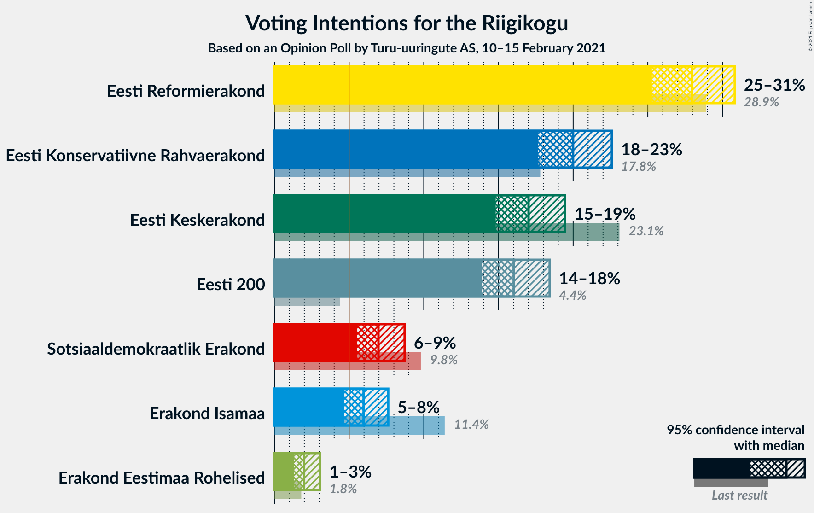

### Confidence Intervals

| Party | Last Result | Poll Result | 80% Confidence Interval | 90% Confidence Interval | 95% Confidence Interval | 99% Confidence Interval |
|:-----:|:-----------:|:-----------:|:-----------------------:|:-----------------------:|:-----------------------:|:-----------------------:|
| Eesti Reformierakond | 28.9% | 28.0% | 26.2–29.8% |25.7–30.4% |25.3–30.8% |24.4–31.7% |
| Eesti Konservatiivne Rahvaerakond | 17.8% | 20.0% | 18.4–21.7% |18.0–22.2% |17.6–22.6% |16.9–23.4% |
| Eesti Keskerakond | 23.1% | 17.0% | 15.6–18.6% |15.2–19.1% |14.8–19.5% |14.1–20.3% |
| Eesti 200 | 4.4% | 16.0% | 14.6–17.6% |14.2–18.0% |13.9–18.4% |13.2–19.2% |
| Sotsiaaldemokraatlik Erakond | 9.8% | 7.0% | 6.0–8.1% |5.8–8.4% |5.5–8.7% |5.1–9.3% |
| Erakond Isamaa | 11.4% | 6.0% | 5.1–7.0% |4.9–7.3% |4.7–7.6% |4.3–8.2% |
| Erakond Eestimaa Rohelised | 1.8% | 2.0% | 1.5–2.7% |1.4–2.9% |1.3–3.1% |1.1–3.4% |

*Note:* The poll result column reflects the actual value used in the calculations. Published results may vary slightly, and in addition be rounded to fewer digits.

## Seats

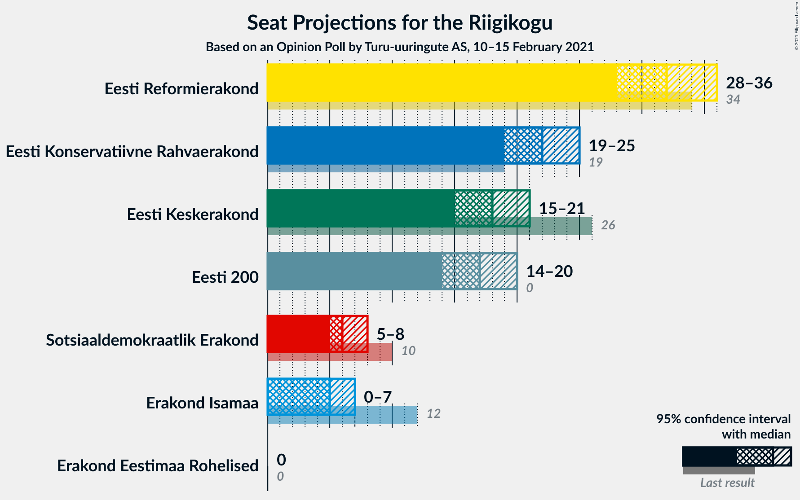

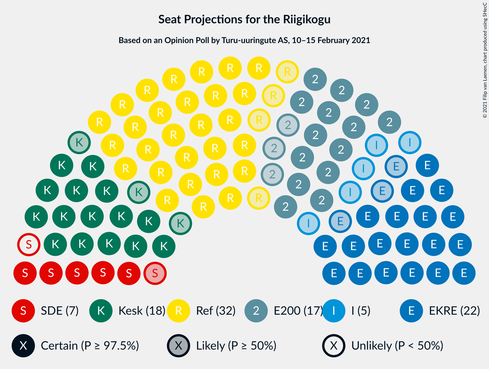

### Confidence Intervals

| Party | Last Result | Median | 80% Confidence Interval | 90% Confidence Interval | 95% Confidence Interval | 99% Confidence Interval |
|:-----:|:-----------:|:------:|:-----------------------:|:-----------------------:|:-----------------------:|:-----------------------:|
| <a href="#eesti-reformierakond">Eesti Reformierakond</a> | 34 | 32 | 30–34 |29–35 |28–36 |27–37 |
| <a href="#eesti-konservatiivne-rahvaerakond">Eesti Konservatiivne Rahvaerakond</a> | 19 | 22 | 20–24 |19–24 |19–25 |18–26 |
| <a href="#eesti-keskerakond">Eesti Keskerakond</a> | 26 | 18 | 16–20 |16–21 |15–21 |15–22 |
| <a href="#eesti-200">Eesti 200</a> | 0 | 17 | 15–19 |15–19 |14–20 |14–21 |
| <a href="#sotsiaaldemokraatlik-erakond">Sotsiaaldemokraatlik Erakond</a> | 10 | 6 | 5–8 |5–8 |5–8 |4–9 |
| <a href="#erakond-isamaa">Erakond Isamaa</a> | 12 | 5 | 4–6 |0–7 |0–7 |0–8 |
| <a href="#erakond-eestimaa-rohelised">Erakond Eestimaa Rohelised</a> | 0 | 0 | 0 |0 |0 |0 |

### Eesti Reformierakond

*For a full overview of the results for this party, see the [Eesti Reformierakond](party-eestireformierakond.html) page.*

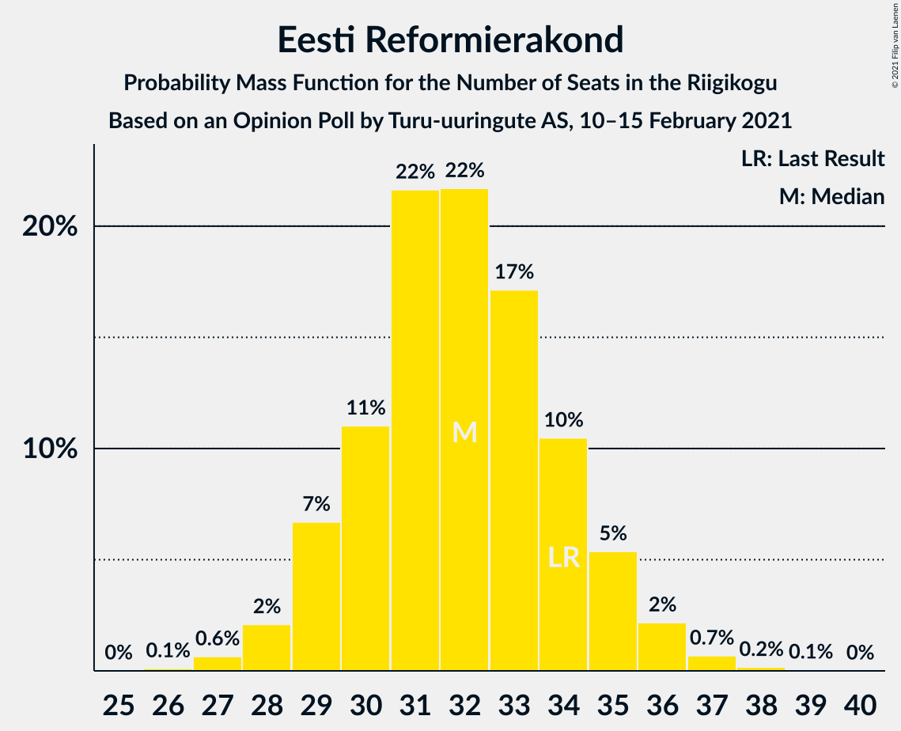

| Number of Seats | Probability | Accumulated | Special Marks |
|:---------------:|:-----------:|:-----------:|:-------------:|
| 26 | 0.1% | 100% |  |
| 27 | 0.6% | 99.9% |  |
| 28 | 2% | 99.2% |  |
| 29 | 7% | 97% |  |
| 30 | 11% | 90% |  |
| 31 | 22% | 79% |  |
| 32 | 22% | 58% | Median |
| 33 | 17% | 36% |  |
| 34 | 10% | 19% | Last Result |
| 35 | 5% | 8% |  |
| 36 | 2% | 3% |  |
| 37 | 0.7% | 0.9% |  |
| 38 | 0.2% | 0.2% |  |
| 39 | 0.1% | 0.1% |  |
| 40 | 0% | 0% |  |

### Eesti Konservatiivne Rahvaerakond

*For a full overview of the results for this party, see the [Eesti Konservatiivne Rahvaerakond](party-eestikonservatiivnerahvaerakond.html) page.*

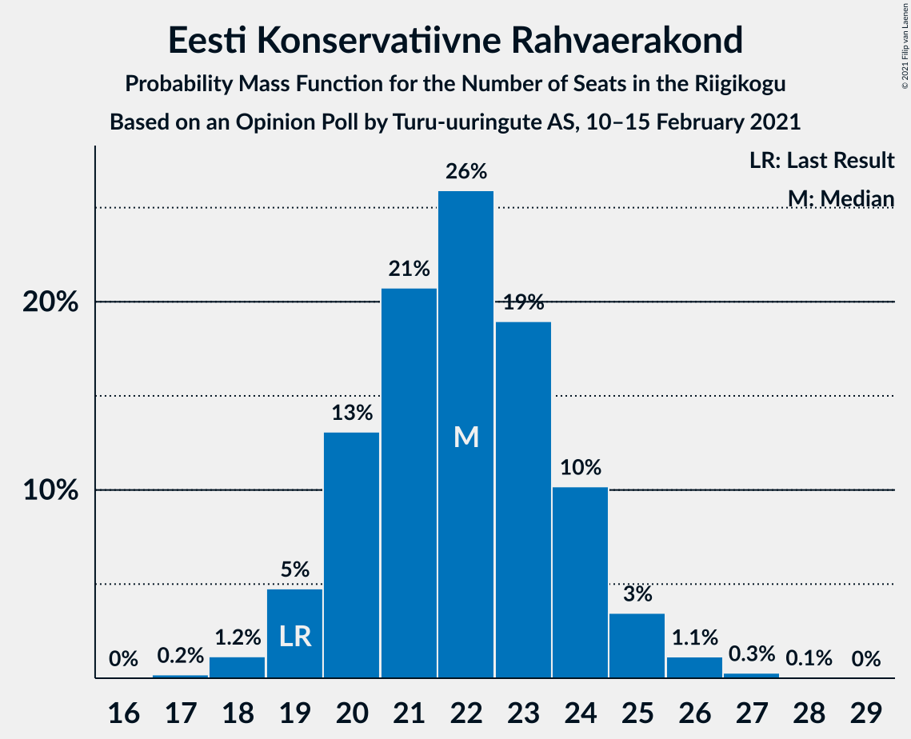

| Number of Seats | Probability | Accumulated | Special Marks |
|:---------------:|:-----------:|:-----------:|:-------------:|
| 17 | 0.2% | 100% |  |
| 18 | 1.2% | 99.8% |  |
| 19 | 5% | 98.6% | Last Result |
| 20 | 13% | 94% |  |
| 21 | 21% | 81% |  |
| 22 | 26% | 60% | Median |
| 23 | 19% | 34% |  |
| 24 | 10% | 15% |  |
| 25 | 3% | 5% |  |
| 26 | 1.1% | 1.5% |  |
| 27 | 0.3% | 0.3% |  |
| 28 | 0.1% | 0.1% |  |
| 29 | 0% | 0% |  |

### Eesti Keskerakond

*For a full overview of the results for this party, see the [Eesti Keskerakond](party-eestikeskerakond.html) page.*

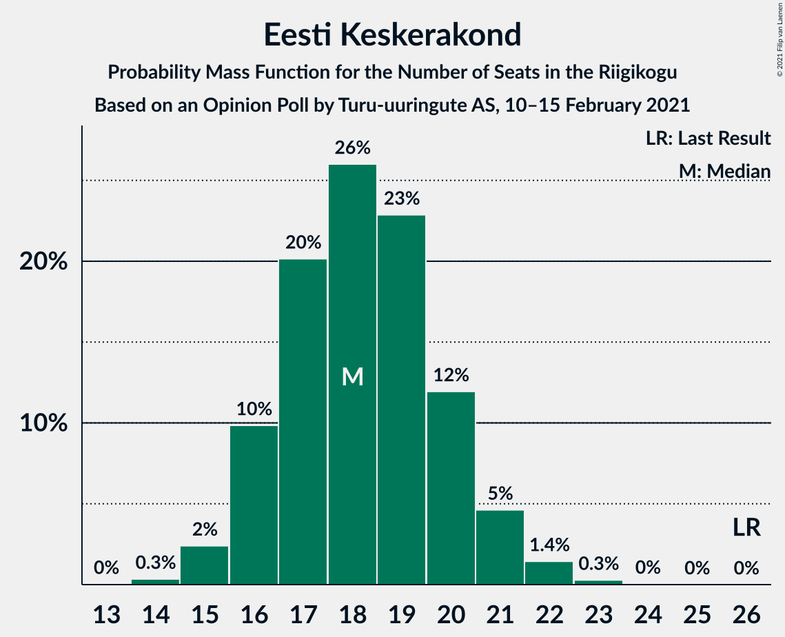

| Number of Seats | Probability | Accumulated | Special Marks |
|:---------------:|:-----------:|:-----------:|:-------------:|
| 14 | 0.3% | 100% |  |
| 15 | 2% | 99.6% |  |
| 16 | 10% | 97% |  |
| 17 | 20% | 87% |  |
| 18 | 26% | 67% | Median |
| 19 | 23% | 41% |  |
| 20 | 12% | 18% |  |
| 21 | 5% | 6% |  |
| 22 | 1.4% | 2% |  |
| 23 | 0.3% | 0.3% |  |
| 24 | 0% | 0.1% |  |
| 25 | 0% | 0% |  |
| 26 | 0% | 0% | Last Result |

### Eesti 200

*For a full overview of the results for this party, see the [Eesti 200](party-eesti200.html) page.*

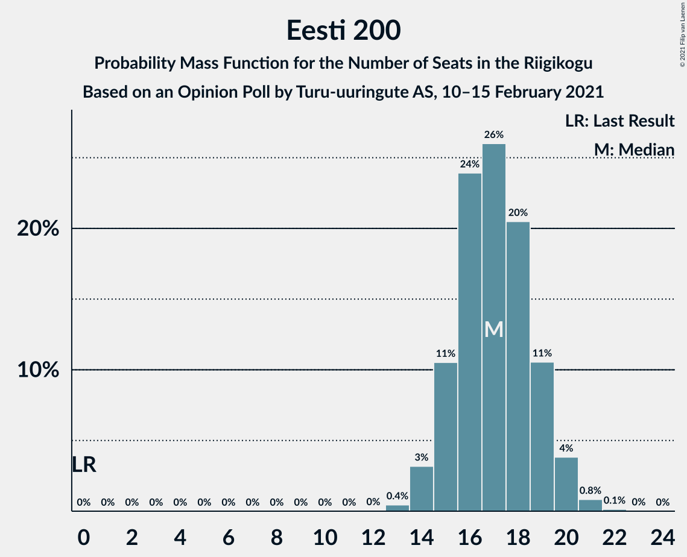

| Number of Seats | Probability | Accumulated | Special Marks |
|:---------------:|:-----------:|:-----------:|:-------------:|
| 0 | 0% | 100% | Last Result |
| 1 | 0% | 100% |  |
| 2 | 0% | 100% |  |
| 3 | 0% | 100% |  |
| 4 | 0% | 100% |  |
| 5 | 0% | 100% |  |
| 6 | 0% | 100% |  |
| 7 | 0% | 100% |  |
| 8 | 0% | 100% |  |
| 9 | 0% | 100% |  |
| 10 | 0% | 100% |  |
| 11 | 0% | 100% |  |
| 12 | 0% | 100% |  |
| 13 | 0.4% | 100% |  |
| 14 | 3% | 99.5% |  |
| 15 | 11% | 96% |  |
| 16 | 24% | 86% |  |
| 17 | 26% | 62% | Median |
| 18 | 20% | 36% |  |
| 19 | 11% | 15% |  |
| 20 | 4% | 5% |  |
| 21 | 0.8% | 1.0% |  |
| 22 | 0.1% | 0.2% |  |
| 23 | 0% | 0% |  |

### Sotsiaaldemokraatlik Erakond

*For a full overview of the results for this party, see the [Sotsiaaldemokraatlik Erakond](party-sotsiaaldemokraatlikerakond.html) page.*

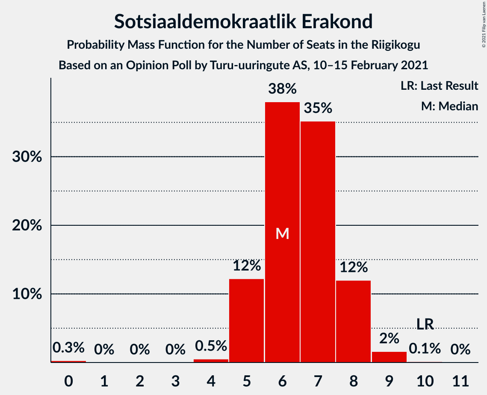

| Number of Seats | Probability | Accumulated | Special Marks |
|:---------------:|:-----------:|:-----------:|:-------------:|
| 0 | 0.3% | 100% |  |
| 1 | 0% | 99.7% |  |
| 2 | 0% | 99.7% |  |
| 3 | 0% | 99.7% |  |
| 4 | 0.5% | 99.7% |  |
| 5 | 12% | 99.2% |  |
| 6 | 38% | 87% | Median |
| 7 | 35% | 49% |  |
| 8 | 12% | 14% |  |
| 9 | 2% | 2% |  |
| 10 | 0.1% | 0.2% | Last Result |
| 11 | 0% | 0% |  |

### Erakond Isamaa

*For a full overview of the results for this party, see the [Erakond Isamaa](party-erakondisamaa.html) page.*

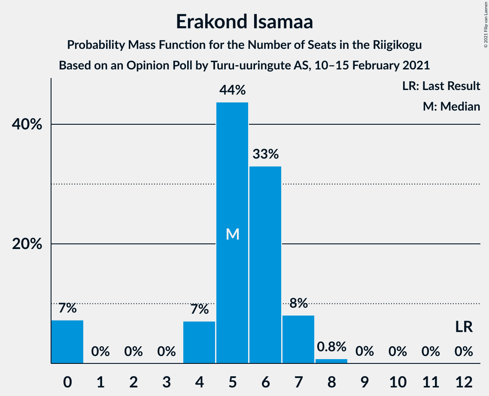

| Number of Seats | Probability | Accumulated | Special Marks |
|:---------------:|:-----------:|:-----------:|:-------------:|
| 0 | 7% | 100% |  |
| 1 | 0% | 93% |  |
| 2 | 0% | 93% |  |
| 3 | 0% | 93% |  |
| 4 | 7% | 93% |  |
| 5 | 44% | 86% | Median |
| 6 | 33% | 42% |  |
| 7 | 8% | 9% |  |
| 8 | 0.8% | 0.8% |  |
| 9 | 0% | 0% |  |
| 10 | 0% | 0% |  |
| 11 | 0% | 0% |  |
| 12 | 0% | 0% | Last Result |

### Erakond Eestimaa Rohelised

*For a full overview of the results for this party, see the [Erakond Eestimaa Rohelised](party-erakondeestimaarohelised.html) page.*

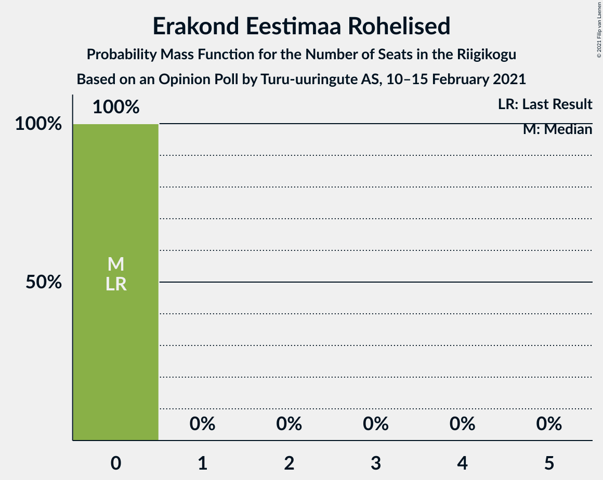

| Number of Seats | Probability | Accumulated | Special Marks |
|:---------------:|:-----------:|:-----------:|:-------------:|
| 0 | 100% | 100% | Last Result, Median |

## Coalitions

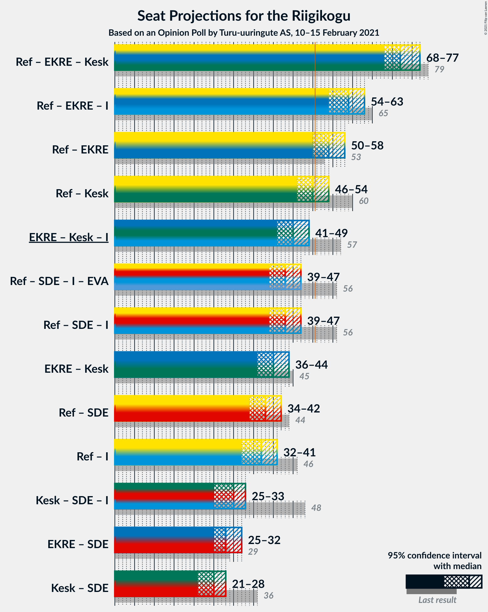

### Confidence Intervals

| Coalition | Last Result | Median | Majority? | 80% Confidence Interval | 90% Confidence Interval | 95% Confidence Interval | 99% Confidence Interval |
|:---------:|:-----------:|:------:|:---------:|:-----------------------:|:-----------------------:|:-----------------------:|:-----------------------:|
| Eesti Reformierakond – Eesti Konservatiivne Rahvaerakond – Eesti Keskerakond | 79 | 72 | 100% | 69–75 | 68–76 | 68–77 | 66–79 |
| Eesti Reformierakond – Eesti Konservatiivne Rahvaerakond – Erakond Isamaa | 65 | 59 | 100% | 56–61 | 55–62 | 54–63 | 53–64 |
| Eesti Reformierakond – Eesti Konservatiivne Rahvaerakond | 53 | 54 | 94% | 51–56 | 50–57 | 50–58 | 48–60 |
| Eesti Reformierakond – Eesti Keskerakond | 60 | 50 | 42% | 47–53 | 47–54 | 46–54 | 45–56 |
| Eesti Konservatiivne Rahvaerakond – Eesti Keskerakond – Erakond Isamaa | 57 | 45 | 0.4% | 43–48 | 42–48 | 41–49 | 39–50 |
| Eesti Reformierakond – Sotsiaaldemokraatlik Erakond – Erakond Isamaa | 56 | 43 | 0% | 41–46 | 40–47 | 39–47 | 37–49 |
| Eesti Konservatiivne Rahvaerakond – Eesti Keskerakond | 45 | 40 | 0% | 38–43 | 37–43 | 36–44 | 35–46 |
| Eesti Reformierakond – Sotsiaaldemokraatlik Erakond | 44 | 38 | 0% | 36–41 | 35–42 | 34–42 | 33–44 |
| Eesti Reformierakond – Erakond Isamaa | 46 | 37 | 0% | 34–40 | 33–41 | 32–41 | 30–42 |
| Eesti Keskerakond – Sotsiaaldemokraatlik Erakond – Erakond Isamaa | 48 | 30 | 0% | 27–32 | 26–33 | 25–33 | 23–35 |
| Eesti Konservatiivne Rahvaerakond – Sotsiaaldemokraatlik Erakond | 29 | 28 | 0% | 26–31 | 26–31 | 25–32 | 24–33 |
| Eesti Keskerakond – Sotsiaaldemokraatlik Erakond | 36 | 25 | 0% | 23–27 | 22–28 | 21–28 | 20–29 |

### Eesti Reformierakond – Eesti Konservatiivne Rahvaerakond – Eesti Keskerakond

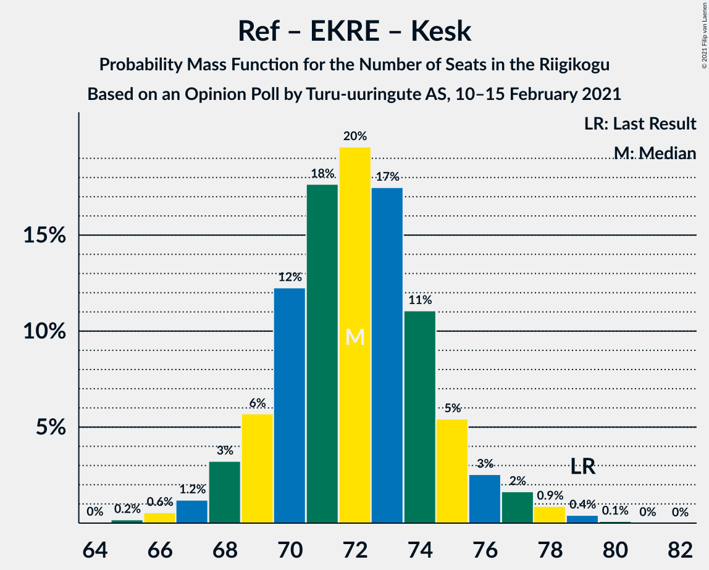

| Number of Seats | Probability | Accumulated | Special Marks |
|:---------------:|:-----------:|:-----------:|:-------------:|
| 64 | 0% | 100% |  |
| 65 | 0.2% | 99.9% |  |
| 66 | 0.6% | 99.8% |  |
| 67 | 1.2% | 99.2% |  |
| 68 | 3% | 98% |  |
| 69 | 6% | 95% |  |
| 70 | 12% | 89% |  |
| 71 | 18% | 77% |  |
| 72 | 20% | 59% | Median |
| 73 | 17% | 40% |  |
| 74 | 11% | 22% |  |
| 75 | 5% | 11% |  |
| 76 | 3% | 6% |  |
| 77 | 2% | 3% |  |
| 78 | 0.9% | 1.4% |  |
| 79 | 0.4% | 0.5% | Last Result |
| 80 | 0.1% | 0.1% |  |
| 81 | 0% | 0% |  |

### Eesti Reformierakond – Eesti Konservatiivne Rahvaerakond – Erakond Isamaa

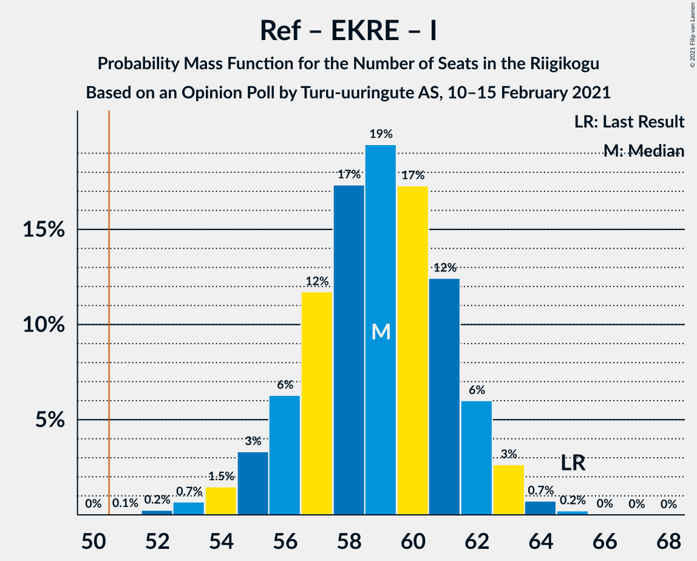

| Number of Seats | Probability | Accumulated | Special Marks |
|:---------------:|:-----------:|:-----------:|:-------------:|
| 51 | 0.1% | 100% | Majority |
| 52 | 0.2% | 99.9% |  |
| 53 | 0.7% | 99.6% |  |
| 54 | 1.5% | 99.0% |  |
| 55 | 3% | 97% |  |
| 56 | 6% | 94% |  |
| 57 | 12% | 88% |  |
| 58 | 17% | 76% |  |
| 59 | 19% | 59% | Median |
| 60 | 17% | 39% |  |
| 61 | 12% | 22% |  |
| 62 | 6% | 10% |  |
| 63 | 3% | 4% |  |
| 64 | 0.7% | 1.0% |  |
| 65 | 0.2% | 0.3% | Last Result |
| 66 | 0% | 0.1% |  |
| 67 | 0% | 0% |  |

### Eesti Reformierakond – Eesti Konservatiivne Rahvaerakond

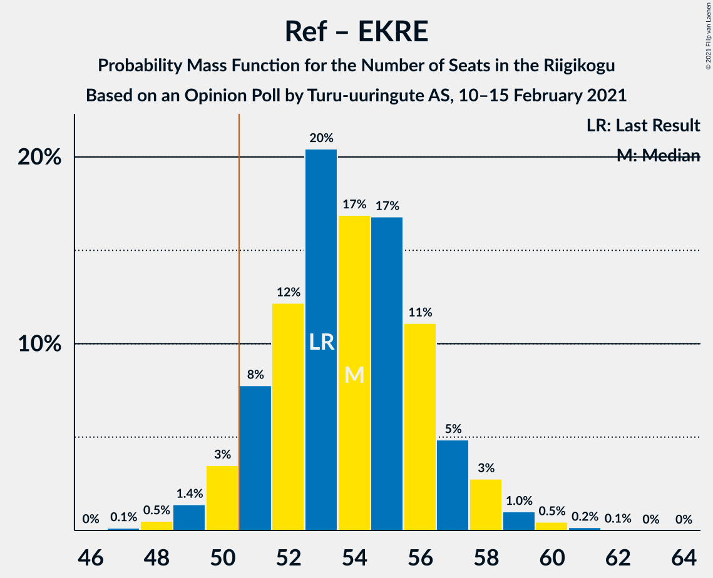

| Number of Seats | Probability | Accumulated | Special Marks |
|:---------------:|:-----------:|:-----------:|:-------------:|
| 47 | 0.1% | 100% |  |
| 48 | 0.5% | 99.8% |  |
| 49 | 1.4% | 99.3% |  |
| 50 | 3% | 98% |  |
| 51 | 8% | 94% | Majority |
| 52 | 12% | 87% |  |
| 53 | 20% | 75% | Last Result |
| 54 | 17% | 54% | Median |
| 55 | 17% | 37% |  |
| 56 | 11% | 20% |  |
| 57 | 5% | 9% |  |
| 58 | 3% | 4% |  |
| 59 | 1.0% | 2% |  |
| 60 | 0.5% | 0.7% |  |
| 61 | 0.2% | 0.2% |  |
| 62 | 0.1% | 0.1% |  |
| 63 | 0% | 0% |  |

### Eesti Reformierakond – Eesti Keskerakond

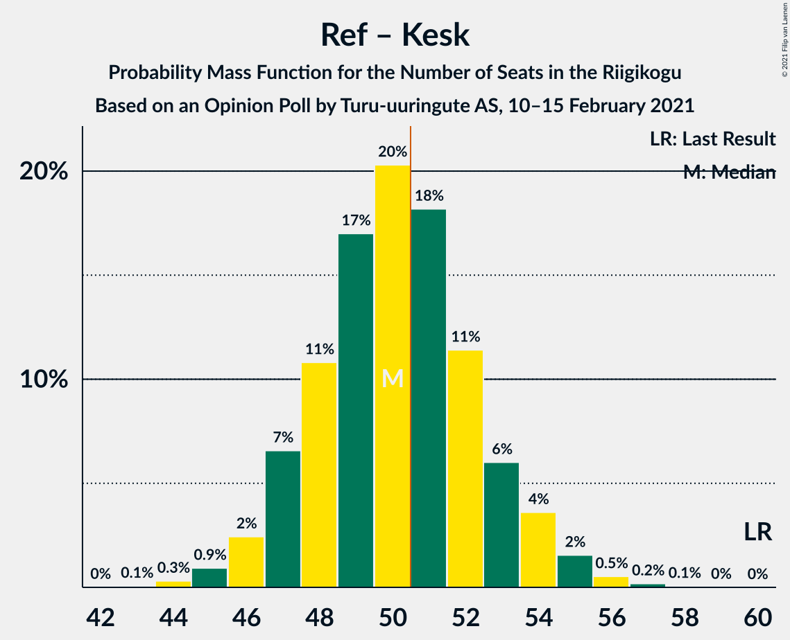

| Number of Seats | Probability | Accumulated | Special Marks |
|:---------------:|:-----------:|:-----------:|:-------------:|
| 43 | 0.1% | 100% |  |
| 44 | 0.3% | 99.9% |  |
| 45 | 0.9% | 99.6% |  |
| 46 | 2% | 98.7% |  |
| 47 | 7% | 96% |  |
| 48 | 11% | 90% |  |
| 49 | 17% | 79% |  |
| 50 | 20% | 62% | Median |
| 51 | 18% | 42% | Majority |
| 52 | 11% | 23% |  |
| 53 | 6% | 12% |  |
| 54 | 4% | 6% |  |
| 55 | 2% | 2% |  |
| 56 | 0.5% | 0.8% |  |
| 57 | 0.2% | 0.3% |  |
| 58 | 0.1% | 0.1% |  |
| 59 | 0% | 0% |  |
| 60 | 0% | 0% | Last Result |

### Eesti Konservatiivne Rahvaerakond – Eesti Keskerakond – Erakond Isamaa

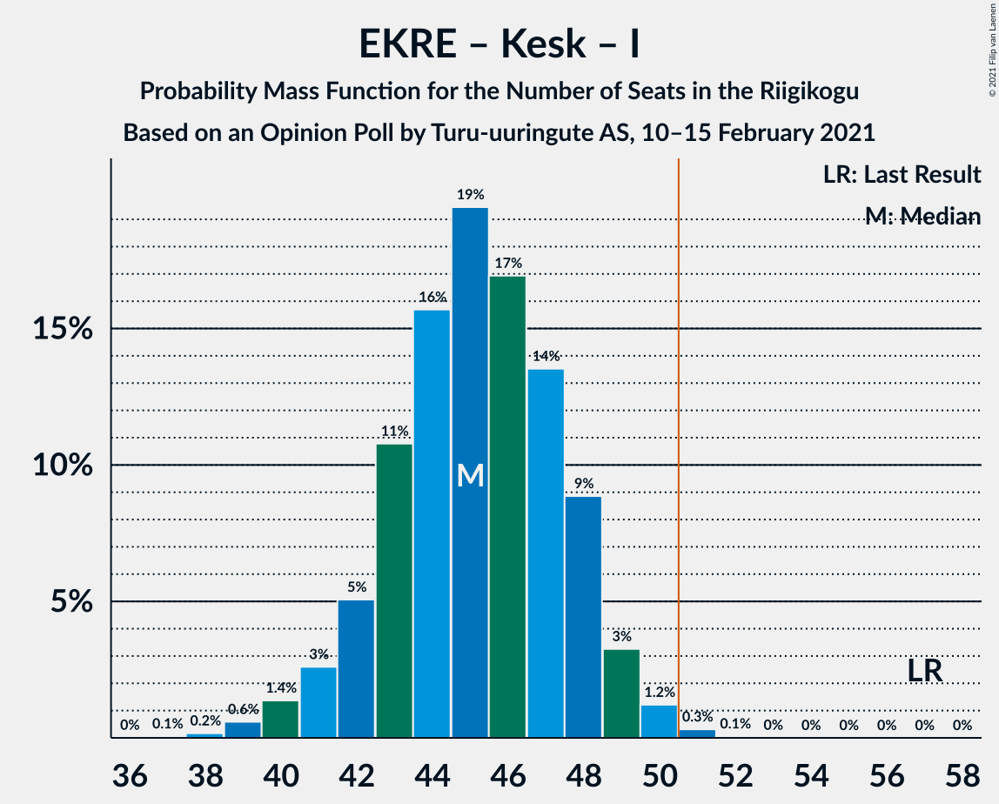

| Number of Seats | Probability | Accumulated | Special Marks |
|:---------------:|:-----------:|:-----------:|:-------------:|
| 37 | 0.1% | 100% |  |
| 38 | 0.2% | 99.9% |  |
| 39 | 0.6% | 99.8% |  |
| 40 | 1.4% | 99.2% |  |
| 41 | 3% | 98% |  |
| 42 | 5% | 95% |  |
| 43 | 11% | 90% |  |
| 44 | 16% | 79% |  |
| 45 | 19% | 64% | Median |
| 46 | 17% | 44% |  |
| 47 | 14% | 27% |  |
| 48 | 9% | 14% |  |
| 49 | 3% | 5% |  |
| 50 | 1.2% | 2% |  |
| 51 | 0.3% | 0.4% | Majority |
| 52 | 0.1% | 0.1% |  |
| 53 | 0% | 0% |  |
| 54 | 0% | 0% |  |
| 55 | 0% | 0% |  |
| 56 | 0% | 0% |  |
| 57 | 0% | 0% | Last Result |

### Eesti Reformierakond – Sotsiaaldemokraatlik Erakond – Erakond Isamaa

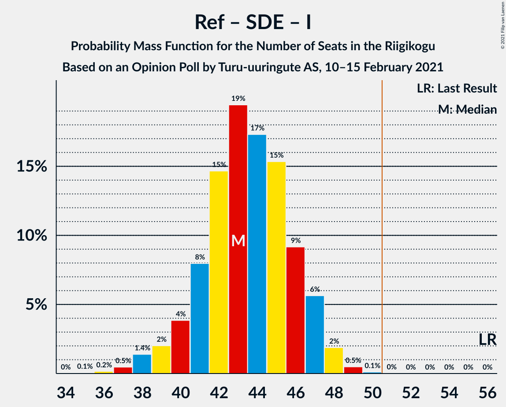

| Number of Seats | Probability | Accumulated | Special Marks |
|:---------------:|:-----------:|:-----------:|:-------------:|
| 35 | 0.1% | 100% |  |
| 36 | 0.2% | 99.9% |  |
| 37 | 0.5% | 99.8% |  |
| 38 | 1.4% | 99.3% |  |
| 39 | 2% | 98% |  |
| 40 | 4% | 96% |  |
| 41 | 8% | 92% |  |
| 42 | 15% | 84% |  |
| 43 | 19% | 69% | Median |
| 44 | 17% | 50% |  |
| 45 | 15% | 33% |  |
| 46 | 9% | 17% |  |
| 47 | 6% | 8% |  |
| 48 | 2% | 2% |  |
| 49 | 0.5% | 0.6% |  |
| 50 | 0.1% | 0.1% |  |
| 51 | 0% | 0% | Majority |
| 52 | 0% | 0% |  |
| 53 | 0% | 0% |  |
| 54 | 0% | 0% |  |
| 55 | 0% | 0% |  |
| 56 | 0% | 0% | Last Result |

### Eesti Konservatiivne Rahvaerakond – Eesti Keskerakond

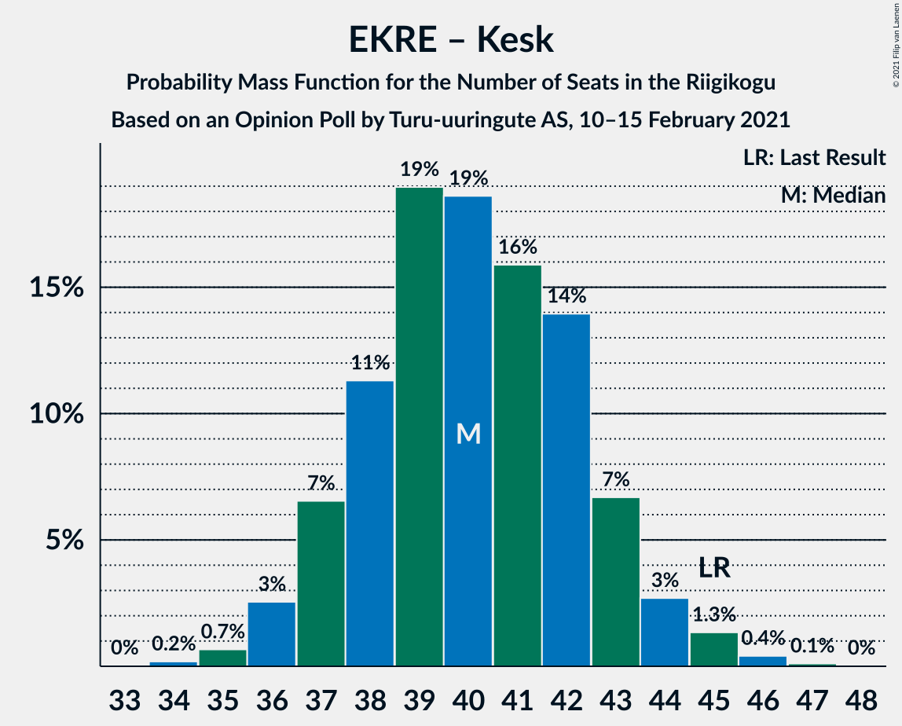

| Number of Seats | Probability | Accumulated | Special Marks |
|:---------------:|:-----------:|:-----------:|:-------------:|
| 34 | 0.2% | 100% |  |
| 35 | 0.7% | 99.8% |  |
| 36 | 3% | 99.1% |  |
| 37 | 7% | 97% |  |
| 38 | 11% | 90% |  |
| 39 | 19% | 79% |  |
| 40 | 19% | 60% | Median |
| 41 | 16% | 41% |  |
| 42 | 14% | 25% |  |
| 43 | 7% | 11% |  |
| 44 | 3% | 5% |  |
| 45 | 1.3% | 2% | Last Result |
| 46 | 0.4% | 0.6% |  |
| 47 | 0.1% | 0.1% |  |
| 48 | 0% | 0% |  |

### Eesti Reformierakond – Sotsiaaldemokraatlik Erakond

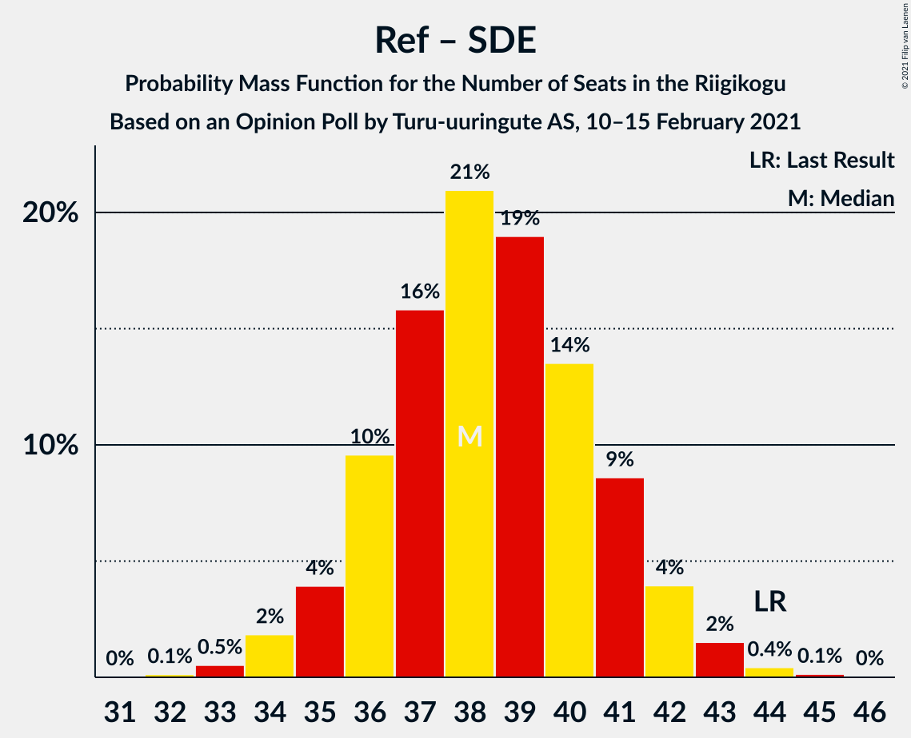

| Number of Seats | Probability | Accumulated | Special Marks |
|:---------------:|:-----------:|:-----------:|:-------------:|
| 32 | 0.1% | 100% |  |
| 33 | 0.5% | 99.8% |  |
| 34 | 2% | 99.3% |  |
| 35 | 4% | 97% |  |
| 36 | 10% | 94% |  |
| 37 | 16% | 84% |  |
| 38 | 21% | 68% | Median |
| 39 | 19% | 47% |  |
| 40 | 14% | 28% |  |
| 41 | 9% | 15% |  |
| 42 | 4% | 6% |  |
| 43 | 2% | 2% |  |
| 44 | 0.4% | 0.6% | Last Result |
| 45 | 0.1% | 0.2% |  |
| 46 | 0% | 0% |  |

### Eesti Reformierakond – Erakond Isamaa

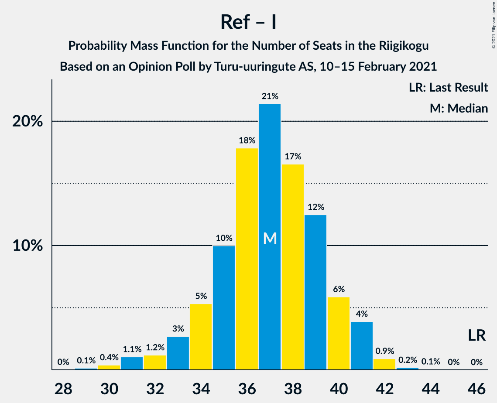

| Number of Seats | Probability | Accumulated | Special Marks |
|:---------------:|:-----------:|:-----------:|:-------------:|
| 29 | 0.1% | 100% |  |
| 30 | 0.4% | 99.8% |  |
| 31 | 1.1% | 99.4% |  |
| 32 | 1.2% | 98% |  |
| 33 | 3% | 97% |  |
| 34 | 5% | 95% |  |
| 35 | 10% | 89% |  |
| 36 | 18% | 79% |  |
| 37 | 21% | 61% | Median |
| 38 | 17% | 40% |  |
| 39 | 12% | 23% |  |
| 40 | 6% | 11% |  |
| 41 | 4% | 5% |  |
| 42 | 0.9% | 1.2% |  |
| 43 | 0.2% | 0.2% |  |
| 44 | 0.1% | 0.1% |  |
| 45 | 0% | 0% |  |
| 46 | 0% | 0% | Last Result |

### Eesti Keskerakond – Sotsiaaldemokraatlik Erakond – Erakond Isamaa

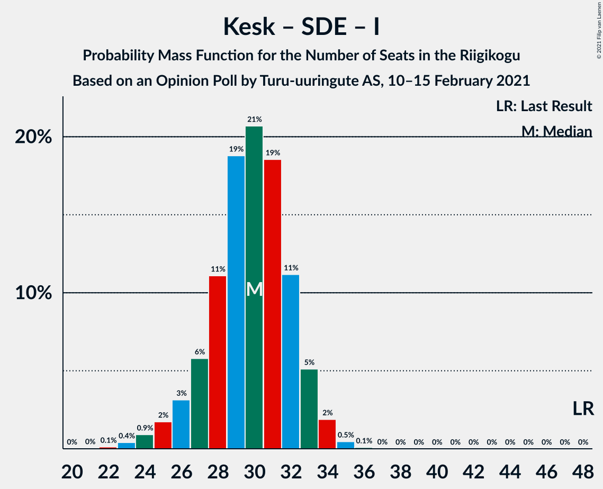

| Number of Seats | Probability | Accumulated | Special Marks |
|:---------------:|:-----------:|:-----------:|:-------------:|
| 22 | 0.1% | 100% |  |
| 23 | 0.4% | 99.8% |  |
| 24 | 0.9% | 99.4% |  |
| 25 | 2% | 98.5% |  |
| 26 | 3% | 97% |  |
| 27 | 6% | 94% |  |
| 28 | 11% | 88% |  |
| 29 | 19% | 77% | Median |
| 30 | 21% | 58% |  |
| 31 | 19% | 37% |  |
| 32 | 11% | 19% |  |
| 33 | 5% | 8% |  |
| 34 | 2% | 2% |  |
| 35 | 0.5% | 0.6% |  |
| 36 | 0.1% | 0.1% |  |
| 37 | 0% | 0% |  |
| 38 | 0% | 0% |  |
| 39 | 0% | 0% |  |
| 40 | 0% | 0% |  |
| 41 | 0% | 0% |  |
| 42 | 0% | 0% |  |
| 43 | 0% | 0% |  |
| 44 | 0% | 0% |  |
| 45 | 0% | 0% |  |
| 46 | 0% | 0% |  |
| 47 | 0% | 0% |  |
| 48 | 0% | 0% | Last Result |

### Eesti Konservatiivne Rahvaerakond – Sotsiaaldemokraatlik Erakond

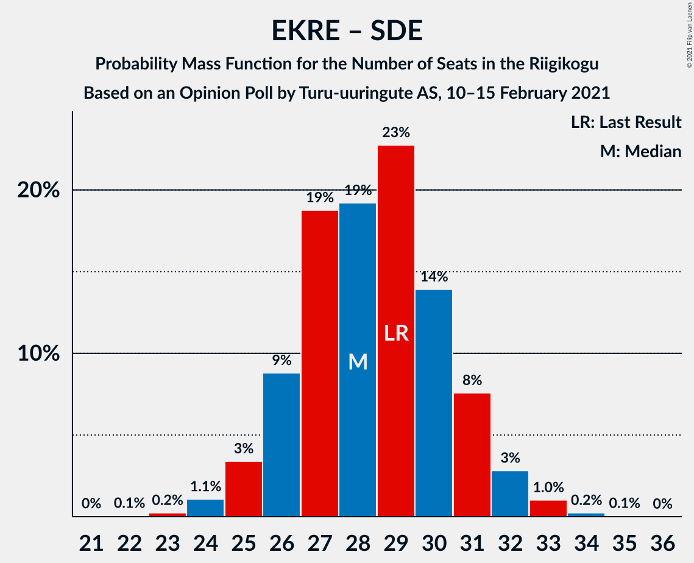

| Number of Seats | Probability | Accumulated | Special Marks |
|:---------------:|:-----------:|:-----------:|:-------------:|
| 22 | 0.1% | 100% |  |
| 23 | 0.2% | 99.9% |  |
| 24 | 1.1% | 99.7% |  |
| 25 | 3% | 98.6% |  |
| 26 | 9% | 95% |  |
| 27 | 19% | 86% |  |
| 28 | 19% | 68% | Median |
| 29 | 23% | 48% | Last Result |
| 30 | 14% | 26% |  |
| 31 | 8% | 12% |  |
| 32 | 3% | 4% |  |
| 33 | 1.0% | 1.3% |  |
| 34 | 0.2% | 0.3% |  |
| 35 | 0.1% | 0.1% |  |
| 36 | 0% | 0% |  |

### Eesti Keskerakond – Sotsiaaldemokraatlik Erakond

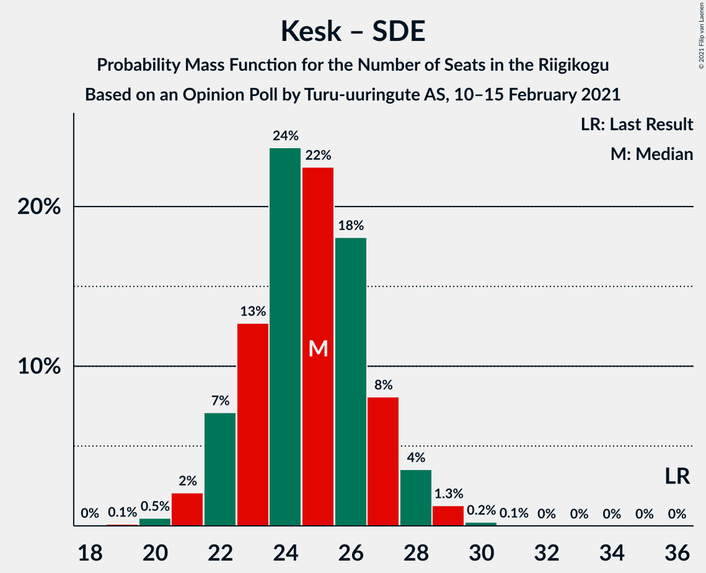

| Number of Seats | Probability | Accumulated | Special Marks |
|:---------------:|:-----------:|:-----------:|:-------------:|
| 18 | 0% | 100% |  |
| 19 | 0.1% | 99.9% |  |
| 20 | 0.5% | 99.8% |  |
| 21 | 2% | 99.3% |  |
| 22 | 7% | 97% |  |
| 23 | 13% | 90% |  |
| 24 | 24% | 77% | Median |
| 25 | 22% | 54% |  |
| 26 | 18% | 31% |  |
| 27 | 8% | 13% |  |
| 28 | 4% | 5% |  |
| 29 | 1.3% | 2% |  |
| 30 | 0.2% | 0.3% |  |
| 31 | 0.1% | 0.1% |  |
| 32 | 0% | 0% |  |
| 33 | 0% | 0% |  |
| 34 | 0% | 0% |  |
| 35 | 0% | 0% |  |
| 36 | 0% | 0% | Last Result |

## Technical Information

### Opinion Poll

+ **Polling firm:** Turu-uuringute AS
+ **Commissioner(s):** —
+ **Fieldwork period:** 10–15 February 2021

### Calculations

+ **Sample size:** 1005
+ **Simulations done:** 1,048,576
+ **Error estimate:** 1.23%

