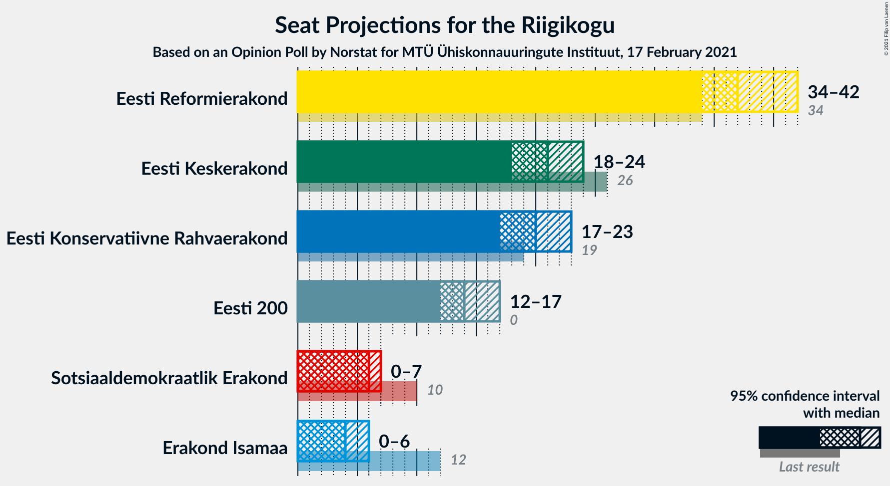
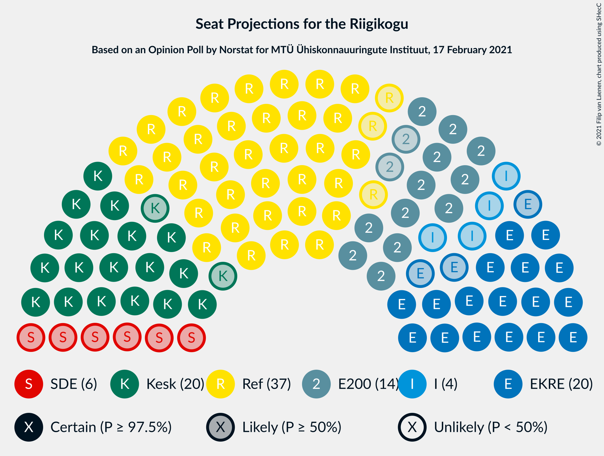
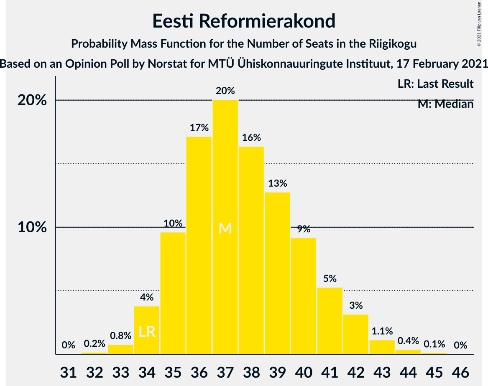
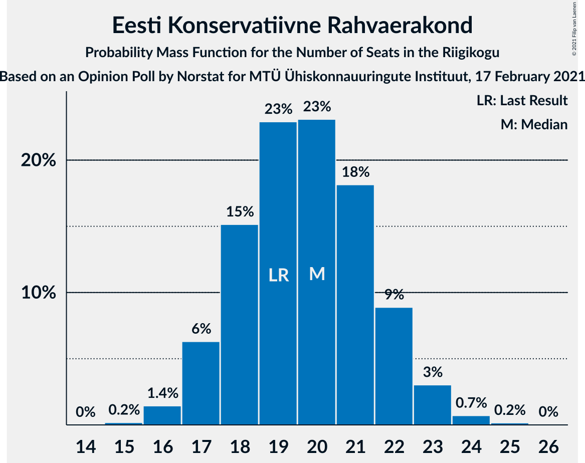
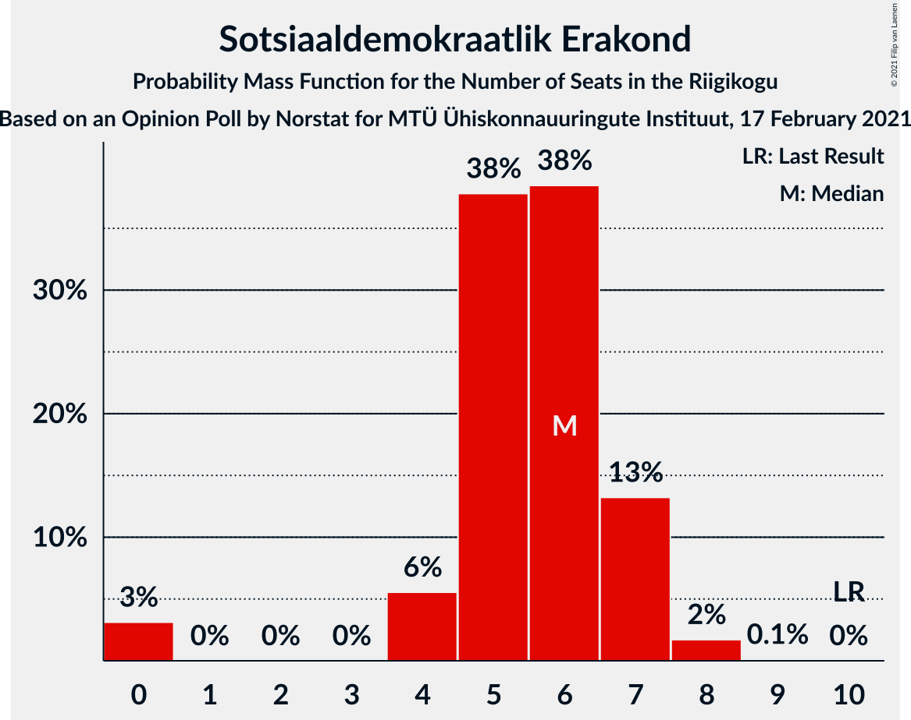
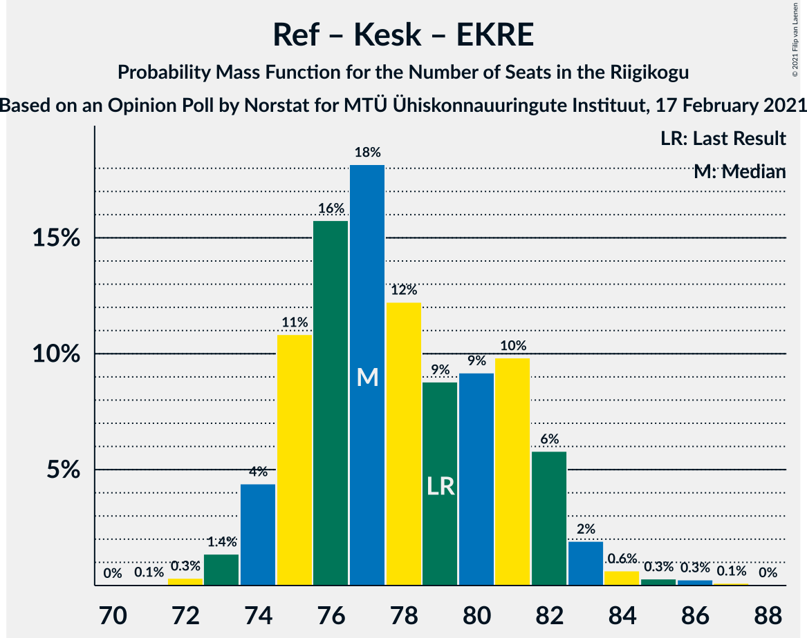
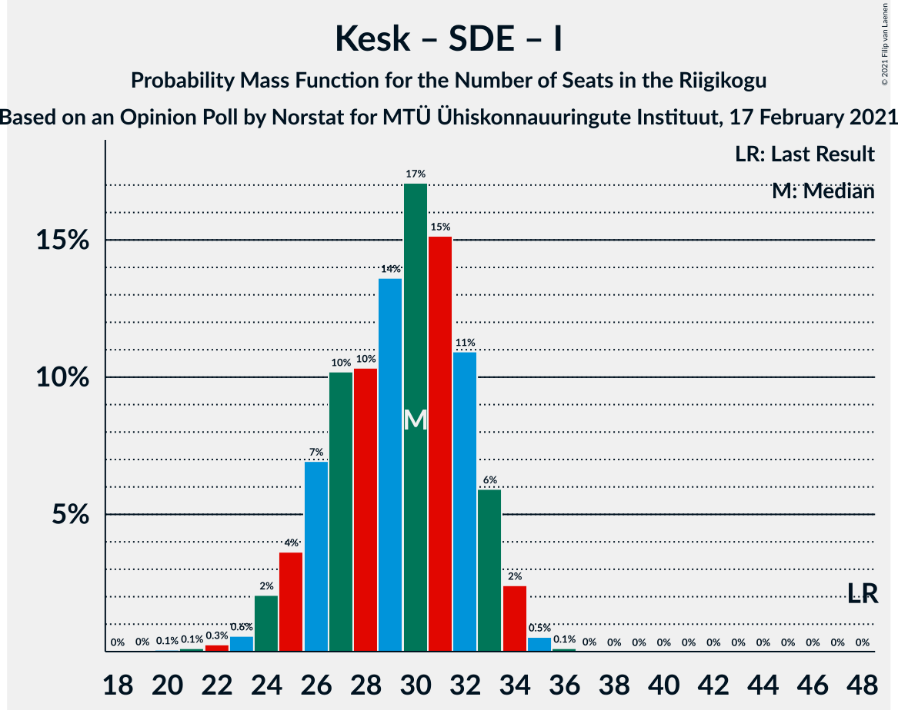

# Opinion Poll by Norstat for MTÜ Ühiskonnauuringute Instituut, 17 February 2021

<a href="#voting-intentions">Voting Intentions</a> | <a href="#seats">Seats</a> | <a href="#coalitions">Coalitions</a> | <a href="#technical-information">Technical Information</a>

## Voting Intentions

### Confidence Intervals

| Party | Last Result | Poll Result | 80% Confidence Interval | 90% Confidence Interval | 95% Confidence Interval | 99% Confidence Interval |
|:-----:|:-----------:|:-----------:|:-----------------------:|:-----------------------:|:-----------------------:|:-----------------------:|
| Eesti Reformierakond | 28.9% | 33.3% | 31.4–35.3% |30.9–35.8% |30.4–36.3% |29.6–37.2% |
| Eesti Keskerakond | 23.1% | 19.3% | 17.8–21.0% |17.3–21.5% |17.0–21.9% |16.3–22.7% |
| Eesti Konservatiivne Rahvaerakond | 17.8% | 18.6% | 17.1–20.3% |16.7–20.7% |16.3–21.1% |15.6–21.9% |
| Eesti 200 | 4.4% | 14.0% | 12.7–15.5% |12.3–15.9% |12.0–16.3% |11.4–17.0% |
| Sotsiaaldemokraatlik Erakond | 9.8% | 6.3% | 5.4–7.4% |5.2–7.7% |5.0–8.0% |4.6–8.5% |
| Erakond Isamaa | 11.4% | 5.3% | 4.5–6.3% |4.3–6.6% |4.1–6.9% |3.7–7.4% |

*Note:* The poll result column reflects the actual value used in the calculations. Published results may vary slightly, and in addition be rounded to fewer digits.

## Seats

### Confidence Intervals

| Party | Last Result | Median | 80% Confidence Interval | 90% Confidence Interval | 95% Confidence Interval | 99% Confidence Interval |
|:-----:|:-----------:|:------:|:-----------------------:|:-----------------------:|:-----------------------:|:-----------------------:|
| <a href="#eesti-reformierakond">Eesti Reformierakond</a> | 34 | 37 | 35–41 |35–41 |34–42 |33–44 |
| <a href="#eesti-keskerakond">Eesti Keskerakond</a> | 26 | 21 | 19–23 |18–23 |18–24 |17–25 |
| <a href="#eesti-konservatiivne-rahvaerakond">Eesti Konservatiivne Rahvaerakond</a> | 19 | 20 | 18–22 |17–22 |17–23 |16–24 |
| <a href="#eesti-200">Eesti 200</a> | 0 | 14 | 13–16 |12–17 |12–17 |11–18 |
| <a href="#sotsiaaldemokraatlik-erakond">Sotsiaaldemokraatlik Erakond</a> | 10 | 6 | 5–7 |4–7 |0–7 |0–8 |
| <a href="#erakond-isamaa">Erakond Isamaa</a> | 12 | 4 | 0–5 |0–6 |0–6 |0–7 |

### Eesti Reformierakond

*For a full overview of the results for this party, see the [Eesti Reformierakond](party-eestireformierakond.html) page.*

| Number of Seats | Probability | Accumulated | Special Marks |
|:---------------:|:-----------:|:-----------:|:-------------:|
| 32 | 0.2% | 100% |  |
| 33 | 0.8% | 99.8% |  |
| 34 | 4% | 99.0% | Last Result |
| 35 | 10% | 95% |  |
| 36 | 17% | 86% |  |
| 37 | 20% | 68% | Median |
| 38 | 16% | 48% |  |
| 39 | 13% | 32% |  |
| 40 | 9% | 19% |  |
| 41 | 5% | 10% |  |
| 42 | 3% | 5% |  |
| 43 | 1.1% | 2% |  |
| 44 | 0.4% | 0.5% |  |
| 45 | 0.1% | 0.1% |  |
| 46 | 0% | 0% |  |

### Eesti Keskerakond

*For a full overview of the results for this party, see the [Eesti Keskerakond](party-eestikeskerakond.html) page.*

| Number of Seats | Probability | Accumulated | Special Marks |
|:---------------:|:-----------:|:-----------:|:-------------:|
| 16 | 0.3% | 100% |  |
| 17 | 2% | 99.6% |  |
| 18 | 7% | 98% |  |
| 19 | 16% | 90% |  |
| 20 | 24% | 74% |  |
| 21 | 23% | 50% | Median |
| 22 | 16% | 28% |  |
| 23 | 8% | 11% |  |
| 24 | 3% | 4% |  |
| 25 | 0.7% | 0.9% |  |
| 26 | 0.1% | 0.2% | Last Result |
| 27 | 0% | 0% |  |

### Eesti Konservatiivne Rahvaerakond

*For a full overview of the results for this party, see the [Eesti Konservatiivne Rahvaerakond](party-eestikonservatiivnerahvaerakond.html) page.*

| Number of Seats | Probability | Accumulated | Special Marks |
|:---------------:|:-----------:|:-----------:|:-------------:|
| 15 | 0.2% | 100% |  |
| 16 | 1.4% | 99.8% |  |
| 17 | 6% | 98% |  |
| 18 | 15% | 92% |  |
| 19 | 23% | 77% | Last Result |
| 20 | 23% | 54% | Median |
| 21 | 18% | 31% |  |
| 22 | 9% | 13% |  |
| 23 | 3% | 4% |  |
| 24 | 0.7% | 0.9% |  |
| 25 | 0.2% | 0.2% |  |
| 26 | 0% | 0% |  |

### Eesti 200

*For a full overview of the results for this party, see the [Eesti 200](party-eesti200.html) page.*

| Number of Seats | Probability | Accumulated | Special Marks |
|:---------------:|:-----------:|:-----------:|:-------------:|
| 0 | 0% | 100% | Last Result |
| 1 | 0% | 100% |  |
| 2 | 0% | 100% |  |
| 3 | 0% | 100% |  |
| 4 | 0% | 100% |  |
| 5 | 0% | 100% |  |
| 6 | 0% | 100% |  |
| 7 | 0% | 100% |  |
| 8 | 0% | 100% |  |
| 9 | 0% | 100% |  |
| 10 | 0.1% | 100% |  |
| 11 | 1.3% | 99.9% |  |
| 12 | 7% | 98.6% |  |
| 13 | 19% | 91% |  |
| 14 | 30% | 72% | Median |
| 15 | 25% | 42% |  |
| 16 | 12% | 17% |  |
| 17 | 4% | 5% |  |
| 18 | 1.0% | 1.1% |  |
| 19 | 0.1% | 0.2% |  |
| 20 | 0% | 0% |  |

### Sotsiaaldemokraatlik Erakond

*For a full overview of the results for this party, see the [Sotsiaaldemokraatlik Erakond](party-sotsiaaldemokraatlikerakond.html) page.*

| Number of Seats | Probability | Accumulated | Special Marks |
|:---------------:|:-----------:|:-----------:|:-------------:|
| 0 | 3% | 100% |  |
| 1 | 0% | 97% |  |
| 2 | 0% | 97% |  |
| 3 | 0% | 97% |  |
| 4 | 6% | 97% |  |
| 5 | 38% | 91% |  |
| 6 | 38% | 54% | Median |
| 7 | 13% | 15% |  |
| 8 | 2% | 2% |  |
| 9 | 0.1% | 0.1% |  |
| 10 | 0% | 0% | Last Result |

### Erakond Isamaa

*For a full overview of the results for this party, see the [Erakond Isamaa](party-erakondisamaa.html) page.*

| Number of Seats | Probability | Accumulated | Special Marks |
|:---------------:|:-----------:|:-----------:|:-------------:|
| 0 | 32% | 100% |  |
| 1 | 0% | 68% |  |
| 2 | 0% | 68% |  |
| 3 | 0% | 68% |  |
| 4 | 19% | 68% | Median |
| 5 | 40% | 50% |  |
| 6 | 9% | 10% |  |
| 7 | 0.7% | 0.8% |  |
| 8 | 0% | 0% |  |
| 9 | 0% | 0% |  |
| 10 | 0% | 0% |  |
| 11 | 0% | 0% |  |
| 12 | 0% | 0% | Last Result |

## Coalitions

### Confidence Intervals

| Coalition | Last Result | Median | Majority? | 80% Confidence Interval | 90% Confidence Interval | 95% Confidence Interval | 99% Confidence Interval |
|:---------:|:-----------:|:------:|:---------:|:-----------------------:|:-----------------------:|:-----------------------:|:-----------------------:|
| Eesti Reformierakond – Eesti Keskerakond – Eesti Konservatiivne Rahvaerakond | 79 | 77 | 100% | 75–81 | 74–82 | 74–83 | 73–85 |
| Eesti Reformierakond – Eesti Konservatiivne Rahvaerakond – Erakond Isamaa | 65 | 61 | 100% | 58–63 | 57–64 | 57–65 | 55–67 |
| Eesti Reformierakond – Eesti Keskerakond | 60 | 58 | 100% | 55–61 | 55–62 | 54–63 | 53–65 |
| Eesti Reformierakond – Eesti Konservatiivne Rahvaerakond | 53 | 57 | 100% | 54–61 | 54–61 | 53–62 | 52–64 |
| Eesti Reformierakond – Sotsiaaldemokraatlik Erakond – Erakond Isamaa | 56 | 47 | 5% | 43–50 | 43–50 | 42–51 | 40–52 |
| Eesti Keskerakond – Eesti Konservatiivne Rahvaerakond – Erakond Isamaa | 57 | 44 | 0.1% | 41–46 | 40–47 | 39–48 | 37–49 |
| Eesti Reformierakond – Sotsiaaldemokraatlik Erakond | 44 | 43 | 0% | 40–46 | 40–47 | 39–48 | 37–49 |
| Eesti Reformierakond – Erakond Isamaa | 46 | 41 | 0% | 38–44 | 37–45 | 36–46 | 35–47 |
| Eesti Keskerakond – Eesti Konservatiivne Rahvaerakond | 45 | 40 | 0% | 38–43 | 37–44 | 36–44 | 35–46 |
| Eesti Keskerakond – Sotsiaaldemokraatlik Erakond – Erakond Isamaa | 48 | 30 | 0% | 26–32 | 25–33 | 24–34 | 23–35 |
| Eesti Keskerakond – Sotsiaaldemokraatlik Erakond | 36 | 26 | 0% | 24–28 | 23–29 | 22–30 | 20–31 |
| Eesti Konservatiivne Rahvaerakond – Sotsiaaldemokraatlik Erakond | 29 | 25 | 0% | 23–28 | 22–28 | 21–29 | 19–30 |

### Eesti Reformierakond – Eesti Keskerakond – Eesti Konservatiivne Rahvaerakond

| Number of Seats | Probability | Accumulated | Special Marks |
|:---------------:|:-----------:|:-----------:|:-------------:|
| 71 | 0.1% | 100% |  |
| 72 | 0.3% | 99.9% |  |
| 73 | 1.4% | 99.6% |  |
| 74 | 4% | 98% |  |
| 75 | 11% | 94% |  |
| 76 | 16% | 83% |  |
| 77 | 18% | 67% |  |
| 78 | 12% | 49% | Median |
| 79 | 9% | 37% | Last Result |
| 80 | 9% | 28% |  |
| 81 | 10% | 19% |  |
| 82 | 6% | 9% |  |
| 83 | 2% | 3% |  |
| 84 | 0.6% | 1.3% |  |
| 85 | 0.3% | 0.7% |  |
| 86 | 0.3% | 0.4% |  |
| 87 | 0.1% | 0.2% |  |
| 88 | 0% | 0% |  |

### Eesti Reformierakond – Eesti Konservatiivne Rahvaerakond – Erakond Isamaa

| Number of Seats | Probability | Accumulated | Special Marks |
|:---------------:|:-----------:|:-----------:|:-------------:|
| 54 | 0.1% | 100% |  |
| 55 | 0.6% | 99.8% |  |
| 56 | 2% | 99.2% |  |
| 57 | 5% | 98% |  |
| 58 | 8% | 93% |  |
| 59 | 14% | 85% |  |
| 60 | 19% | 71% |  |
| 61 | 18% | 52% | Median |
| 62 | 14% | 34% |  |
| 63 | 11% | 20% |  |
| 64 | 5% | 9% |  |
| 65 | 3% | 4% | Last Result |
| 66 | 1.0% | 2% |  |
| 67 | 0.4% | 0.6% |  |
| 68 | 0.2% | 0.2% |  |
| 69 | 0% | 0.1% |  |
| 70 | 0% | 0% |  |

### Eesti Reformierakond – Eesti Keskerakond

| Number of Seats | Probability | Accumulated | Special Marks |
|:---------------:|:-----------:|:-----------:|:-------------:|
| 51 | 0% | 100% | Majority |
| 52 | 0.3% | 99.9% |  |
| 53 | 1.0% | 99.7% |  |
| 54 | 3% | 98.6% |  |
| 55 | 8% | 95% |  |
| 56 | 13% | 88% |  |
| 57 | 15% | 75% |  |
| 58 | 17% | 60% | Median |
| 59 | 14% | 43% |  |
| 60 | 12% | 29% | Last Result |
| 61 | 8% | 17% |  |
| 62 | 4% | 9% |  |
| 63 | 3% | 5% |  |
| 64 | 1.2% | 2% |  |
| 65 | 0.4% | 0.6% |  |
| 66 | 0.2% | 0.2% |  |
| 67 | 0.1% | 0.1% |  |
| 68 | 0% | 0% |  |

### Eesti Reformierakond – Eesti Konservatiivne Rahvaerakond

| Number of Seats | Probability | Accumulated | Special Marks |
|:---------------:|:-----------:|:-----------:|:-------------:|
| 51 | 0.2% | 100% | Majority |
| 52 | 0.8% | 99.7% |  |
| 53 | 3% | 98.9% | Last Result |
| 54 | 8% | 96% |  |
| 55 | 11% | 89% |  |
| 56 | 17% | 78% |  |
| 57 | 15% | 60% | Median |
| 58 | 15% | 46% |  |
| 59 | 12% | 31% |  |
| 60 | 8% | 19% |  |
| 61 | 6% | 11% |  |
| 62 | 3% | 5% |  |
| 63 | 1.1% | 2% |  |
| 64 | 0.5% | 0.7% |  |
| 65 | 0.1% | 0.2% |  |
| 66 | 0.1% | 0.1% |  |
| 67 | 0% | 0% |  |

### Eesti Reformierakond – Sotsiaaldemokraatlik Erakond – Erakond Isamaa

| Number of Seats | Probability | Accumulated | Special Marks |
|:---------------:|:-----------:|:-----------:|:-------------:|
| 38 | 0% | 100% |  |
| 39 | 0.2% | 99.9% |  |
| 40 | 0.4% | 99.8% |  |
| 41 | 1.0% | 99.4% |  |
| 42 | 3% | 98% |  |
| 43 | 7% | 95% |  |
| 44 | 10% | 89% |  |
| 45 | 11% | 79% |  |
| 46 | 17% | 67% |  |
| 47 | 18% | 50% | Median |
| 48 | 13% | 32% |  |
| 49 | 9% | 19% |  |
| 50 | 6% | 11% |  |
| 51 | 3% | 5% | Majority |
| 52 | 1.3% | 2% |  |
| 53 | 0.3% | 0.3% |  |
| 54 | 0% | 0% |  |
| 55 | 0% | 0% |  |
| 56 | 0% | 0% | Last Result |

### Eesti Keskerakond – Eesti Konservatiivne Rahvaerakond – Erakond Isamaa

| Number of Seats | Probability | Accumulated | Special Marks |
|:---------------:|:-----------:|:-----------:|:-------------:|
| 36 | 0.1% | 100% |  |
| 37 | 0.4% | 99.9% |  |
| 38 | 1.1% | 99.4% |  |
| 39 | 3% | 98% |  |
| 40 | 5% | 95% |  |
| 41 | 9% | 90% |  |
| 42 | 12% | 81% |  |
| 43 | 17% | 69% |  |
| 44 | 16% | 52% |  |
| 45 | 15% | 36% | Median |
| 46 | 11% | 21% |  |
| 47 | 6% | 10% |  |
| 48 | 2% | 4% |  |
| 49 | 0.9% | 1.2% |  |
| 50 | 0.2% | 0.3% |  |
| 51 | 0.1% | 0.1% | Majority |
| 52 | 0% | 0% |  |
| 53 | 0% | 0% |  |
| 54 | 0% | 0% |  |
| 55 | 0% | 0% |  |
| 56 | 0% | 0% |  |
| 57 | 0% | 0% | Last Result |

### Eesti Reformierakond – Sotsiaaldemokraatlik Erakond

| Number of Seats | Probability | Accumulated | Special Marks |
|:---------------:|:-----------:|:-----------:|:-------------:|
| 36 | 0.1% | 100% |  |
| 37 | 0.4% | 99.8% |  |
| 38 | 0.9% | 99.4% |  |
| 39 | 3% | 98.6% |  |
| 40 | 6% | 96% |  |
| 41 | 13% | 90% |  |
| 42 | 17% | 77% |  |
| 43 | 19% | 59% | Median |
| 44 | 14% | 41% | Last Result |
| 45 | 11% | 26% |  |
| 46 | 8% | 15% |  |
| 47 | 4% | 8% |  |
| 48 | 2% | 3% |  |
| 49 | 0.9% | 1.2% |  |
| 50 | 0.3% | 0.3% |  |
| 51 | 0% | 0% | Majority |

### Eesti Reformierakond – Erakond Isamaa

| Number of Seats | Probability | Accumulated | Special Marks |
|:---------------:|:-----------:|:-----------:|:-------------:|
| 34 | 0.1% | 100% |  |
| 35 | 0.4% | 99.8% |  |
| 36 | 2% | 99.4% |  |
| 37 | 5% | 97% |  |
| 38 | 8% | 92% |  |
| 39 | 11% | 84% |  |
| 40 | 13% | 73% |  |
| 41 | 18% | 59% | Median |
| 42 | 17% | 41% |  |
| 43 | 10% | 25% |  |
| 44 | 7% | 15% |  |
| 45 | 5% | 8% |  |
| 46 | 2% | 3% | Last Result |
| 47 | 0.7% | 1.0% |  |
| 48 | 0.2% | 0.3% |  |
| 49 | 0% | 0.1% |  |
| 50 | 0% | 0% |  |

### Eesti Keskerakond – Eesti Konservatiivne Rahvaerakond

| Number of Seats | Probability | Accumulated | Special Marks |
|:---------------:|:-----------:|:-----------:|:-------------:|
| 34 | 0.2% | 100% |  |
| 35 | 0.8% | 99.8% |  |
| 36 | 3% | 99.0% |  |
| 37 | 6% | 96% |  |
| 38 | 11% | 90% |  |
| 39 | 15% | 79% |  |
| 40 | 19% | 64% |  |
| 41 | 17% | 44% | Median |
| 42 | 12% | 28% |  |
| 43 | 9% | 15% |  |
| 44 | 4% | 6% |  |
| 45 | 2% | 2% | Last Result |
| 46 | 0.5% | 0.7% |  |
| 47 | 0.1% | 0.2% |  |
| 48 | 0% | 0.1% |  |
| 49 | 0% | 0% |  |

### Eesti Keskerakond – Sotsiaaldemokraatlik Erakond – Erakond Isamaa

| Number of Seats | Probability | Accumulated | Special Marks |
|:---------------:|:-----------:|:-----------:|:-------------:|
| 20 | 0.1% | 100% |  |
| 21 | 0.1% | 99.9% |  |
| 22 | 0.3% | 99.8% |  |
| 23 | 0.6% | 99.5% |  |
| 24 | 2% | 99.0% |  |
| 25 | 4% | 97% |  |
| 26 | 7% | 93% |  |
| 27 | 10% | 86% |  |
| 28 | 10% | 76% |  |
| 29 | 14% | 66% |  |
| 30 | 17% | 52% |  |
| 31 | 15% | 35% | Median |
| 32 | 11% | 20% |  |
| 33 | 6% | 9% |  |
| 34 | 2% | 3% |  |
| 35 | 0.5% | 0.7% |  |
| 36 | 0.1% | 0.1% |  |
| 37 | 0% | 0% |  |
| 38 | 0% | 0% |  |
| 39 | 0% | 0% |  |
| 40 | 0% | 0% |  |
| 41 | 0% | 0% |  |
| 42 | 0% | 0% |  |
| 43 | 0% | 0% |  |
| 44 | 0% | 0% |  |
| 45 | 0% | 0% |  |
| 46 | 0% | 0% |  |
| 47 | 0% | 0% |  |
| 48 | 0% | 0% | Last Result |

### Eesti Keskerakond – Sotsiaaldemokraatlik Erakond

| Number of Seats | Probability | Accumulated | Special Marks |
|:---------------:|:-----------:|:-----------:|:-------------:|
| 18 | 0.1% | 100% |  |
| 19 | 0.2% | 99.9% |  |
| 20 | 0.5% | 99.7% |  |
| 21 | 0.9% | 99.2% |  |
| 22 | 2% | 98% |  |
| 23 | 4% | 96% |  |
| 24 | 12% | 92% |  |
| 25 | 18% | 80% |  |
| 26 | 22% | 63% |  |
| 27 | 20% | 41% | Median |
| 28 | 12% | 21% |  |
| 29 | 6% | 10% |  |
| 30 | 2% | 3% |  |
| 31 | 0.7% | 0.8% |  |
| 32 | 0.1% | 0.1% |  |
| 33 | 0% | 0% |  |
| 34 | 0% | 0% |  |
| 35 | 0% | 0% |  |
| 36 | 0% | 0% | Last Result |

### Eesti Konservatiivne Rahvaerakond – Sotsiaaldemokraatlik Erakond

| Number of Seats | Probability | Accumulated | Special Marks |
|:---------------:|:-----------:|:-----------:|:-------------:|
| 17 | 0% | 100% |  |
| 18 | 0.2% | 99.9% |  |
| 19 | 0.5% | 99.8% |  |
| 20 | 0.8% | 99.3% |  |
| 21 | 2% | 98.5% |  |
| 22 | 4% | 97% |  |
| 23 | 10% | 93% |  |
| 24 | 18% | 83% |  |
| 25 | 20% | 65% |  |
| 26 | 21% | 45% | Median |
| 27 | 13% | 24% |  |
| 28 | 7% | 11% |  |
| 29 | 2% | 3% | Last Result |
| 30 | 0.7% | 0.9% |  |
| 31 | 0.2% | 0.2% |  |
| 32 | 0% | 0% |  |

## Technical Information

### Opinion Poll

+ **Polling firm:** Norstat
+ **Commissioner(s):** MTÜ Ühiskonnauuringute Instituut
+ **Fieldwork period:** 17 February 2021

### Calculations

+ **Sample size:** 1000
+ **Simulations done:** 1,048,576
+ **Error estimate:** 0.59%

