# Opinion Poll by Norstat for MTÜ Ühiskonnauuringute Instituut, 16–22 February 2021

<a href="#voting-intentions">Voting Intentions</a> | <a href="#seats">Seats</a> | <a href="#coalitions">Coalitions</a> | <a href="#technical-information">Technical Information</a>

## Voting Intentions

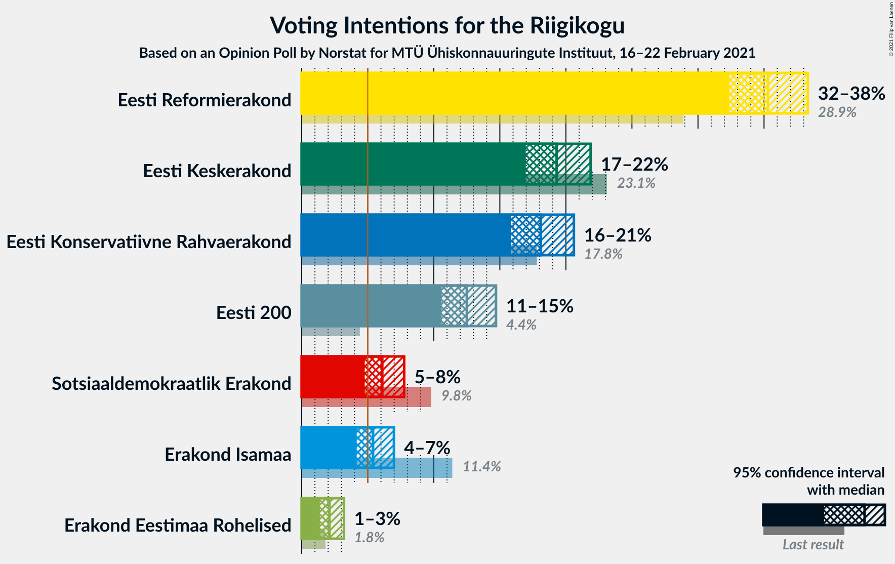

### Confidence Intervals

| Party | Last Result | Poll Result | 80% Confidence Interval | 90% Confidence Interval | 95% Confidence Interval | 99% Confidence Interval |
|:-----:|:-----------:|:-----------:|:-----------------------:|:-----------------------:|:-----------------------:|:-----------------------:|
| Eesti Reformierakond | 28.9% | 35.3% | 33.4–37.3% |32.9–37.8% |32.4–38.3% |31.5–39.3% |
| Eesti Keskerakond | 23.1% | 19.3% | 17.8–21.0% |17.3–21.5% |17.0–21.9% |16.3–22.7% |
| Eesti Konservatiivne Rahvaerakond | 17.8% | 18.1% | 16.6–19.7% |16.2–20.2% |15.8–20.6% |15.2–21.4% |
| Eesti 200 | 4.4% | 12.5% | 11.2–13.9% |10.9–14.3% |10.6–14.7% |10.0–15.4% |
| Sotsiaaldemokraatlik Erakond | 9.8% | 6.1% | 5.2–7.2% |5.0–7.5% |4.8–7.8% |4.4–8.3% |
| Erakond Isamaa | 11.4% | 5.4% | 4.6–6.4% |4.4–6.7% |4.2–7.0% |3.8–7.5% |
| Erakond Eestimaa Rohelised | 1.8% | 2.1% | 1.6–2.8% |1.5–3.0% |1.4–3.2% |1.2–3.6% |

*Note:* The poll result column reflects the actual value used in the calculations. Published results may vary slightly, and in addition be rounded to fewer digits.

## Seats

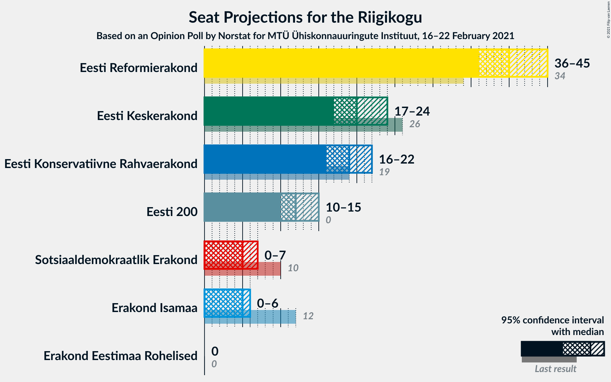

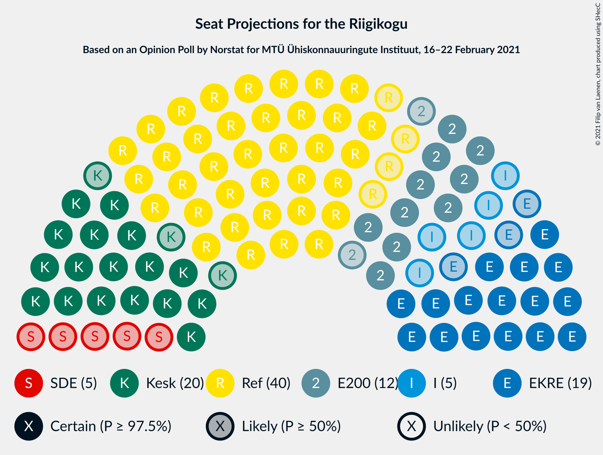

### Confidence Intervals

| Party | Last Result | Median | 80% Confidence Interval | 90% Confidence Interval | 95% Confidence Interval | 99% Confidence Interval |
|:-----:|:-----------:|:------:|:-----------------------:|:-----------------------:|:-----------------------:|:-----------------------:|
| <a href="#eesti-reformierakond">Eesti Reformierakond</a> | 34 | 40 | 38–43 |37–44 |36–45 |35–46 |
| <a href="#eesti-keskerakond">Eesti Keskerakond</a> | 26 | 20 | 18–23 |18–23 |17–24 |17–25 |
| <a href="#eesti-konservatiivne-rahvaerakond">Eesti Konservatiivne Rahvaerakond</a> | 19 | 19 | 17–21 |17–22 |16–22 |15–23 |
| <a href="#eesti-200">Eesti 200</a> | 0 | 12 | 11–14 |10–15 |10–15 |9–16 |
| <a href="#sotsiaaldemokraatlik-erakond">Sotsiaaldemokraatlik Erakond</a> | 10 | 5 | 4–6 |0–7 |0–7 |0–8 |
| <a href="#erakond-isamaa">Erakond Isamaa</a> | 12 | 5 | 0–6 |0–6 |0–6 |0–7 |
| <a href="#erakond-eestimaa-rohelised">Erakond Eestimaa Rohelised</a> | 0 | 0 | 0 |0 |0 |0 |

### Eesti Reformierakond

*For a full overview of the results for this party, see the [Eesti Reformierakond](party-eestireformierakond.html) page.*

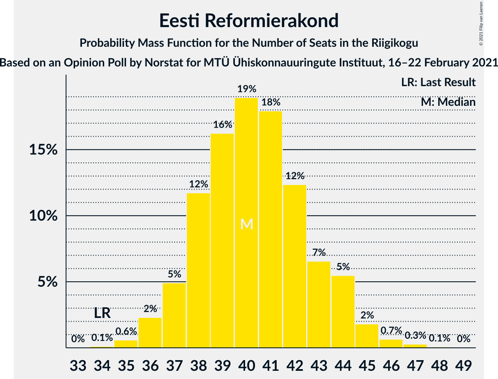

| Number of Seats | Probability | Accumulated | Special Marks |
|:---------------:|:-----------:|:-----------:|:-------------:|
| 34 | 0.1% | 100% | Last Result |
| 35 | 0.6% | 99.9% |  |
| 36 | 2% | 99.3% |  |
| 37 | 5% | 97% |  |
| 38 | 12% | 92% |  |
| 39 | 16% | 80% |  |
| 40 | 19% | 64% | Median |
| 41 | 18% | 45% |  |
| 42 | 12% | 27% |  |
| 43 | 7% | 15% |  |
| 44 | 5% | 8% |  |
| 45 | 2% | 3% |  |
| 46 | 0.7% | 1.0% |  |
| 47 | 0.3% | 0.4% |  |
| 48 | 0.1% | 0.1% |  |
| 49 | 0% | 0% |  |

### Eesti Keskerakond

*For a full overview of the results for this party, see the [Eesti Keskerakond](party-eestikeskerakond.html) page.*

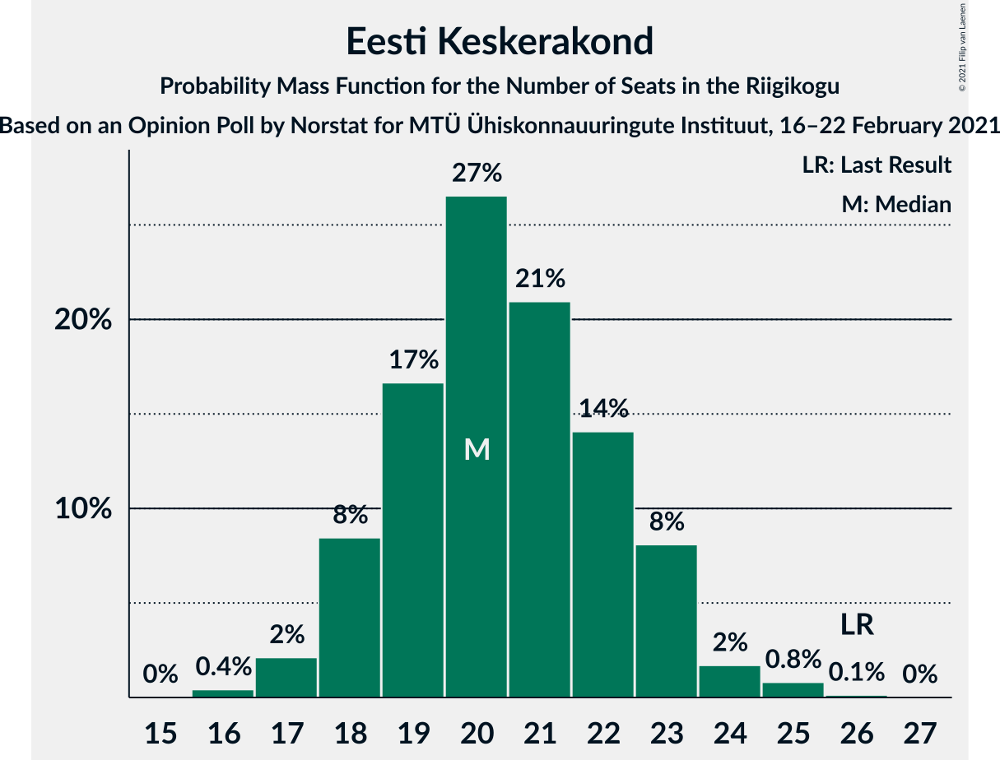

| Number of Seats | Probability | Accumulated | Special Marks |
|:---------------:|:-----------:|:-----------:|:-------------:|
| 16 | 0.4% | 100% |  |
| 17 | 2% | 99.5% |  |
| 18 | 8% | 97% |  |
| 19 | 17% | 89% |  |
| 20 | 27% | 72% | Median |
| 21 | 21% | 46% |  |
| 22 | 14% | 25% |  |
| 23 | 8% | 11% |  |
| 24 | 2% | 3% |  |
| 25 | 0.8% | 1.0% |  |
| 26 | 0.1% | 0.2% | Last Result |
| 27 | 0% | 0% |  |

### Eesti Konservatiivne Rahvaerakond

*For a full overview of the results for this party, see the [Eesti Konservatiivne Rahvaerakond](party-eestikonservatiivnerahvaerakond.html) page.*

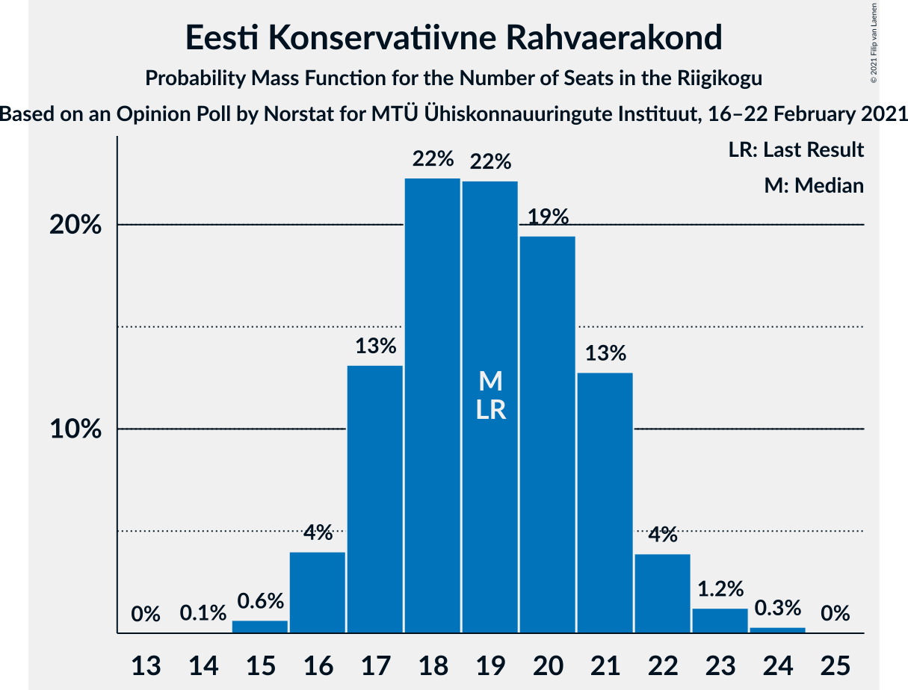

| Number of Seats | Probability | Accumulated | Special Marks |
|:---------------:|:-----------:|:-----------:|:-------------:|
| 14 | 0.1% | 100% |  |
| 15 | 0.6% | 99.9% |  |
| 16 | 4% | 99.3% |  |
| 17 | 13% | 95% |  |
| 18 | 22% | 82% |  |
| 19 | 22% | 60% | Last Result, Median |
| 20 | 19% | 38% |  |
| 21 | 13% | 18% |  |
| 22 | 4% | 5% |  |
| 23 | 1.2% | 2% |  |
| 24 | 0.3% | 0.4% |  |
| 25 | 0% | 0% |  |

### Eesti 200

*For a full overview of the results for this party, see the [Eesti 200](party-eesti200.html) page.*

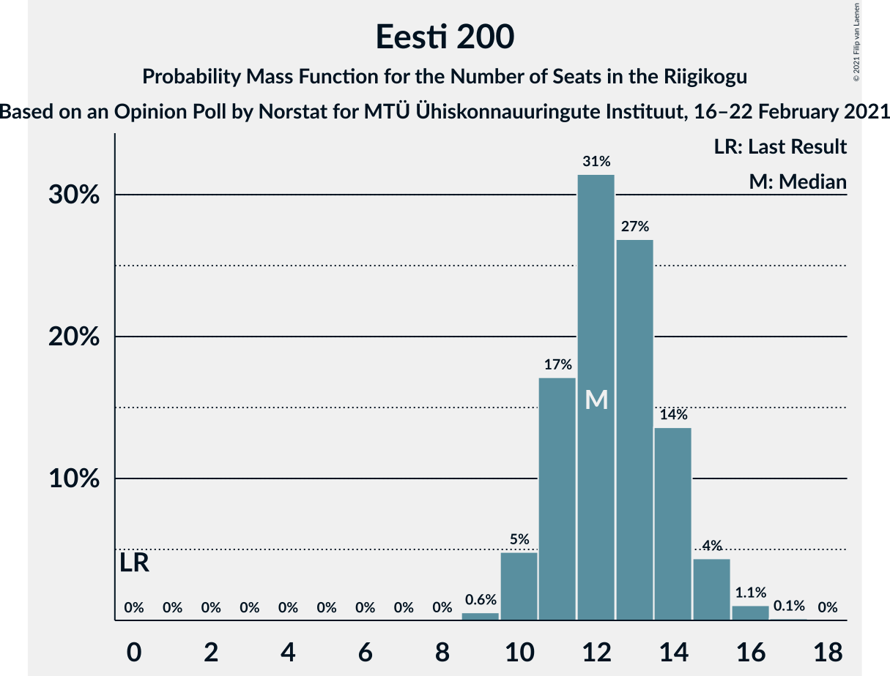

| Number of Seats | Probability | Accumulated | Special Marks |
|:---------------:|:-----------:|:-----------:|:-------------:|
| 0 | 0% | 100% | Last Result |
| 1 | 0% | 100% |  |
| 2 | 0% | 100% |  |
| 3 | 0% | 100% |  |
| 4 | 0% | 100% |  |
| 5 | 0% | 100% |  |
| 6 | 0% | 100% |  |
| 7 | 0% | 100% |  |
| 8 | 0% | 100% |  |
| 9 | 0.6% | 100% |  |
| 10 | 5% | 99.4% |  |
| 11 | 17% | 95% |  |
| 12 | 31% | 77% | Median |
| 13 | 27% | 46% |  |
| 14 | 14% | 19% |  |
| 15 | 4% | 6% |  |
| 16 | 1.1% | 1.2% |  |
| 17 | 0.1% | 0.1% |  |
| 18 | 0% | 0% |  |

### Sotsiaaldemokraatlik Erakond

*For a full overview of the results for this party, see the [Sotsiaaldemokraatlik Erakond](party-sotsiaaldemokraatlikerakond.html) page.*

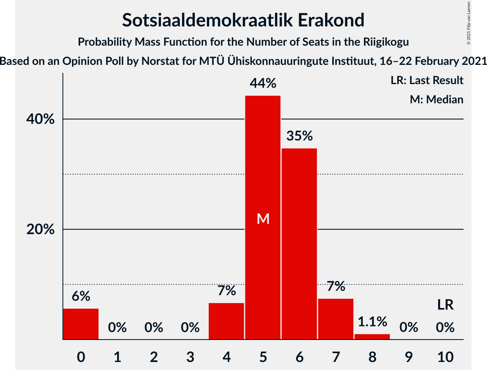

| Number of Seats | Probability | Accumulated | Special Marks |
|:---------------:|:-----------:|:-----------:|:-------------:|
| 0 | 6% | 100% |  |
| 1 | 0% | 94% |  |
| 2 | 0% | 94% |  |
| 3 | 0% | 94% |  |
| 4 | 7% | 94% |  |
| 5 | 44% | 88% | Median |
| 6 | 35% | 43% |  |
| 7 | 7% | 9% |  |
| 8 | 1.1% | 1.1% |  |
| 9 | 0% | 0% |  |
| 10 | 0% | 0% | Last Result |

### Erakond Isamaa

*For a full overview of the results for this party, see the [Erakond Isamaa](party-erakondisamaa.html) page.*

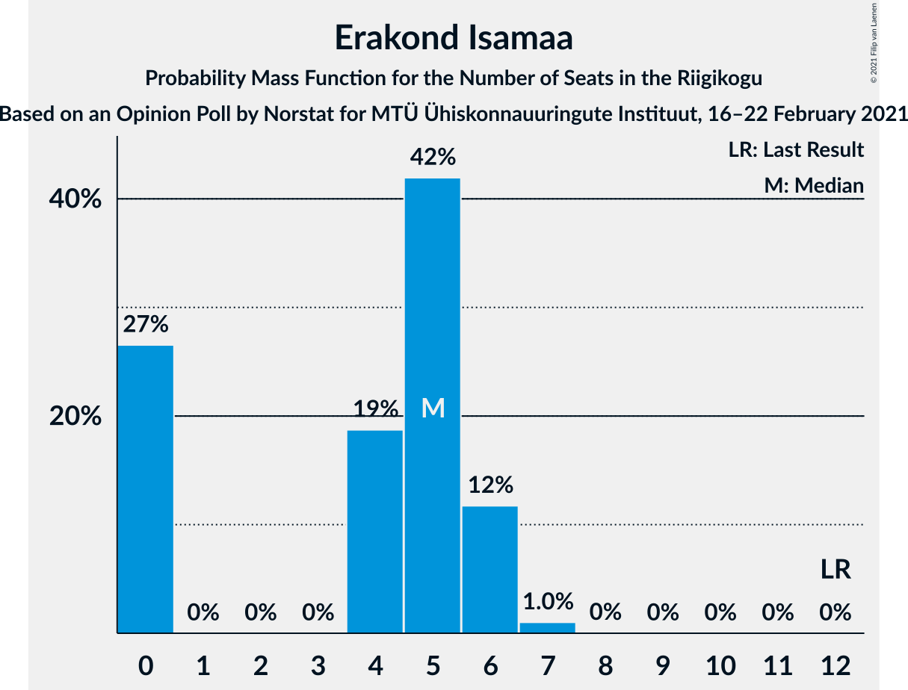

| Number of Seats | Probability | Accumulated | Special Marks |
|:---------------:|:-----------:|:-----------:|:-------------:|
| 0 | 27% | 100% |  |
| 1 | 0% | 73% |  |
| 2 | 0% | 73% |  |
| 3 | 0% | 73% |  |
| 4 | 19% | 73% |  |
| 5 | 42% | 55% | Median |
| 6 | 12% | 13% |  |
| 7 | 1.0% | 1.1% |  |
| 8 | 0% | 0% |  |
| 9 | 0% | 0% |  |
| 10 | 0% | 0% |  |
| 11 | 0% | 0% |  |
| 12 | 0% | 0% | Last Result |

### Erakond Eestimaa Rohelised

*For a full overview of the results for this party, see the [Erakond Eestimaa Rohelised](party-erakondeestimaarohelised.html) page.*

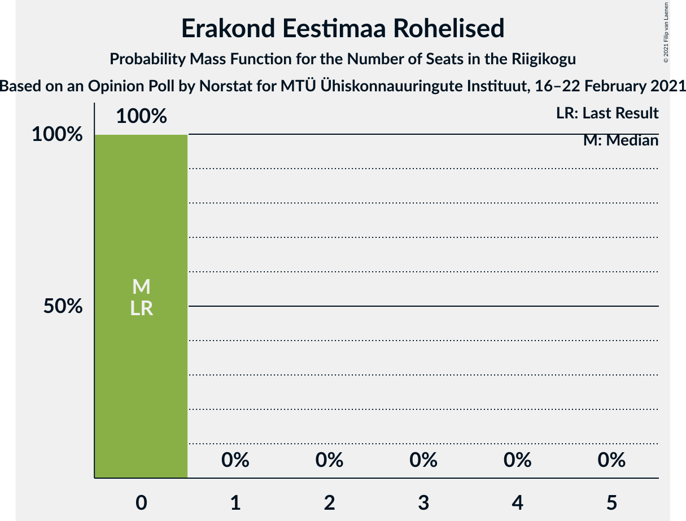

| Number of Seats | Probability | Accumulated | Special Marks |
|:---------------:|:-----------:|:-----------:|:-------------:|
| 0 | 100% | 100% | Last Result, Median |

## Coalitions

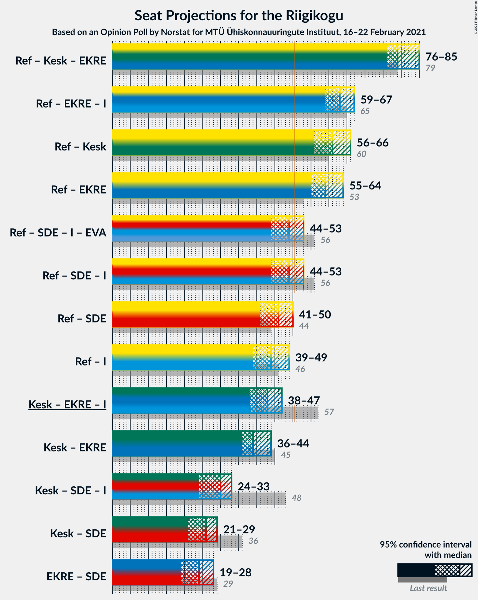

### Confidence Intervals

| Coalition | Last Result | Median | Majority? | 80% Confidence Interval | 90% Confidence Interval | 95% Confidence Interval | 99% Confidence Interval |
|:---------:|:-----------:|:------:|:---------:|:-----------------------:|:-----------------------:|:-----------------------:|:-----------------------:|
| Eesti Reformierakond – Eesti Keskerakond – Eesti Konservatiivne Rahvaerakond | 79 | 79 | 100% | 77–83 | 76–84 | 76–85 | 75–88 |
| Eesti Reformierakond – Eesti Konservatiivne Rahvaerakond – Erakond Isamaa | 65 | 63 | 100% | 60–66 | 59–67 | 59–67 | 57–69 |
| Eesti Reformierakond – Eesti Keskerakond | 60 | 61 | 100% | 58–64 | 57–65 | 56–66 | 55–68 |
| Eesti Reformierakond – Eesti Konservatiivne Rahvaerakond | 53 | 59 | 100% | 56–62 | 56–64 | 55–64 | 54–66 |
| Eesti Reformierakond – Sotsiaaldemokraatlik Erakond – Erakond Isamaa | 56 | 49 | 30% | 46–52 | 45–52 | 44–53 | 43–55 |
| Eesti Reformierakond – Sotsiaaldemokraatlik Erakond | 44 | 46 | 1.1% | 43–48 | 42–49 | 41–50 | 39–51 |
| Eesti Reformierakond – Erakond Isamaa | 46 | 44 | 0.2% | 41–47 | 40–48 | 39–49 | 38–50 |
| Eesti Keskerakond – Eesti Konservatiivne Rahvaerakond – Erakond Isamaa | 57 | 43 | 0.1% | 40–46 | 39–47 | 38–47 | 37–49 |
| Eesti Keskerakond – Eesti Konservatiivne Rahvaerakond | 45 | 39 | 0% | 37–42 | 36–43 | 36–44 | 34–45 |
| Eesti Keskerakond – Sotsiaaldemokraatlik Erakond – Erakond Isamaa | 48 | 30 | 0% | 26–32 | 25–33 | 24–33 | 21–34 |
| Eesti Keskerakond – Sotsiaaldemokraatlik Erakond | 36 | 26 | 0% | 23–28 | 22–29 | 21–29 | 19–30 |
| Eesti Konservatiivne Rahvaerakond – Sotsiaaldemokraatlik Erakond | 29 | 24 | 0% | 22–27 | 21–27 | 19–28 | 18–29 |

### Eesti Reformierakond – Eesti Keskerakond – Eesti Konservatiivne Rahvaerakond

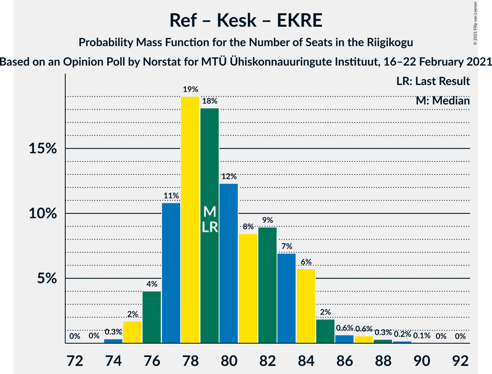

| Number of Seats | Probability | Accumulated | Special Marks |
|:---------------:|:-----------:|:-----------:|:-------------:|
| 74 | 0.3% | 100% |  |
| 75 | 2% | 99.6% |  |
| 76 | 4% | 98% |  |
| 77 | 11% | 94% |  |
| 78 | 19% | 83% |  |
| 79 | 18% | 64% | Last Result, Median |
| 80 | 12% | 46% |  |
| 81 | 8% | 34% |  |
| 82 | 9% | 25% |  |
| 83 | 7% | 16% |  |
| 84 | 6% | 9% |  |
| 85 | 2% | 4% |  |
| 86 | 0.6% | 2% |  |
| 87 | 0.6% | 1.1% |  |
| 88 | 0.3% | 0.5% |  |
| 89 | 0.2% | 0.2% |  |
| 90 | 0.1% | 0.1% |  |
| 91 | 0% | 0% |  |

### Eesti Reformierakond – Eesti Konservatiivne Rahvaerakond – Erakond Isamaa

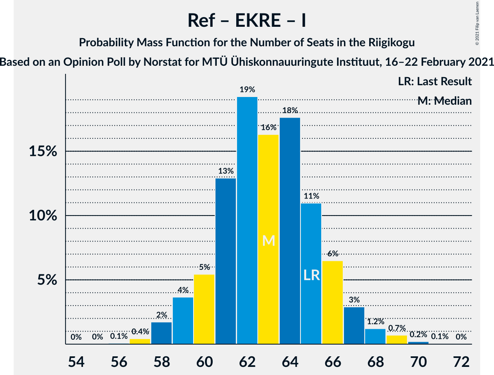

| Number of Seats | Probability | Accumulated | Special Marks |
|:---------------:|:-----------:|:-----------:|:-------------:|
| 56 | 0.1% | 100% |  |
| 57 | 0.4% | 99.9% |  |
| 58 | 2% | 99.5% |  |
| 59 | 4% | 98% |  |
| 60 | 5% | 94% |  |
| 61 | 13% | 89% |  |
| 62 | 19% | 76% |  |
| 63 | 16% | 56% |  |
| 64 | 18% | 40% | Median |
| 65 | 11% | 23% | Last Result |
| 66 | 6% | 12% |  |
| 67 | 3% | 5% |  |
| 68 | 1.2% | 2% |  |
| 69 | 0.7% | 1.0% |  |
| 70 | 0.2% | 0.3% |  |
| 71 | 0.1% | 0.1% |  |
| 72 | 0% | 0% |  |

### Eesti Reformierakond – Eesti Keskerakond

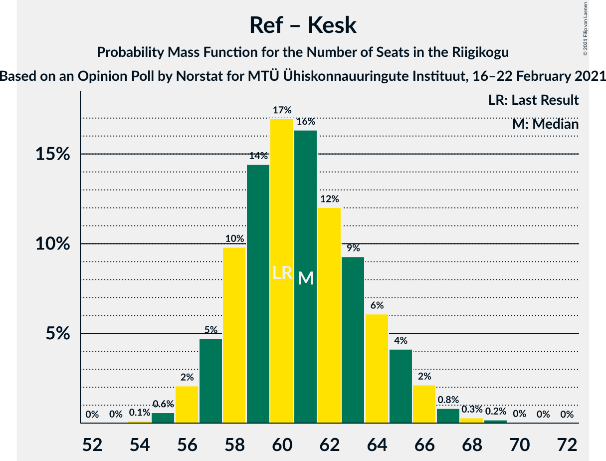

| Number of Seats | Probability | Accumulated | Special Marks |
|:---------------:|:-----------:|:-----------:|:-------------:|
| 54 | 0.1% | 100% |  |
| 55 | 0.6% | 99.9% |  |
| 56 | 2% | 99.3% |  |
| 57 | 5% | 97% |  |
| 58 | 10% | 92% |  |
| 59 | 14% | 83% |  |
| 60 | 17% | 68% | Last Result, Median |
| 61 | 16% | 51% |  |
| 62 | 12% | 35% |  |
| 63 | 9% | 23% |  |
| 64 | 6% | 14% |  |
| 65 | 4% | 8% |  |
| 66 | 2% | 3% |  |
| 67 | 0.8% | 1.3% |  |
| 68 | 0.3% | 0.5% |  |
| 69 | 0.2% | 0.2% |  |
| 70 | 0% | 0.1% |  |
| 71 | 0% | 0% |  |

### Eesti Reformierakond – Eesti Konservatiivne Rahvaerakond

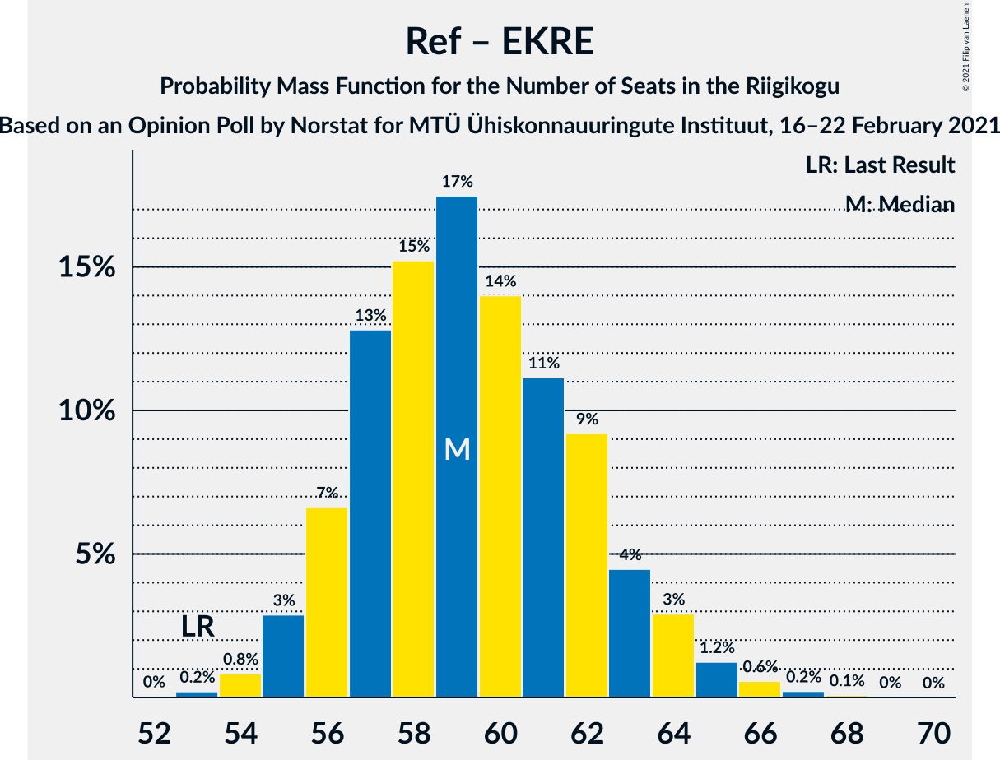

| Number of Seats | Probability | Accumulated | Special Marks |
|:---------------:|:-----------:|:-----------:|:-------------:|
| 52 | 0% | 100% |  |
| 53 | 0.2% | 99.9% | Last Result |
| 54 | 0.8% | 99.7% |  |
| 55 | 3% | 98.9% |  |
| 56 | 7% | 96% |  |
| 57 | 13% | 89% |  |
| 58 | 15% | 77% |  |
| 59 | 17% | 61% | Median |
| 60 | 14% | 44% |  |
| 61 | 11% | 30% |  |
| 62 | 9% | 19% |  |
| 63 | 4% | 10% |  |
| 64 | 3% | 5% |  |
| 65 | 1.2% | 2% |  |
| 66 | 0.6% | 0.9% |  |
| 67 | 0.2% | 0.3% |  |
| 68 | 0.1% | 0.1% |  |
| 69 | 0% | 0% |  |

### Eesti Reformierakond – Sotsiaaldemokraatlik Erakond – Erakond Isamaa

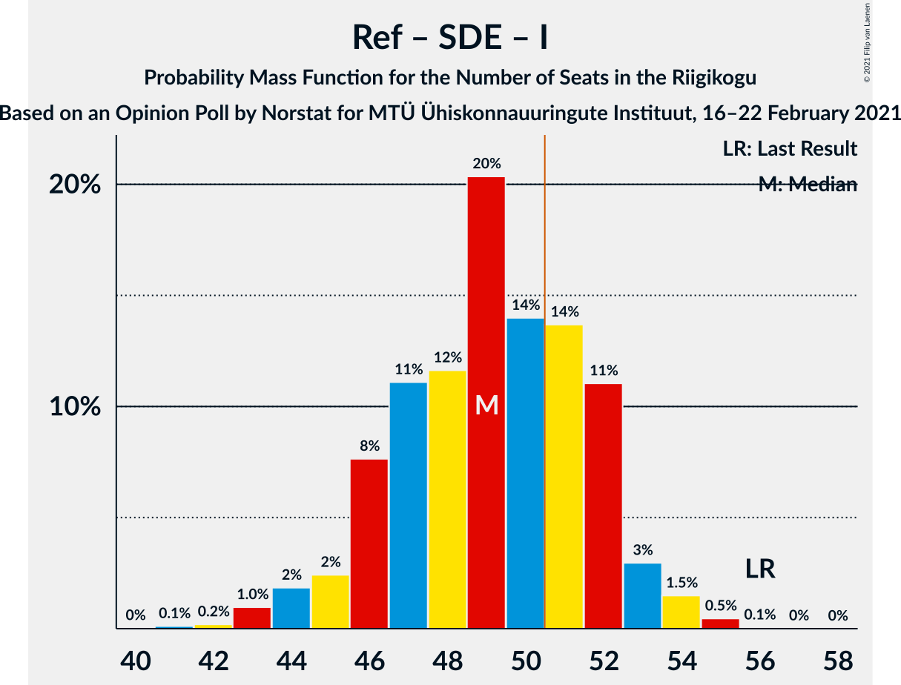

| Number of Seats | Probability | Accumulated | Special Marks |
|:---------------:|:-----------:|:-----------:|:-------------:|
| 41 | 0.1% | 100% |  |
| 42 | 0.2% | 99.8% |  |
| 43 | 1.0% | 99.7% |  |
| 44 | 2% | 98.7% |  |
| 45 | 2% | 97% |  |
| 46 | 8% | 94% |  |
| 47 | 11% | 87% |  |
| 48 | 12% | 76% |  |
| 49 | 20% | 64% |  |
| 50 | 14% | 44% | Median |
| 51 | 14% | 30% | Majority |
| 52 | 11% | 16% |  |
| 53 | 3% | 5% |  |
| 54 | 1.5% | 2% |  |
| 55 | 0.5% | 0.5% |  |
| 56 | 0.1% | 0.1% | Last Result |
| 57 | 0% | 0% |  |

### Eesti Reformierakond – Sotsiaaldemokraatlik Erakond

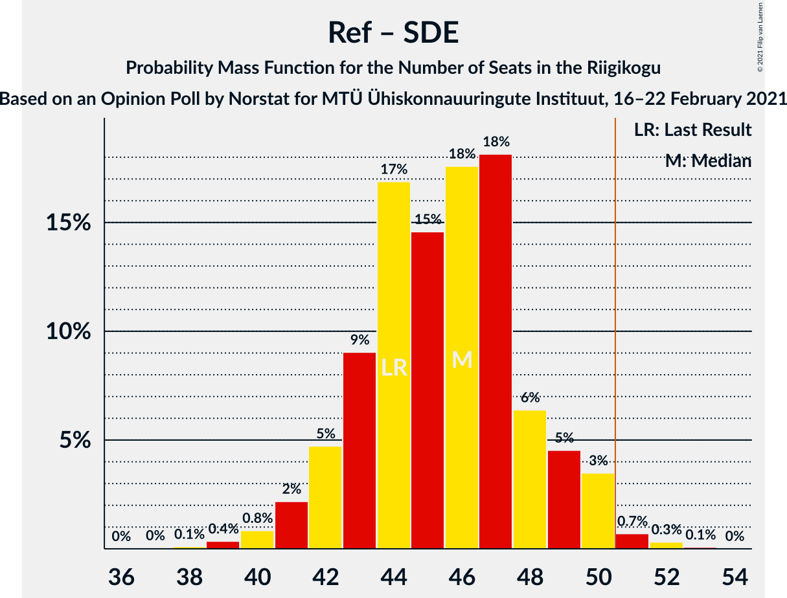

| Number of Seats | Probability | Accumulated | Special Marks |
|:---------------:|:-----------:|:-----------:|:-------------:|
| 37 | 0% | 100% |  |
| 38 | 0.1% | 99.9% |  |
| 39 | 0.4% | 99.8% |  |
| 40 | 0.8% | 99.5% |  |
| 41 | 2% | 98.7% |  |
| 42 | 5% | 96% |  |
| 43 | 9% | 92% |  |
| 44 | 17% | 83% | Last Result |
| 45 | 15% | 66% | Median |
| 46 | 18% | 51% |  |
| 47 | 18% | 34% |  |
| 48 | 6% | 16% |  |
| 49 | 5% | 9% |  |
| 50 | 3% | 5% |  |
| 51 | 0.7% | 1.1% | Majority |
| 52 | 0.3% | 0.4% |  |
| 53 | 0.1% | 0.1% |  |
| 54 | 0% | 0% |  |

### Eesti Reformierakond – Erakond Isamaa

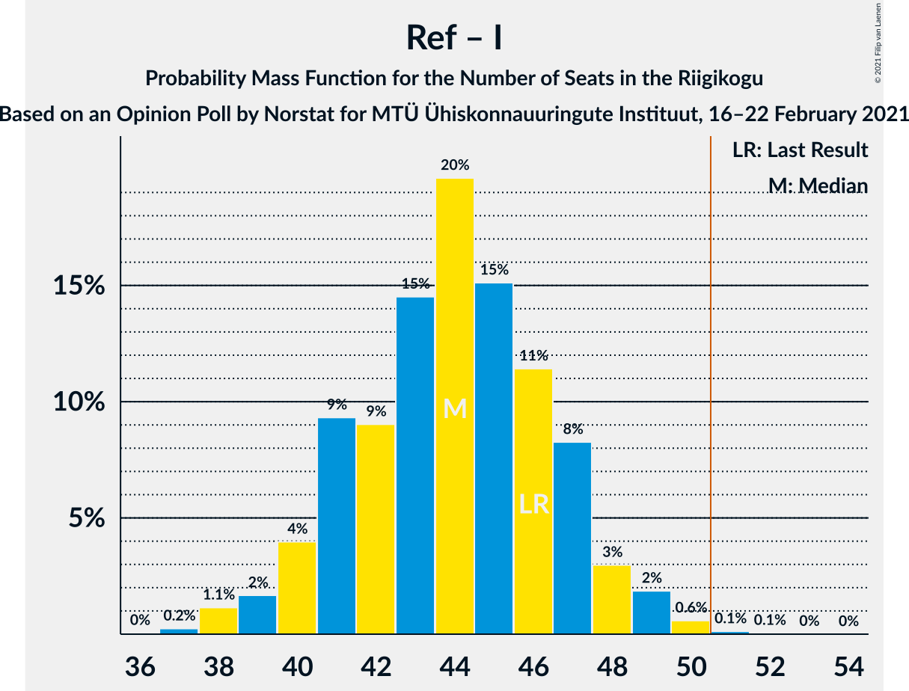

| Number of Seats | Probability | Accumulated | Special Marks |
|:---------------:|:-----------:|:-----------:|:-------------:|
| 36 | 0% | 100% |  |
| 37 | 0.2% | 99.9% |  |
| 38 | 1.1% | 99.7% |  |
| 39 | 2% | 98.5% |  |
| 40 | 4% | 97% |  |
| 41 | 9% | 93% |  |
| 42 | 9% | 84% |  |
| 43 | 15% | 75% |  |
| 44 | 20% | 60% |  |
| 45 | 15% | 40% | Median |
| 46 | 11% | 25% | Last Result |
| 47 | 8% | 14% |  |
| 48 | 3% | 6% |  |
| 49 | 2% | 3% |  |
| 50 | 0.6% | 0.8% |  |
| 51 | 0.1% | 0.2% | Majority |
| 52 | 0.1% | 0.1% |  |
| 53 | 0% | 0% |  |

### Eesti Keskerakond – Eesti Konservatiivne Rahvaerakond – Erakond Isamaa

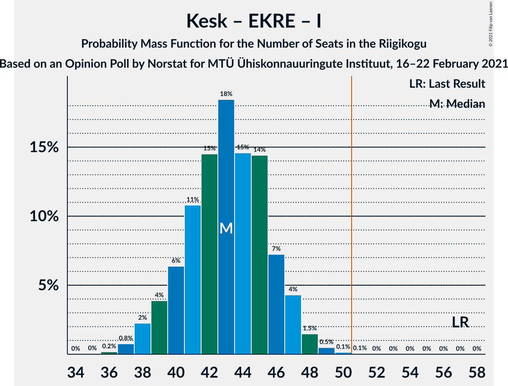

| Number of Seats | Probability | Accumulated | Special Marks |
|:---------------:|:-----------:|:-----------:|:-------------:|
| 35 | 0% | 100% |  |
| 36 | 0.2% | 99.9% |  |
| 37 | 0.8% | 99.8% |  |
| 38 | 2% | 99.0% |  |
| 39 | 4% | 97% |  |
| 40 | 6% | 93% |  |
| 41 | 11% | 86% |  |
| 42 | 15% | 76% |  |
| 43 | 18% | 61% |  |
| 44 | 15% | 43% | Median |
| 45 | 14% | 28% |  |
| 46 | 7% | 14% |  |
| 47 | 4% | 6% |  |
| 48 | 1.5% | 2% |  |
| 49 | 0.5% | 0.7% |  |
| 50 | 0.1% | 0.2% |  |
| 51 | 0.1% | 0.1% | Majority |
| 52 | 0% | 0% |  |
| 53 | 0% | 0% |  |
| 54 | 0% | 0% |  |
| 55 | 0% | 0% |  |
| 56 | 0% | 0% |  |
| 57 | 0% | 0% | Last Result |

### Eesti Keskerakond – Eesti Konservatiivne Rahvaerakond

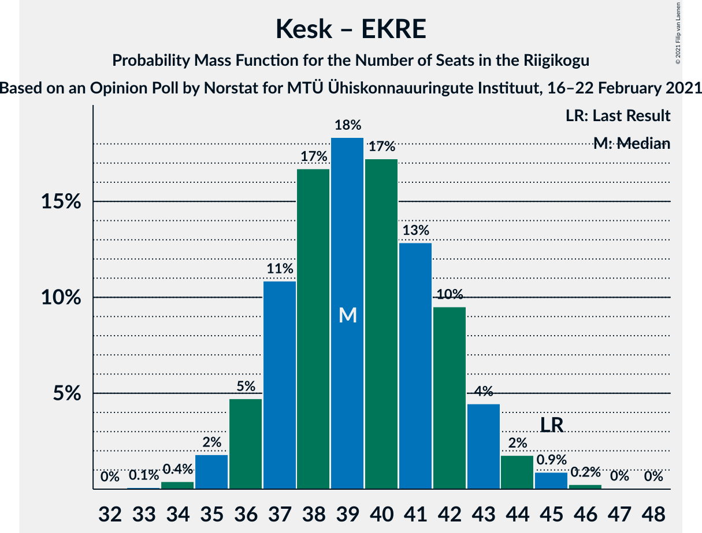

| Number of Seats | Probability | Accumulated | Special Marks |
|:---------------:|:-----------:|:-----------:|:-------------:|
| 33 | 0.1% | 100% |  |
| 34 | 0.4% | 99.9% |  |
| 35 | 2% | 99.5% |  |
| 36 | 5% | 98% |  |
| 37 | 11% | 93% |  |
| 38 | 17% | 82% |  |
| 39 | 18% | 65% | Median |
| 40 | 17% | 47% |  |
| 41 | 13% | 30% |  |
| 42 | 10% | 17% |  |
| 43 | 4% | 7% |  |
| 44 | 2% | 3% |  |
| 45 | 0.9% | 1.2% | Last Result |
| 46 | 0.2% | 0.3% |  |
| 47 | 0% | 0.1% |  |
| 48 | 0% | 0% |  |

### Eesti Keskerakond – Sotsiaaldemokraatlik Erakond – Erakond Isamaa

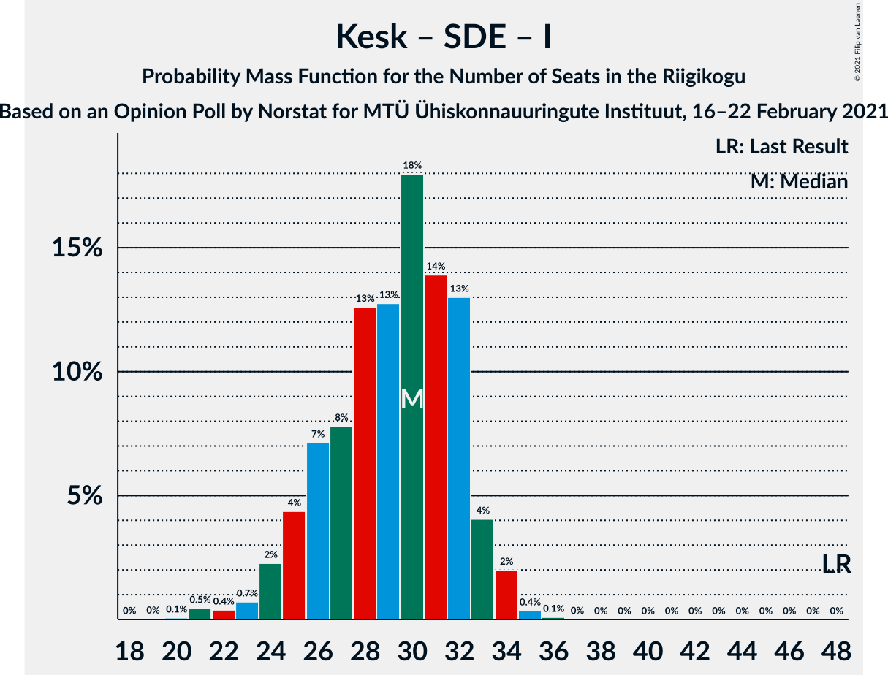

| Number of Seats | Probability | Accumulated | Special Marks |
|:---------------:|:-----------:|:-----------:|:-------------:|
| 20 | 0.1% | 100% |  |
| 21 | 0.5% | 99.9% |  |
| 22 | 0.4% | 99.4% |  |
| 23 | 0.7% | 99.1% |  |
| 24 | 2% | 98% |  |
| 25 | 4% | 96% |  |
| 26 | 7% | 92% |  |
| 27 | 8% | 85% |  |
| 28 | 13% | 77% |  |
| 29 | 13% | 64% |  |
| 30 | 18% | 51% | Median |
| 31 | 14% | 33% |  |
| 32 | 13% | 20% |  |
| 33 | 4% | 7% |  |
| 34 | 2% | 2% |  |
| 35 | 0.4% | 0.5% |  |
| 36 | 0.1% | 0.1% |  |
| 37 | 0% | 0% |  |
| 38 | 0% | 0% |  |
| 39 | 0% | 0% |  |
| 40 | 0% | 0% |  |
| 41 | 0% | 0% |  |
| 42 | 0% | 0% |  |
| 43 | 0% | 0% |  |
| 44 | 0% | 0% |  |
| 45 | 0% | 0% |  |
| 46 | 0% | 0% |  |
| 47 | 0% | 0% |  |
| 48 | 0% | 0% | Last Result |

### Eesti Keskerakond – Sotsiaaldemokraatlik Erakond

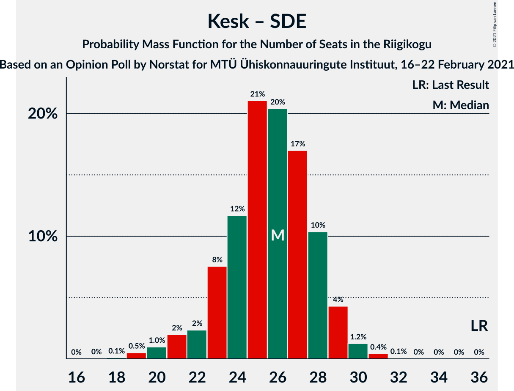

| Number of Seats | Probability | Accumulated | Special Marks |
|:---------------:|:-----------:|:-----------:|:-------------:|
| 18 | 0.1% | 100% |  |
| 19 | 0.5% | 99.9% |  |
| 20 | 1.0% | 99.4% |  |
| 21 | 2% | 98% |  |
| 22 | 2% | 96% |  |
| 23 | 8% | 94% |  |
| 24 | 12% | 87% |  |
| 25 | 21% | 75% | Median |
| 26 | 20% | 54% |  |
| 27 | 17% | 33% |  |
| 28 | 10% | 16% |  |
| 29 | 4% | 6% |  |
| 30 | 1.2% | 2% |  |
| 31 | 0.4% | 0.5% |  |
| 32 | 0.1% | 0.1% |  |
| 33 | 0% | 0% |  |
| 34 | 0% | 0% |  |
| 35 | 0% | 0% |  |
| 36 | 0% | 0% | Last Result |

### Eesti Konservatiivne Rahvaerakond – Sotsiaaldemokraatlik Erakond

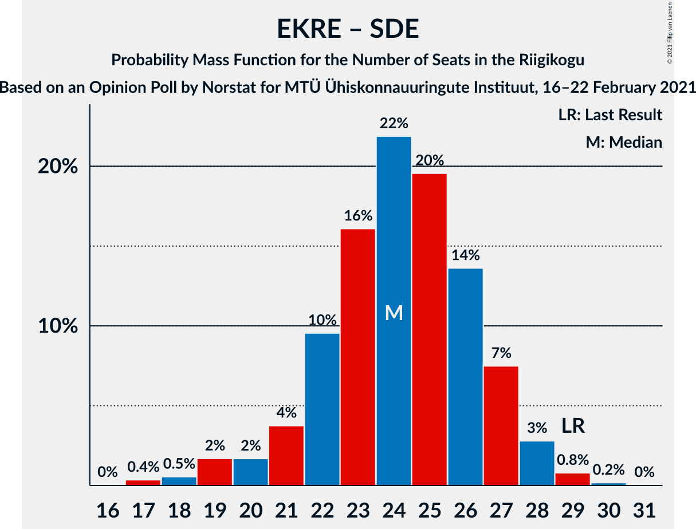

| Number of Seats | Probability | Accumulated | Special Marks |
|:---------------:|:-----------:|:-----------:|:-------------:|
| 17 | 0.4% | 100% |  |
| 18 | 0.5% | 99.6% |  |
| 19 | 2% | 99.1% |  |
| 20 | 2% | 97% |  |
| 21 | 4% | 96% |  |
| 22 | 10% | 92% |  |
| 23 | 16% | 82% |  |
| 24 | 22% | 66% | Median |
| 25 | 20% | 44% |  |
| 26 | 14% | 25% |  |
| 27 | 7% | 11% |  |
| 28 | 3% | 4% |  |
| 29 | 0.8% | 1.0% | Last Result |
| 30 | 0.2% | 0.2% |  |
| 31 | 0% | 0% |  |

## Technical Information

### Opinion Poll

+ **Polling firm:** Norstat
+ **Commissioner(s):** MTÜ Ühiskonnauuringute Instituut
+ **Fieldwork period:** 16–22 February 2021

### Calculations

+ **Sample size:** 1000
+ **Simulations done:** 1,048,576
+ **Error estimate:** 1.92%

