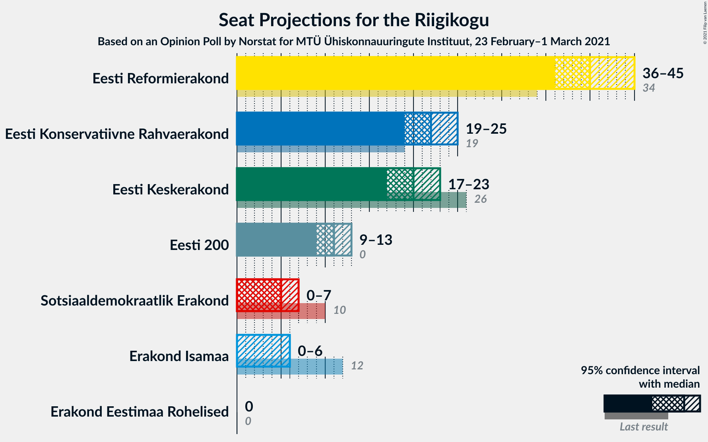
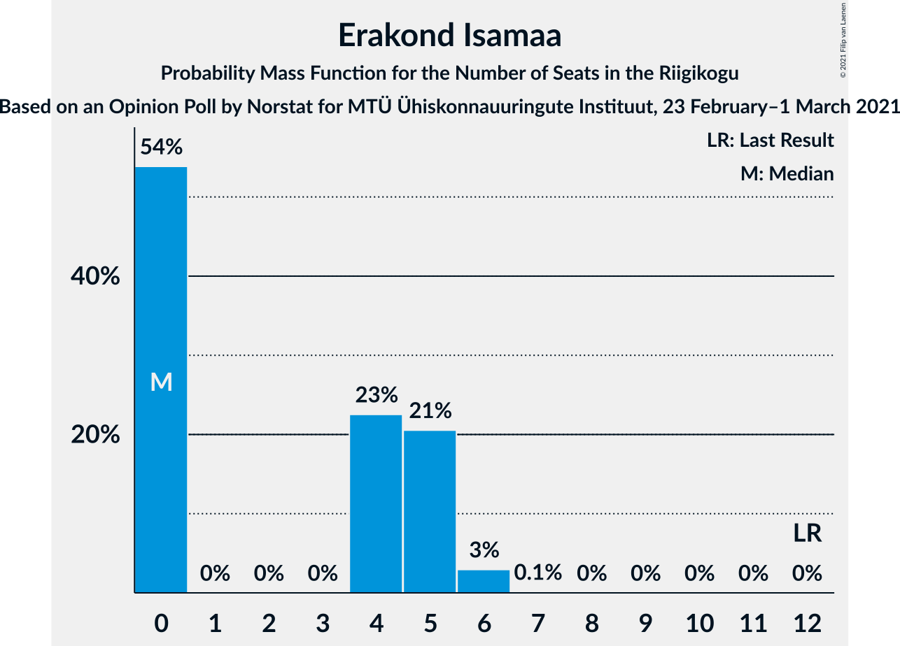

# Opinion Poll by Norstat for MTÜ Ühiskonnauuringute Instituut, 23 February–1 March 2021

<a href="#voting-intentions">Voting Intentions</a> | <a href="#seats">Seats</a> | <a href="#coalitions">Coalitions</a> | <a href="#technical-information">Technical Information</a>

## Voting Intentions

### Confidence Intervals

| Party | Last Result | Poll Result | 80% Confidence Interval | 90% Confidence Interval | 95% Confidence Interval | 99% Confidence Interval |
|:-----:|:-----------:|:-----------:|:-----------------------:|:-----------------------:|:-----------------------:|:-----------------------:|
| Eesti Reformierakond | 28.9% | 35.4% | 33.5–37.4% |33.0–37.9% |32.5–38.4% |31.6–39.4% |
| Eesti Konservatiivne Rahvaerakond | 17.8% | 20.5% | 18.9–22.2% |18.5–22.7% |18.1–23.1% |17.4–24.0% |
| Eesti Keskerakond | 23.1% | 18.8% | 17.3–20.5% |16.9–20.9% |16.5–21.4% |15.8–22.2% |
| Eesti 200 | 4.4% | 11.2% | 10.0–12.6% |9.7–13.0% |9.4–13.3% |8.8–14.0% |
| Sotsiaaldemokraatlik Erakond | 9.8% | 6.2% | 5.3–7.3% |5.1–7.6% |4.9–7.9% |4.5–8.4% |
| Erakond Isamaa | 11.4% | 4.9% | 4.1–5.9% |3.9–6.2% |3.7–6.4% |3.4–6.9% |
| Erakond Eestimaa Rohelised | 1.8% | 1.9% | 1.4–2.6% |1.3–2.8% |1.2–3.0% |1.0–3.3% |

*Note:* The poll result column reflects the actual value used in the calculations. Published results may vary slightly, and in addition be rounded to fewer digits.

## Seats

### Confidence Intervals

| Party | Last Result | Median | 80% Confidence Interval | 90% Confidence Interval | 95% Confidence Interval | 99% Confidence Interval |
|:-----:|:-----------:|:------:|:-----------------------:|:-----------------------:|:-----------------------:|:-----------------------:|
| <a href="#eesti-reformierakond">Eesti Reformierakond</a> | 34 | 40 | 38–43 |37–44 |36–45 |35–46 |
| <a href="#eesti-konservatiivne-rahvaerakond">Eesti Konservatiivne Rahvaerakond</a> | 19 | 22 | 20–24 |19–25 |19–25 |18–26 |
| <a href="#eesti-keskerakond">Eesti Keskerakond</a> | 26 | 20 | 18–22 |17–23 |17–23 |16–24 |
| <a href="#eesti-200">Eesti 200</a> | 0 | 11 | 9–13 |9–13 |9–13 |8–14 |
| <a href="#sotsiaaldemokraatlik-erakond">Sotsiaaldemokraatlik Erakond</a> | 10 | 5 | 4–7 |4–7 |0–7 |0–8 |
| <a href="#erakond-isamaa">Erakond Isamaa</a> | 12 | 0 | 0–5 |0–5 |0–6 |0–6 |
| <a href="#erakond-eestimaa-rohelised">Erakond Eestimaa Rohelised</a> | 0 | 0 | 0 |0 |0 |0 |

### Eesti Reformierakond

*For a full overview of the results for this party, see the [Eesti Reformierakond](party-eestireformierakond.html) page.*

| Number of Seats | Probability | Accumulated | Special Marks |
|:---------------:|:-----------:|:-----------:|:-------------:|
| 34 | 0.1% | 100% | Last Result |
| 35 | 0.4% | 99.9% |  |
| 36 | 3% | 99.4% |  |
| 37 | 2% | 97% |  |
| 38 | 12% | 94% |  |
| 39 | 19% | 83% |  |
| 40 | 19% | 63% | Median |
| 41 | 12% | 44% |  |
| 42 | 12% | 32% |  |
| 43 | 10% | 19% |  |
| 44 | 6% | 10% |  |
| 45 | 3% | 4% |  |
| 46 | 0.6% | 0.9% |  |
| 47 | 0.2% | 0.3% |  |
| 48 | 0.1% | 0.1% |  |
| 49 | 0% | 0% |  |

### Eesti Konservatiivne Rahvaerakond

*For a full overview of the results for this party, see the [Eesti Konservatiivne Rahvaerakond](party-eestikonservatiivnerahvaerakond.html) page.*

| Number of Seats | Probability | Accumulated | Special Marks |
|:---------------:|:-----------:|:-----------:|:-------------:|
| 17 | 0.3% | 100% |  |
| 18 | 0.7% | 99.7% |  |
| 19 | 5% | 99.0% | Last Result |
| 20 | 13% | 94% |  |
| 21 | 13% | 81% |  |
| 22 | 23% | 69% | Median |
| 23 | 29% | 46% |  |
| 24 | 11% | 17% |  |
| 25 | 4% | 6% |  |
| 26 | 2% | 2% |  |
| 27 | 0.1% | 0.2% |  |
| 28 | 0.1% | 0.1% |  |
| 29 | 0% | 0% |  |

### Eesti Keskerakond

*For a full overview of the results for this party, see the [Eesti Keskerakond](party-eestikeskerakond.html) page.*

| Number of Seats | Probability | Accumulated | Special Marks |
|:---------------:|:-----------:|:-----------:|:-------------:|
| 15 | 0.2% | 100% |  |
| 16 | 1.0% | 99.8% |  |
| 17 | 4% | 98.8% |  |
| 18 | 14% | 95% |  |
| 19 | 21% | 81% |  |
| 20 | 24% | 60% | Median |
| 21 | 19% | 35% |  |
| 22 | 11% | 16% |  |
| 23 | 4% | 5% |  |
| 24 | 1.3% | 2% |  |
| 25 | 0.3% | 0.3% |  |
| 26 | 0% | 0% | Last Result |

### Eesti 200

*For a full overview of the results for this party, see the [Eesti 200](party-eesti200.html) page.*

| Number of Seats | Probability | Accumulated | Special Marks |
|:---------------:|:-----------:|:-----------:|:-------------:|
| 0 | 0% | 100% | Last Result |
| 1 | 0% | 100% |  |
| 2 | 0% | 100% |  |
| 3 | 0% | 100% |  |
| 4 | 0% | 100% |  |
| 5 | 0% | 100% |  |
| 6 | 0% | 100% |  |
| 7 | 0% | 100% |  |
| 8 | 0.7% | 100% |  |
| 9 | 12% | 99.3% |  |
| 10 | 15% | 88% |  |
| 11 | 39% | 73% | Median |
| 12 | 20% | 34% |  |
| 13 | 12% | 14% |  |
| 14 | 2% | 2% |  |
| 15 | 0.2% | 0.2% |  |
| 16 | 0% | 0% |  |

### Sotsiaaldemokraatlik Erakond

*For a full overview of the results for this party, see the [Sotsiaaldemokraatlik Erakond](party-sotsiaaldemokraatlikerakond.html) page.*

| Number of Seats | Probability | Accumulated | Special Marks |
|:---------------:|:-----------:|:-----------:|:-------------:|
| 0 | 5% | 100% |  |
| 1 | 0% | 95% |  |
| 2 | 0% | 95% |  |
| 3 | 0% | 95% |  |
| 4 | 7% | 95% |  |
| 5 | 46% | 89% | Median |
| 6 | 32% | 43% |  |
| 7 | 11% | 12% |  |
| 8 | 1.0% | 1.0% |  |
| 9 | 0.1% | 0.1% |  |
| 10 | 0% | 0% | Last Result |

### Erakond Isamaa

*For a full overview of the results for this party, see the [Erakond Isamaa](party-erakondisamaa.html) page.*

| Number of Seats | Probability | Accumulated | Special Marks |
|:---------------:|:-----------:|:-----------:|:-------------:|
| 0 | 54% | 100% | Median |
| 1 | 0% | 46% |  |
| 2 | 0% | 46% |  |
| 3 | 0% | 46% |  |
| 4 | 23% | 46% |  |
| 5 | 21% | 24% |  |
| 6 | 3% | 3% |  |
| 7 | 0.1% | 0.1% |  |
| 8 | 0% | 0% |  |
| 9 | 0% | 0% |  |
| 10 | 0% | 0% |  |
| 11 | 0% | 0% |  |
| 12 | 0% | 0% | Last Result |

### Erakond Eestimaa Rohelised

*For a full overview of the results for this party, see the [Erakond Eestimaa Rohelised](party-erakondeestimaarohelised.html) page.*

| Number of Seats | Probability | Accumulated | Special Marks |
|:---------------:|:-----------:|:-----------:|:-------------:|
| 0 | 100% | 100% | Last Result, Median |

## Coalitions

### Confidence Intervals

| Coalition | Last Result | Median | Majority? | 80% Confidence Interval | 90% Confidence Interval | 95% Confidence Interval | 99% Confidence Interval |
|:---------:|:-----------:|:------:|:---------:|:-----------------------:|:-----------------------:|:-----------------------:|:-----------------------:|
| Eesti Reformierakond – Eesti Konservatiivne Rahvaerakond – Eesti Keskerakond | 79 | 83 | 100% | 79–85 | 78–87 | 78–87 | 77–89 |
| Eesti Reformierakond – Eesti Konservatiivne Rahvaerakond – Erakond Isamaa | 65 | 65 | 100% | 62–68 | 62–68 | 61–69 | 59–71 |
| Eesti Reformierakond – Eesti Konservatiivne Rahvaerakond | 53 | 63 | 100% | 59–65 | 59–66 | 58–67 | 56–68 |
| Eesti Reformierakond – Eesti Keskerakond | 60 | 60 | 100% | 58–64 | 56–65 | 56–65 | 55–67 |
| Eesti Reformierakond – Sotsiaaldemokraatlik Erakond – Erakond Isamaa | 56 | 48 | 14% | 45–51 | 44–51 | 43–52 | 41–54 |
| Eesti Reformierakond – Sotsiaaldemokraatlik Erakond | 44 | 46 | 2% | 43–49 | 42–50 | 41–50 | 40–52 |
| Eesti Konservatiivne Rahvaerakond – Eesti Keskerakond – Erakond Isamaa | 57 | 44 | 0.1% | 41–47 | 40–48 | 39–49 | 39–50 |
| Eesti Reformierakond – Erakond Isamaa | 46 | 43 | 0% | 39–45 | 39–46 | 39–47 | 37–49 |
| Eesti Konservatiivne Rahvaerakond – Eesti Keskerakond | 45 | 42 | 0% | 39–45 | 38–46 | 38–46 | 37–48 |
| Eesti Keskerakond – Sotsiaaldemokraatlik Erakond – Erakond Isamaa | 48 | 27 | 0% | 24–30 | 23–31 | 23–32 | 21–34 |
| Eesti Konservatiivne Rahvaerakond – Sotsiaaldemokraatlik Erakond | 29 | 28 | 0% | 25–30 | 24–30 | 22–31 | 21–32 |
| Eesti Keskerakond – Sotsiaaldemokraatlik Erakond | 36 | 25 | 0% | 23–27 | 22–28 | 21–29 | 19–30 |

### Eesti Reformierakond – Eesti Konservatiivne Rahvaerakond – Eesti Keskerakond

| Number of Seats | Probability | Accumulated | Special Marks |
|:---------------:|:-----------:|:-----------:|:-------------:|
| 76 | 0.3% | 100% |  |
| 77 | 1.1% | 99.6% |  |
| 78 | 4% | 98.5% |  |
| 79 | 8% | 94% | Last Result |
| 80 | 6% | 87% |  |
| 81 | 18% | 80% |  |
| 82 | 11% | 63% | Median |
| 83 | 14% | 52% |  |
| 84 | 13% | 38% |  |
| 85 | 19% | 25% |  |
| 86 | 1.3% | 6% |  |
| 87 | 3% | 5% |  |
| 88 | 2% | 2% |  |
| 89 | 0.1% | 0.5% |  |
| 90 | 0.3% | 0.5% |  |
| 91 | 0.2% | 0.2% |  |
| 92 | 0% | 0% |  |

### Eesti Reformierakond – Eesti Konservatiivne Rahvaerakond – Erakond Isamaa

| Number of Seats | Probability | Accumulated | Special Marks |
|:---------------:|:-----------:|:-----------:|:-------------:|
| 58 | 0.2% | 100% |  |
| 59 | 0.5% | 99.8% |  |
| 60 | 0.7% | 99.3% |  |
| 61 | 4% | 98.6% |  |
| 62 | 10% | 95% | Median |
| 63 | 16% | 85% |  |
| 64 | 15% | 68% |  |
| 65 | 16% | 53% | Last Result |
| 66 | 17% | 37% |  |
| 67 | 10% | 20% |  |
| 68 | 7% | 10% |  |
| 69 | 2% | 3% |  |
| 70 | 0.4% | 0.9% |  |
| 71 | 0.3% | 0.5% |  |
| 72 | 0.1% | 0.2% |  |
| 73 | 0.1% | 0.1% |  |
| 74 | 0% | 0% |  |

### Eesti Reformierakond – Eesti Konservatiivne Rahvaerakond

| Number of Seats | Probability | Accumulated | Special Marks |
|:---------------:|:-----------:|:-----------:|:-------------:|
| 53 | 0% | 100% | Last Result |
| 54 | 0% | 100% |  |
| 55 | 0% | 100% |  |
| 56 | 0.5% | 100% |  |
| 57 | 0.9% | 99.4% |  |
| 58 | 3% | 98% |  |
| 59 | 6% | 95% |  |
| 60 | 4% | 89% |  |
| 61 | 12% | 85% |  |
| 62 | 19% | 73% | Median |
| 63 | 23% | 54% |  |
| 64 | 11% | 31% |  |
| 65 | 11% | 19% |  |
| 66 | 5% | 9% |  |
| 67 | 3% | 4% |  |
| 68 | 0.8% | 1.2% |  |
| 69 | 0.3% | 0.4% |  |
| 70 | 0.1% | 0.1% |  |
| 71 | 0% | 0.1% |  |
| 72 | 0% | 0% |  |

### Eesti Reformierakond – Eesti Keskerakond

| Number of Seats | Probability | Accumulated | Special Marks |
|:---------------:|:-----------:|:-----------:|:-------------:|
| 53 | 0.1% | 100% |  |
| 54 | 0.3% | 99.9% |  |
| 55 | 1.4% | 99.6% |  |
| 56 | 4% | 98% |  |
| 57 | 3% | 94% |  |
| 58 | 20% | 91% |  |
| 59 | 9% | 71% |  |
| 60 | 15% | 62% | Last Result, Median |
| 61 | 16% | 48% |  |
| 62 | 12% | 31% |  |
| 63 | 5% | 20% |  |
| 64 | 9% | 14% |  |
| 65 | 3% | 5% |  |
| 66 | 1.4% | 2% |  |
| 67 | 0.2% | 0.6% |  |
| 68 | 0.2% | 0.4% |  |
| 69 | 0.2% | 0.2% |  |
| 70 | 0% | 0% |  |

### Eesti Reformierakond – Sotsiaaldemokraatlik Erakond – Erakond Isamaa

| Number of Seats | Probability | Accumulated | Special Marks |
|:---------------:|:-----------:|:-----------:|:-------------:|
| 40 | 0.1% | 100% |  |
| 41 | 0.6% | 99.9% |  |
| 42 | 0.5% | 99.2% |  |
| 43 | 1.2% | 98.7% |  |
| 44 | 5% | 97% |  |
| 45 | 10% | 92% | Median |
| 46 | 11% | 82% |  |
| 47 | 14% | 71% |  |
| 48 | 17% | 57% |  |
| 49 | 15% | 40% |  |
| 50 | 11% | 25% |  |
| 51 | 9% | 14% | Majority |
| 52 | 2% | 5% |  |
| 53 | 1.3% | 2% |  |
| 54 | 0.6% | 0.8% |  |
| 55 | 0.1% | 0.2% |  |
| 56 | 0% | 0% | Last Result |

### Eesti Reformierakond – Sotsiaaldemokraatlik Erakond

| Number of Seats | Probability | Accumulated | Special Marks |
|:---------------:|:-----------:|:-----------:|:-------------:|
| 38 | 0% | 100% |  |
| 39 | 0.1% | 99.9% |  |
| 40 | 0.9% | 99.8% |  |
| 41 | 3% | 98.9% |  |
| 42 | 2% | 96% |  |
| 43 | 10% | 94% |  |
| 44 | 17% | 83% | Last Result |
| 45 | 14% | 67% | Median |
| 46 | 17% | 52% |  |
| 47 | 12% | 35% |  |
| 48 | 8% | 23% |  |
| 49 | 9% | 15% |  |
| 50 | 4% | 6% |  |
| 51 | 2% | 2% | Majority |
| 52 | 0.5% | 0.6% |  |
| 53 | 0.1% | 0.1% |  |
| 54 | 0% | 0% |  |

### Eesti Konservatiivne Rahvaerakond – Eesti Keskerakond – Erakond Isamaa

| Number of Seats | Probability | Accumulated | Special Marks |
|:---------------:|:-----------:|:-----------:|:-------------:|
| 37 | 0.1% | 100% |  |
| 38 | 0.4% | 99.9% |  |
| 39 | 3% | 99.5% |  |
| 40 | 5% | 97% |  |
| 41 | 9% | 92% |  |
| 42 | 9% | 84% | Median |
| 43 | 15% | 75% |  |
| 44 | 12% | 60% |  |
| 45 | 12% | 48% |  |
| 46 | 22% | 36% |  |
| 47 | 9% | 15% |  |
| 48 | 3% | 6% |  |
| 49 | 2% | 3% |  |
| 50 | 0.9% | 1.0% |  |
| 51 | 0.1% | 0.1% | Majority |
| 52 | 0% | 0.1% |  |
| 53 | 0% | 0% |  |
| 54 | 0% | 0% |  |
| 55 | 0% | 0% |  |
| 56 | 0% | 0% |  |
| 57 | 0% | 0% | Last Result |

### Eesti Reformierakond – Erakond Isamaa

| Number of Seats | Probability | Accumulated | Special Marks |
|:---------------:|:-----------:|:-----------:|:-------------:|
| 36 | 0.2% | 100% |  |
| 37 | 0.7% | 99.8% |  |
| 38 | 1.4% | 99.1% |  |
| 39 | 8% | 98% |  |
| 40 | 14% | 90% | Median |
| 41 | 6% | 75% |  |
| 42 | 17% | 69% |  |
| 43 | 19% | 53% |  |
| 44 | 11% | 34% |  |
| 45 | 13% | 22% |  |
| 46 | 5% | 10% | Last Result |
| 47 | 2% | 4% |  |
| 48 | 2% | 2% |  |
| 49 | 0.5% | 0.7% |  |
| 50 | 0.1% | 0.2% |  |
| 51 | 0% | 0% | Majority |

### Eesti Konservatiivne Rahvaerakond – Eesti Keskerakond

| Number of Seats | Probability | Accumulated | Special Marks |
|:---------------:|:-----------:|:-----------:|:-------------:|
| 35 | 0.1% | 100% |  |
| 36 | 0.2% | 99.9% |  |
| 37 | 1.1% | 99.7% |  |
| 38 | 4% | 98.6% |  |
| 39 | 6% | 94% |  |
| 40 | 8% | 88% |  |
| 41 | 20% | 80% |  |
| 42 | 18% | 60% | Median |
| 43 | 19% | 42% |  |
| 44 | 9% | 22% |  |
| 45 | 7% | 13% | Last Result |
| 46 | 4% | 6% |  |
| 47 | 1.2% | 2% |  |
| 48 | 0.5% | 0.7% |  |
| 49 | 0.1% | 0.1% |  |
| 50 | 0% | 0% |  |

### Eesti Keskerakond – Sotsiaaldemokraatlik Erakond – Erakond Isamaa

| Number of Seats | Probability | Accumulated | Special Marks |
|:---------------:|:-----------:|:-----------:|:-------------:|
| 19 | 0% | 100% |  |
| 20 | 0.1% | 99.9% |  |
| 21 | 0.3% | 99.8% |  |
| 22 | 1.5% | 99.5% |  |
| 23 | 5% | 98% |  |
| 24 | 4% | 93% |  |
| 25 | 12% | 89% | Median |
| 26 | 10% | 77% |  |
| 27 | 20% | 67% |  |
| 28 | 17% | 47% |  |
| 29 | 14% | 30% |  |
| 30 | 7% | 15% |  |
| 31 | 4% | 9% |  |
| 32 | 4% | 5% |  |
| 33 | 0.5% | 1.0% |  |
| 34 | 0.5% | 0.5% |  |
| 35 | 0.1% | 0.1% |  |
| 36 | 0% | 0% |  |
| 37 | 0% | 0% |  |
| 38 | 0% | 0% |  |
| 39 | 0% | 0% |  |
| 40 | 0% | 0% |  |
| 41 | 0% | 0% |  |
| 42 | 0% | 0% |  |
| 43 | 0% | 0% |  |
| 44 | 0% | 0% |  |
| 45 | 0% | 0% |  |
| 46 | 0% | 0% |  |
| 47 | 0% | 0% |  |
| 48 | 0% | 0% | Last Result |

### Eesti Konservatiivne Rahvaerakond – Sotsiaaldemokraatlik Erakond

| Number of Seats | Probability | Accumulated | Special Marks |
|:---------------:|:-----------:|:-----------:|:-------------:|
| 20 | 0.2% | 100% |  |
| 21 | 0.8% | 99.8% |  |
| 22 | 2% | 98.9% |  |
| 23 | 2% | 97% |  |
| 24 | 2% | 95% |  |
| 25 | 7% | 93% |  |
| 26 | 13% | 86% |  |
| 27 | 17% | 73% | Median |
| 28 | 32% | 56% |  |
| 29 | 14% | 24% | Last Result |
| 30 | 5% | 10% |  |
| 31 | 3% | 5% |  |
| 32 | 2% | 2% |  |
| 33 | 0.2% | 0.2% |  |
| 34 | 0% | 0% |  |

### Eesti Keskerakond – Sotsiaaldemokraatlik Erakond

| Number of Seats | Probability | Accumulated | Special Marks |
|:---------------:|:-----------:|:-----------:|:-------------:|
| 17 | 0% | 100% |  |
| 18 | 0.1% | 99.9% |  |
| 19 | 0.3% | 99.8% |  |
| 20 | 1.0% | 99.5% |  |
| 21 | 1.4% | 98% |  |
| 22 | 5% | 97% |  |
| 23 | 11% | 92% |  |
| 24 | 14% | 81% |  |
| 25 | 26% | 67% | Median |
| 26 | 14% | 42% |  |
| 27 | 18% | 28% |  |
| 28 | 6% | 10% |  |
| 29 | 3% | 4% |  |
| 30 | 0.8% | 0.9% |  |
| 31 | 0.1% | 0.2% |  |
| 32 | 0% | 0% |  |
| 33 | 0% | 0% |  |
| 34 | 0% | 0% |  |
| 35 | 0% | 0% |  |
| 36 | 0% | 0% | Last Result |

## Technical Information

### Opinion Poll

+ **Polling firm:** Norstat
+ **Commissioner(s):** MTÜ Ühiskonnauuringute Instituut
+ **Fieldwork period:** 23 February–1 March 2021

### Calculations

+ **Sample size:** 1000
+ **Simulations done:** 131,072
+ **Error estimate:** 1.02%

