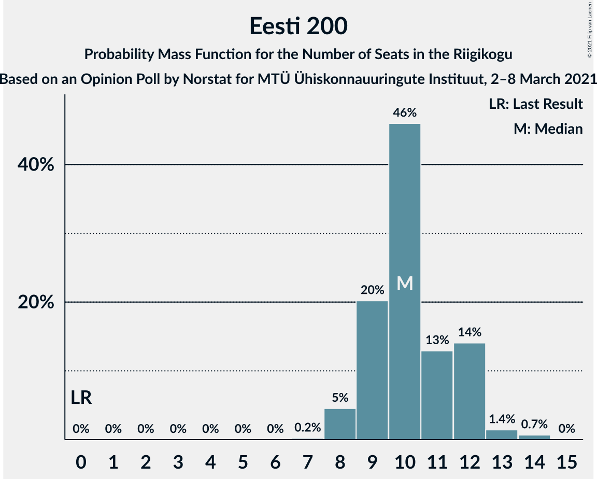
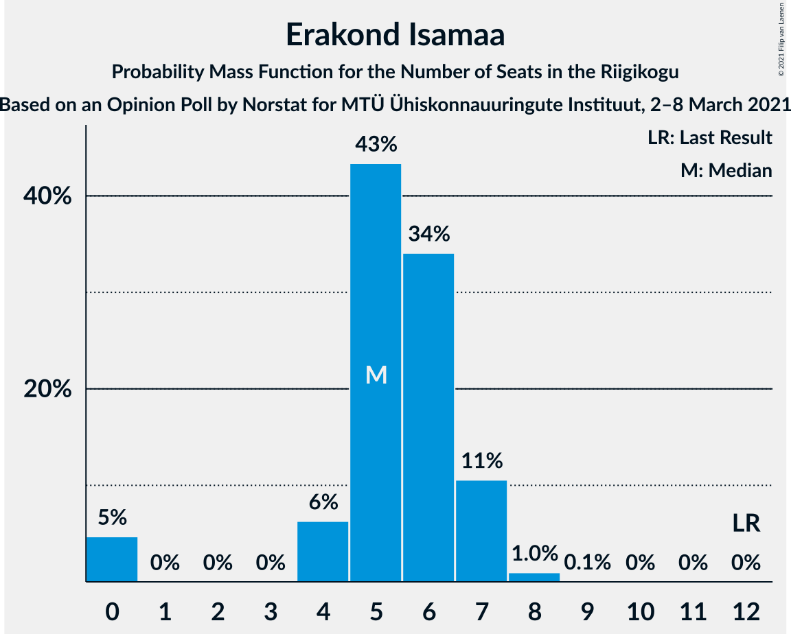
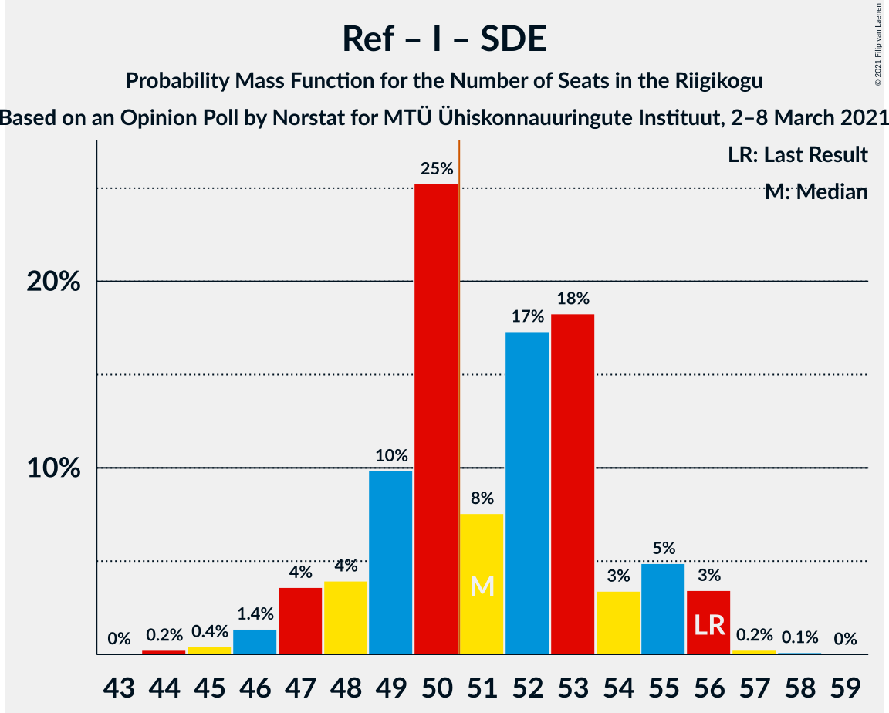

# Opinion Poll by Norstat for MTÜ Ühiskonnauuringute Instituut, 2–8 March 2021

<a href="#voting-intentions">Voting Intentions</a> | <a href="#seats">Seats</a> | <a href="#coalitions">Coalitions</a> | <a href="#technical-information">Technical Information</a>

## Voting Intentions

### Confidence Intervals

| Party | Last Result | Poll Result | 80% Confidence Interval | 90% Confidence Interval | 95% Confidence Interval | 99% Confidence Interval |
|:-----:|:-----------:|:-----------:|:-----------------------:|:-----------------------:|:-----------------------:|:-----------------------:|
| Eesti Reformierakond | 28.9% | 36.7% | 34.8–38.7% |34.2–39.2% |33.8–39.7% |32.9–40.7% |
| Eesti Konservatiivne Rahvaerakond | 17.8% | 20.3% | 18.7–22.0% |18.3–22.5% |17.9–22.9% |17.2–23.7% |
| Eesti Keskerakond | 23.1% | 17.0% | 15.5–18.6% |15.2–19.1% |14.8–19.5% |14.1–20.3% |
| Eesti 200 | 4.4% | 10.5% | 9.3–11.8% |9.0–12.2% |8.7–12.6% |8.2–13.2% |
| Erakond Isamaa | 11.4% | 6.2% | 5.3–7.3% |5.1–7.6% |4.9–7.9% |4.5–8.4% |
| Sotsiaaldemokraatlik Erakond | 9.8% | 5.3% | 4.5–6.3% |4.3–6.6% |4.1–6.9% |3.7–7.4% |
| Erakond Eestimaa Rohelised | 1.8% | 2.9% | 2.3–3.7% |2.2–3.9% |2.0–4.1% |1.8–4.6% |

*Note:* The poll result column reflects the actual value used in the calculations. Published results may vary slightly, and in addition be rounded to fewer digits.

## Seats

### Confidence Intervals

| Party | Last Result | Median | 80% Confidence Interval | 90% Confidence Interval | 95% Confidence Interval | 99% Confidence Interval |
|:-----:|:-----------:|:------:|:-----------------------:|:-----------------------:|:-----------------------:|:-----------------------:|
| <a href="#eesti-reformierakond">Eesti Reformierakond</a> | 34 | 42 | 40–45 |39–46 |38–47 |37–48 |
| <a href="#eesti-konservatiivne-rahvaerakond">Eesti Konservatiivne Rahvaerakond</a> | 19 | 22 | 20–23 |19–24 |19–25 |18–26 |
| <a href="#eesti-keskerakond">Eesti Keskerakond</a> | 26 | 18 | 16–19 |15–20 |15–21 |14–21 |
| <a href="#eesti-200">Eesti 200</a> | 0 | 10 | 9–12 |9–12 |8–12 |8–14 |
| <a href="#erakond-isamaa">Erakond Isamaa</a> | 12 | 5 | 4–7 |4–7 |0–7 |0–8 |
| <a href="#sotsiaaldemokraatlik-erakond">Sotsiaaldemokraatlik Erakond</a> | 10 | 4 | 0–5 |0–6 |0–6 |0–7 |
| <a href="#erakond-eestimaa-rohelised">Erakond Eestimaa Rohelised</a> | 0 | 0 | 0 |0 |0 |0 |

### Eesti Reformierakond

*For a full overview of the results for this party, see the [Eesti Reformierakond](party-eestireformierakond.html) page.*

| Number of Seats | Probability | Accumulated | Special Marks |
|:---------------:|:-----------:|:-----------:|:-------------:|
| 34 | 0% | 100% | Last Result |
| 35 | 0% | 100% |  |
| 36 | 0.1% | 100% |  |
| 37 | 0.5% | 99.9% |  |
| 38 | 2% | 99.3% |  |
| 39 | 6% | 97% |  |
| 40 | 11% | 91% |  |
| 41 | 21% | 80% |  |
| 42 | 10% | 59% | Median |
| 43 | 24% | 49% |  |
| 44 | 10% | 25% |  |
| 45 | 7% | 15% |  |
| 46 | 3% | 7% |  |
| 47 | 4% | 4% |  |
| 48 | 0.6% | 0.8% |  |
| 49 | 0.2% | 0.2% |  |
| 50 | 0% | 0.1% |  |
| 51 | 0% | 0% | Majority |

### Eesti Konservatiivne Rahvaerakond

*For a full overview of the results for this party, see the [Eesti Konservatiivne Rahvaerakond](party-eestikonservatiivnerahvaerakond.html) page.*

| Number of Seats | Probability | Accumulated | Special Marks |
|:---------------:|:-----------:|:-----------:|:-------------:|
| 17 | 0.2% | 100% |  |
| 18 | 0.8% | 99.8% |  |
| 19 | 5% | 99.0% | Last Result |
| 20 | 12% | 94% |  |
| 21 | 17% | 82% |  |
| 22 | 26% | 65% | Median |
| 23 | 31% | 39% |  |
| 24 | 5% | 8% |  |
| 25 | 3% | 4% |  |
| 26 | 0.7% | 0.9% |  |
| 27 | 0.1% | 0.2% |  |
| 28 | 0% | 0% |  |

### Eesti Keskerakond

*For a full overview of the results for this party, see the [Eesti Keskerakond](party-eestikeskerakond.html) page.*

| Number of Seats | Probability | Accumulated | Special Marks |
|:---------------:|:-----------:|:-----------:|:-------------:|
| 13 | 0.1% | 100% |  |
| 14 | 0.5% | 99.9% |  |
| 15 | 5% | 99.4% |  |
| 16 | 16% | 94% |  |
| 17 | 17% | 78% |  |
| 18 | 38% | 61% | Median |
| 19 | 14% | 23% |  |
| 20 | 5% | 9% |  |
| 21 | 3% | 4% |  |
| 22 | 0.4% | 0.5% |  |
| 23 | 0.1% | 0.1% |  |
| 24 | 0% | 0% |  |
| 25 | 0% | 0% |  |
| 26 | 0% | 0% | Last Result |

### Eesti 200

*For a full overview of the results for this party, see the [Eesti 200](party-eesti200.html) page.*

| Number of Seats | Probability | Accumulated | Special Marks |
|:---------------:|:-----------:|:-----------:|:-------------:|
| 0 | 0% | 100% | Last Result |
| 1 | 0% | 100% |  |
| 2 | 0% | 100% |  |
| 3 | 0% | 100% |  |
| 4 | 0% | 100% |  |
| 5 | 0% | 100% |  |
| 6 | 0% | 100% |  |
| 7 | 0.2% | 100% |  |
| 8 | 5% | 99.8% |  |
| 9 | 20% | 95% |  |
| 10 | 46% | 75% | Median |
| 11 | 13% | 29% |  |
| 12 | 14% | 16% |  |
| 13 | 1.4% | 2% |  |
| 14 | 0.7% | 0.7% |  |
| 15 | 0% | 0% |  |

### Erakond Isamaa

*For a full overview of the results for this party, see the [Erakond Isamaa](party-erakondisamaa.html) page.*

| Number of Seats | Probability | Accumulated | Special Marks |
|:---------------:|:-----------:|:-----------:|:-------------:|
| 0 | 5% | 100% |  |
| 1 | 0% | 95% |  |
| 2 | 0% | 95% |  |
| 3 | 0% | 95% |  |
| 4 | 6% | 95% |  |
| 5 | 43% | 89% | Median |
| 6 | 34% | 46% |  |
| 7 | 11% | 12% |  |
| 8 | 1.0% | 1.0% |  |
| 9 | 0.1% | 0.1% |  |
| 10 | 0% | 0% |  |
| 11 | 0% | 0% |  |
| 12 | 0% | 0% | Last Result |

### Sotsiaaldemokraatlik Erakond

*For a full overview of the results for this party, see the [Sotsiaaldemokraatlik Erakond](party-sotsiaaldemokraatlikerakond.html) page.*

| Number of Seats | Probability | Accumulated | Special Marks |
|:---------------:|:-----------:|:-----------:|:-------------:|
| 0 | 23% | 100% |  |
| 1 | 0% | 77% |  |
| 2 | 0% | 77% |  |
| 3 | 0% | 77% |  |
| 4 | 33% | 77% | Median |
| 5 | 34% | 44% |  |
| 6 | 9% | 10% |  |
| 7 | 0.6% | 0.7% |  |
| 8 | 0% | 0% |  |
| 9 | 0% | 0% |  |
| 10 | 0% | 0% | Last Result |

### Erakond Eestimaa Rohelised

*For a full overview of the results for this party, see the [Erakond Eestimaa Rohelised](party-erakondeestimaarohelised.html) page.*

| Number of Seats | Probability | Accumulated | Special Marks |
|:---------------:|:-----------:|:-----------:|:-------------:|
| 0 | 99.9% | 100% | Last Result, Median |
| 1 | 0% | 0.1% |  |
| 2 | 0% | 0.1% |  |
| 3 | 0% | 0.1% |  |
| 4 | 0% | 0.1% |  |
| 5 | 0% | 0% |  |

## Coalitions

### Confidence Intervals

| Coalition | Last Result | Median | Majority? | 80% Confidence Interval | 90% Confidence Interval | 95% Confidence Interval | 99% Confidence Interval |
|:---------:|:-----------:|:------:|:---------:|:-----------------------:|:-----------------------:|:-----------------------:|:-----------------------:|
| Eesti Reformierakond – Eesti Konservatiivne Rahvaerakond – Eesti Keskerakond | 79 | 82 | 100% | 79–85 | 79–86 | 78–87 | 77–89 |
| Eesti Reformierakond – Eesti Konservatiivne Rahvaerakond – Erakond Isamaa | 65 | 69 | 100% | 67–73 | 66–74 | 65–74 | 64–75 |
| Eesti Reformierakond – Eesti Konservatiivne Rahvaerakond | 53 | 64 | 100% | 62–67 | 61–68 | 60–69 | 59–71 |
| Eesti Reformierakond – Eesti Keskerakond | 60 | 60 | 100% | 57–63 | 57–64 | 56–65 | 54–66 |
| Eesti Reformierakond – Erakond Isamaa – Sotsiaaldemokraatlik Erakond | 56 | 51 | 55% | 49–54 | 47–55 | 47–56 | 45–56 |
| Eesti Reformierakond – Erakond Isamaa | 46 | 47 | 12% | 45–51 | 44–52 | 43–52 | 42–53 |
| Eesti Reformierakond – Sotsiaaldemokraatlik Erakond | 44 | 46 | 1.4% | 43–49 | 42–50 | 41–50 | 40–52 |
| Eesti Konservatiivne Rahvaerakond – Eesti Keskerakond – Erakond Isamaa | 57 | 45 | 0.6% | 42–48 | 41–48 | 40–49 | 39–51 |
| Eesti Konservatiivne Rahvaerakond – Eesti Keskerakond | 45 | 40 | 0% | 37–42 | 36–43 | 36–44 | 35–45 |
| Eesti Keskerakond – Erakond Isamaa – Sotsiaaldemokraatlik Erakond | 48 | 27 | 0% | 23–29 | 22–30 | 21–31 | 18–32 |
| Eesti Konservatiivne Rahvaerakond – Sotsiaaldemokraatlik Erakond | 29 | 26 | 0% | 23–28 | 21–28 | 19–28 | 19–30 |
| Eesti Keskerakond – Sotsiaaldemokraatlik Erakond | 36 | 22 | 0% | 18–24 | 17–25 | 16–25 | 15–26 |

### Eesti Reformierakond – Eesti Konservatiivne Rahvaerakond – Eesti Keskerakond

| Number of Seats | Probability | Accumulated | Special Marks |
|:---------------:|:-----------:|:-----------:|:-------------:|
| 76 | 0.2% | 100% |  |
| 77 | 0.5% | 99.8% |  |
| 78 | 3% | 99.3% |  |
| 79 | 9% | 96% | Last Result |
| 80 | 14% | 88% |  |
| 81 | 20% | 74% |  |
| 82 | 26% | 54% | Median |
| 83 | 6% | 28% |  |
| 84 | 10% | 23% |  |
| 85 | 5% | 13% |  |
| 86 | 4% | 7% |  |
| 87 | 1.3% | 3% |  |
| 88 | 0.3% | 2% |  |
| 89 | 1.5% | 2% |  |
| 90 | 0.3% | 0.4% |  |
| 91 | 0% | 0.1% |  |
| 92 | 0% | 0% |  |

### Eesti Reformierakond – Eesti Konservatiivne Rahvaerakond – Erakond Isamaa

| Number of Seats | Probability | Accumulated | Special Marks |
|:---------------:|:-----------:|:-----------:|:-------------:|
| 63 | 0.1% | 100% |  |
| 64 | 0.7% | 99.9% |  |
| 65 | 2% | 99.2% | Last Result |
| 66 | 5% | 97% |  |
| 67 | 10% | 92% |  |
| 68 | 13% | 82% |  |
| 69 | 26% | 70% | Median |
| 70 | 13% | 44% |  |
| 71 | 14% | 30% |  |
| 72 | 6% | 16% |  |
| 73 | 4% | 10% |  |
| 74 | 5% | 6% |  |
| 75 | 0.7% | 1.0% |  |
| 76 | 0.3% | 0.3% |  |
| 77 | 0% | 0% |  |

### Eesti Reformierakond – Eesti Konservatiivne Rahvaerakond

| Number of Seats | Probability | Accumulated | Special Marks |
|:---------------:|:-----------:|:-----------:|:-------------:|
| 53 | 0% | 100% | Last Result |
| 54 | 0% | 100% |  |
| 55 | 0% | 100% |  |
| 56 | 0% | 100% |  |
| 57 | 0.1% | 100% |  |
| 58 | 0.2% | 99.9% |  |
| 59 | 1.0% | 99.7% |  |
| 60 | 2% | 98.8% |  |
| 61 | 6% | 97% |  |
| 62 | 13% | 91% |  |
| 63 | 12% | 77% |  |
| 64 | 28% | 66% | Median |
| 65 | 12% | 38% |  |
| 66 | 12% | 25% |  |
| 67 | 7% | 14% |  |
| 68 | 3% | 7% |  |
| 69 | 2% | 4% |  |
| 70 | 0.4% | 2% |  |
| 71 | 1.5% | 2% |  |
| 72 | 0.1% | 0.1% |  |
| 73 | 0% | 0.1% |  |
| 74 | 0% | 0% |  |

### Eesti Reformierakond – Eesti Keskerakond

| Number of Seats | Probability | Accumulated | Special Marks |
|:---------------:|:-----------:|:-----------:|:-------------:|
| 54 | 0.5% | 100% |  |
| 55 | 0.7% | 99.5% |  |
| 56 | 3% | 98.8% |  |
| 57 | 9% | 96% |  |
| 58 | 11% | 87% |  |
| 59 | 23% | 76% |  |
| 60 | 13% | 53% | Last Result, Median |
| 61 | 16% | 39% |  |
| 62 | 10% | 23% |  |
| 63 | 4% | 13% |  |
| 64 | 5% | 8% |  |
| 65 | 3% | 4% |  |
| 66 | 0.6% | 0.9% |  |
| 67 | 0.2% | 0.3% |  |
| 68 | 0.1% | 0.1% |  |
| 69 | 0% | 0% |  |

### Eesti Reformierakond – Erakond Isamaa – Sotsiaaldemokraatlik Erakond

| Number of Seats | Probability | Accumulated | Special Marks |
|:---------------:|:-----------:|:-----------:|:-------------:|
| 43 | 0% | 100% |  |
| 44 | 0.2% | 99.9% |  |
| 45 | 0.4% | 99.7% |  |
| 46 | 1.4% | 99.3% |  |
| 47 | 4% | 98% |  |
| 48 | 4% | 94% |  |
| 49 | 10% | 90% |  |
| 50 | 25% | 80% |  |
| 51 | 8% | 55% | Median, Majority |
| 52 | 17% | 48% |  |
| 53 | 18% | 30% |  |
| 54 | 3% | 12% |  |
| 55 | 5% | 9% |  |
| 56 | 3% | 4% | Last Result |
| 57 | 0.2% | 0.4% |  |
| 58 | 0.1% | 0.1% |  |
| 59 | 0% | 0% |  |

### Eesti Reformierakond – Erakond Isamaa

| Number of Seats | Probability | Accumulated | Special Marks |
|:---------------:|:-----------:|:-----------:|:-------------:|
| 40 | 0% | 100% |  |
| 41 | 0.4% | 99.9% |  |
| 42 | 0.6% | 99.6% |  |
| 43 | 2% | 99.0% |  |
| 44 | 4% | 97% |  |
| 45 | 11% | 93% |  |
| 46 | 20% | 82% | Last Result |
| 47 | 12% | 62% | Median |
| 48 | 14% | 50% |  |
| 49 | 17% | 36% |  |
| 50 | 7% | 19% |  |
| 51 | 6% | 12% | Majority |
| 52 | 4% | 6% |  |
| 53 | 0.9% | 1.4% |  |
| 54 | 0.4% | 0.5% |  |
| 55 | 0.1% | 0.1% |  |
| 56 | 0% | 0% |  |

### Eesti Reformierakond – Sotsiaaldemokraatlik Erakond

| Number of Seats | Probability | Accumulated | Special Marks |
|:---------------:|:-----------:|:-----------:|:-------------:|
| 38 | 0.1% | 100% |  |
| 39 | 0.2% | 99.9% |  |
| 40 | 0.5% | 99.8% |  |
| 41 | 2% | 99.2% |  |
| 42 | 3% | 97% |  |
| 43 | 11% | 95% |  |
| 44 | 6% | 83% | Last Result |
| 45 | 26% | 78% |  |
| 46 | 10% | 52% | Median |
| 47 | 17% | 42% |  |
| 48 | 15% | 25% |  |
| 49 | 4% | 11% |  |
| 50 | 6% | 7% |  |
| 51 | 0.6% | 1.4% | Majority |
| 52 | 0.6% | 0.7% |  |
| 53 | 0.1% | 0.1% |  |
| 54 | 0% | 0% |  |

### Eesti Konservatiivne Rahvaerakond – Eesti Keskerakond – Erakond Isamaa

| Number of Seats | Probability | Accumulated | Special Marks |
|:---------------:|:-----------:|:-----------:|:-------------:|
| 37 | 0% | 100% |  |
| 38 | 0.2% | 99.9% |  |
| 39 | 0.6% | 99.7% |  |
| 40 | 2% | 99.1% |  |
| 41 | 3% | 97% |  |
| 42 | 5% | 94% |  |
| 43 | 16% | 89% |  |
| 44 | 16% | 73% |  |
| 45 | 11% | 56% | Median |
| 46 | 25% | 45% |  |
| 47 | 8% | 20% |  |
| 48 | 8% | 11% |  |
| 49 | 2% | 4% |  |
| 50 | 0.6% | 1.2% |  |
| 51 | 0.5% | 0.6% | Majority |
| 52 | 0.1% | 0.1% |  |
| 53 | 0% | 0% |  |
| 54 | 0% | 0% |  |
| 55 | 0% | 0% |  |
| 56 | 0% | 0% |  |
| 57 | 0% | 0% | Last Result |

### Eesti Konservatiivne Rahvaerakond – Eesti Keskerakond

| Number of Seats | Probability | Accumulated | Special Marks |
|:---------------:|:-----------:|:-----------:|:-------------:|
| 34 | 0.3% | 100% |  |
| 35 | 0.7% | 99.6% |  |
| 36 | 5% | 98.9% |  |
| 37 | 8% | 94% |  |
| 38 | 18% | 86% |  |
| 39 | 15% | 68% |  |
| 40 | 14% | 53% | Median |
| 41 | 27% | 40% |  |
| 42 | 7% | 13% |  |
| 43 | 3% | 5% |  |
| 44 | 2% | 3% |  |
| 45 | 0.5% | 0.8% | Last Result |
| 46 | 0.2% | 0.3% |  |
| 47 | 0.1% | 0.1% |  |
| 48 | 0% | 0% |  |

### Eesti Keskerakond – Erakond Isamaa – Sotsiaaldemokraatlik Erakond

| Number of Seats | Probability | Accumulated | Special Marks |
|:---------------:|:-----------:|:-----------:|:-------------:|
| 17 | 0% | 100% |  |
| 18 | 1.3% | 99.9% |  |
| 19 | 0.2% | 98.6% |  |
| 20 | 0.7% | 98% |  |
| 21 | 0.7% | 98% |  |
| 22 | 3% | 97% |  |
| 23 | 4% | 94% |  |
| 24 | 6% | 90% |  |
| 25 | 9% | 84% |  |
| 26 | 15% | 75% |  |
| 27 | 25% | 60% | Median |
| 28 | 19% | 36% |  |
| 29 | 9% | 17% |  |
| 30 | 5% | 8% |  |
| 31 | 2% | 3% |  |
| 32 | 1.2% | 1.4% |  |
| 33 | 0.2% | 0.2% |  |
| 34 | 0% | 0% |  |
| 35 | 0% | 0% |  |
| 36 | 0% | 0% |  |
| 37 | 0% | 0% |  |
| 38 | 0% | 0% |  |
| 39 | 0% | 0% |  |
| 40 | 0% | 0% |  |
| 41 | 0% | 0% |  |
| 42 | 0% | 0% |  |
| 43 | 0% | 0% |  |
| 44 | 0% | 0% |  |
| 45 | 0% | 0% |  |
| 46 | 0% | 0% |  |
| 47 | 0% | 0% |  |
| 48 | 0% | 0% | Last Result |

### Eesti Konservatiivne Rahvaerakond – Sotsiaaldemokraatlik Erakond

| Number of Seats | Probability | Accumulated | Special Marks |
|:---------------:|:-----------:|:-----------:|:-------------:|
| 18 | 0.1% | 100% |  |
| 19 | 2% | 99.9% |  |
| 20 | 0.9% | 97% |  |
| 21 | 2% | 97% |  |
| 22 | 4% | 94% |  |
| 23 | 8% | 90% |  |
| 24 | 6% | 82% |  |
| 25 | 16% | 76% |  |
| 26 | 19% | 61% | Median |
| 27 | 29% | 42% |  |
| 28 | 11% | 13% |  |
| 29 | 2% | 2% | Last Result |
| 30 | 0.4% | 0.8% |  |
| 31 | 0.2% | 0.4% |  |
| 32 | 0.1% | 0.1% |  |
| 33 | 0% | 0% |  |

### Eesti Keskerakond – Sotsiaaldemokraatlik Erakond

| Number of Seats | Probability | Accumulated | Special Marks |
|:---------------:|:-----------:|:-----------:|:-------------:|
| 14 | 0.1% | 100% |  |
| 15 | 0.7% | 99.9% |  |
| 16 | 2% | 99.2% |  |
| 17 | 4% | 97% |  |
| 18 | 7% | 94% |  |
| 19 | 7% | 86% |  |
| 20 | 11% | 80% |  |
| 21 | 9% | 69% |  |
| 22 | 35% | 60% | Median |
| 23 | 12% | 25% |  |
| 24 | 8% | 14% |  |
| 25 | 4% | 6% |  |
| 26 | 2% | 2% |  |
| 27 | 0.1% | 0.2% |  |
| 28 | 0% | 0.1% |  |
| 29 | 0% | 0% |  |
| 30 | 0% | 0% |  |
| 31 | 0% | 0% |  |
| 32 | 0% | 0% |  |
| 33 | 0% | 0% |  |
| 34 | 0% | 0% |  |
| 35 | 0% | 0% |  |
| 36 | 0% | 0% | Last Result |

## Technical Information

### Opinion Poll

+ **Polling firm:** Norstat
+ **Commissioner(s):** MTÜ Ühiskonnauuringute Instituut
+ **Fieldwork period:** 2–8 March 2021

### Calculations

+ **Sample size:** 1000
+ **Simulations done:** 131,072
+ **Error estimate:** 1.16%

