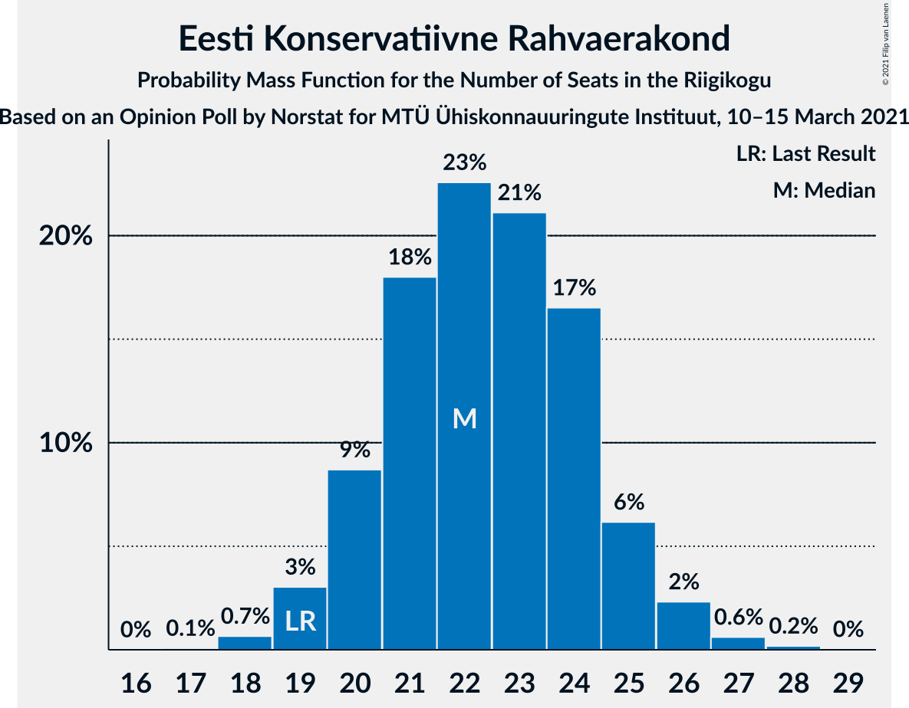
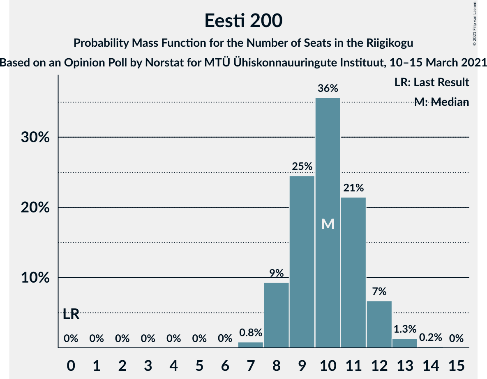
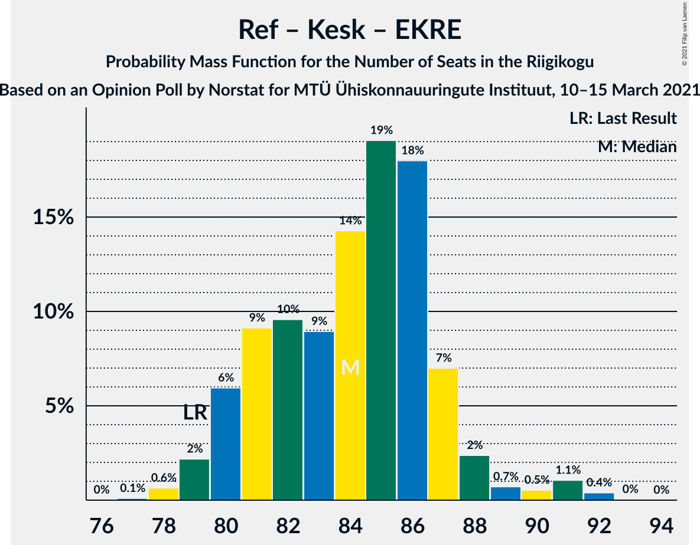
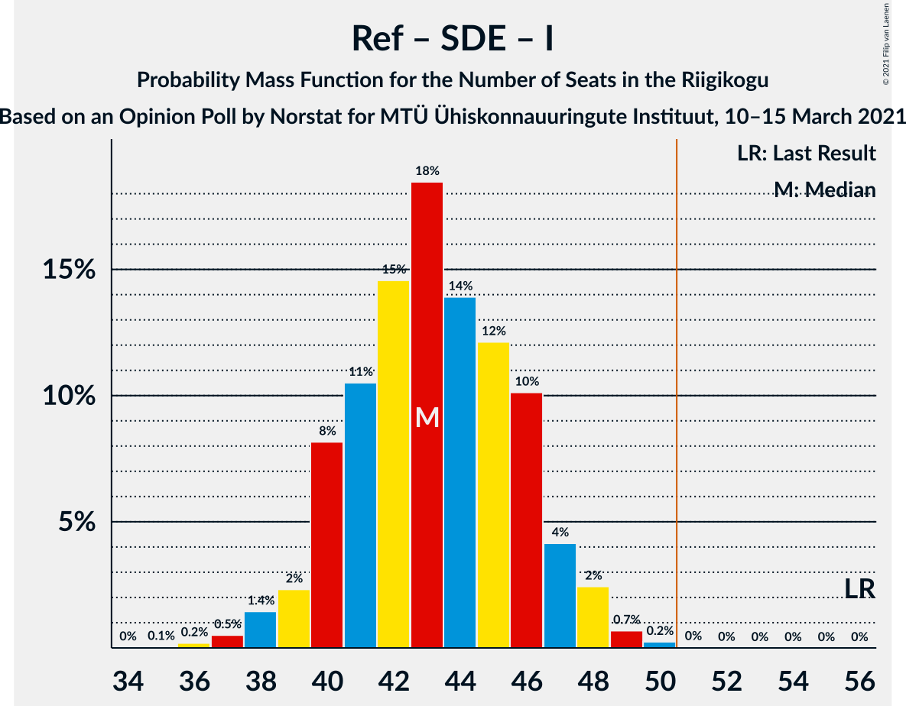

# Opinion Poll by Norstat for MTÜ Ühiskonnauuringute Instituut, 10–15 March 2021

<a href="#voting-intentions">Voting Intentions</a> | <a href="#seats">Seats</a> | <a href="#coalitions">Coalitions</a> | <a href="#technical-information">Technical Information</a>

## Voting Intentions

### Confidence Intervals

| Party | Last Result | Poll Result | 80% Confidence Interval | 90% Confidence Interval | 95% Confidence Interval | 99% Confidence Interval |
|:-----:|:-----------:|:-----------:|:-----------------------:|:-----------------------:|:-----------------------:|:-----------------------:|
| Eesti Reformierakond | 28.9% | 31.6% | 29.8–33.5% |29.2–34.1% |28.8–34.6% |27.9–35.5% |
| Eesti Keskerakond | 23.1% | 23.1% | 21.4–24.9% |21.0–25.4% |20.6–25.8% |19.8–26.7% |
| Eesti Konservatiivne Rahvaerakond | 17.8% | 20.6% | 19.0–22.3% |18.6–22.8% |18.2–23.2% |17.5–24.1% |
| Eesti 200 | 4.4% | 10.1% | 9.0–11.4% |8.6–11.8% |8.4–12.1% |7.9–12.8% |
| Sotsiaaldemokraatlik Erakond | 9.8% | 6.2% | 5.3–7.3% |5.1–7.6% |4.9–7.9% |4.5–8.4% |
| Erakond Isamaa | 11.4% | 4.7% | 3.9–5.7% |3.7–6.0% |3.6–6.2% |3.2–6.7% |
| Erakond Eestimaa Rohelised | 1.8% | 2.0% | 1.5–2.7% |1.4–2.9% |1.3–3.1% |1.1–3.4% |

*Note:* The poll result column reflects the actual value used in the calculations. Published results may vary slightly, and in addition be rounded to fewer digits.

## Seats

### Confidence Intervals

| Party | Last Result | Median | 80% Confidence Interval | 90% Confidence Interval | 95% Confidence Interval | 99% Confidence Interval |
|:-----:|:-----------:|:------:|:-----------------------:|:-----------------------:|:-----------------------:|:-----------------------:|
| <a href="#eesti-reformierakond">Eesti Reformierakond</a> | 34 | 37 | 33–39 |33–40 |33–40 |31–41 |
| <a href="#eesti-keskerakond">Eesti Keskerakond</a> | 26 | 25 | 23–28 |23–28 |22–29 |21–30 |
| <a href="#eesti-konservatiivne-rahvaerakond">Eesti Konservatiivne Rahvaerakond</a> | 19 | 22 | 20–24 |20–25 |19–26 |18–27 |
| <a href="#eesti-200">Eesti 200</a> | 0 | 10 | 8–11 |8–12 |8–12 |7–13 |
| <a href="#sotsiaaldemokraatlik-erakond">Sotsiaaldemokraatlik Erakond</a> | 10 | 5 | 5–7 |4–7 |0–7 |0–8 |
| <a href="#erakond-isamaa">Erakond Isamaa</a> | 12 | 0 | 0–5 |0–5 |0–5 |0–6 |
| <a href="#erakond-eestimaa-rohelised">Erakond Eestimaa Rohelised</a> | 0 | 0 | 0 |0 |0 |0 |

### Eesti Reformierakond

*For a full overview of the results for this party, see the [Eesti Reformierakond](party-eestireformierakond.html) page.*

| Number of Seats | Probability | Accumulated | Special Marks |
|:---------------:|:-----------:|:-----------:|:-------------:|
| 30 | 0.2% | 100% |  |
| 31 | 0.6% | 99.8% |  |
| 32 | 2% | 99.3% |  |
| 33 | 8% | 98% |  |
| 34 | 11% | 89% | Last Result |
| 35 | 17% | 79% |  |
| 36 | 10% | 61% |  |
| 37 | 26% | 52% | Median |
| 38 | 10% | 26% |  |
| 39 | 9% | 16% |  |
| 40 | 6% | 7% |  |
| 41 | 1.1% | 1.5% |  |
| 42 | 0.2% | 0.4% |  |
| 43 | 0.1% | 0.2% |  |
| 44 | 0% | 0% |  |

### Eesti Keskerakond

*For a full overview of the results for this party, see the [Eesti Keskerakond](party-eestikeskerakond.html) page.*

| Number of Seats | Probability | Accumulated | Special Marks |
|:---------------:|:-----------:|:-----------:|:-------------:|
| 20 | 0.1% | 100% |  |
| 21 | 0.8% | 99.9% |  |
| 22 | 4% | 99.0% |  |
| 23 | 6% | 95% |  |
| 24 | 21% | 89% |  |
| 25 | 23% | 69% | Median |
| 26 | 21% | 45% | Last Result |
| 27 | 13% | 24% |  |
| 28 | 7% | 12% |  |
| 29 | 3% | 4% |  |
| 30 | 0.9% | 1.1% |  |
| 31 | 0.1% | 0.2% |  |
| 32 | 0.1% | 0.1% |  |
| 33 | 0% | 0% |  |

### Eesti Konservatiivne Rahvaerakond

*For a full overview of the results for this party, see the [Eesti Konservatiivne Rahvaerakond](party-eestikonservatiivnerahvaerakond.html) page.*

| Number of Seats | Probability | Accumulated | Special Marks |
|:---------------:|:-----------:|:-----------:|:-------------:|
| 17 | 0.1% | 100% |  |
| 18 | 0.7% | 99.9% |  |
| 19 | 3% | 99.2% | Last Result |
| 20 | 7% | 96% |  |
| 21 | 22% | 89% |  |
| 22 | 21% | 67% | Median |
| 23 | 23% | 46% |  |
| 24 | 15% | 23% |  |
| 25 | 5% | 7% |  |
| 26 | 2% | 3% |  |
| 27 | 0.7% | 0.9% |  |
| 28 | 0.2% | 0.2% |  |
| 29 | 0% | 0% |  |

### Eesti 200

*For a full overview of the results for this party, see the [Eesti 200](party-eesti200.html) page.*

| Number of Seats | Probability | Accumulated | Special Marks |
|:---------------:|:-----------:|:-----------:|:-------------:|
| 0 | 0% | 100% | Last Result |
| 1 | 0% | 100% |  |
| 2 | 0% | 100% |  |
| 3 | 0% | 100% |  |
| 4 | 0% | 100% |  |
| 5 | 0% | 100% |  |
| 6 | 0% | 100% |  |
| 7 | 1.2% | 100% |  |
| 8 | 9% | 98.8% |  |
| 9 | 18% | 90% |  |
| 10 | 31% | 71% | Median |
| 11 | 34% | 40% |  |
| 12 | 5% | 7% |  |
| 13 | 2% | 2% |  |
| 14 | 0.2% | 0.2% |  |
| 15 | 0% | 0% |  |

### Sotsiaaldemokraatlik Erakond

*For a full overview of the results for this party, see the [Sotsiaaldemokraatlik Erakond](party-sotsiaaldemokraatlikerakond.html) page.*

| Number of Seats | Probability | Accumulated | Special Marks |
|:---------------:|:-----------:|:-----------:|:-------------:|
| 0 | 4% | 100% |  |
| 1 | 0% | 96% |  |
| 2 | 0% | 96% |  |
| 3 | 0% | 96% |  |
| 4 | 5% | 96% |  |
| 5 | 43% | 91% | Median |
| 6 | 37% | 49% |  |
| 7 | 10% | 12% |  |
| 8 | 1.3% | 1.4% |  |
| 9 | 0.1% | 0.1% |  |
| 10 | 0% | 0% | Last Result |

### Erakond Isamaa

*For a full overview of the results for this party, see the [Erakond Isamaa](party-erakondisamaa.html) page.*

| Number of Seats | Probability | Accumulated | Special Marks |
|:---------------:|:-----------:|:-----------:|:-------------:|
| 0 | 67% | 100% | Median |
| 1 | 0% | 33% |  |
| 2 | 0% | 33% |  |
| 3 | 0% | 33% |  |
| 4 | 14% | 33% |  |
| 5 | 18% | 19% |  |
| 6 | 1.3% | 1.4% |  |
| 7 | 0.1% | 0.1% |  |
| 8 | 0% | 0% |  |
| 9 | 0% | 0% |  |
| 10 | 0% | 0% |  |
| 11 | 0% | 0% |  |
| 12 | 0% | 0% | Last Result |

### Erakond Eestimaa Rohelised

*For a full overview of the results for this party, see the [Erakond Eestimaa Rohelised](party-erakondeestimaarohelised.html) page.*

| Number of Seats | Probability | Accumulated | Special Marks |
|:---------------:|:-----------:|:-----------:|:-------------:|
| 0 | 100% | 100% | Last Result, Median |

## Coalitions

### Confidence Intervals

| Coalition | Last Result | Median | Majority? | 80% Confidence Interval | 90% Confidence Interval | 95% Confidence Interval | 99% Confidence Interval |
|:---------:|:-----------:|:------:|:---------:|:-----------------------:|:-----------------------:|:-----------------------:|:-----------------------:|
| Eesti Reformierakond – Eesti Keskerakond – Eesti Konservatiivne Rahvaerakond | 79 | 84 | 100% | 81–86 | 80–87 | 80–89 | 78–91 |
| Eesti Reformierakond – Eesti Keskerakond | 60 | 62 | 100% | 59–65 | 58–66 | 57–66 | 56–68 |
| Eesti Reformierakond – Eesti Konservatiivne Rahvaerakond – Erakond Isamaa | 65 | 60 | 100% | 57–63 | 57–64 | 56–65 | 55–67 |
| Eesti Reformierakond – Eesti Konservatiivne Rahvaerakond | 53 | 59 | 100% | 56–61 | 55–63 | 54–63 | 53–65 |
| Eesti Keskerakond – Eesti Konservatiivne Rahvaerakond – Erakond Isamaa | 57 | 49 | 32% | 46–53 | 45–53 | 45–54 | 44–55 |
| Eesti Keskerakond – Eesti Konservatiivne Rahvaerakond | 45 | 48 | 14% | 45–51 | 45–51 | 44–52 | 42–54 |
| Eesti Reformierakond – Sotsiaaldemokraatlik Erakond – Erakond Isamaa | 56 | 43 | 0.1% | 40–46 | 40–47 | 39–48 | 37–49 |
| Eesti Reformierakond – Sotsiaaldemokraatlik Erakond | 44 | 42 | 0% | 38–45 | 38–45 | 37–46 | 35–47 |
| Eesti Reformierakond – Erakond Isamaa | 46 | 38 | 0% | 35–41 | 34–42 | 34–42 | 33–44 |
| Eesti Keskerakond – Sotsiaaldemokraatlik Erakond – Erakond Isamaa | 48 | 32 | 0% | 30–36 | 29–37 | 28–37 | 26–38 |
| Eesti Keskerakond – Sotsiaaldemokraatlik Erakond | 36 | 31 | 0% | 29–33 | 27–34 | 27–35 | 24–36 |
| Eesti Konservatiivne Rahvaerakond – Sotsiaaldemokraatlik Erakond | 29 | 28 | 0% | 26–30 | 25–31 | 24–31 | 22–33 |

### Eesti Reformierakond – Eesti Keskerakond – Eesti Konservatiivne Rahvaerakond

| Number of Seats | Probability | Accumulated | Special Marks |
|:---------------:|:-----------:|:-----------:|:-------------:|
| 77 | 0.1% | 100% |  |
| 78 | 0.5% | 99.9% |  |
| 79 | 2% | 99.4% | Last Result |
| 80 | 7% | 98% |  |
| 81 | 8% | 91% |  |
| 82 | 9% | 82% |  |
| 83 | 9% | 73% |  |
| 84 | 16% | 64% | Median |
| 85 | 23% | 48% |  |
| 86 | 17% | 25% |  |
| 87 | 4% | 8% |  |
| 88 | 1.5% | 4% |  |
| 89 | 0.5% | 3% |  |
| 90 | 0.3% | 2% |  |
| 91 | 1.5% | 2% |  |
| 92 | 0.3% | 0.4% |  |
| 93 | 0% | 0% |  |

### Eesti Reformierakond – Eesti Keskerakond

| Number of Seats | Probability | Accumulated | Special Marks |
|:---------------:|:-----------:|:-----------:|:-------------:|
| 54 | 0.1% | 100% |  |
| 55 | 0.3% | 99.9% |  |
| 56 | 0.8% | 99.6% |  |
| 57 | 1.4% | 98.8% |  |
| 58 | 3% | 97% |  |
| 59 | 18% | 94% |  |
| 60 | 7% | 76% | Last Result |
| 61 | 6% | 69% |  |
| 62 | 26% | 63% | Median |
| 63 | 23% | 37% |  |
| 64 | 4% | 14% |  |
| 65 | 4% | 10% |  |
| 66 | 3% | 6% |  |
| 67 | 1.4% | 2% |  |
| 68 | 0.8% | 1.0% |  |
| 69 | 0.1% | 0.2% |  |
| 70 | 0% | 0% |  |

### Eesti Reformierakond – Eesti Konservatiivne Rahvaerakond – Erakond Isamaa

| Number of Seats | Probability | Accumulated | Special Marks |
|:---------------:|:-----------:|:-----------:|:-------------:|
| 54 | 0.2% | 100% |  |
| 55 | 1.4% | 99.7% |  |
| 56 | 3% | 98% |  |
| 57 | 6% | 96% |  |
| 58 | 6% | 90% |  |
| 59 | 17% | 84% | Median |
| 60 | 33% | 68% |  |
| 61 | 15% | 34% |  |
| 62 | 6% | 19% |  |
| 63 | 6% | 13% |  |
| 64 | 3% | 7% |  |
| 65 | 3% | 4% | Last Result |
| 66 | 0.4% | 0.9% |  |
| 67 | 0.3% | 0.5% |  |
| 68 | 0.2% | 0.2% |  |
| 69 | 0% | 0% |  |

### Eesti Reformierakond – Eesti Konservatiivne Rahvaerakond

| Number of Seats | Probability | Accumulated | Special Marks |
|:---------------:|:-----------:|:-----------:|:-------------:|
| 51 | 0% | 100% | Majority |
| 52 | 0.3% | 99.9% |  |
| 53 | 1.0% | 99.7% | Last Result |
| 54 | 1.4% | 98.7% |  |
| 55 | 7% | 97% |  |
| 56 | 14% | 90% |  |
| 57 | 10% | 76% |  |
| 58 | 7% | 66% |  |
| 59 | 18% | 58% | Median |
| 60 | 22% | 40% |  |
| 61 | 10% | 18% |  |
| 62 | 3% | 8% |  |
| 63 | 3% | 5% |  |
| 64 | 1.1% | 2% |  |
| 65 | 0.7% | 0.8% |  |
| 66 | 0% | 0.2% |  |
| 67 | 0.1% | 0.1% |  |
| 68 | 0% | 0% |  |

### Eesti Keskerakond – Eesti Konservatiivne Rahvaerakond – Erakond Isamaa

| Number of Seats | Probability | Accumulated | Special Marks |
|:---------------:|:-----------:|:-----------:|:-------------:|
| 42 | 0% | 100% |  |
| 43 | 0.3% | 99.9% |  |
| 44 | 0.5% | 99.6% |  |
| 45 | 5% | 99.1% |  |
| 46 | 12% | 94% |  |
| 47 | 4% | 82% | Median |
| 48 | 24% | 78% |  |
| 49 | 8% | 54% |  |
| 50 | 14% | 46% |  |
| 51 | 13% | 32% | Majority |
| 52 | 6% | 19% |  |
| 53 | 10% | 13% |  |
| 54 | 2% | 4% |  |
| 55 | 2% | 2% |  |
| 56 | 0.2% | 0.4% |  |
| 57 | 0.1% | 0.2% | Last Result |
| 58 | 0% | 0% |  |

### Eesti Keskerakond – Eesti Konservatiivne Rahvaerakond

| Number of Seats | Probability | Accumulated | Special Marks |
|:---------------:|:-----------:|:-----------:|:-------------:|
| 41 | 0.1% | 100% |  |
| 42 | 0.4% | 99.8% |  |
| 43 | 2% | 99.4% |  |
| 44 | 2% | 98% |  |
| 45 | 13% | 96% | Last Result |
| 46 | 16% | 83% |  |
| 47 | 9% | 67% | Median |
| 48 | 26% | 58% |  |
| 49 | 12% | 31% |  |
| 50 | 5% | 19% |  |
| 51 | 10% | 14% | Majority |
| 52 | 1.1% | 3% |  |
| 53 | 1.1% | 2% |  |
| 54 | 0.8% | 1.0% |  |
| 55 | 0.1% | 0.1% |  |
| 56 | 0.1% | 0.1% |  |
| 57 | 0% | 0% |  |

### Eesti Reformierakond – Sotsiaaldemokraatlik Erakond – Erakond Isamaa

| Number of Seats | Probability | Accumulated | Special Marks |
|:---------------:|:-----------:|:-----------:|:-------------:|
| 34 | 0% | 100% |  |
| 35 | 0% | 99.9% |  |
| 36 | 0.1% | 99.9% |  |
| 37 | 0.5% | 99.8% |  |
| 38 | 1.2% | 99.3% |  |
| 39 | 2% | 98% |  |
| 40 | 8% | 96% |  |
| 41 | 8% | 88% |  |
| 42 | 21% | 80% | Median |
| 43 | 14% | 59% |  |
| 44 | 14% | 45% |  |
| 45 | 16% | 31% |  |
| 46 | 8% | 15% |  |
| 47 | 3% | 7% |  |
| 48 | 3% | 4% |  |
| 49 | 0.7% | 1.1% |  |
| 50 | 0.4% | 0.4% |  |
| 51 | 0.1% | 0.1% | Majority |
| 52 | 0% | 0% |  |
| 53 | 0% | 0% |  |
| 54 | 0% | 0% |  |
| 55 | 0% | 0% |  |
| 56 | 0% | 0% | Last Result |

### Eesti Reformierakond – Sotsiaaldemokraatlik Erakond

| Number of Seats | Probability | Accumulated | Special Marks |
|:---------------:|:-----------:|:-----------:|:-------------:|
| 34 | 0.1% | 100% |  |
| 35 | 0.4% | 99.8% |  |
| 36 | 0.7% | 99.5% |  |
| 37 | 3% | 98.8% |  |
| 38 | 6% | 96% |  |
| 39 | 6% | 90% |  |
| 40 | 17% | 84% |  |
| 41 | 10% | 67% |  |
| 42 | 23% | 58% | Median |
| 43 | 13% | 35% |  |
| 44 | 9% | 22% | Last Result |
| 45 | 9% | 13% |  |
| 46 | 3% | 4% |  |
| 47 | 0.7% | 0.8% |  |
| 48 | 0.1% | 0.2% |  |
| 49 | 0% | 0% |  |

### Eesti Reformierakond – Erakond Isamaa

| Number of Seats | Probability | Accumulated | Special Marks |
|:---------------:|:-----------:|:-----------:|:-------------:|
| 31 | 0.2% | 100% |  |
| 32 | 0.3% | 99.8% |  |
| 33 | 1.3% | 99.6% |  |
| 34 | 4% | 98% |  |
| 35 | 10% | 94% |  |
| 36 | 7% | 84% |  |
| 37 | 25% | 76% | Median |
| 38 | 14% | 52% |  |
| 39 | 14% | 37% |  |
| 40 | 12% | 23% |  |
| 41 | 6% | 11% |  |
| 42 | 4% | 5% |  |
| 43 | 1.1% | 2% |  |
| 44 | 0.5% | 0.8% |  |
| 45 | 0.2% | 0.3% |  |
| 46 | 0.2% | 0.2% | Last Result |
| 47 | 0% | 0% |  |

### Eesti Keskerakond – Sotsiaaldemokraatlik Erakond – Erakond Isamaa

| Number of Seats | Probability | Accumulated | Special Marks |
|:---------------:|:-----------:|:-----------:|:-------------:|
| 24 | 0.1% | 100% |  |
| 25 | 0.1% | 99.8% |  |
| 26 | 0.6% | 99.8% |  |
| 27 | 0.9% | 99.1% |  |
| 28 | 2% | 98% |  |
| 29 | 4% | 96% |  |
| 30 | 23% | 92% | Median |
| 31 | 14% | 69% |  |
| 32 | 12% | 56% |  |
| 33 | 9% | 44% |  |
| 34 | 14% | 35% |  |
| 35 | 9% | 21% |  |
| 36 | 6% | 12% |  |
| 37 | 5% | 6% |  |
| 38 | 2% | 2% |  |
| 39 | 0.4% | 0.5% |  |
| 40 | 0.1% | 0.1% |  |
| 41 | 0% | 0% |  |
| 42 | 0% | 0% |  |
| 43 | 0% | 0% |  |
| 44 | 0% | 0% |  |
| 45 | 0% | 0% |  |
| 46 | 0% | 0% |  |
| 47 | 0% | 0% |  |
| 48 | 0% | 0% | Last Result |

### Eesti Keskerakond – Sotsiaaldemokraatlik Erakond

| Number of Seats | Probability | Accumulated | Special Marks |
|:---------------:|:-----------:|:-----------:|:-------------:|
| 23 | 0.2% | 100% |  |
| 24 | 0.3% | 99.8% |  |
| 25 | 0.5% | 99.5% |  |
| 26 | 1.3% | 99.0% |  |
| 27 | 3% | 98% |  |
| 28 | 4% | 94% |  |
| 29 | 11% | 90% |  |
| 30 | 27% | 79% | Median |
| 31 | 18% | 52% |  |
| 32 | 16% | 34% |  |
| 33 | 9% | 18% |  |
| 34 | 6% | 9% |  |
| 35 | 3% | 3% |  |
| 36 | 0.4% | 0.5% | Last Result |
| 37 | 0.1% | 0.1% |  |
| 38 | 0.1% | 0.1% |  |
| 39 | 0% | 0% |  |

### Eesti Konservatiivne Rahvaerakond – Sotsiaaldemokraatlik Erakond

| Number of Seats | Probability | Accumulated | Special Marks |
|:---------------:|:-----------:|:-----------:|:-------------:|
| 20 | 0.2% | 100% |  |
| 21 | 0.2% | 99.8% |  |
| 22 | 0.5% | 99.6% |  |
| 23 | 1.4% | 99.1% |  |
| 24 | 2% | 98% |  |
| 25 | 5% | 95% |  |
| 26 | 14% | 90% |  |
| 27 | 21% | 77% | Median |
| 28 | 25% | 56% |  |
| 29 | 16% | 31% | Last Result |
| 30 | 10% | 15% |  |
| 31 | 3% | 6% |  |
| 32 | 2% | 2% |  |
| 33 | 0.5% | 0.6% |  |
| 34 | 0.1% | 0.2% |  |
| 35 | 0% | 0% |  |

## Technical Information

### Opinion Poll

+ **Polling firm:** Norstat
+ **Commissioner(s):** MTÜ Ühiskonnauuringute Instituut
+ **Fieldwork period:** 10–15 March 2021

### Calculations

+ **Sample size:** 1000
+ **Simulations done:** 131,072
+ **Error estimate:** 1.22%

