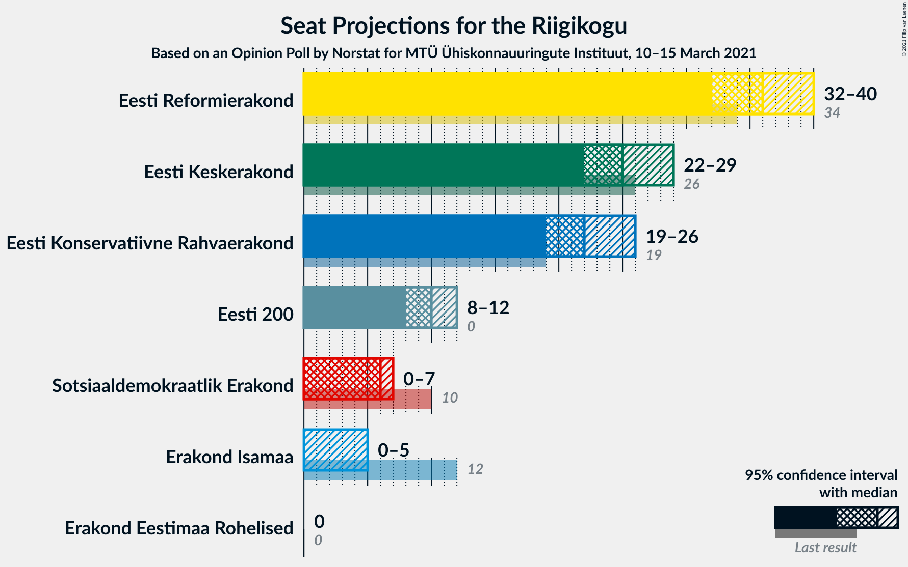
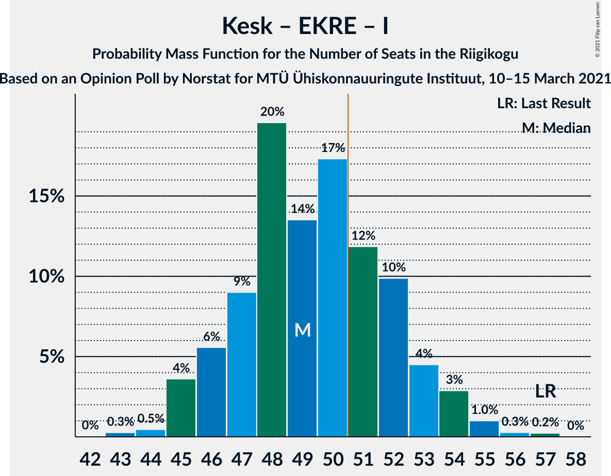

# Opinion Poll by Norstat for MTÜ Ühiskonnauuringute Instituut, 10–15 March 2021

<a href="#voting-intentions">Voting Intentions</a> | <a href="#seats">Seats</a> | <a href="#coalitions">Coalitions</a> | <a href="#technical-information">Technical Information</a>

## Voting Intentions

### Confidence Intervals

| Party | Last Result | Poll Result | 80% Confidence Interval | 90% Confidence Interval | 95% Confidence Interval | 99% Confidence Interval |
|:-----:|:-----------:|:-----------:|:-----------------------:|:-----------------------:|:-----------------------:|:-----------------------:|
| Eesti Reformierakond | 28.9% | 31.6% | 29.8–33.5% |29.2–34.1% |28.8–34.6% |27.9–35.5% |
| Eesti Keskerakond | 23.1% | 23.1% | 21.4–24.9% |21.0–25.4% |20.6–25.8% |19.8–26.7% |
| Eesti Konservatiivne Rahvaerakond | 17.8% | 20.6% | 19.0–22.3% |18.6–22.8% |18.2–23.2% |17.5–24.1% |
| Eesti 200 | 4.4% | 10.1% | 9.0–11.4% |8.6–11.8% |8.4–12.1% |7.9–12.8% |
| Sotsiaaldemokraatlik Erakond | 9.8% | 6.2% | 5.3–7.3% |5.1–7.6% |4.9–7.9% |4.5–8.4% |
| Erakond Isamaa | 11.4% | 4.7% | 3.9–5.7% |3.7–6.0% |3.6–6.2% |3.2–6.7% |
| Erakond Eestimaa Rohelised | 1.8% | 2.0% | 1.5–2.7% |1.4–2.9% |1.3–3.1% |1.1–3.4% |

*Note:* The poll result column reflects the actual value used in the calculations. Published results may vary slightly, and in addition be rounded to fewer digits.

## Seats

### Confidence Intervals

| Party | Last Result | Median | 80% Confidence Interval | 90% Confidence Interval | 95% Confidence Interval | 99% Confidence Interval |
|:-----:|:-----------:|:------:|:-----------------------:|:-----------------------:|:-----------------------:|:-----------------------:|
| <a href="#eesti-reformierakond">Eesti Reformierakond</a> | 34 | 36 | 34–39 |33–40 |32–40 |31–42 |
| <a href="#eesti-keskerakond">Eesti Keskerakond</a> | 26 | 25 | 23–28 |23–28 |22–29 |21–30 |
| <a href="#eesti-konservatiivne-rahvaerakond">Eesti Konservatiivne Rahvaerakond</a> | 19 | 22 | 20–24 |20–25 |19–26 |18–27 |
| <a href="#eesti-200">Eesti 200</a> | 0 | 10 | 8–11 |8–12 |8–12 |7–13 |
| <a href="#sotsiaaldemokraatlik-erakond">Sotsiaaldemokraatlik Erakond</a> | 10 | 6 | 5–7 |4–7 |0–7 |0–8 |
| <a href="#erakond-isamaa">Erakond Isamaa</a> | 12 | 0 | 0–5 |0–5 |0–5 |0–6 |
| <a href="#erakond-eestimaa-rohelised">Erakond Eestimaa Rohelised</a> | 0 | 0 | 0 |0 |0 |0 |

### Eesti Reformierakond

*For a full overview of the results for this party, see the [Eesti Reformierakond](party-eestireformierakond.html) page.*

| Number of Seats | Probability | Accumulated | Special Marks |
|:---------------:|:-----------:|:-----------:|:-------------:|
| 30 | 0.2% | 100% |  |
| 31 | 0.6% | 99.8% |  |
| 32 | 3% | 99.2% |  |
| 33 | 5% | 97% |  |
| 34 | 12% | 91% | Last Result |
| 35 | 14% | 80% |  |
| 36 | 20% | 66% | Median |
| 37 | 20% | 45% |  |
| 38 | 13% | 25% |  |
| 39 | 6% | 13% |  |
| 40 | 5% | 7% |  |
| 41 | 1.3% | 2% |  |
| 42 | 0.4% | 0.6% |  |
| 43 | 0.1% | 0.2% |  |
| 44 | 0% | 0% |  |

### Eesti Keskerakond

*For a full overview of the results for this party, see the [Eesti Keskerakond](party-eestikeskerakond.html) page.*

| Number of Seats | Probability | Accumulated | Special Marks |
|:---------------:|:-----------:|:-----------:|:-------------:|
| 20 | 0.1% | 100% |  |
| 21 | 0.7% | 99.8% |  |
| 22 | 3% | 99.1% |  |
| 23 | 9% | 96% |  |
| 24 | 18% | 87% |  |
| 25 | 21% | 69% | Median |
| 26 | 20% | 48% | Last Result |
| 27 | 14% | 27% |  |
| 28 | 9% | 13% |  |
| 29 | 3% | 4% |  |
| 30 | 0.8% | 1.2% |  |
| 31 | 0.3% | 0.3% |  |
| 32 | 0.1% | 0.1% |  |
| 33 | 0% | 0% |  |

### Eesti Konservatiivne Rahvaerakond

*For a full overview of the results for this party, see the [Eesti Konservatiivne Rahvaerakond](party-eestikonservatiivnerahvaerakond.html) page.*

| Number of Seats | Probability | Accumulated | Special Marks |
|:---------------:|:-----------:|:-----------:|:-------------:|
| 17 | 0.1% | 100% |  |
| 18 | 0.7% | 99.9% |  |
| 19 | 3% | 99.3% | Last Result |
| 20 | 9% | 96% |  |
| 21 | 18% | 88% |  |
| 22 | 23% | 70% | Median |
| 23 | 21% | 47% |  |
| 24 | 17% | 26% |  |
| 25 | 6% | 9% |  |
| 26 | 2% | 3% |  |
| 27 | 0.6% | 0.8% |  |
| 28 | 0.2% | 0.2% |  |
| 29 | 0% | 0% |  |

### Eesti 200

*For a full overview of the results for this party, see the [Eesti 200](party-eesti200.html) page.*

| Number of Seats | Probability | Accumulated | Special Marks |
|:---------------:|:-----------:|:-----------:|:-------------:|
| 0 | 0% | 100% | Last Result |
| 1 | 0% | 100% |  |
| 2 | 0% | 100% |  |
| 3 | 0% | 100% |  |
| 4 | 0% | 100% |  |
| 5 | 0% | 100% |  |
| 6 | 0% | 100% |  |
| 7 | 0.8% | 100% |  |
| 8 | 9% | 99.1% |  |
| 9 | 25% | 90% |  |
| 10 | 36% | 65% | Median |
| 11 | 21% | 30% |  |
| 12 | 7% | 8% |  |
| 13 | 1.3% | 2% |  |
| 14 | 0.2% | 0.2% |  |
| 15 | 0% | 0% |  |

### Sotsiaaldemokraatlik Erakond

*For a full overview of the results for this party, see the [Sotsiaaldemokraatlik Erakond](party-sotsiaaldemokraatlikerakond.html) page.*

| Number of Seats | Probability | Accumulated | Special Marks |
|:---------------:|:-----------:|:-----------:|:-------------:|
| 0 | 4% | 100% |  |
| 1 | 0% | 96% |  |
| 2 | 0% | 96% |  |
| 3 | 0% | 96% |  |
| 4 | 5% | 96% |  |
| 5 | 39% | 91% |  |
| 6 | 38% | 52% | Median |
| 7 | 12% | 14% |  |
| 8 | 2% | 2% |  |
| 9 | 0.1% | 0.1% |  |
| 10 | 0% | 0% | Last Result |

### Erakond Isamaa

*For a full overview of the results for this party, see the [Erakond Isamaa](party-erakondisamaa.html) page.*

| Number of Seats | Probability | Accumulated | Special Marks |
|:---------------:|:-----------:|:-----------:|:-------------:|
| 0 | 66% | 100% | Median |
| 1 | 0% | 34% |  |
| 2 | 0% | 34% |  |
| 3 | 0% | 34% |  |
| 4 | 15% | 34% |  |
| 5 | 17% | 19% |  |
| 6 | 2% | 2% |  |
| 7 | 0.1% | 0.1% |  |
| 8 | 0% | 0% |  |
| 9 | 0% | 0% |  |
| 10 | 0% | 0% |  |
| 11 | 0% | 0% |  |
| 12 | 0% | 0% | Last Result |

### Erakond Eestimaa Rohelised

*For a full overview of the results for this party, see the [Erakond Eestimaa Rohelised](party-erakondeestimaarohelised.html) page.*

| Number of Seats | Probability | Accumulated | Special Marks |
|:---------------:|:-----------:|:-----------:|:-------------:|
| 0 | 100% | 100% | Last Result, Median |

## Coalitions

### Confidence Intervals

| Coalition | Last Result | Median | Majority? | 80% Confidence Interval | 90% Confidence Interval | 95% Confidence Interval | 99% Confidence Interval |
|:---------:|:-----------:|:------:|:---------:|:-----------------------:|:-----------------------:|:-----------------------:|:-----------------------:|
| Eesti Reformierakond – Eesti Keskerakond – Eesti Konservatiivne Rahvaerakond | 79 | 84 | 100% | 81–87 | 80–88 | 79–89 | 78–91 |
| Eesti Reformierakond – Eesti Keskerakond | 60 | 62 | 100% | 59–65 | 58–66 | 57–66 | 56–68 |
| Eesti Reformierakond – Eesti Konservatiivne Rahvaerakond – Erakond Isamaa | 65 | 60 | 100% | 57–63 | 57–64 | 56–65 | 55–66 |
| Eesti Reformierakond – Eesti Konservatiivne Rahvaerakond | 53 | 59 | 100% | 56–62 | 55–62 | 54–63 | 53–65 |
| Eesti Keskerakond – Eesti Konservatiivne Rahvaerakond – Erakond Isamaa | 57 | 49 | 31% | 47–52 | 46–53 | 45–54 | 44–56 |
| Eesti Keskerakond – Eesti Konservatiivne Rahvaerakond | 45 | 48 | 12% | 45–51 | 44–51 | 44–52 | 42–54 |
| Eesti Reformierakond – Sotsiaaldemokraatlik Erakond – Erakond Isamaa | 56 | 43 | 0.1% | 40–46 | 40–47 | 39–48 | 37–49 |
| Eesti Reformierakond – Sotsiaaldemokraatlik Erakond | 44 | 42 | 0% | 39–44 | 38–45 | 37–46 | 35–47 |
| Eesti Reformierakond – Erakond Isamaa | 46 | 38 | 0% | 35–41 | 34–42 | 34–42 | 32–44 |
| Eesti Keskerakond – Sotsiaaldemokraatlik Erakond – Erakond Isamaa | 48 | 32 | 0% | 29–36 | 29–36 | 28–37 | 26–39 |
| Eesti Keskerakond – Sotsiaaldemokraatlik Erakond | 36 | 31 | 0% | 28–33 | 27–34 | 27–35 | 25–36 |
| Eesti Konservatiivne Rahvaerakond – Sotsiaaldemokraatlik Erakond | 29 | 28 | 0% | 25–30 | 24–31 | 24–31 | 22–33 |

### Eesti Reformierakond – Eesti Keskerakond – Eesti Konservatiivne Rahvaerakond

| Number of Seats | Probability | Accumulated | Special Marks |
|:---------------:|:-----------:|:-----------:|:-------------:|
| 77 | 0.1% | 100% |  |
| 78 | 0.6% | 99.9% |  |
| 79 | 2% | 99.2% | Last Result |
| 80 | 6% | 97% |  |
| 81 | 9% | 91% |  |
| 82 | 10% | 82% |  |
| 83 | 9% | 72% | Median |
| 84 | 14% | 63% |  |
| 85 | 19% | 49% |  |
| 86 | 18% | 30% |  |
| 87 | 7% | 12% |  |
| 88 | 2% | 5% |  |
| 89 | 0.7% | 3% |  |
| 90 | 0.5% | 2% |  |
| 91 | 1.1% | 2% |  |
| 92 | 0.4% | 0.4% |  |
| 93 | 0% | 0% |  |

### Eesti Reformierakond – Eesti Keskerakond

| Number of Seats | Probability | Accumulated | Special Marks |
|:---------------:|:-----------:|:-----------:|:-------------:|
| 54 | 0.1% | 100% |  |
| 55 | 0.3% | 99.9% |  |
| 56 | 1.0% | 99.7% |  |
| 57 | 3% | 98.7% |  |
| 58 | 5% | 96% |  |
| 59 | 9% | 91% |  |
| 60 | 12% | 82% | Last Result |
| 61 | 13% | 69% | Median |
| 62 | 20% | 56% |  |
| 63 | 14% | 36% |  |
| 64 | 10% | 22% |  |
| 65 | 6% | 12% |  |
| 66 | 3% | 5% |  |
| 67 | 1.3% | 2% |  |
| 68 | 0.7% | 1.1% |  |
| 69 | 0.2% | 0.3% |  |
| 70 | 0% | 0.1% |  |
| 71 | 0% | 0% |  |

### Eesti Reformierakond – Eesti Konservatiivne Rahvaerakond – Erakond Isamaa

| Number of Seats | Probability | Accumulated | Special Marks |
|:---------------:|:-----------:|:-----------:|:-------------:|
| 53 | 0% | 100% |  |
| 54 | 0.2% | 99.9% |  |
| 55 | 1.0% | 99.7% |  |
| 56 | 2% | 98.8% |  |
| 57 | 8% | 96% |  |
| 58 | 11% | 88% | Median |
| 59 | 13% | 77% |  |
| 60 | 21% | 64% |  |
| 61 | 17% | 43% |  |
| 62 | 12% | 26% |  |
| 63 | 7% | 14% |  |
| 64 | 3% | 6% |  |
| 65 | 2% | 3% | Last Result |
| 66 | 0.9% | 1.2% |  |
| 67 | 0.2% | 0.4% |  |
| 68 | 0.1% | 0.2% |  |
| 69 | 0% | 0% |  |

### Eesti Reformierakond – Eesti Konservatiivne Rahvaerakond

| Number of Seats | Probability | Accumulated | Special Marks |
|:---------------:|:-----------:|:-----------:|:-------------:|
| 51 | 0.1% | 100% | Majority |
| 52 | 0.3% | 99.9% |  |
| 53 | 1.3% | 99.7% | Last Result |
| 54 | 2% | 98% |  |
| 55 | 5% | 96% |  |
| 56 | 11% | 91% |  |
| 57 | 13% | 81% |  |
| 58 | 17% | 68% | Median |
| 59 | 13% | 51% |  |
| 60 | 17% | 38% |  |
| 61 | 11% | 22% |  |
| 62 | 5% | 10% |  |
| 63 | 3% | 5% |  |
| 64 | 1.1% | 2% |  |
| 65 | 0.4% | 0.7% |  |
| 66 | 0.3% | 0.3% |  |
| 67 | 0% | 0.1% |  |
| 68 | 0% | 0% |  |

### Eesti Keskerakond – Eesti Konservatiivne Rahvaerakond – Erakond Isamaa

| Number of Seats | Probability | Accumulated | Special Marks |
|:---------------:|:-----------:|:-----------:|:-------------:|
| 43 | 0.3% | 100% |  |
| 44 | 0.5% | 99.7% |  |
| 45 | 4% | 99.2% |  |
| 46 | 6% | 96% |  |
| 47 | 9% | 90% | Median |
| 48 | 20% | 81% |  |
| 49 | 14% | 61% |  |
| 50 | 17% | 48% |  |
| 51 | 12% | 31% | Majority |
| 52 | 10% | 19% |  |
| 53 | 4% | 9% |  |
| 54 | 3% | 4% |  |
| 55 | 1.0% | 2% |  |
| 56 | 0.3% | 0.5% |  |
| 57 | 0.2% | 0.3% | Last Result |
| 58 | 0% | 0% |  |

### Eesti Keskerakond – Eesti Konservatiivne Rahvaerakond

| Number of Seats | Probability | Accumulated | Special Marks |
|:---------------:|:-----------:|:-----------:|:-------------:|
| 41 | 0.1% | 100% |  |
| 42 | 0.5% | 99.8% |  |
| 43 | 2% | 99.3% |  |
| 44 | 3% | 98% |  |
| 45 | 10% | 94% | Last Result |
| 46 | 11% | 84% |  |
| 47 | 14% | 73% | Median |
| 48 | 23% | 58% |  |
| 49 | 11% | 35% |  |
| 50 | 12% | 24% |  |
| 51 | 7% | 12% | Majority |
| 52 | 2% | 4% |  |
| 53 | 1.5% | 2% |  |
| 54 | 0.3% | 0.5% |  |
| 55 | 0.1% | 0.2% |  |
| 56 | 0.1% | 0.1% |  |
| 57 | 0% | 0% |  |

### Eesti Reformierakond – Sotsiaaldemokraatlik Erakond – Erakond Isamaa

| Number of Seats | Probability | Accumulated | Special Marks |
|:---------------:|:-----------:|:-----------:|:-------------:|
| 35 | 0.1% | 100% |  |
| 36 | 0.2% | 99.9% |  |
| 37 | 0.5% | 99.7% |  |
| 38 | 1.4% | 99.2% |  |
| 39 | 2% | 98% |  |
| 40 | 8% | 95% |  |
| 41 | 11% | 87% |  |
| 42 | 15% | 77% | Median |
| 43 | 18% | 62% |  |
| 44 | 14% | 44% |  |
| 45 | 12% | 30% |  |
| 46 | 10% | 18% |  |
| 47 | 4% | 8% |  |
| 48 | 2% | 3% |  |
| 49 | 0.7% | 1.0% |  |
| 50 | 0.2% | 0.3% |  |
| 51 | 0% | 0.1% | Majority |
| 52 | 0% | 0% |  |
| 53 | 0% | 0% |  |
| 54 | 0% | 0% |  |
| 55 | 0% | 0% |  |
| 56 | 0% | 0% | Last Result |

### Eesti Reformierakond – Sotsiaaldemokraatlik Erakond

| Number of Seats | Probability | Accumulated | Special Marks |
|:---------------:|:-----------:|:-----------:|:-------------:|
| 34 | 0.2% | 100% |  |
| 35 | 0.4% | 99.8% |  |
| 36 | 0.7% | 99.4% |  |
| 37 | 2% | 98.7% |  |
| 38 | 4% | 96% |  |
| 39 | 7% | 92% |  |
| 40 | 14% | 85% |  |
| 41 | 16% | 70% |  |
| 42 | 19% | 55% | Median |
| 43 | 16% | 36% |  |
| 44 | 10% | 20% | Last Result |
| 45 | 6% | 10% |  |
| 46 | 2% | 3% |  |
| 47 | 0.6% | 0.8% |  |
| 48 | 0.2% | 0.3% |  |
| 49 | 0% | 0% |  |

### Eesti Reformierakond – Erakond Isamaa

| Number of Seats | Probability | Accumulated | Special Marks |
|:---------------:|:-----------:|:-----------:|:-------------:|
| 31 | 0.1% | 100% |  |
| 32 | 0.5% | 99.9% |  |
| 33 | 2% | 99.4% |  |
| 34 | 5% | 98% |  |
| 35 | 9% | 93% |  |
| 36 | 14% | 84% | Median |
| 37 | 18% | 70% |  |
| 38 | 16% | 52% |  |
| 39 | 11% | 36% |  |
| 40 | 12% | 25% |  |
| 41 | 8% | 13% |  |
| 42 | 3% | 6% |  |
| 43 | 2% | 2% |  |
| 44 | 0.6% | 0.8% |  |
| 45 | 0.2% | 0.3% |  |
| 46 | 0.1% | 0.1% | Last Result |
| 47 | 0% | 0% |  |

### Eesti Keskerakond – Sotsiaaldemokraatlik Erakond – Erakond Isamaa

| Number of Seats | Probability | Accumulated | Special Marks |
|:---------------:|:-----------:|:-----------:|:-------------:|
| 24 | 0.1% | 100% |  |
| 25 | 0.3% | 99.9% |  |
| 26 | 0.5% | 99.6% |  |
| 27 | 1.0% | 99.1% |  |
| 28 | 3% | 98% |  |
| 29 | 6% | 96% |  |
| 30 | 11% | 89% |  |
| 31 | 15% | 78% | Median |
| 32 | 15% | 63% |  |
| 33 | 14% | 48% |  |
| 34 | 12% | 34% |  |
| 35 | 11% | 21% |  |
| 36 | 6% | 11% |  |
| 37 | 3% | 5% |  |
| 38 | 1.3% | 2% |  |
| 39 | 0.5% | 0.6% |  |
| 40 | 0.1% | 0.1% |  |
| 41 | 0% | 0% |  |
| 42 | 0% | 0% |  |
| 43 | 0% | 0% |  |
| 44 | 0% | 0% |  |
| 45 | 0% | 0% |  |
| 46 | 0% | 0% |  |
| 47 | 0% | 0% |  |
| 48 | 0% | 0% | Last Result |

### Eesti Keskerakond – Sotsiaaldemokraatlik Erakond

| Number of Seats | Probability | Accumulated | Special Marks |
|:---------------:|:-----------:|:-----------:|:-------------:|
| 23 | 0.1% | 100% |  |
| 24 | 0.3% | 99.9% |  |
| 25 | 0.6% | 99.6% |  |
| 26 | 1.3% | 98.9% |  |
| 27 | 3% | 98% |  |
| 28 | 6% | 95% |  |
| 29 | 13% | 89% |  |
| 30 | 18% | 76% |  |
| 31 | 21% | 59% | Median |
| 32 | 17% | 38% |  |
| 33 | 11% | 21% |  |
| 34 | 6% | 10% |  |
| 35 | 3% | 3% |  |
| 36 | 0.7% | 0.9% | Last Result |
| 37 | 0.1% | 0.2% |  |
| 38 | 0% | 0% |  |

### Eesti Konservatiivne Rahvaerakond – Sotsiaaldemokraatlik Erakond

| Number of Seats | Probability | Accumulated | Special Marks |
|:---------------:|:-----------:|:-----------:|:-------------:|
| 20 | 0.1% | 100% |  |
| 21 | 0.3% | 99.9% |  |
| 22 | 0.6% | 99.5% |  |
| 23 | 1.4% | 98.9% |  |
| 24 | 3% | 98% |  |
| 25 | 6% | 95% |  |
| 26 | 11% | 89% |  |
| 27 | 19% | 77% |  |
| 28 | 21% | 58% | Median |
| 29 | 19% | 37% | Last Result |
| 30 | 11% | 19% |  |
| 31 | 5% | 7% |  |
| 32 | 2% | 2% |  |
| 33 | 0.5% | 0.7% |  |
| 34 | 0.1% | 0.1% |  |
| 35 | 0% | 0% |  |

## Technical Information

### Opinion Poll

+ **Polling firm:** Norstat
+ **Commissioner(s):** MTÜ Ühiskonnauuringute Instituut
+ **Fieldwork period:** 10–15 March 2021

### Calculations

+ **Sample size:** 1000
+ **Simulations done:** 1,048,576
+ **Error estimate:** 0.81%

