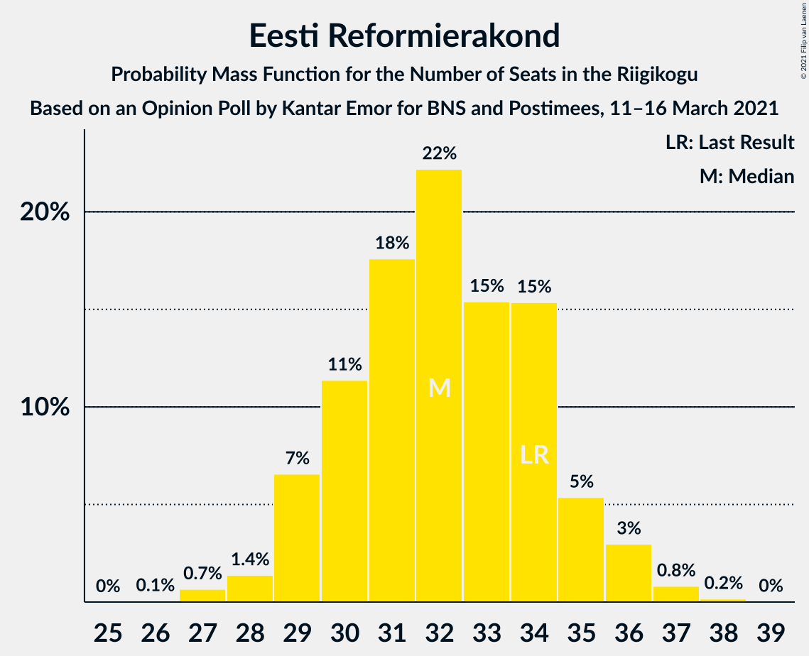
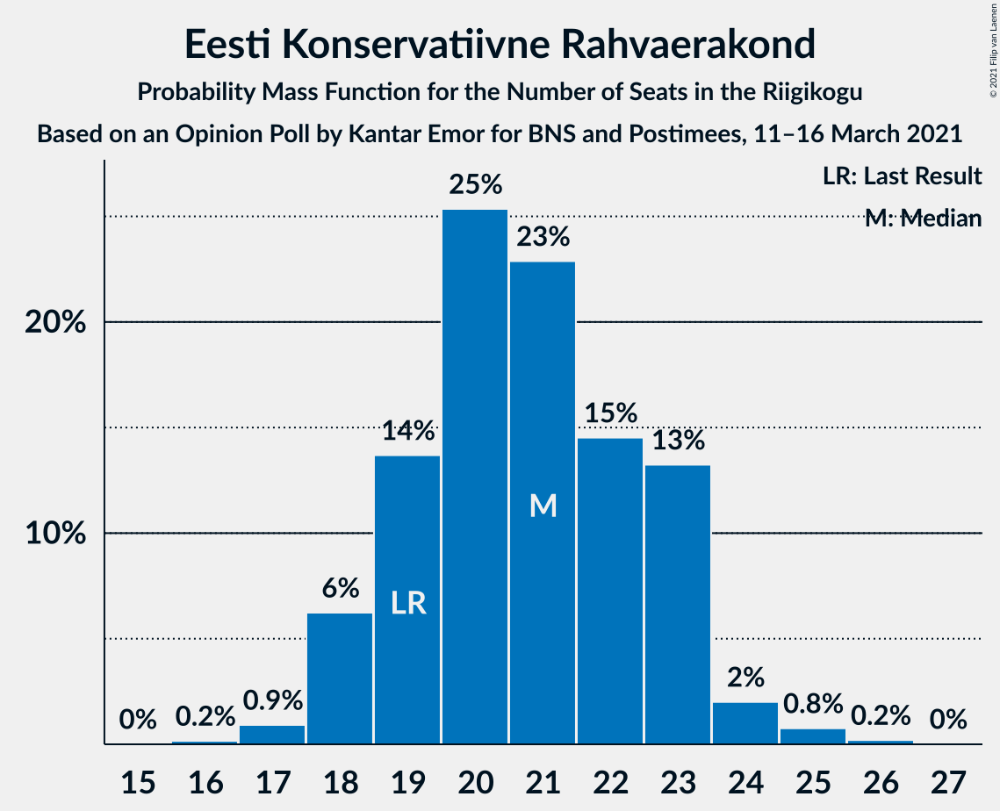
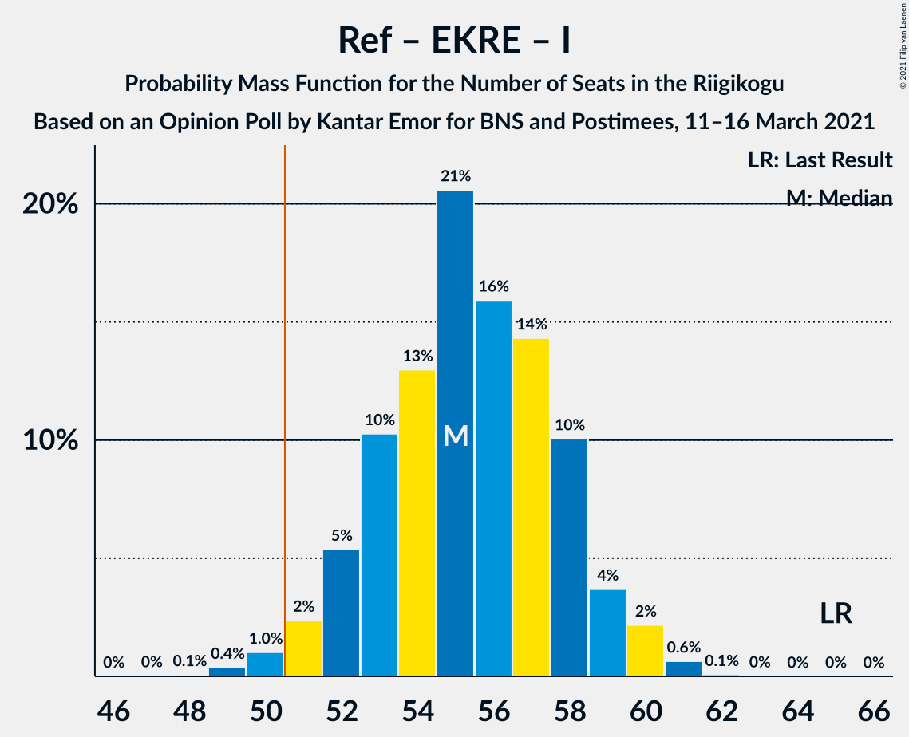

# Opinion Poll by Kantar Emor for BNS and Postimees, 11–16 March 2021

<a href="#voting-intentions">Voting Intentions</a> | <a href="#seats">Seats</a> | <a href="#coalitions">Coalitions</a> | <a href="#technical-information">Technical Information</a>

## Voting Intentions

### Confidence Intervals

| Party | Last Result | Poll Result | 80% Confidence Interval | 90% Confidence Interval | 95% Confidence Interval | 99% Confidence Interval |
|:-----:|:-----------:|:-----------:|:-----------------------:|:-----------------------:|:-----------------------:|:-----------------------:|
| Eesti Reformierakond | 28.9% | 28.0% | 26.3–29.8% |25.8–30.3% |25.4–30.7% |24.7–31.6% |
| Eesti Konservatiivne Rahvaerakond | 17.8% | 19.0% | 17.6–20.6% |17.2–21.1% |16.8–21.4% |16.2–22.2% |
| Eesti Keskerakond | 23.1% | 18.0% | 16.6–19.6% |16.2–20.0% |15.9–20.4% |15.2–21.2% |
| Eesti 200 | 4.4% | 16.0% | 14.6–17.5% |14.3–17.9% |13.9–18.3% |13.3–19.0% |
| Sotsiaaldemokraatlik Erakond | 9.8% | 9.0% | 8.0–10.2% |7.7–10.5% |7.4–10.8% |7.0–11.4% |
| Erakond Isamaa | 11.4% | 5.0% | 4.3–6.0% |4.1–6.2% |3.9–6.5% |3.6–7.0% |
| Erakond Eestimaa Rohelised | 1.8% | 4.0% | 3.4–4.9% |3.2–5.2% |3.0–5.4% |2.7–5.8% |

*Note:* The poll result column reflects the actual value used in the calculations. Published results may vary slightly, and in addition be rounded to fewer digits.

## Seats

### Confidence Intervals

| Party | Last Result | Median | 80% Confidence Interval | 90% Confidence Interval | 95% Confidence Interval | 99% Confidence Interval |
|:-----:|:-----------:|:------:|:-----------------------:|:-----------------------:|:-----------------------:|:-----------------------:|
| <a href="#eesti-reformierakond">Eesti Reformierakond</a> | 34 | 32 | 29–34 |29–35 |29–36 |27–37 |
| <a href="#eesti-konservatiivne-rahvaerakond">Eesti Konservatiivne Rahvaerakond</a> | 19 | 21 | 19–23 |18–23 |18–24 |17–25 |
| <a href="#eesti-keskerakond">Eesti Keskerakond</a> | 26 | 20 | 18–22 |17–22 |17–22 |15–24 |
| <a href="#eesti-200">Eesti 200</a> | 0 | 17 | 15–19 |15–19 |14–20 |14–21 |
| <a href="#sotsiaaldemokraatlik-erakond">Sotsiaaldemokraatlik Erakond</a> | 10 | 9 | 7–10 |7–10 |7–11 |7–12 |
| <a href="#erakond-isamaa">Erakond Isamaa</a> | 12 | 4 | 0–5 |0–6 |0–6 |0–6 |
| <a href="#erakond-eestimaa-rohelised">Erakond Eestimaa Rohelised</a> | 0 | 0 | 0 |0–4 |0–5 |0–5 |

### Eesti Reformierakond

*For a full overview of the results for this party, see the [Eesti Reformierakond](party-eestireformierakond.html) page.*

| Number of Seats | Probability | Accumulated | Special Marks |
|:---------------:|:-----------:|:-----------:|:-------------:|
| 26 | 0.1% | 100% |  |
| 27 | 1.0% | 99.9% |  |
| 28 | 0.8% | 98.9% |  |
| 29 | 10% | 98% |  |
| 30 | 12% | 88% |  |
| 31 | 13% | 76% |  |
| 32 | 30% | 62% | Median |
| 33 | 6% | 33% |  |
| 34 | 19% | 26% | Last Result |
| 35 | 4% | 7% |  |
| 36 | 2% | 4% |  |
| 37 | 1.1% | 1.3% |  |
| 38 | 0.2% | 0.2% |  |
| 39 | 0% | 0% |  |

### Eesti Konservatiivne Rahvaerakond

*For a full overview of the results for this party, see the [Eesti Konservatiivne Rahvaerakond](party-eestikonservatiivnerahvaerakond.html) page.*

| Number of Seats | Probability | Accumulated | Special Marks |
|:---------------:|:-----------:|:-----------:|:-------------:|
| 16 | 0.3% | 100% |  |
| 17 | 0.8% | 99.7% |  |
| 18 | 5% | 98.9% |  |
| 19 | 18% | 94% | Last Result |
| 20 | 18% | 75% |  |
| 21 | 27% | 57% | Median |
| 22 | 13% | 30% |  |
| 23 | 14% | 17% |  |
| 24 | 2% | 3% |  |
| 25 | 0.3% | 0.7% |  |
| 26 | 0.4% | 0.4% |  |
| 27 | 0% | 0% |  |

### Eesti Keskerakond

*For a full overview of the results for this party, see the [Eesti Keskerakond](party-eestikeskerakond.html) page.*

| Number of Seats | Probability | Accumulated | Special Marks |
|:---------------:|:-----------:|:-----------:|:-------------:|
| 15 | 0.5% | 100% |  |
| 16 | 0.8% | 99.5% |  |
| 17 | 7% | 98.7% |  |
| 18 | 15% | 91% |  |
| 19 | 25% | 77% |  |
| 20 | 27% | 51% | Median |
| 21 | 11% | 25% |  |
| 22 | 11% | 13% |  |
| 23 | 0.9% | 2% |  |
| 24 | 0.8% | 0.9% |  |
| 25 | 0% | 0% |  |
| 26 | 0% | 0% | Last Result |

### Eesti 200

*For a full overview of the results for this party, see the [Eesti 200](party-eesti200.html) page.*

| Number of Seats | Probability | Accumulated | Special Marks |
|:---------------:|:-----------:|:-----------:|:-------------:|
| 0 | 0% | 100% | Last Result |
| 1 | 0% | 100% |  |
| 2 | 0% | 100% |  |
| 3 | 0% | 100% |  |
| 4 | 0% | 100% |  |
| 5 | 0% | 100% |  |
| 6 | 0% | 100% |  |
| 7 | 0% | 100% |  |
| 8 | 0% | 100% |  |
| 9 | 0% | 100% |  |
| 10 | 0% | 100% |  |
| 11 | 0% | 100% |  |
| 12 | 0% | 100% |  |
| 13 | 0.4% | 100% |  |
| 14 | 3% | 99.6% |  |
| 15 | 9% | 97% |  |
| 16 | 25% | 88% |  |
| 17 | 22% | 63% | Median |
| 18 | 24% | 41% |  |
| 19 | 14% | 17% |  |
| 20 | 3% | 4% |  |
| 21 | 1.0% | 1.1% |  |
| 22 | 0.1% | 0.1% |  |
| 23 | 0% | 0% |  |

### Sotsiaaldemokraatlik Erakond

*For a full overview of the results for this party, see the [Sotsiaaldemokraatlik Erakond](party-sotsiaaldemokraatlikerakond.html) page.*

| Number of Seats | Probability | Accumulated | Special Marks |
|:---------------:|:-----------:|:-----------:|:-------------:|
| 6 | 0.4% | 100% |  |
| 7 | 10% | 99.5% |  |
| 8 | 30% | 90% |  |
| 9 | 37% | 60% | Median |
| 10 | 18% | 22% | Last Result |
| 11 | 4% | 5% |  |
| 12 | 0.9% | 0.9% |  |
| 13 | 0% | 0% |  |

### Erakond Isamaa

*For a full overview of the results for this party, see the [Erakond Isamaa](party-erakondisamaa.html) page.*

| Number of Seats | Probability | Accumulated | Special Marks |
|:---------------:|:-----------:|:-----------:|:-------------:|
| 0 | 48% | 100% |  |
| 1 | 0% | 52% |  |
| 2 | 0% | 52% |  |
| 3 | 0% | 52% |  |
| 4 | 13% | 52% | Median |
| 5 | 33% | 39% |  |
| 6 | 6% | 6% |  |
| 7 | 0.4% | 0.4% |  |
| 8 | 0% | 0% |  |
| 9 | 0% | 0% |  |
| 10 | 0% | 0% |  |
| 11 | 0% | 0% |  |
| 12 | 0% | 0% | Last Result |

### Erakond Eestimaa Rohelised

*For a full overview of the results for this party, see the [Erakond Eestimaa Rohelised](party-erakondeestimaarohelised.html) page.*

| Number of Seats | Probability | Accumulated | Special Marks |
|:---------------:|:-----------:|:-----------:|:-------------:|
| 0 | 94% | 100% | Last Result, Median |
| 1 | 0% | 6% |  |
| 2 | 0% | 6% |  |
| 3 | 0% | 6% |  |
| 4 | 3% | 6% |  |
| 5 | 3% | 4% |  |
| 6 | 0.1% | 0.1% |  |
| 7 | 0% | 0% |  |

## Coalitions

### Confidence Intervals

| Coalition | Last Result | Median | Majority? | 80% Confidence Interval | 90% Confidence Interval | 95% Confidence Interval | 99% Confidence Interval |
|:---------:|:-----------:|:------:|:---------:|:-----------------------:|:-----------------------:|:-----------------------:|:-----------------------:|
| Eesti Reformierakond – Eesti Konservatiivne Rahvaerakond – Eesti Keskerakond | 79 | 73 | 100% | 69–75 | 69–76 | 67–77 | 67–78 |
| Eesti Reformierakond – Eesti Konservatiivne Rahvaerakond – Erakond Isamaa | 65 | 55 | 98% | 52–58 | 52–59 | 51–59 | 49–61 |
| Eesti Reformierakond – Eesti Konservatiivne Rahvaerakond | 53 | 53 | 85% | 50–55 | 49–57 | 48–57 | 48–58 |
| Eesti Reformierakond – Eesti Keskerakond | 60 | 52 | 67% | 48–54 | 48–55 | 47–55 | 46–57 |
| Eesti Reformierakond – Sotsiaaldemokraatlik Erakond – Erakond Isamaa | 56 | 43 | 0% | 40–46 | 40–47 | 39–48 | 37–49 |
| Eesti Konservatiivne Rahvaerakond – Eesti Keskerakond – Erakond Isamaa | 57 | 43 | 0% | 39–46 | 39–46 | 39–47 | 37–48 |
| Eesti Reformierakond – Sotsiaaldemokraatlik Erakond | 44 | 41 | 0% | 38–44 | 37–44 | 37–45 | 36–46 |
| Eesti Konservatiivne Rahvaerakond – Eesti Keskerakond | 45 | 41 | 0% | 38–43 | 37–44 | 37–44 | 35–46 |
| Eesti Reformierakond – Erakond Isamaa | 46 | 34 | 0% | 31–37 | 31–38 | 30–40 | 29–40 |
| Eesti Keskerakond – Sotsiaaldemokraatlik Erakond – Erakond Isamaa | 48 | 31 | 0% | 28–34 | 27–35 | 26–35 | 25–36 |
| Eesti Konservatiivne Rahvaerakond – Sotsiaaldemokraatlik Erakond | 29 | 29 | 0% | 27–32 | 27–33 | 26–33 | 25–34 |
| Eesti Keskerakond – Sotsiaaldemokraatlik Erakond | 36 | 28 | 0% | 26–31 | 25–31 | 25–31 | 24–33 |

### Eesti Reformierakond – Eesti Konservatiivne Rahvaerakond – Eesti Keskerakond

| Number of Seats | Probability | Accumulated | Special Marks |
|:---------------:|:-----------:|:-----------:|:-------------:|
| 65 | 0.2% | 100% |  |
| 66 | 0.3% | 99.8% |  |
| 67 | 2% | 99.5% |  |
| 68 | 2% | 97% |  |
| 69 | 10% | 95% |  |
| 70 | 17% | 85% |  |
| 71 | 10% | 69% |  |
| 72 | 6% | 58% |  |
| 73 | 18% | 52% | Median |
| 74 | 6% | 34% |  |
| 75 | 22% | 28% |  |
| 76 | 2% | 5% |  |
| 77 | 2% | 3% |  |
| 78 | 0.9% | 1.1% |  |
| 79 | 0.1% | 0.2% | Last Result |
| 80 | 0.1% | 0.1% |  |
| 81 | 0% | 0% |  |

### Eesti Reformierakond – Eesti Konservatiivne Rahvaerakond – Erakond Isamaa

| Number of Seats | Probability | Accumulated | Special Marks |
|:---------------:|:-----------:|:-----------:|:-------------:|
| 48 | 0.1% | 100% |  |
| 49 | 0.9% | 99.9% |  |
| 50 | 0.9% | 99.1% |  |
| 51 | 2% | 98% | Majority |
| 52 | 7% | 96% |  |
| 53 | 8% | 90% |  |
| 54 | 14% | 82% |  |
| 55 | 24% | 68% |  |
| 56 | 17% | 44% |  |
| 57 | 15% | 27% | Median |
| 58 | 7% | 12% |  |
| 59 | 3% | 5% |  |
| 60 | 1.3% | 2% |  |
| 61 | 1.0% | 1.2% |  |
| 62 | 0.1% | 0.1% |  |
| 63 | 0% | 0% |  |
| 64 | 0% | 0% |  |
| 65 | 0% | 0% | Last Result |

### Eesti Reformierakond – Eesti Konservatiivne Rahvaerakond

| Number of Seats | Probability | Accumulated | Special Marks |
|:---------------:|:-----------:|:-----------:|:-------------:|
| 46 | 0.2% | 100% |  |
| 47 | 0.2% | 99.8% |  |
| 48 | 3% | 99.6% |  |
| 49 | 3% | 96% |  |
| 50 | 8% | 93% |  |
| 51 | 23% | 85% | Majority |
| 52 | 8% | 62% |  |
| 53 | 18% | 54% | Last Result, Median |
| 54 | 10% | 36% |  |
| 55 | 16% | 26% |  |
| 56 | 2% | 10% |  |
| 57 | 6% | 7% |  |
| 58 | 0.5% | 0.9% |  |
| 59 | 0.4% | 0.5% |  |
| 60 | 0% | 0.1% |  |
| 61 | 0.1% | 0.1% |  |
| 62 | 0% | 0% |  |

### Eesti Reformierakond – Eesti Keskerakond

| Number of Seats | Probability | Accumulated | Special Marks |
|:---------------:|:-----------:|:-----------:|:-------------:|
| 45 | 0.2% | 100% |  |
| 46 | 0.7% | 99.8% |  |
| 47 | 3% | 99.1% |  |
| 48 | 7% | 96% |  |
| 49 | 9% | 89% |  |
| 50 | 13% | 80% |  |
| 51 | 17% | 67% | Majority |
| 52 | 15% | 51% | Median |
| 53 | 14% | 36% |  |
| 54 | 13% | 22% |  |
| 55 | 7% | 9% |  |
| 56 | 0.8% | 2% |  |
| 57 | 1.2% | 1.4% |  |
| 58 | 0.1% | 0.2% |  |
| 59 | 0.1% | 0.1% |  |
| 60 | 0% | 0% | Last Result |

### Eesti Reformierakond – Sotsiaaldemokraatlik Erakond – Erakond Isamaa

| Number of Seats | Probability | Accumulated | Special Marks |
|:---------------:|:-----------:|:-----------:|:-------------:|
| 36 | 0.1% | 100% |  |
| 37 | 0.5% | 99.9% |  |
| 38 | 2% | 99.4% |  |
| 39 | 2% | 98% |  |
| 40 | 6% | 95% |  |
| 41 | 9% | 89% |  |
| 42 | 17% | 80% |  |
| 43 | 18% | 63% |  |
| 44 | 18% | 46% |  |
| 45 | 12% | 27% | Median |
| 46 | 7% | 16% |  |
| 47 | 6% | 9% |  |
| 48 | 2% | 3% |  |
| 49 | 0.7% | 0.9% |  |
| 50 | 0.2% | 0.3% |  |
| 51 | 0% | 0% | Majority |
| 52 | 0% | 0% |  |
| 53 | 0% | 0% |  |
| 54 | 0% | 0% |  |
| 55 | 0% | 0% |  |
| 56 | 0% | 0% | Last Result |

### Eesti Konservatiivne Rahvaerakond – Eesti Keskerakond – Erakond Isamaa

| Number of Seats | Probability | Accumulated | Special Marks |
|:---------------:|:-----------:|:-----------:|:-------------:|
| 36 | 0.4% | 100% |  |
| 37 | 0.4% | 99.5% |  |
| 38 | 2% | 99.2% |  |
| 39 | 10% | 98% |  |
| 40 | 1.4% | 88% |  |
| 41 | 20% | 87% |  |
| 42 | 7% | 67% |  |
| 43 | 18% | 59% |  |
| 44 | 17% | 42% |  |
| 45 | 7% | 25% | Median |
| 46 | 13% | 18% |  |
| 47 | 3% | 4% |  |
| 48 | 2% | 2% |  |
| 49 | 0.2% | 0.3% |  |
| 50 | 0.1% | 0.1% |  |
| 51 | 0% | 0% | Majority |
| 52 | 0% | 0% |  |
| 53 | 0% | 0% |  |
| 54 | 0% | 0% |  |
| 55 | 0% | 0% |  |
| 56 | 0% | 0% |  |
| 57 | 0% | 0% | Last Result |

### Eesti Reformierakond – Sotsiaaldemokraatlik Erakond

| Number of Seats | Probability | Accumulated | Special Marks |
|:---------------:|:-----------:|:-----------:|:-------------:|
| 34 | 0% | 100% |  |
| 35 | 0.3% | 99.9% |  |
| 36 | 1.3% | 99.6% |  |
| 37 | 5% | 98% |  |
| 38 | 9% | 93% |  |
| 39 | 16% | 84% |  |
| 40 | 18% | 69% |  |
| 41 | 12% | 51% | Median |
| 42 | 17% | 39% |  |
| 43 | 10% | 21% |  |
| 44 | 7% | 11% | Last Result |
| 45 | 3% | 4% |  |
| 46 | 0.7% | 1.1% |  |
| 47 | 0.3% | 0.4% |  |
| 48 | 0% | 0% |  |

### Eesti Konservatiivne Rahvaerakond – Eesti Keskerakond

| Number of Seats | Probability | Accumulated | Special Marks |
|:---------------:|:-----------:|:-----------:|:-------------:|
| 34 | 0.4% | 100% |  |
| 35 | 0.3% | 99.6% |  |
| 36 | 2% | 99.3% |  |
| 37 | 7% | 98% |  |
| 38 | 12% | 91% |  |
| 39 | 17% | 79% |  |
| 40 | 7% | 62% |  |
| 41 | 32% | 55% | Median |
| 42 | 5% | 22% |  |
| 43 | 9% | 17% |  |
| 44 | 7% | 8% |  |
| 45 | 0.2% | 1.3% | Last Result |
| 46 | 0.9% | 1.0% |  |
| 47 | 0% | 0.1% |  |
| 48 | 0% | 0% |  |

### Eesti Reformierakond – Erakond Isamaa

| Number of Seats | Probability | Accumulated | Special Marks |
|:---------------:|:-----------:|:-----------:|:-------------:|
| 28 | 0.2% | 100% |  |
| 29 | 1.3% | 99.8% |  |
| 30 | 1.1% | 98% |  |
| 31 | 9% | 97% |  |
| 32 | 12% | 89% |  |
| 33 | 5% | 76% |  |
| 34 | 26% | 71% |  |
| 35 | 11% | 45% |  |
| 36 | 12% | 35% | Median |
| 37 | 14% | 23% |  |
| 38 | 6% | 9% |  |
| 39 | 0.6% | 3% |  |
| 40 | 3% | 3% |  |
| 41 | 0% | 0.1% |  |
| 42 | 0.1% | 0.1% |  |
| 43 | 0% | 0% |  |
| 44 | 0% | 0% |  |
| 45 | 0% | 0% |  |
| 46 | 0% | 0% | Last Result |

### Eesti Keskerakond – Sotsiaaldemokraatlik Erakond – Erakond Isamaa

| Number of Seats | Probability | Accumulated | Special Marks |
|:---------------:|:-----------:|:-----------:|:-------------:|
| 24 | 0.1% | 100% |  |
| 25 | 0.5% | 99.9% |  |
| 26 | 3% | 99.4% |  |
| 27 | 3% | 96% |  |
| 28 | 13% | 93% |  |
| 29 | 9% | 80% |  |
| 30 | 15% | 71% |  |
| 31 | 16% | 56% |  |
| 32 | 14% | 40% |  |
| 33 | 7% | 26% | Median |
| 34 | 13% | 19% |  |
| 35 | 4% | 6% |  |
| 36 | 2% | 2% |  |
| 37 | 0.4% | 0.5% |  |
| 38 | 0.1% | 0.1% |  |
| 39 | 0% | 0% |  |
| 40 | 0% | 0% |  |
| 41 | 0% | 0% |  |
| 42 | 0% | 0% |  |
| 43 | 0% | 0% |  |
| 44 | 0% | 0% |  |
| 45 | 0% | 0% |  |
| 46 | 0% | 0% |  |
| 47 | 0% | 0% |  |
| 48 | 0% | 0% | Last Result |

### Eesti Konservatiivne Rahvaerakond – Sotsiaaldemokraatlik Erakond

| Number of Seats | Probability | Accumulated | Special Marks |
|:---------------:|:-----------:|:-----------:|:-------------:|
| 24 | 0.2% | 100% |  |
| 25 | 0.6% | 99.8% |  |
| 26 | 3% | 99.2% |  |
| 27 | 14% | 96% |  |
| 28 | 11% | 82% |  |
| 29 | 21% | 70% | Last Result |
| 30 | 18% | 50% | Median |
| 31 | 18% | 32% |  |
| 32 | 7% | 14% |  |
| 33 | 6% | 7% |  |
| 34 | 0.8% | 1.3% |  |
| 35 | 0.4% | 0.5% |  |
| 36 | 0.1% | 0.1% |  |
| 37 | 0% | 0% |  |

### Eesti Keskerakond – Sotsiaaldemokraatlik Erakond

| Number of Seats | Probability | Accumulated | Special Marks |
|:---------------:|:-----------:|:-----------:|:-------------:|
| 23 | 0.4% | 100% |  |
| 24 | 0.7% | 99.5% |  |
| 25 | 5% | 98.9% |  |
| 26 | 10% | 94% |  |
| 27 | 16% | 84% |  |
| 28 | 21% | 68% |  |
| 29 | 19% | 47% | Median |
| 30 | 15% | 28% |  |
| 31 | 10% | 13% |  |
| 32 | 1.2% | 2% |  |
| 33 | 0.9% | 1.1% |  |
| 34 | 0.2% | 0.3% |  |
| 35 | 0% | 0% |  |
| 36 | 0% | 0% | Last Result |

## Technical Information

### Opinion Poll

+ **Polling firm:** Kantar Emor
+ **Commissioner(s):** BNS and Postimees
+ **Fieldwork period:** 11–16 March 2021

### Calculations

+ **Sample size:** 1114
+ **Simulations done:** 131,072
+ **Error estimate:** 1.95%

