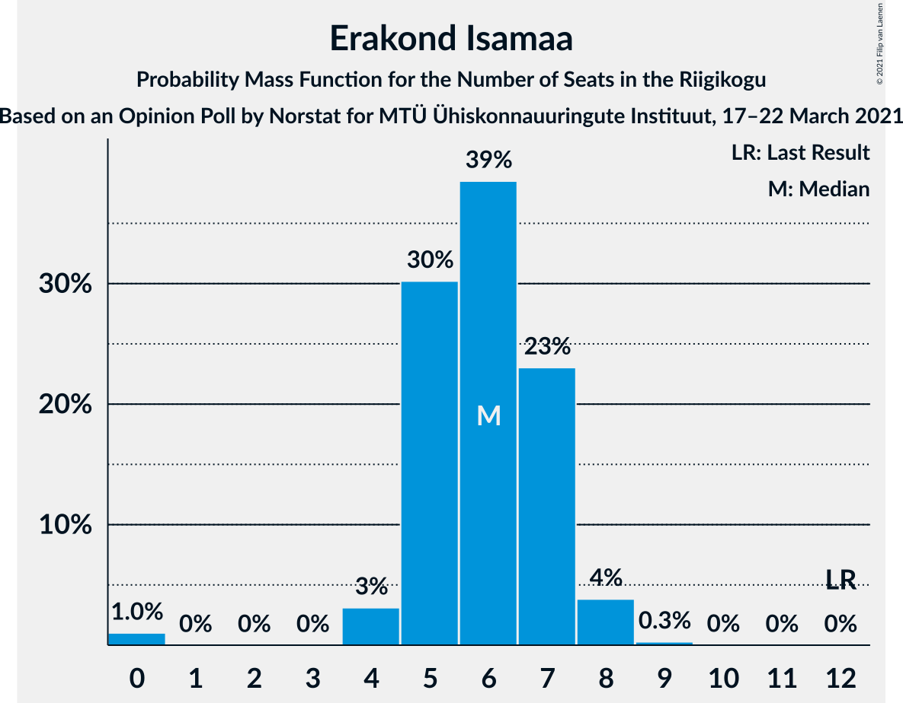

# Opinion Poll by Norstat for MTÜ Ühiskonnauuringute Instituut, 17–22 March 2021

<a href="#voting-intentions">Voting Intentions</a> | <a href="#seats">Seats</a> | <a href="#coalitions">Coalitions</a> | <a href="#technical-information">Technical Information</a>

## Voting Intentions

### Confidence Intervals

| Party | Last Result | Poll Result | 80% Confidence Interval | 90% Confidence Interval | 95% Confidence Interval | 99% Confidence Interval |
|:-----:|:-----------:|:-----------:|:-----------------------:|:-----------------------:|:-----------------------:|:-----------------------:|
| Eesti Reformierakond | 28.9% | 33.3% | 31.4–35.3% |30.9–35.8% |30.4–36.3% |29.6–37.2% |
| Eesti Keskerakond | 23.1% | 19.4% | 17.9–21.1% |17.4–21.6% |17.1–22.0% |16.4–22.8% |
| Eesti Konservatiivne Rahvaerakond | 17.8% | 17.7% | 16.2–19.3% |15.8–19.8% |15.5–20.2% |14.8–21.0% |
| Eesti 200 | 4.4% | 12.2% | 11.0–13.6% |10.6–14.0% |10.3–14.4% |9.7–15.1% |
| Sotsiaaldemokraatlik Erakond | 9.8% | 6.6% | 5.7–7.7% |5.4–8.0% |5.2–8.3% |4.8–8.9% |
| Erakond Isamaa | 11.4% | 6.6% | 5.7–7.7% |5.4–8.0% |5.2–8.3% |4.8–8.9% |
| Erakond Eestimaa Rohelised | 1.8% | 2.5% | 2.0–3.3% |1.8–3.5% |1.7–3.7% |1.5–4.1% |

*Note:* The poll result column reflects the actual value used in the calculations. Published results may vary slightly, and in addition be rounded to fewer digits.

## Seats

### Confidence Intervals

| Party | Last Result | Median | 80% Confidence Interval | 90% Confidence Interval | 95% Confidence Interval | 99% Confidence Interval |
|:-----:|:-----------:|:------:|:-----------------------:|:-----------------------:|:-----------------------:|:-----------------------:|
| <a href="#eesti-reformierakond">Eesti Reformierakond</a> | 34 | 38 | 35–40 |34–41 |34–42 |33–43 |
| <a href="#eesti-keskerakond">Eesti Keskerakond</a> | 26 | 20 | 19–23 |18–23 |18–24 |17–25 |
| <a href="#eesti-konservatiivne-rahvaerakond">Eesti Konservatiivne Rahvaerakond</a> | 19 | 19 | 17–21 |16–21 |15–22 |15–22 |
| <a href="#eesti-200">Eesti 200</a> | 0 | 12 | 11–14 |10–14 |10–15 |9–15 |
| <a href="#sotsiaaldemokraatlik-erakond">Sotsiaaldemokraatlik Erakond</a> | 10 | 6 | 5–7 |5–8 |4–8 |0–8 |
| <a href="#erakond-isamaa">Erakond Isamaa</a> | 12 | 6 | 5–7 |5–8 |4–8 |0–8 |
| <a href="#erakond-eestimaa-rohelised">Erakond Eestimaa Rohelised</a> | 0 | 0 | 0 |0 |0 |0 |

### Eesti Reformierakond

*For a full overview of the results for this party, see the [Eesti Reformierakond](party-eestireformierakond.html) page.*

| Number of Seats | Probability | Accumulated | Special Marks |
|:---------------:|:-----------:|:-----------:|:-------------:|
| 32 | 0.1% | 100% |  |
| 33 | 0.9% | 99.9% |  |
| 34 | 4% | 99.0% | Last Result |
| 35 | 5% | 95% |  |
| 36 | 13% | 90% |  |
| 37 | 19% | 77% |  |
| 38 | 24% | 57% | Median |
| 39 | 17% | 33% |  |
| 40 | 7% | 16% |  |
| 41 | 6% | 9% |  |
| 42 | 2% | 3% |  |
| 43 | 1.0% | 1.1% |  |
| 44 | 0.1% | 0.2% |  |
| 45 | 0% | 0.1% |  |
| 46 | 0% | 0% |  |

### Eesti Keskerakond

*For a full overview of the results for this party, see the [Eesti Keskerakond](party-eestikeskerakond.html) page.*

| Number of Seats | Probability | Accumulated | Special Marks |
|:---------------:|:-----------:|:-----------:|:-------------:|
| 16 | 0.3% | 100% |  |
| 17 | 2% | 99.7% |  |
| 18 | 7% | 98% |  |
| 19 | 18% | 91% |  |
| 20 | 27% | 74% | Median |
| 21 | 21% | 47% |  |
| 22 | 15% | 26% |  |
| 23 | 8% | 11% |  |
| 24 | 2% | 3% |  |
| 25 | 0.7% | 0.9% |  |
| 26 | 0.2% | 0.2% | Last Result |
| 27 | 0% | 0% |  |

### Eesti Konservatiivne Rahvaerakond

*For a full overview of the results for this party, see the [Eesti Konservatiivne Rahvaerakond](party-eestikonservatiivnerahvaerakond.html) page.*

| Number of Seats | Probability | Accumulated | Special Marks |
|:---------------:|:-----------:|:-----------:|:-------------:|
| 14 | 0.1% | 100% |  |
| 15 | 2% | 99.9% |  |
| 16 | 6% | 97% |  |
| 17 | 15% | 92% |  |
| 18 | 23% | 77% |  |
| 19 | 25% | 54% | Last Result, Median |
| 20 | 13% | 29% |  |
| 21 | 13% | 16% |  |
| 22 | 2% | 3% |  |
| 23 | 0.4% | 0.5% |  |
| 24 | 0.1% | 0.1% |  |
| 25 | 0% | 0% |  |

### Eesti 200

*For a full overview of the results for this party, see the [Eesti 200](party-eesti200.html) page.*

| Number of Seats | Probability | Accumulated | Special Marks |
|:---------------:|:-----------:|:-----------:|:-------------:|
| 0 | 0% | 100% | Last Result |
| 1 | 0% | 100% |  |
| 2 | 0% | 100% |  |
| 3 | 0% | 100% |  |
| 4 | 0% | 100% |  |
| 5 | 0% | 100% |  |
| 6 | 0% | 100% |  |
| 7 | 0% | 100% |  |
| 8 | 0% | 100% |  |
| 9 | 1.3% | 100% |  |
| 10 | 6% | 98.6% |  |
| 11 | 32% | 93% |  |
| 12 | 16% | 61% | Median |
| 13 | 29% | 46% |  |
| 14 | 13% | 17% |  |
| 15 | 3% | 4% |  |
| 16 | 0.4% | 0.4% |  |
| 17 | 0.1% | 0.1% |  |
| 18 | 0% | 0% |  |

### Sotsiaaldemokraatlik Erakond

*For a full overview of the results for this party, see the [Sotsiaaldemokraatlik Erakond](party-sotsiaaldemokraatlikerakond.html) page.*

| Number of Seats | Probability | Accumulated | Special Marks |
|:---------------:|:-----------:|:-----------:|:-------------:|
| 0 | 1.1% | 100% |  |
| 1 | 0% | 98.9% |  |
| 2 | 0% | 98.9% |  |
| 3 | 0% | 98.9% |  |
| 4 | 3% | 98.9% |  |
| 5 | 24% | 96% |  |
| 6 | 51% | 71% | Median |
| 7 | 14% | 20% |  |
| 8 | 5% | 6% |  |
| 9 | 0.4% | 0.4% |  |
| 10 | 0% | 0% | Last Result |

### Erakond Isamaa

*For a full overview of the results for this party, see the [Erakond Isamaa](party-erakondisamaa.html) page.*

| Number of Seats | Probability | Accumulated | Special Marks |
|:---------------:|:-----------:|:-----------:|:-------------:|
| 0 | 1.2% | 100% |  |
| 1 | 0% | 98.8% |  |
| 2 | 0% | 98.8% |  |
| 3 | 0% | 98.8% |  |
| 4 | 2% | 98.8% |  |
| 5 | 31% | 97% |  |
| 6 | 37% | 66% | Median |
| 7 | 23% | 28% |  |
| 8 | 5% | 5% |  |
| 9 | 0.4% | 0.4% |  |
| 10 | 0% | 0% |  |
| 11 | 0% | 0% |  |
| 12 | 0% | 0% | Last Result |

### Erakond Eestimaa Rohelised

*For a full overview of the results for this party, see the [Erakond Eestimaa Rohelised](party-erakondeestimaarohelised.html) page.*

| Number of Seats | Probability | Accumulated | Special Marks |
|:---------------:|:-----------:|:-----------:|:-------------:|
| 0 | 100% | 100% | Last Result, Median |

## Coalitions

### Confidence Intervals

| Coalition | Last Result | Median | Majority? | 80% Confidence Interval | 90% Confidence Interval | 95% Confidence Interval | 99% Confidence Interval |
|:---------:|:-----------:|:------:|:---------:|:-----------------------:|:-----------------------:|:-----------------------:|:-----------------------:|
| Eesti Reformierakond – Eesti Keskerakond – Eesti Konservatiivne Rahvaerakond | 79 | 77 | 100% | 75–79 | 74–80 | 74–80 | 73–83 |
| Eesti Reformierakond – Eesti Konservatiivne Rahvaerakond – Erakond Isamaa | 65 | 62 | 100% | 60–65 | 59–65 | 59–66 | 57–67 |
| Eesti Reformierakond – Eesti Keskerakond | 60 | 58 | 100% | 56–61 | 55–62 | 54–62 | 54–64 |
| Eesti Reformierakond – Eesti Konservatiivne Rahvaerakond | 53 | 57 | 99.9% | 54–59 | 53–60 | 53–60 | 52–62 |
| Eesti Reformierakond – Erakond Isamaa – Sotsiaaldemokraatlik Erakond | 56 | 50 | 33% | 47–52 | 46–53 | 45–54 | 44–55 |
| Eesti Keskerakond – Eesti Konservatiivne Rahvaerakond – Erakond Isamaa | 57 | 45 | 0.3% | 43–48 | 42–48 | 41–49 | 40–50 |
| Eesti Reformierakond – Erakond Isamaa | 46 | 44 | 0% | 41–46 | 40–47 | 40–48 | 39–49 |
| Eesti Reformierakond – Sotsiaaldemokraatlik Erakond | 44 | 44 | 0.1% | 41–46 | 40–47 | 40–48 | 38–49 |
| Eesti Keskerakond – Eesti Konservatiivne Rahvaerakond | 45 | 39 | 0% | 37–42 | 36–42 | 35–43 | 34–44 |
| Eesti Keskerakond – Erakond Isamaa – Sotsiaaldemokraatlik Erakond | 48 | 32 | 0% | 30–35 | 29–35 | 28–36 | 27–37 |
| Eesti Keskerakond – Sotsiaaldemokraatlik Erakond | 36 | 26 | 0% | 24–29 | 24–29 | 23–30 | 22–31 |
| Eesti Konservatiivne Rahvaerakond – Sotsiaaldemokraatlik Erakond | 29 | 25 | 0% | 22–27 | 21–27 | 21–28 | 20–29 |

### Eesti Reformierakond – Eesti Keskerakond – Eesti Konservatiivne Rahvaerakond

| Number of Seats | Probability | Accumulated | Special Marks |
|:---------------:|:-----------:|:-----------:|:-------------:|
| 72 | 0.4% | 100% |  |
| 73 | 1.5% | 99.6% |  |
| 74 | 6% | 98% |  |
| 75 | 8% | 92% |  |
| 76 | 25% | 85% |  |
| 77 | 24% | 60% | Median |
| 78 | 18% | 36% |  |
| 79 | 11% | 18% | Last Result |
| 80 | 4% | 7% |  |
| 81 | 1.0% | 2% |  |
| 82 | 0.7% | 1.4% |  |
| 83 | 0.4% | 0.6% |  |
| 84 | 0.2% | 0.2% |  |
| 85 | 0% | 0.1% |  |
| 86 | 0% | 0% |  |

### Eesti Reformierakond – Eesti Konservatiivne Rahvaerakond – Erakond Isamaa

| Number of Seats | Probability | Accumulated | Special Marks |
|:---------------:|:-----------:|:-----------:|:-------------:|
| 56 | 0.1% | 100% |  |
| 57 | 0.5% | 99.9% |  |
| 58 | 1.4% | 99.4% |  |
| 59 | 5% | 98% |  |
| 60 | 6% | 93% |  |
| 61 | 17% | 87% |  |
| 62 | 24% | 69% |  |
| 63 | 17% | 46% | Median |
| 64 | 16% | 29% |  |
| 65 | 8% | 13% | Last Result |
| 66 | 3% | 5% |  |
| 67 | 1.4% | 2% |  |
| 68 | 0.4% | 0.5% |  |
| 69 | 0.1% | 0.1% |  |
| 70 | 0% | 0% |  |

### Eesti Reformierakond – Eesti Keskerakond

| Number of Seats | Probability | Accumulated | Special Marks |
|:---------------:|:-----------:|:-----------:|:-------------:|
| 52 | 0.1% | 100% |  |
| 53 | 0.4% | 99.9% |  |
| 54 | 3% | 99.5% |  |
| 55 | 4% | 97% |  |
| 56 | 13% | 93% |  |
| 57 | 20% | 80% |  |
| 58 | 13% | 59% | Median |
| 59 | 17% | 47% |  |
| 60 | 13% | 30% | Last Result |
| 61 | 9% | 16% |  |
| 62 | 5% | 7% |  |
| 63 | 2% | 2% |  |
| 64 | 0.2% | 0.5% |  |
| 65 | 0.1% | 0.3% |  |
| 66 | 0.1% | 0.2% |  |
| 67 | 0% | 0% |  |

### Eesti Reformierakond – Eesti Konservatiivne Rahvaerakond

| Number of Seats | Probability | Accumulated | Special Marks |
|:---------------:|:-----------:|:-----------:|:-------------:|
| 50 | 0.1% | 100% |  |
| 51 | 0.4% | 99.9% | Majority |
| 52 | 2% | 99.5% |  |
| 53 | 4% | 98% | Last Result |
| 54 | 8% | 94% |  |
| 55 | 19% | 87% |  |
| 56 | 15% | 68% |  |
| 57 | 25% | 53% | Median |
| 58 | 14% | 28% |  |
| 59 | 8% | 14% |  |
| 60 | 4% | 6% |  |
| 61 | 2% | 2% |  |
| 62 | 0.4% | 0.6% |  |
| 63 | 0.1% | 0.2% |  |
| 64 | 0.1% | 0.1% |  |
| 65 | 0% | 0% |  |

### Eesti Reformierakond – Erakond Isamaa – Sotsiaaldemokraatlik Erakond

| Number of Seats | Probability | Accumulated | Special Marks |
|:---------------:|:-----------:|:-----------:|:-------------:|
| 42 | 0% | 100% |  |
| 43 | 0.3% | 99.9% |  |
| 44 | 0.4% | 99.6% |  |
| 45 | 2% | 99.2% |  |
| 46 | 3% | 97% |  |
| 47 | 8% | 94% |  |
| 48 | 15% | 86% |  |
| 49 | 19% | 71% |  |
| 50 | 19% | 52% | Median |
| 51 | 15% | 33% | Majority |
| 52 | 10% | 18% |  |
| 53 | 4% | 8% |  |
| 54 | 3% | 3% |  |
| 55 | 0.6% | 0.8% |  |
| 56 | 0.1% | 0.2% | Last Result |
| 57 | 0% | 0% |  |

### Eesti Keskerakond – Eesti Konservatiivne Rahvaerakond – Erakond Isamaa

| Number of Seats | Probability | Accumulated | Special Marks |
|:---------------:|:-----------:|:-----------:|:-------------:|
| 38 | 0.1% | 100% |  |
| 39 | 0.1% | 99.9% |  |
| 40 | 1.0% | 99.8% |  |
| 41 | 2% | 98.8% |  |
| 42 | 4% | 96% |  |
| 43 | 15% | 93% |  |
| 44 | 12% | 77% |  |
| 45 | 21% | 66% | Median |
| 46 | 26% | 45% |  |
| 47 | 8% | 19% |  |
| 48 | 9% | 12% |  |
| 49 | 1.4% | 3% |  |
| 50 | 1.3% | 2% |  |
| 51 | 0.2% | 0.3% | Majority |
| 52 | 0.1% | 0.1% |  |
| 53 | 0% | 0% |  |
| 54 | 0% | 0% |  |
| 55 | 0% | 0% |  |
| 56 | 0% | 0% |  |
| 57 | 0% | 0% | Last Result |

### Eesti Reformierakond – Erakond Isamaa

| Number of Seats | Probability | Accumulated | Special Marks |
|:---------------:|:-----------:|:-----------:|:-------------:|
| 37 | 0.1% | 100% |  |
| 38 | 0.3% | 99.8% |  |
| 39 | 2% | 99.5% |  |
| 40 | 3% | 98% |  |
| 41 | 9% | 94% |  |
| 42 | 10% | 85% |  |
| 43 | 25% | 76% |  |
| 44 | 14% | 51% | Median |
| 45 | 18% | 37% |  |
| 46 | 10% | 19% | Last Result |
| 47 | 6% | 9% |  |
| 48 | 2% | 3% |  |
| 49 | 1.0% | 1.2% |  |
| 50 | 0.1% | 0.2% |  |
| 51 | 0% | 0% | Majority |

### Eesti Reformierakond – Sotsiaaldemokraatlik Erakond

| Number of Seats | Probability | Accumulated | Special Marks |
|:---------------:|:-----------:|:-----------:|:-------------:|
| 36 | 0.1% | 100% |  |
| 37 | 0.2% | 99.9% |  |
| 38 | 0.4% | 99.8% |  |
| 39 | 1.2% | 99.4% |  |
| 40 | 4% | 98% |  |
| 41 | 6% | 94% |  |
| 42 | 15% | 89% |  |
| 43 | 17% | 73% |  |
| 44 | 25% | 56% | Last Result, Median |
| 45 | 16% | 32% |  |
| 46 | 8% | 16% |  |
| 47 | 4% | 7% |  |
| 48 | 2% | 3% |  |
| 49 | 0.7% | 1.0% |  |
| 50 | 0.3% | 0.3% |  |
| 51 | 0% | 0.1% | Majority |
| 52 | 0% | 0% |  |

### Eesti Keskerakond – Eesti Konservatiivne Rahvaerakond

| Number of Seats | Probability | Accumulated | Special Marks |
|:---------------:|:-----------:|:-----------:|:-------------:|
| 33 | 0.1% | 100% |  |
| 34 | 0.8% | 99.9% |  |
| 35 | 2% | 99.2% |  |
| 36 | 3% | 97% |  |
| 37 | 9% | 94% |  |
| 38 | 19% | 84% |  |
| 39 | 24% | 65% | Median |
| 40 | 19% | 41% |  |
| 41 | 10% | 22% |  |
| 42 | 8% | 12% |  |
| 43 | 2% | 4% |  |
| 44 | 1.0% | 1.5% |  |
| 45 | 0.3% | 0.5% | Last Result |
| 46 | 0.1% | 0.1% |  |
| 47 | 0% | 0% |  |

### Eesti Keskerakond – Erakond Isamaa – Sotsiaaldemokraatlik Erakond

| Number of Seats | Probability | Accumulated | Special Marks |
|:---------------:|:-----------:|:-----------:|:-------------:|
| 25 | 0.1% | 100% |  |
| 26 | 0.4% | 99.9% |  |
| 27 | 0.5% | 99.5% |  |
| 28 | 2% | 99.1% |  |
| 29 | 4% | 97% |  |
| 30 | 14% | 94% |  |
| 31 | 15% | 80% |  |
| 32 | 16% | 65% | Median |
| 33 | 22% | 49% |  |
| 34 | 11% | 27% |  |
| 35 | 12% | 16% |  |
| 36 | 2% | 3% |  |
| 37 | 0.9% | 1.3% |  |
| 38 | 0.4% | 0.4% |  |
| 39 | 0% | 0% |  |
| 40 | 0% | 0% |  |
| 41 | 0% | 0% |  |
| 42 | 0% | 0% |  |
| 43 | 0% | 0% |  |
| 44 | 0% | 0% |  |
| 45 | 0% | 0% |  |
| 46 | 0% | 0% |  |
| 47 | 0% | 0% |  |
| 48 | 0% | 0% | Last Result |

### Eesti Keskerakond – Sotsiaaldemokraatlik Erakond

| Number of Seats | Probability | Accumulated | Special Marks |
|:---------------:|:-----------:|:-----------:|:-------------:|
| 19 | 0% | 100% |  |
| 20 | 0.2% | 99.9% |  |
| 21 | 0.2% | 99.7% |  |
| 22 | 1.1% | 99.5% |  |
| 23 | 3% | 98% |  |
| 24 | 10% | 96% |  |
| 25 | 16% | 86% |  |
| 26 | 23% | 70% | Median |
| 27 | 20% | 46% |  |
| 28 | 14% | 26% |  |
| 29 | 10% | 13% |  |
| 30 | 2% | 3% |  |
| 31 | 1.1% | 1.3% |  |
| 32 | 0.2% | 0.3% |  |
| 33 | 0% | 0% |  |
| 34 | 0% | 0% |  |
| 35 | 0% | 0% |  |
| 36 | 0% | 0% | Last Result |

### Eesti Konservatiivne Rahvaerakond – Sotsiaaldemokraatlik Erakond

| Number of Seats | Probability | Accumulated | Special Marks |
|:---------------:|:-----------:|:-----------:|:-------------:|
| 17 | 0.1% | 100% |  |
| 18 | 0% | 99.9% |  |
| 19 | 0.1% | 99.8% |  |
| 20 | 1.2% | 99.7% |  |
| 21 | 4% | 98% |  |
| 22 | 7% | 95% |  |
| 23 | 16% | 88% |  |
| 24 | 19% | 72% |  |
| 25 | 25% | 53% | Median |
| 26 | 11% | 28% |  |
| 27 | 12% | 17% |  |
| 28 | 4% | 5% |  |
| 29 | 0.7% | 0.8% | Last Result |
| 30 | 0.1% | 0.2% |  |
| 31 | 0% | 0% |  |

## Technical Information

### Opinion Poll

+ **Polling firm:** Norstat
+ **Commissioner(s):** MTÜ Ühiskonnauuringute Instituut
+ **Fieldwork period:** 17–22 March 2021

### Calculations

+ **Sample size:** 1000
+ **Simulations done:** 131,072
+ **Error estimate:** 1.43%

