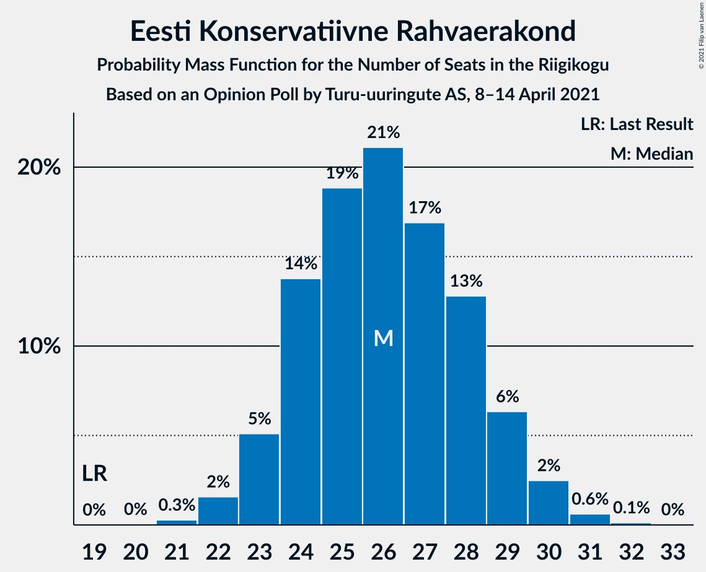
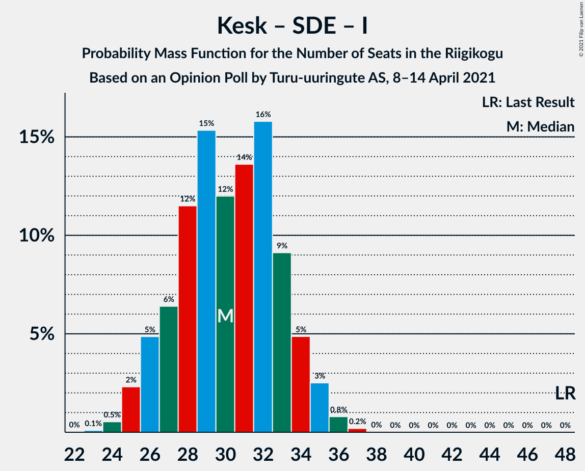

# Opinion Poll by Turu-uuringute AS, 8–14 April 2021

<a href="#voting-intentions">Voting Intentions</a> | <a href="#seats">Seats</a> | <a href="#coalitions">Coalitions</a> | <a href="#technical-information">Technical Information</a>

## Voting Intentions

### Confidence Intervals

| Party | Last Result | Poll Result | 80% Confidence Interval | 90% Confidence Interval | 95% Confidence Interval | 99% Confidence Interval |
|:-----:|:-----------:|:-----------:|:-----------------------:|:-----------------------:|:-----------------------:|:-----------------------:|
| Eesti Reformierakond | 28.9% | 27.2% | 25.5–29.1% |25.0–29.6% |24.6–30.1% |23.7–31.0% |
| Eesti Konservatiivne Rahvaerakond | 17.8% | 23.3% | 21.6–25.0% |21.2–25.5% |20.8–26.0% |20.0–26.8% |
| Eesti Keskerakond | 23.1% | 19.2% | 17.7–20.9% |17.3–21.4% |16.9–21.8% |16.2–22.6% |
| Eesti 200 | 4.4% | 13.2% | 11.9–14.6% |11.5–15.0% |11.2–15.4% |10.6–16.1% |
| Sotsiaaldemokraatlik Erakond | 9.8% | 7.0% | 6.1–8.2% |5.8–8.5% |5.6–8.8% |5.2–9.4% |
| Erakond Isamaa | 11.4% | 5.0% | 4.3–6.1% |4.0–6.3% |3.9–6.6% |3.5–7.1% |
| Erakond Eestimaa Rohelised | 1.8% | 2.0% | 1.5–2.7% |1.4–2.9% |1.3–3.0% |1.1–3.4% |

*Note:* The poll result column reflects the actual value used in the calculations. Published results may vary slightly, and in addition be rounded to fewer digits.

## Seats

### Confidence Intervals

| Party | Last Result | Median | 80% Confidence Interval | 90% Confidence Interval | 95% Confidence Interval | 99% Confidence Interval |
|:-----:|:-----------:|:------:|:-----------------------:|:-----------------------:|:-----------------------:|:-----------------------:|
| <a href="#eesti-reformierakond">Eesti Reformierakond</a> | 34 | 31 | 29–34 |28–34 |27–35 |26–36 |
| <a href="#eesti-konservatiivne-rahvaerakond">Eesti Konservatiivne Rahvaerakond</a> | 19 | 26 | 24–28 |23–29 |23–30 |22–31 |
| <a href="#eesti-keskerakond">Eesti Keskerakond</a> | 26 | 21 | 19–23 |18–24 |18–24 |17–25 |
| <a href="#eesti-200">Eesti 200</a> | 0 | 14 | 12–15 |12–16 |11–16 |10–17 |
| <a href="#sotsiaaldemokraatlik-erakond">Sotsiaaldemokraatlik Erakond</a> | 10 | 7 | 5–8 |5–8 |5–8 |4–9 |
| <a href="#erakond-isamaa">Erakond Isamaa</a> | 12 | 4 | 0–5 |0–6 |0–6 |0–7 |
| <a href="#erakond-eestimaa-rohelised">Erakond Eestimaa Rohelised</a> | 0 | 0 | 0 |0 |0 |0 |

### Eesti Reformierakond

*For a full overview of the results for this party, see the [Eesti Reformierakond](party-eestireformierakond.html) page.*

| Number of Seats | Probability | Accumulated | Special Marks |
|:---------------:|:-----------:|:-----------:|:-------------:|
| 25 | 0.1% | 100% |  |
| 26 | 0.6% | 99.9% |  |
| 27 | 2% | 99.3% |  |
| 28 | 6% | 97% |  |
| 29 | 11% | 91% |  |
| 30 | 19% | 80% |  |
| 31 | 22% | 62% | Median |
| 32 | 19% | 40% |  |
| 33 | 11% | 21% |  |
| 34 | 6% | 10% | Last Result |
| 35 | 3% | 4% |  |
| 36 | 1.0% | 1.3% |  |
| 37 | 0.3% | 0.3% |  |
| 38 | 0% | 0% |  |

### Eesti Konservatiivne Rahvaerakond

*For a full overview of the results for this party, see the [Eesti Konservatiivne Rahvaerakond](party-eestikonservatiivnerahvaerakond.html) page.*

| Number of Seats | Probability | Accumulated | Special Marks |
|:---------------:|:-----------:|:-----------:|:-------------:|
| 19 | 0% | 100% | Last Result |
| 20 | 0% | 100% |  |
| 21 | 0.3% | 100% |  |
| 22 | 2% | 99.7% |  |
| 23 | 5% | 98% |  |
| 24 | 14% | 93% |  |
| 25 | 19% | 79% |  |
| 26 | 21% | 60% | Median |
| 27 | 17% | 39% |  |
| 28 | 13% | 22% |  |
| 29 | 6% | 10% |  |
| 30 | 2% | 3% |  |
| 31 | 0.6% | 0.8% |  |
| 32 | 0.1% | 0.2% |  |
| 33 | 0% | 0% |  |

### Eesti Keskerakond

*For a full overview of the results for this party, see the [Eesti Keskerakond](party-eestikeskerakond.html) page.*

| Number of Seats | Probability | Accumulated | Special Marks |
|:---------------:|:-----------:|:-----------:|:-------------:|
| 16 | 0.1% | 100% |  |
| 17 | 1.2% | 99.9% |  |
| 18 | 5% | 98.7% |  |
| 19 | 12% | 94% |  |
| 20 | 22% | 82% |  |
| 21 | 24% | 60% | Median |
| 22 | 19% | 36% |  |
| 23 | 11% | 17% |  |
| 24 | 5% | 7% |  |
| 25 | 2% | 2% |  |
| 26 | 0.3% | 0.3% | Last Result |
| 27 | 0% | 0.1% |  |
| 28 | 0% | 0% |  |

### Eesti 200

*For a full overview of the results for this party, see the [Eesti 200](party-eesti200.html) page.*

| Number of Seats | Probability | Accumulated | Special Marks |
|:---------------:|:-----------:|:-----------:|:-------------:|
| 0 | 0% | 100% | Last Result |
| 1 | 0% | 100% |  |
| 2 | 0% | 100% |  |
| 3 | 0% | 100% |  |
| 4 | 0% | 100% |  |
| 5 | 0% | 100% |  |
| 6 | 0% | 100% |  |
| 7 | 0% | 100% |  |
| 8 | 0% | 100% |  |
| 9 | 0% | 100% |  |
| 10 | 0.5% | 100% |  |
| 11 | 4% | 99.5% |  |
| 12 | 14% | 96% |  |
| 13 | 28% | 82% |  |
| 14 | 28% | 54% | Median |
| 15 | 17% | 26% |  |
| 16 | 7% | 9% |  |
| 17 | 2% | 2% |  |
| 18 | 0.3% | 0.3% |  |
| 19 | 0% | 0% |  |

### Sotsiaaldemokraatlik Erakond

*For a full overview of the results for this party, see the [Sotsiaaldemokraatlik Erakond](party-sotsiaaldemokraatlikerakond.html) page.*

| Number of Seats | Probability | Accumulated | Special Marks |
|:---------------:|:-----------:|:-----------:|:-------------:|
| 0 | 0.2% | 100% |  |
| 1 | 0% | 99.8% |  |
| 2 | 0% | 99.8% |  |
| 3 | 0% | 99.8% |  |
| 4 | 0.3% | 99.8% |  |
| 5 | 10% | 99.4% |  |
| 6 | 36% | 89% |  |
| 7 | 36% | 53% | Median |
| 8 | 14% | 17% |  |
| 9 | 2% | 2% |  |
| 10 | 0.2% | 0.2% | Last Result |
| 11 | 0% | 0% |  |

### Erakond Isamaa

*For a full overview of the results for this party, see the [Erakond Isamaa](party-erakondisamaa.html) page.*

| Number of Seats | Probability | Accumulated | Special Marks |
|:---------------:|:-----------:|:-----------:|:-------------:|
| 0 | 46% | 100% |  |
| 1 | 0% | 54% |  |
| 2 | 0% | 54% |  |
| 3 | 0% | 54% |  |
| 4 | 16% | 54% | Median |
| 5 | 31% | 38% |  |
| 6 | 7% | 7% |  |
| 7 | 0.5% | 0.5% |  |
| 8 | 0% | 0% |  |
| 9 | 0% | 0% |  |
| 10 | 0% | 0% |  |
| 11 | 0% | 0% |  |
| 12 | 0% | 0% | Last Result |

### Erakond Eestimaa Rohelised

*For a full overview of the results for this party, see the [Erakond Eestimaa Rohelised](party-erakondeestimaarohelised.html) page.*

| Number of Seats | Probability | Accumulated | Special Marks |
|:---------------:|:-----------:|:-----------:|:-------------:|
| 0 | 100% | 100% | Last Result, Median |

## Coalitions

### Confidence Intervals

| Coalition | Last Result | Median | Majority? | 80% Confidence Interval | 90% Confidence Interval | 95% Confidence Interval | 99% Confidence Interval |
|:---------:|:-----------:|:------:|:---------:|:-----------------------:|:-----------------------:|:-----------------------:|:-----------------------:|
| Eesti Reformierakond – Eesti Konservatiivne Rahvaerakond – Eesti Keskerakond | 79 | 78 | 100% | 75–81 | 74–82 | 74–83 | 72–83 |
| Eesti Reformierakond – Eesti Konservatiivne Rahvaerakond – Erakond Isamaa | 65 | 60 | 100% | 57–62 | 56–63 | 56–64 | 54–65 |
| Eesti Reformierakond – Eesti Konservatiivne Rahvaerakond | 53 | 57 | 99.9% | 54–60 | 53–61 | 53–62 | 51–63 |
| Eesti Reformierakond – Eesti Keskerakond | 60 | 52 | 76% | 49–55 | 48–56 | 48–57 | 47–58 |
| Eesti Konservatiivne Rahvaerakond – Eesti Keskerakond – Erakond Isamaa | 57 | 50 | 33% | 47–53 | 46–53 | 45–54 | 44–55 |
| Eesti Konservatiivne Rahvaerakond – Eesti Keskerakond | 45 | 47 | 5% | 44–50 | 44–51 | 43–51 | 42–53 |
| Eesti Reformierakond – Sotsiaaldemokraatlik Erakond – Erakond Isamaa | 56 | 40 | 0% | 37–43 | 36–44 | 36–45 | 34–46 |
| Eesti Reformierakond – Sotsiaaldemokraatlik Erakond | 44 | 38 | 0% | 35–40 | 34–41 | 34–42 | 32–43 |
| Eesti Reformierakond – Erakond Isamaa | 46 | 34 | 0% | 30–37 | 30–38 | 29–38 | 28–39 |
| Eesti Konservatiivne Rahvaerakond – Sotsiaaldemokraatlik Erakond | 29 | 33 | 0% | 30–35 | 29–36 | 29–37 | 28–38 |
| Eesti Keskerakond – Sotsiaaldemokraatlik Erakond – Erakond Isamaa | 48 | 30 | 0% | 27–33 | 26–34 | 25–35 | 24–36 |
| Eesti Keskerakond – Sotsiaaldemokraatlik Erakond | 36 | 28 | 0% | 25–30 | 25–31 | 24–31 | 23–32 |

### Eesti Reformierakond – Eesti Konservatiivne Rahvaerakond – Eesti Keskerakond

| Number of Seats | Probability | Accumulated | Special Marks |
|:---------------:|:-----------:|:-----------:|:-------------:|
| 71 | 0.1% | 100% |  |
| 72 | 0.4% | 99.9% |  |
| 73 | 2% | 99.5% |  |
| 74 | 4% | 98% |  |
| 75 | 9% | 94% |  |
| 76 | 14% | 84% |  |
| 77 | 15% | 71% |  |
| 78 | 12% | 56% | Median |
| 79 | 12% | 44% | Last Result |
| 80 | 13% | 32% |  |
| 81 | 11% | 19% |  |
| 82 | 5% | 8% |  |
| 83 | 2% | 3% |  |
| 84 | 0.3% | 0.5% |  |
| 85 | 0.1% | 0.2% |  |
| 86 | 0% | 0.1% |  |
| 87 | 0% | 0% |  |

### Eesti Reformierakond – Eesti Konservatiivne Rahvaerakond – Erakond Isamaa

| Number of Seats | Probability | Accumulated | Special Marks |
|:---------------:|:-----------:|:-----------:|:-------------:|
| 53 | 0.1% | 100% |  |
| 54 | 0.5% | 99.8% |  |
| 55 | 2% | 99.4% |  |
| 56 | 5% | 98% |  |
| 57 | 8% | 93% |  |
| 58 | 14% | 85% |  |
| 59 | 15% | 71% |  |
| 60 | 19% | 56% |  |
| 61 | 16% | 37% | Median |
| 62 | 12% | 21% |  |
| 63 | 5% | 9% |  |
| 64 | 3% | 4% |  |
| 65 | 1.0% | 1.2% | Last Result |
| 66 | 0.2% | 0.3% |  |
| 67 | 0% | 0.1% |  |
| 68 | 0% | 0% |  |

### Eesti Reformierakond – Eesti Konservatiivne Rahvaerakond

| Number of Seats | Probability | Accumulated | Special Marks |
|:---------------:|:-----------:|:-----------:|:-------------:|
| 50 | 0.1% | 100% |  |
| 51 | 0.4% | 99.9% | Majority |
| 52 | 1.5% | 99.5% |  |
| 53 | 4% | 98% | Last Result |
| 54 | 7% | 94% |  |
| 55 | 12% | 87% |  |
| 56 | 17% | 76% |  |
| 57 | 16% | 59% | Median |
| 58 | 15% | 42% |  |
| 59 | 11% | 27% |  |
| 60 | 9% | 17% |  |
| 61 | 5% | 8% |  |
| 62 | 2% | 3% |  |
| 63 | 0.8% | 1.1% |  |
| 64 | 0.2% | 0.3% |  |
| 65 | 0% | 0.1% |  |
| 66 | 0% | 0% |  |

### Eesti Reformierakond – Eesti Keskerakond

| Number of Seats | Probability | Accumulated | Special Marks |
|:---------------:|:-----------:|:-----------:|:-------------:|
| 45 | 0.1% | 100% |  |
| 46 | 0.3% | 99.9% |  |
| 47 | 1.4% | 99.6% |  |
| 48 | 4% | 98% |  |
| 49 | 8% | 94% |  |
| 50 | 10% | 86% |  |
| 51 | 16% | 76% | Majority |
| 52 | 18% | 59% | Median |
| 53 | 17% | 42% |  |
| 54 | 12% | 25% |  |
| 55 | 7% | 13% |  |
| 56 | 4% | 7% |  |
| 57 | 2% | 3% |  |
| 58 | 0.5% | 0.7% |  |
| 59 | 0.1% | 0.2% |  |
| 60 | 0% | 0% | Last Result |

### Eesti Konservatiivne Rahvaerakond – Eesti Keskerakond – Erakond Isamaa

| Number of Seats | Probability | Accumulated | Special Marks |
|:---------------:|:-----------:|:-----------:|:-------------:|
| 43 | 0.2% | 100% |  |
| 44 | 1.2% | 99.7% |  |
| 45 | 3% | 98.6% |  |
| 46 | 5% | 96% |  |
| 47 | 7% | 91% |  |
| 48 | 12% | 84% |  |
| 49 | 18% | 72% |  |
| 50 | 21% | 54% |  |
| 51 | 13% | 33% | Median, Majority |
| 52 | 9% | 20% |  |
| 53 | 6% | 10% |  |
| 54 | 3% | 5% |  |
| 55 | 1.2% | 2% |  |
| 56 | 0.3% | 0.3% |  |
| 57 | 0% | 0.1% | Last Result |
| 58 | 0% | 0% |  |

### Eesti Konservatiivne Rahvaerakond – Eesti Keskerakond

| Number of Seats | Probability | Accumulated | Special Marks |
|:---------------:|:-----------:|:-----------:|:-------------:|
| 40 | 0.1% | 100% |  |
| 41 | 0.3% | 99.9% |  |
| 42 | 0.7% | 99.6% |  |
| 43 | 4% | 98.9% |  |
| 44 | 10% | 95% |  |
| 45 | 17% | 85% | Last Result |
| 46 | 11% | 68% |  |
| 47 | 14% | 57% | Median |
| 48 | 14% | 44% |  |
| 49 | 14% | 30% |  |
| 50 | 11% | 16% |  |
| 51 | 4% | 5% | Majority |
| 52 | 1.2% | 2% |  |
| 53 | 0.3% | 0.5% |  |
| 54 | 0.1% | 0.2% |  |
| 55 | 0% | 0% |  |

### Eesti Reformierakond – Sotsiaaldemokraatlik Erakond – Erakond Isamaa

| Number of Seats | Probability | Accumulated | Special Marks |
|:---------------:|:-----------:|:-----------:|:-------------:|
| 33 | 0.1% | 100% |  |
| 34 | 0.5% | 99.9% |  |
| 35 | 2% | 99.3% |  |
| 36 | 4% | 98% |  |
| 37 | 8% | 94% |  |
| 38 | 12% | 86% |  |
| 39 | 13% | 74% |  |
| 40 | 13% | 61% |  |
| 41 | 14% | 48% |  |
| 42 | 13% | 34% | Median |
| 43 | 12% | 21% |  |
| 44 | 6% | 9% |  |
| 45 | 2% | 3% |  |
| 46 | 0.7% | 0.9% |  |
| 47 | 0.2% | 0.2% |  |
| 48 | 0% | 0.1% |  |
| 49 | 0% | 0% |  |
| 50 | 0% | 0% |  |
| 51 | 0% | 0% | Majority |
| 52 | 0% | 0% |  |
| 53 | 0% | 0% |  |
| 54 | 0% | 0% |  |
| 55 | 0% | 0% |  |
| 56 | 0% | 0% | Last Result |

### Eesti Reformierakond – Sotsiaaldemokraatlik Erakond

| Number of Seats | Probability | Accumulated | Special Marks |
|:---------------:|:-----------:|:-----------:|:-------------:|
| 31 | 0.1% | 100% |  |
| 32 | 0.4% | 99.9% |  |
| 33 | 1.4% | 99.5% |  |
| 34 | 4% | 98% |  |
| 35 | 8% | 94% |  |
| 36 | 13% | 86% |  |
| 37 | 20% | 73% |  |
| 38 | 21% | 53% | Median |
| 39 | 15% | 32% |  |
| 40 | 10% | 18% |  |
| 41 | 5% | 8% |  |
| 42 | 2% | 4% |  |
| 43 | 0.8% | 1.1% |  |
| 44 | 0.3% | 0.3% | Last Result |
| 45 | 0% | 0% |  |

### Eesti Reformierakond – Erakond Isamaa

| Number of Seats | Probability | Accumulated | Special Marks |
|:---------------:|:-----------:|:-----------:|:-------------:|
| 27 | 0.2% | 100% |  |
| 28 | 0.9% | 99.7% |  |
| 29 | 3% | 98.9% |  |
| 30 | 8% | 96% |  |
| 31 | 10% | 88% |  |
| 32 | 13% | 78% |  |
| 33 | 13% | 65% |  |
| 34 | 11% | 52% |  |
| 35 | 12% | 41% | Median |
| 36 | 14% | 28% |  |
| 37 | 9% | 15% |  |
| 38 | 4% | 6% |  |
| 39 | 1.1% | 2% |  |
| 40 | 0.3% | 0.4% |  |
| 41 | 0.1% | 0.1% |  |
| 42 | 0% | 0% |  |
| 43 | 0% | 0% |  |
| 44 | 0% | 0% |  |
| 45 | 0% | 0% |  |
| 46 | 0% | 0% | Last Result |

### Eesti Konservatiivne Rahvaerakond – Sotsiaaldemokraatlik Erakond

| Number of Seats | Probability | Accumulated | Special Marks |
|:---------------:|:-----------:|:-----------:|:-------------:|
| 26 | 0.1% | 100% |  |
| 27 | 0.2% | 99.9% |  |
| 28 | 1.2% | 99.7% |  |
| 29 | 4% | 98% | Last Result |
| 30 | 10% | 95% |  |
| 31 | 13% | 85% |  |
| 32 | 21% | 72% |  |
| 33 | 17% | 51% | Median |
| 34 | 14% | 34% |  |
| 35 | 11% | 19% |  |
| 36 | 6% | 9% |  |
| 37 | 2% | 3% |  |
| 38 | 0.6% | 0.8% |  |
| 39 | 0.1% | 0.2% |  |
| 40 | 0% | 0% |  |

### Eesti Keskerakond – Sotsiaaldemokraatlik Erakond – Erakond Isamaa

| Number of Seats | Probability | Accumulated | Special Marks |
|:---------------:|:-----------:|:-----------:|:-------------:|
| 23 | 0.1% | 100% |  |
| 24 | 0.5% | 99.9% |  |
| 25 | 2% | 99.3% |  |
| 26 | 5% | 97% |  |
| 27 | 6% | 92% |  |
| 28 | 12% | 86% |  |
| 29 | 15% | 74% |  |
| 30 | 12% | 59% |  |
| 31 | 14% | 47% |  |
| 32 | 16% | 33% | Median |
| 33 | 9% | 18% |  |
| 34 | 5% | 8% |  |
| 35 | 3% | 4% |  |
| 36 | 0.8% | 1.0% |  |
| 37 | 0.2% | 0.2% |  |
| 38 | 0% | 0% |  |
| 39 | 0% | 0% |  |
| 40 | 0% | 0% |  |
| 41 | 0% | 0% |  |
| 42 | 0% | 0% |  |
| 43 | 0% | 0% |  |
| 44 | 0% | 0% |  |
| 45 | 0% | 0% |  |
| 46 | 0% | 0% |  |
| 47 | 0% | 0% |  |
| 48 | 0% | 0% | Last Result |

### Eesti Keskerakond – Sotsiaaldemokraatlik Erakond

| Number of Seats | Probability | Accumulated | Special Marks |
|:---------------:|:-----------:|:-----------:|:-------------:|
| 21 | 0.1% | 100% |  |
| 22 | 0.2% | 99.9% |  |
| 23 | 1.0% | 99.7% |  |
| 24 | 4% | 98.7% |  |
| 25 | 8% | 95% |  |
| 26 | 16% | 87% |  |
| 27 | 18% | 71% |  |
| 28 | 22% | 52% | Median |
| 29 | 17% | 31% |  |
| 30 | 7% | 14% |  |
| 31 | 4% | 6% |  |
| 32 | 1.5% | 2% |  |
| 33 | 0.3% | 0.4% |  |
| 34 | 0.1% | 0.1% |  |
| 35 | 0% | 0% |  |
| 36 | 0% | 0% | Last Result |

## Technical Information

### Opinion Poll

+ **Polling firm:** Turu-uuringute AS
+ **Commissioner(s):** —
+ **Fieldwork period:** 8–14 April 2021

### Calculations

+ **Sample size:** 1010
+ **Simulations done:** 1,048,576
+ **Error estimate:** 0.88%

