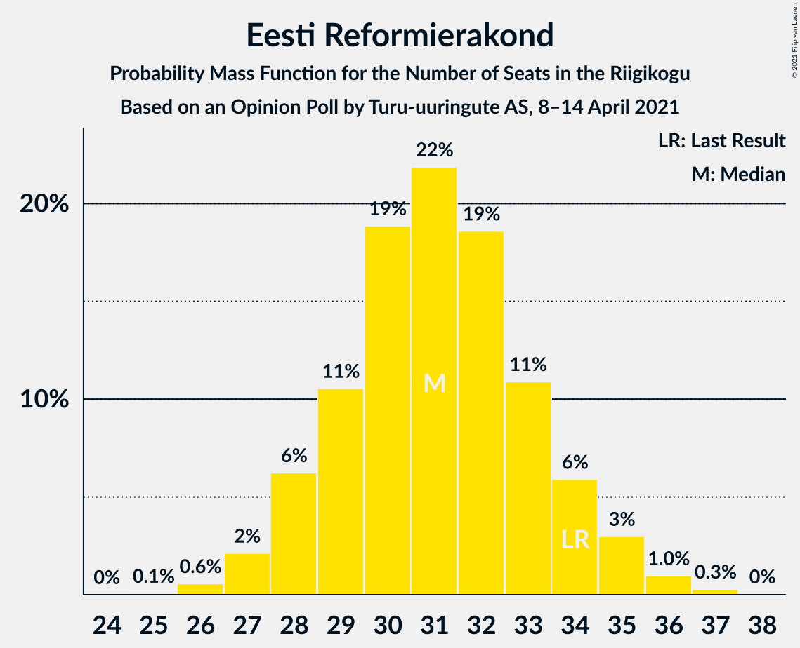
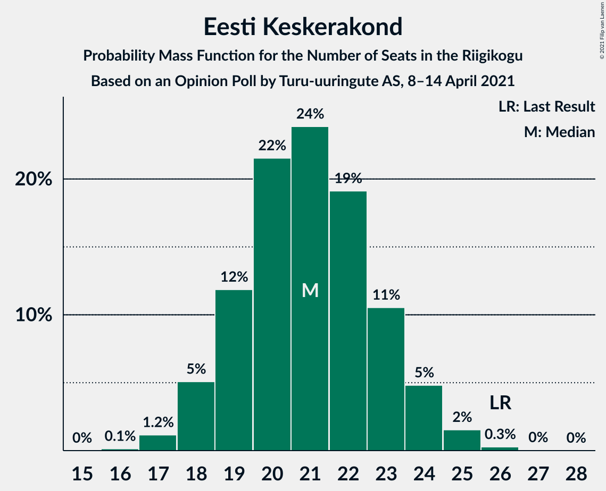
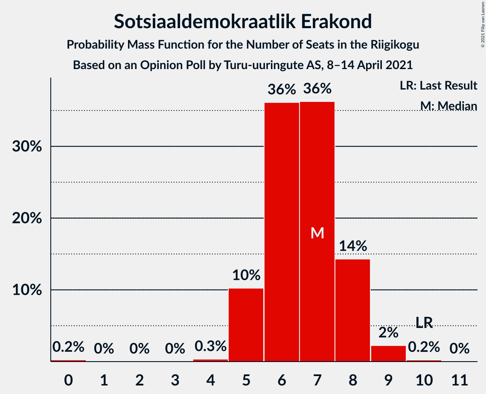
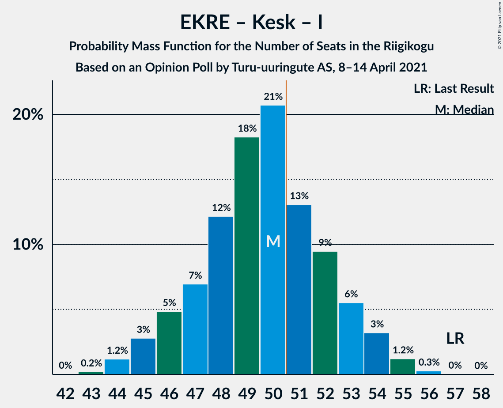
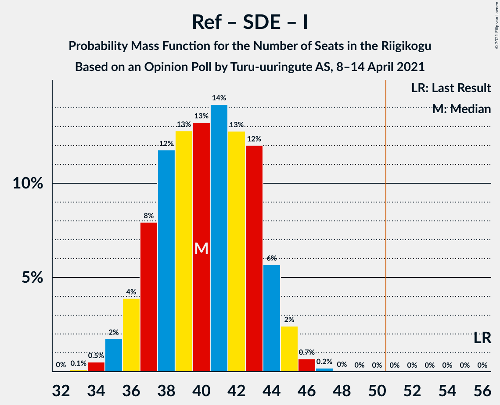

# Opinion Poll by Turu-uuringute AS, 8–14 April 2021

<a href="#voting-intentions">Voting Intentions</a> | <a href="#seats">Seats</a> | <a href="#coalitions">Coalitions</a> | <a href="#technical-information">Technical Information</a>

## Voting Intentions

### Confidence Intervals

| Party | Last Result | Poll Result | 80% Confidence Interval | 90% Confidence Interval | 95% Confidence Interval | 99% Confidence Interval |
|:-----:|:-----------:|:-----------:|:-----------------------:|:-----------------------:|:-----------------------:|:-----------------------:|
| Eesti Reformierakond | 28.9% | 27.2% | 25.5–29.1% |25.0–29.6% |24.6–30.1% |23.7–31.0% |
| Eesti Konservatiivne Rahvaerakond | 17.8% | 23.3% | 21.6–25.0% |21.2–25.5% |20.8–26.0% |20.0–26.8% |
| Eesti Keskerakond | 23.1% | 19.2% | 17.7–20.9% |17.3–21.4% |16.9–21.8% |16.2–22.6% |
| Eesti 200 | 4.4% | 13.2% | 11.9–14.6% |11.5–15.0% |11.2–15.4% |10.6–16.1% |
| Sotsiaaldemokraatlik Erakond | 9.8% | 7.0% | 6.1–8.2% |5.8–8.5% |5.6–8.8% |5.2–9.4% |
| Erakond Isamaa | 11.4% | 5.0% | 4.3–6.1% |4.0–6.3% |3.9–6.6% |3.5–7.1% |
| Erakond Eestimaa Rohelised | 1.8% | 2.0% | 1.5–2.7% |1.4–2.9% |1.3–3.0% |1.1–3.4% |

*Note:* The poll result column reflects the actual value used in the calculations. Published results may vary slightly, and in addition be rounded to fewer digits.

## Seats

### Confidence Intervals

| Party | Last Result | Median | 80% Confidence Interval | 90% Confidence Interval | 95% Confidence Interval | 99% Confidence Interval |
|:-----:|:-----------:|:------:|:-----------------------:|:-----------------------:|:-----------------------:|:-----------------------:|
| <a href="#eesti-reformierakond">Eesti Reformierakond</a> | 34 | 31 | 29–34 |28–34 |27–35 |26–37 |
| <a href="#eesti-konservatiivne-rahvaerakond">Eesti Konservatiivne Rahvaerakond</a> | 19 | 26 | 24–29 |23–29 |22–30 |22–31 |
| <a href="#eesti-keskerakond">Eesti Keskerakond</a> | 26 | 21 | 19–23 |18–24 |18–25 |17–25 |
| <a href="#eesti-200">Eesti 200</a> | 0 | 14 | 12–16 |11–16 |11–17 |10–17 |
| <a href="#sotsiaaldemokraatlik-erakond">Sotsiaaldemokraatlik Erakond</a> | 10 | 6 | 5–8 |5–8 |5–8 |4–9 |
| <a href="#erakond-isamaa">Erakond Isamaa</a> | 12 | 0 | 0–5 |0–6 |0–6 |0–7 |
| <a href="#erakond-eestimaa-rohelised">Erakond Eestimaa Rohelised</a> | 0 | 0 | 0 |0 |0 |0 |

### Eesti Reformierakond

*For a full overview of the results for this party, see the [Eesti Reformierakond](party-eestireformierakond.html) page.*

| Number of Seats | Probability | Accumulated | Special Marks |
|:---------------:|:-----------:|:-----------:|:-------------:|
| 25 | 0.1% | 100% |  |
| 26 | 0.6% | 99.9% |  |
| 27 | 3% | 99.3% |  |
| 28 | 5% | 96% |  |
| 29 | 10% | 91% |  |
| 30 | 15% | 82% |  |
| 31 | 19% | 67% | Median |
| 32 | 24% | 48% |  |
| 33 | 13% | 24% |  |
| 34 | 8% | 11% | Last Result |
| 35 | 1.2% | 3% |  |
| 36 | 0.6% | 1.4% |  |
| 37 | 0.7% | 0.8% |  |
| 38 | 0% | 0% |  |

### Eesti Konservatiivne Rahvaerakond

*For a full overview of the results for this party, see the [Eesti Konservatiivne Rahvaerakond](party-eestikonservatiivnerahvaerakond.html) page.*

| Number of Seats | Probability | Accumulated | Special Marks |
|:---------------:|:-----------:|:-----------:|:-------------:|
| 19 | 0% | 100% | Last Result |
| 20 | 0.1% | 100% |  |
| 21 | 0.3% | 99.9% |  |
| 22 | 3% | 99.7% |  |
| 23 | 5% | 97% |  |
| 24 | 13% | 92% |  |
| 25 | 19% | 79% |  |
| 26 | 26% | 60% | Median |
| 27 | 15% | 34% |  |
| 28 | 8% | 18% |  |
| 29 | 7% | 11% |  |
| 30 | 2% | 3% |  |
| 31 | 0.6% | 0.8% |  |
| 32 | 0.2% | 0.2% |  |
| 33 | 0% | 0% |  |

### Eesti Keskerakond

*For a full overview of the results for this party, see the [Eesti Keskerakond](party-eestikeskerakond.html) page.*

| Number of Seats | Probability | Accumulated | Special Marks |
|:---------------:|:-----------:|:-----------:|:-------------:|
| 16 | 0.2% | 100% |  |
| 17 | 2% | 99.8% |  |
| 18 | 5% | 98% |  |
| 19 | 10% | 93% |  |
| 20 | 20% | 82% |  |
| 21 | 13% | 63% | Median |
| 22 | 22% | 49% |  |
| 23 | 19% | 28% |  |
| 24 | 6% | 9% |  |
| 25 | 2% | 3% |  |
| 26 | 0.3% | 0.3% | Last Result |
| 27 | 0% | 0.1% |  |
| 28 | 0% | 0% |  |

### Eesti 200

*For a full overview of the results for this party, see the [Eesti 200](party-eesti200.html) page.*

| Number of Seats | Probability | Accumulated | Special Marks |
|:---------------:|:-----------:|:-----------:|:-------------:|
| 0 | 0% | 100% | Last Result |
| 1 | 0% | 100% |  |
| 2 | 0% | 100% |  |
| 3 | 0% | 100% |  |
| 4 | 0% | 100% |  |
| 5 | 0% | 100% |  |
| 6 | 0% | 100% |  |
| 7 | 0% | 100% |  |
| 8 | 0% | 100% |  |
| 9 | 0% | 100% |  |
| 10 | 0.5% | 100% |  |
| 11 | 5% | 99.4% |  |
| 12 | 20% | 94% |  |
| 13 | 21% | 74% |  |
| 14 | 27% | 53% | Median |
| 15 | 14% | 26% |  |
| 16 | 9% | 12% |  |
| 17 | 3% | 3% |  |
| 18 | 0.3% | 0.3% |  |
| 19 | 0% | 0% |  |

### Sotsiaaldemokraatlik Erakond

*For a full overview of the results for this party, see the [Sotsiaaldemokraatlik Erakond](party-sotsiaaldemokraatlikerakond.html) page.*

| Number of Seats | Probability | Accumulated | Special Marks |
|:---------------:|:-----------:|:-----------:|:-------------:|
| 0 | 0.3% | 100% |  |
| 1 | 0% | 99.7% |  |
| 2 | 0% | 99.7% |  |
| 3 | 0% | 99.7% |  |
| 4 | 0.3% | 99.7% |  |
| 5 | 11% | 99.4% |  |
| 6 | 41% | 88% | Median |
| 7 | 27% | 48% |  |
| 8 | 19% | 20% |  |
| 9 | 1.2% | 1.5% |  |
| 10 | 0.2% | 0.2% | Last Result |
| 11 | 0% | 0% |  |

### Erakond Isamaa

*For a full overview of the results for this party, see the [Erakond Isamaa](party-erakondisamaa.html) page.*

| Number of Seats | Probability | Accumulated | Special Marks |
|:---------------:|:-----------:|:-----------:|:-------------:|
| 0 | 51% | 100% | Median |
| 1 | 0% | 49% |  |
| 2 | 0% | 49% |  |
| 3 | 0% | 49% |  |
| 4 | 16% | 49% |  |
| 5 | 28% | 34% |  |
| 6 | 5% | 6% |  |
| 7 | 0.6% | 0.6% |  |
| 8 | 0% | 0% |  |
| 9 | 0% | 0% |  |
| 10 | 0% | 0% |  |
| 11 | 0% | 0% |  |
| 12 | 0% | 0% | Last Result |

### Erakond Eestimaa Rohelised

*For a full overview of the results for this party, see the [Erakond Eestimaa Rohelised](party-erakondeestimaarohelised.html) page.*

| Number of Seats | Probability | Accumulated | Special Marks |
|:---------------:|:-----------:|:-----------:|:-------------:|
| 0 | 100% | 100% | Last Result, Median |

## Coalitions

### Confidence Intervals

| Coalition | Last Result | Median | Majority? | 80% Confidence Interval | 90% Confidence Interval | 95% Confidence Interval | 99% Confidence Interval |
|:---------:|:-----------:|:------:|:---------:|:-----------------------:|:-----------------------:|:-----------------------:|:-----------------------:|
| Eesti Reformierakond – Eesti Konservatiivne Rahvaerakond – Eesti Keskerakond | 79 | 79 | 100% | 75–81 | 74–83 | 74–83 | 72–84 |
| Eesti Reformierakond – Eesti Konservatiivne Rahvaerakond – Erakond Isamaa | 65 | 60 | 100% | 57–62 | 56–63 | 56–64 | 54–65 |
| Eesti Reformierakond – Eesti Konservatiivne Rahvaerakond | 53 | 57 | 99.9% | 54–60 | 53–61 | 52–62 | 51–63 |
| Eesti Reformierakond – Eesti Keskerakond | 60 | 53 | 77% | 49–55 | 48–56 | 47–56 | 46–58 |
| Eesti Konservatiivne Rahvaerakond – Eesti Keskerakond – Erakond Isamaa | 57 | 49 | 33% | 47–53 | 46–53 | 45–54 | 44–55 |
| Eesti Konservatiivne Rahvaerakond – Eesti Keskerakond | 45 | 48 | 4% | 44–50 | 43–50 | 43–51 | 42–53 |
| Eesti Reformierakond – Sotsiaaldemokraatlik Erakond – Erakond Isamaa | 56 | 40 | 0% | 37–44 | 36–44 | 36–45 | 34–47 |
| Eesti Reformierakond – Sotsiaaldemokraatlik Erakond | 44 | 38 | 0% | 35–40 | 34–41 | 34–42 | 33–44 |
| Eesti Reformierakond – Erakond Isamaa | 46 | 33 | 0% | 30–38 | 30–38 | 29–38 | 28–39 |
| Eesti Konservatiivne Rahvaerakond – Sotsiaaldemokraatlik Erakond | 29 | 32 | 0% | 30–35 | 29–36 | 28–37 | 28–38 |
| Eesti Keskerakond – Sotsiaaldemokraatlik Erakond – Erakond Isamaa | 48 | 30 | 0% | 26–34 | 25–34 | 25–35 | 24–36 |
| Eesti Keskerakond – Sotsiaaldemokraatlik Erakond | 36 | 28 | 0% | 25–30 | 24–31 | 24–31 | 23–33 |

### Eesti Reformierakond – Eesti Konservatiivne Rahvaerakond – Eesti Keskerakond

| Number of Seats | Probability | Accumulated | Special Marks |
|:---------------:|:-----------:|:-----------:|:-------------:|
| 71 | 0.1% | 100% |  |
| 72 | 0.8% | 99.9% |  |
| 73 | 2% | 99.1% |  |
| 74 | 3% | 98% |  |
| 75 | 8% | 95% |  |
| 76 | 10% | 86% |  |
| 77 | 15% | 77% |  |
| 78 | 11% | 62% | Median |
| 79 | 13% | 51% | Last Result |
| 80 | 17% | 39% |  |
| 81 | 13% | 22% |  |
| 82 | 3% | 8% |  |
| 83 | 4% | 5% |  |
| 84 | 0.7% | 0.8% |  |
| 85 | 0% | 0.1% |  |
| 86 | 0% | 0.1% |  |
| 87 | 0.1% | 0.1% |  |
| 88 | 0% | 0% |  |

### Eesti Reformierakond – Eesti Konservatiivne Rahvaerakond – Erakond Isamaa

| Number of Seats | Probability | Accumulated | Special Marks |
|:---------------:|:-----------:|:-----------:|:-------------:|
| 53 | 0.1% | 100% |  |
| 54 | 0.6% | 99.8% |  |
| 55 | 2% | 99.3% |  |
| 56 | 3% | 98% |  |
| 57 | 12% | 94% | Median |
| 58 | 18% | 83% |  |
| 59 | 13% | 65% |  |
| 60 | 17% | 52% |  |
| 61 | 17% | 35% |  |
| 62 | 12% | 18% |  |
| 63 | 3% | 7% |  |
| 64 | 3% | 4% |  |
| 65 | 0.8% | 1.0% | Last Result |
| 66 | 0.1% | 0.2% |  |
| 67 | 0% | 0.1% |  |
| 68 | 0% | 0% |  |

### Eesti Reformierakond – Eesti Konservatiivne Rahvaerakond

| Number of Seats | Probability | Accumulated | Special Marks |
|:---------------:|:-----------:|:-----------:|:-------------:|
| 50 | 0.1% | 100% |  |
| 51 | 0.5% | 99.9% | Majority |
| 52 | 2% | 99.4% |  |
| 53 | 4% | 97% | Last Result |
| 54 | 7% | 94% |  |
| 55 | 7% | 87% |  |
| 56 | 17% | 80% |  |
| 57 | 19% | 63% | Median |
| 58 | 19% | 44% |  |
| 59 | 10% | 25% |  |
| 60 | 6% | 15% |  |
| 61 | 6% | 9% |  |
| 62 | 1.2% | 3% |  |
| 63 | 1.1% | 1.4% |  |
| 64 | 0.2% | 0.3% |  |
| 65 | 0% | 0.1% |  |
| 66 | 0% | 0% |  |

### Eesti Reformierakond – Eesti Keskerakond

| Number of Seats | Probability | Accumulated | Special Marks |
|:---------------:|:-----------:|:-----------:|:-------------:|
| 45 | 0% | 100% |  |
| 46 | 0.6% | 99.9% |  |
| 47 | 3% | 99.3% |  |
| 48 | 5% | 97% |  |
| 49 | 6% | 92% |  |
| 50 | 9% | 86% |  |
| 51 | 9% | 77% | Majority |
| 52 | 12% | 67% | Median |
| 53 | 17% | 55% |  |
| 54 | 12% | 38% |  |
| 55 | 18% | 26% |  |
| 56 | 6% | 8% |  |
| 57 | 2% | 2% |  |
| 58 | 0.6% | 0.7% |  |
| 59 | 0% | 0.1% |  |
| 60 | 0.1% | 0.1% | Last Result |
| 61 | 0% | 0% |  |

### Eesti Konservatiivne Rahvaerakond – Eesti Keskerakond – Erakond Isamaa

| Number of Seats | Probability | Accumulated | Special Marks |
|:---------------:|:-----------:|:-----------:|:-------------:|
| 43 | 0.4% | 100% |  |
| 44 | 0.9% | 99.6% |  |
| 45 | 3% | 98.7% |  |
| 46 | 3% | 96% |  |
| 47 | 7% | 93% | Median |
| 48 | 17% | 86% |  |
| 49 | 25% | 69% |  |
| 50 | 10% | 43% |  |
| 51 | 11% | 33% | Majority |
| 52 | 10% | 22% |  |
| 53 | 7% | 11% |  |
| 54 | 3% | 4% |  |
| 55 | 1.0% | 1.4% |  |
| 56 | 0.3% | 0.4% |  |
| 57 | 0.1% | 0.1% | Last Result |
| 58 | 0% | 0% |  |

### Eesti Konservatiivne Rahvaerakond – Eesti Keskerakond

| Number of Seats | Probability | Accumulated | Special Marks |
|:---------------:|:-----------:|:-----------:|:-------------:|
| 40 | 0.1% | 100% |  |
| 41 | 0.2% | 99.9% |  |
| 42 | 1.4% | 99.7% |  |
| 43 | 5% | 98% |  |
| 44 | 10% | 93% |  |
| 45 | 8% | 83% | Last Result |
| 46 | 6% | 75% |  |
| 47 | 16% | 69% | Median |
| 48 | 22% | 53% |  |
| 49 | 20% | 31% |  |
| 50 | 7% | 11% |  |
| 51 | 2% | 4% | Majority |
| 52 | 2% | 2% |  |
| 53 | 0.3% | 0.5% |  |
| 54 | 0.2% | 0.2% |  |
| 55 | 0% | 0% |  |

### Eesti Reformierakond – Sotsiaaldemokraatlik Erakond – Erakond Isamaa

| Number of Seats | Probability | Accumulated | Special Marks |
|:---------------:|:-----------:|:-----------:|:-------------:|
| 33 | 0.1% | 100% |  |
| 34 | 0.5% | 99.9% |  |
| 35 | 2% | 99.4% |  |
| 36 | 3% | 98% |  |
| 37 | 6% | 94% | Median |
| 38 | 18% | 88% |  |
| 39 | 16% | 70% |  |
| 40 | 10% | 54% |  |
| 41 | 10% | 44% |  |
| 42 | 14% | 33% |  |
| 43 | 8% | 19% |  |
| 44 | 8% | 12% |  |
| 45 | 2% | 4% |  |
| 46 | 1.1% | 2% |  |
| 47 | 0.4% | 0.6% |  |
| 48 | 0.1% | 0.1% |  |
| 49 | 0% | 0% |  |
| 50 | 0% | 0% |  |
| 51 | 0% | 0% | Majority |
| 52 | 0% | 0% |  |
| 53 | 0% | 0% |  |
| 54 | 0% | 0% |  |
| 55 | 0% | 0% |  |
| 56 | 0% | 0% | Last Result |

### Eesti Reformierakond – Sotsiaaldemokraatlik Erakond

| Number of Seats | Probability | Accumulated | Special Marks |
|:---------------:|:-----------:|:-----------:|:-------------:|
| 31 | 0.2% | 100% |  |
| 32 | 0.2% | 99.8% |  |
| 33 | 2% | 99.5% |  |
| 34 | 5% | 98% |  |
| 35 | 7% | 93% |  |
| 36 | 11% | 86% |  |
| 37 | 14% | 75% | Median |
| 38 | 27% | 61% |  |
| 39 | 17% | 34% |  |
| 40 | 7% | 17% |  |
| 41 | 7% | 10% |  |
| 42 | 2% | 3% |  |
| 43 | 0.8% | 1.3% |  |
| 44 | 0.4% | 0.5% | Last Result |
| 45 | 0.1% | 0.1% |  |
| 46 | 0% | 0% |  |

### Eesti Reformierakond – Erakond Isamaa

| Number of Seats | Probability | Accumulated | Special Marks |
|:---------------:|:-----------:|:-----------:|:-------------:|
| 27 | 0.2% | 100% |  |
| 28 | 0.6% | 99.8% |  |
| 29 | 4% | 99.1% |  |
| 30 | 6% | 96% |  |
| 31 | 8% | 90% | Median |
| 32 | 22% | 82% |  |
| 33 | 13% | 60% |  |
| 34 | 8% | 47% |  |
| 35 | 19% | 39% |  |
| 36 | 5% | 20% |  |
| 37 | 4% | 15% |  |
| 38 | 9% | 11% |  |
| 39 | 2% | 2% |  |
| 40 | 0.2% | 0.3% |  |
| 41 | 0% | 0.1% |  |
| 42 | 0% | 0% |  |
| 43 | 0% | 0% |  |
| 44 | 0% | 0% |  |
| 45 | 0% | 0% |  |
| 46 | 0% | 0% | Last Result |

### Eesti Konservatiivne Rahvaerakond – Sotsiaaldemokraatlik Erakond

| Number of Seats | Probability | Accumulated | Special Marks |
|:---------------:|:-----------:|:-----------:|:-------------:|
| 25 | 0.1% | 100% |  |
| 26 | 0.1% | 99.9% |  |
| 27 | 0.3% | 99.8% |  |
| 28 | 3% | 99.6% |  |
| 29 | 2% | 97% | Last Result |
| 30 | 12% | 95% |  |
| 31 | 9% | 83% |  |
| 32 | 29% | 74% | Median |
| 33 | 16% | 45% |  |
| 34 | 13% | 29% |  |
| 35 | 7% | 16% |  |
| 36 | 5% | 8% |  |
| 37 | 3% | 4% |  |
| 38 | 0.4% | 0.5% |  |
| 39 | 0.1% | 0.2% |  |
| 40 | 0% | 0% |  |

### Eesti Keskerakond – Sotsiaaldemokraatlik Erakond – Erakond Isamaa

| Number of Seats | Probability | Accumulated | Special Marks |
|:---------------:|:-----------:|:-----------:|:-------------:|
| 23 | 0.1% | 100% |  |
| 24 | 0.8% | 99.8% |  |
| 25 | 4% | 99.0% |  |
| 26 | 5% | 95% |  |
| 27 | 4% | 90% | Median |
| 28 | 10% | 86% |  |
| 29 | 21% | 77% |  |
| 30 | 9% | 55% |  |
| 31 | 16% | 46% |  |
| 32 | 7% | 30% |  |
| 33 | 12% | 23% |  |
| 34 | 7% | 11% |  |
| 35 | 2% | 5% |  |
| 36 | 2% | 2% |  |
| 37 | 0.2% | 0.2% |  |
| 38 | 0% | 0% |  |
| 39 | 0% | 0% |  |
| 40 | 0% | 0% |  |
| 41 | 0% | 0% |  |
| 42 | 0% | 0% |  |
| 43 | 0% | 0% |  |
| 44 | 0% | 0% |  |
| 45 | 0% | 0% |  |
| 46 | 0% | 0% |  |
| 47 | 0% | 0% |  |
| 48 | 0% | 0% | Last Result |

### Eesti Keskerakond – Sotsiaaldemokraatlik Erakond

| Number of Seats | Probability | Accumulated | Special Marks |
|:---------------:|:-----------:|:-----------:|:-------------:|
| 21 | 0% | 100% |  |
| 22 | 0.2% | 99.9% |  |
| 23 | 1.5% | 99.8% |  |
| 24 | 4% | 98% |  |
| 25 | 9% | 94% |  |
| 26 | 13% | 85% |  |
| 27 | 13% | 72% | Median |
| 28 | 14% | 59% |  |
| 29 | 29% | 45% |  |
| 30 | 7% | 16% |  |
| 31 | 7% | 9% |  |
| 32 | 1.4% | 2% |  |
| 33 | 0.6% | 0.6% |  |
| 34 | 0.1% | 0.1% |  |
| 35 | 0% | 0% |  |
| 36 | 0% | 0% | Last Result |

## Technical Information

### Opinion Poll

+ **Polling firm:** Turu-uuringute AS
+ **Commissioner(s):** —
+ **Fieldwork period:** 8–14 April 2021

### Calculations

+ **Sample size:** 1010
+ **Simulations done:** 131,072
+ **Error estimate:** 0.99%

