# Opinion Poll by Kantar Emor for BNS and Postimees, 15–21 April 2021

<a href="#voting-intentions">Voting Intentions</a> | <a href="#seats">Seats</a> | <a href="#coalitions">Coalitions</a> | <a href="#technical-information">Technical Information</a>

## Voting Intentions

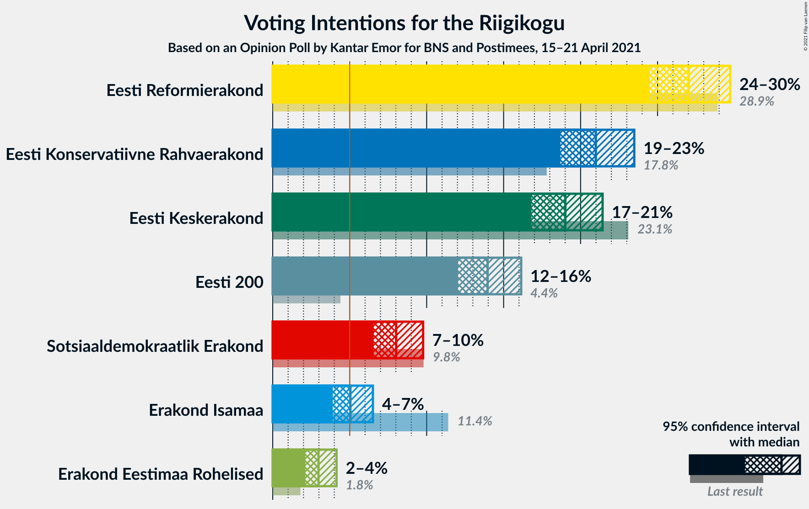

### Confidence Intervals

| Party | Last Result | Poll Result | 80% Confidence Interval | 90% Confidence Interval | 95% Confidence Interval | 99% Confidence Interval |
|:-----:|:-----------:|:-----------:|:-----------------------:|:-----------------------:|:-----------------------:|:-----------------------:|
| Eesti Reformierakond | 28.9% | 27.0% | 25.4–28.8% |24.9–29.3% |24.5–29.7% |23.7–30.6% |
| Eesti Konservatiivne Rahvaerakond | 17.8% | 21.0% | 19.5–22.6% |19.1–23.1% |18.7–23.5% |18.0–24.3% |
| Eesti Keskerakond | 23.1% | 19.0% | 17.6–20.6% |17.1–21.0% |16.8–21.4% |16.1–22.2% |
| Eesti 200 | 4.4% | 14.0% | 12.7–15.4% |12.3–15.8% |12.0–16.1% |11.5–16.8% |
| Sotsiaaldemokraatlik Erakond | 9.8% | 8.0% | 7.1–9.2% |6.8–9.5% |6.6–9.8% |6.1–10.3% |
| Erakond Isamaa | 11.4% | 5.0% | 4.3–6.0% |4.1–6.3% |3.9–6.5% |3.6–7.0% |
| Erakond Eestimaa Rohelised | 1.8% | 3.0% | 2.4–3.7% |2.3–4.0% |2.1–4.1% |1.9–4.5% |

*Note:* The poll result column reflects the actual value used in the calculations. Published results may vary slightly, and in addition be rounded to fewer digits.

## Seats

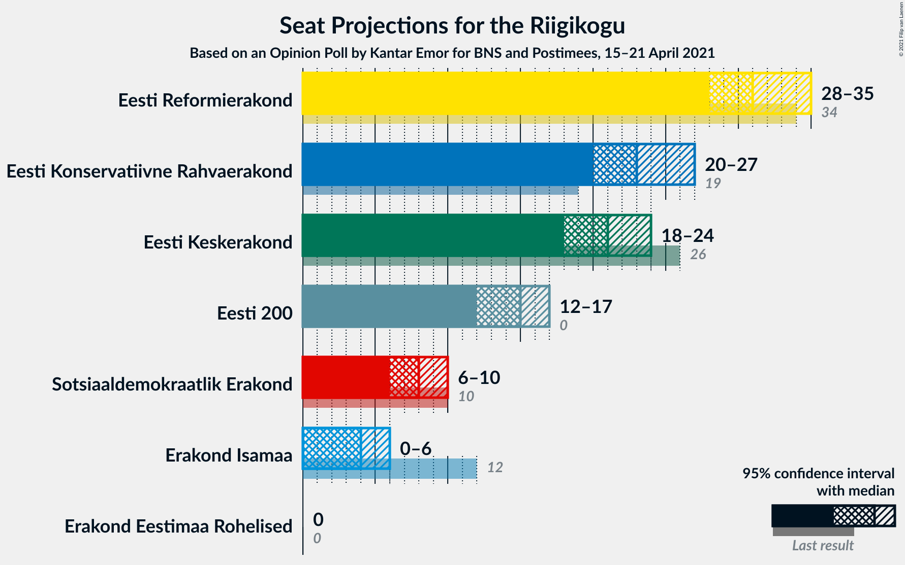

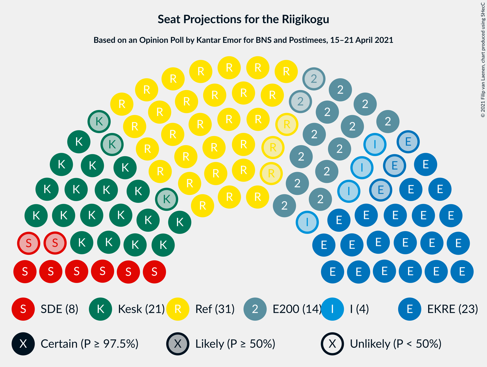

### Confidence Intervals

| Party | Last Result | Median | 80% Confidence Interval | 90% Confidence Interval | 95% Confidence Interval | 99% Confidence Interval |
|:-----:|:-----------:|:------:|:-----------------------:|:-----------------------:|:-----------------------:|:-----------------------:|
| <a href="#eesti-reformierakond">Eesti Reformierakond</a> | 34 | 31 | 29–34 |28–34 |28–35 |27–36 |
| <a href="#eesti-konservatiivne-rahvaerakond">Eesti Konservatiivne Rahvaerakond</a> | 19 | 23 | 21–26 |21–26 |20–27 |19–28 |
| <a href="#eesti-keskerakond">Eesti Keskerakond</a> | 26 | 21 | 19–23 |18–24 |18–24 |17–25 |
| <a href="#eesti-200">Eesti 200</a> | 0 | 15 | 13–16 |13–17 |12–17 |12–18 |
| <a href="#sotsiaaldemokraatlik-erakond">Sotsiaaldemokraatlik Erakond</a> | 10 | 8 | 7–9 |6–9 |6–10 |6–10 |
| <a href="#erakond-isamaa">Erakond Isamaa</a> | 12 | 4 | 0–5 |0–6 |0–6 |0–7 |
| <a href="#erakond-eestimaa-rohelised">Erakond Eestimaa Rohelised</a> | 0 | 0 | 0 |0 |0 |0 |

### Eesti Reformierakond

*For a full overview of the results for this party, see the [Eesti Reformierakond](party-eestireformierakond.html) page.*

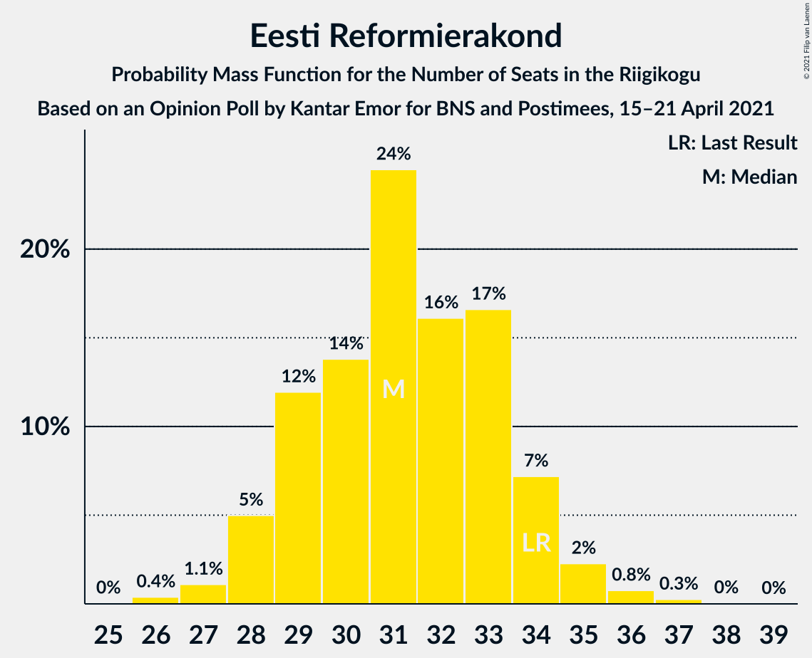

| Number of Seats | Probability | Accumulated | Special Marks |
|:---------------:|:-----------:|:-----------:|:-------------:|
| 25 | 0% | 100% |  |
| 26 | 0.3% | 99.9% |  |
| 27 | 1.5% | 99.6% |  |
| 28 | 4% | 98% |  |
| 29 | 11% | 94% |  |
| 30 | 18% | 83% |  |
| 31 | 22% | 65% | Median |
| 32 | 20% | 43% |  |
| 33 | 13% | 23% |  |
| 34 | 7% | 10% | Last Result |
| 35 | 2% | 4% |  |
| 36 | 1.1% | 1.4% |  |
| 37 | 0.2% | 0.3% |  |
| 38 | 0% | 0.1% |  |
| 39 | 0% | 0% |  |

### Eesti Konservatiivne Rahvaerakond

*For a full overview of the results for this party, see the [Eesti Konservatiivne Rahvaerakond](party-eestikonservatiivnerahvaerakond.html) page.*

| Number of Seats | Probability | Accumulated | Special Marks |
|:---------------:|:-----------:|:-----------:|:-------------:|
| 18 | 0.1% | 100% |  |
| 19 | 0.5% | 99.9% | Last Result |
| 20 | 2% | 99.5% |  |
| 21 | 8% | 97% |  |
| 22 | 18% | 90% |  |
| 23 | 23% | 72% | Median |
| 24 | 22% | 49% |  |
| 25 | 15% | 27% |  |
| 26 | 8% | 11% |  |
| 27 | 2% | 3% |  |
| 28 | 0.6% | 0.8% |  |
| 29 | 0.2% | 0.2% |  |
| 30 | 0% | 0% |  |

### Eesti Keskerakond

*For a full overview of the results for this party, see the [Eesti Keskerakond](party-eestikeskerakond.html) page.*

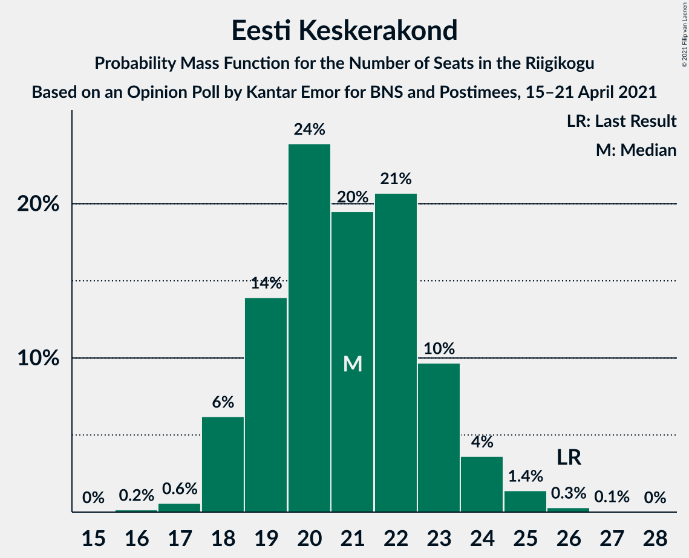

| Number of Seats | Probability | Accumulated | Special Marks |
|:---------------:|:-----------:|:-----------:|:-------------:|
| 16 | 0.1% | 100% |  |
| 17 | 0.9% | 99.9% |  |
| 18 | 4% | 99.0% |  |
| 19 | 12% | 95% |  |
| 20 | 21% | 83% |  |
| 21 | 26% | 62% | Median |
| 22 | 19% | 35% |  |
| 23 | 10% | 16% |  |
| 24 | 5% | 6% |  |
| 25 | 1.1% | 1.4% |  |
| 26 | 0.2% | 0.3% | Last Result |
| 27 | 0% | 0% |  |

### Eesti 200

*For a full overview of the results for this party, see the [Eesti 200](party-eesti200.html) page.*

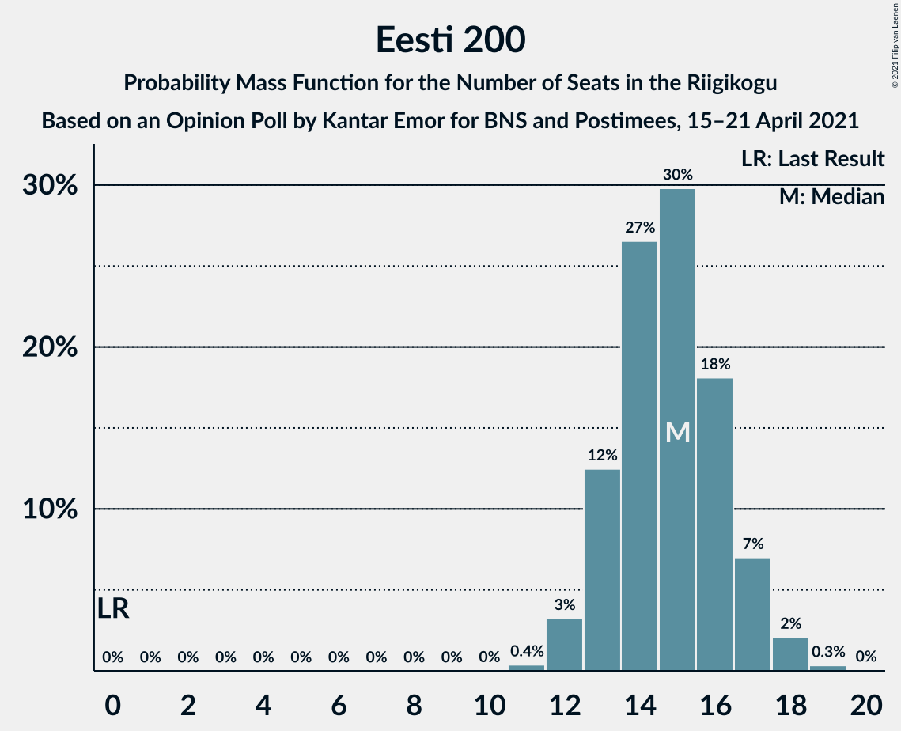

| Number of Seats | Probability | Accumulated | Special Marks |
|:---------------:|:-----------:|:-----------:|:-------------:|
| 0 | 0% | 100% | Last Result |
| 1 | 0% | 100% |  |
| 2 | 0% | 100% |  |
| 3 | 0% | 100% |  |
| 4 | 0% | 100% |  |
| 5 | 0% | 100% |  |
| 6 | 0% | 100% |  |
| 7 | 0% | 100% |  |
| 8 | 0% | 100% |  |
| 9 | 0% | 100% |  |
| 10 | 0% | 100% |  |
| 11 | 0.4% | 100% |  |
| 12 | 3% | 99.6% |  |
| 13 | 12% | 96% |  |
| 14 | 27% | 84% |  |
| 15 | 30% | 57% | Median |
| 16 | 18% | 28% |  |
| 17 | 7% | 9% |  |
| 18 | 2% | 2% |  |
| 19 | 0.3% | 0.4% |  |
| 20 | 0% | 0% |  |

### Sotsiaaldemokraatlik Erakond

*For a full overview of the results for this party, see the [Sotsiaaldemokraatlik Erakond](party-sotsiaaldemokraatlikerakond.html) page.*

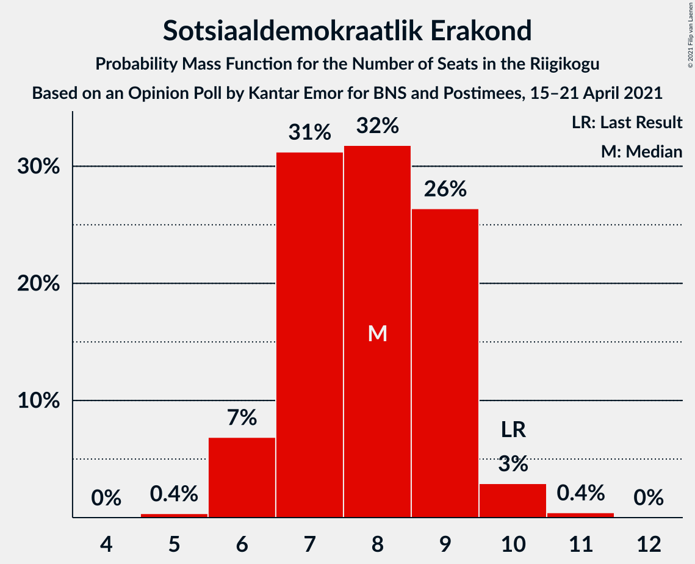

| Number of Seats | Probability | Accumulated | Special Marks |
|:---------------:|:-----------:|:-----------:|:-------------:|
| 5 | 0.4% | 100% |  |
| 6 | 8% | 99.6% |  |
| 7 | 31% | 91% |  |
| 8 | 37% | 60% | Median |
| 9 | 19% | 23% |  |
| 10 | 4% | 4% | Last Result |
| 11 | 0.4% | 0.5% |  |
| 12 | 0% | 0% |  |

### Erakond Isamaa

*For a full overview of the results for this party, see the [Erakond Isamaa](party-erakondisamaa.html) page.*

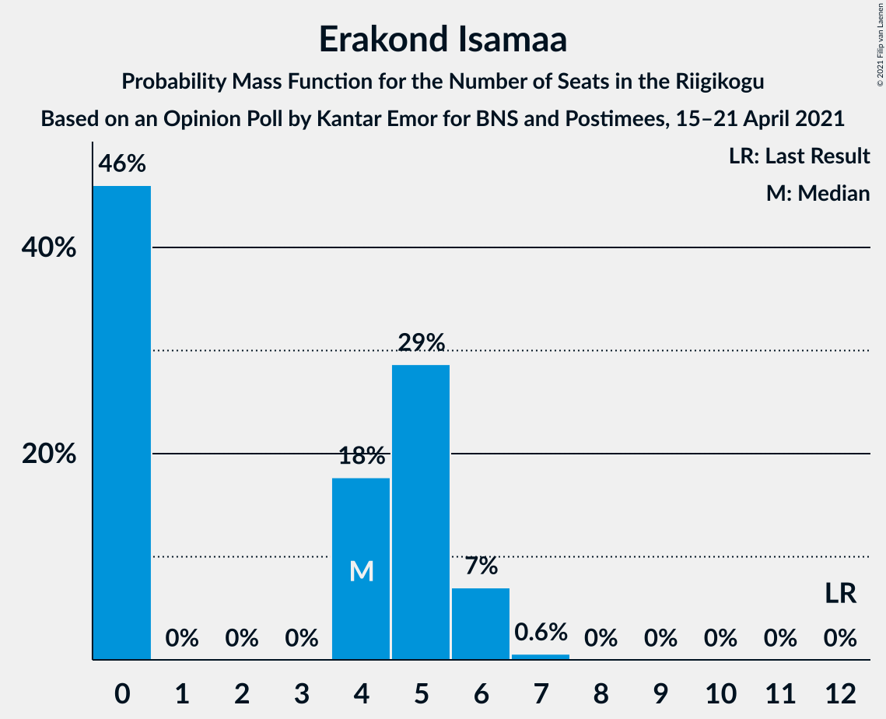

| Number of Seats | Probability | Accumulated | Special Marks |
|:---------------:|:-----------:|:-----------:|:-------------:|
| 0 | 43% | 100% |  |
| 1 | 0% | 57% |  |
| 2 | 0% | 57% |  |
| 3 | 0% | 57% |  |
| 4 | 16% | 57% | Median |
| 5 | 33% | 41% |  |
| 6 | 7% | 7% |  |
| 7 | 0.5% | 0.5% |  |
| 8 | 0% | 0% |  |
| 9 | 0% | 0% |  |
| 10 | 0% | 0% |  |
| 11 | 0% | 0% |  |
| 12 | 0% | 0% | Last Result |

### Erakond Eestimaa Rohelised

*For a full overview of the results for this party, see the [Erakond Eestimaa Rohelised](party-erakondeestimaarohelised.html) page.*

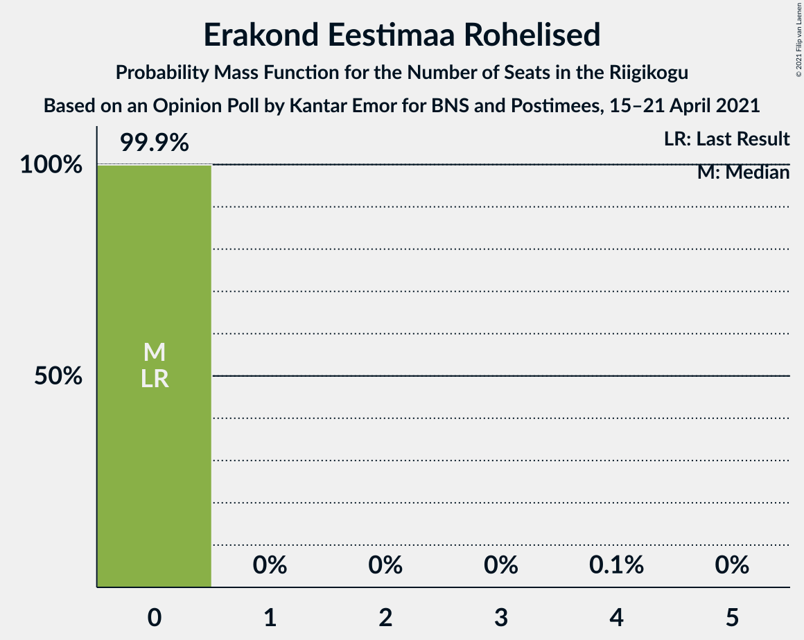

| Number of Seats | Probability | Accumulated | Special Marks |
|:---------------:|:-----------:|:-----------:|:-------------:|
| 0 | 100% | 100% | Last Result, Median |

## Coalitions

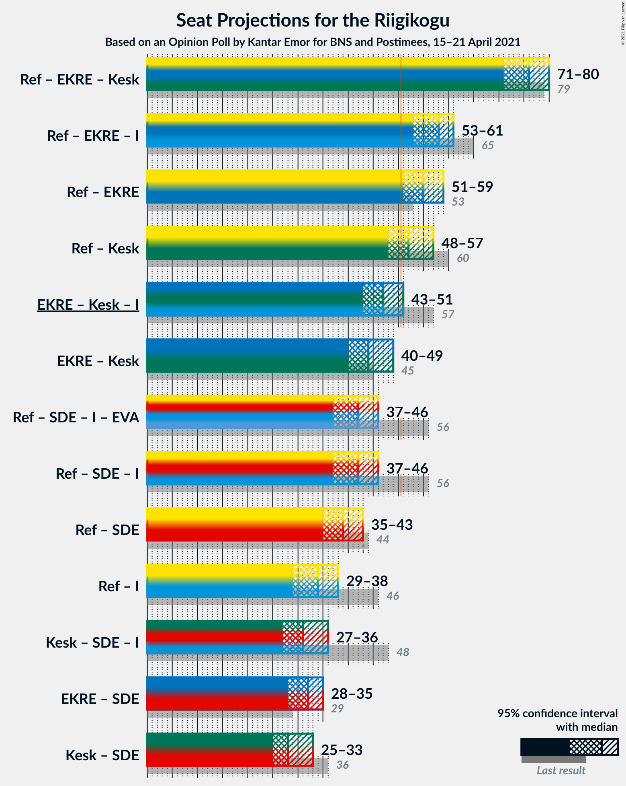

### Confidence Intervals

| Coalition | Last Result | Median | Majority? | 80% Confidence Interval | 90% Confidence Interval | 95% Confidence Interval | 99% Confidence Interval |
|:---------:|:-----------:|:------:|:---------:|:-----------------------:|:-----------------------:|:-----------------------:|:-----------------------:|
| Eesti Reformierakond – Eesti Konservatiivne Rahvaerakond – Eesti Keskerakond | 79 | 76 | 100% | 73–79 | 72–80 | 71–80 | 70–81 |
| Eesti Reformierakond – Eesti Konservatiivne Rahvaerakond – Erakond Isamaa | 65 | 58 | 99.9% | 55–60 | 54–61 | 53–61 | 52–63 |
| Eesti Reformierakond – Eesti Konservatiivne Rahvaerakond | 53 | 55 | 98% | 52–58 | 51–58 | 51–59 | 49–60 |
| Eesti Reformierakond – Eesti Keskerakond | 60 | 52 | 78% | 49–55 | 49–56 | 48–56 | 47–58 |
| Eesti Konservatiivne Rahvaerakond – Eesti Keskerakond – Erakond Isamaa | 57 | 47 | 6% | 44–50 | 44–51 | 43–51 | 42–53 |
| Eesti Konservatiivne Rahvaerakond – Eesti Keskerakond | 45 | 44 | 0.2% | 42–47 | 41–48 | 40–49 | 39–50 |
| Eesti Reformierakond – Sotsiaaldemokraatlik Erakond – Erakond Isamaa | 56 | 42 | 0% | 39–45 | 38–45 | 37–46 | 36–47 |
| Eesti Reformierakond – Sotsiaaldemokraatlik Erakond | 44 | 39 | 0% | 36–42 | 36–42 | 35–43 | 34–44 |
| Eesti Reformierakond – Erakond Isamaa | 46 | 34 | 0% | 31–37 | 30–38 | 29–38 | 28–39 |
| Eesti Keskerakond – Sotsiaaldemokraatlik Erakond – Erakond Isamaa | 48 | 32 | 0% | 28–35 | 28–35 | 27–36 | 26–37 |
| Eesti Konservatiivne Rahvaerakond – Sotsiaaldemokraatlik Erakond | 29 | 31 | 0% | 29–34 | 28–34 | 28–35 | 27–36 |
| Eesti Keskerakond – Sotsiaaldemokraatlik Erakond | 36 | 29 | 0% | 26–31 | 26–32 | 25–32 | 24–34 |

### Eesti Reformierakond – Eesti Konservatiivne Rahvaerakond – Eesti Keskerakond

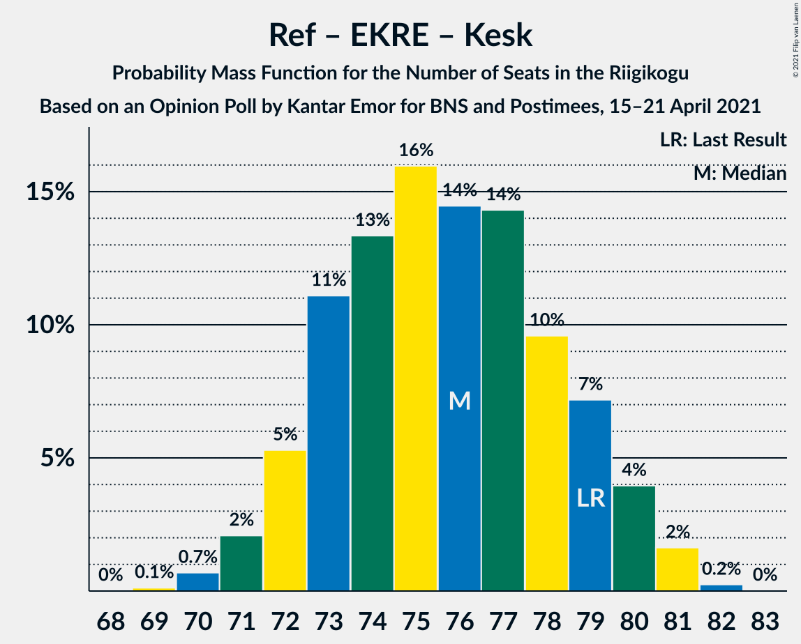

| Number of Seats | Probability | Accumulated | Special Marks |
|:---------------:|:-----------:|:-----------:|:-------------:|
| 69 | 0.1% | 100% |  |
| 70 | 0.7% | 99.9% |  |
| 71 | 2% | 99.2% |  |
| 72 | 5% | 97% |  |
| 73 | 11% | 92% |  |
| 74 | 13% | 81% |  |
| 75 | 16% | 67% | Median |
| 76 | 14% | 51% |  |
| 77 | 14% | 37% |  |
| 78 | 10% | 23% |  |
| 79 | 7% | 13% | Last Result |
| 80 | 4% | 6% |  |
| 81 | 2% | 2% |  |
| 82 | 0.2% | 0.3% |  |
| 83 | 0% | 0% |  |

### Eesti Reformierakond – Eesti Konservatiivne Rahvaerakond – Erakond Isamaa

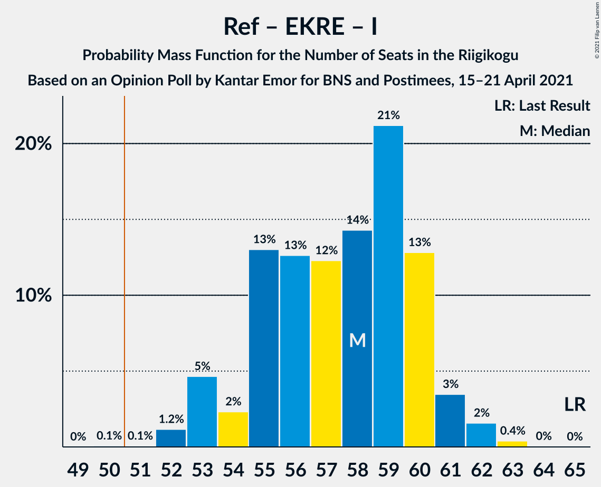

| Number of Seats | Probability | Accumulated | Special Marks |
|:---------------:|:-----------:|:-----------:|:-------------:|
| 50 | 0.1% | 100% |  |
| 51 | 0.1% | 99.9% | Majority |
| 52 | 0.8% | 99.8% |  |
| 53 | 3% | 99.0% |  |
| 54 | 4% | 96% |  |
| 55 | 11% | 92% |  |
| 56 | 13% | 81% |  |
| 57 | 14% | 68% |  |
| 58 | 21% | 53% | Median |
| 59 | 15% | 32% |  |
| 60 | 10% | 17% |  |
| 61 | 5% | 7% |  |
| 62 | 1.4% | 2% |  |
| 63 | 0.5% | 0.6% |  |
| 64 | 0.1% | 0.1% |  |
| 65 | 0% | 0% | Last Result |

### Eesti Reformierakond – Eesti Konservatiivne Rahvaerakond

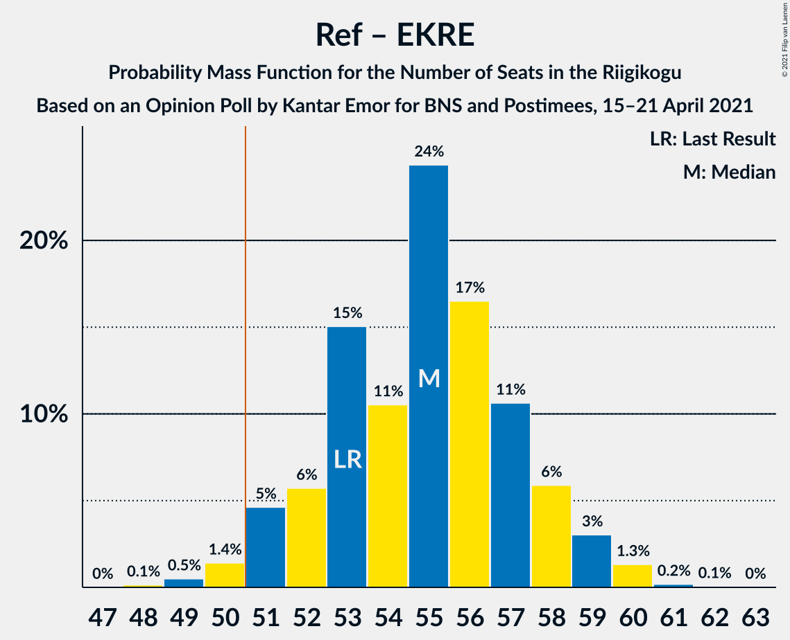

| Number of Seats | Probability | Accumulated | Special Marks |
|:---------------:|:-----------:|:-----------:|:-------------:|
| 48 | 0.2% | 100% |  |
| 49 | 0.4% | 99.8% |  |
| 50 | 2% | 99.4% |  |
| 51 | 5% | 98% | Majority |
| 52 | 6% | 92% |  |
| 53 | 16% | 86% | Last Result |
| 54 | 18% | 70% | Median |
| 55 | 17% | 53% |  |
| 56 | 16% | 36% |  |
| 57 | 8% | 19% |  |
| 58 | 7% | 11% |  |
| 59 | 3% | 4% |  |
| 60 | 1.2% | 2% |  |
| 61 | 0.3% | 0.4% |  |
| 62 | 0.1% | 0.1% |  |
| 63 | 0% | 0% |  |

### Eesti Reformierakond – Eesti Keskerakond

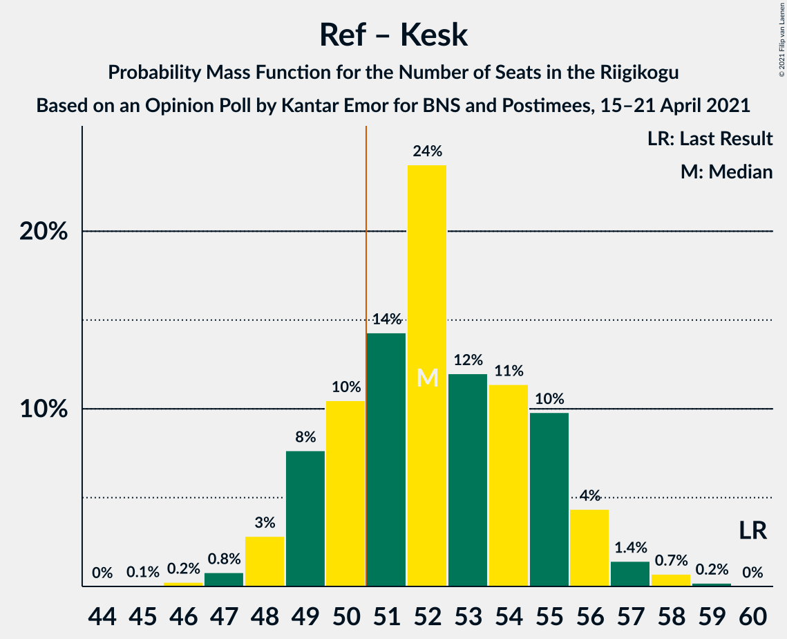

| Number of Seats | Probability | Accumulated | Special Marks |
|:---------------:|:-----------:|:-----------:|:-------------:|
| 45 | 0.1% | 100% |  |
| 46 | 0.2% | 99.9% |  |
| 47 | 0.8% | 99.7% |  |
| 48 | 3% | 98.9% |  |
| 49 | 8% | 96% |  |
| 50 | 10% | 88% |  |
| 51 | 14% | 78% | Majority |
| 52 | 24% | 64% | Median |
| 53 | 12% | 40% |  |
| 54 | 11% | 28% |  |
| 55 | 10% | 17% |  |
| 56 | 4% | 7% |  |
| 57 | 1.4% | 2% |  |
| 58 | 0.7% | 0.9% |  |
| 59 | 0.2% | 0.2% |  |
| 60 | 0% | 0% | Last Result |

### Eesti Konservatiivne Rahvaerakond – Eesti Keskerakond – Erakond Isamaa

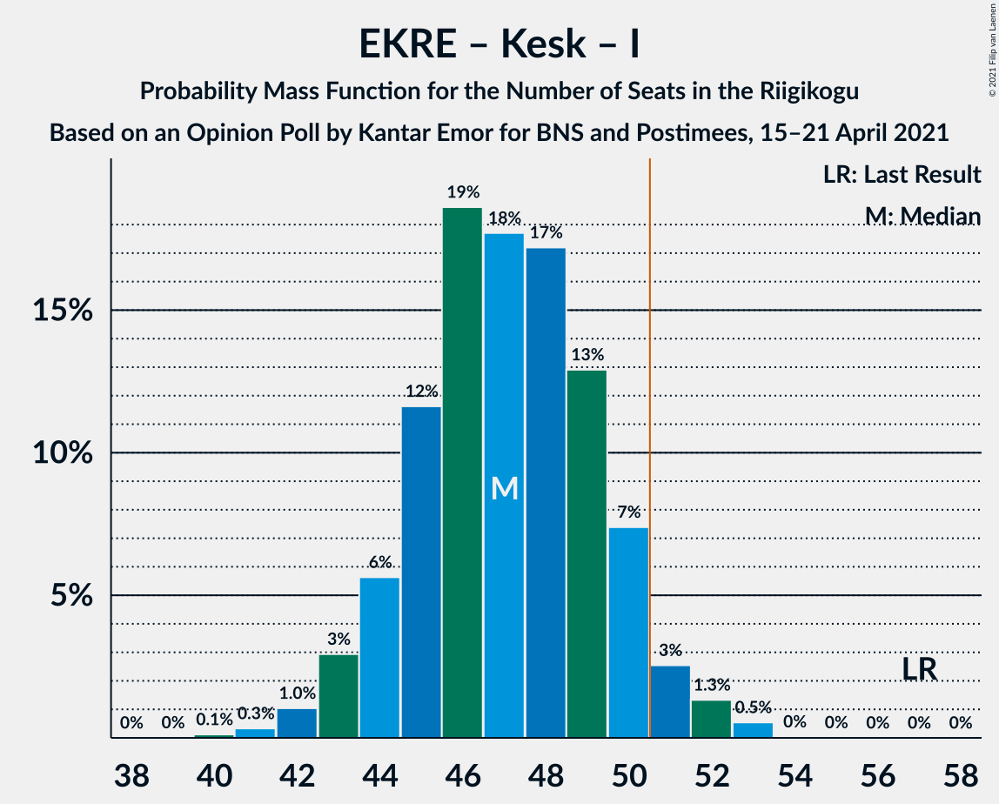

| Number of Seats | Probability | Accumulated | Special Marks |
|:---------------:|:-----------:|:-----------:|:-------------:|
| 40 | 0.1% | 100% |  |
| 41 | 0.3% | 99.9% |  |
| 42 | 1.3% | 99.6% |  |
| 43 | 3% | 98% |  |
| 44 | 7% | 95% |  |
| 45 | 10% | 88% |  |
| 46 | 15% | 78% |  |
| 47 | 17% | 63% |  |
| 48 | 17% | 46% | Median |
| 49 | 13% | 29% |  |
| 50 | 10% | 16% |  |
| 51 | 4% | 6% | Majority |
| 52 | 2% | 2% |  |
| 53 | 0.6% | 0.6% |  |
| 54 | 0.1% | 0.1% |  |
| 55 | 0% | 0% |  |
| 56 | 0% | 0% |  |
| 57 | 0% | 0% | Last Result |

### Eesti Konservatiivne Rahvaerakond – Eesti Keskerakond

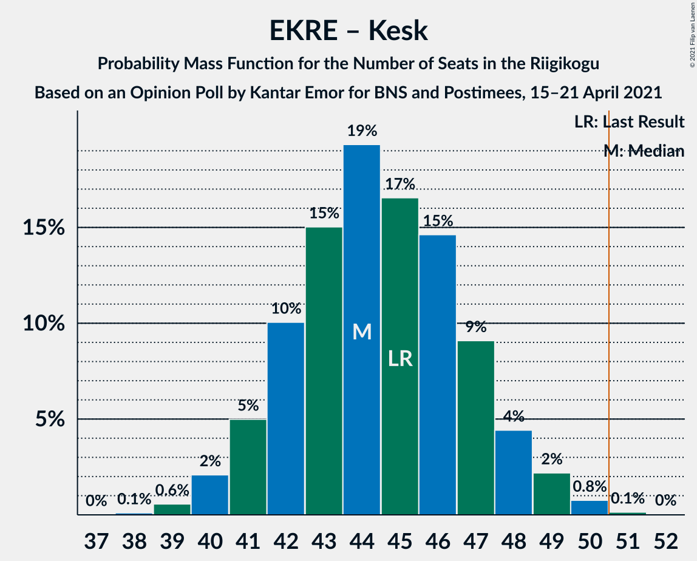

| Number of Seats | Probability | Accumulated | Special Marks |
|:---------------:|:-----------:|:-----------:|:-------------:|
| 38 | 0.1% | 100% |  |
| 39 | 0.6% | 99.9% |  |
| 40 | 2% | 99.3% |  |
| 41 | 5% | 97% |  |
| 42 | 10% | 92% |  |
| 43 | 15% | 82% |  |
| 44 | 19% | 67% | Median |
| 45 | 17% | 48% | Last Result |
| 46 | 15% | 31% |  |
| 47 | 9% | 17% |  |
| 48 | 4% | 8% |  |
| 49 | 2% | 3% |  |
| 50 | 0.8% | 0.9% |  |
| 51 | 0.1% | 0.2% | Majority |
| 52 | 0% | 0% |  |

### Eesti Reformierakond – Sotsiaaldemokraatlik Erakond – Erakond Isamaa

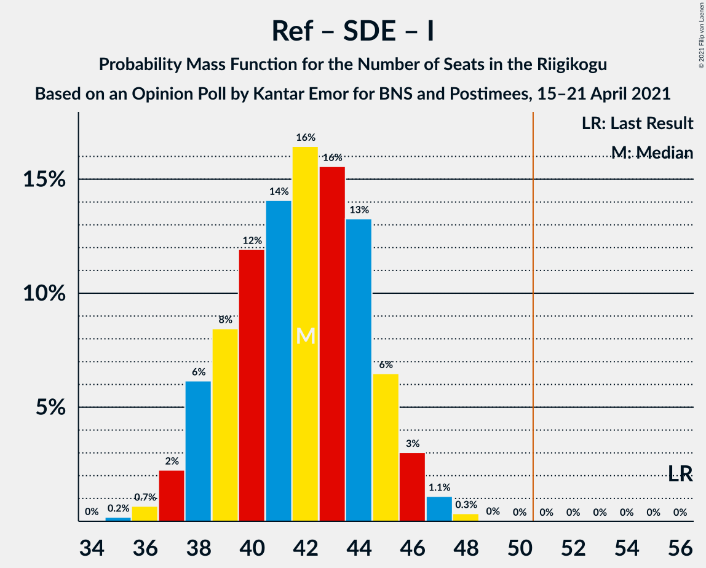

| Number of Seats | Probability | Accumulated | Special Marks |
|:---------------:|:-----------:|:-----------:|:-------------:|
| 35 | 0.2% | 100% |  |
| 36 | 0.7% | 99.8% |  |
| 37 | 2% | 99.1% |  |
| 38 | 6% | 97% |  |
| 39 | 8% | 91% |  |
| 40 | 12% | 82% |  |
| 41 | 14% | 70% |  |
| 42 | 16% | 56% |  |
| 43 | 16% | 40% | Median |
| 44 | 13% | 24% |  |
| 45 | 6% | 11% |  |
| 46 | 3% | 5% |  |
| 47 | 1.1% | 1.5% |  |
| 48 | 0.3% | 0.4% |  |
| 49 | 0% | 0.1% |  |
| 50 | 0% | 0% |  |
| 51 | 0% | 0% | Majority |
| 52 | 0% | 0% |  |
| 53 | 0% | 0% |  |
| 54 | 0% | 0% |  |
| 55 | 0% | 0% |  |
| 56 | 0% | 0% | Last Result |

### Eesti Reformierakond – Sotsiaaldemokraatlik Erakond

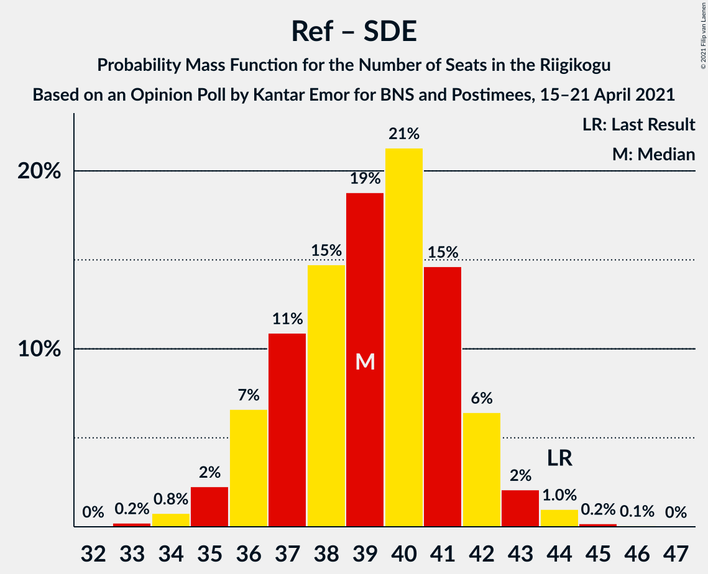

| Number of Seats | Probability | Accumulated | Special Marks |
|:---------------:|:-----------:|:-----------:|:-------------:|
| 33 | 0.2% | 100% |  |
| 34 | 0.9% | 99.8% |  |
| 35 | 2% | 98.9% |  |
| 36 | 7% | 97% |  |
| 37 | 13% | 90% |  |
| 38 | 17% | 77% |  |
| 39 | 19% | 59% | Median |
| 40 | 18% | 40% |  |
| 41 | 10% | 22% |  |
| 42 | 7% | 11% |  |
| 43 | 3% | 4% |  |
| 44 | 1.2% | 2% | Last Result |
| 45 | 0.3% | 0.4% |  |
| 46 | 0.1% | 0.1% |  |
| 47 | 0% | 0% |  |

### Eesti Reformierakond – Erakond Isamaa

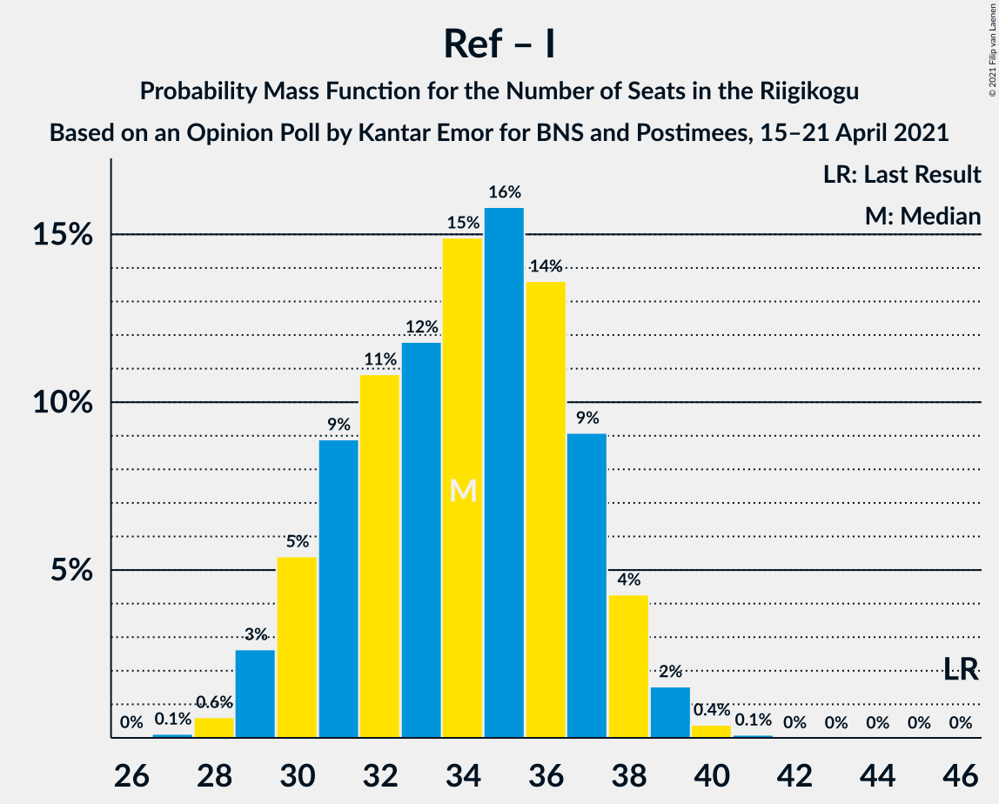

| Number of Seats | Probability | Accumulated | Special Marks |
|:---------------:|:-----------:|:-----------:|:-------------:|
| 27 | 0.1% | 100% |  |
| 28 | 0.6% | 99.9% |  |
| 29 | 3% | 99.2% |  |
| 30 | 5% | 97% |  |
| 31 | 9% | 91% |  |
| 32 | 11% | 82% |  |
| 33 | 12% | 71% |  |
| 34 | 15% | 60% |  |
| 35 | 16% | 45% | Median |
| 36 | 14% | 29% |  |
| 37 | 9% | 15% |  |
| 38 | 4% | 6% |  |
| 39 | 2% | 2% |  |
| 40 | 0.4% | 0.5% |  |
| 41 | 0.1% | 0.1% |  |
| 42 | 0% | 0% |  |
| 43 | 0% | 0% |  |
| 44 | 0% | 0% |  |
| 45 | 0% | 0% |  |
| 46 | 0% | 0% | Last Result |

### Eesti Keskerakond – Sotsiaaldemokraatlik Erakond – Erakond Isamaa

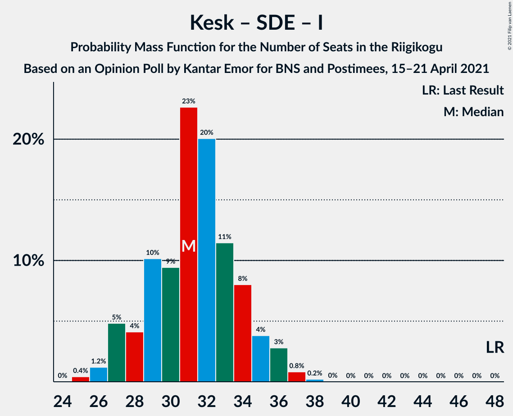

| Number of Seats | Probability | Accumulated | Special Marks |
|:---------------:|:-----------:|:-----------:|:-------------:|
| 25 | 0.2% | 100% |  |
| 26 | 1.0% | 99.8% |  |
| 27 | 3% | 98.8% |  |
| 28 | 6% | 95% |  |
| 29 | 11% | 89% |  |
| 30 | 11% | 78% |  |
| 31 | 15% | 68% |  |
| 32 | 18% | 53% |  |
| 33 | 16% | 35% | Median |
| 34 | 9% | 19% |  |
| 35 | 7% | 10% |  |
| 36 | 2% | 3% |  |
| 37 | 0.8% | 1.0% |  |
| 38 | 0.2% | 0.2% |  |
| 39 | 0% | 0% |  |
| 40 | 0% | 0% |  |
| 41 | 0% | 0% |  |
| 42 | 0% | 0% |  |
| 43 | 0% | 0% |  |
| 44 | 0% | 0% |  |
| 45 | 0% | 0% |  |
| 46 | 0% | 0% |  |
| 47 | 0% | 0% |  |
| 48 | 0% | 0% | Last Result |

### Eesti Konservatiivne Rahvaerakond – Sotsiaaldemokraatlik Erakond

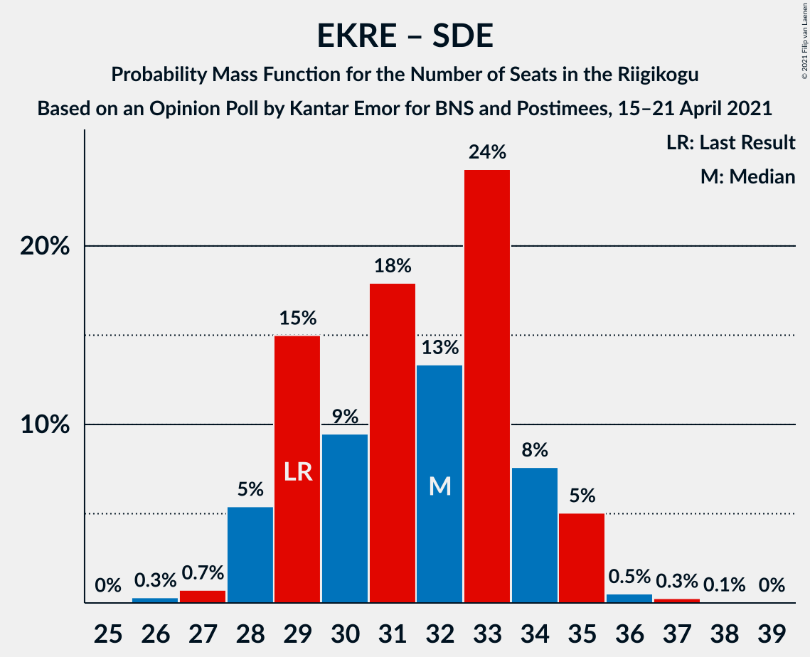

| Number of Seats | Probability | Accumulated | Special Marks |
|:---------------:|:-----------:|:-----------:|:-------------:|
| 26 | 0.3% | 100% |  |
| 27 | 1.3% | 99.6% |  |
| 28 | 4% | 98% |  |
| 29 | 11% | 94% | Last Result |
| 30 | 18% | 83% |  |
| 31 | 22% | 65% | Median |
| 32 | 18% | 43% |  |
| 33 | 14% | 26% |  |
| 34 | 7% | 12% |  |
| 35 | 4% | 5% |  |
| 36 | 0.8% | 1.1% |  |
| 37 | 0.3% | 0.3% |  |
| 38 | 0% | 0.1% |  |
| 39 | 0% | 0% |  |

### Eesti Keskerakond – Sotsiaaldemokraatlik Erakond

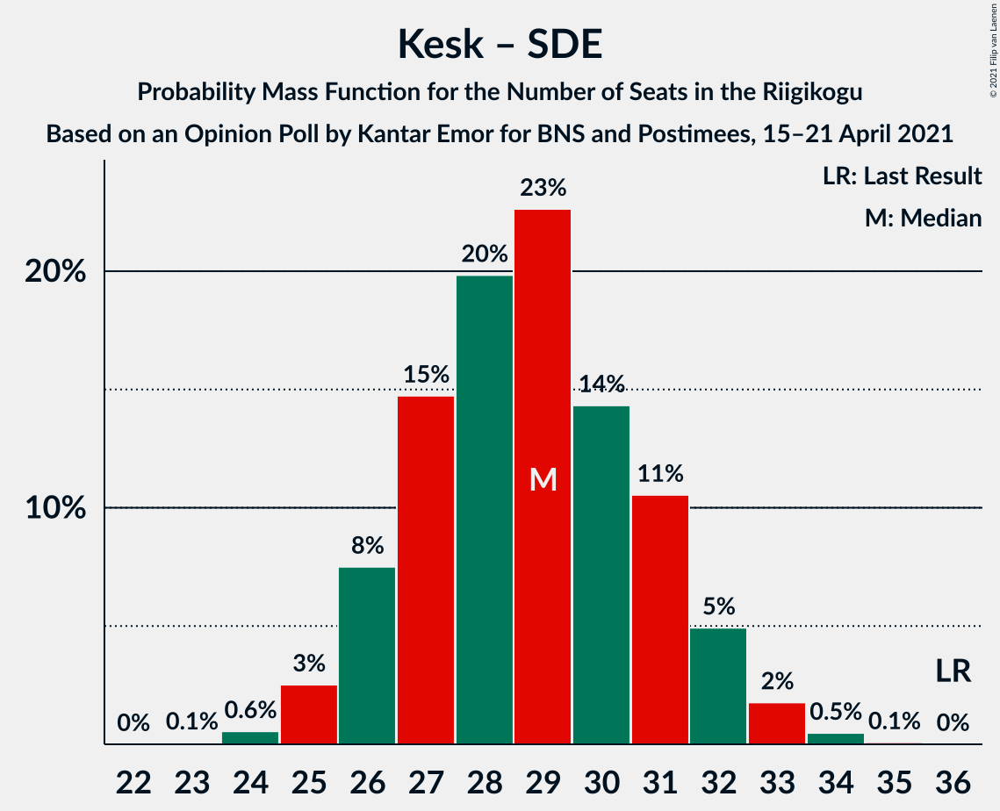

| Number of Seats | Probability | Accumulated | Special Marks |
|:---------------:|:-----------:|:-----------:|:-------------:|
| 23 | 0.1% | 100% |  |
| 24 | 0.6% | 99.9% |  |
| 25 | 3% | 99.4% |  |
| 26 | 8% | 97% |  |
| 27 | 15% | 89% |  |
| 28 | 20% | 75% |  |
| 29 | 23% | 55% | Median |
| 30 | 14% | 32% |  |
| 31 | 11% | 18% |  |
| 32 | 5% | 7% |  |
| 33 | 2% | 2% |  |
| 34 | 0.5% | 0.6% |  |
| 35 | 0.1% | 0.1% |  |
| 36 | 0% | 0% | Last Result |

## Technical Information

### Opinion Poll

+ **Polling firm:** Kantar Emor
+ **Commissioner(s):** BNS and Postimees
+ **Fieldwork period:** 15–21 April 2021

### Calculations

+ **Sample size:** 1110
+ **Simulations done:** 1,048,576
+ **Error estimate:** 0.88%

