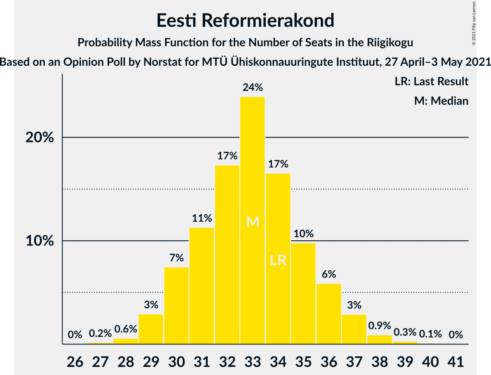
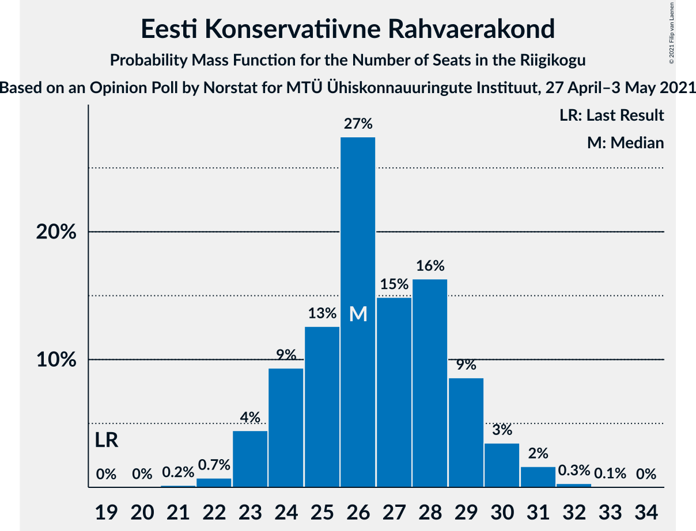
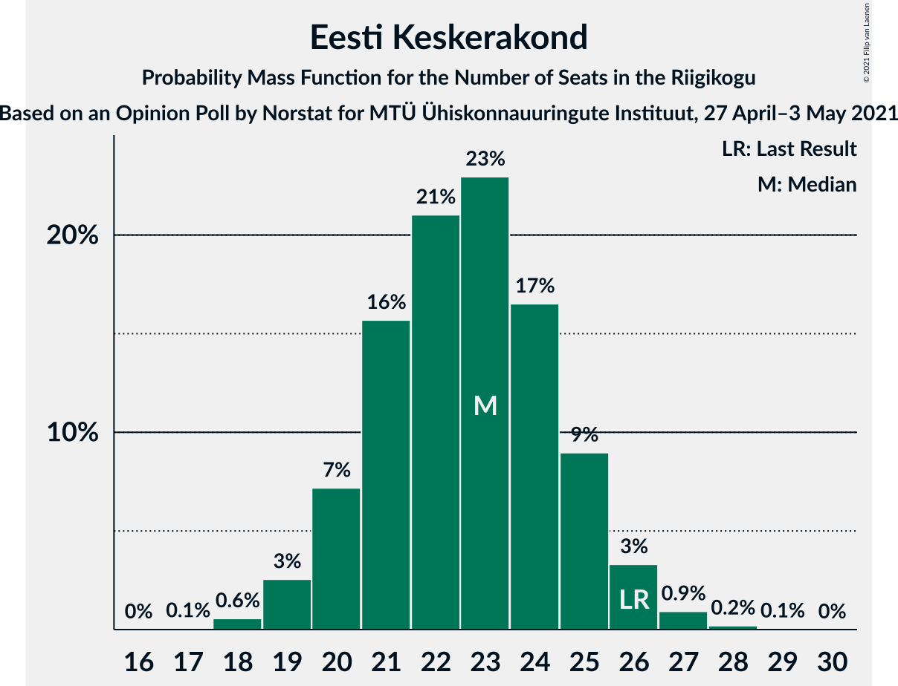
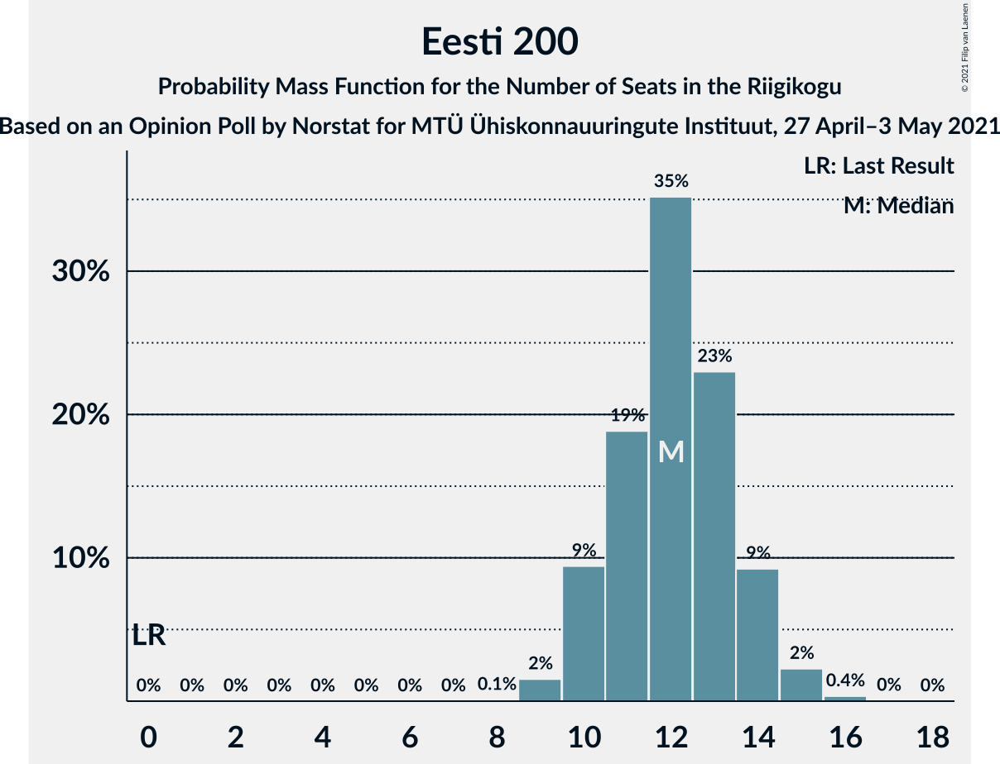
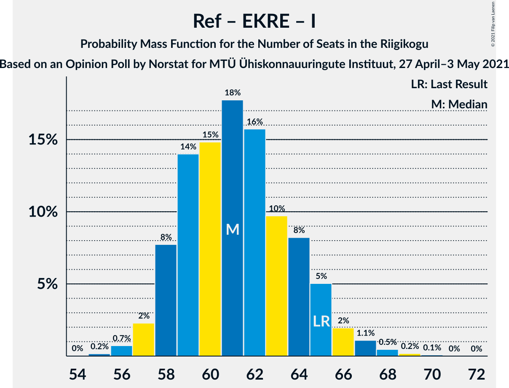

# Opinion Poll by Norstat for MTÜ Ühiskonnauuringute Instituut, 27 April–3 May 2021

<a href="#voting-intentions">Voting Intentions</a> | <a href="#seats">Seats</a> | <a href="#coalitions">Coalitions</a> | <a href="#technical-information">Technical Information</a>

## Voting Intentions

### Confidence Intervals

| Party | Last Result | Poll Result | 80% Confidence Interval | 90% Confidence Interval | 95% Confidence Interval | 99% Confidence Interval |
|:-----:|:-----------:|:-----------:|:-----------------------:|:-----------------------:|:-----------------------:|:-----------------------:|
| Eesti Reformierakond | 28.9% | 29.1% | 27.3–31.0% |26.8–31.5% |26.4–32.0% |25.5–32.9% |
| Eesti Konservatiivne Rahvaerakond | 17.8% | 23.9% | 22.2–25.7% |21.8–26.2% |21.4–26.6% |20.6–27.5% |
| Eesti Keskerakond | 23.1% | 20.7% | 19.1–22.4% |18.7–22.9% |18.3–23.3% |17.6–24.2% |
| Eesti 200 | 4.4% | 11.9% | 10.7–13.3% |10.3–13.7% |10.0–14.1% |9.5–14.8% |
| Sotsiaaldemokraatlik Erakond | 9.8% | 6.0% | 5.1–7.1% |4.9–7.4% |4.7–7.7% |4.3–8.2% |
| Erakond Isamaa | 11.4% | 4.8% | 4.0–5.8% |3.8–6.1% |3.6–6.3% |3.3–6.8% |
| Erakond Eestimaa Rohelised | 1.8% | 1.9% | 1.4–2.6% |1.3–2.8% |1.2–3.0% |1.0–3.3% |

*Note:* The poll result column reflects the actual value used in the calculations. Published results may vary slightly, and in addition be rounded to fewer digits.

## Seats

### Confidence Intervals

| Party | Last Result | Median | 80% Confidence Interval | 90% Confidence Interval | 95% Confidence Interval | 99% Confidence Interval |
|:-----:|:-----------:|:------:|:-----------------------:|:-----------------------:|:-----------------------:|:-----------------------:|
| <a href="#eesti-reformierakond">Eesti Reformierakond</a> | 34 | 33 | 31–36 |30–36 |29–37 |28–39 |
| <a href="#eesti-konservatiivne-rahvaerakond">Eesti Konservatiivne Rahvaerakond</a> | 19 | 26 | 24–30 |23–30 |23–31 |22–32 |
| <a href="#eesti-keskerakond">Eesti Keskerakond</a> | 26 | 22 | 20–25 |19–26 |19–26 |18–28 |
| <a href="#eesti-200">Eesti 200</a> | 0 | 12 | 10–14 |10–14 |9–15 |9–15 |
| <a href="#sotsiaaldemokraatlik-erakond">Sotsiaaldemokraatlik Erakond</a> | 10 | 5 | 4–7 |0–7 |0–7 |0–8 |
| <a href="#erakond-isamaa">Erakond Isamaa</a> | 12 | 0 | 0–5 |0–5 |0–6 |0–6 |
| <a href="#erakond-eestimaa-rohelised">Erakond Eestimaa Rohelised</a> | 0 | 0 | 0 |0 |0 |0 |

### Eesti Reformierakond

*For a full overview of the results for this party, see the [Eesti Reformierakond](party-eestireformierakond.html) page.*

| Number of Seats | Probability | Accumulated | Special Marks |
|:---------------:|:-----------:|:-----------:|:-------------:|
| 27 | 0.1% | 100% |  |
| 28 | 0.9% | 99.9% |  |
| 29 | 2% | 99.0% |  |
| 30 | 6% | 97% |  |
| 31 | 13% | 91% |  |
| 32 | 20% | 78% |  |
| 33 | 21% | 58% | Median |
| 34 | 13% | 37% | Last Result |
| 35 | 13% | 24% |  |
| 36 | 7% | 11% |  |
| 37 | 3% | 4% |  |
| 38 | 0.7% | 1.3% |  |
| 39 | 0.5% | 0.6% |  |
| 40 | 0.1% | 0.1% |  |
| 41 | 0% | 0% |  |

### Eesti Konservatiivne Rahvaerakond

*For a full overview of the results for this party, see the [Eesti Konservatiivne Rahvaerakond](party-eestikonservatiivnerahvaerakond.html) page.*

| Number of Seats | Probability | Accumulated | Special Marks |
|:---------------:|:-----------:|:-----------:|:-------------:|
| 19 | 0% | 100% | Last Result |
| 20 | 0% | 100% |  |
| 21 | 0.2% | 100% |  |
| 22 | 1.0% | 99.8% |  |
| 23 | 8% | 98.8% |  |
| 24 | 12% | 91% |  |
| 25 | 16% | 79% |  |
| 26 | 21% | 63% | Median |
| 27 | 14% | 42% |  |
| 28 | 7% | 28% |  |
| 29 | 10% | 22% |  |
| 30 | 9% | 12% |  |
| 31 | 2% | 3% |  |
| 32 | 0.6% | 0.7% |  |
| 33 | 0.1% | 0.1% |  |
| 34 | 0% | 0% |  |

### Eesti Keskerakond

*For a full overview of the results for this party, see the [Eesti Keskerakond](party-eestikeskerakond.html) page.*

| Number of Seats | Probability | Accumulated | Special Marks |
|:---------------:|:-----------:|:-----------:|:-------------:|
| 17 | 0.1% | 100% |  |
| 18 | 1.0% | 99.9% |  |
| 19 | 5% | 98.9% |  |
| 20 | 9% | 94% |  |
| 21 | 16% | 84% |  |
| 22 | 21% | 68% | Median |
| 23 | 17% | 47% |  |
| 24 | 13% | 30% |  |
| 25 | 11% | 17% |  |
| 26 | 4% | 6% | Last Result |
| 27 | 1.4% | 2% |  |
| 28 | 0.4% | 0.5% |  |
| 29 | 0.1% | 0.2% |  |
| 30 | 0% | 0% |  |

### Eesti 200

*For a full overview of the results for this party, see the [Eesti 200](party-eesti200.html) page.*

| Number of Seats | Probability | Accumulated | Special Marks |
|:---------------:|:-----------:|:-----------:|:-------------:|
| 0 | 0% | 100% | Last Result |
| 1 | 0% | 100% |  |
| 2 | 0% | 100% |  |
| 3 | 0% | 100% |  |
| 4 | 0% | 100% |  |
| 5 | 0% | 100% |  |
| 6 | 0% | 100% |  |
| 7 | 0% | 100% |  |
| 8 | 0.1% | 100% |  |
| 9 | 3% | 99.9% |  |
| 10 | 13% | 97% |  |
| 11 | 18% | 85% |  |
| 12 | 32% | 66% | Median |
| 13 | 17% | 35% |  |
| 14 | 14% | 18% |  |
| 15 | 4% | 4% |  |
| 16 | 0.3% | 0.3% |  |
| 17 | 0% | 0% |  |

### Sotsiaaldemokraatlik Erakond

*For a full overview of the results for this party, see the [Sotsiaaldemokraatlik Erakond](party-sotsiaaldemokraatlikerakond.html) page.*

| Number of Seats | Probability | Accumulated | Special Marks |
|:---------------:|:-----------:|:-----------:|:-------------:|
| 0 | 7% | 100% |  |
| 1 | 0% | 93% |  |
| 2 | 0% | 93% |  |
| 3 | 0% | 93% |  |
| 4 | 6% | 93% |  |
| 5 | 46% | 87% | Median |
| 6 | 28% | 41% |  |
| 7 | 11% | 13% |  |
| 8 | 1.0% | 1.1% |  |
| 9 | 0% | 0.1% |  |
| 10 | 0% | 0% | Last Result |

### Erakond Isamaa

*For a full overview of the results for this party, see the [Erakond Isamaa](party-erakondisamaa.html) page.*

| Number of Seats | Probability | Accumulated | Special Marks |
|:---------------:|:-----------:|:-----------:|:-------------:|
| 0 | 58% | 100% | Median |
| 1 | 0% | 42% |  |
| 2 | 0% | 42% |  |
| 3 | 0% | 42% |  |
| 4 | 19% | 42% |  |
| 5 | 20% | 23% |  |
| 6 | 3% | 3% |  |
| 7 | 0.1% | 0.1% |  |
| 8 | 0% | 0% |  |
| 9 | 0% | 0% |  |
| 10 | 0% | 0% |  |
| 11 | 0% | 0% |  |
| 12 | 0% | 0% | Last Result |

### Erakond Eestimaa Rohelised

*For a full overview of the results for this party, see the [Erakond Eestimaa Rohelised](party-erakondeestimaarohelised.html) page.*

| Number of Seats | Probability | Accumulated | Special Marks |
|:---------------:|:-----------:|:-----------:|:-------------:|
| 0 | 100% | 100% | Last Result, Median |

## Coalitions

### Confidence Intervals

| Coalition | Last Result | Median | Majority? | 80% Confidence Interval | 90% Confidence Interval | 95% Confidence Interval | 99% Confidence Interval |
|:---------:|:-----------:|:------:|:---------:|:-----------------------:|:-----------------------:|:-----------------------:|:-----------------------:|
| Eesti Reformierakond – Eesti Konservatiivne Rahvaerakond – Eesti Keskerakond | 79 | 81 | 100% | 79–86 | 78–86 | 77–88 | 76–90 |
| Eesti Reformierakond – Eesti Konservatiivne Rahvaerakond – Erakond Isamaa | 65 | 61 | 100% | 58–65 | 57–66 | 57–67 | 56–69 |
| Eesti Reformierakond – Eesti Konservatiivne Rahvaerakond | 53 | 59 | 100% | 56–64 | 55–65 | 54–65 | 53–67 |
| Eesti Reformierakond – Eesti Keskerakond | 60 | 55 | 98% | 52–59 | 52–60 | 51–60 | 50–62 |
| Eesti Konservatiivne Rahvaerakond – Eesti Keskerakond – Erakond Isamaa | 57 | 51 | 58% | 48–54 | 47–55 | 46–56 | 45–58 |
| Eesti Konservatiivne Rahvaerakond – Eesti Keskerakond | 45 | 49 | 27% | 46–52 | 45–53 | 44–54 | 43–55 |
| Eesti Reformierakond – Sotsiaaldemokraatlik Erakond – Erakond Isamaa | 56 | 40 | 0% | 37–43 | 36–44 | 35–45 | 33–47 |
| Eesti Reformierakond – Sotsiaaldemokraatlik Erakond | 44 | 38 | 0% | 35–41 | 34–41 | 33–42 | 32–44 |
| Eesti Reformierakond – Erakond Isamaa | 46 | 35 | 0% | 32–38 | 31–39 | 30–40 | 29–42 |
| Eesti Konservatiivne Rahvaerakond – Sotsiaaldemokraatlik Erakond | 29 | 32 | 0% | 29–34 | 28–35 | 27–36 | 24–37 |
| Eesti Keskerakond – Sotsiaaldemokraatlik Erakond – Erakond Isamaa | 48 | 29 | 0% | 26–33 | 25–33 | 24–35 | 21–36 |
| Eesti Keskerakond – Sotsiaaldemokraatlik Erakond | 36 | 28 | 0% | 25–31 | 23–32 | 21–32 | 20–33 |

### Eesti Reformierakond – Eesti Konservatiivne Rahvaerakond – Eesti Keskerakond

| Number of Seats | Probability | Accumulated | Special Marks |
|:---------------:|:-----------:|:-----------:|:-------------:|
| 75 | 0.2% | 100% |  |
| 76 | 0.6% | 99.7% |  |
| 77 | 3% | 99.1% |  |
| 78 | 4% | 96% |  |
| 79 | 13% | 92% | Last Result |
| 80 | 8% | 79% |  |
| 81 | 22% | 71% | Median |
| 82 | 11% | 49% |  |
| 83 | 11% | 39% |  |
| 84 | 9% | 28% |  |
| 85 | 8% | 18% |  |
| 86 | 6% | 10% |  |
| 87 | 0.5% | 4% |  |
| 88 | 2% | 3% |  |
| 89 | 0.8% | 2% |  |
| 90 | 0.4% | 0.9% |  |
| 91 | 0.5% | 0.5% |  |
| 92 | 0% | 0% |  |

### Eesti Reformierakond – Eesti Konservatiivne Rahvaerakond – Erakond Isamaa

| Number of Seats | Probability | Accumulated | Special Marks |
|:---------------:|:-----------:|:-----------:|:-------------:|
| 55 | 0.3% | 100% |  |
| 56 | 2% | 99.7% |  |
| 57 | 7% | 98% |  |
| 58 | 12% | 91% |  |
| 59 | 12% | 79% | Median |
| 60 | 11% | 67% |  |
| 61 | 6% | 55% |  |
| 62 | 10% | 49% |  |
| 63 | 10% | 39% |  |
| 64 | 14% | 29% |  |
| 65 | 9% | 15% | Last Result |
| 66 | 2% | 6% |  |
| 67 | 2% | 4% |  |
| 68 | 0.8% | 2% |  |
| 69 | 0.5% | 0.9% |  |
| 70 | 0.3% | 0.3% |  |
| 71 | 0% | 0% |  |

### Eesti Reformierakond – Eesti Konservatiivne Rahvaerakond

| Number of Seats | Probability | Accumulated | Special Marks |
|:---------------:|:-----------:|:-----------:|:-------------:|
| 52 | 0.2% | 100% |  |
| 53 | 0.5% | 99.7% | Last Result |
| 54 | 3% | 99.2% |  |
| 55 | 3% | 97% |  |
| 56 | 7% | 94% |  |
| 57 | 10% | 86% |  |
| 58 | 16% | 76% |  |
| 59 | 17% | 60% | Median |
| 60 | 15% | 43% |  |
| 61 | 8% | 29% |  |
| 62 | 3% | 20% |  |
| 63 | 6% | 17% |  |
| 64 | 6% | 12% |  |
| 65 | 3% | 5% |  |
| 66 | 0.6% | 2% |  |
| 67 | 1.3% | 2% |  |
| 68 | 0.2% | 0.2% |  |
| 69 | 0.1% | 0.1% |  |
| 70 | 0% | 0% |  |

### Eesti Reformierakond – Eesti Keskerakond

| Number of Seats | Probability | Accumulated | Special Marks |
|:---------------:|:-----------:|:-----------:|:-------------:|
| 48 | 0.1% | 100% |  |
| 49 | 0.4% | 99.9% |  |
| 50 | 2% | 99.6% |  |
| 51 | 3% | 98% | Majority |
| 52 | 7% | 95% |  |
| 53 | 6% | 88% |  |
| 54 | 17% | 82% |  |
| 55 | 17% | 65% | Median |
| 56 | 14% | 48% |  |
| 57 | 13% | 34% |  |
| 58 | 11% | 22% |  |
| 59 | 5% | 11% |  |
| 60 | 3% | 5% | Last Result |
| 61 | 1.1% | 2% |  |
| 62 | 0.7% | 1.1% |  |
| 63 | 0.2% | 0.4% |  |
| 64 | 0.1% | 0.2% |  |
| 65 | 0% | 0% |  |

### Eesti Konservatiivne Rahvaerakond – Eesti Keskerakond – Erakond Isamaa

| Number of Seats | Probability | Accumulated | Special Marks |
|:---------------:|:-----------:|:-----------:|:-------------:|
| 44 | 0.2% | 100% |  |
| 45 | 0.6% | 99.8% |  |
| 46 | 3% | 99.1% |  |
| 47 | 3% | 97% |  |
| 48 | 11% | 94% | Median |
| 49 | 13% | 83% |  |
| 50 | 12% | 70% |  |
| 51 | 24% | 58% | Majority |
| 52 | 14% | 34% |  |
| 53 | 7% | 20% |  |
| 54 | 7% | 13% |  |
| 55 | 3% | 6% |  |
| 56 | 1.2% | 3% |  |
| 57 | 1.1% | 2% | Last Result |
| 58 | 0.7% | 0.7% |  |
| 59 | 0% | 0.1% |  |
| 60 | 0% | 0% |  |

### Eesti Konservatiivne Rahvaerakond – Eesti Keskerakond

| Number of Seats | Probability | Accumulated | Special Marks |
|:---------------:|:-----------:|:-----------:|:-------------:|
| 42 | 0.2% | 100% |  |
| 43 | 0.5% | 99.7% |  |
| 44 | 2% | 99.2% |  |
| 45 | 4% | 97% | Last Result |
| 46 | 10% | 93% |  |
| 47 | 11% | 83% |  |
| 48 | 18% | 72% | Median |
| 49 | 14% | 53% |  |
| 50 | 12% | 39% |  |
| 51 | 15% | 27% | Majority |
| 52 | 5% | 12% |  |
| 53 | 3% | 7% |  |
| 54 | 2% | 4% |  |
| 55 | 1.2% | 2% |  |
| 56 | 0.2% | 0.4% |  |
| 57 | 0.1% | 0.1% |  |
| 58 | 0% | 0% |  |

### Eesti Reformierakond – Sotsiaaldemokraatlik Erakond – Erakond Isamaa

| Number of Seats | Probability | Accumulated | Special Marks |
|:---------------:|:-----------:|:-----------:|:-------------:|
| 32 | 0.1% | 100% |  |
| 33 | 0.5% | 99.9% |  |
| 34 | 1.1% | 99.4% |  |
| 35 | 2% | 98% |  |
| 36 | 4% | 97% |  |
| 37 | 10% | 93% |  |
| 38 | 12% | 83% | Median |
| 39 | 11% | 71% |  |
| 40 | 17% | 60% |  |
| 41 | 14% | 43% |  |
| 42 | 11% | 29% |  |
| 43 | 9% | 18% |  |
| 44 | 4% | 9% |  |
| 45 | 3% | 5% |  |
| 46 | 1.4% | 2% |  |
| 47 | 0.4% | 0.5% |  |
| 48 | 0.1% | 0.1% |  |
| 49 | 0% | 0% |  |
| 50 | 0% | 0% |  |
| 51 | 0% | 0% | Majority |
| 52 | 0% | 0% |  |
| 53 | 0% | 0% |  |
| 54 | 0% | 0% |  |
| 55 | 0% | 0% |  |
| 56 | 0% | 0% | Last Result |

### Eesti Reformierakond – Sotsiaaldemokraatlik Erakond

| Number of Seats | Probability | Accumulated | Special Marks |
|:---------------:|:-----------:|:-----------:|:-------------:|
| 30 | 0.1% | 100% |  |
| 31 | 0.1% | 99.8% |  |
| 32 | 0.6% | 99.8% |  |
| 33 | 2% | 99.1% |  |
| 34 | 3% | 97% |  |
| 35 | 4% | 94% |  |
| 36 | 9% | 90% |  |
| 37 | 20% | 81% |  |
| 38 | 19% | 61% | Median |
| 39 | 13% | 42% |  |
| 40 | 15% | 29% |  |
| 41 | 9% | 14% |  |
| 42 | 3% | 5% |  |
| 43 | 1.1% | 2% |  |
| 44 | 0.6% | 0.9% | Last Result |
| 45 | 0.2% | 0.3% |  |
| 46 | 0% | 0% |  |

### Eesti Reformierakond – Erakond Isamaa

| Number of Seats | Probability | Accumulated | Special Marks |
|:---------------:|:-----------:|:-----------:|:-------------:|
| 28 | 0.2% | 100% |  |
| 29 | 0.6% | 99.8% |  |
| 30 | 2% | 99.2% |  |
| 31 | 7% | 97% |  |
| 32 | 11% | 90% |  |
| 33 | 11% | 79% | Median |
| 34 | 11% | 68% |  |
| 35 | 15% | 57% |  |
| 36 | 13% | 42% |  |
| 37 | 11% | 29% |  |
| 38 | 10% | 18% |  |
| 39 | 5% | 9% |  |
| 40 | 3% | 4% |  |
| 41 | 0.6% | 1.4% |  |
| 42 | 0.7% | 0.7% |  |
| 43 | 0.1% | 0.1% |  |
| 44 | 0% | 0% |  |
| 45 | 0% | 0% |  |
| 46 | 0% | 0% | Last Result |

### Eesti Konservatiivne Rahvaerakond – Sotsiaaldemokraatlik Erakond

| Number of Seats | Probability | Accumulated | Special Marks |
|:---------------:|:-----------:|:-----------:|:-------------:|
| 23 | 0.1% | 100% |  |
| 24 | 0.5% | 99.9% |  |
| 25 | 0.2% | 99.4% |  |
| 26 | 0.7% | 99.2% |  |
| 27 | 1.5% | 98% |  |
| 28 | 5% | 97% |  |
| 29 | 9% | 92% | Last Result |
| 30 | 16% | 83% |  |
| 31 | 17% | 67% | Median |
| 32 | 20% | 50% |  |
| 33 | 10% | 30% |  |
| 34 | 11% | 20% |  |
| 35 | 7% | 10% |  |
| 36 | 2% | 3% |  |
| 37 | 0.7% | 1.0% |  |
| 38 | 0.3% | 0.3% |  |
| 39 | 0% | 0% |  |

### Eesti Keskerakond – Sotsiaaldemokraatlik Erakond – Erakond Isamaa

| Number of Seats | Probability | Accumulated | Special Marks |
|:---------------:|:-----------:|:-----------:|:-------------:|
| 20 | 0.2% | 100% |  |
| 21 | 1.0% | 99.8% |  |
| 22 | 0.4% | 98.8% |  |
| 23 | 0.7% | 98% |  |
| 24 | 0.7% | 98% |  |
| 25 | 4% | 97% |  |
| 26 | 6% | 93% |  |
| 27 | 9% | 87% | Median |
| 28 | 7% | 78% |  |
| 29 | 24% | 72% |  |
| 30 | 10% | 47% |  |
| 31 | 13% | 37% |  |
| 32 | 12% | 24% |  |
| 33 | 7% | 12% |  |
| 34 | 2% | 5% |  |
| 35 | 2% | 3% |  |
| 36 | 0.5% | 0.7% |  |
| 37 | 0.2% | 0.2% |  |
| 38 | 0% | 0% |  |
| 39 | 0% | 0% |  |
| 40 | 0% | 0% |  |
| 41 | 0% | 0% |  |
| 42 | 0% | 0% |  |
| 43 | 0% | 0% |  |
| 44 | 0% | 0% |  |
| 45 | 0% | 0% |  |
| 46 | 0% | 0% |  |
| 47 | 0% | 0% |  |
| 48 | 0% | 0% | Last Result |

### Eesti Keskerakond – Sotsiaaldemokraatlik Erakond

| Number of Seats | Probability | Accumulated | Special Marks |
|:---------------:|:-----------:|:-----------:|:-------------:|
| 19 | 0% | 100% |  |
| 20 | 1.0% | 99.9% |  |
| 21 | 2% | 99.0% |  |
| 22 | 1.0% | 97% |  |
| 23 | 2% | 96% |  |
| 24 | 4% | 94% |  |
| 25 | 11% | 90% |  |
| 26 | 11% | 79% |  |
| 27 | 17% | 69% | Median |
| 28 | 10% | 52% |  |
| 29 | 20% | 42% |  |
| 30 | 8% | 21% |  |
| 31 | 7% | 13% |  |
| 32 | 5% | 6% |  |
| 33 | 0.3% | 0.6% |  |
| 34 | 0.2% | 0.2% |  |
| 35 | 0% | 0% |  |
| 36 | 0% | 0% | Last Result |

## Technical Information

### Opinion Poll

+ **Polling firm:** Norstat
+ **Commissioner(s):** MTÜ Ühiskonnauuringute Instituut
+ **Fieldwork period:** 27 April–3 May 2021

### Calculations

+ **Sample size:** 1000
+ **Simulations done:** 131,072
+ **Error estimate:** 3.20%

