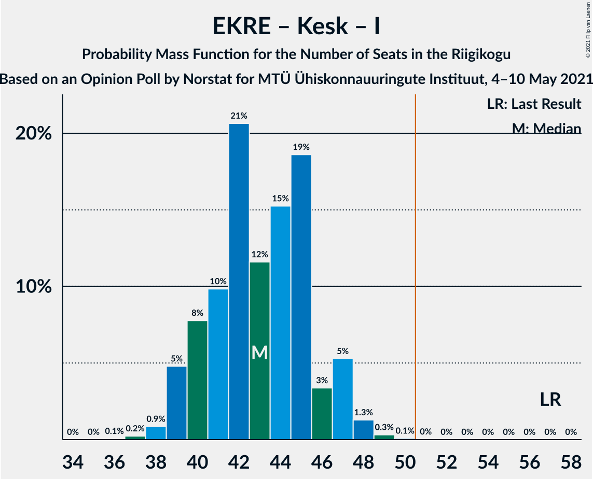

# Opinion Poll by Norstat for MTÜ Ühiskonnauuringute Instituut, 4–10 May 2021

<a href="#voting-intentions">Voting Intentions</a> | <a href="#seats">Seats</a> | <a href="#coalitions">Coalitions</a> | <a href="#technical-information">Technical Information</a>

## Voting Intentions

### Confidence Intervals

| Party | Last Result | Poll Result | 80% Confidence Interval | 90% Confidence Interval | 95% Confidence Interval | 99% Confidence Interval |
|:-----:|:-----------:|:-----------:|:-----------------------:|:-----------------------:|:-----------------------:|:-----------------------:|
| Eesti Reformierakond | 28.9% | 30.4% | 28.6–32.3% |28.1–32.9% |27.6–33.3% |26.8–34.3% |
| Eesti Konservatiivne Rahvaerakond | 17.8% | 20.5% | 18.9–22.2% |18.5–22.7% |18.1–23.1% |17.4–24.0% |
| Eesti Keskerakond | 23.1% | 18.7% | 17.2–20.4% |16.8–20.8% |16.4–21.2% |15.7–22.1% |
| Eesti 200 | 4.4% | 15.2% | 13.8–16.8% |13.4–17.2% |13.1–17.6% |12.5–18.3% |
| Sotsiaaldemokraatlik Erakond | 9.8% | 8.4% | 7.4–9.6% |7.1–10.0% |6.8–10.3% |6.4–10.9% |
| Erakond Isamaa | 11.4% | 4.4% | 3.7–5.3% |3.5–5.6% |3.3–5.9% |3.0–6.4% |
| Erakond Eestimaa Rohelised | 1.8% | 1.4% | 1.0–2.0% |0.9–2.2% |0.8–2.3% |0.7–2.7% |

*Note:* The poll result column reflects the actual value used in the calculations. Published results may vary slightly, and in addition be rounded to fewer digits.

## Seats

### Confidence Intervals

| Party | Last Result | Median | 80% Confidence Interval | 90% Confidence Interval | 95% Confidence Interval | 99% Confidence Interval |
|:-----:|:-----------:|:------:|:-----------------------:|:-----------------------:|:-----------------------:|:-----------------------:|
| <a href="#eesti-reformierakond">Eesti Reformierakond</a> | 34 | 34 | 32–37 |31–37 |31–38 |30–39 |
| <a href="#eesti-konservatiivne-rahvaerakond">Eesti Konservatiivne Rahvaerakond</a> | 19 | 22 | 20–24 |20–25 |19–26 |18–26 |
| <a href="#eesti-keskerakond">Eesti Keskerakond</a> | 26 | 20 | 18–22 |17–22 |17–23 |16–24 |
| <a href="#eesti-200">Eesti 200</a> | 0 | 16 | 14–17 |14–18 |13–19 |12–19 |
| <a href="#sotsiaaldemokraatlik-erakond">Sotsiaaldemokraatlik Erakond</a> | 10 | 8 | 7–9 |6–10 |6–10 |6–10 |
| <a href="#erakond-isamaa">Erakond Isamaa</a> | 12 | 0 | 0–4 |0–5 |0–5 |0–6 |
| <a href="#erakond-eestimaa-rohelised">Erakond Eestimaa Rohelised</a> | 0 | 0 | 0 |0 |0 |0 |

### Eesti Reformierakond

*For a full overview of the results for this party, see the [Eesti Reformierakond](party-eestireformierakond.html) page.*

| Number of Seats | Probability | Accumulated | Special Marks |
|:---------------:|:-----------:|:-----------:|:-------------:|
| 28 | 0.1% | 100% |  |
| 29 | 0.4% | 99.9% |  |
| 30 | 0.8% | 99.5% |  |
| 31 | 4% | 98.7% |  |
| 32 | 10% | 95% |  |
| 33 | 29% | 85% |  |
| 34 | 10% | 56% | Last Result, Median |
| 35 | 10% | 46% |  |
| 36 | 20% | 36% |  |
| 37 | 12% | 16% |  |
| 38 | 3% | 4% |  |
| 39 | 0.7% | 1.0% |  |
| 40 | 0.3% | 0.3% |  |
| 41 | 0% | 0.1% |  |
| 42 | 0% | 0% |  |

### Eesti Konservatiivne Rahvaerakond

*For a full overview of the results for this party, see the [Eesti Konservatiivne Rahvaerakond](party-eestikonservatiivnerahvaerakond.html) page.*

| Number of Seats | Probability | Accumulated | Special Marks |
|:---------------:|:-----------:|:-----------:|:-------------:|
| 17 | 0.2% | 100% |  |
| 18 | 0.6% | 99.8% |  |
| 19 | 4% | 99.2% | Last Result |
| 20 | 10% | 95% |  |
| 21 | 15% | 85% |  |
| 22 | 39% | 70% | Median |
| 23 | 14% | 31% |  |
| 24 | 8% | 17% |  |
| 25 | 5% | 9% |  |
| 26 | 4% | 4% |  |
| 27 | 0.4% | 0.5% |  |
| 28 | 0% | 0.1% |  |
| 29 | 0% | 0% |  |

### Eesti Keskerakond

*For a full overview of the results for this party, see the [Eesti Keskerakond](party-eestikeskerakond.html) page.*

| Number of Seats | Probability | Accumulated | Special Marks |
|:---------------:|:-----------:|:-----------:|:-------------:|
| 15 | 0.1% | 100% |  |
| 16 | 0.5% | 99.9% |  |
| 17 | 5% | 99.4% |  |
| 18 | 10% | 94% |  |
| 19 | 29% | 84% |  |
| 20 | 27% | 55% | Median |
| 21 | 13% | 28% |  |
| 22 | 11% | 15% |  |
| 23 | 3% | 4% |  |
| 24 | 0.8% | 1.0% |  |
| 25 | 0.2% | 0.2% |  |
| 26 | 0% | 0% | Last Result |

### Eesti 200

*For a full overview of the results for this party, see the [Eesti 200](party-eesti200.html) page.*

| Number of Seats | Probability | Accumulated | Special Marks |
|:---------------:|:-----------:|:-----------:|:-------------:|
| 0 | 0% | 100% | Last Result |
| 1 | 0% | 100% |  |
| 2 | 0% | 100% |  |
| 3 | 0% | 100% |  |
| 4 | 0% | 100% |  |
| 5 | 0% | 100% |  |
| 6 | 0% | 100% |  |
| 7 | 0% | 100% |  |
| 8 | 0% | 100% |  |
| 9 | 0% | 100% |  |
| 10 | 0% | 100% |  |
| 11 | 0% | 100% |  |
| 12 | 0.5% | 100% |  |
| 13 | 4% | 99.5% |  |
| 14 | 14% | 95% |  |
| 15 | 26% | 81% |  |
| 16 | 29% | 55% | Median |
| 17 | 16% | 26% |  |
| 18 | 5% | 10% |  |
| 19 | 4% | 4% |  |
| 20 | 0.3% | 0.4% |  |
| 21 | 0% | 0% |  |

### Sotsiaaldemokraatlik Erakond

*For a full overview of the results for this party, see the [Sotsiaaldemokraatlik Erakond](party-sotsiaaldemokraatlikerakond.html) page.*

| Number of Seats | Probability | Accumulated | Special Marks |
|:---------------:|:-----------:|:-----------:|:-------------:|
| 5 | 0.3% | 100% |  |
| 6 | 6% | 99.7% |  |
| 7 | 33% | 94% |  |
| 8 | 35% | 61% | Median |
| 9 | 20% | 27% |  |
| 10 | 6% | 6% | Last Result |
| 11 | 0.4% | 0.5% |  |
| 12 | 0% | 0% |  |

### Erakond Isamaa

*For a full overview of the results for this party, see the [Erakond Isamaa](party-erakondisamaa.html) page.*

| Number of Seats | Probability | Accumulated | Special Marks |
|:---------------:|:-----------:|:-----------:|:-------------:|
| 0 | 74% | 100% | Median |
| 1 | 0% | 26% |  |
| 2 | 0% | 26% |  |
| 3 | 0% | 26% |  |
| 4 | 17% | 26% |  |
| 5 | 9% | 9% |  |
| 6 | 0.5% | 0.5% |  |
| 7 | 0% | 0% |  |
| 8 | 0% | 0% |  |
| 9 | 0% | 0% |  |
| 10 | 0% | 0% |  |
| 11 | 0% | 0% |  |
| 12 | 0% | 0% | Last Result |

### Erakond Eestimaa Rohelised

*For a full overview of the results for this party, see the [Erakond Eestimaa Rohelised](party-erakondeestimaarohelised.html) page.*

| Number of Seats | Probability | Accumulated | Special Marks |
|:---------------:|:-----------:|:-----------:|:-------------:|
| 0 | 100% | 100% | Last Result, Median |

## Coalitions

### Confidence Intervals

| Coalition | Last Result | Median | Majority? | 80% Confidence Interval | 90% Confidence Interval | 95% Confidence Interval | 99% Confidence Interval |
|:---------:|:-----------:|:------:|:---------:|:-----------------------:|:-----------------------:|:-----------------------:|:-----------------------:|
| Eesti Reformierakond – Eesti Konservatiivne Rahvaerakond – Eesti Keskerakond | 79 | 76 | 100% | 73–79 | 73–80 | 72–80 | 71–81 |
| Eesti Reformierakond – Eesti Konservatiivne Rahvaerakond – Erakond Isamaa | 65 | 58 | 100% | 55–60 | 54–61 | 54–61 | 52–62 |
| Eesti Reformierakond – Eesti Konservatiivne Rahvaerakond | 53 | 57 | 99.8% | 54–59 | 53–60 | 53–61 | 51–62 |
| Eesti Reformierakond – Eesti Keskerakond | 60 | 54 | 96% | 52–57 | 51–58 | 50–58 | 49–59 |
| Eesti Reformierakond – Sotsiaaldemokraatlik Erakond – Erakond Isamaa | 56 | 44 | 0.1% | 40–46 | 40–47 | 39–48 | 38–49 |
| Eesti Konservatiivne Rahvaerakond – Eesti Keskerakond – Erakond Isamaa | 57 | 43 | 0% | 40–46 | 39–47 | 39–47 | 38–48 |
| Eesti Reformierakond – Sotsiaaldemokraatlik Erakond | 44 | 42 | 0% | 40–45 | 39–46 | 39–46 | 37–47 |
| Eesti Konservatiivne Rahvaerakond – Eesti Keskerakond | 45 | 42 | 0% | 39–45 | 39–45 | 38–46 | 37–47 |
| Eesti Reformierakond – Erakond Isamaa | 46 | 36 | 0% | 33–38 | 32–39 | 32–40 | 31–41 |
| Eesti Konservatiivne Rahvaerakond – Sotsiaaldemokraatlik Erakond | 29 | 30 | 0% | 28–32 | 27–33 | 26–34 | 26–35 |
| Eesti Keskerakond – Sotsiaaldemokraatlik Erakond – Erakond Isamaa | 48 | 29 | 0% | 26–31 | 25–33 | 25–33 | 24–34 |
| Eesti Keskerakond – Sotsiaaldemokraatlik Erakond | 36 | 28 | 0% | 26–30 | 25–30 | 25–31 | 24–32 |

### Eesti Reformierakond – Eesti Konservatiivne Rahvaerakond – Eesti Keskerakond

| Number of Seats | Probability | Accumulated | Special Marks |
|:---------------:|:-----------:|:-----------:|:-------------:|
| 69 | 0.1% | 100% |  |
| 70 | 0.3% | 99.9% |  |
| 71 | 2% | 99.6% |  |
| 72 | 2% | 98% |  |
| 73 | 6% | 95% |  |
| 74 | 15% | 90% |  |
| 75 | 11% | 75% |  |
| 76 | 15% | 64% | Median |
| 77 | 11% | 49% |  |
| 78 | 26% | 38% |  |
| 79 | 7% | 12% | Last Result |
| 80 | 4% | 5% |  |
| 81 | 0.8% | 0.9% |  |
| 82 | 0.1% | 0.2% |  |
| 83 | 0% | 0% |  |

### Eesti Reformierakond – Eesti Konservatiivne Rahvaerakond – Erakond Isamaa

| Number of Seats | Probability | Accumulated | Special Marks |
|:---------------:|:-----------:|:-----------:|:-------------:|
| 51 | 0.2% | 100% | Majority |
| 52 | 0.4% | 99.8% |  |
| 53 | 0.9% | 99.4% |  |
| 54 | 7% | 98% |  |
| 55 | 10% | 91% |  |
| 56 | 8% | 81% | Median |
| 57 | 11% | 72% |  |
| 58 | 24% | 61% |  |
| 59 | 24% | 37% |  |
| 60 | 6% | 12% |  |
| 61 | 4% | 6% |  |
| 62 | 2% | 2% |  |
| 63 | 0.2% | 0.3% |  |
| 64 | 0.1% | 0.1% |  |
| 65 | 0% | 0% | Last Result |

### Eesti Reformierakond – Eesti Konservatiivne Rahvaerakond

| Number of Seats | Probability | Accumulated | Special Marks |
|:---------------:|:-----------:|:-----------:|:-------------:|
| 50 | 0.2% | 100% |  |
| 51 | 0.7% | 99.8% | Majority |
| 52 | 1.5% | 99.1% |  |
| 53 | 5% | 98% | Last Result |
| 54 | 11% | 93% |  |
| 55 | 22% | 82% |  |
| 56 | 10% | 60% | Median |
| 57 | 12% | 50% |  |
| 58 | 22% | 39% |  |
| 59 | 10% | 17% |  |
| 60 | 4% | 7% |  |
| 61 | 2% | 3% |  |
| 62 | 0.7% | 0.8% |  |
| 63 | 0.1% | 0.1% |  |
| 64 | 0% | 0% |  |

### Eesti Reformierakond – Eesti Keskerakond

| Number of Seats | Probability | Accumulated | Special Marks |
|:---------------:|:-----------:|:-----------:|:-------------:|
| 47 | 0.1% | 100% |  |
| 48 | 0.3% | 99.9% |  |
| 49 | 0.5% | 99.6% |  |
| 50 | 3% | 99.1% |  |
| 51 | 6% | 96% | Majority |
| 52 | 19% | 90% |  |
| 53 | 12% | 71% |  |
| 54 | 10% | 59% | Median |
| 55 | 17% | 49% |  |
| 56 | 19% | 32% |  |
| 57 | 8% | 13% |  |
| 58 | 4% | 5% |  |
| 59 | 0.9% | 1.4% |  |
| 60 | 0.4% | 0.5% | Last Result |
| 61 | 0.1% | 0.1% |  |
| 62 | 0% | 0% |  |

### Eesti Reformierakond – Sotsiaaldemokraatlik Erakond – Erakond Isamaa

| Number of Seats | Probability | Accumulated | Special Marks |
|:---------------:|:-----------:|:-----------:|:-------------:|
| 37 | 0.1% | 100% |  |
| 38 | 0.6% | 99.9% |  |
| 39 | 2% | 99.3% |  |
| 40 | 13% | 97% |  |
| 41 | 5% | 84% |  |
| 42 | 10% | 79% | Median |
| 43 | 10% | 69% |  |
| 44 | 32% | 59% |  |
| 45 | 12% | 27% |  |
| 46 | 8% | 15% |  |
| 47 | 3% | 6% |  |
| 48 | 3% | 4% |  |
| 49 | 0.5% | 0.6% |  |
| 50 | 0.1% | 0.2% |  |
| 51 | 0.1% | 0.1% | Majority |
| 52 | 0% | 0% |  |
| 53 | 0% | 0% |  |
| 54 | 0% | 0% |  |
| 55 | 0% | 0% |  |
| 56 | 0% | 0% | Last Result |

### Eesti Konservatiivne Rahvaerakond – Eesti Keskerakond – Erakond Isamaa

| Number of Seats | Probability | Accumulated | Special Marks |
|:---------------:|:-----------:|:-----------:|:-------------:|
| 36 | 0.1% | 100% |  |
| 37 | 0.2% | 99.9% |  |
| 38 | 0.9% | 99.7% |  |
| 39 | 5% | 98.9% |  |
| 40 | 8% | 94% |  |
| 41 | 10% | 86% |  |
| 42 | 21% | 76% | Median |
| 43 | 12% | 56% |  |
| 44 | 15% | 44% |  |
| 45 | 19% | 29% |  |
| 46 | 3% | 10% |  |
| 47 | 5% | 7% |  |
| 48 | 1.3% | 2% |  |
| 49 | 0.3% | 0.4% |  |
| 50 | 0.1% | 0.1% |  |
| 51 | 0% | 0% | Majority |
| 52 | 0% | 0% |  |
| 53 | 0% | 0% |  |
| 54 | 0% | 0% |  |
| 55 | 0% | 0% |  |
| 56 | 0% | 0% |  |
| 57 | 0% | 0% | Last Result |

### Eesti Reformierakond – Sotsiaaldemokraatlik Erakond

| Number of Seats | Probability | Accumulated | Special Marks |
|:---------------:|:-----------:|:-----------:|:-------------:|
| 36 | 0.2% | 100% |  |
| 37 | 0.4% | 99.8% |  |
| 38 | 1.5% | 99.5% |  |
| 39 | 6% | 98% |  |
| 40 | 24% | 92% |  |
| 41 | 10% | 69% |  |
| 42 | 11% | 58% | Median |
| 43 | 9% | 47% |  |
| 44 | 24% | 38% | Last Result |
| 45 | 8% | 14% |  |
| 46 | 5% | 6% |  |
| 47 | 1.2% | 2% |  |
| 48 | 0.3% | 0.3% |  |
| 49 | 0% | 0.1% |  |
| 50 | 0% | 0% |  |

### Eesti Konservatiivne Rahvaerakond – Eesti Keskerakond

| Number of Seats | Probability | Accumulated | Special Marks |
|:---------------:|:-----------:|:-----------:|:-------------:|
| 35 | 0% | 100% |  |
| 36 | 0.2% | 99.9% |  |
| 37 | 0.7% | 99.8% |  |
| 38 | 3% | 99.1% |  |
| 39 | 7% | 96% |  |
| 40 | 11% | 88% |  |
| 41 | 21% | 77% |  |
| 42 | 23% | 56% | Median |
| 43 | 11% | 34% |  |
| 44 | 12% | 23% |  |
| 45 | 7% | 11% | Last Result |
| 46 | 2% | 4% |  |
| 47 | 1.5% | 2% |  |
| 48 | 0.2% | 0.3% |  |
| 49 | 0.1% | 0.1% |  |
| 50 | 0% | 0% |  |

### Eesti Reformierakond – Erakond Isamaa

| Number of Seats | Probability | Accumulated | Special Marks |
|:---------------:|:-----------:|:-----------:|:-------------:|
| 29 | 0.1% | 100% |  |
| 30 | 0.3% | 99.9% |  |
| 31 | 2% | 99.6% |  |
| 32 | 7% | 98% |  |
| 33 | 14% | 90% |  |
| 34 | 9% | 76% | Median |
| 35 | 10% | 68% |  |
| 36 | 22% | 58% |  |
| 37 | 23% | 36% |  |
| 38 | 7% | 13% |  |
| 39 | 2% | 6% |  |
| 40 | 2% | 4% |  |
| 41 | 1.3% | 2% |  |
| 42 | 0.3% | 0.3% |  |
| 43 | 0.1% | 0.1% |  |
| 44 | 0% | 0% |  |
| 45 | 0% | 0% |  |
| 46 | 0% | 0% | Last Result |

### Eesti Konservatiivne Rahvaerakond – Sotsiaaldemokraatlik Erakond

| Number of Seats | Probability | Accumulated | Special Marks |
|:---------------:|:-----------:|:-----------:|:-------------:|
| 24 | 0.1% | 100% |  |
| 25 | 0.4% | 99.9% |  |
| 26 | 2% | 99.5% |  |
| 27 | 4% | 97% |  |
| 28 | 9% | 94% |  |
| 29 | 26% | 85% | Last Result |
| 30 | 27% | 59% | Median |
| 31 | 12% | 32% |  |
| 32 | 10% | 19% |  |
| 33 | 5% | 9% |  |
| 34 | 3% | 4% |  |
| 35 | 0.7% | 0.8% |  |
| 36 | 0.1% | 0.2% |  |
| 37 | 0% | 0% |  |

### Eesti Keskerakond – Sotsiaaldemokraatlik Erakond – Erakond Isamaa

| Number of Seats | Probability | Accumulated | Special Marks |
|:---------------:|:-----------:|:-----------:|:-------------:|
| 23 | 0.1% | 100% |  |
| 24 | 1.4% | 99.9% |  |
| 25 | 4% | 98% |  |
| 26 | 8% | 94% |  |
| 27 | 10% | 86% |  |
| 28 | 23% | 76% | Median |
| 29 | 14% | 53% |  |
| 30 | 22% | 39% |  |
| 31 | 8% | 17% |  |
| 32 | 4% | 10% |  |
| 33 | 3% | 5% |  |
| 34 | 2% | 2% |  |
| 35 | 0.3% | 0.5% |  |
| 36 | 0.1% | 0.2% |  |
| 37 | 0% | 0% |  |
| 38 | 0% | 0% |  |
| 39 | 0% | 0% |  |
| 40 | 0% | 0% |  |
| 41 | 0% | 0% |  |
| 42 | 0% | 0% |  |
| 43 | 0% | 0% |  |
| 44 | 0% | 0% |  |
| 45 | 0% | 0% |  |
| 46 | 0% | 0% |  |
| 47 | 0% | 0% |  |
| 48 | 0% | 0% | Last Result |

### Eesti Keskerakond – Sotsiaaldemokraatlik Erakond

| Number of Seats | Probability | Accumulated | Special Marks |
|:---------------:|:-----------:|:-----------:|:-------------:|
| 23 | 0.3% | 100% |  |
| 24 | 2% | 99.6% |  |
| 25 | 7% | 98% |  |
| 26 | 20% | 91% |  |
| 27 | 15% | 71% |  |
| 28 | 26% | 56% | Median |
| 29 | 14% | 30% |  |
| 30 | 12% | 16% |  |
| 31 | 3% | 4% |  |
| 32 | 1.1% | 2% |  |
| 33 | 0.4% | 0.5% |  |
| 34 | 0.1% | 0.1% |  |
| 35 | 0% | 0% |  |
| 36 | 0% | 0% | Last Result |

## Technical Information

### Opinion Poll

+ **Polling firm:** Norstat
+ **Commissioner(s):** MTÜ Ühiskonnauuringute Instituut
+ **Fieldwork period:** 4–10 May 2021

### Calculations

+ **Sample size:** 1000
+ **Simulations done:** 131,072
+ **Error estimate:** 0.93%

