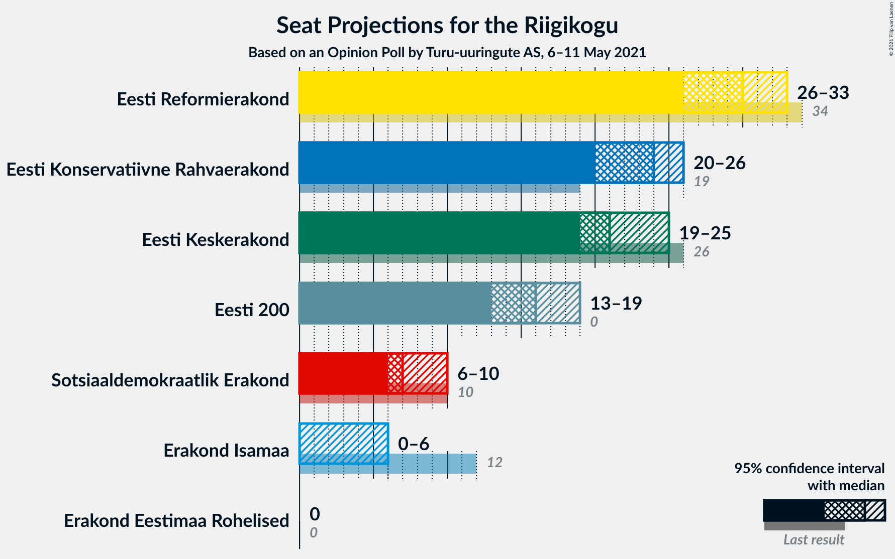

# Opinion Poll by Turu-uuringute AS, 6–11 May 2021

<a href="#voting-intentions">Voting Intentions</a> | <a href="#seats">Seats</a> | <a href="#coalitions">Coalitions</a> | <a href="#technical-information">Technical Information</a>

## Voting Intentions

### Confidence Intervals

| Party | Last Result | Poll Result | 80% Confidence Interval | 90% Confidence Interval | 95% Confidence Interval | 99% Confidence Interval |
|:-----:|:-----------:|:-----------:|:-----------------------:|:-----------------------:|:-----------------------:|:-----------------------:|
| Eesti Reformierakond | 28.9% | 26.0% | 24.3–27.9% |23.8–28.4% |23.4–28.9% |22.6–29.8% |
| Eesti Konservatiivne Rahvaerakond | 17.8% | 21.0% | 19.4–22.7% |18.9–23.2% |18.5–23.6% |17.8–24.4% |
| Eesti Keskerakond | 23.1% | 20.0% | 18.4–21.7% |18.0–22.1% |17.6–22.6% |16.9–23.4% |
| Eesti 200 | 4.4% | 15.0% | 13.6–16.5% |13.2–16.9% |12.9–17.3% |12.3–18.1% |
| Sotsiaaldemokraatlik Erakond | 9.8% | 8.0% | 7.0–9.2% |6.7–9.5% |6.5–9.8% |6.0–10.4% |
| Erakond Isamaa | 11.4% | 5.0% | 4.2–6.0% |4.0–6.3% |3.8–6.5% |3.5–7.0% |
| Erakond Eestimaa Rohelised | 1.8% | 2.0% | 1.5–2.7% |1.4–2.9% |1.3–3.1% |1.1–3.4% |

*Note:* The poll result column reflects the actual value used in the calculations. Published results may vary slightly, and in addition be rounded to fewer digits.

## Seats

### Confidence Intervals

| Party | Last Result | Median | 80% Confidence Interval | 90% Confidence Interval | 95% Confidence Interval | 99% Confidence Interval |
|:-----:|:-----------:|:------:|:-----------------------:|:-----------------------:|:-----------------------:|:-----------------------:|
| <a href="#eesti-reformierakond">Eesti Reformierakond</a> | 34 | 30 | 27–32 |27–33 |26–33 |25–35 |
| <a href="#eesti-konservatiivne-rahvaerakond">Eesti Konservatiivne Rahvaerakond</a> | 19 | 24 | 21–26 |20–26 |20–26 |19–28 |
| <a href="#eesti-keskerakond">Eesti Keskerakond</a> | 26 | 21 | 20–24 |19–25 |19–25 |18–27 |
| <a href="#eesti-200">Eesti 200</a> | 0 | 16 | 14–18 |14–18 |13–19 |13–20 |
| <a href="#sotsiaaldemokraatlik-erakond">Sotsiaaldemokraatlik Erakond</a> | 10 | 7 | 6–9 |6–10 |6–10 |5–11 |
| <a href="#erakond-isamaa">Erakond Isamaa</a> | 12 | 0 | 0–5 |0–6 |0–6 |0–6 |
| <a href="#erakond-eestimaa-rohelised">Erakond Eestimaa Rohelised</a> | 0 | 0 | 0 |0 |0 |0 |

### Eesti Reformierakond

*For a full overview of the results for this party, see the [Eesti Reformierakond](party-eestireformierakond.html) page.*

| Number of Seats | Probability | Accumulated | Special Marks |
|:---------------:|:-----------:|:-----------:|:-------------:|
| 24 | 0.2% | 100% |  |
| 25 | 0.7% | 99.8% |  |
| 26 | 3% | 99.1% |  |
| 27 | 10% | 96% |  |
| 28 | 16% | 86% |  |
| 29 | 13% | 70% |  |
| 30 | 22% | 57% | Median |
| 31 | 23% | 34% |  |
| 32 | 5% | 11% |  |
| 33 | 4% | 6% |  |
| 34 | 1.2% | 2% | Last Result |
| 35 | 0.6% | 0.8% |  |
| 36 | 0.1% | 0.2% |  |
| 37 | 0% | 0% |  |

### Eesti Konservatiivne Rahvaerakond

*For a full overview of the results for this party, see the [Eesti Konservatiivne Rahvaerakond](party-eestikonservatiivnerahvaerakond.html) page.*

| Number of Seats | Probability | Accumulated | Special Marks |
|:---------------:|:-----------:|:-----------:|:-------------:|
| 18 | 0.2% | 100% |  |
| 19 | 2% | 99.8% | Last Result |
| 20 | 5% | 98% |  |
| 21 | 11% | 93% |  |
| 22 | 7% | 82% |  |
| 23 | 12% | 75% |  |
| 24 | 15% | 63% | Median |
| 25 | 23% | 49% |  |
| 26 | 24% | 26% |  |
| 27 | 1.4% | 2% |  |
| 28 | 0.6% | 0.7% |  |
| 29 | 0.1% | 0.1% |  |
| 30 | 0% | 0% |  |

### Eesti Keskerakond

*For a full overview of the results for this party, see the [Eesti Keskerakond](party-eestikeskerakond.html) page.*

| Number of Seats | Probability | Accumulated | Special Marks |
|:---------------:|:-----------:|:-----------:|:-------------:|
| 17 | 0.1% | 100% |  |
| 18 | 2% | 99.8% |  |
| 19 | 6% | 98% |  |
| 20 | 13% | 92% |  |
| 21 | 29% | 78% | Median |
| 22 | 22% | 49% |  |
| 23 | 11% | 27% |  |
| 24 | 11% | 16% |  |
| 25 | 3% | 5% |  |
| 26 | 2% | 2% | Last Result |
| 27 | 0.8% | 0.9% |  |
| 28 | 0.1% | 0.1% |  |
| 29 | 0% | 0% |  |

### Eesti 200

*For a full overview of the results for this party, see the [Eesti 200](party-eesti200.html) page.*

| Number of Seats | Probability | Accumulated | Special Marks |
|:---------------:|:-----------:|:-----------:|:-------------:|
| 0 | 0% | 100% | Last Result |
| 1 | 0% | 100% |  |
| 2 | 0% | 100% |  |
| 3 | 0% | 100% |  |
| 4 | 0% | 100% |  |
| 5 | 0% | 100% |  |
| 6 | 0% | 100% |  |
| 7 | 0% | 100% |  |
| 8 | 0% | 100% |  |
| 9 | 0% | 100% |  |
| 10 | 0% | 100% |  |
| 11 | 0% | 100% |  |
| 12 | 0.5% | 100% |  |
| 13 | 4% | 99.5% |  |
| 14 | 11% | 96% |  |
| 15 | 23% | 84% |  |
| 16 | 28% | 62% | Median |
| 17 | 22% | 33% |  |
| 18 | 9% | 11% |  |
| 19 | 2% | 3% |  |
| 20 | 0.6% | 0.7% |  |
| 21 | 0.1% | 0.1% |  |
| 22 | 0% | 0% |  |

### Sotsiaaldemokraatlik Erakond

*For a full overview of the results for this party, see the [Sotsiaaldemokraatlik Erakond](party-sotsiaaldemokraatlikerakond.html) page.*

| Number of Seats | Probability | Accumulated | Special Marks |
|:---------------:|:-----------:|:-----------:|:-------------:|
| 5 | 1.1% | 100% |  |
| 6 | 15% | 98.9% |  |
| 7 | 43% | 84% | Median |
| 8 | 26% | 41% |  |
| 9 | 10% | 16% |  |
| 10 | 5% | 6% | Last Result |
| 11 | 0.9% | 1.0% |  |
| 12 | 0% | 0% |  |

### Erakond Isamaa

*For a full overview of the results for this party, see the [Erakond Isamaa](party-erakondisamaa.html) page.*

| Number of Seats | Probability | Accumulated | Special Marks |
|:---------------:|:-----------:|:-----------:|:-------------:|
| 0 | 50% | 100% | Median |
| 1 | 0% | 50% |  |
| 2 | 0% | 50% |  |
| 3 | 0% | 50% |  |
| 4 | 11% | 50% |  |
| 5 | 33% | 39% |  |
| 6 | 6% | 6% |  |
| 7 | 0.3% | 0.3% |  |
| 8 | 0% | 0% |  |
| 9 | 0% | 0% |  |
| 10 | 0% | 0% |  |
| 11 | 0% | 0% |  |
| 12 | 0% | 0% | Last Result |

### Erakond Eestimaa Rohelised

*For a full overview of the results for this party, see the [Erakond Eestimaa Rohelised](party-erakondeestimaarohelised.html) page.*

| Number of Seats | Probability | Accumulated | Special Marks |
|:---------------:|:-----------:|:-----------:|:-------------:|
| 0 | 100% | 100% | Last Result, Median |

## Coalitions

### Confidence Intervals

| Coalition | Last Result | Median | Majority? | 80% Confidence Interval | 90% Confidence Interval | 95% Confidence Interval | 99% Confidence Interval |
|:---------:|:-----------:|:------:|:---------:|:-----------------------:|:-----------------------:|:-----------------------:|:-----------------------:|
| Eesti Reformierakond – Eesti Konservatiivne Rahvaerakond – Eesti Keskerakond | 79 | 75 | 100% | 72–78 | 71–79 | 70–80 | 69–81 |
| Eesti Reformierakond – Eesti Konservatiivne Rahvaerakond – Erakond Isamaa | 65 | 56 | 98% | 53–59 | 51–59 | 51–60 | 50–61 |
| Eesti Reformierakond – Eesti Konservatiivne Rahvaerakond | 53 | 54 | 87% | 50–57 | 49–57 | 48–58 | 47–59 |
| Eesti Reformierakond – Eesti Keskerakond | 60 | 52 | 64% | 48–54 | 48–55 | 47–56 | 46–58 |
| Eesti Konservatiivne Rahvaerakond – Eesti Keskerakond – Erakond Isamaa | 57 | 48 | 16% | 45–51 | 44–52 | 43–52 | 42–53 |
| Eesti Konservatiivne Rahvaerakond – Eesti Keskerakond | 45 | 46 | 0.8% | 43–48 | 42–49 | 41–50 | 40–51 |
| Eesti Reformierakond – Sotsiaaldemokraatlik Erakond – Erakond Isamaa | 56 | 40 | 0% | 36–43 | 36–43 | 35–44 | 34–46 |
| Eesti Reformierakond – Sotsiaaldemokraatlik Erakond | 44 | 37 | 0% | 35–40 | 34–41 | 33–41 | 32–43 |
| Eesti Keskerakond – Sotsiaaldemokraatlik Erakond – Erakond Isamaa | 48 | 32 | 0% | 28–36 | 28–36 | 27–37 | 27–38 |
| Eesti Reformierakond – Erakond Isamaa | 46 | 32 | 0% | 29–35 | 28–36 | 28–36 | 27–38 |
| Eesti Konservatiivne Rahvaerakond – Sotsiaaldemokraatlik Erakond | 29 | 32 | 0% | 29–34 | 28–34 | 27–34 | 26–37 |
| Eesti Keskerakond – Sotsiaaldemokraatlik Erakond | 36 | 29 | 0% | 27–32 | 26–33 | 26–34 | 25–35 |

### Eesti Reformierakond – Eesti Konservatiivne Rahvaerakond – Eesti Keskerakond

| Number of Seats | Probability | Accumulated | Special Marks |
|:---------------:|:-----------:|:-----------:|:-------------:|
| 68 | 0.2% | 100% |  |
| 69 | 0.5% | 99.8% |  |
| 70 | 2% | 99.3% |  |
| 71 | 3% | 97% |  |
| 72 | 10% | 94% |  |
| 73 | 14% | 84% |  |
| 74 | 9% | 69% |  |
| 75 | 16% | 60% | Median |
| 76 | 8% | 44% |  |
| 77 | 14% | 36% |  |
| 78 | 13% | 22% |  |
| 79 | 6% | 9% | Last Result |
| 80 | 2% | 3% |  |
| 81 | 0.5% | 0.7% |  |
| 82 | 0.1% | 0.1% |  |
| 83 | 0% | 0% |  |

### Eesti Reformierakond – Eesti Konservatiivne Rahvaerakond – Erakond Isamaa

| Number of Seats | Probability | Accumulated | Special Marks |
|:---------------:|:-----------:|:-----------:|:-------------:|
| 48 | 0.1% | 100% |  |
| 49 | 0.3% | 99.9% |  |
| 50 | 1.5% | 99.6% |  |
| 51 | 3% | 98% | Majority |
| 52 | 5% | 95% |  |
| 53 | 5% | 90% |  |
| 54 | 11% | 85% | Median |
| 55 | 12% | 74% |  |
| 56 | 16% | 62% |  |
| 57 | 21% | 46% |  |
| 58 | 11% | 25% |  |
| 59 | 9% | 14% |  |
| 60 | 4% | 5% |  |
| 61 | 0.8% | 0.9% |  |
| 62 | 0.1% | 0.1% |  |
| 63 | 0% | 0% |  |
| 64 | 0% | 0% |  |
| 65 | 0% | 0% | Last Result |

### Eesti Reformierakond – Eesti Konservatiivne Rahvaerakond

| Number of Seats | Probability | Accumulated | Special Marks |
|:---------------:|:-----------:|:-----------:|:-------------:|
| 46 | 0.3% | 100% |  |
| 47 | 0.8% | 99.7% |  |
| 48 | 2% | 98.9% |  |
| 49 | 6% | 97% |  |
| 50 | 4% | 91% |  |
| 51 | 9% | 87% | Majority |
| 52 | 15% | 78% |  |
| 53 | 12% | 64% | Last Result |
| 54 | 15% | 52% | Median |
| 55 | 10% | 37% |  |
| 56 | 13% | 27% |  |
| 57 | 9% | 13% |  |
| 58 | 3% | 4% |  |
| 59 | 0.5% | 0.6% |  |
| 60 | 0.2% | 0.2% |  |
| 61 | 0% | 0% |  |

### Eesti Reformierakond – Eesti Keskerakond

| Number of Seats | Probability | Accumulated | Special Marks |
|:---------------:|:-----------:|:-----------:|:-------------:|
| 44 | 0.1% | 100% |  |
| 45 | 0.2% | 99.9% |  |
| 46 | 0.9% | 99.8% |  |
| 47 | 3% | 98.9% |  |
| 48 | 10% | 96% |  |
| 49 | 9% | 86% |  |
| 50 | 13% | 77% |  |
| 51 | 14% | 64% | Median, Majority |
| 52 | 26% | 51% |  |
| 53 | 7% | 25% |  |
| 54 | 9% | 18% |  |
| 55 | 5% | 9% |  |
| 56 | 2% | 4% |  |
| 57 | 1.0% | 2% |  |
| 58 | 0.4% | 0.5% |  |
| 59 | 0.1% | 0.1% |  |
| 60 | 0% | 0% | Last Result |

### Eesti Konservatiivne Rahvaerakond – Eesti Keskerakond – Erakond Isamaa

| Number of Seats | Probability | Accumulated | Special Marks |
|:---------------:|:-----------:|:-----------:|:-------------:|
| 41 | 0.2% | 100% |  |
| 42 | 0.8% | 99.8% |  |
| 43 | 2% | 99.0% |  |
| 44 | 4% | 97% |  |
| 45 | 5% | 93% | Median |
| 46 | 11% | 88% |  |
| 47 | 19% | 76% |  |
| 48 | 14% | 57% |  |
| 49 | 20% | 44% |  |
| 50 | 8% | 23% |  |
| 51 | 9% | 16% | Majority |
| 52 | 5% | 7% |  |
| 53 | 1.5% | 2% |  |
| 54 | 0.3% | 0.4% |  |
| 55 | 0.1% | 0.1% |  |
| 56 | 0% | 0% |  |
| 57 | 0% | 0% | Last Result |

### Eesti Konservatiivne Rahvaerakond – Eesti Keskerakond

| Number of Seats | Probability | Accumulated | Special Marks |
|:---------------:|:-----------:|:-----------:|:-------------:|
| 38 | 0.1% | 100% |  |
| 39 | 0.2% | 99.9% |  |
| 40 | 1.0% | 99.7% |  |
| 41 | 2% | 98.8% |  |
| 42 | 6% | 97% |  |
| 43 | 7% | 91% |  |
| 44 | 16% | 84% |  |
| 45 | 15% | 68% | Last Result, Median |
| 46 | 18% | 53% |  |
| 47 | 16% | 35% |  |
| 48 | 11% | 19% |  |
| 49 | 5% | 8% |  |
| 50 | 2% | 3% |  |
| 51 | 0.6% | 0.8% | Majority |
| 52 | 0.2% | 0.2% |  |
| 53 | 0% | 0% |  |

### Eesti Reformierakond – Sotsiaaldemokraatlik Erakond – Erakond Isamaa

| Number of Seats | Probability | Accumulated | Special Marks |
|:---------------:|:-----------:|:-----------:|:-------------:|
| 33 | 0.2% | 100% |  |
| 34 | 1.0% | 99.7% |  |
| 35 | 2% | 98.8% |  |
| 36 | 7% | 97% |  |
| 37 | 8% | 90% | Median |
| 38 | 21% | 82% |  |
| 39 | 8% | 60% |  |
| 40 | 19% | 52% |  |
| 41 | 11% | 33% |  |
| 42 | 11% | 22% |  |
| 43 | 7% | 12% |  |
| 44 | 3% | 4% |  |
| 45 | 1.1% | 2% |  |
| 46 | 0.5% | 0.6% |  |
| 47 | 0.1% | 0.1% |  |
| 48 | 0% | 0% |  |
| 49 | 0% | 0% |  |
| 50 | 0% | 0% |  |
| 51 | 0% | 0% | Majority |
| 52 | 0% | 0% |  |
| 53 | 0% | 0% |  |
| 54 | 0% | 0% |  |
| 55 | 0% | 0% |  |
| 56 | 0% | 0% | Last Result |

### Eesti Reformierakond – Sotsiaaldemokraatlik Erakond

| Number of Seats | Probability | Accumulated | Special Marks |
|:---------------:|:-----------:|:-----------:|:-------------:|
| 31 | 0.2% | 100% |  |
| 32 | 0.7% | 99.8% |  |
| 33 | 3% | 99.2% |  |
| 34 | 5% | 96% |  |
| 35 | 12% | 90% |  |
| 36 | 18% | 78% |  |
| 37 | 15% | 60% | Median |
| 38 | 25% | 45% |  |
| 39 | 8% | 19% |  |
| 40 | 7% | 12% |  |
| 41 | 3% | 5% |  |
| 42 | 2% | 2% |  |
| 43 | 0.5% | 0.6% |  |
| 44 | 0.1% | 0.1% | Last Result |
| 45 | 0% | 0% |  |

### Eesti Keskerakond – Sotsiaaldemokraatlik Erakond – Erakond Isamaa

| Number of Seats | Probability | Accumulated | Special Marks |
|:---------------:|:-----------:|:-----------:|:-------------:|
| 26 | 0.5% | 100% |  |
| 27 | 3% | 99.5% |  |
| 28 | 16% | 97% | Median |
| 29 | 9% | 81% |  |
| 30 | 8% | 72% |  |
| 31 | 10% | 64% |  |
| 32 | 17% | 54% |  |
| 33 | 13% | 37% |  |
| 34 | 9% | 24% |  |
| 35 | 5% | 16% |  |
| 36 | 7% | 11% |  |
| 37 | 2% | 3% |  |
| 38 | 1.1% | 1.5% |  |
| 39 | 0.3% | 0.4% |  |
| 40 | 0% | 0% |  |
| 41 | 0% | 0% |  |
| 42 | 0% | 0% |  |
| 43 | 0% | 0% |  |
| 44 | 0% | 0% |  |
| 45 | 0% | 0% |  |
| 46 | 0% | 0% |  |
| 47 | 0% | 0% |  |
| 48 | 0% | 0% | Last Result |

### Eesti Reformierakond – Erakond Isamaa

| Number of Seats | Probability | Accumulated | Special Marks |
|:---------------:|:-----------:|:-----------:|:-------------:|
| 25 | 0.1% | 100% |  |
| 26 | 0.4% | 99.9% |  |
| 27 | 2% | 99.5% |  |
| 28 | 7% | 98% |  |
| 29 | 4% | 91% |  |
| 30 | 11% | 87% | Median |
| 31 | 21% | 75% |  |
| 32 | 11% | 54% |  |
| 33 | 15% | 44% |  |
| 34 | 12% | 29% |  |
| 35 | 9% | 17% |  |
| 36 | 6% | 8% |  |
| 37 | 1.4% | 2% |  |
| 38 | 0.7% | 0.9% |  |
| 39 | 0.2% | 0.2% |  |
| 40 | 0% | 0.1% |  |
| 41 | 0% | 0% |  |
| 42 | 0% | 0% |  |
| 43 | 0% | 0% |  |
| 44 | 0% | 0% |  |
| 45 | 0% | 0% |  |
| 46 | 0% | 0% | Last Result |

### Eesti Konservatiivne Rahvaerakond – Sotsiaaldemokraatlik Erakond

| Number of Seats | Probability | Accumulated | Special Marks |
|:---------------:|:-----------:|:-----------:|:-------------:|
| 25 | 0.1% | 100% |  |
| 26 | 0.4% | 99.8% |  |
| 27 | 2% | 99.4% |  |
| 28 | 4% | 97% |  |
| 29 | 14% | 93% | Last Result |
| 30 | 13% | 79% |  |
| 31 | 14% | 66% | Median |
| 32 | 20% | 52% |  |
| 33 | 19% | 32% |  |
| 34 | 11% | 13% |  |
| 35 | 1.2% | 2% |  |
| 36 | 0.6% | 1.2% |  |
| 37 | 0.4% | 0.5% |  |
| 38 | 0.1% | 0.1% |  |
| 39 | 0% | 0% |  |

### Eesti Keskerakond – Sotsiaaldemokraatlik Erakond

| Number of Seats | Probability | Accumulated | Special Marks |
|:---------------:|:-----------:|:-----------:|:-------------:|
| 24 | 0.1% | 100% |  |
| 25 | 1.1% | 99.9% |  |
| 26 | 5% | 98.8% |  |
| 27 | 15% | 94% |  |
| 28 | 27% | 79% | Median |
| 29 | 16% | 52% |  |
| 30 | 10% | 36% |  |
| 31 | 10% | 26% |  |
| 32 | 8% | 16% |  |
| 33 | 5% | 9% |  |
| 34 | 2% | 4% |  |
| 35 | 2% | 2% |  |
| 36 | 0.1% | 0.2% | Last Result |
| 37 | 0% | 0% |  |

## Technical Information

### Opinion Poll

+ **Polling firm:** Turu-uuringute AS
+ **Commissioner(s):** —
+ **Fieldwork period:** 6–11 May 2021

### Calculations

+ **Sample size:** 1002
+ **Simulations done:** 131,072
+ **Error estimate:** 0.94%

